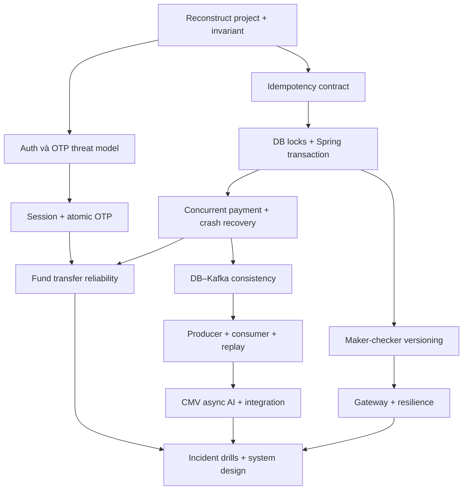

# CV-driven Backend Engineering Roadmap — Nguyễn Quang Ngọc

Bản thiết kế nghiên cứu, 30/09/2026. Nguồn: toàn bộ 4 trang **CV | Nguyễn Quang Ngọc.pdf** được đính kèm. Không sử dụng kết quả ôn tập hay đánh giá năng lực từ các cuộc trò chuyện trước.

Đây là curriculum và backlog, không phải bài giảng hoặc mô tả kiến trúc production đã được xác minh. Các lab dùng dữ liệu giả, dependency giả lập và môi trường riêng; không dùng dữ liệu khách hàng, khóa thật hoặc hệ thống ngân hàng thật.

Quy ước: **[CV FACT]** = CV nói trực tiếp (vẫn là claim, chưa phải bằng chứng kỹ thuật); **[INFERENCE]** = suy luận cần kiểm tra; **[NEED CONFIRMATION]** = CV chưa đủ dữ kiện; **[HYPOTHETICAL]** = thiết kế/lab đề xuất, không phải kinh nghiệm được gán cho bạn. Mọi task, failure scenario, state machine và giải pháp recovery bên dưới là nội dung học **[HYPOTHETICAL]**, trừ phần trích claim được ghi rõ.

## 1. EXECUTIVE TECHNICAL ASSESSMENT

[CV FACT] Profile thiên về backend tích hợp tài chính/ngân hàng: Java 17, Spring Boot 3, Oracle, Core Banking/ESB, thanh toán, session/device/OTP, gateway và event-driven integration. Có chiều rộng Full Stack, AI integration, workflow nội bộ và delivery tooling.

[INFERENCE] Giá trị kỹ thuật nổi bật nằm ở ranh giới giữa application, database và hệ thống ngoài: trạng thái tiền, tính duy nhất, kết quả không xác định, quyền truy cập và khả năng vận hành. Đây là trục học chính; Java/Spring/DB được đào xuống khi cần chứng minh các flow này.

[NEED CONFIRMATION] CV chưa chứng minh transaction boundary, throughput, latency, mức ownership, cấu hình Kafka, ledger ownership, retry contract, failover topology, cơ chế release hay mức đóng góp vào con số giảm 60%. Không chấm điểm năng lực và không kết luận bạn yếu một chủ đề nào.

Hai claim cần bảo vệ đặc biệt: “thiết kế idempotency/duplicate prevention” và “thiết kế & triển khai Microservices/EDA, hiệu năng/mở rộng cao”. Cần artifacts và thí nghiệm, không chỉ định nghĩa. Cụm “ECDH Encryption” cần kiểm chứng cách gọi: nghiên cứu phân biệt key agreement với thuật toán mã hóa dữ liệu; không mặc định cách triển khai thực tế sai.

## 2. CV CLAIM INVENTORY

Mỗi mã Cxx là một nhóm claim có cùng ngữ cảnh; các thành phần được tách thành task cụ thể ở mục 12. Trang là số trang trong PDF.

| ID | [CV FACT] Claim cần nghiên cứu | Trang | Giới hạn bằng chứng |
|---|---|---:|---|
| C01 | Java 17, Spring Boot 3; Java Core, Spring Framework/Web MVC/Security | 1,3 | Không có phiên bản patch, cấu hình JVM hoặc code |
| C02 | Hibernate, MyBatis; Oracle, PostgreSQL, MySQL, SQL Server | 1 | MyBatis/MySQL/SQL Server chưa được gắn project |
| C03 | Microservices, Spring Cloud, Gateway, Feign, Eureka, Resilience4j | 1,3 | Topology, phiên bản, SLA chưa rõ |
| C04 | Docker, Kubernetes, GitLab CI/CD, Jenkins, Git/GitHub/GitLab | 1 | Chưa rõ trực tiếp vận hành hay sử dụng pipeline |
| C05 | ELK, Elasticsearch, Kibana, Actuator/Micrometer/Prometheus | 1,4 | ELK gắn CMV; công cụ khác chưa gắn project |
| C06 | Keycloak/OAuth2 OIDC, ECDH Encryption, RSA Encryption, reCAPTCHA v3 | 1 | ECDH/RSA/reCAPTCHA chưa gắn flow cụ thể |
| C07 | ReactJS, Thymeleaf, JSP/Servlet, HTML/CSS | 1,4 | ReactJS gắn CMV; phần còn lại cần xác nhận |
| C08 | GOV API TTTT: create transaction/QR, status, receipt, inquiry, refund, disbursement, reconciliation | 2,3 | Spec TTTT và semantics từng endpoint chưa được cung cấp |
| C09 | GOV request-ID idempotency, duplicate bill prevention, alias account bằng Oracle sequence + unique constraint | 3 | Key scope, schema, TTL và transaction boundary chưa rõ |
| C10 | GOV ESB/Core Banking Oracle/Napas/Ebank/Signature Service; JWT token cache, service signature, request/response signing | 2,3 | Giao thức, crypto algorithm, ownership chưa rõ |
| C11 | GOV service/use-case layer, transfer strategy, retry failed Kafka messages | 2 | CV không nói Outbox, retry topic, DLQ hoặc Saga |
| C12 | GOV Java 17, Boot 3, MVC, Oracle, Spring Data JPA, JdbcTemplate, Kafka, RestTemplate | 3 | Phiên bản Oracle/Kafka/JPA và client HTTP chưa rõ |
| C13 | SAHA Identity, Account, Fund Transfer; JWT, refresh token, Redis session, device binding, lockout, trusted-device OTP | 2,3 | Session model, trust establishment, token storage chưa rõ |
| C14 | SAHA OTP/SMS: expiry, retry attempt, resend rate limit, masked logging | 3 | Atomic consume và provider retry contract chưa rõ |
| C15 | SAHA Oracle Core Banking/EBANK stored procedures, REF CURSOR, reusable executor, response mapping | 3 | Procedure commit semantics, cursor/resource ownership chưa rõ |
| C16 | SAHA TCP Core Banking; USD/KHR; i18n EN/VI/KM; beneficiary/fund transfer | 2 | Protocol framing, FX scope, ledger ownership chưa rõ |
| C17 | Debit Gateway: Keycloak JWT validation, public/admin, Redis/Bucket4j, Resilience4j | 3 | Reactive/servlet runtime, rate policy và failure policy chưa rõ |
| C18 | Debit asset search/detail/admin CRUD, filters, approval, attachment, view tracking | 3 | Query/data model, attachment lifecycle chưa rõ |
| C19 | Debit Maker-Checker notice/content, audit trail, separation of duties | 3 | State machine, versioning, audit tamper resistance chưa rõ |
| C20 | Debit MinIO file service và report module; Apache POI/iText là core skills | 1 | POI/iText có được dùng trong report này không cần xác nhận |
| C21 | CMV Microservices + Kafka EDA tích hợp CMS/kho hàng | 2,4 | Event schema, ordering, routing, delivery guarantee chưa rõ |
| C22 | CMV AI trích xuất dữ liệu và image duplicate detection, giảm 60% nhập tay | 1,2,4 | Baseline, sample, đo lường, false positive/negative chưa rõ |
| C23 | CMV Spring Boot, ReactJS, Kafka, OracleDB, Redis, Apigee, Pentaho PDI, ELK | 4 | Vai trò Pentaho, Redis và Apigee policy cụ thể chưa rõ |
| C24 | MyBV Life: payment qua Napas, e-Contract API, đồng bộ IMS | 2 | Stack/topology/semantics chưa rõ |
| C25 | Veritas: đặt lịch khám, phân công bác sĩ, quản lý lịch hẹn | 2 | Locking/overlap policy chưa rõ |
| C26 | Hywork: quản lý chỗ ngồi, đồng bộ nhân sự AMIS | 2 | Booking conflict, identity mapping, sync strategy chưa rõ |

## 3. PROJECT INVENTORY

| Mã | Project/thời gian trong CV | Responsibility [CV FACT] | Trọng tâm nghiên cứu |
|---|---|---|---|
| GOV | GOV Payment, 05/2026–Nay | Backend; API payment, integration, idempotency | Tính đúng của tiền, unknown result, recovery |
| SAHA | SHB SAHA, 01–06/2026 | Backend; Identity/Account/Fund Transfer, OTP, Oracle/TCP | Session/device security và fund transfer |
| DEBIT | SHB Debit Collection, 11/2025–01/2026 | Backend; gateway, assets, workflow; file/report | Authorization, resilience, concurrency |
| CMV | CMV MBBank, 05/2023–10/2025 | Full Stack; Microservices/EDA, AI | Event reliability, integration, evidence của 60% |
| MYBV | MyBV Life, 11/2022–05/2023 | Backend payment/e-Contract/IMS | Reuse payment/sync principles |
| VER | Veritas, thuộc giai đoạn 11/2021–11/2022 | Full Stack; lịch khám/bác sĩ | Booking invariant, concurrent allocation |
| HYW | Hywork, thuộc giai đoạn 11/2021–11/2022 | Full Stack; chỗ ngồi/AMIS | Resource ownership và incremental sync |

Không suy từ job title rằng bạn sở hữu toàn hệ thống. Task reconstruction phải chia: tự thiết kế / tự code / cùng team / chỉ tích hợp / chỉ biết qua vận hành.

### Reconstruction cho từng project

Các component dưới đây chỉ là danh sách CV xác nhận; **mọi đường nối và trình tự phải được bạn xác nhận**. Không suy rằng DB, Kafka và downstream nằm nối tiếp trong mọi use case.

| Project | Component map [CV FACT] | Data flow giả thuyết [HYPOTHETICAL] |
|---|---|---|
| GOV | GOV service; Oracle; ESB; Core Banking; Napas; Ebank; Signature Service; Kafka | Caller → API/use case → ghi trạng thái local; gọi hệ ngoài theo loại giao dịch; ký/kiểm tra thông điệp; phát/nhận event tại điểm cần xác nhận |
| SAHA | Identity, Account, Fund Transfer; Redis; Oracle Core/EBANK; SMS; TCP integration | Login/session/device → xác nhận OTP → transfer request → adapter banking → cập nhật/query trạng thái |
| DEBIT | Gateway, Keycloak, Eureka, OpenFeign, PostgreSQL, Redis/Bucket4j, Resilience4j, MinIO | Public/admin request → gateway policy → API → workflow/DB; file đi qua file service; report là luồng riêng |
| CMV | Microservices, Kafka, Oracle, Redis, Apigee, AI integration, CMS/kho hàng, Pentaho PDI, ELK, React | Người dùng/tích hợp → nghiệp vụ tài sản → job/event → AI/CMS/kho hàng → cập nhật kết quả; vị trí Pentaho cần xác nhận |
| MYBV | Napas Gateway, IMS, API payment/e-Contract | Contract/payment request → API → Napas hoặc IMS; cơ chế sync cần xác nhận |
| VER | Module lịch khám, phân công bác sĩ | Booking → kiểm tra slot → giữ/chốt lịch [HYPOTHETICAL] |
| HYW | Quản lý chỗ ngồi, AMIS sync | Booking seat hoặc AMIS change → mapping nhân sự → cập nhật [HYPOTHETICAL] |
| Project | 1–3: Business context, actors, core use cases | 4–6: Architecture, component map, data flow | 7–9: Transaction/trust boundary, dependencies | 10–14: Failure, security, performance, scale, observability |
|---|---|---|---|---|
| GOV | [CV FACT] Trung gian DVC Quốc gia–SHB; API TTTT. [INFERENCE] caller DVC, đối tác và vận hành đối soát | Dùng bảng component phía trên; dựng sequence riêng create/status/refund/disbursement/reconcile | [NEED CONFIRMATION] Transaction local; ai debit/credit; Oracle local khác Core Oracle thế nào; ESB có retry? Trust caller/service/bank/signature | Duplicate bill/money; forged/replayed request; unique-key contention; pool saturation; scale phụ thuộc bank; đo unknown-age, duplicate rejection, discrepancy, p95 theo operation |
| SAHA | [CV FACT] Mobile banking Cambodia. [INFERENCE] khách hàng, thiết bị, operator | Dựng login và transfer thành 2 sequence riêng, không ép OTP vào mọi request | [NEED CONFIRMATION] Service nào sở hữu session; DB nào thuộc service; SP tự commit? SMS/TCP contract | Token theft, device spoof, OTP replay; Redis mất; cursor leak; transfer unknown; scale SMS/Core; đo login failure, refresh replay, OTP verify/resend, session miss |
| DEBIT | [CV FACT] Xử lý nợ/thanh lý/nội dung website. Public/admin, maker/checker là vai trò phải xác minh | Tách read public, admin mutation, approval, upload và report | [NEED CONFIRMATION] Policy ở gateway/service; workflow transaction; file/DB boundary; Keycloak/JWKS/Eureka dependencies | Double approve/IDOR; rate limiter split; slow filters/report; gateway saturation; đo 401/403/429/5xx, workflow conflicts, file orphan |
| CMV | [CV FACT] Thẩm định tài sản, AI extraction/image duplicate; CMS/kho hàng. [INFERENCE] cán bộ thẩm định và reviewer | Vẽ từng event producer/consumer, AI request/result, ETL và request synchronous | [NEED CONFIRMATION] Topic ownership; result acceptance transaction; AI trust; CMS/kho hàng contracts | Duplicate/out-of-order event; stale AI overwrites; PII logs; lag/AI backlog; partition bottleneck; trace event lineage, lag age, review corrections |
| MYBV | [CV FACT] Bảo hiểm online, payment/e-Contract. [INFERENCE] khách hàng/ops | Dựng 2 sequence payment và IMS sync | [NEED CONFIRMATION] Local/IMS source of truth; Napas contract; e-Contract authorization | Paid-but-unissued, duplicate callback; unauthorized contract download; sync backlog; payment discrepancy, contract state age |
| VER | [CV FACT] Lịch khám/phân công bác sĩ. [INFERENCE] lễ tân/bác sĩ | Booking, reschedule, cancel sequence đề xuất | [NEED CONFIRMATION] DB/stack, timezone, slot model, transaction owner | Double booking, schedule edit race, private patient data; hot slot; slot conflicts, lock wait, booking p95 |
| HYW | [CV FACT] Chỗ ngồi, AMIS nhân sự. [INFERENCE] nhân viên/admin | Seat booking và HR sync độc lập | [NEED CONFIRMATION] Stack, employee ID mapping, incremental watermark, delete policy | Double reservation, removed employee still authorized, partial sync; batch burst; sync age/count mismatch/conflicts |

### Confirmation register — ghi câu trả lời vào task, chưa cần chặn roadmap

Q01: Mỗi project bạn trực tiếp sở hữu component nào? Q02: Patch versions Java/Boot/Oracle/Postgres/Kafka/Redis/Keycloak? Q03: Schema/unique keys và transaction boundaries? Q04: Contract request-ID/TTL/fingerprint? Q05: Downstream hỗ trợ lookup/idempotency theo khóa nào? Q06: Status và reconciliation authority? Q07: Kafka publish/retry/offset commit và topic schemas? Q08: Redis topology/persistence/session fail policy? Q09: JWT/refresh/device/key lifecycle? Q10: SP có commit nội bộ và TCP framing ra sao? Q11: Gateway runtime và retry/timeouts? Q12: Workflow states và maker/checker policy? Q13: Cơ sở đo 60%, AI model/service và pipeline? Q14: SLO/load/incident evidence? Q15: DevOps/observability/crypto skill gắn project nào? Q16: MinIO/report/Pentaho/MyBatis scope? Q17: Môi trường lab và số giờ học/tuần?

## 4. PROJECT → TECH STACK MAP

| Project | Stack được CV xác nhận | Không được mặc định |
|---|---|---|
| GOV | Java17/Boot3/MVC/Oracle/JPA/JdbcTemplate/Kafka/RestTemplate, hệ tích hợp C10 | Redis cho JWT cache; Outbox; Saga; Kafka transactions; local ledger |
| SAHA | Java17/Boot3/Security/Oracle/PLSQL/JdbcTemplate/Redis/JWT Nimbus JOSE; TCP/SMS | Kafka; Keycloak; refresh rotation; encryption thuật toán cụ thể |
| DEBIT | Java17/Boot/Gateway/Eureka/Feign/Keycloak OIDC/Postgres/Redis/Bucket4j/Resilience4j; MinIO/report | Kafka; exact workflow states; gateway reactor runtime; POI/iText gắn report |
| CMV | Boot/React/Kafka/Oracle/Redis/Apigee/Pentaho/ELK; AI/CMS/kho hàng | Java17/Boot3; vector DB; OCR vendor; DLQ/Outbox đã dùng |
| MYBV/VER/HYW | Domain/integration C24–C26 | Bất kỳ stack cụ thể nào chưa được ghi |
| Chưa gắn project | MyBatis/MySQL/SQLServer/Thymeleaf/JSP/Servlet/POI/iText/ECDH/RSA/reCAPTCHA/Docker/K8s/CI/Micrometer/Prometheus | Production ownership; có dùng đồng thời tất cả công nghệ |

## 5. PROJECT → ENGINEERING CONCEPT MAP

| Project | Problem → concept → bằng chứng cần tự tạo |
|---|---|
| GOV | Tiền không được xử lý hai lần → business identity, idempotency, DB locks → concurrent/crash matrix; local state khác bank → unknown result/reconciliation → recovery runbook; DB–Kafka → delivery contract → fault injection |
| SAHA | Danh tính + thiết bị + quyền chuyển tiền → token/session/device state → threat model; OTP một lần → atomic consume/version → race lab; Core result → financial invariants → timeout drill |
| DEBIT | Public/admin → layered authorization → bypass tests; dependency chậm → budgets/bulkhead → saturation lab; maker/checker → state/version/SoD → race tests |
| CMV | Async integrations → partition/offset/idempotency/schema → failure lab; AI chậm/sai → asynchronous result version/confidence/manual review → evaluation report |
| MYBV | Payment↔policy/e-Contract consistency → authority/reconciliation → state mismatch lab |
| VER/HYW | Resource không được cấp hai lần → interval/resource invariant → concurrent booking; HR sync → identity/version/watermark → replay lab |

## 6. CV KNOWLEDGE GRAPH

Mỗi hàng là một đường đi có truy vết, không phải khẳng định topology production.

| Project → Flow | Technology [CV FACT] | Concept cần nghiên cứu | Internals cần kiểm chứng | Failure scenario |
|---|---|---|---|---|
| GOV → create | Oracle/JPA/JdbcTemplate | Idempotency + business uniqueness | Unique index wait, visibility, commit | 100 request cùng key; 2 key cùng bill |
| GOV → downstream transfer | RestTemplate/ESB/Core | Unknown outcome | Connect/read deadline, correlation, adapter mapping | Debit xong mất response |
| GOV → failed message retry | Kafka | Producer vs consumer duplicate scope | PID/sequence, offsets, transaction boundaries | ACK mất; DB commit rồi crash |
| GOV → signing | Signature Service/JWT cache | Authenticity + replay defense | Canonical bytes/key IDs/token refresh contention | Body đổi sau signing; stale key |
| SAHA → login/refresh | Security/Nimbus/Redis | Session/token lifecycle | Filter chain, signature validation, atomic rotation proposal | Stolen token; Redis lost |
| SAHA → OTP transfer | Redis/SMS | One-time authorization | Atomic consume, attempts, challenge binding | Concurrent verify; SMS timeout |
| SAHA → account/transfer | PLSQL/REF CURSOR/TCP | Resource + transaction ownership | JDBC bind/cursor lifecycle, framing | Cursor leak; partial TCP response |
| DEBIT → public/admin | Gateway/Keycloak | Trust boundary/policy | JWKS cache, claim mapping/filter order | Key rotation; service bypass |
| DEBIT → traffic policy | Bucket4j/Redis/Resilience4j | Admission + failure isolation | Atomic bucket, sliding windows/breaker state | Redis down, retry storm |
| DEBIT → approval | PostgreSQL | State/version/SoD | Conditional update, optimistic lock | Concurrent approve, stale content |
| CMV → CMS/kho hàng | Kafka/Oracle | EDA/consistency/schema | Partition assignment, commit/rebalance | Duplicate, lag, poison event |
| CMV → AI result | AI integration/Oracle | Async job identity/model result lineage | Version acceptance, dedup similarity thresholds | Old result overwrites new asset |
| CMV → support | ELK/Redis/Apigee/Pentaho | Observability/cache/API/ETL | Index lifecycle, stale writes, checkpoint | Logs missing, stale cache, partial ETL |
| MYBV/VER/HYW → nghiệp vụ | Stack chưa xác nhận | Payment, booking, data sync | Commit visibility, resource invariant, watermark | Paid/issued mismatch, overlap, missed HR delta |

### Knowledge trees — các nhánh phải quay về một claim

- **Java (C01; GOV/SAHA/DEBIT):** value model → OOP/SOLID → immutable/defensive copy → equals/hashCode/generics → Collections/HashMap/ConcurrentHashMap → Stream/Optional/exceptions → JVM/class loading/heap/stack/metaspace/GC → JMM/happens-before/volatile/synchronized/Lock/CAS/atomic → thread/executor/ThreadPoolExecutor/ForkJoinPool/CompletableFuture → CPU/IO sizing/deadline/cancellation/backpressure. Virtual threads: P3, nâng cấp JDK ngoài Java17 của CV.
- **Spring (C01/C12/C13):** IoC/DI → BeanFactory/ApplicationContext → lifecycle/scope/configuration/component/Primary/Qualifier → JDK proxy/CGLIB/AOP → transaction propagation/isolation/rollback/self-invocation → MVC/DispatcherServlet/filter/interceptor/ControllerAdvice/validation → auto-config/properties/Actuator.
- **Database (C02/C09/C12/C15/C19):** relation/PK/FK/check/unique → B+Tree/composite/covering/selectivity/cardinality/plan → ACID/isolation/dirty/non-repeatable/phantom/MVCC → row/optimistic/pessimistic locks/deadlock → sequence/pagination → JDBC/Hikari/pool/query timeout → JPA/Hibernate/persistence context/dirty checking/flush/N+1/fetch → JdbcTemplate/PLSQL/SP/REF CURSOR → MyBatis và khác biệt Oracle/Postgres/MySQL/SQLServer sau khi gắn project.
- **Redis (C13/C17/C23):** structures/TTL → cache-aside/invalidation/staleness → penetration/avalanche/stampede → SET NX PX/owner-safe unlock/expiry/fencing → session/token lifecycle → atomic rate limits → outage/persistence/replication/Sentinel/Cluster conceptual. Không gán Redis vào GOV JWT cache.
- **Kafka (C11/C21):** broker/log/topic/partition/replication/ISR → acks/minISR/retry/PID/sequence/max-in-flight → batching/linger/compression/key/ordering → consumer group/offset/rebalance/lag/backpressure → duplicate/retry topic/DLQ/schema/poison → delivery semantics/transactions/Kafka EOS vs business effects → Outbox/Inbox [HYPOTHETICAL].
- **Security (C06/C10/C13/C17):** authn/authz → SecurityFilterChain → JWT/JWS/JWE/claims/signatures → RSA/ECDH/hash/MAC/HMAC/encryption → OAuth2/OIDC/Keycloak → access/refresh/rotation/revocation/session → CSRF/CORS/XSS/API ownership → replay/nonce/timestamp/request signing → rotation/secrets/OTP.
- **Distributed (C03/C10/C21):** boundaries/sync-async/REST/Feign/discovery/gateway → deadline/retry/backoff/jitter/circuit/bulkhead/rate-limit → partial failure/clock/partition/CAP/consistency → idempotency/Outbox/Inbox/Saga/2PC → backpressure/degradation.
- **Observability (C05/C23):** structured logs/correlation → Micrometer/Prometheus/Actuator metrics → tracing/context propagation → ELK/Elasticsearch/Kibana → SLI/SLO/alerting → business audit khác diagnostic logs.
- **DevOps (C04):** image/container lifecycle → K8s Pod/Deployment/Service/ConfigMap/Secret → liveness/readiness/resources → rolling update/graceful shutdown/HPA → Git/GitLabCI/Jenkins → migration/rollback. Xác nhận ownership trước khi nói đã vận hành.
- **Additional CV (C07/C20/C22/C23/C24–26):** React/Thymeleaf/JSP browser trust → MinIO/file auth → POI/iText export memory → Pentaho checkpoint/ETL → AI extraction/image similarity/evaluation → payment IMS → booking/AMIS sync.

## 7. CV CLAIM STRESS TEST

Mỗi task ở mục 12 cũng là một stress test chi tiết với đủ L1–L7. Bảng sau cho các claim cần ưu tiên.

| CV claim | Project | Knowledge required | Follow-up | Failure question | Internal question | Production question | Lab/task | Depth |
|---|---|---|---|---|---|---|---|---|
| C09 idempotency | GOV | identity/commit/locks | Key scope? | Commit rồi mất response? | Concurrent unique insert? | Unknown state age? | PAY-03–08 | L7 |
| C09 duplicate bill/sequence | GOV | business key/sequence | Hai request ID cùng bill? | Sequence gap/collision? | Index visibility? | Hot bill contention? | PAY-05, DB-07 | L6 |
| C08 payment/refund/chi hộ | GOV | financial state/invariants | Ai là ledger authority? | Double refund? | Conditional update? | Reconcile lệch ai xử lý? | PAY-10–14 | L7 |
| C10 signing/Core | GOV | trust/deadline/crypto | Ký bytes nào? | Bank thành công local fail? | Canonicalization/key IDs? | Audit có chứng minh không? | PAY-09, SEC-05–07 | L7 |
| C11 retry Kafka | GOV | delivery semantics | Retry ở tầng nào? | ACK mất? | PID/offset? | Backlog oldest age? | KAF-02–18 | L7 |
| C13 JWT/Redis/device | SAHA | token/session/state | Trusted-device nghĩa gì? | Redis data lost? | Atomic refresh? | Revocation delay? | AUTH-01–08 | L7 |
| C14 OTP | SAHA | one-time/attempt/rate | Bind transaction? | Verify concurrent? | Atomic consume? | SMS timeout billed twice? | OTP-01–05 | L7 |
| C15 SP/REF CURSOR | SAHA | resource/commit mapping | Ai commit? | Cursor leak? | OUT params/fetch? | Pool pending? | BANK-01–04 | L6 |
| C16 transfer/USD/KHR/TCP | SAHA | money/framing/unknown | FX có trong scope? | Partial TCP reply? | Correlation/reassembly? | Transfer stuck? | BANK-05–07 | L7 |
| C17 gateway/Keycloak | DEBIT | token/filter/deadline | Bypass gateway? | JWKS down? | Key cache/filter chain? | 5xx ở đâu? | GATE-01–08 | L7 |
| C17 rate/resilience | DEBIT | admission/retry/breaker | POST retry an toàn? | Redis mất/retry storm? | Bucket/breaker state? | Rejection vs timeout? | GATE-04–09 | L7 |
| C19 maker-checker | DEBIT | state/SoD/version | Nội dung đổi sau submit? | Double approval? | Conditional write? | Audit completeness? | FLOW-01–04 | L7 |
| C18/C20 file/report | DEBIT | auth/storage/streaming | File orphan? | Upload xong DB fail? | Multipart/streaming? | Heap khi export? | FLOW-05–08 | L6 |
| C21 EDA/microservices | CMV | boundaries/consistency | Tại sao async? | Event out-of-order? | Partitions/rebalance? | Consumer lag cause? | CMV-01–03,KAF-* | L7 |
| C22 AI/60% | CMV | evaluation/lineage | 60% tính sao? | Duplicate/stale result? | Similarity threshold? | FP/FN/manual corrections? | CMV-04–07 | L7 |
| C23 Oracle/Redis/ELK/PDI | CMV | query/cache/ETL/log | Cache source of truth? | ETL partial commit? | Plan/checkpoint/index? | Lag vs ingestion delay? | CMV-08–09,RED-*,OBS-* | L6 |
| C01 Java/Spring | GOV/SAHA/DEBIT | JMM/proxy/tx | Mutable singleton? | Pool exhausted? | happens-before/AOP? | Thread dump evidence? | JAVA-*,SPR-* | L6–7 |
| C02 DB/ORM breadth | nhiều/chưa gắn | dialect/locking/fetch | Oracle khác Postgres? | Deadlock/flush exception? | MVCC/plan? | Query regression? | DB-*,DATA-* | L6 |
| C04 K8s/CI | chưa gắn | resources/lifecycle | Trực tiếp làm gì? | OOM/rollout fail? | probes/SIGTERM? | Rollback schema? | OPS-01–05 | L5–6 |
| C06 crypto/reCAPTCHA | chưa gắn | key agreement/signing/abuse | Chống replay ra sao? | Key compromise? | ECDH KDF/RSA usage? | Rotation evidence? | SEC-01–08 | L6 |
| C07 frontend | CMV/chưa gắn | browser trust/XSS | Token lưu đâu? | Duplicate submit? | Cookie/CORS/CSRF? | Front-back trace? | AUX-01 | L4–5 |
| C24 MyBV | MYBV | payment/sync | IMS authority? | Paid chưa issue? | State/commit? | Reconcile report? | AUX-02 | L6 |
| C25/C26 booking/sync | VER/HYW | uniqueness/interval/version | Overlap/identity? | Double booking/partial sync? | Predicate/locks/watermark? | Conflict/sync age? | AUX-03–04 | L6 |

## 8. KNOWLEDGE GAP / RISK MAP

Đây là **vùng cần VERIFY**, không phải chẩn đoán năng lực hiện tại. Chỉ đổi nhãn thành gap sau checkpoint không đạt hoặc thiếu bằng chứng.

| Mức | Vùng cần VERIFY | Vì sao | Bằng chứng để đóng rủi ro |
|---|---|---|---|
| Critical / P0 | GOV local vs downstream idempotency, unknown state, refund/chi hộ/reconcile | Claim mạnh, tiền và retry trực tiếp | State/transaction diagrams + crash/retry evidence + recovery policy |
| Critical / P0 | SAHA refresh/session/device/OTP binding và fund transfer | Ranh giới quyền chuyển tiền | Threat model + replay/concurrency lab |
| Critical / P0 | DB uniqueness/locks + Spring transaction thực tế | Nền tảng cho hai vùng trên | Hai DB sessions + proxy/rollback tests |
| High / P1 | Kafka reliability/EDA; maker-checker concurrency; gateway policy | Claim thiết kế có nhiều hidden assumptions | Broker/consumer faults + approval race + policy matrix |
| High / P1 | AI 60% và performance/scalability claim | Cần dữ liệu định lượng và attribution | Baseline, sample, metric formula, caveats |
| Medium / P2 | JVM/pool/query/Redis/observability và deployment scope | Quyết định khả năng debug, tùy ownership | Load results, profiles, runbooks, release evidence |
| Nice-to-have / P3 | Virtual threads/multi-region sâu, vendor internals ngoài scope | Không được CV xác nhận | Chỉ học sau các gate P0/P1; không nhận là kinh nghiệm |

## 9. LEARNING TRACKS

| Track | Nội dung | Project neo | Gate |
|---|---|---|---|
| A | Transaction & Consistency | GOV/SAHA/DEBIT | Boundary + race evidence |
| B | Idempotency & Duplicate Prevention | GOV/SAHA/CMV | Retry không lặp business effect |
| C | Concurrency & Race Conditions | GOV/SAHA/DEBIT/VER/HYW | Invariants giữ dưới parallelism |
| D | Kafka Reliability | GOV/CMV | Publish/consume crash replay |
| E | Distributed Transaction | GOV/SAHA/CMV | Unknown vs failed, recovery |
| F | Database Internals | GOV/SAHA/DEBIT/CMV | Plans/locks/pool evidence |
| G | Cache & Redis | SAHA/DEBIT/CMV | Stale/outage/rate/session policy |
| H | Authentication/Security | SAHA/GOV/DEBIT | Replay/revoke/SoD threat tests |
| I | Gateway & Resilience | DEBIT/CMV | Budgets/admission/failure isolation |
| J | Core Banking Integration | GOV/SAHA | Contract mapping/unknown recovery |
| K | Payment Reliability | GOV/SAHA/MYBV | Financial invariant + reconcile |
| L | Observability | CMV, áp dụng đề xuất project khác | Evidence xuyên boundary |
| M | Performance & Scalability | 4 project chính | Bottleneck chứng minh bằng đo |
| N | Production Troubleshooting | 4 project chính | Hypothesis → discriminating evidence |
| O | Java/JVM/Concurrency | Java17 projects | Explain/implement/break/debug |
| P | Spring Internals | Spring projects | Proxy/bean/transaction evidence |

## 10. DEPENDENCY GRAPH

Dependency thể hiện kiến thức cần trước phần implementation; có thể đọc problem của task advanced trước rồi quay về prerequisite. Không có yêu cầu học hết Java mới học payment.

Các ID dependency ở mục 12 là DAG. Không dùng thứ tự chữ cái làm thứ tự học; áp dụng thứ tự mục 18–19.

## 11. MASTER ROADMAP

| Phase | Track → Module | Exit checkpoint |
|---|---|---|
| PH0 | K/J/H/I/D → reconstruct 4 project; ownership/version/evidence register | Facts khác hypotheses; vẽ được normal flow và đánh dấu unknown |
| PH1 | K/B/A/C/F/P → GOV identity, SQL lock/transaction, crash, bank unknown, refund/reconcile | 100 same-key + different-key/same-bill + commit/crash; downstream uncertainty policy |
| PH2 | H/G/J/K → SAHA session/device/OTP, SP/TCP, fund transfer | Replay/concurrent OTP/revoke/outage + unknown transfer recovery |
| PH3 | D/E/F → Kafka producer/consumer, Outbox/Inbox proposals, CMV/AI/ETL | ACK loss/consumer crash/order/schema/slow AI drills |
| PH4 | I/H/C → DEBIT gateway, Keycloak, resilience, maker-checker/file/report | Gateway failure matrix + approval race + file/DB partial failure |
| PH5 | O/P/F/G/M/L → Java/Spring/ORM/query/cache/JVM/observability | Thread/heap/SQL/Redis evidence; fundamentals vẫn được học JIT ở PH1–4 |
| PH6 | N/M → incidents, container/K8s/CI, earlier projects | Runbooks, saturation/rollout exercise, defend ownership |
| PH7 | A–P → system design/cross-project defense | Tự thiết kế current/10x/100x, bảo vệ trade-offs bằng evidence |

Mỗi task có một primary track/module và có thể phục vụ nhiều track. Mini-lab nằm trong giờ task; lab tổng hợp dùng lại giờ các task đã gắn, không tự cộng lần nữa. Không bắt đầu Study Mode trong tài liệu này.

## 12. DETAILED TASK BACKLOG

Mỗi card là một task có thể bắt đầu khi dependencies được đáp ứng; standalone không có nghĩa không cần prerequisite. Các task research có implementation là tạo model/contract/test fixture; không ép viết code khi mục tiêu là xác minh ownership hoặc dữ liệu đo lường.

**Protocol chung cho mọi task:** D0 thực hiện; D1 recall 5 phút; D3 drill 10 phút; D7 đọc lại failure evidence 10 phút; D14 xem lại design 5 phút. 30 phút review đã nằm trong estimate mỗi card. Nếu fail checkpoint, ghi câu hỏi sai và làm lại phần chưa đạt; không lặp toàn bộ task máy móc. Interview drill riêng dùng câu hỏi L1–L7, không cần đủ cả 7 trong một phiên nếu thời lượng không đủ.

**Normal flow rồi failure flow:** viết dự đoán trước khi chạy, chỉ đổi một biến mỗi lần, giữ seed/config/versions và cùng input để so sánh. Lab outcome khác dự đoán phải có giải thích. [HYPOTHETICAL] dùng local mocks, synthetic data, 2 instances khi concurrency relevant. Chỉ claim Oracle behavior đã kiểm chứng nếu đã chạy Oracle; Postgres/H2 không là bằng chứng thay thế.

**Artifact naming:** mỗi task tạo thư mục tương ứng ID gồm notes, diagram, implementation hoặc model, experiment results, ADR compare. Với task đang VERIFY, lưu “CV chưa xác nhận” cho mọi chi tiết không có bằng chứng.

### Task index

| ID | Title | Project | Phase/Track | Priority | Hours |
|---|---|---|---|---|---:|
| PAY-01 | Reconstruct GOV: ownership, authority và normal flow | GOV | PH0/K/J | P0 | 3 |
| PAY-02 | Thiết kế state model và invariant thanh toán | GOV | PH0/K/J | P0 | 3 |
| PAY-03 | Request-ID contract và request fingerprint | GOV | PH1/B/K/A | P0 | 3 |
| PAY-04 | Concurrent claim bằng unique constraint | GOV | PH1/B/K/A | P0 | 5 |
| PAY-05 | Duplicate bill khác request duplicate | GOV | PH1/B/K/A | P0 | 4 |
| PAY-06 | Transaction boundary JPA + JdbcTemplate | GOV | PH1/B/K/A | P0 | 5 |
| PAY-07 | Crash trước/sau commit và response replay | GOV | PH1/B/K/A | P0 | 5 |
| PAY-08 | Processing state, TTL và replay muộn | GOV | PH1/B/K/A | P0 | 4 |
| PAY-09 | Bank thành công nhưng local không biết | GOV | PH1/B/K/A | P0 | 5 |
| PAY-10 | Refund safety và concurrent partial refund | GOV | PH1/B/K/A | P0 | 5 |
| PAY-11 | Disbursement retry và duplicate payout | GOV | PH1/B/K/A | P0 | 5 |
| PAY-12 | Reconciliation theo nguồn có thẩm quyền | GOV | PH1/B/K/A | P0 | 5 |
| PAY-13 | VietQR/Napas QR, receipt và bank inquiry | GOV | PH1/B/K/A | P0 | 4 |
| PAY-14 | Service/use-case layer và transfer strategy | GOV | PH1/B/K/A | P0 | 4 |
| PAY-15 | JWT token cache và signing integration GOV | GOV | PH1/B/K/A | P0 | 4 |
| DB-01 | Relational invariant và schema tài chính | GOV/SAHA/DEBIT/CMV | PH1/F/A/C | P0 | 3 |
| DB-02 | Hai session insert cùng unique key | GOV/SAHA/DEBIT/CMV | PH1/F/A/C | P0 | 3 |
| DB-03 | ACID, isolation và MVCC qua payment status | GOV/SAHA/DEBIT/CMV | PH1/F/A/C | P0 | 3 |
| DB-04 | Optimistic vs pessimistic locking | GOV/SAHA/DEBIT/CMV | PH1/F/A/C | P0 | 3 |
| DB-05 | Deadlock và lock ordering | GOV/SAHA/DEBIT/CMV | PH1/F/A/C | P0 | 3 |
| DB-06 | B+Tree và index cho bill/status query | GOV/SAHA/DEBIT/CMV | PH1/F/A/C | P0 | 3 |
| DB-07 | Oracle sequence cho alias account | GOV/SAHA/DEBIT/CMV | PH1/F/A/C | P0 | 3 |
| DB-08 | Execution plan và statistics | GOV/SAHA/DEBIT/CMV | PH1/F/A/C | P0 | 3 |
| DB-09 | Pagination ổn định của asset/transaction list | GOV/SAHA/DEBIT/CMV | PH1/F/A/C | P0 | 3 |
| DB-10 | Hikari và budget connections | GOV/SAHA/DEBIT/CMV | PH1/F/A/C | P0 | 3 |
| DB-11 | Oracle/Postgres/MySQL/SQLServer scope check | GOV/SAHA/DEBIT/CMV | PH1/F/A/C | P2 | 3 |
| SPR-01 | IoC/DI và bean resolution trong transfer strategy | GOV/SAHA/DEBIT/CMV | PH5/P/A | P1 | 3 |
| SPR-02 | Bean lifecycle, scope và mutable singleton | GOV/SAHA/DEBIT/CMV | PH5/P/A | P1 | 3 |
| SPR-03 | Configuration và Boot auto-configuration | GOV/SAHA/DEBIT/CMV | PH5/P/A | P1 | 3 |
| SPR-04 | AOP, JDK proxy, CGLIB và self-invocation | GOV/SAHA/DEBIT/CMV | PH5/P/A | P1 | 3 |
| SPR-05 | Transaction rollback và exception boundary | GOV/SAHA/DEBIT/CMV | PH5/P/A | P1 | 3 |
| SPR-06 | Propagation và nhiều datasource | GOV/SAHA/DEBIT/CMV | PH5/P/A | P1 | 3 |
| SPR-07 | MVC request lifecycle và validation | GOV/SAHA/DEBIT/CMV | PH5/P/A | P1 | 3 |
| SPR-08 | Actuator/config/health và graceful application shutdown | GOV/SAHA/DEBIT/CMV | PH5/P/A | P1 | 3 |
| DATA-01 | Persistence Context, dirty checking, flush vs commit | GOV/SAHA/DEBIT/CMV | PH5/F/P | P1 | 3 |
| DATA-02 | Fetch strategy và N+1 trên order/assets | GOV/SAHA/DEBIT/CMV | PH5/F/P | P1 | 3 |
| DATA-03 | Bulk operations và persistence context stale | GOV/SAHA/DEBIT/CMV | PH5/F/P | P1 | 3 |
| DATA-04 | JdbcTemplate resource/exception/parameter handling | GOV/SAHA/DEBIT/CMV | PH5/F/P | P1 | 3 |
| DATA-05 | MyBatis mapping và framework choice | GOV/SAHA/DEBIT/CMV | PH5/F/P | P2 | 3 |
| AUTH-01 | Reconstruct login→logout/session/device | SAHA | PH2/H/G | P0 | 3 |
| AUTH-02 | JWT validation với Nimbus và Spring Security | SAHA | PH2/H/G | P0 | 4 |
| AUTH-03 | Refresh token rotation và replay proposal | SAHA | PH2/H/G | P0 | 5 |
| AUTH-04 | Logout/password change/revocation | SAHA | PH2/H/G | P0 | 4 |
| AUTH-05 | Redis session unavailable/data lost | SAHA | PH2/H/G | P0 | 4 |
| AUTH-06 | Device binding và trusted-device lifecycle | SAHA | PH2/H/G | P0 | 4 |
| AUTH-07 | Lockout và credential abuse | SAHA | PH2/H/G | P0 | 4 |
| AUTH-08 | JWKS/key rotation và multi-device sessions | SAHA | PH2/H/G | P0 | 4 |
| OTP-01 | OTP challenge model và transaction binding | SAHA | PH2/H/C | P0 | 4 |
| OTP-02 | OTP expiry/attempt/atomic consume | SAHA | PH2/H/C | P0 | 5 |
| OTP-03 | Resend rate limit và concurrent issuance | SAHA | PH2/H/C | P0 | 4 |
| OTP-04 | SMS timeout, delivery và cost control | SAHA | PH2/H/C | P0 | 4 |
| OTP-05 | Masked logging và OTP abuse audit | SAHA | PH2/H/C | P0 | 4 |
| BANK-01 | Stored procedure contract và commit ownership | SAHA/GOV | PH2/J/K | P0 | 4 |
| BANK-02 | REF CURSOR và resource lifecycle | SAHA/GOV | PH2/J/K | P0 | 4 |
| BANK-03 | Reusable executor và banking response mapping | SAHA/GOV | PH2/J/K | P0 | 4 |
| BANK-04 | Account/beneficiary authorization | SAHA/GOV | PH2/J/K | P0 | 4 |
| BANK-05 | REST/TCP timeouts và correlation | SAHA/GOV | PH2/J/K | P0 | 5 |
| BANK-06 | USD/KHR và i18n EN/VI/KM | SAHA/GOV | PH2/J/K | P0 | 4 |
| BANK-07 | Fund Transfer end-to-end reliability | SAHA/GOV | PH2/J/K | P0 | 5 |
| RED-01 | Structures, TTL và atomic transitions | SAHA/DEBIT/CMV | PH5/G/C | P1 | 3 |
| RED-02 | Cache-aside và DB update→invalidate | SAHA/DEBIT/CMV | PH5/G/C | P1 | 3 |
| RED-03 | Stampede, penetration và avalanche | SAHA/DEBIT/CMV | PH5/G/C | P1 | 3 |
| RED-04 | Distributed counters và rate limits | SAHA/DEBIT/CMV | PH5/G/C | P1 | 3 |
| RED-05 | SET NX PX, safe unlock và fencing | SAHA/DEBIT/CMV | PH5/G/C | P1 | 3 |
| RED-06 | Persistence, replication và session recovery | SAHA/DEBIT/CMV | PH5/G/C | P1 | 3 |
| SEC-01 | JWT/JWS/JWE và SecurityFilterChain | GOV/SAHA/DEBIT; crypto chưa gắn project | PH2/H | P1 | 3 |
| SEC-02 | Object-level authorization và public/admin policy | GOV/SAHA/DEBIT; crypto chưa gắn project | PH2/H | P1 | 3 |
| SEC-03 | OAuth2/OIDC/Keycloak boundaries | GOV/SAHA/DEBIT; crypto chưa gắn project | PH2/H | P1 | 3 |
| SEC-04 | CSRF/CORS/XSS và browser session decisions | GOV/SAHA/DEBIT; crypto chưa gắn project | PH2/H | P1 | 3 |
| SEC-05 | Hash, encryption, signature và HMAC | GOV/SAHA/DEBIT; crypto chưa gắn project | PH2/H | P1 | 3 |
| SEC-06 | Request/response signing và replay protection | GOV/SAHA/DEBIT; crypto chưa gắn project | PH2/H | P1 | 3 |
| SEC-07 | Key/secret rotation và crypto failure policy | GOV/SAHA/DEBIT; crypto chưa gắn project | PH2/H | P1 | 3 |
| SEC-08 | reCAPTCHA v3 và abuse signals scope | GOV/SAHA/DEBIT; crypto chưa gắn project | PH2/H | P2 | 3 |
| KAF-01 | Reconstruct topic/event ownership | GOV/CMV | PH3/D | P1 | 3 |
| KAF-02 | Producer send lifecycle | GOV/CMV | PH3/D | P1 | 3 |
| KAF-03 | Replication, leader và ISR | GOV/CMV | PH3/D | P1 | 3 |
| KAF-04 | acks=0/1/all và min.insync.replicas | GOV/CMV | PH3/D | P1 | 3 |
| KAF-05 | Producer retry và ambiguous acknowledgement | GOV/CMV | PH3/D | P1 | 3 |
| KAF-06 | Idempotent producer: PID và sequence number | GOV/CMV | PH3/D | P1 | 3 |
| KAF-07 | max.in.flight và ordering khi retry | GOV/CMV | PH3/D | P1 | 3 |
| KAF-08 | Batching, linger, compression và partition choice | GOV/CMV | PH3/D | P1 | 3 |
| KAF-09 | Key ordering và partition count changes | GOV/CMV | PH3/D | P1 | 3 |
| KAF-10 | Consumer group assignment và parallelism | GOV/CMV | PH3/D/E | P1 | 4 |
| KAF-11 | Offset commit trước/sau DB commit | GOV/CMV | PH3/D/E | P1 | 4 |
| KAF-12 | Consumer idempotency và Inbox proposal | GOV/CMV | PH3/D/E | P1 | 5 |
| KAF-13 | Rebalance, heartbeat và max poll | GOV/CMV | PH3/D/E | P1 | 4 |
| KAF-14 | Retry topic, DLQ và poison message | GOV/CMV | PH3/D/E | P1 | 4 |
| KAF-15 | Schema evolution và event compatibility | GOV/CMV | PH3/D/E | P1 | 4 |
| KAF-16 | Lag, backpressure và slow AI | GOV/CMV | PH3/D/E | P1 | 4 |
| KAF-17 | DB–Kafka Outbox relay proposal | GOV/CMV | PH3/D/E | P1 | 5 |
| KAF-18 | Kafka transactions/EOS vs external business effects | GOV/CMV | PH3/D/E | P1 | 5 |
| KAF-19 | Producer/consumer monitoring và replay governance | GOV/CMV | PH3/D/E | P1 | 4 |
| CMV-01 | Reconstruct CMV boundaries và synchronous/async flows | CMV | PH3/D/M | P1 | 3 |
| CMV-02 | CMS/kho hàng consistency và ordering | CMV | PH3/D/M | P1 | 4 |
| CMV-03 | Kafka unavailable và backlog recovery | CMV | PH3/D/M | P1 | 4 |
| CMV-04 | AI extraction job identity và async lifecycle | CMV | PH3/D/M | P1 | 5 |
| CMV-05 | Image duplicate detection thresholds | CMV | PH3/D/M | P1 | 5 |
| CMV-06 | Human review, provenance và sensitive AI inputs | CMV | PH3/D/M | P1 | 4 |
| CMV-07 | Chứng minh giảm 60% nhập tay | CMV | PH3/D/M | P1 | 3 |
| CMV-08 | Pentaho PDI và batch/stream consistency | CMV | PH3/D/M | P1 | 4 |
| CMV-09 | Apigee/Redis/ELK topology và integration boundaries | CMV | PH3/D/M | P1 | 4 |
| DIST-01 | Service boundaries và sync vs async choice | GOV/SAHA/DEBIT/CMV | PH3/E/I/M | P1 | 3 |
| DIST-02 | Deadline budget, retries, backoff và jitter | GOV/SAHA/DEBIT/CMV | PH3/E/I/M | P1 | 3 |
| DIST-03 | Saga/compensation và unknown outcome | GOV/SAHA/DEBIT/CMV | PH3/E/I/M | P1 | 3 |
| DIST-04 | 2PC và local atomicity limits | GOV/SAHA/DEBIT/CMV | PH3/E/I/M | P1 | 3 |
| DIST-05 | CAP, consistency models và clock assumptions | GOV/SAHA/DEBIT/CMV | PH3/E/I/M | P1 | 3 |
| DIST-06 | Capacity, backpressure và graceful degradation | GOV/SAHA/DEBIT/CMV | PH3/E/I/M | P1 | 3 |
| GATE-01 | Reconstruct Gateway routing/filter chain | DEBIT | PH4/I/H | P1 | 4 |
| GATE-02 | Keycloak/JWKS unavailable và rotation | DEBIT | PH4/I/H | P1 | 4 |
| GATE-03 | Gateway timeout vs Feign/downstream timeout | DEBIT | PH4/I/H | P1 | 4 |
| GATE-04 | Retry GET vs POST và idempotency contract | DEBIT | PH4/I/H | P1 | 4 |
| GATE-05 | Bucket4j distributed rate limiting | DEBIT | PH4/I/H | P1 | 5 |
| GATE-06 | Resilience4j circuit breaker state machine | DEBIT | PH4/I/H | P1 | 4 |
| GATE-07 | Bulkhead và bounded resource isolation | DEBIT | PH4/I/H | P1 | 5 |
| GATE-08 | Eureka/Feign/load balancing under instance loss | DEBIT | PH4/I/H | P1 | 4 |
| GATE-09 | Gateway bottleneck, fallback và observability | DEBIT | PH4/I/H | P1 | 4 |
| FLOW-01 | Reconstruct Maker-Checker state machine | DEBIT | PH4/C/H/F | P1 | 3 |
| FLOW-02 | Concurrent approval và content versioning | DEBIT | PH4/C/H/F | P1 | 3 |
| FLOW-03 | Audit trail và separation of duties | DEBIT | PH4/C/H/F | P1 | 3 |
| FLOW-04 | Reject/resubmit/publish/rollback policy | DEBIT | PH4/C/H/F | P1 | 3 |
| FLOW-05 | Asset search/admin CRUD/filter/pagination | DEBIT | PH4/C/H/F | P1 | 3 |
| FLOW-06 | MinIO attachments và DB/file consistency | DEBIT | PH4/C/H/F | P1 | 5 |
| FLOW-07 | View tracking correctness và performance | DEBIT | PH4/C/H/F | P1 | 3 |
| FLOW-08 | Report module POI/iText scope and streaming | DEBIT | PH4/C/H/F | P1 | 5 |
| JAVA-01 | OOP/SOLID và immutable financial value objects | Java17 GOV/SAHA/DEBIT; CMV version chưa xác nhận | PH5/O | P1 | 3 |
| JAVA-02 | equals/hashCode/generics và identity collections | Java17 GOV/SAHA/DEBIT; CMV version chưa xác nhận | PH5/O | P1 | 3 |
| JAVA-03 | ArrayList/LinkedList/HashMap/TreeMap internals | Java17 GOV/SAHA/DEBIT; CMV version chưa xác nhận | PH5/O | P1 | 3 |
| JAVA-04 | ConcurrentHashMap và atomic compound operations | Java17 GOV/SAHA/DEBIT; CMV version chưa xác nhận | PH5/O | P1 | 3 |
| JAVA-05 | Stream/Optional/lambda và side effects | Java17 GOV/SAHA/DEBIT; CMV version chưa xác nhận | PH5/O | P1 | 3 |
| JAVA-06 | Exceptions và failure taxonomy | Java17 GOV/SAHA/DEBIT; CMV version chưa xác nhận | PH5/O | P1 | 3 |
| JAVA-07 | JVM class loading, memory và GC | Java17 GOV/SAHA/DEBIT; CMV version chưa xác nhận | PH5/O | P1 | 5 |
| JAVA-08 | JMM/happens-before/volatile/locks/CAS | Java17 GOV/SAHA/DEBIT; CMV version chưa xác nhận | PH5/O | P1 | 3 |
| JAVA-09 | ThreadPoolExecutor queue/rejection/lifecycle | Java17 GOV/SAHA/DEBIT; CMV version chưa xác nhận | PH5/O | P1 | 3 |
| JAVA-10 | CPU/IO pool sizing và cancellation | Java17 GOV/SAHA/DEBIT; CMV version chưa xác nhận | PH5/O | P1 | 3 |
| JAVA-11 | CompletableFuture fan-out và ForkJoinPool | Java17 GOV/SAHA/DEBIT; CMV version chưa xác nhận | PH5/O | P1 | 5 |
| JAVA-12 | Virtual threads as optional upgrade research | Java17 GOV/SAHA/DEBIT; CMV version chưa xác nhận | PH5/O | P3 | 3 |
| OBS-01 | Structured logs, correlation và privacy | CMV và áp dụng đề xuất GOV/SAHA/DEBIT | PH5/L/N | P1 | 3 |
| OBS-02 | Micrometer/Prometheus/Actuator metrics | CMV và áp dụng đề xuất GOV/SAHA/DEBIT | PH5/L/N | P1 | 3 |
| OBS-03 | Distributed traces và ELK troubleshooting | CMV và áp dụng đề xuất GOV/SAHA/DEBIT | PH5/L/N | P1 | 3 |
| OBS-04 | SLI/SLO và actionable alerts | CMV và áp dụng đề xuất GOV/SAHA/DEBIT | PH5/L/N | P1 | 3 |
| OPS-01 | Docker image/container lifecycle | Project mapping cần xác nhận; lab áp dụng GOV/CMV | PH6/N/M | P2 | 3 |
| OPS-02 | K8s Pod/Deployment/Service/config/secrets | Project mapping cần xác nhận; lab áp dụng GOV/CMV | PH6/N/M | P2 | 3 |
| OPS-03 | Requests/limits/OOMKilled/HPA | Project mapping cần xác nhận; lab áp dụng GOV/CMV | PH6/N/M | P2 | 3 |
| OPS-04 | Rolling update và graceful Kafka/API shutdown | Project mapping cần xác nhận; lab áp dụng GOV/CMV | PH6/N/M | P2 | 5 |
| OPS-05 | Git/GitLabCI/Jenkins và release evidence | Project mapping cần xác nhận; lab áp dụng GOV/CMV | PH6/N/M | P2 | 3 |
| AUX-01 | React/Thymeleaf/JSP/Servlet browser-backend contract | CMV/MYBV/VER/HYW; một số stack chưa gắn | PH6/C/H/K | P2 | 3 |
| AUX-02 | Reconstruct MyBV payment/e-Contract/IMS | CMV/MYBV/VER/HYW; một số stack chưa gắn | PH6/C/H/K | P2 | 3 |
| AUX-03 | Reconstruct Veritas appointment/doctor allocation | CMV/MYBV/VER/HYW; một số stack chưa gắn | PH6/C/H/K | P2 | 3 |
| AUX-04 | Reconstruct Hywork seat/AMIS employee sync | CMV/MYBV/VER/HYW; một số stack chưa gắn | PH6/C/H/K | P2 | 3 |

### PAY-01 — Reconstruct GOV: ownership, authority và normal flow

- **TASK ID:** PAY-01
- **TITLE:** Reconstruct GOV: ownership, authority và normal flow
- **RELATED CV CLAIM:** [CV FACT] C08–C12 — xem inventory và trang nguồn; implementation chi tiết dưới đây là [HYPOTHETICAL].
- **RELATED PROJECT:** GOV
- **HIERARCHY:** ROADMAP → PH0 → Track K/J → Module Project reconstruction → PAY-01 → subtasks dưới đây → mini-lab → L1–L7 checkpoint.
- **WHY THIS MATTERS:** Cần bảo vệ claim C08–C12 trước tình huống “Client thấy failed nhưng bank đã success”; không chứng minh được sẽ còn lỗ hổng trong lập luận về reconstruct gov: ownership, authority và normal flow.
- **PREREQUISITES:** Không có; chỉ cần CV và ghi rõ giả định. Kiểm tra giải thích được output prerequisite trước khi implementation.
- **CONCEPTS:** create/status/receipt/inquiry/refund/disbursement/reconcile.
- **DEEP-DIVE SUBTOPICS / SUBTASKS:**
  1. create — xác định vai trò trong flow, input/output và assumption phải verify.
  2. status — xác định vai trò trong flow, input/output và assumption phải verify.
  3. receipt — xác định vai trò trong flow, input/output và assumption phải verify.
  4. inquiry — xác định vai trò trong flow, input/output và assumption phải verify.
  5. refund — xác định vai trò trong flow, input/output và assumption phải verify.
  6. disbursement — xác định vai trò trong flow, input/output và assumption phải verify.
  7. reconcile — xác định vai trò trong flow, input/output và assumption phải verify.
  8. Dự đoán normal flow và failure flow; đánh dấu commit/trust/ownership boundary phù hợp.
  9. Tạo experiment bên dưới; đối chiếu actual với predicted; viết ADR so sánh.
- **INTERNALS TO UNDERSTAND:** API contract và source-of-truth từng field. Đọc contract/spec của phiên bản thực tế; phân biệt guarantee với implementation detail.
- **FAILURE SCENARIOS:** Client thấy failed nhưng bank đã success. Mở rộng thêm retry hai lần, 2 instances hoặc restart nếu phù hợp; ghi “không áp dụng” kèm lý do cho pure research task.
- **PRODUCTION QUESTIONS:** Tín hiệu nào chứng minh “Client thấy failed nhưng bank đã success” đang xảy ra? Log/metric/trace nào phân biệt nguyên nhân nội bộ với dependency? Giới hạn an toàn nào phải giữ khi mitigation?
- **INTERVIEW QUESTIONS:**
  - L1 Definition: create nghĩa gì và guarantee không bao gồm điều gì?
  - L2 Usage: Trong GOV, phần nào của C08–C12 bạn trực tiếp làm; phần nào chưa xác nhận?
  - L3 Internal: Giải thích API contract và source-of-truth từng field bằng timeline hoặc dữ liệu quan sát.
  - L4 Concurrency: Hai execution cùng tác động vào state của task này thì invariant nào cần bảo vệ? Nếu pure research, cách tránh kết luận từ sample nhiễu là gì?
  - L5 Failure: Client thấy failed nhưng bank đã success — xử lý và chứng minh recovery thế nào?
  - L6 Trade-off: So sánh Local status so với bank authority; điều kiện nào làm lựa chọn đổi?
  - L7 Architecture: Khi flow tương ứng tăng 10x/100x hoặc một dependency mất, boundary và admission policy nào phải thay đổi?
- **HANDS-ON LAB:** MINI-PAY-01. Objective: kiểm chứng api contract và source-of-truth từng field. Setup: fixture theo prerequisite, version/config pinned, data giả; baseline một execution. Implementation: 7 sequence diagrams; ownership và unknown register. Experiment: kích hoạt “Client thấy failed nhưng bank đã success”, ghi state trước/sau, caller-visible outcome và side-effect count; research task thay fault injection bằng counterexample/dataset đối chứng. Expected behavior: output phải chứng minh invariant đã khai báo; unknown không được âm thầm biến thành success. Quan sát: timeline/correlation, state/version/count, latency/errors/waits phù hợp; kết luận giới hạn guarantee. Câu hỏi lab: evidence có loại trừ được một implementation sai nhưng happy-path pass không?
- **EXPECTED OUTPUT:** 7 sequence diagrams; ownership và unknown register; kèm predicted/observed table và ADR “Local status so với bank authority”.
- **DEFINITION OF DONE:** Explain concepts; Draw normal/failure boundary; Implement model/code nêu trên; Break bằng scenario cụ thể; Debug từ evidence; Compare hai hướng “Local status so với bank authority”. Không pass nếu thiếu expected output, kết luận không có evidence, hoặc gán giả thuyết thành kinh nghiệm CV. Checkpoint L4/L5 phải trả lời không nhìn notes.
- **ESTIMATED TIME:** READ 1.25h; IMPLEMENT 0.5h; LAB 0.25h; REVIEW 0.5h; INTERVIEW DRILL 0.5h. **Total 3h**; ước lượng base, có thể tăng nếu phải dựng dependency mới.
- **DIFFICULTY:** Advanced
- **PRIORITY:** P0
- **DEPENDENCIES:** Không có; chỉ cần CV và ghi rõ giả định.

### PAY-02 — Thiết kế state model và invariant thanh toán

- **TASK ID:** PAY-02
- **TITLE:** Thiết kế state model và invariant thanh toán
- **RELATED CV CLAIM:** [CV FACT] C08–C12 — xem inventory và trang nguồn; implementation chi tiết dưới đây là [HYPOTHETICAL].
- **RELATED PROJECT:** GOV
- **HIERARCHY:** ROADMAP → PH0 → Track K/J → Module Project reconstruction → PAY-02 → subtasks dưới đây → mini-lab → L1–L7 checkpoint.
- **WHY THIS MATTERS:** Cần bảo vệ claim C08–C12 trước tình huống “Response cũ ghi đè trạng thái mới”; không chứng minh được sẽ còn lỗ hổng trong lập luận về thiết kế state model và invariant thanh toán.
- **PREREQUISITES:** PAY-01 Kiểm tra giải thích được output prerequisite trước khi implementation.
- **CONCEPTS:** business transaction/request/attempt/status.
- **DEEP-DIVE SUBTOPICS / SUBTASKS:**
  1. business transaction — xác định vai trò trong flow, input/output và assumption phải verify.
  2. request — xác định vai trò trong flow, input/output và assumption phải verify.
  3. attempt — xác định vai trò trong flow, input/output và assumption phải verify.
  4. status — xác định vai trò trong flow, input/output và assumption phải verify.
  5. Dự đoán normal flow và failure flow; đánh dấu commit/trust/ownership boundary phù hợp.
  6. Tạo experiment bên dưới; đối chiếu actual với predicted; viết ADR so sánh.
- **INTERNALS TO UNDERSTAND:** Conditional transition và terminal-state guards. Đọc contract/spec của phiên bản thực tế; phân biệt guarantee với implementation detail.
- **FAILURE SCENARIOS:** Response cũ ghi đè trạng thái mới. Mở rộng thêm retry hai lần, 2 instances hoặc restart nếu phù hợp; ghi “không áp dụng” kèm lý do cho pure research task.
- **PRODUCTION QUESTIONS:** Tín hiệu nào chứng minh “Response cũ ghi đè trạng thái mới” đang xảy ra? Log/metric/trace nào phân biệt nguyên nhân nội bộ với dependency? Giới hạn an toàn nào phải giữ khi mitigation?
- **INTERVIEW QUESTIONS:**
  - L1 Definition: business transaction nghĩa gì và guarantee không bao gồm điều gì?
  - L2 Usage: Trong GOV, phần nào của C08–C12 bạn trực tiếp làm; phần nào chưa xác nhận?
  - L3 Internal: Giải thích Conditional transition và terminal-state guards bằng timeline hoặc dữ liệu quan sát.
  - L4 Concurrency: Hai execution cùng tác động vào state của task này thì invariant nào cần bảo vệ? Nếu pure research, cách tránh kết luận từ sample nhiễu là gì?
  - L5 Failure: Response cũ ghi đè trạng thái mới — xử lý và chứng minh recovery thế nào?
  - L6 Trade-off: So sánh One status field so với attempt history; điều kiện nào làm lựa chọn đổi?
  - L7 Architecture: Khi flow tương ứng tăng 10x/100x hoặc một dependency mất, boundary và admission policy nào phải thay đổi?
- **HANDS-ON LAB:** MINI-PAY-02. Objective: kiểm chứng conditional transition và terminal-state guards. Setup: fixture theo prerequisite, version/config pinned, data giả; baseline một execution. Implementation: State table có UNKNOWN đề xuất và 12 transition tests. Experiment: kích hoạt “Response cũ ghi đè trạng thái mới”, ghi state trước/sau, caller-visible outcome và side-effect count; research task thay fault injection bằng counterexample/dataset đối chứng. Expected behavior: output phải chứng minh invariant đã khai báo; unknown không được âm thầm biến thành success. Quan sát: timeline/correlation, state/version/count, latency/errors/waits phù hợp; kết luận giới hạn guarantee. Câu hỏi lab: evidence có loại trừ được một implementation sai nhưng happy-path pass không?
- **EXPECTED OUTPUT:** State table có UNKNOWN đề xuất và 12 transition tests; kèm predicted/observed table và ADR “One status field so với attempt history”.
- **DEFINITION OF DONE:** Explain concepts; Draw normal/failure boundary; Implement model/code nêu trên; Break bằng scenario cụ thể; Debug từ evidence; Compare hai hướng “One status field so với attempt history”. Không pass nếu thiếu expected output, kết luận không có evidence, hoặc gán giả thuyết thành kinh nghiệm CV. Checkpoint L4/L5 phải trả lời không nhìn notes.
- **ESTIMATED TIME:** READ 1h; IMPLEMENT 0.5h; LAB 0.5h; REVIEW 0.5h; INTERVIEW DRILL 0.5h. **Total 3h**; ước lượng base, có thể tăng nếu phải dựng dependency mới.
- **DIFFICULTY:** Advanced
- **PRIORITY:** P0
- **DEPENDENCIES:** PAY-01

### PAY-03 — Request-ID contract và request fingerprint

- **TASK ID:** PAY-03
- **TITLE:** Request-ID contract và request fingerprint
- **RELATED CV CLAIM:** [CV FACT] C08/C09/C10/C11/C12 — xem inventory và trang nguồn; implementation chi tiết dưới đây là [HYPOTHETICAL].
- **RELATED PROJECT:** GOV
- **HIERARCHY:** ROADMAP → PH1 → Track B/K/A → Module Payment reliability → PAY-03 → subtasks dưới đây → mini-lab → L1–L7 checkpoint.
- **WHY THIS MATTERS:** Cần bảo vệ claim C08/C09/C10/C11/C12 trước tình huống “Cùng key khác body; key mới cùng nghiệp vụ”; không chứng minh được sẽ còn lỗ hổng trong lập luận về request-id contract và request fingerprint.
- **PREREQUISITES:** PAY-01 Kiểm tra giải thích được output prerequisite trước khi implementation.
- **CONCEPTS:** scope/tenant/operation/payload canonicalization.
- **DEEP-DIVE SUBTOPICS / SUBTASKS:**
  1. scope — xác định vai trò trong flow, input/output và assumption phải verify.
  2. tenant — xác định vai trò trong flow, input/output và assumption phải verify.
  3. operation — xác định vai trò trong flow, input/output và assumption phải verify.
  4. payload canonicalization — xác định vai trò trong flow, input/output và assumption phải verify.
  5. Dự đoán normal flow và failure flow; đánh dấu commit/trust/ownership boundary phù hợp.
  6. Tạo experiment bên dưới; đối chiếu actual với predicted; viết ADR so sánh.
- **INTERNALS TO UNDERSTAND:** Stable hash; canonical amount/null/field order. Đọc contract/spec của phiên bản thực tế; phân biệt guarantee với implementation detail.
- **FAILURE SCENARIOS:** Cùng key khác body; key mới cùng nghiệp vụ. Mở rộng thêm retry hai lần, 2 instances hoặc restart nếu phù hợp; ghi “không áp dụng” kèm lý do cho pure research task.
- **PRODUCTION QUESTIONS:** Tín hiệu nào chứng minh “Cùng key khác body; key mới cùng nghiệp vụ” đang xảy ra? Log/metric/trace nào phân biệt nguyên nhân nội bộ với dependency? Giới hạn an toàn nào phải giữ khi mitigation?
- **INTERVIEW QUESTIONS:**
  - L1 Definition: scope nghĩa gì và guarantee không bao gồm điều gì?
  - L2 Usage: Trong GOV, phần nào của C08/C09/C10/C11/C12 bạn trực tiếp làm; phần nào chưa xác nhận?
  - L3 Internal: Giải thích Stable hash; canonical amount/null/field order bằng timeline hoặc dữ liệu quan sát.
  - L4 Concurrency: Hai execution cùng tác động vào state của task này thì invariant nào cần bảo vệ? Nếu pure research, cách tránh kết luận từ sample nhiễu là gì?
  - L5 Failure: Cùng key khác body; key mới cùng nghiệp vụ — xử lý và chứng minh recovery thế nào?
  - L6 Trade-off: So sánh Raw JSON hash so với canonical semantic fields; điều kiện nào làm lựa chọn đổi?
  - L7 Architecture: Khi flow tương ứng tăng 10x/100x hoặc một dependency mất, boundary và admission policy nào phải thay đổi?
- **HANDS-ON LAB:** MINI-PAY-03. Objective: kiểm chứng stable hash; canonical amount/null/field order. Setup: fixture theo prerequisite, version/config pinned, data giả; baseline một execution. Implementation: Contract và 8 test vectors hash/scope. Experiment: kích hoạt “Cùng key khác body; key mới cùng nghiệp vụ”, ghi state trước/sau, caller-visible outcome và side-effect count; research task thay fault injection bằng counterexample/dataset đối chứng. Expected behavior: output phải chứng minh invariant đã khai báo; unknown không được âm thầm biến thành success. Quan sát: timeline/correlation, state/version/count, latency/errors/waits phù hợp; kết luận giới hạn guarantee. Câu hỏi lab: evidence có loại trừ được một implementation sai nhưng happy-path pass không?
- **EXPECTED OUTPUT:** Contract và 8 test vectors hash/scope; kèm predicted/observed table và ADR “Raw JSON hash so với canonical semantic fields”.
- **DEFINITION OF DONE:** Explain concepts; Draw normal/failure boundary; Implement model/code nêu trên; Break bằng scenario cụ thể; Debug từ evidence; Compare hai hướng “Raw JSON hash so với canonical semantic fields”. Không pass nếu thiếu expected output, kết luận không có evidence, hoặc gán giả thuyết thành kinh nghiệm CV. Checkpoint L4/L5 phải trả lời không nhìn notes.
- **ESTIMATED TIME:** READ 1h; IMPLEMENT 0.5h; LAB 0.5h; REVIEW 0.5h; INTERVIEW DRILL 0.5h. **Total 3h**; ước lượng base, có thể tăng nếu phải dựng dependency mới.
- **DIFFICULTY:** Deep Dive
- **PRIORITY:** P0
- **DEPENDENCIES:** PAY-01

### PAY-04 — Concurrent claim bằng unique constraint

- **TASK ID:** PAY-04
- **TITLE:** Concurrent claim bằng unique constraint
- **RELATED CV CLAIM:** [CV FACT] C08/C09/C10/C11/C12 — xem inventory và trang nguồn; implementation chi tiết dưới đây là [HYPOTHETICAL].
- **RELATED PROJECT:** GOV
- **HIERARCHY:** ROADMAP → PH1 → Track B/K/A → Module Payment reliability → PAY-04 → subtasks dưới đây → mini-lab → L1–L7 checkpoint.
- **WHY THIS MATTERS:** Cần bảo vệ claim C08/C09/C10/C11/C12 trước tình huống “100 requests cùng key từ 2 instances”; không chứng minh được sẽ còn lỗ hổng trong lập luận về concurrent claim bằng unique constraint.
- **PREREQUISITES:** PAY-03, DB-02, SPR-05 Kiểm tra giải thích được output prerequisite trước khi implementation.
- **CONCEPTS:** insert-first/wait/commit/rollback.
- **DEEP-DIVE SUBTOPICS / SUBTASKS:**
  1. insert-first — xác định vai trò trong flow, input/output và assumption phải verify.
  2. wait — xác định vai trò trong flow, input/output và assumption phải verify.
  3. commit — xác định vai trò trong flow, input/output và assumption phải verify.
  4. rollback — xác định vai trò trong flow, input/output và assumption phải verify.
  5. Dự đoán normal flow và failure flow; đánh dấu commit/trust/ownership boundary phù hợp.
  6. Tạo experiment bên dưới; đối chiếu actual với predicted; viết ADR so sánh.
- **INTERNALS TO UNDERSTAND:** Unique index arbitration và visibility theo DB. Đọc contract/spec của phiên bản thực tế; phân biệt guarantee với implementation detail.
- **FAILURE SCENARIOS:** 100 requests cùng key từ 2 instances. Mở rộng thêm retry hai lần, 2 instances hoặc restart nếu phù hợp; ghi “không áp dụng” kèm lý do cho pure research task.
- **PRODUCTION QUESTIONS:** Tín hiệu nào chứng minh “100 requests cùng key từ 2 instances” đang xảy ra? Log/metric/trace nào phân biệt nguyên nhân nội bộ với dependency? Giới hạn an toàn nào phải giữ khi mitigation?
- **INTERVIEW QUESTIONS:**
  - L1 Definition: insert-first nghĩa gì và guarantee không bao gồm điều gì?
  - L2 Usage: Trong GOV, phần nào của C08/C09/C10/C11/C12 bạn trực tiếp làm; phần nào chưa xác nhận?
  - L3 Internal: Giải thích Unique index arbitration và visibility theo DB bằng timeline hoặc dữ liệu quan sát.
  - L4 Concurrency: Hai execution cùng tác động vào state của task này thì invariant nào cần bảo vệ? Nếu pure research, cách tránh kết luận từ sample nhiễu là gì?
  - L5 Failure: 100 requests cùng key từ 2 instances — xử lý và chứng minh recovery thế nào?
  - L6 Trade-off: So sánh DB uniqueness so với Redis lease; điều kiện nào làm lựa chọn đổi?
  - L7 Architecture: Khi flow tương ứng tăng 10x/100x hoặc một dependency mất, boundary và admission policy nào phải thay đổi?
- **HANDS-ON LAB:** MINI-PAY-04. Objective: kiểm chứng unique index arbitration và visibility theo db. Setup: fixture theo prerequisite, version/config pinned, data giả; baseline một execution. Implementation: Harness ghi số business rows=1 và outcomes 100 callers. Experiment: kích hoạt “100 requests cùng key từ 2 instances”, ghi state trước/sau, caller-visible outcome và side-effect count; research task thay fault injection bằng counterexample/dataset đối chứng. Expected behavior: output phải chứng minh invariant đã khai báo; unknown không được âm thầm biến thành success. Quan sát: timeline/correlation, state/version/count, latency/errors/waits phù hợp; kết luận giới hạn guarantee. Câu hỏi lab: evidence có loại trừ được một implementation sai nhưng happy-path pass không?
- **EXPECTED OUTPUT:** Harness ghi số business rows=1 và outcomes 100 callers; kèm predicted/observed table và ADR “DB uniqueness so với Redis lease”.
- **DEFINITION OF DONE:** Explain concepts; Draw normal/failure boundary; Implement model/code nêu trên; Break bằng scenario cụ thể; Debug từ evidence; Compare hai hướng “DB uniqueness so với Redis lease”. Không pass nếu thiếu expected output, kết luận không có evidence, hoặc gán giả thuyết thành kinh nghiệm CV. Checkpoint L4/L5 phải trả lời không nhìn notes.
- **ESTIMATED TIME:** READ 1h; IMPLEMENT 1.5h; LAB 1.5h; REVIEW 0.5h; INTERVIEW DRILL 0.5h. **Total 5h**; ước lượng base, có thể tăng nếu phải dựng dependency mới.
- **DIFFICULTY:** Deep Dive
- **PRIORITY:** P0
- **DEPENDENCIES:** PAY-03, DB-02, SPR-05

### PAY-05 — Duplicate bill khác request duplicate

- **TASK ID:** PAY-05
- **TITLE:** Duplicate bill khác request duplicate
- **RELATED CV CLAIM:** [CV FACT] C08/C09/C10/C11/C12 — xem inventory và trang nguồn; implementation chi tiết dưới đây là [HYPOTHETICAL].
- **RELATED PROJECT:** GOV
- **HIERARCHY:** ROADMAP → PH1 → Track B/K/A → Module Payment reliability → PAY-05 → subtasks dưới đây → mini-lab → L1–L7 checkpoint.
- **WHY THIS MATTERS:** Cần bảo vệ claim C08/C09/C10/C11/C12 trước tình huống “2 request ID khác nhau thanh toán cùng bill”; không chứng minh được sẽ còn lỗ hổng trong lập luận về duplicate bill khác request duplicate.
- **PREREQUISITES:** PAY-04 Kiểm tra giải thích được output prerequisite trước khi implementation.
- **CONCEPTS:** bill identity/merchant/status/version.
- **DEEP-DIVE SUBTOPICS / SUBTASKS:**
  1. bill identity — xác định vai trò trong flow, input/output và assumption phải verify.
  2. merchant — xác định vai trò trong flow, input/output và assumption phải verify.
  3. status — xác định vai trò trong flow, input/output và assumption phải verify.
  4. version — xác định vai trò trong flow, input/output và assumption phải verify.
  5. Dự đoán normal flow và failure flow; đánh dấu commit/trust/ownership boundary phù hợp.
  6. Tạo experiment bên dưới; đối chiếu actual với predicted; viết ADR so sánh.
- **INTERNALS TO UNDERSTAND:** Business unique index và conditional mutation. Đọc contract/spec của phiên bản thực tế; phân biệt guarantee với implementation detail.
- **FAILURE SCENARIOS:** 2 request ID khác nhau thanh toán cùng bill. Mở rộng thêm retry hai lần, 2 instances hoặc restart nếu phù hợp; ghi “không áp dụng” kèm lý do cho pure research task.
- **PRODUCTION QUESTIONS:** Tín hiệu nào chứng minh “2 request ID khác nhau thanh toán cùng bill” đang xảy ra? Log/metric/trace nào phân biệt nguyên nhân nội bộ với dependency? Giới hạn an toàn nào phải giữ khi mitigation?
- **INTERVIEW QUESTIONS:**
  - L1 Definition: bill identity nghĩa gì và guarantee không bao gồm điều gì?
  - L2 Usage: Trong GOV, phần nào của C08/C09/C10/C11/C12 bạn trực tiếp làm; phần nào chưa xác nhận?
  - L3 Internal: Giải thích Business unique index và conditional mutation bằng timeline hoặc dữ liệu quan sát.
  - L4 Concurrency: Hai execution cùng tác động vào state của task này thì invariant nào cần bảo vệ? Nếu pure research, cách tránh kết luận từ sample nhiễu là gì?
  - L5 Failure: 2 request ID khác nhau thanh toán cùng bill — xử lý và chứng minh recovery thế nào?
  - L6 Trade-off: So sánh Request key so với business key; điều kiện nào làm lựa chọn đổi?
  - L7 Architecture: Khi flow tương ứng tăng 10x/100x hoặc một dependency mất, boundary và admission policy nào phải thay đổi?
- **HANDS-ON LAB:** MINI-PAY-05. Objective: kiểm chứng business unique index và conditional mutation. Setup: fixture theo prerequisite, version/config pinned, data giả; baseline một execution. Implementation: 2-key same-bill test; invariant business effect ≤1. Experiment: kích hoạt “2 request ID khác nhau thanh toán cùng bill”, ghi state trước/sau, caller-visible outcome và side-effect count; research task thay fault injection bằng counterexample/dataset đối chứng. Expected behavior: output phải chứng minh invariant đã khai báo; unknown không được âm thầm biến thành success. Quan sát: timeline/correlation, state/version/count, latency/errors/waits phù hợp; kết luận giới hạn guarantee. Câu hỏi lab: evidence có loại trừ được một implementation sai nhưng happy-path pass không?
- **EXPECTED OUTPUT:** 2-key same-bill test; invariant business effect ≤1; kèm predicted/observed table và ADR “Request key so với business key”.
- **DEFINITION OF DONE:** Explain concepts; Draw normal/failure boundary; Implement model/code nêu trên; Break bằng scenario cụ thể; Debug từ evidence; Compare hai hướng “Request key so với business key”. Không pass nếu thiếu expected output, kết luận không có evidence, hoặc gán giả thuyết thành kinh nghiệm CV. Checkpoint L4/L5 phải trả lời không nhìn notes.
- **ESTIMATED TIME:** READ 1h; IMPLEMENT 1h; LAB 1h; REVIEW 0.5h; INTERVIEW DRILL 0.5h. **Total 4h**; ước lượng base, có thể tăng nếu phải dựng dependency mới.
- **DIFFICULTY:** Deep Dive
- **PRIORITY:** P0
- **DEPENDENCIES:** PAY-04

### PAY-06 — Transaction boundary JPA + JdbcTemplate

- **TASK ID:** PAY-06
- **TITLE:** Transaction boundary JPA + JdbcTemplate
- **RELATED CV CLAIM:** [CV FACT] C08/C09/C10/C11/C12 — xem inventory và trang nguồn; implementation chi tiết dưới đây là [HYPOTHETICAL].
- **RELATED PROJECT:** GOV
- **HIERARCHY:** ROADMAP → PH1 → Track B/K/A → Module Payment reliability → PAY-06 → subtasks dưới đây → mini-lab → L1–L7 checkpoint.
- **WHY THIS MATTERS:** Cần bảo vệ claim C08/C09/C10/C11/C12 trước tình huống “Idempotency commit nhưng business rollback”; không chứng minh được sẽ còn lỗ hổng trong lập luận về transaction boundary jpa + jdbctemplate.
- **PREREQUISITES:** PAY-04, DATA-01, SPR-06 Kiểm tra giải thích được output prerequisite trước khi implementation.
- **CONCEPTS:** same datasource/manager/connection.
- **DEEP-DIVE SUBTOPICS / SUBTASKS:**
  1. same datasource — xác định vai trò trong flow, input/output và assumption phải verify.
  2. manager — xác định vai trò trong flow, input/output và assumption phải verify.
  3. connection — xác định vai trò trong flow, input/output và assumption phải verify.
  4. Dự đoán normal flow và failure flow; đánh dấu commit/trust/ownership boundary phù hợp.
  5. Tạo experiment bên dưới; đối chiếu actual với predicted; viết ADR so sánh.
- **INTERNALS TO UNDERSTAND:** Flush vs commit; exception translation; rollback-only. Đọc contract/spec của phiên bản thực tế; phân biệt guarantee với implementation detail.
- **FAILURE SCENARIOS:** Idempotency commit nhưng business rollback. Mở rộng thêm retry hai lần, 2 instances hoặc restart nếu phù hợp; ghi “không áp dụng” kèm lý do cho pure research task.
- **PRODUCTION QUESTIONS:** Tín hiệu nào chứng minh “Idempotency commit nhưng business rollback” đang xảy ra? Log/metric/trace nào phân biệt nguyên nhân nội bộ với dependency? Giới hạn an toàn nào phải giữ khi mitigation?
- **INTERVIEW QUESTIONS:**
  - L1 Definition: same datasource nghĩa gì và guarantee không bao gồm điều gì?
  - L2 Usage: Trong GOV, phần nào của C08/C09/C10/C11/C12 bạn trực tiếp làm; phần nào chưa xác nhận?
  - L3 Internal: Giải thích Flush vs commit; exception translation; rollback-only bằng timeline hoặc dữ liệu quan sát.
  - L4 Concurrency: Hai execution cùng tác động vào state của task này thì invariant nào cần bảo vệ? Nếu pure research, cách tránh kết luận từ sample nhiễu là gì?
  - L5 Failure: Idempotency commit nhưng business rollback — xử lý và chứng minh recovery thế nào?
  - L6 Trade-off: So sánh Một local transaction so với tách trạng thái processing; điều kiện nào làm lựa chọn đổi?
  - L7 Architecture: Khi flow tương ứng tăng 10x/100x hoặc một dependency mất, boundary và admission policy nào phải thay đổi?
- **HANDS-ON LAB:** MINI-PAY-06. Objective: kiểm chứng flush vs commit; exception translation; rollback-only. Setup: fixture theo prerequisite, version/config pinned, data giả; baseline một execution. Implementation: Integration test cả hai cùng commit hoặc cùng rollback. Experiment: kích hoạt “Idempotency commit nhưng business rollback”, ghi state trước/sau, caller-visible outcome và side-effect count; research task thay fault injection bằng counterexample/dataset đối chứng. Expected behavior: output phải chứng minh invariant đã khai báo; unknown không được âm thầm biến thành success. Quan sát: timeline/correlation, state/version/count, latency/errors/waits phù hợp; kết luận giới hạn guarantee. Câu hỏi lab: evidence có loại trừ được một implementation sai nhưng happy-path pass không?
- **EXPECTED OUTPUT:** Integration test cả hai cùng commit hoặc cùng rollback; kèm predicted/observed table và ADR “Một local transaction so với tách trạng thái processing”.
- **DEFINITION OF DONE:** Explain concepts; Draw normal/failure boundary; Implement model/code nêu trên; Break bằng scenario cụ thể; Debug từ evidence; Compare hai hướng “Một local transaction so với tách trạng thái processing”. Không pass nếu thiếu expected output, kết luận không có evidence, hoặc gán giả thuyết thành kinh nghiệm CV. Checkpoint L4/L5 phải trả lời không nhìn notes.
- **ESTIMATED TIME:** READ 1h; IMPLEMENT 1.5h; LAB 1.5h; REVIEW 0.5h; INTERVIEW DRILL 0.5h. **Total 5h**; ước lượng base, có thể tăng nếu phải dựng dependency mới.
- **DIFFICULTY:** Deep Dive
- **PRIORITY:** P0
- **DEPENDENCIES:** PAY-04, DATA-01, SPR-06

### PAY-07 — Crash trước/sau commit và response replay

- **TASK ID:** PAY-07
- **TITLE:** Crash trước/sau commit và response replay
- **RELATED CV CLAIM:** [CV FACT] C08/C09/C10/C11/C12 — xem inventory và trang nguồn; implementation chi tiết dưới đây là [HYPOTHETICAL].
- **RELATED PROJECT:** GOV
- **HIERARCHY:** ROADMAP → PH1 → Track B/K/A → Module Payment reliability → PAY-07 → subtasks dưới đây → mini-lab → L1–L7 checkpoint.
- **WHY THIS MATTERS:** Cần bảo vệ claim C08/C09/C10/C11/C12 trước tình huống “Kill trước commit; kill sau commit trước response”; không chứng minh được sẽ còn lỗ hổng trong lập luận về crash trước/sau commit và response replay.
- **PREREQUISITES:** PAY-06 Kiểm tra giải thích được output prerequisite trước khi implementation.
- **CONCEPTS:** durable response/reconstruct/ambiguous commit.
- **DEEP-DIVE SUBTOPICS / SUBTASKS:**
  1. durable response — xác định vai trò trong flow, input/output và assumption phải verify.
  2. reconstruct — xác định vai trò trong flow, input/output và assumption phải verify.
  3. ambiguous commit — xác định vai trò trong flow, input/output và assumption phải verify.
  4. Dự đoán normal flow và failure flow; đánh dấu commit/trust/ownership boundary phù hợp.
  5. Tạo experiment bên dưới; đối chiếu actual với predicted; viết ADR so sánh.
- **INTERNALS TO UNDERSTAND:** Commit acknowledgement và client observation. Đọc contract/spec của phiên bản thực tế; phân biệt guarantee với implementation detail.
- **FAILURE SCENARIOS:** Kill trước commit; kill sau commit trước response. Mở rộng thêm retry hai lần, 2 instances hoặc restart nếu phù hợp; ghi “không áp dụng” kèm lý do cho pure research task.
- **PRODUCTION QUESTIONS:** Tín hiệu nào chứng minh “Kill trước commit; kill sau commit trước response” đang xảy ra? Log/metric/trace nào phân biệt nguyên nhân nội bộ với dependency? Giới hạn an toàn nào phải giữ khi mitigation?
- **INTERVIEW QUESTIONS:**
  - L1 Definition: durable response nghĩa gì và guarantee không bao gồm điều gì?
  - L2 Usage: Trong GOV, phần nào của C08/C09/C10/C11/C12 bạn trực tiếp làm; phần nào chưa xác nhận?
  - L3 Internal: Giải thích Commit acknowledgement và client observation bằng timeline hoặc dữ liệu quan sát.
  - L4 Concurrency: Hai execution cùng tác động vào state của task này thì invariant nào cần bảo vệ? Nếu pure research, cách tránh kết luận từ sample nhiễu là gì?
  - L5 Failure: Kill trước commit; kill sau commit trước response — xử lý và chứng minh recovery thế nào?
  - L6 Trade-off: So sánh Store response so với rebuild từ business data; điều kiện nào làm lựa chọn đổi?
  - L7 Architecture: Khi flow tương ứng tăng 10x/100x hoặc một dependency mất, boundary và admission policy nào phải thay đổi?
- **HANDS-ON LAB:** MINI-PAY-07. Objective: kiểm chứng commit acknowledgement và client observation. Setup: fixture theo prerequisite, version/config pinned, data giả; baseline một execution. Implementation: Failpoints + SQL evidence + retry trả kết quả nhất quán. Experiment: kích hoạt “Kill trước commit; kill sau commit trước response”, ghi state trước/sau, caller-visible outcome và side-effect count; research task thay fault injection bằng counterexample/dataset đối chứng. Expected behavior: output phải chứng minh invariant đã khai báo; unknown không được âm thầm biến thành success. Quan sát: timeline/correlation, state/version/count, latency/errors/waits phù hợp; kết luận giới hạn guarantee. Câu hỏi lab: evidence có loại trừ được một implementation sai nhưng happy-path pass không?
- **EXPECTED OUTPUT:** Failpoints + SQL evidence + retry trả kết quả nhất quán; kèm predicted/observed table và ADR “Store response so với rebuild từ business data”.
- **DEFINITION OF DONE:** Explain concepts; Draw normal/failure boundary; Implement model/code nêu trên; Break bằng scenario cụ thể; Debug từ evidence; Compare hai hướng “Store response so với rebuild từ business data”. Không pass nếu thiếu expected output, kết luận không có evidence, hoặc gán giả thuyết thành kinh nghiệm CV. Checkpoint L4/L5 phải trả lời không nhìn notes.
- **ESTIMATED TIME:** READ 1h; IMPLEMENT 1.5h; LAB 1.5h; REVIEW 0.5h; INTERVIEW DRILL 0.5h. **Total 5h**; ước lượng base, có thể tăng nếu phải dựng dependency mới.
- **DIFFICULTY:** Deep Dive
- **PRIORITY:** P0
- **DEPENDENCIES:** PAY-06

### PAY-08 — Processing state, TTL và replay muộn

- **TASK ID:** PAY-08
- **TITLE:** Processing state, TTL và replay muộn
- **RELATED CV CLAIM:** [CV FACT] C08/C09/C10/C11/C12 — xem inventory và trang nguồn; implementation chi tiết dưới đây là [HYPOTHETICAL].
- **RELATED PROJECT:** GOV
- **HIERARCHY:** ROADMAP → PH1 → Track B/K/A → Module Payment reliability → PAY-08 → subtasks dưới đây → mini-lab → L1–L7 checkpoint.
- **WHY THIS MATTERS:** Cần bảo vệ claim C08/C09/C10/C11/C12 trước tình huống “Stale processing; key hết TTL; owner cũ quay lại”; không chứng minh được sẽ còn lỗ hổng trong lập luận về processing state, ttl và replay muộn.
- **PREREQUISITES:** PAY-07 Kiểm tra giải thích được output prerequisite trước khi implementation.
- **CONCEPTS:** retention/leases/ownership/expiry.
- **DEEP-DIVE SUBTOPICS / SUBTASKS:**
  1. retention — xác định vai trò trong flow, input/output và assumption phải verify.
  2. leases — xác định vai trò trong flow, input/output và assumption phải verify.
  3. ownership — xác định vai trò trong flow, input/output và assumption phải verify.
  4. expiry — xác định vai trò trong flow, input/output và assumption phải verify.
  5. Dự đoán normal flow và failure flow; đánh dấu commit/trust/ownership boundary phù hợp.
  6. Tạo experiment bên dưới; đối chiếu actual với predicted; viết ADR so sánh.
- **INTERNALS TO UNDERSTAND:** Long-running status và takeover fencing đề xuất. Đọc contract/spec của phiên bản thực tế; phân biệt guarantee với implementation detail.
- **FAILURE SCENARIOS:** Stale processing; key hết TTL; owner cũ quay lại. Mở rộng thêm retry hai lần, 2 instances hoặc restart nếu phù hợp; ghi “không áp dụng” kèm lý do cho pure research task.
- **PRODUCTION QUESTIONS:** Tín hiệu nào chứng minh “Stale processing; key hết TTL; owner cũ quay lại” đang xảy ra? Log/metric/trace nào phân biệt nguyên nhân nội bộ với dependency? Giới hạn an toàn nào phải giữ khi mitigation?
- **INTERVIEW QUESTIONS:**
  - L1 Definition: retention nghĩa gì và guarantee không bao gồm điều gì?
  - L2 Usage: Trong GOV, phần nào của C08/C09/C10/C11/C12 bạn trực tiếp làm; phần nào chưa xác nhận?
  - L3 Internal: Giải thích Long-running status và takeover fencing đề xuất bằng timeline hoặc dữ liệu quan sát.
  - L4 Concurrency: Hai execution cùng tác động vào state của task này thì invariant nào cần bảo vệ? Nếu pure research, cách tránh kết luận từ sample nhiễu là gì?
  - L5 Failure: Stale processing; key hết TTL; owner cũ quay lại — xử lý và chứng minh recovery thế nào?
  - L6 Trade-off: So sánh Idempotency TTL so với durable business uniqueness; điều kiện nào làm lựa chọn đổi?
  - L7 Architecture: Khi flow tương ứng tăng 10x/100x hoặc một dependency mất, boundary và admission policy nào phải thay đổi?
- **HANDS-ON LAB:** MINI-PAY-08. Objective: kiểm chứng long-running status và takeover fencing đề xuất. Setup: fixture theo prerequisite, version/config pinned, data giả; baseline một execution. Implementation: Expiry/recovery contract; late retry không lặp bill. Experiment: kích hoạt “Stale processing; key hết TTL; owner cũ quay lại”, ghi state trước/sau, caller-visible outcome và side-effect count; research task thay fault injection bằng counterexample/dataset đối chứng. Expected behavior: output phải chứng minh invariant đã khai báo; unknown không được âm thầm biến thành success. Quan sát: timeline/correlation, state/version/count, latency/errors/waits phù hợp; kết luận giới hạn guarantee. Câu hỏi lab: evidence có loại trừ được một implementation sai nhưng happy-path pass không?
- **EXPECTED OUTPUT:** Expiry/recovery contract; late retry không lặp bill; kèm predicted/observed table và ADR “Idempotency TTL so với durable business uniqueness”.
- **DEFINITION OF DONE:** Explain concepts; Draw normal/failure boundary; Implement model/code nêu trên; Break bằng scenario cụ thể; Debug từ evidence; Compare hai hướng “Idempotency TTL so với durable business uniqueness”. Không pass nếu thiếu expected output, kết luận không có evidence, hoặc gán giả thuyết thành kinh nghiệm CV. Checkpoint L4/L5 phải trả lời không nhìn notes.
- **ESTIMATED TIME:** READ 1h; IMPLEMENT 1h; LAB 1h; REVIEW 0.5h; INTERVIEW DRILL 0.5h. **Total 4h**; ước lượng base, có thể tăng nếu phải dựng dependency mới.
- **DIFFICULTY:** Deep Dive
- **PRIORITY:** P0
- **DEPENDENCIES:** PAY-07

### PAY-09 — Bank thành công nhưng local không biết

- **TASK ID:** PAY-09
- **TITLE:** Bank thành công nhưng local không biết
- **RELATED CV CLAIM:** [CV FACT] C08/C09/C10/C11/C12 — xem inventory và trang nguồn; implementation chi tiết dưới đây là [HYPOTHETICAL].
- **RELATED PROJECT:** GOV
- **HIERARCHY:** ROADMAP → PH1 → Track B/K/A → Module Payment reliability → PAY-09 → subtasks dưới đây → mini-lab → L1–L7 checkpoint.
- **WHY THIS MATTERS:** Cần bảo vệ claim C08/C09/C10/C11/C12 trước tình huống “Downstream success + lost reply/local update fail”; không chứng minh được sẽ còn lỗ hổng trong lập luận về bank thành công nhưng local không biết.
- **PREREQUISITES:** PAY-02, PAY-07, BANK-05 Kiểm tra giải thích được output prerequisite trước khi implementation.
- **CONCEPTS:** ESB/Core/Napas/Ebank correlation/inquiry.
- **DEEP-DIVE SUBTOPICS / SUBTASKS:**
  1. ESB — xác định vai trò trong flow, input/output và assumption phải verify.
  2. Core — xác định vai trò trong flow, input/output và assumption phải verify.
  3. Napas — xác định vai trò trong flow, input/output và assumption phải verify.
  4. Ebank correlation — xác định vai trò trong flow, input/output và assumption phải verify.
  5. inquiry — xác định vai trò trong flow, input/output và assumption phải verify.
  6. Dự đoán normal flow và failure flow; đánh dấu commit/trust/ownership boundary phù hợp.
  7. Tạo experiment bên dưới; đối chiếu actual với predicted; viết ADR so sánh.
- **INTERNALS TO UNDERSTAND:** Timeout stages; lookup key; response mapping. Đọc contract/spec của phiên bản thực tế; phân biệt guarantee với implementation detail.
- **FAILURE SCENARIOS:** Downstream success + lost reply/local update fail. Mở rộng thêm retry hai lần, 2 instances hoặc restart nếu phù hợp; ghi “không áp dụng” kèm lý do cho pure research task.
- **PRODUCTION QUESTIONS:** Tín hiệu nào chứng minh “Downstream success + lost reply/local update fail” đang xảy ra? Log/metric/trace nào phân biệt nguyên nhân nội bộ với dependency? Giới hạn an toàn nào phải giữ khi mitigation?
- **INTERVIEW QUESTIONS:**
  - L1 Definition: ESB nghĩa gì và guarantee không bao gồm điều gì?
  - L2 Usage: Trong GOV, phần nào của C08/C09/C10/C11/C12 bạn trực tiếp làm; phần nào chưa xác nhận?
  - L3 Internal: Giải thích Timeout stages; lookup key; response mapping bằng timeline hoặc dữ liệu quan sát.
  - L4 Concurrency: Hai execution cùng tác động vào state của task này thì invariant nào cần bảo vệ? Nếu pure research, cách tránh kết luận từ sample nhiễu là gì?
  - L5 Failure: Downstream success + lost reply/local update fail — xử lý và chứng minh recovery thế nào?
  - L6 Trade-off: So sánh Status inquiry/reconcile so với blind retry; điều kiện nào làm lựa chọn đổi?
  - L7 Architecture: Khi flow tương ứng tăng 10x/100x hoặc một dependency mất, boundary và admission policy nào phải thay đổi?
- **HANDS-ON LAB:** MINI-PAY-09. Objective: kiểm chứng timeout stages; lookup key; response mapping. Setup: fixture theo prerequisite, version/config pinned, data giả; baseline một execution. Implementation: Unknown-result runbook; không retry tiền khi thiếu safety proof. Experiment: kích hoạt “Downstream success + lost reply/local update fail”, ghi state trước/sau, caller-visible outcome và side-effect count; research task thay fault injection bằng counterexample/dataset đối chứng. Expected behavior: output phải chứng minh invariant đã khai báo; unknown không được âm thầm biến thành success. Quan sát: timeline/correlation, state/version/count, latency/errors/waits phù hợp; kết luận giới hạn guarantee. Câu hỏi lab: evidence có loại trừ được một implementation sai nhưng happy-path pass không?
- **EXPECTED OUTPUT:** Unknown-result runbook; không retry tiền khi thiếu safety proof; kèm predicted/observed table và ADR “Status inquiry/reconcile so với blind retry”.
- **DEFINITION OF DONE:** Explain concepts; Draw normal/failure boundary; Implement model/code nêu trên; Break bằng scenario cụ thể; Debug từ evidence; Compare hai hướng “Status inquiry/reconcile so với blind retry”. Không pass nếu thiếu expected output, kết luận không có evidence, hoặc gán giả thuyết thành kinh nghiệm CV. Checkpoint L4/L5 phải trả lời không nhìn notes.
- **ESTIMATED TIME:** READ 1h; IMPLEMENT 1.5h; LAB 1.5h; REVIEW 0.5h; INTERVIEW DRILL 0.5h. **Total 5h**; ước lượng base, có thể tăng nếu phải dựng dependency mới.
- **DIFFICULTY:** Deep Dive
- **PRIORITY:** P0
- **DEPENDENCIES:** PAY-02, PAY-07, BANK-05

### PAY-10 — Refund safety và concurrent partial refund

- **TASK ID:** PAY-10
- **TITLE:** Refund safety và concurrent partial refund
- **RELATED CV CLAIM:** [CV FACT] C08/C09/C10/C11/C12 — xem inventory và trang nguồn; implementation chi tiết dưới đây là [HYPOTHETICAL].
- **RELATED PROJECT:** GOV
- **HIERARCHY:** ROADMAP → PH1 → Track B/K/A → Module Payment reliability → PAY-10 → subtasks dưới đây → mini-lab → L1–L7 checkpoint.
- **WHY THIS MATTERS:** Cần bảo vệ claim C08/C09/C10/C11/C12 trước tình huống “2 refund concurrent vượt số đã thanh toán”; không chứng minh được sẽ còn lỗ hổng trong lập luận về refund safety và concurrent partial refund.
- **PREREQUISITES:** PAY-05, PAY-09 Kiểm tra giải thích được output prerequisite trước khi implementation.
- **CONCEPTS:** original transaction/refund identity/refundable amount.
- **DEEP-DIVE SUBTOPICS / SUBTASKS:**
  1. original transaction — xác định vai trò trong flow, input/output và assumption phải verify.
  2. refund identity — xác định vai trò trong flow, input/output và assumption phải verify.
  3. refundable amount — xác định vai trò trong flow, input/output và assumption phải verify.
  4. Dự đoán normal flow và failure flow; đánh dấu commit/trust/ownership boundary phù hợp.
  5. Tạo experiment bên dưới; đối chiếu actual với predicted; viết ADR so sánh.
- **INTERNALS TO UNDERSTAND:** Atomic remaining-amount check và status guards. Đọc contract/spec của phiên bản thực tế; phân biệt guarantee với implementation detail.
- **FAILURE SCENARIOS:** 2 refund concurrent vượt số đã thanh toán. Mở rộng thêm retry hai lần, 2 instances hoặc restart nếu phù hợp; ghi “không áp dụng” kèm lý do cho pure research task.
- **PRODUCTION QUESTIONS:** Tín hiệu nào chứng minh “2 refund concurrent vượt số đã thanh toán” đang xảy ra? Log/metric/trace nào phân biệt nguyên nhân nội bộ với dependency? Giới hạn an toàn nào phải giữ khi mitigation?
- **INTERVIEW QUESTIONS:**
  - L1 Definition: original transaction nghĩa gì và guarantee không bao gồm điều gì?
  - L2 Usage: Trong GOV, phần nào của C08/C09/C10/C11/C12 bạn trực tiếp làm; phần nào chưa xác nhận?
  - L3 Internal: Giải thích Atomic remaining-amount check và status guards bằng timeline hoặc dữ liệu quan sát.
  - L4 Concurrency: Hai execution cùng tác động vào state của task này thì invariant nào cần bảo vệ? Nếu pure research, cách tránh kết luận từ sample nhiễu là gì?
  - L5 Failure: 2 refund concurrent vượt số đã thanh toán — xử lý và chứng minh recovery thế nào?
  - L6 Trade-off: So sánh Append refund attempts so với overwrite original; điều kiện nào làm lựa chọn đổi?
  - L7 Architecture: Khi flow tương ứng tăng 10x/100x hoặc một dependency mất, boundary và admission policy nào phải thay đổi?
- **HANDS-ON LAB:** MINI-PAY-10. Objective: kiểm chứng atomic remaining-amount check và status guards. Setup: fixture theo prerequisite, version/config pinned, data giả; baseline một execution. Implementation: Lab refund tổng không vượt settled amount giả lập. Experiment: kích hoạt “2 refund concurrent vượt số đã thanh toán”, ghi state trước/sau, caller-visible outcome và side-effect count; research task thay fault injection bằng counterexample/dataset đối chứng. Expected behavior: output phải chứng minh invariant đã khai báo; unknown không được âm thầm biến thành success. Quan sát: timeline/correlation, state/version/count, latency/errors/waits phù hợp; kết luận giới hạn guarantee. Câu hỏi lab: evidence có loại trừ được một implementation sai nhưng happy-path pass không?
- **EXPECTED OUTPUT:** Lab refund tổng không vượt settled amount giả lập; kèm predicted/observed table và ADR “Append refund attempts so với overwrite original”.
- **DEFINITION OF DONE:** Explain concepts; Draw normal/failure boundary; Implement model/code nêu trên; Break bằng scenario cụ thể; Debug từ evidence; Compare hai hướng “Append refund attempts so với overwrite original”. Không pass nếu thiếu expected output, kết luận không có evidence, hoặc gán giả thuyết thành kinh nghiệm CV. Checkpoint L4/L5 phải trả lời không nhìn notes.
- **ESTIMATED TIME:** READ 1h; IMPLEMENT 1.5h; LAB 1.5h; REVIEW 0.5h; INTERVIEW DRILL 0.5h. **Total 5h**; ước lượng base, có thể tăng nếu phải dựng dependency mới.
- **DIFFICULTY:** Deep Dive
- **PRIORITY:** P0
- **DEPENDENCIES:** PAY-05, PAY-09

### PAY-11 — Disbursement retry và duplicate payout

- **TASK ID:** PAY-11
- **TITLE:** Disbursement retry và duplicate payout
- **RELATED CV CLAIM:** [CV FACT] C08/C09/C10/C11/C12 — xem inventory và trang nguồn; implementation chi tiết dưới đây là [HYPOTHETICAL].
- **RELATED PROJECT:** GOV
- **HIERARCHY:** ROADMAP → PH1 → Track B/K/A → Module Payment reliability → PAY-11 → subtasks dưới đây → mini-lab → L1–L7 checkpoint.
- **WHY THIS MATTERS:** Cần bảo vệ claim C08/C09/C10/C11/C12 trước tình huống “Timeout rồi retry chi hộ hai lần”; không chứng minh được sẽ còn lỗ hổng trong lập luận về disbursement retry và duplicate payout.
- **PREREQUISITES:** PAY-09 Kiểm tra giải thích được output prerequisite trước khi implementation.
- **CONCEPTS:** payout business key/beneficiary/attempt.
- **DEEP-DIVE SUBTOPICS / SUBTASKS:**
  1. payout business key — xác định vai trò trong flow, input/output và assumption phải verify.
  2. beneficiary — xác định vai trò trong flow, input/output và assumption phải verify.
  3. attempt — xác định vai trò trong flow, input/output và assumption phải verify.
  4. Dự đoán normal flow và failure flow; đánh dấu commit/trust/ownership boundary phù hợp.
  5. Tạo experiment bên dưới; đối chiếu actual với predicted; viết ADR so sánh.
- **INTERNALS TO UNDERSTAND:** State transition và downstream dedup contract. Đọc contract/spec của phiên bản thực tế; phân biệt guarantee với implementation detail.
- **FAILURE SCENARIOS:** Timeout rồi retry chi hộ hai lần. Mở rộng thêm retry hai lần, 2 instances hoặc restart nếu phù hợp; ghi “không áp dụng” kèm lý do cho pure research task.
- **PRODUCTION QUESTIONS:** Tín hiệu nào chứng minh “Timeout rồi retry chi hộ hai lần” đang xảy ra? Log/metric/trace nào phân biệt nguyên nhân nội bộ với dependency? Giới hạn an toàn nào phải giữ khi mitigation?
- **INTERVIEW QUESTIONS:**
  - L1 Definition: payout business key nghĩa gì và guarantee không bao gồm điều gì?
  - L2 Usage: Trong GOV, phần nào của C08/C09/C10/C11/C12 bạn trực tiếp làm; phần nào chưa xác nhận?
  - L3 Internal: Giải thích State transition và downstream dedup contract bằng timeline hoặc dữ liệu quan sát.
  - L4 Concurrency: Hai execution cùng tác động vào state của task này thì invariant nào cần bảo vệ? Nếu pure research, cách tránh kết luận từ sample nhiễu là gì?
  - L5 Failure: Timeout rồi retry chi hộ hai lần — xử lý và chứng minh recovery thế nào?
  - L6 Trade-off: So sánh Automated retry so với investigation hold; điều kiện nào làm lựa chọn đổi?
  - L7 Architecture: Khi flow tương ứng tăng 10x/100x hoặc một dependency mất, boundary và admission policy nào phải thay đổi?
- **HANDS-ON LAB:** MINI-PAY-11. Objective: kiểm chứng state transition và downstream dedup contract. Setup: fixture theo prerequisite, version/config pinned, data giả; baseline một execution. Implementation: Payout replay matrix với mock hỗ trợ/không hỗ trợ dedup. Experiment: kích hoạt “Timeout rồi retry chi hộ hai lần”, ghi state trước/sau, caller-visible outcome và side-effect count; research task thay fault injection bằng counterexample/dataset đối chứng. Expected behavior: output phải chứng minh invariant đã khai báo; unknown không được âm thầm biến thành success. Quan sát: timeline/correlation, state/version/count, latency/errors/waits phù hợp; kết luận giới hạn guarantee. Câu hỏi lab: evidence có loại trừ được một implementation sai nhưng happy-path pass không?
- **EXPECTED OUTPUT:** Payout replay matrix với mock hỗ trợ/không hỗ trợ dedup; kèm predicted/observed table và ADR “Automated retry so với investigation hold”.
- **DEFINITION OF DONE:** Explain concepts; Draw normal/failure boundary; Implement model/code nêu trên; Break bằng scenario cụ thể; Debug từ evidence; Compare hai hướng “Automated retry so với investigation hold”. Không pass nếu thiếu expected output, kết luận không có evidence, hoặc gán giả thuyết thành kinh nghiệm CV. Checkpoint L4/L5 phải trả lời không nhìn notes.
- **ESTIMATED TIME:** READ 1h; IMPLEMENT 1.5h; LAB 1.5h; REVIEW 0.5h; INTERVIEW DRILL 0.5h. **Total 5h**; ước lượng base, có thể tăng nếu phải dựng dependency mới.
- **DIFFICULTY:** Deep Dive
- **PRIORITY:** P0
- **DEPENDENCIES:** PAY-09

### PAY-12 — Reconciliation theo nguồn có thẩm quyền

- **TASK ID:** PAY-12
- **TITLE:** Reconciliation theo nguồn có thẩm quyền
- **RELATED CV CLAIM:** [CV FACT] C08/C09/C10/C11/C12 — xem inventory và trang nguồn; implementation chi tiết dưới đây là [HYPOTHETICAL].
- **RELATED PROJECT:** GOV
- **HIERARCHY:** ROADMAP → PH1 → Track B/K/A → Module Payment reliability → PAY-12 → subtasks dưới đây → mini-lab → L1–L7 checkpoint.
- **WHY THIS MATTERS:** Cần bảo vệ claim C08/C09/C10/C11/C12 trước tình huống “Bank success local pending; amount/currency mismatch”; không chứng minh được sẽ còn lỗ hổng trong lập luận về reconciliation theo nguồn có thẩm quyền.
- **PREREQUISITES:** PAY-10, PAY-11 Kiểm tra giải thích được output prerequisite trước khi implementation.
- **CONCEPTS:** cutoff/timezone/settlement/status matching.
- **DEEP-DIVE SUBTOPICS / SUBTASKS:**
  1. cutoff — xác định vai trò trong flow, input/output và assumption phải verify.
  2. timezone — xác định vai trò trong flow, input/output và assumption phải verify.
  3. settlement — xác định vai trò trong flow, input/output và assumption phải verify.
  4. status matching — xác định vai trò trong flow, input/output và assumption phải verify.
  5. Dự đoán normal flow và failure flow; đánh dấu commit/trust/ownership boundary phù hợp.
  6. Tạo experiment bên dưới; đối chiếu actual với predicted; viết ADR so sánh.
- **INTERNALS TO UNDERSTAND:** Matching keys; late arrival; checkpoint/re-run. Đọc contract/spec của phiên bản thực tế; phân biệt guarantee với implementation detail.
- **FAILURE SCENARIOS:** Bank success local pending; amount/currency mismatch. Mở rộng thêm retry hai lần, 2 instances hoặc restart nếu phù hợp; ghi “không áp dụng” kèm lý do cho pure research task.
- **PRODUCTION QUESTIONS:** Tín hiệu nào chứng minh “Bank success local pending; amount/currency mismatch” đang xảy ra? Log/metric/trace nào phân biệt nguyên nhân nội bộ với dependency? Giới hạn an toàn nào phải giữ khi mitigation?
- **INTERVIEW QUESTIONS:**
  - L1 Definition: cutoff nghĩa gì và guarantee không bao gồm điều gì?
  - L2 Usage: Trong GOV, phần nào của C08/C09/C10/C11/C12 bạn trực tiếp làm; phần nào chưa xác nhận?
  - L3 Internal: Giải thích Matching keys; late arrival; checkpoint/re-run bằng timeline hoặc dữ liệu quan sát.
  - L4 Concurrency: Hai execution cùng tác động vào state của task này thì invariant nào cần bảo vệ? Nếu pure research, cách tránh kết luận từ sample nhiễu là gì?
  - L5 Failure: Bank success local pending; amount/currency mismatch — xử lý và chứng minh recovery thế nào?
  - L6 Trade-off: So sánh Automatic correction so với manual review; điều kiện nào làm lựa chọn đổi?
  - L7 Architecture: Khi flow tương ứng tăng 10x/100x hoặc một dependency mất, boundary và admission policy nào phải thay đổi?
- **HANDS-ON LAB:** MINI-PAY-12. Objective: kiểm chứng matching keys; late arrival; checkpoint/re-run. Setup: fixture theo prerequisite, version/config pinned, data giả; baseline một execution. Implementation: Re-run reconciliation không double adjust; discrepancy queue. Experiment: kích hoạt “Bank success local pending; amount/currency mismatch”, ghi state trước/sau, caller-visible outcome và side-effect count; research task thay fault injection bằng counterexample/dataset đối chứng. Expected behavior: output phải chứng minh invariant đã khai báo; unknown không được âm thầm biến thành success. Quan sát: timeline/correlation, state/version/count, latency/errors/waits phù hợp; kết luận giới hạn guarantee. Câu hỏi lab: evidence có loại trừ được một implementation sai nhưng happy-path pass không?
- **EXPECTED OUTPUT:** Re-run reconciliation không double adjust; discrepancy queue; kèm predicted/observed table và ADR “Automatic correction so với manual review”.
- **DEFINITION OF DONE:** Explain concepts; Draw normal/failure boundary; Implement model/code nêu trên; Break bằng scenario cụ thể; Debug từ evidence; Compare hai hướng “Automatic correction so với manual review”. Không pass nếu thiếu expected output, kết luận không có evidence, hoặc gán giả thuyết thành kinh nghiệm CV. Checkpoint L4/L5 phải trả lời không nhìn notes.
- **ESTIMATED TIME:** READ 1h; IMPLEMENT 1.5h; LAB 1.5h; REVIEW 0.5h; INTERVIEW DRILL 0.5h. **Total 5h**; ước lượng base, có thể tăng nếu phải dựng dependency mới.
- **DIFFICULTY:** Deep Dive
- **PRIORITY:** P0
- **DEPENDENCIES:** PAY-10, PAY-11

### PAY-13 — VietQR/Napas QR, receipt và bank inquiry

- **TASK ID:** PAY-13
- **TITLE:** VietQR/Napas QR, receipt và bank inquiry
- **RELATED CV CLAIM:** [CV FACT] C08/C09/C10/C11/C12 — xem inventory và trang nguồn; implementation chi tiết dưới đây là [HYPOTHETICAL].
- **RELATED PROJECT:** GOV
- **HIERARCHY:** ROADMAP → PH1 → Track B/K/A → Module Payment reliability → PAY-13 → subtasks dưới đây → mini-lab → L1–L7 checkpoint.
- **WHY THIS MATTERS:** Cần bảo vệ claim C08/C09/C10/C11/C12 trước tình huống “QR stale/tampered; receipt của user khác”; không chứng minh được sẽ còn lỗ hổng trong lập luận về vietqr/napas qr, receipt và bank inquiry.
- **PREREQUISITES:** PAY-02, SEC-02 Kiểm tra giải thích được output prerequisite trước khi implementation.
- **CONCEPTS:** QR payload/amount/expiry/alias/receipt authorization.
- **DEEP-DIVE SUBTOPICS / SUBTASKS:**
  1. QR payload — xác định vai trò trong flow, input/output và assumption phải verify.
  2. amount — xác định vai trò trong flow, input/output và assumption phải verify.
  3. expiry — xác định vai trò trong flow, input/output và assumption phải verify.
  4. alias — xác định vai trò trong flow, input/output và assumption phải verify.
  5. receipt authorization — xác định vai trò trong flow, input/output và assumption phải verify.
  6. Dự đoán normal flow và failure flow; đánh dấu commit/trust/ownership boundary phù hợp.
  7. Tạo experiment bên dưới; đối chiếu actual với predicted; viết ADR so sánh.
- **INTERNALS TO UNDERSTAND:** Encoding/validation theo spec thực; snapshot version. Đọc contract/spec của phiên bản thực tế; phân biệt guarantee với implementation detail.
- **FAILURE SCENARIOS:** QR stale/tampered; receipt của user khác. Mở rộng thêm retry hai lần, 2 instances hoặc restart nếu phù hợp; ghi “không áp dụng” kèm lý do cho pure research task.
- **PRODUCTION QUESTIONS:** Tín hiệu nào chứng minh “QR stale/tampered; receipt của user khác” đang xảy ra? Log/metric/trace nào phân biệt nguyên nhân nội bộ với dependency? Giới hạn an toàn nào phải giữ khi mitigation?
- **INTERVIEW QUESTIONS:**
  - L1 Definition: QR payload nghĩa gì và guarantee không bao gồm điều gì?
  - L2 Usage: Trong GOV, phần nào của C08/C09/C10/C11/C12 bạn trực tiếp làm; phần nào chưa xác nhận?
  - L3 Internal: Giải thích Encoding/validation theo spec thực; snapshot version bằng timeline hoặc dữ liệu quan sát.
  - L4 Concurrency: Hai execution cùng tác động vào state của task này thì invariant nào cần bảo vệ? Nếu pure research, cách tránh kết luận từ sample nhiễu là gì?
  - L5 Failure: QR stale/tampered; receipt của user khác — xử lý và chứng minh recovery thế nào?
  - L6 Trade-off: So sánh Display QR so với bằng chứng settlement; điều kiện nào làm lựa chọn đổi?
  - L7 Architecture: Khi flow tương ứng tăng 10x/100x hoặc một dependency mất, boundary và admission policy nào phải thay đổi?
- **HANDS-ON LAB:** MINI-PAY-13. Objective: kiểm chứng encoding/validation theo spec thực; snapshot version. Setup: fixture theo prerequisite, version/config pinned, data giả; baseline một execution. Implementation: Contract tests giả lập; receipt chỉ lấy đúng owner/state. Experiment: kích hoạt “QR stale/tampered; receipt của user khác”, ghi state trước/sau, caller-visible outcome và side-effect count; research task thay fault injection bằng counterexample/dataset đối chứng. Expected behavior: output phải chứng minh invariant đã khai báo; unknown không được âm thầm biến thành success. Quan sát: timeline/correlation, state/version/count, latency/errors/waits phù hợp; kết luận giới hạn guarantee. Câu hỏi lab: evidence có loại trừ được một implementation sai nhưng happy-path pass không?
- **EXPECTED OUTPUT:** Contract tests giả lập; receipt chỉ lấy đúng owner/state; kèm predicted/observed table và ADR “Display QR so với bằng chứng settlement”.
- **DEFINITION OF DONE:** Explain concepts; Draw normal/failure boundary; Implement model/code nêu trên; Break bằng scenario cụ thể; Debug từ evidence; Compare hai hướng “Display QR so với bằng chứng settlement”. Không pass nếu thiếu expected output, kết luận không có evidence, hoặc gán giả thuyết thành kinh nghiệm CV. Checkpoint L4/L5 phải trả lời không nhìn notes.
- **ESTIMATED TIME:** READ 1h; IMPLEMENT 1h; LAB 1h; REVIEW 0.5h; INTERVIEW DRILL 0.5h. **Total 4h**; ước lượng base, có thể tăng nếu phải dựng dependency mới.
- **DIFFICULTY:** Deep Dive
- **PRIORITY:** P0
- **DEPENDENCIES:** PAY-02, SEC-02

### PAY-14 — Service/use-case layer và transfer strategy

- **TASK ID:** PAY-14
- **TITLE:** Service/use-case layer và transfer strategy
- **RELATED CV CLAIM:** [CV FACT] C08/C09/C10/C11/C12 — xem inventory và trang nguồn; implementation chi tiết dưới đây là [HYPOTHETICAL].
- **RELATED PROJECT:** GOV
- **HIERARCHY:** ROADMAP → PH1 → Track B/K/A → Module Payment reliability → PAY-14 → subtasks dưới đây → mini-lab → L1–L7 checkpoint.
- **WHY THIS MATTERS:** Cần bảo vệ claim C08/C09/C10/C11/C12 trước tình huống “Chọn sai rail; adapter map unknown thành failed”; không chứng minh được sẽ còn lỗ hổng trong lập luận về service/use-case layer và transfer strategy.
- **PREREQUISITES:** PAY-09, JAVA-01 Kiểm tra giải thích được output prerequisite trước khi implementation.
- **CONCEPTS:** boundary/domain error/adapter/policy.
- **DEEP-DIVE SUBTOPICS / SUBTASKS:**
  1. boundary — xác định vai trò trong flow, input/output và assumption phải verify.
  2. domain error — xác định vai trò trong flow, input/output và assumption phải verify.
  3. adapter — xác định vai trò trong flow, input/output và assumption phải verify.
  4. policy — xác định vai trò trong flow, input/output và assumption phải verify.
  5. Dự đoán normal flow và failure flow; đánh dấu commit/trust/ownership boundary phù hợp.
  6. Tạo experiment bên dưới; đối chiếu actual với predicted; viết ADR so sánh.
- **INTERNALS TO UNDERSTAND:** Strategy dispatch và side-effect isolation. Đọc contract/spec của phiên bản thực tế; phân biệt guarantee với implementation detail.
- **FAILURE SCENARIOS:** Chọn sai rail; adapter map unknown thành failed. Mở rộng thêm retry hai lần, 2 instances hoặc restart nếu phù hợp; ghi “không áp dụng” kèm lý do cho pure research task.
- **PRODUCTION QUESTIONS:** Tín hiệu nào chứng minh “Chọn sai rail; adapter map unknown thành failed” đang xảy ra? Log/metric/trace nào phân biệt nguyên nhân nội bộ với dependency? Giới hạn an toàn nào phải giữ khi mitigation?
- **INTERVIEW QUESTIONS:**
  - L1 Definition: boundary nghĩa gì và guarantee không bao gồm điều gì?
  - L2 Usage: Trong GOV, phần nào của C08/C09/C10/C11/C12 bạn trực tiếp làm; phần nào chưa xác nhận?
  - L3 Internal: Giải thích Strategy dispatch và side-effect isolation bằng timeline hoặc dữ liệu quan sát.
  - L4 Concurrency: Hai execution cùng tác động vào state của task này thì invariant nào cần bảo vệ? Nếu pure research, cách tránh kết luận từ sample nhiễu là gì?
  - L5 Failure: Chọn sai rail; adapter map unknown thành failed — xử lý và chứng minh recovery thế nào?
  - L6 Trade-off: So sánh Strategy pattern so với if-else/adapter duplication; điều kiện nào làm lựa chọn đổi?
  - L7 Architecture: Khi flow tương ứng tăng 10x/100x hoặc một dependency mất, boundary và admission policy nào phải thay đổi?
- **HANDS-ON LAB:** MINI-PAY-14. Objective: kiểm chứng strategy dispatch và side-effect isolation. Setup: fixture theo prerequisite, version/config pinned, data giả; baseline một execution. Implementation: 2 mock strategies dùng cùng contract tests. Experiment: kích hoạt “Chọn sai rail; adapter map unknown thành failed”, ghi state trước/sau, caller-visible outcome và side-effect count; research task thay fault injection bằng counterexample/dataset đối chứng. Expected behavior: output phải chứng minh invariant đã khai báo; unknown không được âm thầm biến thành success. Quan sát: timeline/correlation, state/version/count, latency/errors/waits phù hợp; kết luận giới hạn guarantee. Câu hỏi lab: evidence có loại trừ được một implementation sai nhưng happy-path pass không?
- **EXPECTED OUTPUT:** 2 mock strategies dùng cùng contract tests; kèm predicted/observed table và ADR “Strategy pattern so với if-else/adapter duplication”.
- **DEFINITION OF DONE:** Explain concepts; Draw normal/failure boundary; Implement model/code nêu trên; Break bằng scenario cụ thể; Debug từ evidence; Compare hai hướng “Strategy pattern so với if-else/adapter duplication”. Không pass nếu thiếu expected output, kết luận không có evidence, hoặc gán giả thuyết thành kinh nghiệm CV. Checkpoint L4/L5 phải trả lời không nhìn notes.
- **ESTIMATED TIME:** READ 1h; IMPLEMENT 1h; LAB 1h; REVIEW 0.5h; INTERVIEW DRILL 0.5h. **Total 4h**; ước lượng base, có thể tăng nếu phải dựng dependency mới.
- **DIFFICULTY:** Deep Dive
- **PRIORITY:** P0
- **DEPENDENCIES:** PAY-09, JAVA-01

### PAY-15 — JWT token cache và signing integration GOV

- **TASK ID:** PAY-15
- **TITLE:** JWT token cache và signing integration GOV
- **RELATED CV CLAIM:** [CV FACT] C08/C09/C10/C11/C12 — xem inventory và trang nguồn; implementation chi tiết dưới đây là [HYPOTHETICAL].
- **RELATED PROJECT:** GOV
- **HIERARCHY:** ROADMAP → PH1 → Track B/K/A → Module Payment reliability → PAY-15 → subtasks dưới đây → mini-lab → L1–L7 checkpoint.
- **WHY THIS MATTERS:** Cần bảo vệ claim C08/C09/C10/C11/C12 trước tình huống “Token hết hạn đồng loạt; signature service timeout”; không chứng minh được sẽ còn lỗ hổng trong lập luận về jwt token cache và signing integration gov.
- **PREREQUISITES:** SEC-05, SEC-06 Kiểm tra giải thích được output prerequisite trước khi implementation.
- **CONCEPTS:** service credentials/token expiry/signature service.
- **DEEP-DIVE SUBTOPICS / SUBTASKS:**
  1. service credentials — xác định vai trò trong flow, input/output và assumption phải verify.
  2. token expiry — xác định vai trò trong flow, input/output và assumption phải verify.
  3. signature service — xác định vai trò trong flow, input/output và assumption phải verify.
  4. Dự đoán normal flow và failure flow; đánh dấu commit/trust/ownership boundary phù hợp.
  5. Tạo experiment bên dưới; đối chiếu actual với predicted; viết ADR so sánh.
- **INTERNALS TO UNDERSTAND:** Refresh single-flight; sign/verify canonical bytes. Đọc contract/spec của phiên bản thực tế; phân biệt guarantee với implementation detail.
- **FAILURE SCENARIOS:** Token hết hạn đồng loạt; signature service timeout. Mở rộng thêm retry hai lần, 2 instances hoặc restart nếu phù hợp; ghi “không áp dụng” kèm lý do cho pure research task.
- **PRODUCTION QUESTIONS:** Tín hiệu nào chứng minh “Token hết hạn đồng loạt; signature service timeout” đang xảy ra? Log/metric/trace nào phân biệt nguyên nhân nội bộ với dependency? Giới hạn an toàn nào phải giữ khi mitigation?
- **INTERVIEW QUESTIONS:**
  - L1 Definition: service credentials nghĩa gì và guarantee không bao gồm điều gì?
  - L2 Usage: Trong GOV, phần nào của C08/C09/C10/C11/C12 bạn trực tiếp làm; phần nào chưa xác nhận?
  - L3 Internal: Giải thích Refresh single-flight; sign/verify canonical bytes bằng timeline hoặc dữ liệu quan sát.
  - L4 Concurrency: Hai execution cùng tác động vào state của task này thì invariant nào cần bảo vệ? Nếu pure research, cách tránh kết luận từ sample nhiễu là gì?
  - L5 Failure: Token hết hạn đồng loạt; signature service timeout — xử lý và chứng minh recovery thế nào?
  - L6 Trade-off: So sánh Local cache so với shared cache sau xác nhận topology; điều kiện nào làm lựa chọn đổi?
  - L7 Architecture: Khi flow tương ứng tăng 10x/100x hoặc một dependency mất, boundary và admission policy nào phải thay đổi?
- **HANDS-ON LAB:** MINI-PAY-15. Objective: kiểm chứng refresh single-flight; sign/verify canonical bytes. Setup: fixture theo prerequisite, version/config pinned, data giả; baseline một execution. Implementation: 10 concurrent refresh + signed payload mutation tests. Experiment: kích hoạt “Token hết hạn đồng loạt; signature service timeout”, ghi state trước/sau, caller-visible outcome và side-effect count; research task thay fault injection bằng counterexample/dataset đối chứng. Expected behavior: output phải chứng minh invariant đã khai báo; unknown không được âm thầm biến thành success. Quan sát: timeline/correlation, state/version/count, latency/errors/waits phù hợp; kết luận giới hạn guarantee. Câu hỏi lab: evidence có loại trừ được một implementation sai nhưng happy-path pass không?
- **EXPECTED OUTPUT:** 10 concurrent refresh + signed payload mutation tests; kèm predicted/observed table và ADR “Local cache so với shared cache sau xác nhận topology”.
- **DEFINITION OF DONE:** Explain concepts; Draw normal/failure boundary; Implement model/code nêu trên; Break bằng scenario cụ thể; Debug từ evidence; Compare hai hướng “Local cache so với shared cache sau xác nhận topology”. Không pass nếu thiếu expected output, kết luận không có evidence, hoặc gán giả thuyết thành kinh nghiệm CV. Checkpoint L4/L5 phải trả lời không nhìn notes.
- **ESTIMATED TIME:** READ 1h; IMPLEMENT 1h; LAB 1h; REVIEW 0.5h; INTERVIEW DRILL 0.5h. **Total 4h**; ước lượng base, có thể tăng nếu phải dựng dependency mới.
- **DIFFICULTY:** Deep Dive
- **PRIORITY:** P0
- **DEPENDENCIES:** SEC-05, SEC-06

### DB-01 — Relational invariant và schema tài chính

- **TASK ID:** DB-01
- **TITLE:** Relational invariant và schema tài chính
- **RELATED CV CLAIM:** [CV FACT] C02/C09/C12/C15/C19/C23 — xem inventory và trang nguồn; implementation chi tiết dưới đây là [HYPOTHETICAL].
- **RELATED PROJECT:** GOV/SAHA/DEBIT/CMV
- **HIERARCHY:** ROADMAP → PH1 → Track F/A/C → Module Database foundations from payment → DB-01 → subtasks dưới đây → mini-lab → L1–L7 checkpoint.
- **WHY THIS MATTERS:** Cần bảo vệ claim C02/C09/C12/C15/C19/C23 trước tình huống “Orphan reference; amount overflow; missing currency”; không chứng minh được sẽ còn lỗ hổng trong lập luận về relational invariant và schema tài chính.
- **PREREQUISITES:** PAY-01 Kiểm tra giải thích được output prerequisite trước khi implementation.
- **CONCEPTS:** PK/FK/unique/check/decimal/currency.
- **DEEP-DIVE SUBTOPICS / SUBTASKS:**
  1. PK — xác định vai trò trong flow, input/output và assumption phải verify.
  2. FK — xác định vai trò trong flow, input/output và assumption phải verify.
  3. unique — xác định vai trò trong flow, input/output và assumption phải verify.
  4. check — xác định vai trò trong flow, input/output và assumption phải verify.
  5. decimal — xác định vai trò trong flow, input/output và assumption phải verify.
  6. currency — xác định vai trò trong flow, input/output và assumption phải verify.
  7. Dự đoán normal flow và failure flow; đánh dấu commit/trust/ownership boundary phù hợp.
  8. Tạo experiment bên dưới; đối chiếu actual với predicted; viết ADR so sánh.
- **INTERNALS TO UNDERSTAND:** Constraint evaluation/null semantics. Đọc contract/spec của phiên bản thực tế; phân biệt guarantee với implementation detail.
- **FAILURE SCENARIOS:** Orphan reference; amount overflow; missing currency. Mở rộng thêm retry hai lần, 2 instances hoặc restart nếu phù hợp; ghi “không áp dụng” kèm lý do cho pure research task.
- **PRODUCTION QUESTIONS:** Tín hiệu nào chứng minh “Orphan reference; amount overflow; missing currency” đang xảy ra? Log/metric/trace nào phân biệt nguyên nhân nội bộ với dependency? Giới hạn an toàn nào phải giữ khi mitigation?
- **INTERVIEW QUESTIONS:**
  - L1 Definition: PK nghĩa gì và guarantee không bao gồm điều gì?
  - L2 Usage: Trong GOV/SAHA/DEBIT/CMV, phần nào của C02/C09/C12/C15/C19/C23 bạn trực tiếp làm; phần nào chưa xác nhận?
  - L3 Internal: Giải thích Constraint evaluation/null semantics bằng timeline hoặc dữ liệu quan sát.
  - L4 Concurrency: Hai execution cùng tác động vào state của task này thì invariant nào cần bảo vệ? Nếu pure research, cách tránh kết luận từ sample nhiễu là gì?
  - L5 Failure: Orphan reference; amount overflow; missing currency — xử lý và chứng minh recovery thế nào?
  - L6 Trade-off: So sánh Application validation so với database constraints; điều kiện nào làm lựa chọn đổi?
  - L7 Architecture: Khi flow tương ứng tăng 10x/100x hoặc một dependency mất, boundary và admission policy nào phải thay đổi?
- **HANDS-ON LAB:** MINI-DB-01. Objective: kiểm chứng constraint evaluation/null semantics. Setup: fixture theo prerequisite, version/config pinned, data giả; baseline một execution. Implementation: DDL giả lập + invalid insert tests. Experiment: kích hoạt “Orphan reference; amount overflow; missing currency”, ghi state trước/sau, caller-visible outcome và side-effect count; research task thay fault injection bằng counterexample/dataset đối chứng. Expected behavior: output phải chứng minh invariant đã khai báo; unknown không được âm thầm biến thành success. Quan sát: timeline/correlation, state/version/count, latency/errors/waits phù hợp; kết luận giới hạn guarantee. Câu hỏi lab: evidence có loại trừ được một implementation sai nhưng happy-path pass không?
- **EXPECTED OUTPUT:** DDL giả lập + invalid insert tests; kèm predicted/observed table và ADR “Application validation so với database constraints”.
- **DEFINITION OF DONE:** Explain concepts; Draw normal/failure boundary; Implement model/code nêu trên; Break bằng scenario cụ thể; Debug từ evidence; Compare hai hướng “Application validation so với database constraints”. Không pass nếu thiếu expected output, kết luận không có evidence, hoặc gán giả thuyết thành kinh nghiệm CV. Checkpoint L4/L5 phải trả lời không nhìn notes.
- **ESTIMATED TIME:** READ 0.75h; IMPLEMENT 0.75h; LAB 0.75h; REVIEW 0.5h; INTERVIEW DRILL 0.25h. **Total 3h**; ước lượng base, có thể tăng nếu phải dựng dependency mới.
- **DIFFICULTY:** Advanced
- **PRIORITY:** P0
- **DEPENDENCIES:** PAY-01

### DB-02 — Hai session insert cùng unique key

- **TASK ID:** DB-02
- **TITLE:** Hai session insert cùng unique key
- **RELATED CV CLAIM:** [CV FACT] C02/C09/C12/C15/C19/C23 — xem inventory và trang nguồn; implementation chi tiết dưới đây là [HYPOTHETICAL].
- **RELATED PROJECT:** GOV/SAHA/DEBIT/CMV
- **HIERARCHY:** ROADMAP → PH1 → Track F/A/C → Module Database foundations from payment → DB-02 → subtasks dưới đây → mini-lab → L1–L7 checkpoint.
- **WHY THIS MATTERS:** Cần bảo vệ claim C02/C09/C12/C15/C19/C23 trước tình huống “B chờ A; A rollback hoặc commit”; không chứng minh được sẽ còn lỗ hổng trong lập luận về hai session insert cùng unique key.
- **PREREQUISITES:** DB-01 Kiểm tra giải thích được output prerequisite trước khi implementation.
- **CONCEPTS:** locking/visibility/commit/rollback.
- **DEEP-DIVE SUBTOPICS / SUBTASKS:**
  1. locking — xác định vai trò trong flow, input/output và assumption phải verify.
  2. visibility — xác định vai trò trong flow, input/output và assumption phải verify.
  3. commit — xác định vai trò trong flow, input/output và assumption phải verify.
  4. rollback — xác định vai trò trong flow, input/output và assumption phải verify.
  5. Dự đoán normal flow và failure flow; đánh dấu commit/trust/ownership boundary phù hợp.
  6. Tạo experiment bên dưới; đối chiếu actual với predicted; viết ADR so sánh.
- **INTERNALS TO UNDERSTAND:** Unique index conflict/wait theo Oracle và Postgres. Đọc contract/spec của phiên bản thực tế; phân biệt guarantee với implementation detail.
- **FAILURE SCENARIOS:** B chờ A; A rollback hoặc commit. Mở rộng thêm retry hai lần, 2 instances hoặc restart nếu phù hợp; ghi “không áp dụng” kèm lý do cho pure research task.
- **PRODUCTION QUESTIONS:** Tín hiệu nào chứng minh “B chờ A; A rollback hoặc commit” đang xảy ra? Log/metric/trace nào phân biệt nguyên nhân nội bộ với dependency? Giới hạn an toàn nào phải giữ khi mitigation?
- **INTERVIEW QUESTIONS:**
  - L1 Definition: locking nghĩa gì và guarantee không bao gồm điều gì?
  - L2 Usage: Trong GOV/SAHA/DEBIT/CMV, phần nào của C02/C09/C12/C15/C19/C23 bạn trực tiếp làm; phần nào chưa xác nhận?
  - L3 Internal: Giải thích Unique index conflict/wait theo Oracle và Postgres bằng timeline hoặc dữ liệu quan sát.
  - L4 Concurrency: Hai execution cùng tác động vào state của task này thì invariant nào cần bảo vệ? Nếu pure research, cách tránh kết luận từ sample nhiễu là gì?
  - L5 Failure: B chờ A; A rollback hoặc commit — xử lý và chứng minh recovery thế nào?
  - L6 Trade-off: So sánh Pre-check SELECT so với INSERT arbitration; điều kiện nào làm lựa chọn đổi?
  - L7 Architecture: Khi flow tương ứng tăng 10x/100x hoặc một dependency mất, boundary và admission policy nào phải thay đổi?
- **HANDS-ON LAB:** MINI-DB-02. Objective: kiểm chứng unique index conflict/wait theo oracle và postgres. Setup: fixture theo prerequisite, version/config pinned, data giả; baseline một execution. Implementation: Hai timeline + lock-wait evidence cho từng DB có sẵn. Experiment: kích hoạt “B chờ A; A rollback hoặc commit”, ghi state trước/sau, caller-visible outcome và side-effect count; research task thay fault injection bằng counterexample/dataset đối chứng. Expected behavior: output phải chứng minh invariant đã khai báo; unknown không được âm thầm biến thành success. Quan sát: timeline/correlation, state/version/count, latency/errors/waits phù hợp; kết luận giới hạn guarantee. Câu hỏi lab: evidence có loại trừ được một implementation sai nhưng happy-path pass không?
- **EXPECTED OUTPUT:** Hai timeline + lock-wait evidence cho từng DB có sẵn; kèm predicted/observed table và ADR “Pre-check SELECT so với INSERT arbitration”.
- **DEFINITION OF DONE:** Explain concepts; Draw normal/failure boundary; Implement model/code nêu trên; Break bằng scenario cụ thể; Debug từ evidence; Compare hai hướng “Pre-check SELECT so với INSERT arbitration”. Không pass nếu thiếu expected output, kết luận không có evidence, hoặc gán giả thuyết thành kinh nghiệm CV. Checkpoint L4/L5 phải trả lời không nhìn notes.
- **ESTIMATED TIME:** READ 0.75h; IMPLEMENT 0.75h; LAB 0.75h; REVIEW 0.5h; INTERVIEW DRILL 0.25h. **Total 3h**; ước lượng base, có thể tăng nếu phải dựng dependency mới.
- **DIFFICULTY:** Advanced
- **PRIORITY:** P0
- **DEPENDENCIES:** DB-01

### DB-03 — ACID, isolation và MVCC qua payment status

- **TASK ID:** DB-03
- **TITLE:** ACID, isolation và MVCC qua payment status
- **RELATED CV CLAIM:** [CV FACT] C02/C09/C12/C15/C19/C23 — xem inventory và trang nguồn; implementation chi tiết dưới đây là [HYPOTHETICAL].
- **RELATED PROJECT:** GOV/SAHA/DEBIT/CMV
- **HIERARCHY:** ROADMAP → PH1 → Track F/A/C → Module Database foundations from payment → DB-03 → subtasks dưới đây → mini-lab → L1–L7 checkpoint.
- **WHY THIS MATTERS:** Cần bảo vệ claim C02/C09/C12/C15/C19/C23 trước tình huống “Read-check-write cho phép vi phạm invariant”; không chứng minh được sẽ còn lỗ hổng trong lập luận về acid, isolation và mvcc qua payment status.
- **PREREQUISITES:** DB-02 Kiểm tra giải thích được output prerequisite trước khi implementation.
- **CONCEPTS:** dirty/nonrepeatable/phantom/write skew.
- **DEEP-DIVE SUBTOPICS / SUBTASKS:**
  1. dirty — xác định vai trò trong flow, input/output và assumption phải verify.
  2. nonrepeatable — xác định vai trò trong flow, input/output và assumption phải verify.
  3. phantom — xác định vai trò trong flow, input/output và assumption phải verify.
  4. write skew — xác định vai trò trong flow, input/output và assumption phải verify.
  5. Dự đoán normal flow và failure flow; đánh dấu commit/trust/ownership boundary phù hợp.
  6. Tạo experiment bên dưới; đối chiếu actual với predicted; viết ADR so sánh.
- **INTERNALS TO UNDERSTAND:** Snapshot/read consistency; statement vs transaction. Đọc contract/spec của phiên bản thực tế; phân biệt guarantee với implementation detail.
- **FAILURE SCENARIOS:** Read-check-write cho phép vi phạm invariant. Mở rộng thêm retry hai lần, 2 instances hoặc restart nếu phù hợp; ghi “không áp dụng” kèm lý do cho pure research task.
- **PRODUCTION QUESTIONS:** Tín hiệu nào chứng minh “Read-check-write cho phép vi phạm invariant” đang xảy ra? Log/metric/trace nào phân biệt nguyên nhân nội bộ với dependency? Giới hạn an toàn nào phải giữ khi mitigation?
- **INTERVIEW QUESTIONS:**
  - L1 Definition: dirty nghĩa gì và guarantee không bao gồm điều gì?
  - L2 Usage: Trong GOV/SAHA/DEBIT/CMV, phần nào của C02/C09/C12/C15/C19/C23 bạn trực tiếp làm; phần nào chưa xác nhận?
  - L3 Internal: Giải thích Snapshot/read consistency; statement vs transaction bằng timeline hoặc dữ liệu quan sát.
  - L4 Concurrency: Hai execution cùng tác động vào state của task này thì invariant nào cần bảo vệ? Nếu pure research, cách tránh kết luận từ sample nhiễu là gì?
  - L5 Failure: Read-check-write cho phép vi phạm invariant — xử lý và chứng minh recovery thế nào?
  - L6 Trade-off: So sánh Read committed so với serializable/explicit lock; điều kiện nào làm lựa chọn đổi?
  - L7 Architecture: Khi flow tương ứng tăng 10x/100x hoặc một dependency mất, boundary và admission policy nào phải thay đổi?
- **HANDS-ON LAB:** MINI-DB-03. Objective: kiểm chứng snapshot/read consistency; statement vs transaction. Setup: fixture theo prerequisite, version/config pinned, data giả; baseline một execution. Implementation: 2-session anomaly matrix, ghi đúng dialect/isolation. Experiment: kích hoạt “Read-check-write cho phép vi phạm invariant”, ghi state trước/sau, caller-visible outcome và side-effect count; research task thay fault injection bằng counterexample/dataset đối chứng. Expected behavior: output phải chứng minh invariant đã khai báo; unknown không được âm thầm biến thành success. Quan sát: timeline/correlation, state/version/count, latency/errors/waits phù hợp; kết luận giới hạn guarantee. Câu hỏi lab: evidence có loại trừ được một implementation sai nhưng happy-path pass không?
- **EXPECTED OUTPUT:** 2-session anomaly matrix, ghi đúng dialect/isolation; kèm predicted/observed table và ADR “Read committed so với serializable/explicit lock”.
- **DEFINITION OF DONE:** Explain concepts; Draw normal/failure boundary; Implement model/code nêu trên; Break bằng scenario cụ thể; Debug từ evidence; Compare hai hướng “Read committed so với serializable/explicit lock”. Không pass nếu thiếu expected output, kết luận không có evidence, hoặc gán giả thuyết thành kinh nghiệm CV. Checkpoint L4/L5 phải trả lời không nhìn notes.
- **ESTIMATED TIME:** READ 0.75h; IMPLEMENT 0.75h; LAB 0.75h; REVIEW 0.5h; INTERVIEW DRILL 0.25h. **Total 3h**; ước lượng base, có thể tăng nếu phải dựng dependency mới.
- **DIFFICULTY:** Advanced
- **PRIORITY:** P0
- **DEPENDENCIES:** DB-02

### DB-04 — Optimistic vs pessimistic locking

- **TASK ID:** DB-04
- **TITLE:** Optimistic vs pessimistic locking
- **RELATED CV CLAIM:** [CV FACT] C02/C09/C12/C15/C19/C23 — xem inventory và trang nguồn; implementation chi tiết dưới đây là [HYPOTHETICAL].
- **RELATED PROJECT:** GOV/SAHA/DEBIT/CMV
- **HIERARCHY:** ROADMAP → PH1 → Track F/A/C → Module Database foundations from payment → DB-04 → subtasks dưới đây → mini-lab → L1–L7 checkpoint.
- **WHY THIS MATTERS:** Cần bảo vệ claim C02/C09/C12/C15/C19/C23 trước tình huống “Lost update; lock giữ lâu khi gọi bank”; không chứng minh được sẽ còn lỗ hổng trong lập luận về optimistic vs pessimistic locking.
- **PREREQUISITES:** DB-03 Kiểm tra giải thích được output prerequisite trước khi implementation.
- **CONCEPTS:** version/SELECT FOR UPDATE/conditional update.
- **DEEP-DIVE SUBTOPICS / SUBTASKS:**
  1. version — xác định vai trò trong flow, input/output và assumption phải verify.
  2. SELECT FOR UPDATE — xác định vai trò trong flow, input/output và assumption phải verify.
  3. conditional update — xác định vai trò trong flow, input/output và assumption phải verify.
  4. Dự đoán normal flow và failure flow; đánh dấu commit/trust/ownership boundary phù hợp.
  5. Tạo experiment bên dưới; đối chiếu actual với predicted; viết ADR so sánh.
- **INTERNALS TO UNDERSTAND:** Row locks, wait timeout, stale version detection. Đọc contract/spec của phiên bản thực tế; phân biệt guarantee với implementation detail.
- **FAILURE SCENARIOS:** Lost update; lock giữ lâu khi gọi bank. Mở rộng thêm retry hai lần, 2 instances hoặc restart nếu phù hợp; ghi “không áp dụng” kèm lý do cho pure research task.
- **PRODUCTION QUESTIONS:** Tín hiệu nào chứng minh “Lost update; lock giữ lâu khi gọi bank” đang xảy ra? Log/metric/trace nào phân biệt nguyên nhân nội bộ với dependency? Giới hạn an toàn nào phải giữ khi mitigation?
- **INTERVIEW QUESTIONS:**
  - L1 Definition: version nghĩa gì và guarantee không bao gồm điều gì?
  - L2 Usage: Trong GOV/SAHA/DEBIT/CMV, phần nào của C02/C09/C12/C15/C19/C23 bạn trực tiếp làm; phần nào chưa xác nhận?
  - L3 Internal: Giải thích Row locks, wait timeout, stale version detection bằng timeline hoặc dữ liệu quan sát.
  - L4 Concurrency: Hai execution cùng tác động vào state của task này thì invariant nào cần bảo vệ? Nếu pure research, cách tránh kết luận từ sample nhiễu là gì?
  - L5 Failure: Lost update; lock giữ lâu khi gọi bank — xử lý và chứng minh recovery thế nào?
  - L6 Trade-off: So sánh Optimistic version so với row lock; điều kiện nào làm lựa chọn đổi?
  - L7 Architecture: Khi flow tương ứng tăng 10x/100x hoặc một dependency mất, boundary và admission policy nào phải thay đổi?
- **HANDS-ON LAB:** MINI-DB-04. Objective: kiểm chứng row locks, wait timeout, stale version detection. Setup: fixture theo prerequisite, version/config pinned, data giả; baseline một execution. Implementation: 2 implementation cùng invariant + conflict metrics. Experiment: kích hoạt “Lost update; lock giữ lâu khi gọi bank”, ghi state trước/sau, caller-visible outcome và side-effect count; research task thay fault injection bằng counterexample/dataset đối chứng. Expected behavior: output phải chứng minh invariant đã khai báo; unknown không được âm thầm biến thành success. Quan sát: timeline/correlation, state/version/count, latency/errors/waits phù hợp; kết luận giới hạn guarantee. Câu hỏi lab: evidence có loại trừ được một implementation sai nhưng happy-path pass không?
- **EXPECTED OUTPUT:** 2 implementation cùng invariant + conflict metrics; kèm predicted/observed table và ADR “Optimistic version so với row lock”.
- **DEFINITION OF DONE:** Explain concepts; Draw normal/failure boundary; Implement model/code nêu trên; Break bằng scenario cụ thể; Debug từ evidence; Compare hai hướng “Optimistic version so với row lock”. Không pass nếu thiếu expected output, kết luận không có evidence, hoặc gán giả thuyết thành kinh nghiệm CV. Checkpoint L4/L5 phải trả lời không nhìn notes.
- **ESTIMATED TIME:** READ 0.75h; IMPLEMENT 0.75h; LAB 0.75h; REVIEW 0.5h; INTERVIEW DRILL 0.25h. **Total 3h**; ước lượng base, có thể tăng nếu phải dựng dependency mới.
- **DIFFICULTY:** Advanced
- **PRIORITY:** P0
- **DEPENDENCIES:** DB-03

### DB-05 — Deadlock và lock ordering

- **TASK ID:** DB-05
- **TITLE:** Deadlock và lock ordering
- **RELATED CV CLAIM:** [CV FACT] C02/C09/C12/C15/C19/C23 — xem inventory và trang nguồn; implementation chi tiết dưới đây là [HYPOTHETICAL].
- **RELATED PROJECT:** GOV/SAHA/DEBIT/CMV
- **HIERARCHY:** ROADMAP → PH1 → Track F/A/C → Module Database foundations from payment → DB-05 → subtasks dưới đây → mini-lab → L1–L7 checkpoint.
- **WHY THIS MATTERS:** Cần bảo vệ claim C02/C09/C12/C15/C19/C23 trước tình huống “A lock1→2, B lock2→1”; không chứng minh được sẽ còn lỗ hổng trong lập luận về deadlock và lock ordering.
- **PREREQUISITES:** DB-04 Kiểm tra giải thích được output prerequisite trước khi implementation.
- **CONCEPTS:** wait-for graph/victim/retry whole transaction.
- **DEEP-DIVE SUBTOPICS / SUBTASKS:**
  1. wait-for graph — xác định vai trò trong flow, input/output và assumption phải verify.
  2. victim — xác định vai trò trong flow, input/output và assumption phải verify.
  3. retry whole transaction — xác định vai trò trong flow, input/output và assumption phải verify.
  4. Dự đoán normal flow và failure flow; đánh dấu commit/trust/ownership boundary phù hợp.
  5. Tạo experiment bên dưới; đối chiếu actual với predicted; viết ADR so sánh.
- **INTERNALS TO UNDERSTAND:** Acquisition order và rollback scope. Đọc contract/spec của phiên bản thực tế; phân biệt guarantee với implementation detail.
- **FAILURE SCENARIOS:** A lock1→2, B lock2→1. Mở rộng thêm retry hai lần, 2 instances hoặc restart nếu phù hợp; ghi “không áp dụng” kèm lý do cho pure research task.
- **PRODUCTION QUESTIONS:** Tín hiệu nào chứng minh “A lock1→2, B lock2→1” đang xảy ra? Log/metric/trace nào phân biệt nguyên nhân nội bộ với dependency? Giới hạn an toàn nào phải giữ khi mitigation?
- **INTERVIEW QUESTIONS:**
  - L1 Definition: wait-for graph nghĩa gì và guarantee không bao gồm điều gì?
  - L2 Usage: Trong GOV/SAHA/DEBIT/CMV, phần nào của C02/C09/C12/C15/C19/C23 bạn trực tiếp làm; phần nào chưa xác nhận?
  - L3 Internal: Giải thích Acquisition order và rollback scope bằng timeline hoặc dữ liệu quan sát.
  - L4 Concurrency: Hai execution cùng tác động vào state của task này thì invariant nào cần bảo vệ? Nếu pure research, cách tránh kết luận từ sample nhiễu là gì?
  - L5 Failure: A lock1→2, B lock2→1 — xử lý và chứng minh recovery thế nào?
  - L6 Trade-off: So sánh Deterministic ordering so với retry-only; điều kiện nào làm lựa chọn đổi?
  - L7 Architecture: Khi flow tương ứng tăng 10x/100x hoặc một dependency mất, boundary và admission policy nào phải thay đổi?
- **HANDS-ON LAB:** MINI-DB-05. Objective: kiểm chứng acquisition order và rollback scope. Setup: fixture theo prerequisite, version/config pinned, data giả; baseline một execution. Implementation: Reproduce deadlock; ordering fix; bounded retry test. Experiment: kích hoạt “A lock1→2, B lock2→1”, ghi state trước/sau, caller-visible outcome và side-effect count; research task thay fault injection bằng counterexample/dataset đối chứng. Expected behavior: output phải chứng minh invariant đã khai báo; unknown không được âm thầm biến thành success. Quan sát: timeline/correlation, state/version/count, latency/errors/waits phù hợp; kết luận giới hạn guarantee. Câu hỏi lab: evidence có loại trừ được một implementation sai nhưng happy-path pass không?
- **EXPECTED OUTPUT:** Reproduce deadlock; ordering fix; bounded retry test; kèm predicted/observed table và ADR “Deterministic ordering so với retry-only”.
- **DEFINITION OF DONE:** Explain concepts; Draw normal/failure boundary; Implement model/code nêu trên; Break bằng scenario cụ thể; Debug từ evidence; Compare hai hướng “Deterministic ordering so với retry-only”. Không pass nếu thiếu expected output, kết luận không có evidence, hoặc gán giả thuyết thành kinh nghiệm CV. Checkpoint L4/L5 phải trả lời không nhìn notes.
- **ESTIMATED TIME:** READ 0.75h; IMPLEMENT 0.75h; LAB 0.75h; REVIEW 0.5h; INTERVIEW DRILL 0.25h. **Total 3h**; ước lượng base, có thể tăng nếu phải dựng dependency mới.
- **DIFFICULTY:** Advanced
- **PRIORITY:** P0
- **DEPENDENCIES:** DB-04

### DB-06 — B+Tree và index cho bill/status query

- **TASK ID:** DB-06
- **TITLE:** B+Tree và index cho bill/status query
- **RELATED CV CLAIM:** [CV FACT] C02/C09/C12/C15/C19/C23 — xem inventory và trang nguồn; implementation chi tiết dưới đây là [HYPOTHETICAL].
- **RELATED PROJECT:** GOV/SAHA/DEBIT/CMV
- **HIERARCHY:** ROADMAP → PH1 → Track F/A/C → Module Database foundations from payment → DB-06 → subtasks dưới đây → mini-lab → L1–L7 checkpoint.
- **WHY THIS MATTERS:** Cần bảo vệ claim C02/C09/C12/C15/C19/C23 trước tình huống “Low selectivity; skew; write amplification”; không chứng minh được sẽ còn lỗ hổng trong lập luận về b+tree và index cho bill/status query.
- **PREREQUISITES:** DB-01 Kiểm tra giải thích được output prerequisite trước khi implementation.
- **CONCEPTS:** composite/covering/selectivity/cardinality.
- **DEEP-DIVE SUBTOPICS / SUBTASKS:**
  1. composite — xác định vai trò trong flow, input/output và assumption phải verify.
  2. covering — xác định vai trò trong flow, input/output và assumption phải verify.
  3. selectivity — xác định vai trò trong flow, input/output và assumption phải verify.
  4. cardinality — xác định vai trò trong flow, input/output và assumption phải verify.
  5. Dự đoán normal flow và failure flow; đánh dấu commit/trust/ownership boundary phù hợp.
  6. Tạo experiment bên dưới; đối chiếu actual với predicted; viết ADR so sánh.
- **INTERNALS TO UNDERSTAND:** Leading columns, range scan, lookup cost. Đọc contract/spec của phiên bản thực tế; phân biệt guarantee với implementation detail.
- **FAILURE SCENARIOS:** Low selectivity; skew; write amplification. Mở rộng thêm retry hai lần, 2 instances hoặc restart nếu phù hợp; ghi “không áp dụng” kèm lý do cho pure research task.
- **PRODUCTION QUESTIONS:** Tín hiệu nào chứng minh “Low selectivity; skew; write amplification” đang xảy ra? Log/metric/trace nào phân biệt nguyên nhân nội bộ với dependency? Giới hạn an toàn nào phải giữ khi mitigation?
- **INTERVIEW QUESTIONS:**
  - L1 Definition: composite nghĩa gì và guarantee không bao gồm điều gì?
  - L2 Usage: Trong GOV/SAHA/DEBIT/CMV, phần nào của C02/C09/C12/C15/C19/C23 bạn trực tiếp làm; phần nào chưa xác nhận?
  - L3 Internal: Giải thích Leading columns, range scan, lookup cost bằng timeline hoặc dữ liệu quan sát.
  - L4 Concurrency: Hai execution cùng tác động vào state của task này thì invariant nào cần bảo vệ? Nếu pure research, cách tránh kết luận từ sample nhiễu là gì?
  - L5 Failure: Low selectivity; skew; write amplification — xử lý và chứng minh recovery thế nào?
  - L6 Trade-off: So sánh Composite index so với nhiều single-column indexes; điều kiện nào làm lựa chọn đổi?
  - L7 Architecture: Khi flow tương ứng tăng 10x/100x hoặc một dependency mất, boundary và admission policy nào phải thay đổi?
- **HANDS-ON LAB:** MINI-DB-06. Objective: kiểm chứng leading columns, range scan, lookup cost. Setup: fixture theo prerequisite, version/config pinned, data giả; baseline một execution. Implementation: 3 index candidates + read/write benchmark. Experiment: kích hoạt “Low selectivity; skew; write amplification”, ghi state trước/sau, caller-visible outcome và side-effect count; research task thay fault injection bằng counterexample/dataset đối chứng. Expected behavior: output phải chứng minh invariant đã khai báo; unknown không được âm thầm biến thành success. Quan sát: timeline/correlation, state/version/count, latency/errors/waits phù hợp; kết luận giới hạn guarantee. Câu hỏi lab: evidence có loại trừ được một implementation sai nhưng happy-path pass không?
- **EXPECTED OUTPUT:** 3 index candidates + read/write benchmark; kèm predicted/observed table và ADR “Composite index so với nhiều single-column indexes”.
- **DEFINITION OF DONE:** Explain concepts; Draw normal/failure boundary; Implement model/code nêu trên; Break bằng scenario cụ thể; Debug từ evidence; Compare hai hướng “Composite index so với nhiều single-column indexes”. Không pass nếu thiếu expected output, kết luận không có evidence, hoặc gán giả thuyết thành kinh nghiệm CV. Checkpoint L4/L5 phải trả lời không nhìn notes.
- **ESTIMATED TIME:** READ 0.75h; IMPLEMENT 0.75h; LAB 0.75h; REVIEW 0.5h; INTERVIEW DRILL 0.25h. **Total 3h**; ước lượng base, có thể tăng nếu phải dựng dependency mới.
- **DIFFICULTY:** Advanced
- **PRIORITY:** P0
- **DEPENDENCIES:** DB-01

### DB-07 — Oracle sequence cho alias account

- **TASK ID:** DB-07
- **TITLE:** Oracle sequence cho alias account
- **RELATED CV CLAIM:** [CV FACT] C02/C09/C12/C15/C19/C23 — xem inventory và trang nguồn; implementation chi tiết dưới đây là [HYPOTHETICAL].
- **RELATED PROJECT:** GOV/SAHA/DEBIT/CMV
- **HIERARCHY:** ROADMAP → PH1 → Track F/A/C → Module Database foundations from payment → DB-07 → subtasks dưới đây → mini-lab → L1–L7 checkpoint.
- **WHY THIS MATTERS:** Cần bảo vệ claim C02/C09/C12/C15/C19/C23 trước tình huống “Rollback tạo gap; restart; alias format overflow”; không chứng minh được sẽ còn lỗ hổng trong lập luận về oracle sequence cho alias account.
- **PREREQUISITES:** DB-02 Kiểm tra giải thích được output prerequisite trước khi implementation.
- **CONCEPTS:** NEXTVAL/cache/gaps/cycle/unique constraint.
- **DEEP-DIVE SUBTOPICS / SUBTASKS:**
  1. NEXTVAL — xác định vai trò trong flow, input/output và assumption phải verify.
  2. cache — xác định vai trò trong flow, input/output và assumption phải verify.
  3. gaps — xác định vai trò trong flow, input/output và assumption phải verify.
  4. cycle — xác định vai trò trong flow, input/output và assumption phải verify.
  5. unique constraint — xác định vai trò trong flow, input/output và assumption phải verify.
  6. Dự đoán normal flow và failure flow; đánh dấu commit/trust/ownership boundary phù hợp.
  7. Tạo experiment bên dưới; đối chiếu actual với predicted; viết ADR so sánh.
- **INTERNALS TO UNDERSTAND:** Allocation ngoài kỳ vọng rollback và concurrency. Đọc contract/spec của phiên bản thực tế; phân biệt guarantee với implementation detail.
- **FAILURE SCENARIOS:** Rollback tạo gap; restart; alias format overflow. Mở rộng thêm retry hai lần, 2 instances hoặc restart nếu phù hợp; ghi “không áp dụng” kèm lý do cho pure research task.
- **PRODUCTION QUESTIONS:** Tín hiệu nào chứng minh “Rollback tạo gap; restart; alias format overflow” đang xảy ra? Log/metric/trace nào phân biệt nguyên nhân nội bộ với dependency? Giới hạn an toàn nào phải giữ khi mitigation?
- **INTERVIEW QUESTIONS:**
  - L1 Definition: NEXTVAL nghĩa gì và guarantee không bao gồm điều gì?
  - L2 Usage: Trong GOV/SAHA/DEBIT/CMV, phần nào của C02/C09/C12/C15/C19/C23 bạn trực tiếp làm; phần nào chưa xác nhận?
  - L3 Internal: Giải thích Allocation ngoài kỳ vọng rollback và concurrency bằng timeline hoặc dữ liệu quan sát.
  - L4 Concurrency: Hai execution cùng tác động vào state của task này thì invariant nào cần bảo vệ? Nếu pure research, cách tránh kết luận từ sample nhiễu là gì?
  - L5 Failure: Rollback tạo gap; restart; alias format overflow — xử lý và chứng minh recovery thế nào?
  - L6 Trade-off: So sánh Sequence so với MAX+1/UUID theo contract; điều kiện nào làm lựa chọn đổi?
  - L7 Architecture: Khi flow tương ứng tăng 10x/100x hoặc một dependency mất, boundary và admission policy nào phải thay đổi?
- **HANDS-ON LAB:** MINI-DB-07. Objective: kiểm chứng allocation ngoài kỳ vọng rollback và concurrency. Setup: fixture theo prerequisite, version/config pinned, data giả; baseline một execution. Implementation: Sequence + uniqueness stress test; gap không thành lỗi giả. Experiment: kích hoạt “Rollback tạo gap; restart; alias format overflow”, ghi state trước/sau, caller-visible outcome và side-effect count; research task thay fault injection bằng counterexample/dataset đối chứng. Expected behavior: output phải chứng minh invariant đã khai báo; unknown không được âm thầm biến thành success. Quan sát: timeline/correlation, state/version/count, latency/errors/waits phù hợp; kết luận giới hạn guarantee. Câu hỏi lab: evidence có loại trừ được một implementation sai nhưng happy-path pass không?
- **EXPECTED OUTPUT:** Sequence + uniqueness stress test; gap không thành lỗi giả; kèm predicted/observed table và ADR “Sequence so với MAX+1/UUID theo contract”.
- **DEFINITION OF DONE:** Explain concepts; Draw normal/failure boundary; Implement model/code nêu trên; Break bằng scenario cụ thể; Debug từ evidence; Compare hai hướng “Sequence so với MAX+1/UUID theo contract”. Không pass nếu thiếu expected output, kết luận không có evidence, hoặc gán giả thuyết thành kinh nghiệm CV. Checkpoint L4/L5 phải trả lời không nhìn notes.
- **ESTIMATED TIME:** READ 0.75h; IMPLEMENT 0.75h; LAB 0.75h; REVIEW 0.5h; INTERVIEW DRILL 0.25h. **Total 3h**; ước lượng base, có thể tăng nếu phải dựng dependency mới.
- **DIFFICULTY:** Advanced
- **PRIORITY:** P0
- **DEPENDENCIES:** DB-02

### DB-08 — Execution plan và statistics

- **TASK ID:** DB-08
- **TITLE:** Execution plan và statistics
- **RELATED CV CLAIM:** [CV FACT] C02/C09/C12/C15/C19/C23 — xem inventory và trang nguồn; implementation chi tiết dưới đây là [HYPOTHETICAL].
- **RELATED PROJECT:** GOV/SAHA/DEBIT/CMV
- **HIERARCHY:** ROADMAP → PH1 → Track F/A/C → Module Database foundations from payment → DB-08 → subtasks dưới đây → mini-lab → L1–L7 checkpoint.
- **WHY THIS MATTERS:** Cần bảo vệ claim C02/C09/C12/C15/C19/C23 trước tình huống “Plan regression khi data distribution đổi”; không chứng minh được sẽ còn lỗ hổng trong lập luận về execution plan và statistics.
- **PREREQUISITES:** DB-06 Kiểm tra giải thích được output prerequisite trước khi implementation.
- **CONCEPTS:** estimated/actual rows/join/scan/sort.
- **DEEP-DIVE SUBTOPICS / SUBTASKS:**
  1. estimated — xác định vai trò trong flow, input/output và assumption phải verify.
  2. actual rows — xác định vai trò trong flow, input/output và assumption phải verify.
  3. join — xác định vai trò trong flow, input/output và assumption phải verify.
  4. scan — xác định vai trò trong flow, input/output và assumption phải verify.
  5. sort — xác định vai trò trong flow, input/output và assumption phải verify.
  6. Dự đoán normal flow và failure flow; đánh dấu commit/trust/ownership boundary phù hợp.
  7. Tạo experiment bên dưới; đối chiếu actual với predicted; viết ADR so sánh.
- **INTERNALS TO UNDERSTAND:** Optimizer cardinality và bind/skew. Đọc contract/spec của phiên bản thực tế; phân biệt guarantee với implementation detail.
- **FAILURE SCENARIOS:** Plan regression khi data distribution đổi. Mở rộng thêm retry hai lần, 2 instances hoặc restart nếu phù hợp; ghi “không áp dụng” kèm lý do cho pure research task.
- **PRODUCTION QUESTIONS:** Tín hiệu nào chứng minh “Plan regression khi data distribution đổi” đang xảy ra? Log/metric/trace nào phân biệt nguyên nhân nội bộ với dependency? Giới hạn an toàn nào phải giữ khi mitigation?
- **INTERVIEW QUESTIONS:**
  - L1 Definition: estimated nghĩa gì và guarantee không bao gồm điều gì?
  - L2 Usage: Trong GOV/SAHA/DEBIT/CMV, phần nào của C02/C09/C12/C15/C19/C23 bạn trực tiếp làm; phần nào chưa xác nhận?
  - L3 Internal: Giải thích Optimizer cardinality và bind/skew bằng timeline hoặc dữ liệu quan sát.
  - L4 Concurrency: Hai execution cùng tác động vào state của task này thì invariant nào cần bảo vệ? Nếu pure research, cách tránh kết luận từ sample nhiễu là gì?
  - L5 Failure: Plan regression khi data distribution đổi — xử lý và chứng minh recovery thế nào?
  - L6 Trade-off: So sánh Index thêm so với query rewrite/stat refresh; điều kiện nào làm lựa chọn đổi?
  - L7 Architecture: Khi flow tương ứng tăng 10x/100x hoặc một dependency mất, boundary và admission policy nào phải thay đổi?
- **HANDS-ON LAB:** MINI-DB-08. Objective: kiểm chứng optimizer cardinality và bind/skew. Setup: fixture theo prerequisite, version/config pinned, data giả; baseline một execution. Implementation: Before/after plans trên data skew; latency samples. Experiment: kích hoạt “Plan regression khi data distribution đổi”, ghi state trước/sau, caller-visible outcome và side-effect count; research task thay fault injection bằng counterexample/dataset đối chứng. Expected behavior: output phải chứng minh invariant đã khai báo; unknown không được âm thầm biến thành success. Quan sát: timeline/correlation, state/version/count, latency/errors/waits phù hợp; kết luận giới hạn guarantee. Câu hỏi lab: evidence có loại trừ được một implementation sai nhưng happy-path pass không?
- **EXPECTED OUTPUT:** Before/after plans trên data skew; latency samples; kèm predicted/observed table và ADR “Index thêm so với query rewrite/stat refresh”.
- **DEFINITION OF DONE:** Explain concepts; Draw normal/failure boundary; Implement model/code nêu trên; Break bằng scenario cụ thể; Debug từ evidence; Compare hai hướng “Index thêm so với query rewrite/stat refresh”. Không pass nếu thiếu expected output, kết luận không có evidence, hoặc gán giả thuyết thành kinh nghiệm CV. Checkpoint L4/L5 phải trả lời không nhìn notes.
- **ESTIMATED TIME:** READ 0.75h; IMPLEMENT 0.75h; LAB 0.75h; REVIEW 0.5h; INTERVIEW DRILL 0.25h. **Total 3h**; ước lượng base, có thể tăng nếu phải dựng dependency mới.
- **DIFFICULTY:** Advanced
- **PRIORITY:** P0
- **DEPENDENCIES:** DB-06

### DB-09 — Pagination ổn định của asset/transaction list

- **TASK ID:** DB-09
- **TITLE:** Pagination ổn định của asset/transaction list
- **RELATED CV CLAIM:** [CV FACT] C02/C09/C12/C15/C19/C23 — xem inventory và trang nguồn; implementation chi tiết dưới đây là [HYPOTHETICAL].
- **RELATED PROJECT:** GOV/SAHA/DEBIT/CMV
- **HIERARCHY:** ROADMAP → PH1 → Track F/A/C → Module Database foundations from payment → DB-09 → subtasks dưới đây → mini-lab → L1–L7 checkpoint.
- **WHY THIS MATTERS:** Cần bảo vệ claim C02/C09/C12/C15/C19/C23 trước tình huống “Duplicate/missing row khi phân trang đồng thời”; không chứng minh được sẽ còn lỗ hổng trong lập luận về pagination ổn định của asset/transaction list.
- **PREREQUISITES:** DB-08 Kiểm tra giải thích được output prerequisite trước khi implementation.
- **CONCEPTS:** offset/keyset/tie-breaker/snapshot.
- **DEEP-DIVE SUBTOPICS / SUBTASKS:**
  1. offset — xác định vai trò trong flow, input/output và assumption phải verify.
  2. keyset — xác định vai trò trong flow, input/output và assumption phải verify.
  3. tie-breaker — xác định vai trò trong flow, input/output và assumption phải verify.
  4. snapshot — xác định vai trò trong flow, input/output và assumption phải verify.
  5. Dự đoán normal flow và failure flow; đánh dấu commit/trust/ownership boundary phù hợp.
  6. Tạo experiment bên dưới; đối chiếu actual với predicted; viết ADR so sánh.
- **INTERNALS TO UNDERSTAND:** Index range seek và ordering under inserts. Đọc contract/spec của phiên bản thực tế; phân biệt guarantee với implementation detail.
- **FAILURE SCENARIOS:** Duplicate/missing row khi phân trang đồng thời. Mở rộng thêm retry hai lần, 2 instances hoặc restart nếu phù hợp; ghi “không áp dụng” kèm lý do cho pure research task.
- **PRODUCTION QUESTIONS:** Tín hiệu nào chứng minh “Duplicate/missing row khi phân trang đồng thời” đang xảy ra? Log/metric/trace nào phân biệt nguyên nhân nội bộ với dependency? Giới hạn an toàn nào phải giữ khi mitigation?
- **INTERVIEW QUESTIONS:**
  - L1 Definition: offset nghĩa gì và guarantee không bao gồm điều gì?
  - L2 Usage: Trong GOV/SAHA/DEBIT/CMV, phần nào của C02/C09/C12/C15/C19/C23 bạn trực tiếp làm; phần nào chưa xác nhận?
  - L3 Internal: Giải thích Index range seek và ordering under inserts bằng timeline hoặc dữ liệu quan sát.
  - L4 Concurrency: Hai execution cùng tác động vào state của task này thì invariant nào cần bảo vệ? Nếu pure research, cách tránh kết luận từ sample nhiễu là gì?
  - L5 Failure: Duplicate/missing row khi phân trang đồng thời — xử lý và chứng minh recovery thế nào?
  - L6 Trade-off: So sánh Offset so với keyset; điều kiện nào làm lựa chọn đổi?
  - L7 Architecture: Khi flow tương ứng tăng 10x/100x hoặc một dependency mất, boundary và admission policy nào phải thay đổi?
- **HANDS-ON LAB:** MINI-DB-09. Objective: kiểm chứng index range seek và ordering under inserts. Setup: fixture theo prerequisite, version/config pinned, data giả; baseline một execution. Implementation: Pagination test insert-between-pages; contract nhất quán. Experiment: kích hoạt “Duplicate/missing row khi phân trang đồng thời”, ghi state trước/sau, caller-visible outcome và side-effect count; research task thay fault injection bằng counterexample/dataset đối chứng. Expected behavior: output phải chứng minh invariant đã khai báo; unknown không được âm thầm biến thành success. Quan sát: timeline/correlation, state/version/count, latency/errors/waits phù hợp; kết luận giới hạn guarantee. Câu hỏi lab: evidence có loại trừ được một implementation sai nhưng happy-path pass không?
- **EXPECTED OUTPUT:** Pagination test insert-between-pages; contract nhất quán; kèm predicted/observed table và ADR “Offset so với keyset”.
- **DEFINITION OF DONE:** Explain concepts; Draw normal/failure boundary; Implement model/code nêu trên; Break bằng scenario cụ thể; Debug từ evidence; Compare hai hướng “Offset so với keyset”. Không pass nếu thiếu expected output, kết luận không có evidence, hoặc gán giả thuyết thành kinh nghiệm CV. Checkpoint L4/L5 phải trả lời không nhìn notes.
- **ESTIMATED TIME:** READ 0.75h; IMPLEMENT 0.75h; LAB 0.75h; REVIEW 0.5h; INTERVIEW DRILL 0.25h. **Total 3h**; ước lượng base, có thể tăng nếu phải dựng dependency mới.
- **DIFFICULTY:** Advanced
- **PRIORITY:** P0
- **DEPENDENCIES:** DB-08

### DB-10 — Hikari và budget connections

- **TASK ID:** DB-10
- **TITLE:** Hikari và budget connections
- **RELATED CV CLAIM:** [CV FACT] C02/C09/C12/C15/C19/C23 — xem inventory và trang nguồn; implementation chi tiết dưới đây là [HYPOTHETICAL].
- **RELATED PROJECT:** GOV/SAHA/DEBIT/CMV
- **HIERARCHY:** ROADMAP → PH1 → Track F/A/C → Module Database foundations from payment → DB-10 → subtasks dưới đây → mini-lab → L1–L7 checkpoint.
- **WHY THIS MATTERS:** Cần bảo vệ claim C02/C09/C12/C15/C19/C23 trước tình huống “DB chậm giữ connections; pool exhausted”; không chứng minh được sẽ còn lỗ hổng trong lập luận về hikari và budget connections.
- **PREREQUISITES:** SPR-05 Kiểm tra giải thích được output prerequisite trước khi implementation.
- **CONCEPTS:** active/idle/pending/acquire timeout/leak.
- **DEEP-DIVE SUBTOPICS / SUBTASKS:**
  1. active — xác định vai trò trong flow, input/output và assumption phải verify.
  2. idle — xác định vai trò trong flow, input/output và assumption phải verify.
  3. pending — xác định vai trò trong flow, input/output và assumption phải verify.
  4. acquire timeout — xác định vai trò trong flow, input/output và assumption phải verify.
  5. leak — xác định vai trò trong flow, input/output và assumption phải verify.
  6. Dự đoán normal flow và failure flow; đánh dấu commit/trust/ownership boundary phù hợp.
  7. Tạo experiment bên dưới; đối chiếu actual với predicted; viết ADR so sánh.
- **INTERNALS TO UNDERSTAND:** Pool queue; total replicas × pool capacity. Đọc contract/spec của phiên bản thực tế; phân biệt guarantee với implementation detail.
- **FAILURE SCENARIOS:** DB chậm giữ connections; pool exhausted. Mở rộng thêm retry hai lần, 2 instances hoặc restart nếu phù hợp; ghi “không áp dụng” kèm lý do cho pure research task.
- **PRODUCTION QUESTIONS:** Tín hiệu nào chứng minh “DB chậm giữ connections; pool exhausted” đang xảy ra? Log/metric/trace nào phân biệt nguyên nhân nội bộ với dependency? Giới hạn an toàn nào phải giữ khi mitigation?
- **INTERVIEW QUESTIONS:**
  - L1 Definition: active nghĩa gì và guarantee không bao gồm điều gì?
  - L2 Usage: Trong GOV/SAHA/DEBIT/CMV, phần nào của C02/C09/C12/C15/C19/C23 bạn trực tiếp làm; phần nào chưa xác nhận?
  - L3 Internal: Giải thích Pool queue; total replicas × pool capacity bằng timeline hoặc dữ liệu quan sát.
  - L4 Concurrency: Hai execution cùng tác động vào state của task này thì invariant nào cần bảo vệ? Nếu pure research, cách tránh kết luận từ sample nhiễu là gì?
  - L5 Failure: DB chậm giữ connections; pool exhausted — xử lý và chứng minh recovery thế nào?
  - L6 Trade-off: So sánh Tăng pool so với giảm transaction duration; điều kiện nào làm lựa chọn đổi?
  - L7 Architecture: Khi flow tương ứng tăng 10x/100x hoặc một dependency mất, boundary và admission policy nào phải thay đổi?
- **HANDS-ON LAB:** MINI-DB-10. Objective: kiểm chứng pool queue; total replicas × pool capacity. Setup: fixture theo prerequisite, version/config pinned, data giả; baseline một execution. Implementation: Pool saturation graph; concurrency cap bảo vệ DB. Experiment: kích hoạt “DB chậm giữ connections; pool exhausted”, ghi state trước/sau, caller-visible outcome và side-effect count; research task thay fault injection bằng counterexample/dataset đối chứng. Expected behavior: output phải chứng minh invariant đã khai báo; unknown không được âm thầm biến thành success. Quan sát: timeline/correlation, state/version/count, latency/errors/waits phù hợp; kết luận giới hạn guarantee. Câu hỏi lab: evidence có loại trừ được một implementation sai nhưng happy-path pass không?
- **EXPECTED OUTPUT:** Pool saturation graph; concurrency cap bảo vệ DB; kèm predicted/observed table và ADR “Tăng pool so với giảm transaction duration”.
- **DEFINITION OF DONE:** Explain concepts; Draw normal/failure boundary; Implement model/code nêu trên; Break bằng scenario cụ thể; Debug từ evidence; Compare hai hướng “Tăng pool so với giảm transaction duration”. Không pass nếu thiếu expected output, kết luận không có evidence, hoặc gán giả thuyết thành kinh nghiệm CV. Checkpoint L4/L5 phải trả lời không nhìn notes.
- **ESTIMATED TIME:** READ 0.75h; IMPLEMENT 0.75h; LAB 0.75h; REVIEW 0.5h; INTERVIEW DRILL 0.25h. **Total 3h**; ước lượng base, có thể tăng nếu phải dựng dependency mới.
- **DIFFICULTY:** Advanced
- **PRIORITY:** P0
- **DEPENDENCIES:** SPR-05

### DB-11 — Oracle/Postgres/MySQL/SQLServer scope check

- **TASK ID:** DB-11
- **TITLE:** Oracle/Postgres/MySQL/SQLServer scope check
- **RELATED CV CLAIM:** [CV FACT] C02/C09/C12/C15/C19/C23 — xem inventory và trang nguồn; implementation chi tiết dưới đây là [HYPOTHETICAL].
- **RELATED PROJECT:** GOV/SAHA/DEBIT/CMV
- **HIERARCHY:** ROADMAP → PH1 → Track F/A/C → Module Database foundations from payment → DB-11 → subtasks dưới đây → mini-lab → L1–L7 checkpoint.
- **WHY THIS MATTERS:** Cần bảo vệ claim C02/C09/C12/C15/C19/C23 trước tình huống “Copy SQL/locking assumption giữa engines”; không chứng minh được sẽ còn lỗ hổng trong lập luận về oracle/postgres/mysql/sqlserver scope check.
- **PREREQUISITES:** DB-03, DB-08 Kiểm tra giải thích được output prerequisite trước khi implementation.
- **CONCEPTS:** dialect/isolation/sequence/upsert/pagination.
- **DEEP-DIVE SUBTOPICS / SUBTASKS:**
  1. dialect — xác định vai trò trong flow, input/output và assumption phải verify.
  2. isolation — xác định vai trò trong flow, input/output và assumption phải verify.
  3. sequence — xác định vai trò trong flow, input/output và assumption phải verify.
  4. upsert — xác định vai trò trong flow, input/output và assumption phải verify.
  5. pagination — xác định vai trò trong flow, input/output và assumption phải verify.
  6. Dự đoán normal flow và failure flow; đánh dấu commit/trust/ownership boundary phù hợp.
  7. Tạo experiment bên dưới; đối chiếu actual với predicted; viết ADR so sánh.
- **INTERNALS TO UNDERSTAND:** Driver và engine-specific behavior. Đọc contract/spec của phiên bản thực tế; phân biệt guarantee với implementation detail.
- **FAILURE SCENARIOS:** Copy SQL/locking assumption giữa engines. Mở rộng thêm retry hai lần, 2 instances hoặc restart nếu phù hợp; ghi “không áp dụng” kèm lý do cho pure research task.
- **PRODUCTION QUESTIONS:** Tín hiệu nào chứng minh “Copy SQL/locking assumption giữa engines” đang xảy ra? Log/metric/trace nào phân biệt nguyên nhân nội bộ với dependency? Giới hạn an toàn nào phải giữ khi mitigation?
- **INTERVIEW QUESTIONS:**
  - L1 Definition: dialect nghĩa gì và guarantee không bao gồm điều gì?
  - L2 Usage: Trong GOV/SAHA/DEBIT/CMV, phần nào của C02/C09/C12/C15/C19/C23 bạn trực tiếp làm; phần nào chưa xác nhận?
  - L3 Internal: Giải thích Driver và engine-specific behavior bằng timeline hoặc dữ liệu quan sát.
  - L4 Concurrency: Hai execution cùng tác động vào state của task này thì invariant nào cần bảo vệ? Nếu pure research, cách tránh kết luận từ sample nhiễu là gì?
  - L5 Failure: Copy SQL/locking assumption giữa engines — xử lý và chứng minh recovery thế nào?
  - L6 Trade-off: So sánh Portable abstraction so với vendor-specific SQL; điều kiện nào làm lựa chọn đổi?
  - L7 Architecture: Khi flow tương ứng tăng 10x/100x hoặc một dependency mất, boundary và admission policy nào phải thay đổi?
- **HANDS-ON LAB:** MINI-DB-11. Objective: kiểm chứng driver và engine-specific behavior. Setup: fixture theo prerequisite, version/config pinned, data giả; baseline một execution. Implementation: Compatibility table: verified vs chưa thử; project mapping. Experiment: kích hoạt “Copy SQL/locking assumption giữa engines”, ghi state trước/sau, caller-visible outcome và side-effect count; research task thay fault injection bằng counterexample/dataset đối chứng. Expected behavior: output phải chứng minh invariant đã khai báo; unknown không được âm thầm biến thành success. Quan sát: timeline/correlation, state/version/count, latency/errors/waits phù hợp; kết luận giới hạn guarantee. Câu hỏi lab: evidence có loại trừ được một implementation sai nhưng happy-path pass không?
- **EXPECTED OUTPUT:** Compatibility table: verified vs chưa thử; project mapping; kèm predicted/observed table và ADR “Portable abstraction so với vendor-specific SQL”.
- **DEFINITION OF DONE:** Explain concepts; Draw normal/failure boundary; Implement model/code nêu trên; Break bằng scenario cụ thể; Debug từ evidence; Compare hai hướng “Portable abstraction so với vendor-specific SQL”. Không pass nếu thiếu expected output, kết luận không có evidence, hoặc gán giả thuyết thành kinh nghiệm CV. Checkpoint L4/L5 phải trả lời không nhìn notes.
- **ESTIMATED TIME:** READ 1h; IMPLEMENT 0.5h; LAB 0.5h; REVIEW 0.5h; INTERVIEW DRILL 0.5h. **Total 3h**; ước lượng base, có thể tăng nếu phải dựng dependency mới.
- **DIFFICULTY:** Advanced
- **PRIORITY:** P2
- **DEPENDENCIES:** DB-03, DB-08

### SPR-01 — IoC/DI và bean resolution trong transfer strategy

- **TASK ID:** SPR-01
- **TITLE:** IoC/DI và bean resolution trong transfer strategy
- **RELATED CV CLAIM:** [CV FACT] C01/C12/C13/C17/C23 — xem inventory và trang nguồn; implementation chi tiết dưới đây là [HYPOTHETICAL].
- **RELATED PROJECT:** GOV/SAHA/DEBIT/CMV
- **HIERARCHY:** ROADMAP → PH5 → Track P/A → Module Spring internals → SPR-01 → subtasks dưới đây → mini-lab → L1–L7 checkpoint.
- **WHY THIS MATTERS:** Cần bảo vệ claim C01/C12/C13/C17/C23 trước tình huống “Hai strategy beans ambiguous; cycle startup”; không chứng minh được sẽ còn lỗ hổng trong lập luận về ioc/di và bean resolution trong transfer strategy.
- **PREREQUISITES:** JAVA-01 Kiểm tra giải thích được output prerequisite trước khi implementation.
- **CONCEPTS:** BeanFactory/ApplicationContext/constructor DI/Primary/Qualifier.
- **DEEP-DIVE SUBTOPICS / SUBTASKS:**
  1. BeanFactory — xác định vai trò trong flow, input/output và assumption phải verify.
  2. ApplicationContext — xác định vai trò trong flow, input/output và assumption phải verify.
  3. constructor DI — xác định vai trò trong flow, input/output và assumption phải verify.
  4. Primary — xác định vai trò trong flow, input/output và assumption phải verify.
  5. Qualifier — xác định vai trò trong flow, input/output và assumption phải verify.
  6. Dự đoán normal flow và failure flow; đánh dấu commit/trust/ownership boundary phù hợp.
  7. Tạo experiment bên dưới; đối chiếu actual với predicted; viết ADR so sánh.
- **INTERNALS TO UNDERSTAND:** Candidate resolution và circular dependencies. Đọc contract/spec của phiên bản thực tế; phân biệt guarantee với implementation detail.
- **FAILURE SCENARIOS:** Hai strategy beans ambiguous; cycle startup. Mở rộng thêm retry hai lần, 2 instances hoặc restart nếu phù hợp; ghi “không áp dụng” kèm lý do cho pure research task.
- **PRODUCTION QUESTIONS:** Tín hiệu nào chứng minh “Hai strategy beans ambiguous; cycle startup” đang xảy ra? Log/metric/trace nào phân biệt nguyên nhân nội bộ với dependency? Giới hạn an toàn nào phải giữ khi mitigation?
- **INTERVIEW QUESTIONS:**
  - L1 Definition: BeanFactory nghĩa gì và guarantee không bao gồm điều gì?
  - L2 Usage: Trong GOV/SAHA/DEBIT/CMV, phần nào của C01/C12/C13/C17/C23 bạn trực tiếp làm; phần nào chưa xác nhận?
  - L3 Internal: Giải thích Candidate resolution và circular dependencies bằng timeline hoặc dữ liệu quan sát.
  - L4 Concurrency: Hai execution cùng tác động vào state của task này thì invariant nào cần bảo vệ? Nếu pure research, cách tránh kết luận từ sample nhiễu là gì?
  - L5 Failure: Hai strategy beans ambiguous; cycle startup — xử lý và chứng minh recovery thế nào?
  - L6 Trade-off: So sánh Explicit factory so với DI container; điều kiện nào làm lựa chọn đổi?
  - L7 Architecture: Khi flow tương ứng tăng 10x/100x hoặc một dependency mất, boundary và admission policy nào phải thay đổi?
- **HANDS-ON LAB:** MINI-SPR-01. Objective: kiểm chứng candidate resolution và circular dependencies. Setup: fixture theo prerequisite, version/config pinned, data giả; baseline một execution. Implementation: Bean wiring tests; qualifier selection evidence. Experiment: kích hoạt “Hai strategy beans ambiguous; cycle startup”, ghi state trước/sau, caller-visible outcome và side-effect count; research task thay fault injection bằng counterexample/dataset đối chứng. Expected behavior: output phải chứng minh invariant đã khai báo; unknown không được âm thầm biến thành success. Quan sát: timeline/correlation, state/version/count, latency/errors/waits phù hợp; kết luận giới hạn guarantee. Câu hỏi lab: evidence có loại trừ được một implementation sai nhưng happy-path pass không?
- **EXPECTED OUTPUT:** Bean wiring tests; qualifier selection evidence; kèm predicted/observed table và ADR “Explicit factory so với DI container”.
- **DEFINITION OF DONE:** Explain concepts; Draw normal/failure boundary; Implement model/code nêu trên; Break bằng scenario cụ thể; Debug từ evidence; Compare hai hướng “Explicit factory so với DI container”. Không pass nếu thiếu expected output, kết luận không có evidence, hoặc gán giả thuyết thành kinh nghiệm CV. Checkpoint L4/L5 phải trả lời không nhìn notes.
- **ESTIMATED TIME:** READ 0.75h; IMPLEMENT 0.75h; LAB 0.75h; REVIEW 0.5h; INTERVIEW DRILL 0.25h. **Total 3h**; ước lượng base, có thể tăng nếu phải dựng dependency mới.
- **DIFFICULTY:** Advanced
- **PRIORITY:** P1
- **DEPENDENCIES:** JAVA-01

### SPR-02 — Bean lifecycle, scope và mutable singleton

- **TASK ID:** SPR-02
- **TITLE:** Bean lifecycle, scope và mutable singleton
- **RELATED CV CLAIM:** [CV FACT] C01/C12/C13/C17/C23 — xem inventory và trang nguồn; implementation chi tiết dưới đây là [HYPOTHETICAL].
- **RELATED PROJECT:** GOV/SAHA/DEBIT/CMV
- **HIERARCHY:** ROADMAP → PH5 → Track P/A → Module Spring internals → SPR-02 → subtasks dưới đây → mini-lab → L1–L7 checkpoint.
- **WHY THIS MATTERS:** Cần bảo vệ claim C01/C12/C13/C17/C23 trước tình huống “Singleton lưu request state; shutdown bỏ resource”; không chứng minh được sẽ còn lỗ hổng trong lập luận về bean lifecycle, scope và mutable singleton.
- **PREREQUISITES:** SPR-01 Kiểm tra giải thích được output prerequisite trước khi implementation.
- **CONCEPTS:** PostConstruct/PreDestroy/singleton/request/prototype.
- **DEEP-DIVE SUBTOPICS / SUBTASKS:**
  1. PostConstruct — xác định vai trò trong flow, input/output và assumption phải verify.
  2. PreDestroy — xác định vai trò trong flow, input/output và assumption phải verify.
  3. singleton — xác định vai trò trong flow, input/output và assumption phải verify.
  4. request — xác định vai trò trong flow, input/output và assumption phải verify.
  5. prototype — xác định vai trò trong flow, input/output và assumption phải verify.
  6. Dự đoán normal flow và failure flow; đánh dấu commit/trust/ownership boundary phù hợp.
  7. Tạo experiment bên dưới; đối chiếu actual với predicted; viết ADR so sánh.
- **INTERNALS TO UNDERSTAND:** Creation/injection/init/destruction; scoped proxy. Đọc contract/spec của phiên bản thực tế; phân biệt guarantee với implementation detail.
- **FAILURE SCENARIOS:** Singleton lưu request state; shutdown bỏ resource. Mở rộng thêm retry hai lần, 2 instances hoặc restart nếu phù hợp; ghi “không áp dụng” kèm lý do cho pure research task.
- **PRODUCTION QUESTIONS:** Tín hiệu nào chứng minh “Singleton lưu request state; shutdown bỏ resource” đang xảy ra? Log/metric/trace nào phân biệt nguyên nhân nội bộ với dependency? Giới hạn an toàn nào phải giữ khi mitigation?
- **INTERVIEW QUESTIONS:**
  - L1 Definition: PostConstruct nghĩa gì và guarantee không bao gồm điều gì?
  - L2 Usage: Trong GOV/SAHA/DEBIT/CMV, phần nào của C01/C12/C13/C17/C23 bạn trực tiếp làm; phần nào chưa xác nhận?
  - L3 Internal: Giải thích Creation/injection/init/destruction; scoped proxy bằng timeline hoặc dữ liệu quan sát.
  - L4 Concurrency: Hai execution cùng tác động vào state của task này thì invariant nào cần bảo vệ? Nếu pure research, cách tránh kết luận từ sample nhiễu là gì?
  - L5 Failure: Singleton lưu request state; shutdown bỏ resource — xử lý và chứng minh recovery thế nào?
  - L6 Trade-off: So sánh Stateless singleton so với request scope; điều kiện nào làm lựa chọn đổi?
  - L7 Architecture: Khi flow tương ứng tăng 10x/100x hoặc một dependency mất, boundary và admission policy nào phải thay đổi?
- **HANDS-ON LAB:** MINI-SPR-02. Objective: kiểm chứng creation/injection/init/destruction; scoped proxy. Setup: fixture theo prerequisite, version/config pinned, data giả; baseline một execution. Implementation: Concurrent request isolation + lifecycle trace. Experiment: kích hoạt “Singleton lưu request state; shutdown bỏ resource”, ghi state trước/sau, caller-visible outcome và side-effect count; research task thay fault injection bằng counterexample/dataset đối chứng. Expected behavior: output phải chứng minh invariant đã khai báo; unknown không được âm thầm biến thành success. Quan sát: timeline/correlation, state/version/count, latency/errors/waits phù hợp; kết luận giới hạn guarantee. Câu hỏi lab: evidence có loại trừ được một implementation sai nhưng happy-path pass không?
- **EXPECTED OUTPUT:** Concurrent request isolation + lifecycle trace; kèm predicted/observed table và ADR “Stateless singleton so với request scope”.
- **DEFINITION OF DONE:** Explain concepts; Draw normal/failure boundary; Implement model/code nêu trên; Break bằng scenario cụ thể; Debug từ evidence; Compare hai hướng “Stateless singleton so với request scope”. Không pass nếu thiếu expected output, kết luận không có evidence, hoặc gán giả thuyết thành kinh nghiệm CV. Checkpoint L4/L5 phải trả lời không nhìn notes.
- **ESTIMATED TIME:** READ 0.75h; IMPLEMENT 0.75h; LAB 0.75h; REVIEW 0.5h; INTERVIEW DRILL 0.25h. **Total 3h**; ước lượng base, có thể tăng nếu phải dựng dependency mới.
- **DIFFICULTY:** Advanced
- **PRIORITY:** P1
- **DEPENDENCIES:** SPR-01

### SPR-03 — Configuration và Boot auto-configuration

- **TASK ID:** SPR-03
- **TITLE:** Configuration và Boot auto-configuration
- **RELATED CV CLAIM:** [CV FACT] C01/C12/C13/C17/C23 — xem inventory và trang nguồn; implementation chi tiết dưới đây là [HYPOTHETICAL].
- **RELATED PROJECT:** GOV/SAHA/DEBIT/CMV
- **HIERARCHY:** ROADMAP → PH5 → Track P/A → Module Spring internals → SPR-03 → subtasks dưới đây → mini-lab → L1–L7 checkpoint.
- **WHY THIS MATTERS:** Cần bảo vệ claim C01/C12/C13/C17/C23 trước tình huống “Config typo; bean override ngoài ý muốn”; không chứng minh được sẽ còn lỗ hổng trong lập luận về configuration và boot auto-configuration.
- **PREREQUISITES:** SPR-01 Kiểm tra giải thích được output prerequisite trước khi implementation.
- **CONCEPTS:** Configuration/Bean/Component/conditions/properties.
- **DEEP-DIVE SUBTOPICS / SUBTASKS:**
  1. Configuration — xác định vai trò trong flow, input/output và assumption phải verify.
  2. Bean — xác định vai trò trong flow, input/output và assumption phải verify.
  3. Component — xác định vai trò trong flow, input/output và assumption phải verify.
  4. conditions — xác định vai trò trong flow, input/output và assumption phải verify.
  5. properties — xác định vai trò trong flow, input/output và assumption phải verify.
  6. Dự đoán normal flow và failure flow; đánh dấu commit/trust/ownership boundary phù hợp.
  7. Tạo experiment bên dưới; đối chiếu actual với predicted; viết ADR so sánh.
- **INTERNALS TO UNDERSTAND:** Configuration proxy; property binding; auto-config report. Đọc contract/spec của phiên bản thực tế; phân biệt guarantee với implementation detail.
- **FAILURE SCENARIOS:** Config typo; bean override ngoài ý muốn. Mở rộng thêm retry hai lần, 2 instances hoặc restart nếu phù hợp; ghi “không áp dụng” kèm lý do cho pure research task.
- **PRODUCTION QUESTIONS:** Tín hiệu nào chứng minh “Config typo; bean override ngoài ý muốn” đang xảy ra? Log/metric/trace nào phân biệt nguyên nhân nội bộ với dependency? Giới hạn an toàn nào phải giữ khi mitigation?
- **INTERVIEW QUESTIONS:**
  - L1 Definition: Configuration nghĩa gì và guarantee không bao gồm điều gì?
  - L2 Usage: Trong GOV/SAHA/DEBIT/CMV, phần nào của C01/C12/C13/C17/C23 bạn trực tiếp làm; phần nào chưa xác nhận?
  - L3 Internal: Giải thích Configuration proxy; property binding; auto-config report bằng timeline hoặc dữ liệu quan sát.
  - L4 Concurrency: Hai execution cùng tác động vào state của task này thì invariant nào cần bảo vệ? Nếu pure research, cách tránh kết luận từ sample nhiễu là gì?
  - L5 Failure: Config typo; bean override ngoài ý muốn — xử lý và chứng minh recovery thế nào?
  - L6 Trade-off: So sánh Explicit bean so với auto-config; điều kiện nào làm lựa chọn đổi?
  - L7 Architecture: Khi flow tương ứng tăng 10x/100x hoặc một dependency mất, boundary và admission policy nào phải thay đổi?
- **HANDS-ON LAB:** MINI-SPR-03. Objective: kiểm chứng configuration proxy; property binding; auto-config report. Setup: fixture theo prerequisite, version/config pinned, data giả; baseline một execution. Implementation: ConfigurationProperties validation + condition report. Experiment: kích hoạt “Config typo; bean override ngoài ý muốn”, ghi state trước/sau, caller-visible outcome và side-effect count; research task thay fault injection bằng counterexample/dataset đối chứng. Expected behavior: output phải chứng minh invariant đã khai báo; unknown không được âm thầm biến thành success. Quan sát: timeline/correlation, state/version/count, latency/errors/waits phù hợp; kết luận giới hạn guarantee. Câu hỏi lab: evidence có loại trừ được một implementation sai nhưng happy-path pass không?
- **EXPECTED OUTPUT:** ConfigurationProperties validation + condition report; kèm predicted/observed table và ADR “Explicit bean so với auto-config”.
- **DEFINITION OF DONE:** Explain concepts; Draw normal/failure boundary; Implement model/code nêu trên; Break bằng scenario cụ thể; Debug từ evidence; Compare hai hướng “Explicit bean so với auto-config”. Không pass nếu thiếu expected output, kết luận không có evidence, hoặc gán giả thuyết thành kinh nghiệm CV. Checkpoint L4/L5 phải trả lời không nhìn notes.
- **ESTIMATED TIME:** READ 0.75h; IMPLEMENT 0.75h; LAB 0.75h; REVIEW 0.5h; INTERVIEW DRILL 0.25h. **Total 3h**; ước lượng base, có thể tăng nếu phải dựng dependency mới.
- **DIFFICULTY:** Advanced
- **PRIORITY:** P1
- **DEPENDENCIES:** SPR-01

### SPR-04 — AOP, JDK proxy, CGLIB và self-invocation

- **TASK ID:** SPR-04
- **TITLE:** AOP, JDK proxy, CGLIB và self-invocation
- **RELATED CV CLAIM:** [CV FACT] C01/C12/C13/C17/C23 — xem inventory và trang nguồn; implementation chi tiết dưới đây là [HYPOTHETICAL].
- **RELATED PROJECT:** GOV/SAHA/DEBIT/CMV
- **HIERARCHY:** ROADMAP → PH5 → Track P/A → Module Spring internals → SPR-04 → subtasks dưới đây → mini-lab → L1–L7 checkpoint.
- **WHY THIS MATTERS:** Cần bảo vệ claim C01/C12/C13/C17/C23 trước tình huống “Transactional method không được intercept”; không chứng minh được sẽ còn lỗ hổng trong lập luận về aop, jdk proxy, cglib và self-invocation.
- **PREREQUISITES:** SPR-01 Kiểm tra giải thích được output prerequisite trước khi implementation.
- **CONCEPTS:** proxy/advice/order/method dispatch.
- **DEEP-DIVE SUBTOPICS / SUBTASKS:**
  1. proxy — xác định vai trò trong flow, input/output và assumption phải verify.
  2. advice — xác định vai trò trong flow, input/output và assumption phải verify.
  3. order — xác định vai trò trong flow, input/output và assumption phải verify.
  4. method dispatch — xác định vai trò trong flow, input/output và assumption phải verify.
  5. Dự đoán normal flow và failure flow; đánh dấu commit/trust/ownership boundary phù hợp.
  6. Tạo experiment bên dưới; đối chiếu actual với predicted; viết ADR so sánh.
- **INTERNALS TO UNDERSTAND:** Call through proxy vs this-call; interception limits. Đọc contract/spec của phiên bản thực tế; phân biệt guarantee với implementation detail.
- **FAILURE SCENARIOS:** Transactional method không được intercept. Mở rộng thêm retry hai lần, 2 instances hoặc restart nếu phù hợp; ghi “không áp dụng” kèm lý do cho pure research task.
- **PRODUCTION QUESTIONS:** Tín hiệu nào chứng minh “Transactional method không được intercept” đang xảy ra? Log/metric/trace nào phân biệt nguyên nhân nội bộ với dependency? Giới hạn an toàn nào phải giữ khi mitigation?
- **INTERVIEW QUESTIONS:**
  - L1 Definition: proxy nghĩa gì và guarantee không bao gồm điều gì?
  - L2 Usage: Trong GOV/SAHA/DEBIT/CMV, phần nào của C01/C12/C13/C17/C23 bạn trực tiếp làm; phần nào chưa xác nhận?
  - L3 Internal: Giải thích Call through proxy vs this-call; interception limits bằng timeline hoặc dữ liệu quan sát.
  - L4 Concurrency: Hai execution cùng tác động vào state của task này thì invariant nào cần bảo vệ? Nếu pure research, cách tránh kết luận từ sample nhiễu là gì?
  - L5 Failure: Transactional method không được intercept — xử lý và chứng minh recovery thế nào?
  - L6 Trade-off: So sánh Proxy so với programmatic transaction; điều kiện nào làm lựa chọn đổi?
  - L7 Architecture: Khi flow tương ứng tăng 10x/100x hoặc một dependency mất, boundary và admission policy nào phải thay đổi?
- **HANDS-ON LAB:** MINI-SPR-04. Objective: kiểm chứng call through proxy vs this-call; interception limits. Setup: fixture theo prerequisite, version/config pinned, data giả; baseline một execution. Implementation: External call vs self-call rollback experiment. Experiment: kích hoạt “Transactional method không được intercept”, ghi state trước/sau, caller-visible outcome và side-effect count; research task thay fault injection bằng counterexample/dataset đối chứng. Expected behavior: output phải chứng minh invariant đã khai báo; unknown không được âm thầm biến thành success. Quan sát: timeline/correlation, state/version/count, latency/errors/waits phù hợp; kết luận giới hạn guarantee. Câu hỏi lab: evidence có loại trừ được một implementation sai nhưng happy-path pass không?
- **EXPECTED OUTPUT:** External call vs self-call rollback experiment; kèm predicted/observed table và ADR “Proxy so với programmatic transaction”.
- **DEFINITION OF DONE:** Explain concepts; Draw normal/failure boundary; Implement model/code nêu trên; Break bằng scenario cụ thể; Debug từ evidence; Compare hai hướng “Proxy so với programmatic transaction”. Không pass nếu thiếu expected output, kết luận không có evidence, hoặc gán giả thuyết thành kinh nghiệm CV. Checkpoint L4/L5 phải trả lời không nhìn notes.
- **ESTIMATED TIME:** READ 0.75h; IMPLEMENT 0.75h; LAB 0.75h; REVIEW 0.5h; INTERVIEW DRILL 0.25h. **Total 3h**; ước lượng base, có thể tăng nếu phải dựng dependency mới.
- **DIFFICULTY:** Advanced
- **PRIORITY:** P1
- **DEPENDENCIES:** SPR-01

### SPR-05 — Transaction rollback và exception boundary

- **TASK ID:** SPR-05
- **TITLE:** Transaction rollback và exception boundary
- **RELATED CV CLAIM:** [CV FACT] C01/C12/C13/C17/C23 — xem inventory và trang nguồn; implementation chi tiết dưới đây là [HYPOTHETICAL].
- **RELATED PROJECT:** GOV/SAHA/DEBIT/CMV
- **HIERARCHY:** ROADMAP → PH5 → Track P/A → Module Spring internals → SPR-05 → subtasks dưới đây → mini-lab → L1–L7 checkpoint.
- **WHY THIS MATTERS:** Cần bảo vệ claim C01/C12/C13/C17/C23 trước tình huống “Catch lỗi rồi commit; unexpected rollback”; không chứng minh được sẽ còn lỗ hổng trong lập luận về transaction rollback và exception boundary.
- **PREREQUISITES:** SPR-04, DB-01 Kiểm tra giải thích được output prerequisite trước khi implementation.
- **CONCEPTS:** Runtime/checked/rollbackFor/caught exception.
- **DEEP-DIVE SUBTOPICS / SUBTASKS:**
  1. Runtime — xác định vai trò trong flow, input/output và assumption phải verify.
  2. checked — xác định vai trò trong flow, input/output và assumption phải verify.
  3. rollbackFor — xác định vai trò trong flow, input/output và assumption phải verify.
  4. caught exception — xác định vai trò trong flow, input/output và assumption phải verify.
  5. Dự đoán normal flow và failure flow; đánh dấu commit/trust/ownership boundary phù hợp.
  6. Tạo experiment bên dưới; đối chiếu actual với predicted; viết ADR so sánh.
- **INTERNALS TO UNDERSTAND:** Transaction interceptor và rollback-only. Đọc contract/spec của phiên bản thực tế; phân biệt guarantee với implementation detail.
- **FAILURE SCENARIOS:** Catch lỗi rồi commit; unexpected rollback. Mở rộng thêm retry hai lần, 2 instances hoặc restart nếu phù hợp; ghi “không áp dụng” kèm lý do cho pure research task.
- **PRODUCTION QUESTIONS:** Tín hiệu nào chứng minh “Catch lỗi rồi commit; unexpected rollback” đang xảy ra? Log/metric/trace nào phân biệt nguyên nhân nội bộ với dependency? Giới hạn an toàn nào phải giữ khi mitigation?
- **INTERVIEW QUESTIONS:**
  - L1 Definition: Runtime nghĩa gì và guarantee không bao gồm điều gì?
  - L2 Usage: Trong GOV/SAHA/DEBIT/CMV, phần nào của C01/C12/C13/C17/C23 bạn trực tiếp làm; phần nào chưa xác nhận?
  - L3 Internal: Giải thích Transaction interceptor và rollback-only bằng timeline hoặc dữ liệu quan sát.
  - L4 Concurrency: Hai execution cùng tác động vào state của task này thì invariant nào cần bảo vệ? Nếu pure research, cách tránh kết luận từ sample nhiễu là gì?
  - L5 Failure: Catch lỗi rồi commit; unexpected rollback — xử lý và chứng minh recovery thế nào?
  - L6 Trade-off: So sánh Declarative so với TransactionTemplate; điều kiện nào làm lựa chọn đổi?
  - L7 Architecture: Khi flow tương ứng tăng 10x/100x hoặc một dependency mất, boundary và admission policy nào phải thay đổi?
- **HANDS-ON LAB:** MINI-SPR-05. Objective: kiểm chứng transaction interceptor và rollback-only. Setup: fixture theo prerequisite, version/config pinned, data giả; baseline một execution. Implementation: 4 exception/rollback tests + transaction trace. Experiment: kích hoạt “Catch lỗi rồi commit; unexpected rollback”, ghi state trước/sau, caller-visible outcome và side-effect count; research task thay fault injection bằng counterexample/dataset đối chứng. Expected behavior: output phải chứng minh invariant đã khai báo; unknown không được âm thầm biến thành success. Quan sát: timeline/correlation, state/version/count, latency/errors/waits phù hợp; kết luận giới hạn guarantee. Câu hỏi lab: evidence có loại trừ được một implementation sai nhưng happy-path pass không?
- **EXPECTED OUTPUT:** 4 exception/rollback tests + transaction trace; kèm predicted/observed table và ADR “Declarative so với TransactionTemplate”.
- **DEFINITION OF DONE:** Explain concepts; Draw normal/failure boundary; Implement model/code nêu trên; Break bằng scenario cụ thể; Debug từ evidence; Compare hai hướng “Declarative so với TransactionTemplate”. Không pass nếu thiếu expected output, kết luận không có evidence, hoặc gán giả thuyết thành kinh nghiệm CV. Checkpoint L4/L5 phải trả lời không nhìn notes.
- **ESTIMATED TIME:** READ 0.75h; IMPLEMENT 0.75h; LAB 0.75h; REVIEW 0.5h; INTERVIEW DRILL 0.25h. **Total 3h**; ước lượng base, có thể tăng nếu phải dựng dependency mới.
- **DIFFICULTY:** Advanced
- **PRIORITY:** P1
- **DEPENDENCIES:** SPR-04, DB-01

### SPR-06 — Propagation và nhiều datasource

- **TASK ID:** SPR-06
- **TITLE:** Propagation và nhiều datasource
- **RELATED CV CLAIM:** [CV FACT] C01/C12/C13/C17/C23 — xem inventory và trang nguồn; implementation chi tiết dưới đây là [HYPOTHETICAL].
- **RELATED PROJECT:** GOV/SAHA/DEBIT/CMV
- **HIERARCHY:** ROADMAP → PH5 → Track P/A → Module Spring internals → SPR-06 → subtasks dưới đây → mini-lab → L1–L7 checkpoint.
- **WHY THIS MATTERS:** Cần bảo vệ claim C01/C12/C13/C17/C23 trước tình huống “REQUIRES_NEW làm hết pool; manager sai DB”; không chứng minh được sẽ còn lỗ hổng trong lập luận về propagation và nhiều datasource.
- **PREREQUISITES:** SPR-05 Kiểm tra giải thích được output prerequisite trước khi implementation.
- **CONCEPTS:** REQUIRED/REQUIRES_NEW/NESTED/savepoint/isolation.
- **DEEP-DIVE SUBTOPICS / SUBTASKS:**
  1. REQUIRED — xác định vai trò trong flow, input/output và assumption phải verify.
  2. REQUIRES_NEW — xác định vai trò trong flow, input/output và assumption phải verify.
  3. NESTED — xác định vai trò trong flow, input/output và assumption phải verify.
  4. savepoint — xác định vai trò trong flow, input/output và assumption phải verify.
  5. isolation — xác định vai trò trong flow, input/output và assumption phải verify.
  6. Dự đoán normal flow và failure flow; đánh dấu commit/trust/ownership boundary phù hợp.
  7. Tạo experiment bên dưới; đối chiếu actual với predicted; viết ADR so sánh.
- **INTERNALS TO UNDERSTAND:** Physical connection ownership; supported savepoints. Đọc contract/spec của phiên bản thực tế; phân biệt guarantee với implementation detail.
- **FAILURE SCENARIOS:** REQUIRES_NEW làm hết pool; manager sai DB. Mở rộng thêm retry hai lần, 2 instances hoặc restart nếu phù hợp; ghi “không áp dụng” kèm lý do cho pure research task.
- **PRODUCTION QUESTIONS:** Tín hiệu nào chứng minh “REQUIRES_NEW làm hết pool; manager sai DB” đang xảy ra? Log/metric/trace nào phân biệt nguyên nhân nội bộ với dependency? Giới hạn an toàn nào phải giữ khi mitigation?
- **INTERVIEW QUESTIONS:**
  - L1 Definition: REQUIRED nghĩa gì và guarantee không bao gồm điều gì?
  - L2 Usage: Trong GOV/SAHA/DEBIT/CMV, phần nào của C01/C12/C13/C17/C23 bạn trực tiếp làm; phần nào chưa xác nhận?
  - L3 Internal: Giải thích Physical connection ownership; supported savepoints bằng timeline hoặc dữ liệu quan sát.
  - L4 Concurrency: Hai execution cùng tác động vào state của task này thì invariant nào cần bảo vệ? Nếu pure research, cách tránh kết luận từ sample nhiễu là gì?
  - L5 Failure: REQUIRES_NEW làm hết pool; manager sai DB — xử lý và chứng minh recovery thế nào?
  - L6 Trade-off: So sánh Same local transaction so với independent transaction; điều kiện nào làm lựa chọn đổi?
  - L7 Architecture: Khi flow tương ứng tăng 10x/100x hoặc một dependency mất, boundary và admission policy nào phải thay đổi?
- **HANDS-ON LAB:** MINI-SPR-06. Objective: kiểm chứng physical connection ownership; supported savepoints. Setup: fixture theo prerequisite, version/config pinned, data giả; baseline một execution. Implementation: Propagation matrix; JPA/JDBC connection IDs. Experiment: kích hoạt “REQUIRES_NEW làm hết pool; manager sai DB”, ghi state trước/sau, caller-visible outcome và side-effect count; research task thay fault injection bằng counterexample/dataset đối chứng. Expected behavior: output phải chứng minh invariant đã khai báo; unknown không được âm thầm biến thành success. Quan sát: timeline/correlation, state/version/count, latency/errors/waits phù hợp; kết luận giới hạn guarantee. Câu hỏi lab: evidence có loại trừ được một implementation sai nhưng happy-path pass không?
- **EXPECTED OUTPUT:** Propagation matrix; JPA/JDBC connection IDs; kèm predicted/observed table và ADR “Same local transaction so với independent transaction”.
- **DEFINITION OF DONE:** Explain concepts; Draw normal/failure boundary; Implement model/code nêu trên; Break bằng scenario cụ thể; Debug từ evidence; Compare hai hướng “Same local transaction so với independent transaction”. Không pass nếu thiếu expected output, kết luận không có evidence, hoặc gán giả thuyết thành kinh nghiệm CV. Checkpoint L4/L5 phải trả lời không nhìn notes.
- **ESTIMATED TIME:** READ 0.75h; IMPLEMENT 0.75h; LAB 0.75h; REVIEW 0.5h; INTERVIEW DRILL 0.25h. **Total 3h**; ước lượng base, có thể tăng nếu phải dựng dependency mới.
- **DIFFICULTY:** Advanced
- **PRIORITY:** P1
- **DEPENDENCIES:** SPR-05

### SPR-07 — MVC request lifecycle và validation

- **TASK ID:** SPR-07
- **TITLE:** MVC request lifecycle và validation
- **RELATED CV CLAIM:** [CV FACT] C01/C12/C13/C17/C23 — xem inventory và trang nguồn; implementation chi tiết dưới đây là [HYPOTHETICAL].
- **RELATED PROJECT:** GOV/SAHA/DEBIT/CMV
- **HIERARCHY:** ROADMAP → PH5 → Track P/A → Module Spring internals → SPR-07 → subtasks dưới đây → mini-lab → L1–L7 checkpoint.
- **WHY THIS MATTERS:** Cần bảo vệ claim C01/C12/C13/C17/C23 trước tình huống “Malformed input; leaked internal errors; duplicate filters”; không chứng minh được sẽ còn lỗ hổng trong lập luận về mvc request lifecycle và validation.
- **PREREQUISITES:** SPR-02 Kiểm tra giải thích được output prerequisite trước khi implementation.
- **CONCEPTS:** DispatcherServlet/filter/interceptor/ControllerAdvice/Bean Validation.
- **DEEP-DIVE SUBTOPICS / SUBTASKS:**
  1. DispatcherServlet — xác định vai trò trong flow, input/output và assumption phải verify.
  2. filter — xác định vai trò trong flow, input/output và assumption phải verify.
  3. interceptor — xác định vai trò trong flow, input/output và assumption phải verify.
  4. ControllerAdvice — xác định vai trò trong flow, input/output và assumption phải verify.
  5. Bean Validation — xác định vai trò trong flow, input/output và assumption phải verify.
  6. Dự đoán normal flow và failure flow; đánh dấu commit/trust/ownership boundary phù hợp.
  7. Tạo experiment bên dưới; đối chiếu actual với predicted; viết ADR so sánh.
- **INTERNALS TO UNDERSTAND:** Argument binding và exception resolution. Đọc contract/spec của phiên bản thực tế; phân biệt guarantee với implementation detail.
- **FAILURE SCENARIOS:** Malformed input; leaked internal errors; duplicate filters. Mở rộng thêm retry hai lần, 2 instances hoặc restart nếu phù hợp; ghi “không áp dụng” kèm lý do cho pure research task.
- **PRODUCTION QUESTIONS:** Tín hiệu nào chứng minh “Malformed input; leaked internal errors; duplicate filters” đang xảy ra? Log/metric/trace nào phân biệt nguyên nhân nội bộ với dependency? Giới hạn an toàn nào phải giữ khi mitigation?
- **INTERVIEW QUESTIONS:**
  - L1 Definition: DispatcherServlet nghĩa gì và guarantee không bao gồm điều gì?
  - L2 Usage: Trong GOV/SAHA/DEBIT/CMV, phần nào của C01/C12/C13/C17/C23 bạn trực tiếp làm; phần nào chưa xác nhận?
  - L3 Internal: Giải thích Argument binding và exception resolution bằng timeline hoặc dữ liệu quan sát.
  - L4 Concurrency: Hai execution cùng tác động vào state của task này thì invariant nào cần bảo vệ? Nếu pure research, cách tránh kết luận từ sample nhiễu là gì?
  - L5 Failure: Malformed input; leaked internal errors; duplicate filters — xử lý và chứng minh recovery thế nào?
  - L6 Trade-off: So sánh Filter so với interceptor so với controller advice; điều kiện nào làm lựa chọn đổi?
  - L7 Architecture: Khi flow tương ứng tăng 10x/100x hoặc một dependency mất, boundary và admission policy nào phải thay đổi?
- **HANDS-ON LAB:** MINI-SPR-07. Objective: kiểm chứng argument binding và exception resolution. Setup: fixture theo prerequisite, version/config pinned, data giả; baseline một execution. Implementation: Request trace và stable error contract tests. Experiment: kích hoạt “Malformed input; leaked internal errors; duplicate filters”, ghi state trước/sau, caller-visible outcome và side-effect count; research task thay fault injection bằng counterexample/dataset đối chứng. Expected behavior: output phải chứng minh invariant đã khai báo; unknown không được âm thầm biến thành success. Quan sát: timeline/correlation, state/version/count, latency/errors/waits phù hợp; kết luận giới hạn guarantee. Câu hỏi lab: evidence có loại trừ được một implementation sai nhưng happy-path pass không?
- **EXPECTED OUTPUT:** Request trace và stable error contract tests; kèm predicted/observed table và ADR “Filter so với interceptor so với controller advice”.
- **DEFINITION OF DONE:** Explain concepts; Draw normal/failure boundary; Implement model/code nêu trên; Break bằng scenario cụ thể; Debug từ evidence; Compare hai hướng “Filter so với interceptor so với controller advice”. Không pass nếu thiếu expected output, kết luận không có evidence, hoặc gán giả thuyết thành kinh nghiệm CV. Checkpoint L4/L5 phải trả lời không nhìn notes.
- **ESTIMATED TIME:** READ 0.75h; IMPLEMENT 0.75h; LAB 0.75h; REVIEW 0.5h; INTERVIEW DRILL 0.25h. **Total 3h**; ước lượng base, có thể tăng nếu phải dựng dependency mới.
- **DIFFICULTY:** Advanced
- **PRIORITY:** P1
- **DEPENDENCIES:** SPR-02

### SPR-08 — Actuator/config/health và graceful application shutdown

- **TASK ID:** SPR-08
- **TITLE:** Actuator/config/health và graceful application shutdown
- **RELATED CV CLAIM:** [CV FACT] C01/C12/C13/C17/C23 — xem inventory và trang nguồn; implementation chi tiết dưới đây là [HYPOTHETICAL].
- **RELATED PROJECT:** GOV/SAHA/DEBIT/CMV
- **HIERARCHY:** ROADMAP → PH5 → Track P/A → Module Spring internals → SPR-08 → subtasks dưới đây → mini-lab → L1–L7 checkpoint.
- **WHY THIS MATTERS:** Cần bảo vệ claim C01/C12/C13/C17/C23 trước tình huống “Health false-positive; shutdown cắt request”; không chứng minh được sẽ còn lỗ hổng trong lập luận về actuator/config/health và graceful application shutdown.
- **PREREQUISITES:** SPR-03, SPR-07 Kiểm tra giải thích được output prerequisite trước khi implementation.
- **CONCEPTS:** health groups/config secrets/readiness.
- **DEEP-DIVE SUBTOPICS / SUBTASKS:**
  1. health groups — xác định vai trò trong flow, input/output và assumption phải verify.
  2. config secrets — xác định vai trò trong flow, input/output và assumption phải verify.
  3. readiness — xác định vai trò trong flow, input/output và assumption phải verify.
  4. Dự đoán normal flow và failure flow; đánh dấu commit/trust/ownership boundary phù hợp.
  5. Tạo experiment bên dưới; đối chiếu actual với predicted; viết ADR so sánh.
- **INTERNALS TO UNDERSTAND:** Lifecycle hooks; inflight request draining. Đọc contract/spec của phiên bản thực tế; phân biệt guarantee với implementation detail.
- **FAILURE SCENARIOS:** Health false-positive; shutdown cắt request. Mở rộng thêm retry hai lần, 2 instances hoặc restart nếu phù hợp; ghi “không áp dụng” kèm lý do cho pure research task.
- **PRODUCTION QUESTIONS:** Tín hiệu nào chứng minh “Health false-positive; shutdown cắt request” đang xảy ra? Log/metric/trace nào phân biệt nguyên nhân nội bộ với dependency? Giới hạn an toàn nào phải giữ khi mitigation?
- **INTERVIEW QUESTIONS:**
  - L1 Definition: health groups nghĩa gì và guarantee không bao gồm điều gì?
  - L2 Usage: Trong GOV/SAHA/DEBIT/CMV, phần nào của C01/C12/C13/C17/C23 bạn trực tiếp làm; phần nào chưa xác nhận?
  - L3 Internal: Giải thích Lifecycle hooks; inflight request draining bằng timeline hoặc dữ liệu quan sát.
  - L4 Concurrency: Hai execution cùng tác động vào state của task này thì invariant nào cần bảo vệ? Nếu pure research, cách tránh kết luận từ sample nhiễu là gì?
  - L5 Failure: Health false-positive; shutdown cắt request — xử lý và chứng minh recovery thế nào?
  - L6 Trade-off: So sánh Readiness so với liveness dependency checks; điều kiện nào làm lựa chọn đổi?
  - L7 Architecture: Khi flow tương ứng tăng 10x/100x hoặc một dependency mất, boundary và admission policy nào phải thay đổi?
- **HANDS-ON LAB:** MINI-SPR-08. Objective: kiểm chứng lifecycle hooks; inflight request draining. Setup: fixture theo prerequisite, version/config pinned, data giả; baseline một execution. Implementation: Shutdown timeline + readiness test. Experiment: kích hoạt “Health false-positive; shutdown cắt request”, ghi state trước/sau, caller-visible outcome và side-effect count; research task thay fault injection bằng counterexample/dataset đối chứng. Expected behavior: output phải chứng minh invariant đã khai báo; unknown không được âm thầm biến thành success. Quan sát: timeline/correlation, state/version/count, latency/errors/waits phù hợp; kết luận giới hạn guarantee. Câu hỏi lab: evidence có loại trừ được một implementation sai nhưng happy-path pass không?
- **EXPECTED OUTPUT:** Shutdown timeline + readiness test; kèm predicted/observed table và ADR “Readiness so với liveness dependency checks”.
- **DEFINITION OF DONE:** Explain concepts; Draw normal/failure boundary; Implement model/code nêu trên; Break bằng scenario cụ thể; Debug từ evidence; Compare hai hướng “Readiness so với liveness dependency checks”. Không pass nếu thiếu expected output, kết luận không có evidence, hoặc gán giả thuyết thành kinh nghiệm CV. Checkpoint L4/L5 phải trả lời không nhìn notes.
- **ESTIMATED TIME:** READ 0.75h; IMPLEMENT 0.75h; LAB 0.75h; REVIEW 0.5h; INTERVIEW DRILL 0.25h. **Total 3h**; ước lượng base, có thể tăng nếu phải dựng dependency mới.
- **DIFFICULTY:** Advanced
- **PRIORITY:** P1
- **DEPENDENCIES:** SPR-03, SPR-07

### DATA-01 — Persistence Context, dirty checking, flush vs commit

- **TASK ID:** DATA-01
- **TITLE:** Persistence Context, dirty checking, flush vs commit
- **RELATED CV CLAIM:** [CV FACT] C02/C12/C15 — xem inventory và trang nguồn; implementation chi tiết dưới đây là [HYPOTHETICAL].
- **RELATED PROJECT:** GOV/SAHA/DEBIT/CMV
- **HIERARCHY:** ROADMAP → PH5 → Track F/P → Module Persistence mechanisms → DATA-01 → subtasks dưới đây → mini-lab → L1–L7 checkpoint.
- **WHY THIS MATTERS:** Cần bảo vệ claim C02/C12/C15 trước tình huống “Flush constraint violation trước commit”; không chứng minh được sẽ còn lỗ hổng trong lập luận về persistence context, dirty checking, flush vs commit.
- **PREREQUISITES:** SPR-05 Kiểm tra giải thích được output prerequisite trước khi implementation.
- **CONCEPTS:** entity state/managed/detached/save/flush.
- **DEEP-DIVE SUBTOPICS / SUBTASKS:**
  1. entity state — xác định vai trò trong flow, input/output và assumption phải verify.
  2. managed — xác định vai trò trong flow, input/output và assumption phải verify.
  3. detached — xác định vai trò trong flow, input/output và assumption phải verify.
  4. save — xác định vai trò trong flow, input/output và assumption phải verify.
  5. flush — xác định vai trò trong flow, input/output và assumption phải verify.
  6. Dự đoán normal flow và failure flow; đánh dấu commit/trust/ownership boundary phù hợp.
  7. Tạo experiment bên dưới; đối chiếu actual với predicted; viết ADR so sánh.
- **INTERNALS TO UNDERSTAND:** Unit of work; SQL emission; identity map. Đọc contract/spec của phiên bản thực tế; phân biệt guarantee với implementation detail.
- **FAILURE SCENARIOS:** Flush constraint violation trước commit. Mở rộng thêm retry hai lần, 2 instances hoặc restart nếu phù hợp; ghi “không áp dụng” kèm lý do cho pure research task.
- **PRODUCTION QUESTIONS:** Tín hiệu nào chứng minh “Flush constraint violation trước commit” đang xảy ra? Log/metric/trace nào phân biệt nguyên nhân nội bộ với dependency? Giới hạn an toàn nào phải giữ khi mitigation?
- **INTERVIEW QUESTIONS:**
  - L1 Definition: entity state nghĩa gì và guarantee không bao gồm điều gì?
  - L2 Usage: Trong GOV/SAHA/DEBIT/CMV, phần nào của C02/C12/C15 bạn trực tiếp làm; phần nào chưa xác nhận?
  - L3 Internal: Giải thích Unit of work; SQL emission; identity map bằng timeline hoặc dữ liệu quan sát.
  - L4 Concurrency: Hai execution cùng tác động vào state của task này thì invariant nào cần bảo vệ? Nếu pure research, cách tránh kết luận từ sample nhiễu là gì?
  - L5 Failure: Flush constraint violation trước commit — xử lý và chứng minh recovery thế nào?
  - L6 Trade-off: So sánh Managed update so với explicit JDBC SQL; điều kiện nào làm lựa chọn đổi?
  - L7 Architecture: Khi flow tương ứng tăng 10x/100x hoặc một dependency mất, boundary và admission policy nào phải thay đổi?
- **HANDS-ON LAB:** MINI-DATA-01. Objective: kiểm chứng unit of work; sql emission; identity map. Setup: fixture theo prerequisite, version/config pinned, data giả; baseline một execution. Implementation: SQL/transaction timeline cho save/flush/commit. Experiment: kích hoạt “Flush constraint violation trước commit”, ghi state trước/sau, caller-visible outcome và side-effect count; research task thay fault injection bằng counterexample/dataset đối chứng. Expected behavior: output phải chứng minh invariant đã khai báo; unknown không được âm thầm biến thành success. Quan sát: timeline/correlation, state/version/count, latency/errors/waits phù hợp; kết luận giới hạn guarantee. Câu hỏi lab: evidence có loại trừ được một implementation sai nhưng happy-path pass không?
- **EXPECTED OUTPUT:** SQL/transaction timeline cho save/flush/commit; kèm predicted/observed table và ADR “Managed update so với explicit JDBC SQL”.
- **DEFINITION OF DONE:** Explain concepts; Draw normal/failure boundary; Implement model/code nêu trên; Break bằng scenario cụ thể; Debug từ evidence; Compare hai hướng “Managed update so với explicit JDBC SQL”. Không pass nếu thiếu expected output, kết luận không có evidence, hoặc gán giả thuyết thành kinh nghiệm CV. Checkpoint L4/L5 phải trả lời không nhìn notes.
- **ESTIMATED TIME:** READ 0.75h; IMPLEMENT 0.75h; LAB 0.75h; REVIEW 0.5h; INTERVIEW DRILL 0.25h. **Total 3h**; ước lượng base, có thể tăng nếu phải dựng dependency mới.
- **DIFFICULTY:** Advanced
- **PRIORITY:** P1
- **DEPENDENCIES:** SPR-05

### DATA-02 — Fetch strategy và N+1 trên order/assets

- **TASK ID:** DATA-02
- **TITLE:** Fetch strategy và N+1 trên order/assets
- **RELATED CV CLAIM:** [CV FACT] C02/C12/C15 — xem inventory và trang nguồn; implementation chi tiết dưới đây là [HYPOTHETICAL].
- **RELATED PROJECT:** GOV/SAHA/DEBIT/CMV
- **HIERARCHY:** ROADMAP → PH5 → Track F/P → Module Persistence mechanisms → DATA-02 → subtasks dưới đây → mini-lab → L1–L7 checkpoint.
- **WHY THIS MATTERS:** Cần bảo vệ claim C02/C12/C15 trước tình huống “N+1; detached lazy access; join pagination wrong”; không chứng minh được sẽ còn lỗ hổng trong lập luận về fetch strategy và n+1 trên order/assets.
- **PREREQUISITES:** DATA-01, DB-09 Kiểm tra giải thích được output prerequisite trước khi implementation.
- **CONCEPTS:** lazy/eager/join fetch/entity graph/batch.
- **DEEP-DIVE SUBTOPICS / SUBTASKS:**
  1. lazy — xác định vai trò trong flow, input/output và assumption phải verify.
  2. eager — xác định vai trò trong flow, input/output và assumption phải verify.
  3. join fetch — xác định vai trò trong flow, input/output và assumption phải verify.
  4. entity graph — xác định vai trò trong flow, input/output và assumption phải verify.
  5. batch — xác định vai trò trong flow, input/output và assumption phải verify.
  6. Dự đoán normal flow và failure flow; đánh dấu commit/trust/ownership boundary phù hợp.
  7. Tạo experiment bên dưới; đối chiếu actual với predicted; viết ADR so sánh.
- **INTERNALS TO UNDERSTAND:** Proxy initialization và query counts. Đọc contract/spec của phiên bản thực tế; phân biệt guarantee với implementation detail.
- **FAILURE SCENARIOS:** N+1; detached lazy access; join pagination wrong. Mở rộng thêm retry hai lần, 2 instances hoặc restart nếu phù hợp; ghi “không áp dụng” kèm lý do cho pure research task.
- **PRODUCTION QUESTIONS:** Tín hiệu nào chứng minh “N+1; detached lazy access; join pagination wrong” đang xảy ra? Log/metric/trace nào phân biệt nguyên nhân nội bộ với dependency? Giới hạn an toàn nào phải giữ khi mitigation?
- **INTERVIEW QUESTIONS:**
  - L1 Definition: lazy nghĩa gì và guarantee không bao gồm điều gì?
  - L2 Usage: Trong GOV/SAHA/DEBIT/CMV, phần nào của C02/C12/C15 bạn trực tiếp làm; phần nào chưa xác nhận?
  - L3 Internal: Giải thích Proxy initialization và query counts bằng timeline hoặc dữ liệu quan sát.
  - L4 Concurrency: Hai execution cùng tác động vào state của task này thì invariant nào cần bảo vệ? Nếu pure research, cách tránh kết luận từ sample nhiễu là gì?
  - L5 Failure: N+1; detached lazy access; join pagination wrong — xử lý và chứng minh recovery thế nào?
  - L6 Trade-off: So sánh Fetch join so với batch/projection; điều kiện nào làm lựa chọn đổi?
  - L7 Architecture: Khi flow tương ứng tăng 10x/100x hoặc một dependency mất, boundary và admission policy nào phải thay đổi?
- **HANDS-ON LAB:** MINI-DATA-02. Objective: kiểm chứng proxy initialization và query counts. Setup: fixture theo prerequisite, version/config pinned, data giả; baseline một execution. Implementation: Query-count test và 3 fetch alternatives. Experiment: kích hoạt “N+1; detached lazy access; join pagination wrong”, ghi state trước/sau, caller-visible outcome và side-effect count; research task thay fault injection bằng counterexample/dataset đối chứng. Expected behavior: output phải chứng minh invariant đã khai báo; unknown không được âm thầm biến thành success. Quan sát: timeline/correlation, state/version/count, latency/errors/waits phù hợp; kết luận giới hạn guarantee. Câu hỏi lab: evidence có loại trừ được một implementation sai nhưng happy-path pass không?
- **EXPECTED OUTPUT:** Query-count test và 3 fetch alternatives; kèm predicted/observed table và ADR “Fetch join so với batch/projection”.
- **DEFINITION OF DONE:** Explain concepts; Draw normal/failure boundary; Implement model/code nêu trên; Break bằng scenario cụ thể; Debug từ evidence; Compare hai hướng “Fetch join so với batch/projection”. Không pass nếu thiếu expected output, kết luận không có evidence, hoặc gán giả thuyết thành kinh nghiệm CV. Checkpoint L4/L5 phải trả lời không nhìn notes.
- **ESTIMATED TIME:** READ 0.75h; IMPLEMENT 0.75h; LAB 0.75h; REVIEW 0.5h; INTERVIEW DRILL 0.25h. **Total 3h**; ước lượng base, có thể tăng nếu phải dựng dependency mới.
- **DIFFICULTY:** Advanced
- **PRIORITY:** P1
- **DEPENDENCIES:** DATA-01, DB-09

### DATA-03 — Bulk operations và persistence context stale

- **TASK ID:** DATA-03
- **TITLE:** Bulk operations và persistence context stale
- **RELATED CV CLAIM:** [CV FACT] C02/C12/C15 — xem inventory và trang nguồn; implementation chi tiết dưới đây là [HYPOTHETICAL].
- **RELATED PROJECT:** GOV/SAHA/DEBIT/CMV
- **HIERARCHY:** ROADMAP → PH5 → Track F/P → Module Persistence mechanisms → DATA-03 → subtasks dưới đây → mini-lab → L1–L7 checkpoint.
- **WHY THIS MATTERS:** Cần bảo vệ claim C02/C12/C15 trước tình huống “Bulk update bỏ version guard”; không chứng minh được sẽ còn lỗ hổng trong lập luận về bulk operations và persistence context stale.
- **PREREQUISITES:** DATA-01, DB-04 Kiểm tra giải thích được output prerequisite trước khi implementation.
- **CONCEPTS:** batching/clear/bulk update/version.
- **DEEP-DIVE SUBTOPICS / SUBTASKS:**
  1. batching — xác định vai trò trong flow, input/output và assumption phải verify.
  2. clear — xác định vai trò trong flow, input/output và assumption phải verify.
  3. bulk update — xác định vai trò trong flow, input/output và assumption phải verify.
  4. version — xác định vai trò trong flow, input/output và assumption phải verify.
  5. Dự đoán normal flow và failure flow; đánh dấu commit/trust/ownership boundary phù hợp.
  6. Tạo experiment bên dưới; đối chiếu actual với predicted; viết ADR so sánh.
- **INTERNALS TO UNDERSTAND:** ORM cache synchronization và JDBC batching. Đọc contract/spec của phiên bản thực tế; phân biệt guarantee với implementation detail.
- **FAILURE SCENARIOS:** Bulk update bỏ version guard. Mở rộng thêm retry hai lần, 2 instances hoặc restart nếu phù hợp; ghi “không áp dụng” kèm lý do cho pure research task.
- **PRODUCTION QUESTIONS:** Tín hiệu nào chứng minh “Bulk update bỏ version guard” đang xảy ra? Log/metric/trace nào phân biệt nguyên nhân nội bộ với dependency? Giới hạn an toàn nào phải giữ khi mitigation?
- **INTERVIEW QUESTIONS:**
  - L1 Definition: batching nghĩa gì và guarantee không bao gồm điều gì?
  - L2 Usage: Trong GOV/SAHA/DEBIT/CMV, phần nào của C02/C12/C15 bạn trực tiếp làm; phần nào chưa xác nhận?
  - L3 Internal: Giải thích ORM cache synchronization và JDBC batching bằng timeline hoặc dữ liệu quan sát.
  - L4 Concurrency: Hai execution cùng tác động vào state của task này thì invariant nào cần bảo vệ? Nếu pure research, cách tránh kết luận từ sample nhiễu là gì?
  - L5 Failure: Bulk update bỏ version guard — xử lý và chứng minh recovery thế nào?
  - L6 Trade-off: So sánh ORM lifecycle so với bulk throughput; điều kiện nào làm lựa chọn đổi?
  - L7 Architecture: Khi flow tương ứng tăng 10x/100x hoặc một dependency mất, boundary và admission policy nào phải thay đổi?
- **HANDS-ON LAB:** MINI-DATA-03. Objective: kiểm chứng orm cache synchronization và jdbc batching. Setup: fixture theo prerequisite, version/config pinned, data giả; baseline một execution. Implementation: Bulk vs entity update consistency tests. Experiment: kích hoạt “Bulk update bỏ version guard”, ghi state trước/sau, caller-visible outcome và side-effect count; research task thay fault injection bằng counterexample/dataset đối chứng. Expected behavior: output phải chứng minh invariant đã khai báo; unknown không được âm thầm biến thành success. Quan sát: timeline/correlation, state/version/count, latency/errors/waits phù hợp; kết luận giới hạn guarantee. Câu hỏi lab: evidence có loại trừ được một implementation sai nhưng happy-path pass không?
- **EXPECTED OUTPUT:** Bulk vs entity update consistency tests; kèm predicted/observed table và ADR “ORM lifecycle so với bulk throughput”.
- **DEFINITION OF DONE:** Explain concepts; Draw normal/failure boundary; Implement model/code nêu trên; Break bằng scenario cụ thể; Debug từ evidence; Compare hai hướng “ORM lifecycle so với bulk throughput”. Không pass nếu thiếu expected output, kết luận không có evidence, hoặc gán giả thuyết thành kinh nghiệm CV. Checkpoint L4/L5 phải trả lời không nhìn notes.
- **ESTIMATED TIME:** READ 0.75h; IMPLEMENT 0.75h; LAB 0.75h; REVIEW 0.5h; INTERVIEW DRILL 0.25h. **Total 3h**; ước lượng base, có thể tăng nếu phải dựng dependency mới.
- **DIFFICULTY:** Advanced
- **PRIORITY:** P1
- **DEPENDENCIES:** DATA-01, DB-04

### DATA-04 — JdbcTemplate resource/exception/parameter handling

- **TASK ID:** DATA-04
- **TITLE:** JdbcTemplate resource/exception/parameter handling
- **RELATED CV CLAIM:** [CV FACT] C02/C12/C15 — xem inventory và trang nguồn; implementation chi tiết dưới đây là [HYPOTHETICAL].
- **RELATED PROJECT:** GOV/SAHA/DEBIT/CMV
- **HIERARCHY:** ROADMAP → PH5 → Track F/P → Module Persistence mechanisms → DATA-04 → subtasks dưới đây → mini-lab → L1–L7 checkpoint.
- **WHY THIS MATTERS:** Cần bảo vệ claim C02/C12/C15 trước tình huống “Mapper fail; statement timeout; connection leak”; không chứng minh được sẽ còn lỗ hổng trong lập luận về jdbctemplate resource/exception/parameter handling.
- **PREREQUISITES:** DB-10, SPR-05 Kiểm tra giải thích được output prerequisite trước khi implementation.
- **CONCEPTS:** prepared statement/RowMapper/timeout/SQL injection.
- **DEEP-DIVE SUBTOPICS / SUBTASKS:**
  1. prepared statement — xác định vai trò trong flow, input/output và assumption phải verify.
  2. RowMapper — xác định vai trò trong flow, input/output và assumption phải verify.
  3. timeout — xác định vai trò trong flow, input/output và assumption phải verify.
  4. SQL injection — xác định vai trò trong flow, input/output và assumption phải verify.
  5. Dự đoán normal flow và failure flow; đánh dấu commit/trust/ownership boundary phù hợp.
  6. Tạo experiment bên dưới; đối chiếu actual với predicted; viết ADR so sánh.
- **INTERNALS TO UNDERSTAND:** Connection acquisition/release và exception translation. Đọc contract/spec của phiên bản thực tế; phân biệt guarantee với implementation detail.
- **FAILURE SCENARIOS:** Mapper fail; statement timeout; connection leak. Mở rộng thêm retry hai lần, 2 instances hoặc restart nếu phù hợp; ghi “không áp dụng” kèm lý do cho pure research task.
- **PRODUCTION QUESTIONS:** Tín hiệu nào chứng minh “Mapper fail; statement timeout; connection leak” đang xảy ra? Log/metric/trace nào phân biệt nguyên nhân nội bộ với dependency? Giới hạn an toàn nào phải giữ khi mitigation?
- **INTERVIEW QUESTIONS:**
  - L1 Definition: prepared statement nghĩa gì và guarantee không bao gồm điều gì?
  - L2 Usage: Trong GOV/SAHA/DEBIT/CMV, phần nào của C02/C12/C15 bạn trực tiếp làm; phần nào chưa xác nhận?
  - L3 Internal: Giải thích Connection acquisition/release và exception translation bằng timeline hoặc dữ liệu quan sát.
  - L4 Concurrency: Hai execution cùng tác động vào state của task này thì invariant nào cần bảo vệ? Nếu pure research, cách tránh kết luận từ sample nhiễu là gì?
  - L5 Failure: Mapper fail; statement timeout; connection leak — xử lý và chứng minh recovery thế nào?
  - L6 Trade-off: So sánh JdbcTemplate so với raw JDBC/JPA; điều kiện nào làm lựa chọn đổi?
  - L7 Architecture: Khi flow tương ứng tăng 10x/100x hoặc một dependency mất, boundary và admission policy nào phải thay đổi?
- **HANDS-ON LAB:** MINI-DATA-04. Objective: kiểm chứng connection acquisition/release và exception translation. Setup: fixture theo prerequisite, version/config pinned, data giả; baseline một execution. Implementation: Parameterized query + failure cleanup test. Experiment: kích hoạt “Mapper fail; statement timeout; connection leak”, ghi state trước/sau, caller-visible outcome và side-effect count; research task thay fault injection bằng counterexample/dataset đối chứng. Expected behavior: output phải chứng minh invariant đã khai báo; unknown không được âm thầm biến thành success. Quan sát: timeline/correlation, state/version/count, latency/errors/waits phù hợp; kết luận giới hạn guarantee. Câu hỏi lab: evidence có loại trừ được một implementation sai nhưng happy-path pass không?
- **EXPECTED OUTPUT:** Parameterized query + failure cleanup test; kèm predicted/observed table và ADR “JdbcTemplate so với raw JDBC/JPA”.
- **DEFINITION OF DONE:** Explain concepts; Draw normal/failure boundary; Implement model/code nêu trên; Break bằng scenario cụ thể; Debug từ evidence; Compare hai hướng “JdbcTemplate so với raw JDBC/JPA”. Không pass nếu thiếu expected output, kết luận không có evidence, hoặc gán giả thuyết thành kinh nghiệm CV. Checkpoint L4/L5 phải trả lời không nhìn notes.
- **ESTIMATED TIME:** READ 0.75h; IMPLEMENT 0.75h; LAB 0.75h; REVIEW 0.5h; INTERVIEW DRILL 0.25h. **Total 3h**; ước lượng base, có thể tăng nếu phải dựng dependency mới.
- **DIFFICULTY:** Advanced
- **PRIORITY:** P1
- **DEPENDENCIES:** DB-10, SPR-05

### DATA-05 — MyBatis mapping và framework choice

- **TASK ID:** DATA-05
- **TITLE:** MyBatis mapping và framework choice
- **RELATED CV CLAIM:** [CV FACT] C02/C12/C15 — xem inventory và trang nguồn; implementation chi tiết dưới đây là [HYPOTHETICAL].
- **RELATED PROJECT:** GOV/SAHA/DEBIT/CMV
- **HIERARCHY:** ROADMAP → PH5 → Track F/P → Module Persistence mechanisms → DATA-05 → subtasks dưới đây → mini-lab → L1–L7 checkpoint.
- **WHY THIS MATTERS:** Cần bảo vệ claim C02/C12/C15 trước tình huống “Wrong join mapping; unsafe substitution”; không chứng minh được sẽ còn lỗ hổng trong lập luận về mybatis mapping và framework choice.
- **PREREQUISITES:** DATA-04 Kiểm tra giải thích được output prerequisite trước khi implementation.
- **CONCEPTS:** result map/dynamic SQL/transaction integration.
- **DEEP-DIVE SUBTOPICS / SUBTASKS:**
  1. result map — xác định vai trò trong flow, input/output và assumption phải verify.
  2. dynamic SQL — xác định vai trò trong flow, input/output và assumption phải verify.
  3. transaction integration — xác định vai trò trong flow, input/output và assumption phải verify.
  4. Dự đoán normal flow và failure flow; đánh dấu commit/trust/ownership boundary phù hợp.
  5. Tạo experiment bên dưới; đối chiếu actual với predicted; viết ADR so sánh.
- **INTERNALS TO UNDERSTAND:** Session lifecycle và lazy/result mapping. Đọc contract/spec của phiên bản thực tế; phân biệt guarantee với implementation detail.
- **FAILURE SCENARIOS:** Wrong join mapping; unsafe substitution. Mở rộng thêm retry hai lần, 2 instances hoặc restart nếu phù hợp; ghi “không áp dụng” kèm lý do cho pure research task.
- **PRODUCTION QUESTIONS:** Tín hiệu nào chứng minh “Wrong join mapping; unsafe substitution” đang xảy ra? Log/metric/trace nào phân biệt nguyên nhân nội bộ với dependency? Giới hạn an toàn nào phải giữ khi mitigation?
- **INTERVIEW QUESTIONS:**
  - L1 Definition: result map nghĩa gì và guarantee không bao gồm điều gì?
  - L2 Usage: Trong GOV/SAHA/DEBIT/CMV, phần nào của C02/C12/C15 bạn trực tiếp làm; phần nào chưa xác nhận?
  - L3 Internal: Giải thích Session lifecycle và lazy/result mapping bằng timeline hoặc dữ liệu quan sát.
  - L4 Concurrency: Hai execution cùng tác động vào state của task này thì invariant nào cần bảo vệ? Nếu pure research, cách tránh kết luận từ sample nhiễu là gì?
  - L5 Failure: Wrong join mapping; unsafe substitution — xử lý và chứng minh recovery thế nào?
  - L6 Trade-off: So sánh MyBatis so với JPA/JdbcTemplate; điều kiện nào làm lựa chọn đổi?
  - L7 Architecture: Khi flow tương ứng tăng 10x/100x hoặc một dependency mất, boundary và admission policy nào phải thay đổi?
- **HANDS-ON LAB:** MINI-DATA-05. Objective: kiểm chứng session lifecycle và lazy/result mapping. Setup: fixture theo prerequisite, version/config pinned, data giả; baseline một execution. Implementation: Small mapper lab; xác nhận project đã dùng. Experiment: kích hoạt “Wrong join mapping; unsafe substitution”, ghi state trước/sau, caller-visible outcome và side-effect count; research task thay fault injection bằng counterexample/dataset đối chứng. Expected behavior: output phải chứng minh invariant đã khai báo; unknown không được âm thầm biến thành success. Quan sát: timeline/correlation, state/version/count, latency/errors/waits phù hợp; kết luận giới hạn guarantee. Câu hỏi lab: evidence có loại trừ được một implementation sai nhưng happy-path pass không?
- **EXPECTED OUTPUT:** Small mapper lab; xác nhận project đã dùng; kèm predicted/observed table và ADR “MyBatis so với JPA/JdbcTemplate”.
- **DEFINITION OF DONE:** Explain concepts; Draw normal/failure boundary; Implement model/code nêu trên; Break bằng scenario cụ thể; Debug từ evidence; Compare hai hướng “MyBatis so với JPA/JdbcTemplate”. Không pass nếu thiếu expected output, kết luận không có evidence, hoặc gán giả thuyết thành kinh nghiệm CV. Checkpoint L4/L5 phải trả lời không nhìn notes.
- **ESTIMATED TIME:** READ 0.75h; IMPLEMENT 0.75h; LAB 0.75h; REVIEW 0.5h; INTERVIEW DRILL 0.25h. **Total 3h**; ước lượng base, có thể tăng nếu phải dựng dependency mới.
- **DIFFICULTY:** Advanced
- **PRIORITY:** P2
- **DEPENDENCIES:** DATA-04

### AUTH-01 — Reconstruct login→logout/session/device

- **TASK ID:** AUTH-01
- **TITLE:** Reconstruct login→logout/session/device
- **RELATED CV CLAIM:** [CV FACT] C13/C14/C16 — xem inventory và trang nguồn; implementation chi tiết dưới đây là [HYPOTHETICAL].
- **RELATED PROJECT:** SAHA
- **HIERARCHY:** ROADMAP → PH2 → Track H/G → Module Authentication lifecycle → AUTH-01 → subtasks dưới đây → mini-lab → L1–L7 checkpoint.
- **WHY THIS MATTERS:** Cần bảo vệ claim C13/C14/C16 trước tình huống “JWT hợp lệ nhưng session revoked”; không chứng minh được sẽ còn lỗ hổng trong lập luận về reconstruct login→logout/session/device.
- **PREREQUISITES:** PAY-01 Kiểm tra giải thích được output prerequisite trước khi implementation.
- **CONCEPTS:** Identity/Account/Fund Transfer/token/session/trust.
- **DEEP-DIVE SUBTOPICS / SUBTASKS:**
  1. Identity — xác định vai trò trong flow, input/output và assumption phải verify.
  2. Account — xác định vai trò trong flow, input/output và assumption phải verify.
  3. Fund Transfer — xác định vai trò trong flow, input/output và assumption phải verify.
  4. token — xác định vai trò trong flow, input/output và assumption phải verify.
  5. session — xác định vai trò trong flow, input/output và assumption phải verify.
  6. trust — xác định vai trò trong flow, input/output và assumption phải verify.
  7. Dự đoán normal flow và failure flow; đánh dấu commit/trust/ownership boundary phù hợp.
  8. Tạo experiment bên dưới; đối chiếu actual với predicted; viết ADR so sánh.
- **INTERNALS TO UNDERSTAND:** Identity authority và authorization decision points. Đọc contract/spec của phiên bản thực tế; phân biệt guarantee với implementation detail.
- **FAILURE SCENARIOS:** JWT hợp lệ nhưng session revoked. Mở rộng thêm retry hai lần, 2 instances hoặc restart nếu phù hợp; ghi “không áp dụng” kèm lý do cho pure research task.
- **PRODUCTION QUESTIONS:** Tín hiệu nào chứng minh “JWT hợp lệ nhưng session revoked” đang xảy ra? Log/metric/trace nào phân biệt nguyên nhân nội bộ với dependency? Giới hạn an toàn nào phải giữ khi mitigation?
- **INTERVIEW QUESTIONS:**
  - L1 Definition: Identity nghĩa gì và guarantee không bao gồm điều gì?
  - L2 Usage: Trong SAHA, phần nào của C13/C14/C16 bạn trực tiếp làm; phần nào chưa xác nhận?
  - L3 Internal: Giải thích Identity authority và authorization decision points bằng timeline hoặc dữ liệu quan sát.
  - L4 Concurrency: Hai execution cùng tác động vào state của task này thì invariant nào cần bảo vệ? Nếu pure research, cách tránh kết luận từ sample nhiễu là gì?
  - L5 Failure: JWT hợp lệ nhưng session revoked — xử lý và chứng minh recovery thế nào?
  - L6 Trade-off: So sánh Stateless validation so với online session gate; điều kiện nào làm lựa chọn đổi?
  - L7 Architecture: Khi flow tương ứng tăng 10x/100x hoặc một dependency mất, boundary và admission policy nào phải thay đổi?
- **HANDS-ON LAB:** MINI-AUTH-01. Objective: kiểm chứng identity authority và authorization decision points. Setup: fixture theo prerequisite, version/config pinned, data giả; baseline một execution. Implementation: Lifecycle/trust diagram; 10-state acceptance matrix. Experiment: kích hoạt “JWT hợp lệ nhưng session revoked”, ghi state trước/sau, caller-visible outcome và side-effect count; research task thay fault injection bằng counterexample/dataset đối chứng. Expected behavior: output phải chứng minh invariant đã khai báo; unknown không được âm thầm biến thành success. Quan sát: timeline/correlation, state/version/count, latency/errors/waits phù hợp; kết luận giới hạn guarantee. Câu hỏi lab: evidence có loại trừ được một implementation sai nhưng happy-path pass không?
- **EXPECTED OUTPUT:** Lifecycle/trust diagram; 10-state acceptance matrix; kèm predicted/observed table và ADR “Stateless validation so với online session gate”.
- **DEFINITION OF DONE:** Explain concepts; Draw normal/failure boundary; Implement model/code nêu trên; Break bằng scenario cụ thể; Debug từ evidence; Compare hai hướng “Stateless validation so với online session gate”. Không pass nếu thiếu expected output, kết luận không có evidence, hoặc gán giả thuyết thành kinh nghiệm CV. Checkpoint L4/L5 phải trả lời không nhìn notes.
- **ESTIMATED TIME:** READ 1h; IMPLEMENT 0.5h; LAB 0.5h; REVIEW 0.5h; INTERVIEW DRILL 0.5h. **Total 3h**; ước lượng base, có thể tăng nếu phải dựng dependency mới.
- **DIFFICULTY:** Deep Dive
- **PRIORITY:** P0
- **DEPENDENCIES:** PAY-01

### AUTH-02 — JWT validation với Nimbus và Spring Security

- **TASK ID:** AUTH-02
- **TITLE:** JWT validation với Nimbus và Spring Security
- **RELATED CV CLAIM:** [CV FACT] C13/C14/C16 — xem inventory và trang nguồn; implementation chi tiết dưới đây là [HYPOTHETICAL].
- **RELATED PROJECT:** SAHA
- **HIERARCHY:** ROADMAP → PH2 → Track H/G → Module Authentication lifecycle → AUTH-02 → subtasks dưới đây → mini-lab → L1–L7 checkpoint.
- **WHY THIS MATTERS:** Cần bảo vệ claim C13/C14/C16 trước tình huống “Wrong aud/alg; expired token; clock skew”; không chứng minh được sẽ còn lỗ hổng trong lập luận về jwt validation với nimbus và spring security.
- **PREREQUISITES:** AUTH-01, SEC-01 Kiểm tra giải thích được output prerequisite trước khi implementation.
- **CONCEPTS:** claims/issuer/audience/exp/nbf/alg/kid.
- **DEEP-DIVE SUBTOPICS / SUBTASKS:**
  1. claims — xác định vai trò trong flow, input/output và assumption phải verify.
  2. issuer — xác định vai trò trong flow, input/output và assumption phải verify.
  3. audience — xác định vai trò trong flow, input/output và assumption phải verify.
  4. exp — xác định vai trò trong flow, input/output và assumption phải verify.
  5. nbf — xác định vai trò trong flow, input/output và assumption phải verify.
  6. alg — xác định vai trò trong flow, input/output và assumption phải verify.
  7. kid — xác định vai trò trong flow, input/output và assumption phải verify.
  8. Dự đoán normal flow và failure flow; đánh dấu commit/trust/ownership boundary phù hợp.
  9. Tạo experiment bên dưới; đối chiếu actual với predicted; viết ADR so sánh.
- **INTERNALS TO UNDERSTAND:** JWS verify pipeline và claim validation riêng. Đọc contract/spec của phiên bản thực tế; phân biệt guarantee với implementation detail.
- **FAILURE SCENARIOS:** Wrong aud/alg; expired token; clock skew. Mở rộng thêm retry hai lần, 2 instances hoặc restart nếu phù hợp; ghi “không áp dụng” kèm lý do cho pure research task.
- **PRODUCTION QUESTIONS:** Tín hiệu nào chứng minh “Wrong aud/alg; expired token; clock skew” đang xảy ra? Log/metric/trace nào phân biệt nguyên nhân nội bộ với dependency? Giới hạn an toàn nào phải giữ khi mitigation?
- **INTERVIEW QUESTIONS:**
  - L1 Definition: claims nghĩa gì và guarantee không bao gồm điều gì?
  - L2 Usage: Trong SAHA, phần nào của C13/C14/C16 bạn trực tiếp làm; phần nào chưa xác nhận?
  - L3 Internal: Giải thích JWS verify pipeline và claim validation riêng bằng timeline hoặc dữ liệu quan sát.
  - L4 Concurrency: Hai execution cùng tác động vào state của task này thì invariant nào cần bảo vệ? Nếu pure research, cách tránh kết luận từ sample nhiễu là gì?
  - L5 Failure: Wrong aud/alg; expired token; clock skew — xử lý và chứng minh recovery thế nào?
  - L6 Trade-off: So sánh Decode JWT so với verify+validate; điều kiện nào làm lựa chọn đổi?
  - L7 Architecture: Khi flow tương ứng tăng 10x/100x hoặc một dependency mất, boundary và admission policy nào phải thay đổi?
- **HANDS-ON LAB:** MINI-AUTH-02. Objective: kiểm chứng jws verify pipeline và claim validation riêng. Setup: fixture theo prerequisite, version/config pinned, data giả; baseline một execution. Implementation: Negative token corpus; không token invalid được accept. Experiment: kích hoạt “Wrong aud/alg; expired token; clock skew”, ghi state trước/sau, caller-visible outcome và side-effect count; research task thay fault injection bằng counterexample/dataset đối chứng. Expected behavior: output phải chứng minh invariant đã khai báo; unknown không được âm thầm biến thành success. Quan sát: timeline/correlation, state/version/count, latency/errors/waits phù hợp; kết luận giới hạn guarantee. Câu hỏi lab: evidence có loại trừ được một implementation sai nhưng happy-path pass không?
- **EXPECTED OUTPUT:** Negative token corpus; không token invalid được accept; kèm predicted/observed table và ADR “Decode JWT so với verify+validate”.
- **DEFINITION OF DONE:** Explain concepts; Draw normal/failure boundary; Implement model/code nêu trên; Break bằng scenario cụ thể; Debug từ evidence; Compare hai hướng “Decode JWT so với verify+validate”. Không pass nếu thiếu expected output, kết luận không có evidence, hoặc gán giả thuyết thành kinh nghiệm CV. Checkpoint L4/L5 phải trả lời không nhìn notes.
- **ESTIMATED TIME:** READ 1h; IMPLEMENT 1h; LAB 1h; REVIEW 0.5h; INTERVIEW DRILL 0.5h. **Total 4h**; ước lượng base, có thể tăng nếu phải dựng dependency mới.
- **DIFFICULTY:** Deep Dive
- **PRIORITY:** P0
- **DEPENDENCIES:** AUTH-01, SEC-01

### AUTH-03 — Refresh token rotation và replay proposal

- **TASK ID:** AUTH-03
- **TITLE:** Refresh token rotation và replay proposal
- **RELATED CV CLAIM:** [CV FACT] C13/C14/C16 — xem inventory và trang nguồn; implementation chi tiết dưới đây là [HYPOTHETICAL].
- **RELATED PROJECT:** SAHA
- **HIERARCHY:** ROADMAP → PH2 → Track H/G → Module Authentication lifecycle → AUTH-03 → subtasks dưới đây → mini-lab → L1–L7 checkpoint.
- **WHY THIS MATTERS:** Cần bảo vệ claim C13/C14/C16 trước tình huống “Stolen refresh; 2 refresh đồng thời”; không chứng minh được sẽ còn lỗ hổng trong lập luận về refresh token rotation và replay proposal.
- **PREREQUISITES:** AUTH-02, RED-01 Kiểm tra giải thích được output prerequisite trước khi implementation.
- **CONCEPTS:** token family/hashed storage/reuse detection.
- **DEEP-DIVE SUBTOPICS / SUBTASKS:**
  1. token family — xác định vai trò trong flow, input/output và assumption phải verify.
  2. hashed storage — xác định vai trò trong flow, input/output và assumption phải verify.
  3. reuse detection — xác định vai trò trong flow, input/output và assumption phải verify.
  4. Dự đoán normal flow và failure flow; đánh dấu commit/trust/ownership boundary phù hợp.
  5. Tạo experiment bên dưới; đối chiếu actual với predicted; viết ADR so sánh.
- **INTERNALS TO UNDERSTAND:** Atomic rotate và concurrent refresh arbitration. Đọc contract/spec của phiên bản thực tế; phân biệt guarantee với implementation detail.
- **FAILURE SCENARIOS:** Stolen refresh; 2 refresh đồng thời. Mở rộng thêm retry hai lần, 2 instances hoặc restart nếu phù hợp; ghi “không áp dụng” kèm lý do cho pure research task.
- **PRODUCTION QUESTIONS:** Tín hiệu nào chứng minh “Stolen refresh; 2 refresh đồng thời” đang xảy ra? Log/metric/trace nào phân biệt nguyên nhân nội bộ với dependency? Giới hạn an toàn nào phải giữ khi mitigation?
- **INTERVIEW QUESTIONS:**
  - L1 Definition: token family nghĩa gì và guarantee không bao gồm điều gì?
  - L2 Usage: Trong SAHA, phần nào của C13/C14/C16 bạn trực tiếp làm; phần nào chưa xác nhận?
  - L3 Internal: Giải thích Atomic rotate và concurrent refresh arbitration bằng timeline hoặc dữ liệu quan sát.
  - L4 Concurrency: Hai execution cùng tác động vào state của task này thì invariant nào cần bảo vệ? Nếu pure research, cách tránh kết luận từ sample nhiễu là gì?
  - L5 Failure: Stolen refresh; 2 refresh đồng thời — xử lý và chứng minh recovery thế nào?
  - L6 Trade-off: So sánh Rotation so với sender-constrained token conceptual; điều kiện nào làm lựa chọn đổi?
  - L7 Architecture: Khi flow tương ứng tăng 10x/100x hoặc một dependency mất, boundary và admission policy nào phải thay đổi?
- **HANDS-ON LAB:** MINI-AUTH-03. Objective: kiểm chứng atomic rotate và concurrent refresh arbitration. Setup: fixture theo prerequisite, version/config pinned, data giả; baseline một execution. Implementation: Replay lab; family revocation policy xác nhận. Experiment: kích hoạt “Stolen refresh; 2 refresh đồng thời”, ghi state trước/sau, caller-visible outcome và side-effect count; research task thay fault injection bằng counterexample/dataset đối chứng. Expected behavior: output phải chứng minh invariant đã khai báo; unknown không được âm thầm biến thành success. Quan sát: timeline/correlation, state/version/count, latency/errors/waits phù hợp; kết luận giới hạn guarantee. Câu hỏi lab: evidence có loại trừ được một implementation sai nhưng happy-path pass không?
- **EXPECTED OUTPUT:** Replay lab; family revocation policy xác nhận; kèm predicted/observed table và ADR “Rotation so với sender-constrained token conceptual”.
- **DEFINITION OF DONE:** Explain concepts; Draw normal/failure boundary; Implement model/code nêu trên; Break bằng scenario cụ thể; Debug từ evidence; Compare hai hướng “Rotation so với sender-constrained token conceptual”. Không pass nếu thiếu expected output, kết luận không có evidence, hoặc gán giả thuyết thành kinh nghiệm CV. Checkpoint L4/L5 phải trả lời không nhìn notes.
- **ESTIMATED TIME:** READ 1h; IMPLEMENT 1.5h; LAB 1.5h; REVIEW 0.5h; INTERVIEW DRILL 0.5h. **Total 5h**; ước lượng base, có thể tăng nếu phải dựng dependency mới.
- **DIFFICULTY:** Deep Dive
- **PRIORITY:** P0
- **DEPENDENCIES:** AUTH-02, RED-01

### AUTH-04 — Logout/password change/revocation

- **TASK ID:** AUTH-04
- **TITLE:** Logout/password change/revocation
- **RELATED CV CLAIM:** [CV FACT] C13/C14/C16 — xem inventory và trang nguồn; implementation chi tiết dưới đây là [HYPOTHETICAL].
- **RELATED PROJECT:** SAHA
- **HIERARCHY:** ROADMAP → PH2 → Track H/G → Module Authentication lifecycle → AUTH-04 → subtasks dưới đây → mini-lab → L1–L7 checkpoint.
- **WHY THIS MATTERS:** Cần bảo vệ claim C13/C14/C16 trước tình huống “Đổi mật khẩu nhưng access token còn dùng được”; không chứng minh được sẽ còn lỗ hổng trong lập luận về logout/password change/revocation.
- **PREREQUISITES:** AUTH-03 Kiểm tra giải thích được output prerequisite trước khi implementation.
- **CONCEPTS:** session version/revocation latency/device scope.
- **DEEP-DIVE SUBTOPICS / SUBTASKS:**
  1. session version — xác định vai trò trong flow, input/output và assumption phải verify.
  2. revocation latency — xác định vai trò trong flow, input/output và assumption phải verify.
  3. device scope — xác định vai trò trong flow, input/output và assumption phải verify.
  4. Dự đoán normal flow và failure flow; đánh dấu commit/trust/ownership boundary phù hợp.
  5. Tạo experiment bên dưới; đối chiếu actual với predicted; viết ADR so sánh.
- **INTERNALS TO UNDERSTAND:** Online lookup vs expiry-only enforcement. Đọc contract/spec của phiên bản thực tế; phân biệt guarantee với implementation detail.
- **FAILURE SCENARIOS:** Đổi mật khẩu nhưng access token còn dùng được. Mở rộng thêm retry hai lần, 2 instances hoặc restart nếu phù hợp; ghi “không áp dụng” kèm lý do cho pure research task.
- **PRODUCTION QUESTIONS:** Tín hiệu nào chứng minh “Đổi mật khẩu nhưng access token còn dùng được” đang xảy ra? Log/metric/trace nào phân biệt nguyên nhân nội bộ với dependency? Giới hạn an toàn nào phải giữ khi mitigation?
- **INTERVIEW QUESTIONS:**
  - L1 Definition: session version nghĩa gì và guarantee không bao gồm điều gì?
  - L2 Usage: Trong SAHA, phần nào của C13/C14/C16 bạn trực tiếp làm; phần nào chưa xác nhận?
  - L3 Internal: Giải thích Online lookup vs expiry-only enforcement bằng timeline hoặc dữ liệu quan sát.
  - L4 Concurrency: Hai execution cùng tác động vào state của task này thì invariant nào cần bảo vệ? Nếu pure research, cách tránh kết luận từ sample nhiễu là gì?
  - L5 Failure: Đổi mật khẩu nhưng access token còn dùng được — xử lý và chứng minh recovery thế nào?
  - L6 Trade-off: So sánh Allowlist/session version so với denylist; điều kiện nào làm lựa chọn đổi?
  - L7 Architecture: Khi flow tương ứng tăng 10x/100x hoặc một dependency mất, boundary và admission policy nào phải thay đổi?
- **HANDS-ON LAB:** MINI-AUTH-04. Objective: kiểm chứng online lookup vs expiry-only enforcement. Setup: fixture theo prerequisite, version/config pinned, data giả; baseline một execution. Implementation: Policy table all-devices vs current-device + tests. Experiment: kích hoạt “Đổi mật khẩu nhưng access token còn dùng được”, ghi state trước/sau, caller-visible outcome và side-effect count; research task thay fault injection bằng counterexample/dataset đối chứng. Expected behavior: output phải chứng minh invariant đã khai báo; unknown không được âm thầm biến thành success. Quan sát: timeline/correlation, state/version/count, latency/errors/waits phù hợp; kết luận giới hạn guarantee. Câu hỏi lab: evidence có loại trừ được một implementation sai nhưng happy-path pass không?
- **EXPECTED OUTPUT:** Policy table all-devices vs current-device + tests; kèm predicted/observed table và ADR “Allowlist/session version so với denylist”.
- **DEFINITION OF DONE:** Explain concepts; Draw normal/failure boundary; Implement model/code nêu trên; Break bằng scenario cụ thể; Debug từ evidence; Compare hai hướng “Allowlist/session version so với denylist”. Không pass nếu thiếu expected output, kết luận không có evidence, hoặc gán giả thuyết thành kinh nghiệm CV. Checkpoint L4/L5 phải trả lời không nhìn notes.
- **ESTIMATED TIME:** READ 1h; IMPLEMENT 1h; LAB 1h; REVIEW 0.5h; INTERVIEW DRILL 0.5h. **Total 4h**; ước lượng base, có thể tăng nếu phải dựng dependency mới.
- **DIFFICULTY:** Deep Dive
- **PRIORITY:** P0
- **DEPENDENCIES:** AUTH-03

### AUTH-05 — Redis session unavailable/data lost

- **TASK ID:** AUTH-05
- **TITLE:** Redis session unavailable/data lost
- **RELATED CV CLAIM:** [CV FACT] C13/C14/C16 — xem inventory và trang nguồn; implementation chi tiết dưới đây là [HYPOTHETICAL].
- **RELATED PROJECT:** SAHA
- **HIERARCHY:** ROADMAP → PH2 → Track H/G → Module Authentication lifecycle → AUTH-05 → subtasks dưới đây → mini-lab → L1–L7 checkpoint.
- **WHY THIS MATTERS:** Cần bảo vệ claim C13/C14/C16 trước tình huống “Redis mất toàn bộ session; stale replica”; không chứng minh được sẽ còn lỗ hổng trong lập luận về redis session unavailable/data lost.
- **PREREQUISITES:** AUTH-04, RED-06 Kiểm tra giải thích được output prerequisite trước khi implementation.
- **CONCEPTS:** TTL/persistence/fail policy/re-authentication.
- **DEEP-DIVE SUBTOPICS / SUBTASKS:**
  1. TTL — xác định vai trò trong flow, input/output và assumption phải verify.
  2. persistence — xác định vai trò trong flow, input/output và assumption phải verify.
  3. fail policy — xác định vai trò trong flow, input/output và assumption phải verify.
  4. re-authentication — xác định vai trò trong flow, input/output và assumption phải verify.
  5. Dự đoán normal flow và failure flow; đánh dấu commit/trust/ownership boundary phù hợp.
  6. Tạo experiment bên dưới; đối chiếu actual với predicted; viết ADR so sánh.
- **INTERNALS TO UNDERSTAND:** Expiry + authority khi Redis restart. Đọc contract/spec của phiên bản thực tế; phân biệt guarantee với implementation detail.
- **FAILURE SCENARIOS:** Redis mất toàn bộ session; stale replica. Mở rộng thêm retry hai lần, 2 instances hoặc restart nếu phù hợp; ghi “không áp dụng” kèm lý do cho pure research task.
- **PRODUCTION QUESTIONS:** Tín hiệu nào chứng minh “Redis mất toàn bộ session; stale replica” đang xảy ra? Log/metric/trace nào phân biệt nguyên nhân nội bộ với dependency? Giới hạn an toàn nào phải giữ khi mitigation?
- **INTERVIEW QUESTIONS:**
  - L1 Definition: TTL nghĩa gì và guarantee không bao gồm điều gì?
  - L2 Usage: Trong SAHA, phần nào của C13/C14/C16 bạn trực tiếp làm; phần nào chưa xác nhận?
  - L3 Internal: Giải thích Expiry + authority khi Redis restart bằng timeline hoặc dữ liệu quan sát.
  - L4 Concurrency: Hai execution cùng tác động vào state của task này thì invariant nào cần bảo vệ? Nếu pure research, cách tránh kết luận từ sample nhiễu là gì?
  - L5 Failure: Redis mất toàn bộ session; stale replica — xử lý và chứng minh recovery thế nào?
  - L6 Trade-off: So sánh Fail-closed sensitive action so với bounded degradation; điều kiện nào làm lựa chọn đổi?
  - L7 Architecture: Khi flow tương ứng tăng 10x/100x hoặc một dependency mất, boundary và admission policy nào phải thay đổi?
- **HANDS-ON LAB:** MINI-AUTH-05. Objective: kiểm chứng expiry + authority khi redis restart. Setup: fixture theo prerequisite, version/config pinned, data giả; baseline một execution. Implementation: Read/transfer policy riêng; đo 401/503 khi outage. Experiment: kích hoạt “Redis mất toàn bộ session; stale replica”, ghi state trước/sau, caller-visible outcome và side-effect count; research task thay fault injection bằng counterexample/dataset đối chứng. Expected behavior: output phải chứng minh invariant đã khai báo; unknown không được âm thầm biến thành success. Quan sát: timeline/correlation, state/version/count, latency/errors/waits phù hợp; kết luận giới hạn guarantee. Câu hỏi lab: evidence có loại trừ được một implementation sai nhưng happy-path pass không?
- **EXPECTED OUTPUT:** Read/transfer policy riêng; đo 401/503 khi outage; kèm predicted/observed table và ADR “Fail-closed sensitive action so với bounded degradation”.
- **DEFINITION OF DONE:** Explain concepts; Draw normal/failure boundary; Implement model/code nêu trên; Break bằng scenario cụ thể; Debug từ evidence; Compare hai hướng “Fail-closed sensitive action so với bounded degradation”. Không pass nếu thiếu expected output, kết luận không có evidence, hoặc gán giả thuyết thành kinh nghiệm CV. Checkpoint L4/L5 phải trả lời không nhìn notes.
- **ESTIMATED TIME:** READ 1h; IMPLEMENT 1h; LAB 1h; REVIEW 0.5h; INTERVIEW DRILL 0.5h. **Total 4h**; ước lượng base, có thể tăng nếu phải dựng dependency mới.
- **DIFFICULTY:** Deep Dive
- **PRIORITY:** P0
- **DEPENDENCIES:** AUTH-04, RED-06

### AUTH-06 — Device binding và trusted-device lifecycle

- **TASK ID:** AUTH-06
- **TITLE:** Device binding và trusted-device lifecycle
- **RELATED CV CLAIM:** [CV FACT] C13/C14/C16 — xem inventory và trang nguồn; implementation chi tiết dưới đây là [HYPOTHETICAL].
- **RELATED PROJECT:** SAHA
- **HIERARCHY:** ROADMAP → PH2 → Track H/G → Module Authentication lifecycle → AUTH-06 → subtasks dưới đây → mini-lab → L1–L7 checkpoint.
- **WHY THIS MATTERS:** Cần bảo vệ claim C13/C14/C16 trước tình huống “Spoof device ID; cloned app; lost device”; không chứng minh được sẽ còn lỗ hổng trong lập luận về device binding và trusted-device lifecycle.
- **PREREQUISITES:** AUTH-01, OTP-01 Kiểm tra giải thích được output prerequisite trước khi implementation.
- **CONCEPTS:** device enrollment/proof/device ID/trust expiry.
- **DEEP-DIVE SUBTOPICS / SUBTASKS:**
  1. device enrollment — xác định vai trò trong flow, input/output và assumption phải verify.
  2. proof — xác định vai trò trong flow, input/output và assumption phải verify.
  3. device ID — xác định vai trò trong flow, input/output và assumption phải verify.
  4. trust expiry — xác định vai trò trong flow, input/output và assumption phải verify.
  5. Dự đoán normal flow và failure flow; đánh dấu commit/trust/ownership boundary phù hợp.
  6. Tạo experiment bên dưới; đối chiếu actual với predicted; viết ADR so sánh.
- **INTERNALS TO UNDERSTAND:** Possession evidence vs user-controlled identifier. Đọc contract/spec của phiên bản thực tế; phân biệt guarantee với implementation detail.
- **FAILURE SCENARIOS:** Spoof device ID; cloned app; lost device. Mở rộng thêm retry hai lần, 2 instances hoặc restart nếu phù hợp; ghi “không áp dụng” kèm lý do cho pure research task.
- **PRODUCTION QUESTIONS:** Tín hiệu nào chứng minh “Spoof device ID; cloned app; lost device” đang xảy ra? Log/metric/trace nào phân biệt nguyên nhân nội bộ với dependency? Giới hạn an toàn nào phải giữ khi mitigation?
- **INTERVIEW QUESTIONS:**
  - L1 Definition: device enrollment nghĩa gì và guarantee không bao gồm điều gì?
  - L2 Usage: Trong SAHA, phần nào của C13/C14/C16 bạn trực tiếp làm; phần nào chưa xác nhận?
  - L3 Internal: Giải thích Possession evidence vs user-controlled identifier bằng timeline hoặc dữ liệu quan sát.
  - L4 Concurrency: Hai execution cùng tác động vào state của task này thì invariant nào cần bảo vệ? Nếu pure research, cách tránh kết luận từ sample nhiễu là gì?
  - L5 Failure: Spoof device ID; cloned app; lost device — xử lý và chứng minh recovery thế nào?
  - L6 Trade-off: So sánh Device identifier so với cryptographic binding proposal; điều kiện nào làm lựa chọn đổi?
  - L7 Architecture: Khi flow tương ứng tăng 10x/100x hoặc một dependency mất, boundary và admission policy nào phải thay đổi?
- **HANDS-ON LAB:** MINI-AUTH-06. Objective: kiểm chứng possession evidence vs user-controlled identifier. Setup: fixture theo prerequisite, version/config pinned, data giả; baseline một execution. Implementation: Threat model + new/trusted/revoked device tests. Experiment: kích hoạt “Spoof device ID; cloned app; lost device”, ghi state trước/sau, caller-visible outcome và side-effect count; research task thay fault injection bằng counterexample/dataset đối chứng. Expected behavior: output phải chứng minh invariant đã khai báo; unknown không được âm thầm biến thành success. Quan sát: timeline/correlation, state/version/count, latency/errors/waits phù hợp; kết luận giới hạn guarantee. Câu hỏi lab: evidence có loại trừ được một implementation sai nhưng happy-path pass không?
- **EXPECTED OUTPUT:** Threat model + new/trusted/revoked device tests; kèm predicted/observed table và ADR “Device identifier so với cryptographic binding proposal”.
- **DEFINITION OF DONE:** Explain concepts; Draw normal/failure boundary; Implement model/code nêu trên; Break bằng scenario cụ thể; Debug từ evidence; Compare hai hướng “Device identifier so với cryptographic binding proposal”. Không pass nếu thiếu expected output, kết luận không có evidence, hoặc gán giả thuyết thành kinh nghiệm CV. Checkpoint L4/L5 phải trả lời không nhìn notes.
- **ESTIMATED TIME:** READ 1h; IMPLEMENT 1h; LAB 1h; REVIEW 0.5h; INTERVIEW DRILL 0.5h. **Total 4h**; ước lượng base, có thể tăng nếu phải dựng dependency mới.
- **DIFFICULTY:** Deep Dive
- **PRIORITY:** P0
- **DEPENDENCIES:** AUTH-01, OTP-01

### AUTH-07 — Lockout và credential abuse

- **TASK ID:** AUTH-07
- **TITLE:** Lockout và credential abuse
- **RELATED CV CLAIM:** [CV FACT] C13/C14/C16 — xem inventory và trang nguồn; implementation chi tiết dưới đây là [HYPOTHETICAL].
- **RELATED PROJECT:** SAHA
- **HIERARCHY:** ROADMAP → PH2 → Track H/G → Module Authentication lifecycle → AUTH-07 → subtasks dưới đây → mini-lab → L1–L7 checkpoint.
- **WHY THIS MATTERS:** Cần bảo vệ claim C13/C14/C16 trước tình huống “Attacker khóa tài khoản nạn nhân; parallel attempts”; không chứng minh được sẽ còn lỗ hổng trong lập luận về lockout và credential abuse.
- **PREREQUISITES:** AUTH-01, RED-04 Kiểm tra giải thích được output prerequisite trước khi implementation.
- **CONCEPTS:** per-account/IP/device thresholds/enumeration.
- **DEEP-DIVE SUBTOPICS / SUBTASKS:**
  1. per-account — xác định vai trò trong flow, input/output và assumption phải verify.
  2. IP — xác định vai trò trong flow, input/output và assumption phải verify.
  3. device thresholds — xác định vai trò trong flow, input/output và assumption phải verify.
  4. enumeration — xác định vai trò trong flow, input/output và assumption phải verify.
  5. Dự đoán normal flow và failure flow; đánh dấu commit/trust/ownership boundary phù hợp.
  6. Tạo experiment bên dưới; đối chiếu actual với predicted; viết ADR so sánh.
- **INTERNALS TO UNDERSTAND:** Atomic counters, expiry, unlock policy. Đọc contract/spec của phiên bản thực tế; phân biệt guarantee với implementation detail.
- **FAILURE SCENARIOS:** Attacker khóa tài khoản nạn nhân; parallel attempts. Mở rộng thêm retry hai lần, 2 instances hoặc restart nếu phù hợp; ghi “không áp dụng” kèm lý do cho pure research task.
- **PRODUCTION QUESTIONS:** Tín hiệu nào chứng minh “Attacker khóa tài khoản nạn nhân; parallel attempts” đang xảy ra? Log/metric/trace nào phân biệt nguyên nhân nội bộ với dependency? Giới hạn an toàn nào phải giữ khi mitigation?
- **INTERVIEW QUESTIONS:**
  - L1 Definition: per-account nghĩa gì và guarantee không bao gồm điều gì?
  - L2 Usage: Trong SAHA, phần nào của C13/C14/C16 bạn trực tiếp làm; phần nào chưa xác nhận?
  - L3 Internal: Giải thích Atomic counters, expiry, unlock policy bằng timeline hoặc dữ liệu quan sát.
  - L4 Concurrency: Hai execution cùng tác động vào state của task này thì invariant nào cần bảo vệ? Nếu pure research, cách tránh kết luận từ sample nhiễu là gì?
  - L5 Failure: Attacker khóa tài khoản nạn nhân; parallel attempts — xử lý và chứng minh recovery thế nào?
  - L6 Trade-off: So sánh Hard lockout so với graduated throttling; điều kiện nào làm lựa chọn đổi?
  - L7 Architecture: Khi flow tương ứng tăng 10x/100x hoặc một dependency mất, boundary và admission policy nào phải thay đổi?
- **HANDS-ON LAB:** MINI-AUTH-07. Objective: kiểm chứng atomic counters, expiry, unlock policy. Setup: fixture theo prerequisite, version/config pinned, data giả; baseline một execution. Implementation: Distributed attempt test + denial-of-service analysis. Experiment: kích hoạt “Attacker khóa tài khoản nạn nhân; parallel attempts”, ghi state trước/sau, caller-visible outcome và side-effect count; research task thay fault injection bằng counterexample/dataset đối chứng. Expected behavior: output phải chứng minh invariant đã khai báo; unknown không được âm thầm biến thành success. Quan sát: timeline/correlation, state/version/count, latency/errors/waits phù hợp; kết luận giới hạn guarantee. Câu hỏi lab: evidence có loại trừ được một implementation sai nhưng happy-path pass không?
- **EXPECTED OUTPUT:** Distributed attempt test + denial-of-service analysis; kèm predicted/observed table và ADR “Hard lockout so với graduated throttling”.
- **DEFINITION OF DONE:** Explain concepts; Draw normal/failure boundary; Implement model/code nêu trên; Break bằng scenario cụ thể; Debug từ evidence; Compare hai hướng “Hard lockout so với graduated throttling”. Không pass nếu thiếu expected output, kết luận không có evidence, hoặc gán giả thuyết thành kinh nghiệm CV. Checkpoint L4/L5 phải trả lời không nhìn notes.
- **ESTIMATED TIME:** READ 1h; IMPLEMENT 1h; LAB 1h; REVIEW 0.5h; INTERVIEW DRILL 0.5h. **Total 4h**; ước lượng base, có thể tăng nếu phải dựng dependency mới.
- **DIFFICULTY:** Deep Dive
- **PRIORITY:** P0
- **DEPENDENCIES:** AUTH-01, RED-04

### AUTH-08 — JWKS/key rotation và multi-device sessions

- **TASK ID:** AUTH-08
- **TITLE:** JWKS/key rotation và multi-device sessions
- **RELATED CV CLAIM:** [CV FACT] C13/C14/C16 — xem inventory và trang nguồn; implementation chi tiết dưới đây là [HYPOTHETICAL].
- **RELATED PROJECT:** SAHA
- **HIERARCHY:** ROADMAP → PH2 → Track H/G → Module Authentication lifecycle → AUTH-08 → subtasks dưới đây → mini-lab → L1–L7 checkpoint.
- **WHY THIS MATTERS:** Cần bảo vệ claim C13/C14/C16 trước tình huống “New kid trong outage; old key compromised”; không chứng minh được sẽ còn lỗ hổng trong lập luận về jwks/key rotation và multi-device sessions.
- **PREREQUISITES:** AUTH-02, SEC-07 Kiểm tra giải thích được output prerequisite trước khi implementation.
- **CONCEPTS:** kid/cache overlap/retired keys/session ownership.
- **DEEP-DIVE SUBTOPICS / SUBTASKS:**
  1. kid — xác định vai trò trong flow, input/output và assumption phải verify.
  2. cache overlap — xác định vai trò trong flow, input/output và assumption phải verify.
  3. retired keys — xác định vai trò trong flow, input/output và assumption phải verify.
  4. session ownership — xác định vai trò trong flow, input/output và assumption phải verify.
  5. Dự đoán normal flow và failure flow; đánh dấu commit/trust/ownership boundary phù hợp.
  6. Tạo experiment bên dưới; đối chiếu actual với predicted; viết ADR so sánh.
- **INTERNALS TO UNDERSTAND:** Key cache refresh và signature verification failure modes. Đọc contract/spec của phiên bản thực tế; phân biệt guarantee với implementation detail.
- **FAILURE SCENARIOS:** New kid trong outage; old key compromised. Mở rộng thêm retry hai lần, 2 instances hoặc restart nếu phù hợp; ghi “không áp dụng” kèm lý do cho pure research task.
- **PRODUCTION QUESTIONS:** Tín hiệu nào chứng minh “New kid trong outage; old key compromised” đang xảy ra? Log/metric/trace nào phân biệt nguyên nhân nội bộ với dependency? Giới hạn an toàn nào phải giữ khi mitigation?
- **INTERVIEW QUESTIONS:**
  - L1 Definition: kid nghĩa gì và guarantee không bao gồm điều gì?
  - L2 Usage: Trong SAHA, phần nào của C13/C14/C16 bạn trực tiếp làm; phần nào chưa xác nhận?
  - L3 Internal: Giải thích Key cache refresh và signature verification failure modes bằng timeline hoặc dữ liệu quan sát.
  - L4 Concurrency: Hai execution cùng tác động vào state của task này thì invariant nào cần bảo vệ? Nếu pure research, cách tránh kết luận từ sample nhiễu là gì?
  - L5 Failure: New kid trong outage; old key compromised — xử lý và chứng minh recovery thế nào?
  - L6 Trade-off: So sánh Cached validation so với live dependency mỗi request; điều kiện nào làm lựa chọn đổi?
  - L7 Architecture: Khi flow tương ứng tăng 10x/100x hoặc một dependency mất, boundary và admission policy nào phải thay đổi?
- **HANDS-ON LAB:** MINI-AUTH-08. Objective: kiểm chứng key cache refresh và signature verification failure modes. Setup: fixture theo prerequisite, version/config pinned, data giả; baseline một execution. Implementation: Rotation matrix + session separation tests. Experiment: kích hoạt “New kid trong outage; old key compromised”, ghi state trước/sau, caller-visible outcome và side-effect count; research task thay fault injection bằng counterexample/dataset đối chứng. Expected behavior: output phải chứng minh invariant đã khai báo; unknown không được âm thầm biến thành success. Quan sát: timeline/correlation, state/version/count, latency/errors/waits phù hợp; kết luận giới hạn guarantee. Câu hỏi lab: evidence có loại trừ được một implementation sai nhưng happy-path pass không?
- **EXPECTED OUTPUT:** Rotation matrix + session separation tests; kèm predicted/observed table và ADR “Cached validation so với live dependency mỗi request”.
- **DEFINITION OF DONE:** Explain concepts; Draw normal/failure boundary; Implement model/code nêu trên; Break bằng scenario cụ thể; Debug từ evidence; Compare hai hướng “Cached validation so với live dependency mỗi request”. Không pass nếu thiếu expected output, kết luận không có evidence, hoặc gán giả thuyết thành kinh nghiệm CV. Checkpoint L4/L5 phải trả lời không nhìn notes.
- **ESTIMATED TIME:** READ 1h; IMPLEMENT 1h; LAB 1h; REVIEW 0.5h; INTERVIEW DRILL 0.5h. **Total 4h**; ước lượng base, có thể tăng nếu phải dựng dependency mới.
- **DIFFICULTY:** Deep Dive
- **PRIORITY:** P0
- **DEPENDENCIES:** AUTH-02, SEC-07

### OTP-01 — OTP challenge model và transaction binding

- **TASK ID:** OTP-01
- **TITLE:** OTP challenge model và transaction binding
- **RELATED CV CLAIM:** [CV FACT] C14/C13/C16 — xem inventory và trang nguồn; implementation chi tiết dưới đây là [HYPOTHETICAL].
- **RELATED PROJECT:** SAHA
- **HIERARCHY:** ROADMAP → PH2 → Track H/C → Module OTP one-time authorization → OTP-01 → subtasks dưới đây → mini-lab → L1–L7 checkpoint.
- **WHY THIS MATTERS:** Cần bảo vệ claim C14/C13/C16 trước tình huống “OTP login dùng xác nhận transfer khác”; không chứng minh được sẽ còn lỗ hổng trong lập luận về otp challenge model và transaction binding.
- **PREREQUISITES:** AUTH-01 Kiểm tra giải thích được output prerequisite trước khi implementation.
- **CONCEPTS:** purpose/user/device/amount/beneficiary/challenge ID.
- **DEEP-DIVE SUBTOPICS / SUBTASKS:**
  1. purpose — xác định vai trò trong flow, input/output và assumption phải verify.
  2. user — xác định vai trò trong flow, input/output và assumption phải verify.
  3. device — xác định vai trò trong flow, input/output và assumption phải verify.
  4. amount — xác định vai trò trong flow, input/output và assumption phải verify.
  5. beneficiary — xác định vai trò trong flow, input/output và assumption phải verify.
  6. challenge ID — xác định vai trò trong flow, input/output và assumption phải verify.
  7. Dự đoán normal flow và failure flow; đánh dấu commit/trust/ownership boundary phù hợp.
  8. Tạo experiment bên dưới; đối chiếu actual với predicted; viết ADR so sánh.
- **INTERNALS TO UNDERSTAND:** Challenge state và one-time scope. Đọc contract/spec của phiên bản thực tế; phân biệt guarantee với implementation detail.
- **FAILURE SCENARIOS:** OTP login dùng xác nhận transfer khác. Mở rộng thêm retry hai lần, 2 instances hoặc restart nếu phù hợp; ghi “không áp dụng” kèm lý do cho pure research task.
- **PRODUCTION QUESTIONS:** Tín hiệu nào chứng minh “OTP login dùng xác nhận transfer khác” đang xảy ra? Log/metric/trace nào phân biệt nguyên nhân nội bộ với dependency? Giới hạn an toàn nào phải giữ khi mitigation?
- **INTERVIEW QUESTIONS:**
  - L1 Definition: purpose nghĩa gì và guarantee không bao gồm điều gì?
  - L2 Usage: Trong SAHA, phần nào của C14/C13/C16 bạn trực tiếp làm; phần nào chưa xác nhận?
  - L3 Internal: Giải thích Challenge state và one-time scope bằng timeline hoặc dữ liệu quan sát.
  - L4 Concurrency: Hai execution cùng tác động vào state của task này thì invariant nào cần bảo vệ? Nếu pure research, cách tránh kết luận từ sample nhiễu là gì?
  - L5 Failure: OTP login dùng xác nhận transfer khác — xử lý và chứng minh recovery thế nào?
  - L6 Trade-off: So sánh Generic OTP so với transaction-bound challenge; điều kiện nào làm lựa chọn đổi?
  - L7 Architecture: Khi flow tương ứng tăng 10x/100x hoặc một dependency mất, boundary và admission policy nào phải thay đổi?
- **HANDS-ON LAB:** MINI-OTP-01. Objective: kiểm chứng challenge state và one-time scope. Setup: fixture theo prerequisite, version/config pinned, data giả; baseline một execution. Implementation: Binding contract + wrong-context negative tests. Experiment: kích hoạt “OTP login dùng xác nhận transfer khác”, ghi state trước/sau, caller-visible outcome và side-effect count; research task thay fault injection bằng counterexample/dataset đối chứng. Expected behavior: output phải chứng minh invariant đã khai báo; unknown không được âm thầm biến thành success. Quan sát: timeline/correlation, state/version/count, latency/errors/waits phù hợp; kết luận giới hạn guarantee. Câu hỏi lab: evidence có loại trừ được một implementation sai nhưng happy-path pass không?
- **EXPECTED OUTPUT:** Binding contract + wrong-context negative tests; kèm predicted/observed table và ADR “Generic OTP so với transaction-bound challenge”.
- **DEFINITION OF DONE:** Explain concepts; Draw normal/failure boundary; Implement model/code nêu trên; Break bằng scenario cụ thể; Debug từ evidence; Compare hai hướng “Generic OTP so với transaction-bound challenge”. Không pass nếu thiếu expected output, kết luận không có evidence, hoặc gán giả thuyết thành kinh nghiệm CV. Checkpoint L4/L5 phải trả lời không nhìn notes.
- **ESTIMATED TIME:** READ 1h; IMPLEMENT 1h; LAB 1h; REVIEW 0.5h; INTERVIEW DRILL 0.5h. **Total 4h**; ước lượng base, có thể tăng nếu phải dựng dependency mới.
- **DIFFICULTY:** Deep Dive
- **PRIORITY:** P0
- **DEPENDENCIES:** AUTH-01

### OTP-02 — OTP expiry/attempt/atomic consume

- **TASK ID:** OTP-02
- **TITLE:** OTP expiry/attempt/atomic consume
- **RELATED CV CLAIM:** [CV FACT] C14/C13/C16 — xem inventory và trang nguồn; implementation chi tiết dưới đây là [HYPOTHETICAL].
- **RELATED PROJECT:** SAHA
- **HIERARCHY:** ROADMAP → PH2 → Track H/C → Module OTP one-time authorization → OTP-02 → subtasks dưới đây → mini-lab → L1–L7 checkpoint.
- **WHY THIS MATTERS:** Cần bảo vệ claim C14/C13/C16 trước tình huống “2 verify cùng mã; retry vượt attempt limit”; không chứng minh được sẽ còn lỗ hổng trong lập luận về otp expiry/attempt/atomic consume.
- **PREREQUISITES:** OTP-01, RED-01 Kiểm tra giải thích được output prerequisite trước khi implementation.
- **CONCEPTS:** TTL/hashed verifier/attempt counter/state.
- **DEEP-DIVE SUBTOPICS / SUBTASKS:**
  1. TTL — xác định vai trò trong flow, input/output và assumption phải verify.
  2. hashed verifier — xác định vai trò trong flow, input/output và assumption phải verify.
  3. attempt counter — xác định vai trò trong flow, input/output và assumption phải verify.
  4. state — xác định vai trò trong flow, input/output và assumption phải verify.
  5. Dự đoán normal flow và failure flow; đánh dấu commit/trust/ownership boundary phù hợp.
  6. Tạo experiment bên dưới; đối chiếu actual với predicted; viết ADR so sánh.
- **INTERNALS TO UNDERSTAND:** Atomic compare+consume; check-and-set race. Đọc contract/spec của phiên bản thực tế; phân biệt guarantee với implementation detail.
- **FAILURE SCENARIOS:** 2 verify cùng mã; retry vượt attempt limit. Mở rộng thêm retry hai lần, 2 instances hoặc restart nếu phù hợp; ghi “không áp dụng” kèm lý do cho pure research task.
- **PRODUCTION QUESTIONS:** Tín hiệu nào chứng minh “2 verify cùng mã; retry vượt attempt limit” đang xảy ra? Log/metric/trace nào phân biệt nguyên nhân nội bộ với dependency? Giới hạn an toàn nào phải giữ khi mitigation?
- **INTERVIEW QUESTIONS:**
  - L1 Definition: TTL nghĩa gì và guarantee không bao gồm điều gì?
  - L2 Usage: Trong SAHA, phần nào của C14/C13/C16 bạn trực tiếp làm; phần nào chưa xác nhận?
  - L3 Internal: Giải thích Atomic compare+consume; check-and-set race bằng timeline hoặc dữ liệu quan sát.
  - L4 Concurrency: Hai execution cùng tác động vào state của task này thì invariant nào cần bảo vệ? Nếu pure research, cách tránh kết luận từ sample nhiễu là gì?
  - L5 Failure: 2 verify cùng mã; retry vượt attempt limit — xử lý và chứng minh recovery thế nào?
  - L6 Trade-off: So sánh Redis atomic script so với DB conditional update; điều kiện nào làm lựa chọn đổi?
  - L7 Architecture: Khi flow tương ứng tăng 10x/100x hoặc một dependency mất, boundary và admission policy nào phải thay đổi?
- **HANDS-ON LAB:** MINI-OTP-02. Objective: kiểm chứng atomic compare+consume; check-and-set race. Setup: fixture theo prerequisite, version/config pinned, data giả; baseline một execution. Implementation: 100 verify concurrent: tối đa 1 authorization success. Experiment: kích hoạt “2 verify cùng mã; retry vượt attempt limit”, ghi state trước/sau, caller-visible outcome và side-effect count; research task thay fault injection bằng counterexample/dataset đối chứng. Expected behavior: output phải chứng minh invariant đã khai báo; unknown không được âm thầm biến thành success. Quan sát: timeline/correlation, state/version/count, latency/errors/waits phù hợp; kết luận giới hạn guarantee. Câu hỏi lab: evidence có loại trừ được một implementation sai nhưng happy-path pass không?
- **EXPECTED OUTPUT:** 100 verify concurrent: tối đa 1 authorization success; kèm predicted/observed table và ADR “Redis atomic script so với DB conditional update”.
- **DEFINITION OF DONE:** Explain concepts; Draw normal/failure boundary; Implement model/code nêu trên; Break bằng scenario cụ thể; Debug từ evidence; Compare hai hướng “Redis atomic script so với DB conditional update”. Không pass nếu thiếu expected output, kết luận không có evidence, hoặc gán giả thuyết thành kinh nghiệm CV. Checkpoint L4/L5 phải trả lời không nhìn notes.
- **ESTIMATED TIME:** READ 1h; IMPLEMENT 1.5h; LAB 1.5h; REVIEW 0.5h; INTERVIEW DRILL 0.5h. **Total 5h**; ước lượng base, có thể tăng nếu phải dựng dependency mới.
- **DIFFICULTY:** Deep Dive
- **PRIORITY:** P0
- **DEPENDENCIES:** OTP-01, RED-01

### OTP-03 — Resend rate limit và concurrent issuance

- **TASK ID:** OTP-03
- **TITLE:** Resend rate limit và concurrent issuance
- **RELATED CV CLAIM:** [CV FACT] C14/C13/C16 — xem inventory và trang nguồn; implementation chi tiết dưới đây là [HYPOTHETICAL].
- **RELATED PROJECT:** SAHA
- **HIERARCHY:** ROADMAP → PH2 → Track H/C → Module OTP one-time authorization → OTP-03 → subtasks dưới đây → mini-lab → L1–L7 checkpoint.
- **WHY THIS MATTERS:** Cần bảo vệ claim C14/C13/C16 trước tình huống “Resend song song; code cũ arrive sau code mới”; không chứng minh được sẽ còn lỗ hổng trong lập luận về resend rate limit và concurrent issuance.
- **PREREQUISITES:** OTP-02, RED-04 Kiểm tra giải thích được output prerequisite trước khi implementation.
- **CONCEPTS:** cooldown/quota/challenge version/old code policy.
- **DEEP-DIVE SUBTOPICS / SUBTASKS:**
  1. cooldown — xác định vai trò trong flow, input/output và assumption phải verify.
  2. quota — xác định vai trò trong flow, input/output và assumption phải verify.
  3. challenge version — xác định vai trò trong flow, input/output và assumption phải verify.
  4. old code policy — xác định vai trò trong flow, input/output và assumption phải verify.
  5. Dự đoán normal flow và failure flow; đánh dấu commit/trust/ownership boundary phù hợp.
  6. Tạo experiment bên dưới; đối chiếu actual với predicted; viết ADR so sánh.
- **INTERNALS TO UNDERSTAND:** Atomic issuance/version invalidation. Đọc contract/spec của phiên bản thực tế; phân biệt guarantee với implementation detail.
- **FAILURE SCENARIOS:** Resend song song; code cũ arrive sau code mới. Mở rộng thêm retry hai lần, 2 instances hoặc restart nếu phù hợp; ghi “không áp dụng” kèm lý do cho pure research task.
- **PRODUCTION QUESTIONS:** Tín hiệu nào chứng minh “Resend song song; code cũ arrive sau code mới” đang xảy ra? Log/metric/trace nào phân biệt nguyên nhân nội bộ với dependency? Giới hạn an toàn nào phải giữ khi mitigation?
- **INTERVIEW QUESTIONS:**
  - L1 Definition: cooldown nghĩa gì và guarantee không bao gồm điều gì?
  - L2 Usage: Trong SAHA, phần nào của C14/C13/C16 bạn trực tiếp làm; phần nào chưa xác nhận?
  - L3 Internal: Giải thích Atomic issuance/version invalidation bằng timeline hoặc dữ liệu quan sát.
  - L4 Concurrency: Hai execution cùng tác động vào state của task này thì invariant nào cần bảo vệ? Nếu pure research, cách tránh kết luận từ sample nhiễu là gì?
  - L5 Failure: Resend song song; code cũ arrive sau code mới — xử lý và chứng minh recovery thế nào?
  - L6 Trade-off: So sánh Reuse code so với rotate code policy; điều kiện nào làm lựa chọn đổi?
  - L7 Architecture: Khi flow tương ứng tăng 10x/100x hoặc một dependency mất, boundary và admission policy nào phải thay đổi?
- **HANDS-ON LAB:** MINI-OTP-03. Objective: kiểm chứng atomic issuance/version invalidation. Setup: fixture theo prerequisite, version/config pinned, data giả; baseline một execution. Implementation: Resend race lab; đúng 1 active challenge theo policy. Experiment: kích hoạt “Resend song song; code cũ arrive sau code mới”, ghi state trước/sau, caller-visible outcome và side-effect count; research task thay fault injection bằng counterexample/dataset đối chứng. Expected behavior: output phải chứng minh invariant đã khai báo; unknown không được âm thầm biến thành success. Quan sát: timeline/correlation, state/version/count, latency/errors/waits phù hợp; kết luận giới hạn guarantee. Câu hỏi lab: evidence có loại trừ được một implementation sai nhưng happy-path pass không?
- **EXPECTED OUTPUT:** Resend race lab; đúng 1 active challenge theo policy; kèm predicted/observed table và ADR “Reuse code so với rotate code policy”.
- **DEFINITION OF DONE:** Explain concepts; Draw normal/failure boundary; Implement model/code nêu trên; Break bằng scenario cụ thể; Debug từ evidence; Compare hai hướng “Reuse code so với rotate code policy”. Không pass nếu thiếu expected output, kết luận không có evidence, hoặc gán giả thuyết thành kinh nghiệm CV. Checkpoint L4/L5 phải trả lời không nhìn notes.
- **ESTIMATED TIME:** READ 1h; IMPLEMENT 1h; LAB 1h; REVIEW 0.5h; INTERVIEW DRILL 0.5h. **Total 4h**; ước lượng base, có thể tăng nếu phải dựng dependency mới.
- **DIFFICULTY:** Deep Dive
- **PRIORITY:** P0
- **DEPENDENCIES:** OTP-02, RED-04

### OTP-04 — SMS timeout, delivery và cost control

- **TASK ID:** OTP-04
- **TITLE:** SMS timeout, delivery và cost control
- **RELATED CV CLAIM:** [CV FACT] C14/C13/C16 — xem inventory và trang nguồn; implementation chi tiết dưới đây là [HYPOTHETICAL].
- **RELATED PROJECT:** SAHA
- **HIERARCHY:** ROADMAP → PH2 → Track H/C → Module OTP one-time authorization → OTP-04 → subtasks dưới đây → mini-lab → L1–L7 checkpoint.
- **WHY THIS MATTERS:** Cần bảo vệ claim C14/C13/C16 trước tình huống “Provider gửi SMS nhưng API timeout”; không chứng minh được sẽ còn lỗ hổng trong lập luận về sms timeout, delivery và cost control.
- **PREREQUISITES:** OTP-03, BANK-05 Kiểm tra giải thích được output prerequisite trước khi implementation.
- **CONCEPTS:** send request ID/provider receipt/status.
- **DEEP-DIVE SUBTOPICS / SUBTASKS:**
  1. send request ID — xác định vai trò trong flow, input/output và assumption phải verify.
  2. provider receipt — xác định vai trò trong flow, input/output và assumption phải verify.
  3. status — xác định vai trò trong flow, input/output và assumption phải verify.
  4. Dự đoán normal flow và failure flow; đánh dấu commit/trust/ownership boundary phù hợp.
  5. Tạo experiment bên dưới; đối chiếu actual với predicted; viết ADR so sánh.
- **INTERNALS TO UNDERSTAND:** Unknown delivery vs send failure; retry contract. Đọc contract/spec của phiên bản thực tế; phân biệt guarantee với implementation detail.
- **FAILURE SCENARIOS:** Provider gửi SMS nhưng API timeout. Mở rộng thêm retry hai lần, 2 instances hoặc restart nếu phù hợp; ghi “không áp dụng” kèm lý do cho pure research task.
- **PRODUCTION QUESTIONS:** Tín hiệu nào chứng minh “Provider gửi SMS nhưng API timeout” đang xảy ra? Log/metric/trace nào phân biệt nguyên nhân nội bộ với dependency? Giới hạn an toàn nào phải giữ khi mitigation?
- **INTERVIEW QUESTIONS:**
  - L1 Definition: send request ID nghĩa gì và guarantee không bao gồm điều gì?
  - L2 Usage: Trong SAHA, phần nào của C14/C13/C16 bạn trực tiếp làm; phần nào chưa xác nhận?
  - L3 Internal: Giải thích Unknown delivery vs send failure; retry contract bằng timeline hoặc dữ liệu quan sát.
  - L4 Concurrency: Hai execution cùng tác động vào state của task này thì invariant nào cần bảo vệ? Nếu pure research, cách tránh kết luận từ sample nhiễu là gì?
  - L5 Failure: Provider gửi SMS nhưng API timeout — xử lý và chứng minh recovery thế nào?
  - L6 Trade-off: So sánh Retry send so với query delivery status; điều kiện nào làm lựa chọn đổi?
  - L7 Architecture: Khi flow tương ứng tăng 10x/100x hoặc một dependency mất, boundary và admission policy nào phải thay đổi?
- **HANDS-ON LAB:** MINI-OTP-04. Objective: kiểm chứng unknown delivery vs send failure; retry contract. Setup: fixture theo prerequisite, version/config pinned, data giả; baseline một execution. Implementation: Provider mock timeout; budget/cost/duplicate report. Experiment: kích hoạt “Provider gửi SMS nhưng API timeout”, ghi state trước/sau, caller-visible outcome và side-effect count; research task thay fault injection bằng counterexample/dataset đối chứng. Expected behavior: output phải chứng minh invariant đã khai báo; unknown không được âm thầm biến thành success. Quan sát: timeline/correlation, state/version/count, latency/errors/waits phù hợp; kết luận giới hạn guarantee. Câu hỏi lab: evidence có loại trừ được một implementation sai nhưng happy-path pass không?
- **EXPECTED OUTPUT:** Provider mock timeout; budget/cost/duplicate report; kèm predicted/observed table và ADR “Retry send so với query delivery status”.
- **DEFINITION OF DONE:** Explain concepts; Draw normal/failure boundary; Implement model/code nêu trên; Break bằng scenario cụ thể; Debug từ evidence; Compare hai hướng “Retry send so với query delivery status”. Không pass nếu thiếu expected output, kết luận không có evidence, hoặc gán giả thuyết thành kinh nghiệm CV. Checkpoint L4/L5 phải trả lời không nhìn notes.
- **ESTIMATED TIME:** READ 1h; IMPLEMENT 1h; LAB 1h; REVIEW 0.5h; INTERVIEW DRILL 0.5h. **Total 4h**; ước lượng base, có thể tăng nếu phải dựng dependency mới.
- **DIFFICULTY:** Deep Dive
- **PRIORITY:** P0
- **DEPENDENCIES:** OTP-03, BANK-05

### OTP-05 — Masked logging và OTP abuse audit

- **TASK ID:** OTP-05
- **TITLE:** Masked logging và OTP abuse audit
- **RELATED CV CLAIM:** [CV FACT] C14/C13/C16 — xem inventory và trang nguồn; implementation chi tiết dưới đây là [HYPOTHETICAL].
- **RELATED PROJECT:** SAHA
- **HIERARCHY:** ROADMAP → PH2 → Track H/C → Module OTP one-time authorization → OTP-05 → subtasks dưới đây → mini-lab → L1–L7 checkpoint.
- **WHY THIS MATTERS:** Cần bảo vệ claim C14/C13/C16 trước tình huống “OTP/token lộ qua exception/trace baggage”; không chứng minh được sẽ còn lỗ hổng trong lập luận về masked logging và otp abuse audit.
- **PREREQUISITES:** OTP-02, OBS-01 Kiểm tra giải thích được output prerequisite trước khi implementation.
- **CONCEPTS:** redaction/PII/correlation/security events.
- **DEEP-DIVE SUBTOPICS / SUBTASKS:**
  1. redaction — xác định vai trò trong flow, input/output và assumption phải verify.
  2. PII — xác định vai trò trong flow, input/output và assumption phải verify.
  3. correlation — xác định vai trò trong flow, input/output và assumption phải verify.
  4. security events — xác định vai trò trong flow, input/output và assumption phải verify.
  5. Dự đoán normal flow và failure flow; đánh dấu commit/trust/ownership boundary phù hợp.
  6. Tạo experiment bên dưới; đối chiếu actual với predicted; viết ADR so sánh.
- **INTERNALS TO UNDERSTAND:** Logging pipeline và sensitive field handling. Đọc contract/spec của phiên bản thực tế; phân biệt guarantee với implementation detail.
- **FAILURE SCENARIOS:** OTP/token lộ qua exception/trace baggage. Mở rộng thêm retry hai lần, 2 instances hoặc restart nếu phù hợp; ghi “không áp dụng” kèm lý do cho pure research task.
- **PRODUCTION QUESTIONS:** Tín hiệu nào chứng minh “OTP/token lộ qua exception/trace baggage” đang xảy ra? Log/metric/trace nào phân biệt nguyên nhân nội bộ với dependency? Giới hạn an toàn nào phải giữ khi mitigation?
- **INTERVIEW QUESTIONS:**
  - L1 Definition: redaction nghĩa gì và guarantee không bao gồm điều gì?
  - L2 Usage: Trong SAHA, phần nào của C14/C13/C16 bạn trực tiếp làm; phần nào chưa xác nhận?
  - L3 Internal: Giải thích Logging pipeline và sensitive field handling bằng timeline hoặc dữ liệu quan sát.
  - L4 Concurrency: Hai execution cùng tác động vào state của task này thì invariant nào cần bảo vệ? Nếu pure research, cách tránh kết luận từ sample nhiễu là gì?
  - L5 Failure: OTP/token lộ qua exception/trace baggage — xử lý và chứng minh recovery thế nào?
  - L6 Trade-off: So sánh Diagnostic logs so với security audit; điều kiện nào làm lựa chọn đổi?
  - L7 Architecture: Khi flow tương ứng tăng 10x/100x hoặc một dependency mất, boundary và admission policy nào phải thay đổi?
- **HANDS-ON LAB:** MINI-OTP-05. Objective: kiểm chứng logging pipeline và sensitive field handling. Setup: fixture theo prerequisite, version/config pinned, data giả; baseline một execution. Implementation: Canary secret scan log; abuse dashboard spec. Experiment: kích hoạt “OTP/token lộ qua exception/trace baggage”, ghi state trước/sau, caller-visible outcome và side-effect count; research task thay fault injection bằng counterexample/dataset đối chứng. Expected behavior: output phải chứng minh invariant đã khai báo; unknown không được âm thầm biến thành success. Quan sát: timeline/correlation, state/version/count, latency/errors/waits phù hợp; kết luận giới hạn guarantee. Câu hỏi lab: evidence có loại trừ được một implementation sai nhưng happy-path pass không?
- **EXPECTED OUTPUT:** Canary secret scan log; abuse dashboard spec; kèm predicted/observed table và ADR “Diagnostic logs so với security audit”.
- **DEFINITION OF DONE:** Explain concepts; Draw normal/failure boundary; Implement model/code nêu trên; Break bằng scenario cụ thể; Debug từ evidence; Compare hai hướng “Diagnostic logs so với security audit”. Không pass nếu thiếu expected output, kết luận không có evidence, hoặc gán giả thuyết thành kinh nghiệm CV. Checkpoint L4/L5 phải trả lời không nhìn notes.
- **ESTIMATED TIME:** READ 1h; IMPLEMENT 1h; LAB 1h; REVIEW 0.5h; INTERVIEW DRILL 0.5h. **Total 4h**; ước lượng base, có thể tăng nếu phải dựng dependency mới.
- **DIFFICULTY:** Deep Dive
- **PRIORITY:** P0
- **DEPENDENCIES:** OTP-02, OBS-01

### BANK-01 — Stored procedure contract và commit ownership

- **TASK ID:** BANK-01
- **TITLE:** Stored procedure contract và commit ownership
- **RELATED CV CLAIM:** [CV FACT] C10/C15/C16 — xem inventory và trang nguồn; implementation chi tiết dưới đây là [HYPOTHETICAL].
- **RELATED PROJECT:** SAHA/GOV
- **HIERARCHY:** ROADMAP → PH2 → Track J/K → Module Core Banking integration → BANK-01 → subtasks dưới đây → mini-lab → L1–L7 checkpoint.
- **WHY THIS MATTERS:** Cần bảo vệ claim C10/C15/C16 trước tình huống “Local rollback không undo SP đã commit”; không chứng minh được sẽ còn lỗ hổng trong lập luận về stored procedure contract và commit ownership.
- **PREREQUISITES:** DATA-04, SPR-06 Kiểm tra giải thích được output prerequisite trước khi implementation.
- **CONCEPTS:** IN/OUT/types/error codes/transaction boundary.
- **DEEP-DIVE SUBTOPICS / SUBTASKS:**
  1. IN — xác định vai trò trong flow, input/output và assumption phải verify.
  2. OUT — xác định vai trò trong flow, input/output và assumption phải verify.
  3. types — xác định vai trò trong flow, input/output và assumption phải verify.
  4. error codes — xác định vai trò trong flow, input/output và assumption phải verify.
  5. transaction boundary — xác định vai trò trong flow, input/output và assumption phải verify.
  6. Dự đoán normal flow và failure flow; đánh dấu commit/trust/ownership boundary phù hợp.
  7. Tạo experiment bên dưới; đối chiếu actual với predicted; viết ADR so sánh.
- **INTERNALS TO UNDERSTAND:** CallableStatement; procedure COMMIT/ROLLBACK semantics. Đọc contract/spec của phiên bản thực tế; phân biệt guarantee với implementation detail.
- **FAILURE SCENARIOS:** Local rollback không undo SP đã commit. Mở rộng thêm retry hai lần, 2 instances hoặc restart nếu phù hợp; ghi “không áp dụng” kèm lý do cho pure research task.
- **PRODUCTION QUESTIONS:** Tín hiệu nào chứng minh “Local rollback không undo SP đã commit” đang xảy ra? Log/metric/trace nào phân biệt nguyên nhân nội bộ với dependency? Giới hạn an toàn nào phải giữ khi mitigation?
- **INTERVIEW QUESTIONS:**
  - L1 Definition: IN nghĩa gì và guarantee không bao gồm điều gì?
  - L2 Usage: Trong SAHA/GOV, phần nào của C10/C15/C16 bạn trực tiếp làm; phần nào chưa xác nhận?
  - L3 Internal: Giải thích CallableStatement; procedure COMMIT/ROLLBACK semantics bằng timeline hoặc dữ liệu quan sát.
  - L4 Concurrency: Hai execution cùng tác động vào state của task này thì invariant nào cần bảo vệ? Nếu pure research, cách tránh kết luận từ sample nhiễu là gì?
  - L5 Failure: Local rollback không undo SP đã commit — xử lý và chứng minh recovery thế nào?
  - L6 Trade-off: So sánh DB transaction owned by caller so với procedure; điều kiện nào làm lựa chọn đổi?
  - L7 Architecture: Khi flow tương ứng tăng 10x/100x hoặc một dependency mất, boundary và admission policy nào phải thay đổi?
- **HANDS-ON LAB:** MINI-BANK-01. Objective: kiểm chứng callablestatement; procedure commit/rollback semantics. Setup: fixture theo prerequisite, version/config pinned, data giả; baseline một execution. Implementation: Procedure contract matrix; mock + real dialect notes. Experiment: kích hoạt “Local rollback không undo SP đã commit”, ghi state trước/sau, caller-visible outcome và side-effect count; research task thay fault injection bằng counterexample/dataset đối chứng. Expected behavior: output phải chứng minh invariant đã khai báo; unknown không được âm thầm biến thành success. Quan sát: timeline/correlation, state/version/count, latency/errors/waits phù hợp; kết luận giới hạn guarantee. Câu hỏi lab: evidence có loại trừ được một implementation sai nhưng happy-path pass không?
- **EXPECTED OUTPUT:** Procedure contract matrix; mock + real dialect notes; kèm predicted/observed table và ADR “DB transaction owned by caller so với procedure”.
- **DEFINITION OF DONE:** Explain concepts; Draw normal/failure boundary; Implement model/code nêu trên; Break bằng scenario cụ thể; Debug từ evidence; Compare hai hướng “DB transaction owned by caller so với procedure”. Không pass nếu thiếu expected output, kết luận không có evidence, hoặc gán giả thuyết thành kinh nghiệm CV. Checkpoint L4/L5 phải trả lời không nhìn notes.
- **ESTIMATED TIME:** READ 1h; IMPLEMENT 1h; LAB 1h; REVIEW 0.5h; INTERVIEW DRILL 0.5h. **Total 4h**; ước lượng base, có thể tăng nếu phải dựng dependency mới.
- **DIFFICULTY:** Deep Dive
- **PRIORITY:** P0
- **DEPENDENCIES:** DATA-04, SPR-06

### BANK-02 — REF CURSOR và resource lifecycle

- **TASK ID:** BANK-02
- **TITLE:** REF CURSOR và resource lifecycle
- **RELATED CV CLAIM:** [CV FACT] C10/C15/C16 — xem inventory và trang nguồn; implementation chi tiết dưới đây là [HYPOTHETICAL].
- **RELATED PROJECT:** SAHA/GOV
- **HIERARCHY:** ROADMAP → PH2 → Track J/K → Module Core Banking integration → BANK-02 → subtasks dưới đây → mini-lab → L1–L7 checkpoint.
- **WHY THIS MATTERS:** Cần bảo vệ claim C10/C15/C16 trước tình huống “Exception giữa mapping làm leak cursor”; không chứng minh được sẽ còn lỗ hổng trong lập luận về ref cursor và resource lifecycle.
- **PREREQUISITES:** BANK-01 Kiểm tra giải thích được output prerequisite trước khi implementation.
- **CONCEPTS:** OUT cursor/RowMapper/fetch size/null/type mapping.
- **DEEP-DIVE SUBTOPICS / SUBTASKS:**
  1. OUT cursor — xác định vai trò trong flow, input/output và assumption phải verify.
  2. RowMapper — xác định vai trò trong flow, input/output và assumption phải verify.
  3. fetch size — xác định vai trò trong flow, input/output và assumption phải verify.
  4. null — xác định vai trò trong flow, input/output và assumption phải verify.
  5. type mapping — xác định vai trò trong flow, input/output và assumption phải verify.
  6. Dự đoán normal flow và failure flow; đánh dấu commit/trust/ownership boundary phù hợp.
  7. Tạo experiment bên dưới; đối chiếu actual với predicted; viết ADR so sánh.
- **INTERNALS TO UNDERSTAND:** Cursor/statement/connection ownership. Đọc contract/spec của phiên bản thực tế; phân biệt guarantee với implementation detail.
- **FAILURE SCENARIOS:** Exception giữa mapping làm leak cursor. Mở rộng thêm retry hai lần, 2 instances hoặc restart nếu phù hợp; ghi “không áp dụng” kèm lý do cho pure research task.
- **PRODUCTION QUESTIONS:** Tín hiệu nào chứng minh “Exception giữa mapping làm leak cursor” đang xảy ra? Log/metric/trace nào phân biệt nguyên nhân nội bộ với dependency? Giới hạn an toàn nào phải giữ khi mitigation?
- **INTERVIEW QUESTIONS:**
  - L1 Definition: OUT cursor nghĩa gì và guarantee không bao gồm điều gì?
  - L2 Usage: Trong SAHA/GOV, phần nào của C10/C15/C16 bạn trực tiếp làm; phần nào chưa xác nhận?
  - L3 Internal: Giải thích Cursor/statement/connection ownership bằng timeline hoặc dữ liệu quan sát.
  - L4 Concurrency: Hai execution cùng tác động vào state của task này thì invariant nào cần bảo vệ? Nếu pure research, cách tránh kết luận từ sample nhiễu là gì?
  - L5 Failure: Exception giữa mapping làm leak cursor — xử lý và chứng minh recovery thế nào?
  - L6 Trade-off: So sánh Streaming fetch so với full materialization; điều kiện nào làm lựa chọn đổi?
  - L7 Architecture: Khi flow tương ứng tăng 10x/100x hoặc một dependency mất, boundary và admission policy nào phải thay đổi?
- **HANDS-ON LAB:** MINI-BANK-02. Objective: kiểm chứng cursor/statement/connection ownership. Setup: fixture theo prerequisite, version/config pinned, data giả; baseline một execution. Implementation: Repeated failure test + cursor/connection count ổn định. Experiment: kích hoạt “Exception giữa mapping làm leak cursor”, ghi state trước/sau, caller-visible outcome và side-effect count; research task thay fault injection bằng counterexample/dataset đối chứng. Expected behavior: output phải chứng minh invariant đã khai báo; unknown không được âm thầm biến thành success. Quan sát: timeline/correlation, state/version/count, latency/errors/waits phù hợp; kết luận giới hạn guarantee. Câu hỏi lab: evidence có loại trừ được một implementation sai nhưng happy-path pass không?
- **EXPECTED OUTPUT:** Repeated failure test + cursor/connection count ổn định; kèm predicted/observed table và ADR “Streaming fetch so với full materialization”.
- **DEFINITION OF DONE:** Explain concepts; Draw normal/failure boundary; Implement model/code nêu trên; Break bằng scenario cụ thể; Debug từ evidence; Compare hai hướng “Streaming fetch so với full materialization”. Không pass nếu thiếu expected output, kết luận không có evidence, hoặc gán giả thuyết thành kinh nghiệm CV. Checkpoint L4/L5 phải trả lời không nhìn notes.
- **ESTIMATED TIME:** READ 1h; IMPLEMENT 1h; LAB 1h; REVIEW 0.5h; INTERVIEW DRILL 0.5h. **Total 4h**; ước lượng base, có thể tăng nếu phải dựng dependency mới.
- **DIFFICULTY:** Deep Dive
- **PRIORITY:** P0
- **DEPENDENCIES:** BANK-01

### BANK-03 — Reusable executor và banking response mapping

- **TASK ID:** BANK-03
- **TITLE:** Reusable executor và banking response mapping
- **RELATED CV CLAIM:** [CV FACT] C10/C15/C16 — xem inventory và trang nguồn; implementation chi tiết dưới đây là [HYPOTHETICAL].
- **RELATED PROJECT:** SAHA/GOV
- **HIERARCHY:** ROADMAP → PH2 → Track J/K → Module Core Banking integration → BANK-03 → subtasks dưới đây → mini-lab → L1–L7 checkpoint.
- **WHY THIS MATTERS:** Cần bảo vệ claim C10/C15/C16 trước tình huống “Unknown bank code bị map success/failed sai”; không chứng minh được sẽ còn lỗ hổng trong lập luận về reusable executor và banking response mapping.
- **PREREQUISITES:** BANK-02 Kiểm tra giải thích được output prerequisite trước khi implementation.
- **CONCEPTS:** typed params/result/error taxonomy.
- **DEEP-DIVE SUBTOPICS / SUBTASKS:**
  1. typed params — xác định vai trò trong flow, input/output và assumption phải verify.
  2. result — xác định vai trò trong flow, input/output và assumption phải verify.
  3. error taxonomy — xác định vai trò trong flow, input/output và assumption phải verify.
  4. Dự đoán normal flow và failure flow; đánh dấu commit/trust/ownership boundary phù hợp.
  5. Tạo experiment bên dưới; đối chiếu actual với predicted; viết ADR so sánh.
- **INTERNALS TO UNDERSTAND:** Type conversion; deterministic error mapping. Đọc contract/spec của phiên bản thực tế; phân biệt guarantee với implementation detail.
- **FAILURE SCENARIOS:** Unknown bank code bị map success/failed sai. Mở rộng thêm retry hai lần, 2 instances hoặc restart nếu phù hợp; ghi “không áp dụng” kèm lý do cho pure research task.
- **PRODUCTION QUESTIONS:** Tín hiệu nào chứng minh “Unknown bank code bị map success/failed sai” đang xảy ra? Log/metric/trace nào phân biệt nguyên nhân nội bộ với dependency? Giới hạn an toàn nào phải giữ khi mitigation?
- **INTERVIEW QUESTIONS:**
  - L1 Definition: typed params nghĩa gì và guarantee không bao gồm điều gì?
  - L2 Usage: Trong SAHA/GOV, phần nào của C10/C15/C16 bạn trực tiếp làm; phần nào chưa xác nhận?
  - L3 Internal: Giải thích Type conversion; deterministic error mapping bằng timeline hoặc dữ liệu quan sát.
  - L4 Concurrency: Hai execution cùng tác động vào state của task này thì invariant nào cần bảo vệ? Nếu pure research, cách tránh kết luận từ sample nhiễu là gì?
  - L5 Failure: Unknown bank code bị map success/failed sai — xử lý và chứng minh recovery thế nào?
  - L6 Trade-off: So sánh Generic executor so với explicit operation adapters; điều kiện nào làm lựa chọn đổi?
  - L7 Architecture: Khi flow tương ứng tăng 10x/100x hoặc một dependency mất, boundary và admission policy nào phải thay đổi?
- **HANDS-ON LAB:** MINI-BANK-03. Objective: kiểm chứng type conversion; deterministic error mapping. Setup: fixture theo prerequisite, version/config pinned, data giả; baseline một execution. Implementation: Contract tests success/business reject/technical/unknown. Experiment: kích hoạt “Unknown bank code bị map success/failed sai”, ghi state trước/sau, caller-visible outcome và side-effect count; research task thay fault injection bằng counterexample/dataset đối chứng. Expected behavior: output phải chứng minh invariant đã khai báo; unknown không được âm thầm biến thành success. Quan sát: timeline/correlation, state/version/count, latency/errors/waits phù hợp; kết luận giới hạn guarantee. Câu hỏi lab: evidence có loại trừ được một implementation sai nhưng happy-path pass không?
- **EXPECTED OUTPUT:** Contract tests success/business reject/technical/unknown; kèm predicted/observed table và ADR “Generic executor so với explicit operation adapters”.
- **DEFINITION OF DONE:** Explain concepts; Draw normal/failure boundary; Implement model/code nêu trên; Break bằng scenario cụ thể; Debug từ evidence; Compare hai hướng “Generic executor so với explicit operation adapters”. Không pass nếu thiếu expected output, kết luận không có evidence, hoặc gán giả thuyết thành kinh nghiệm CV. Checkpoint L4/L5 phải trả lời không nhìn notes.
- **ESTIMATED TIME:** READ 1h; IMPLEMENT 1h; LAB 1h; REVIEW 0.5h; INTERVIEW DRILL 0.5h. **Total 4h**; ước lượng base, có thể tăng nếu phải dựng dependency mới.
- **DIFFICULTY:** Deep Dive
- **PRIORITY:** P0
- **DEPENDENCIES:** BANK-02

### BANK-04 — Account/beneficiary authorization

- **TASK ID:** BANK-04
- **TITLE:** Account/beneficiary authorization
- **RELATED CV CLAIM:** [CV FACT] C10/C15/C16 — xem inventory và trang nguồn; implementation chi tiết dưới đây là [HYPOTHETICAL].
- **RELATED PROJECT:** SAHA/GOV
- **HIERARCHY:** ROADMAP → PH2 → Track J/K → Module Core Banking integration → BANK-04 → subtasks dưới đây → mini-lab → L1–L7 checkpoint.
- **WHY THIS MATTERS:** Cần bảo vệ claim C10/C15/C16 trước tình huống “IDOR account; beneficiary sửa giữa OTP và submit”; không chứng minh được sẽ còn lỗ hổng trong lập luận về account/beneficiary authorization.
- **PREREQUISITES:** SEC-02, OTP-01 Kiểm tra giải thích được output prerequisite trước khi implementation.
- **CONCEPTS:** account ownership/beneficiary version/limits.
- **DEEP-DIVE SUBTOPICS / SUBTASKS:**
  1. account ownership — xác định vai trò trong flow, input/output và assumption phải verify.
  2. beneficiary version — xác định vai trò trong flow, input/output và assumption phải verify.
  3. limits — xác định vai trò trong flow, input/output và assumption phải verify.
  4. Dự đoán normal flow và failure flow; đánh dấu commit/trust/ownership boundary phù hợp.
  5. Tạo experiment bên dưới; đối chiếu actual với predicted; viết ADR so sánh.
- **INTERNALS TO UNDERSTAND:** Authorization before side effect; trusted principal. Đọc contract/spec của phiên bản thực tế; phân biệt guarantee với implementation detail.
- **FAILURE SCENARIOS:** IDOR account; beneficiary sửa giữa OTP và submit. Mở rộng thêm retry hai lần, 2 instances hoặc restart nếu phù hợp; ghi “không áp dụng” kèm lý do cho pure research task.
- **PRODUCTION QUESTIONS:** Tín hiệu nào chứng minh “IDOR account; beneficiary sửa giữa OTP và submit” đang xảy ra? Log/metric/trace nào phân biệt nguyên nhân nội bộ với dependency? Giới hạn an toàn nào phải giữ khi mitigation?
- **INTERVIEW QUESTIONS:**
  - L1 Definition: account ownership nghĩa gì và guarantee không bao gồm điều gì?
  - L2 Usage: Trong SAHA/GOV, phần nào của C10/C15/C16 bạn trực tiếp làm; phần nào chưa xác nhận?
  - L3 Internal: Giải thích Authorization before side effect; trusted principal bằng timeline hoặc dữ liệu quan sát.
  - L4 Concurrency: Hai execution cùng tác động vào state của task này thì invariant nào cần bảo vệ? Nếu pure research, cách tránh kết luận từ sample nhiễu là gì?
  - L5 Failure: IDOR account; beneficiary sửa giữa OTP và submit — xử lý và chứng minh recovery thế nào?
  - L6 Trade-off: So sánh Client-provided identity so với authenticated identity; điều kiện nào làm lựa chọn đổi?
  - L7 Architecture: Khi flow tương ứng tăng 10x/100x hoặc một dependency mất, boundary và admission policy nào phải thay đổi?
- **HANDS-ON LAB:** MINI-BANK-04. Objective: kiểm chứng authorization before side effect; trusted principal. Setup: fixture theo prerequisite, version/config pinned, data giả; baseline một execution. Implementation: Ownership+TOCTOU tests; snapshot beneficiary contract. Experiment: kích hoạt “IDOR account; beneficiary sửa giữa OTP và submit”, ghi state trước/sau, caller-visible outcome và side-effect count; research task thay fault injection bằng counterexample/dataset đối chứng. Expected behavior: output phải chứng minh invariant đã khai báo; unknown không được âm thầm biến thành success. Quan sát: timeline/correlation, state/version/count, latency/errors/waits phù hợp; kết luận giới hạn guarantee. Câu hỏi lab: evidence có loại trừ được một implementation sai nhưng happy-path pass không?
- **EXPECTED OUTPUT:** Ownership+TOCTOU tests; snapshot beneficiary contract; kèm predicted/observed table và ADR “Client-provided identity so với authenticated identity”.
- **DEFINITION OF DONE:** Explain concepts; Draw normal/failure boundary; Implement model/code nêu trên; Break bằng scenario cụ thể; Debug từ evidence; Compare hai hướng “Client-provided identity so với authenticated identity”. Không pass nếu thiếu expected output, kết luận không có evidence, hoặc gán giả thuyết thành kinh nghiệm CV. Checkpoint L4/L5 phải trả lời không nhìn notes.
- **ESTIMATED TIME:** READ 1h; IMPLEMENT 1h; LAB 1h; REVIEW 0.5h; INTERVIEW DRILL 0.5h. **Total 4h**; ước lượng base, có thể tăng nếu phải dựng dependency mới.
- **DIFFICULTY:** Deep Dive
- **PRIORITY:** P0
- **DEPENDENCIES:** SEC-02, OTP-01

### BANK-05 — REST/TCP timeouts và correlation

- **TASK ID:** BANK-05
- **TITLE:** REST/TCP timeouts và correlation
- **RELATED CV CLAIM:** [CV FACT] C10/C15/C16 — xem inventory và trang nguồn; implementation chi tiết dưới đây là [HYPOTHETICAL].
- **RELATED PROJECT:** SAHA/GOV
- **HIERARCHY:** ROADMAP → PH2 → Track J/K → Module Core Banking integration → BANK-05 → subtasks dưới đây → mini-lab → L1–L7 checkpoint.
- **WHY THIS MATTERS:** Cần bảo vệ claim C10/C15/C16 trước tình huống “Half response; late response gắn nhầm request”; không chứng minh được sẽ còn lỗ hổng trong lập luận về rest/tcp timeouts và correlation.
- **PREREQUISITES:** PAY-01 Kiểm tra giải thích được output prerequisite trước khi implementation.
- **CONCEPTS:** connect/read/deadline/framing/encoding/request ID.
- **DEEP-DIVE SUBTOPICS / SUBTASKS:**
  1. connect — xác định vai trò trong flow, input/output và assumption phải verify.
  2. read — xác định vai trò trong flow, input/output và assumption phải verify.
  3. deadline — xác định vai trò trong flow, input/output và assumption phải verify.
  4. framing — xác định vai trò trong flow, input/output và assumption phải verify.
  5. encoding — xác định vai trò trong flow, input/output và assumption phải verify.
  6. request ID — xác định vai trò trong flow, input/output và assumption phải verify.
  7. Dự đoán normal flow và failure flow; đánh dấu commit/trust/ownership boundary phù hợp.
  8. Tạo experiment bên dưới; đối chiếu actual với predicted; viết ADR so sánh.
- **INTERNALS TO UNDERSTAND:** Partial reads; connection reuse; timeout without cancellation. Đọc contract/spec của phiên bản thực tế; phân biệt guarantee với implementation detail.
- **FAILURE SCENARIOS:** Half response; late response gắn nhầm request. Mở rộng thêm retry hai lần, 2 instances hoặc restart nếu phù hợp; ghi “không áp dụng” kèm lý do cho pure research task.
- **PRODUCTION QUESTIONS:** Tín hiệu nào chứng minh “Half response; late response gắn nhầm request” đang xảy ra? Log/metric/trace nào phân biệt nguyên nhân nội bộ với dependency? Giới hạn an toàn nào phải giữ khi mitigation?
- **INTERVIEW QUESTIONS:**
  - L1 Definition: connect nghĩa gì và guarantee không bao gồm điều gì?
  - L2 Usage: Trong SAHA/GOV, phần nào của C10/C15/C16 bạn trực tiếp làm; phần nào chưa xác nhận?
  - L3 Internal: Giải thích Partial reads; connection reuse; timeout without cancellation bằng timeline hoặc dữ liệu quan sát.
  - L4 Concurrency: Hai execution cùng tác động vào state của task này thì invariant nào cần bảo vệ? Nếu pure research, cách tránh kết luận từ sample nhiễu là gì?
  - L5 Failure: Half response; late response gắn nhầm request — xử lý và chứng minh recovery thế nào?
  - L6 Trade-off: So sánh Request timeout so với remote execution status; điều kiện nào làm lựa chọn đổi?
  - L7 Architecture: Khi flow tương ứng tăng 10x/100x hoặc một dependency mất, boundary và admission policy nào phải thay đổi?
- **HANDS-ON LAB:** MINI-BANK-05. Objective: kiểm chứng partial reads; connection reuse; timeout without cancellation. Setup: fixture theo prerequisite, version/config pinned, data giả; baseline một execution. Implementation: TCP mock fragmentation + lost reply test; RestTemplate budget map. Experiment: kích hoạt “Half response; late response gắn nhầm request”, ghi state trước/sau, caller-visible outcome và side-effect count; research task thay fault injection bằng counterexample/dataset đối chứng. Expected behavior: output phải chứng minh invariant đã khai báo; unknown không được âm thầm biến thành success. Quan sát: timeline/correlation, state/version/count, latency/errors/waits phù hợp; kết luận giới hạn guarantee. Câu hỏi lab: evidence có loại trừ được một implementation sai nhưng happy-path pass không?
- **EXPECTED OUTPUT:** TCP mock fragmentation + lost reply test; RestTemplate budget map; kèm predicted/observed table và ADR “Request timeout so với remote execution status”.
- **DEFINITION OF DONE:** Explain concepts; Draw normal/failure boundary; Implement model/code nêu trên; Break bằng scenario cụ thể; Debug từ evidence; Compare hai hướng “Request timeout so với remote execution status”. Không pass nếu thiếu expected output, kết luận không có evidence, hoặc gán giả thuyết thành kinh nghiệm CV. Checkpoint L4/L5 phải trả lời không nhìn notes.
- **ESTIMATED TIME:** READ 1h; IMPLEMENT 1.5h; LAB 1.5h; REVIEW 0.5h; INTERVIEW DRILL 0.5h. **Total 5h**; ước lượng base, có thể tăng nếu phải dựng dependency mới.
- **DIFFICULTY:** Deep Dive
- **PRIORITY:** P0
- **DEPENDENCIES:** PAY-01

### BANK-06 — USD/KHR và i18n EN/VI/KM

- **TASK ID:** BANK-06
- **TITLE:** USD/KHR và i18n EN/VI/KM
- **RELATED CV CLAIM:** [CV FACT] C10/C15/C16 — xem inventory và trang nguồn; implementation chi tiết dưới đây là [HYPOTHETICAL].
- **RELATED PROJECT:** SAHA/GOV
- **HIERARCHY:** ROADMAP → PH2 → Track J/K → Module Core Banking integration → BANK-06 → subtasks dưới đây → mini-lab → L1–L7 checkpoint.
- **WHY THIS MATTERS:** Cần bảo vệ claim C10/C15/C16 trước tình huống “Locale comma/dot; wrong rounding; encoding lỗi Khmer”; không chứng minh được sẽ còn lỗ hổng trong lập luận về usd/khr và i18n en/vi/km.
- **PREREQUISITES:** DB-01 Kiểm tra giải thích được output prerequisite trước khi implementation.
- **CONCEPTS:** BigDecimal/currency scale/rounding/locale/timezone.
- **DEEP-DIVE SUBTOPICS / SUBTASKS:**
  1. BigDecimal — xác định vai trò trong flow, input/output và assumption phải verify.
  2. currency scale — xác định vai trò trong flow, input/output và assumption phải verify.
  3. rounding — xác định vai trò trong flow, input/output và assumption phải verify.
  4. locale — xác định vai trò trong flow, input/output và assumption phải verify.
  5. timezone — xác định vai trò trong flow, input/output và assumption phải verify.
  6. Dự đoán normal flow và failure flow; đánh dấu commit/trust/ownership boundary phù hợp.
  7. Tạo experiment bên dưới; đối chiếu actual với predicted; viết ADR so sánh.
- **INTERNALS TO UNDERSTAND:** Decimal serialization; Unicode; business vs display amount. Đọc contract/spec của phiên bản thực tế; phân biệt guarantee với implementation detail.
- **FAILURE SCENARIOS:** Locale comma/dot; wrong rounding; encoding lỗi Khmer. Mở rộng thêm retry hai lần, 2 instances hoặc restart nếu phù hợp; ghi “không áp dụng” kèm lý do cho pure research task.
- **PRODUCTION QUESTIONS:** Tín hiệu nào chứng minh “Locale comma/dot; wrong rounding; encoding lỗi Khmer” đang xảy ra? Log/metric/trace nào phân biệt nguyên nhân nội bộ với dependency? Giới hạn an toàn nào phải giữ khi mitigation?
- **INTERVIEW QUESTIONS:**
  - L1 Definition: BigDecimal nghĩa gì và guarantee không bao gồm điều gì?
  - L2 Usage: Trong SAHA/GOV, phần nào của C10/C15/C16 bạn trực tiếp làm; phần nào chưa xác nhận?
  - L3 Internal: Giải thích Decimal serialization; Unicode; business vs display amount bằng timeline hoặc dữ liệu quan sát.
  - L4 Concurrency: Hai execution cùng tác động vào state của task này thì invariant nào cần bảo vệ? Nếu pure research, cách tránh kết luận từ sample nhiễu là gì?
  - L5 Failure: Locale comma/dot; wrong rounding; encoding lỗi Khmer — xử lý và chứng minh recovery thế nào?
  - L6 Trade-off: So sánh Canonical decimal so với localized display string; điều kiện nào làm lựa chọn đổi?
  - L7 Architecture: Khi flow tương ứng tăng 10x/100x hoặc một dependency mất, boundary và admission policy nào phải thay đổi?
- **HANDS-ON LAB:** MINI-BANK-06. Objective: kiểm chứng decimal serialization; unicode; business vs display amount. Setup: fixture theo prerequisite, version/config pinned, data giả; baseline một execution. Implementation: Money/locale test vectors; FX scope cần xác nhận. Experiment: kích hoạt “Locale comma/dot; wrong rounding; encoding lỗi Khmer”, ghi state trước/sau, caller-visible outcome và side-effect count; research task thay fault injection bằng counterexample/dataset đối chứng. Expected behavior: output phải chứng minh invariant đã khai báo; unknown không được âm thầm biến thành success. Quan sát: timeline/correlation, state/version/count, latency/errors/waits phù hợp; kết luận giới hạn guarantee. Câu hỏi lab: evidence có loại trừ được một implementation sai nhưng happy-path pass không?
- **EXPECTED OUTPUT:** Money/locale test vectors; FX scope cần xác nhận; kèm predicted/observed table và ADR “Canonical decimal so với localized display string”.
- **DEFINITION OF DONE:** Explain concepts; Draw normal/failure boundary; Implement model/code nêu trên; Break bằng scenario cụ thể; Debug từ evidence; Compare hai hướng “Canonical decimal so với localized display string”. Không pass nếu thiếu expected output, kết luận không có evidence, hoặc gán giả thuyết thành kinh nghiệm CV. Checkpoint L4/L5 phải trả lời không nhìn notes.
- **ESTIMATED TIME:** READ 1h; IMPLEMENT 1h; LAB 1h; REVIEW 0.5h; INTERVIEW DRILL 0.5h. **Total 4h**; ước lượng base, có thể tăng nếu phải dựng dependency mới.
- **DIFFICULTY:** Deep Dive
- **PRIORITY:** P0
- **DEPENDENCIES:** DB-01

### BANK-07 — Fund Transfer end-to-end reliability

- **TASK ID:** BANK-07
- **TITLE:** Fund Transfer end-to-end reliability
- **RELATED CV CLAIM:** [CV FACT] C10/C15/C16 — xem inventory và trang nguồn; implementation chi tiết dưới đây là [HYPOTHETICAL].
- **RELATED PROJECT:** SAHA/GOV
- **HIERARCHY:** ROADMAP → PH2 → Track J/K → Module Core Banking integration → BANK-07 → subtasks dưới đây → mini-lab → L1–L7 checkpoint.
- **WHY THIS MATTERS:** Cần bảo vệ claim C10/C15/C16 trước tình huống “OTP valid nhưng beneficiary đổi; bank timeout”; không chứng minh được sẽ còn lỗ hổng trong lập luận về fund transfer end-to-end reliability.
- **PREREQUISITES:** BANK-03, BANK-04, BANK-05, BANK-06, PAY-09, OTP-02 Kiểm tra giải thích được output prerequisite trước khi implementation.
- **CONCEPTS:** auth→beneficiary→OTP→attempt→Core→status.
- **DEEP-DIVE SUBTOPICS / SUBTASKS:**
  1. auth→beneficiary→OTP→attempt→Core→status — xác định vai trò trong flow, input/output và assumption phải verify.
  2. Dự đoán normal flow và failure flow; đánh dấu commit/trust/ownership boundary phù hợp.
  3. Tạo experiment bên dưới; đối chiếu actual với predicted; viết ADR so sánh.
- **INTERNALS TO UNDERSTAND:** Transaction identity và optimistic version acceptance. Đọc contract/spec của phiên bản thực tế; phân biệt guarantee với implementation detail.
- **FAILURE SCENARIOS:** OTP valid nhưng beneficiary đổi; bank timeout. Mở rộng thêm retry hai lần, 2 instances hoặc restart nếu phù hợp; ghi “không áp dụng” kèm lý do cho pure research task.
- **PRODUCTION QUESTIONS:** Tín hiệu nào chứng minh “OTP valid nhưng beneficiary đổi; bank timeout” đang xảy ra? Log/metric/trace nào phân biệt nguyên nhân nội bộ với dependency? Giới hạn an toàn nào phải giữ khi mitigation?
- **INTERVIEW QUESTIONS:**
  - L1 Definition: auth→beneficiary→OTP→attempt→Core→status nghĩa gì và guarantee không bao gồm điều gì?
  - L2 Usage: Trong SAHA/GOV, phần nào của C10/C15/C16 bạn trực tiếp làm; phần nào chưa xác nhận?
  - L3 Internal: Giải thích Transaction identity và optimistic version acceptance bằng timeline hoặc dữ liệu quan sát.
  - L4 Concurrency: Hai execution cùng tác động vào state của task này thì invariant nào cần bảo vệ? Nếu pure research, cách tránh kết luận từ sample nhiễu là gì?
  - L5 Failure: OTP valid nhưng beneficiary đổi; bank timeout — xử lý và chứng minh recovery thế nào?
  - L6 Trade-off: So sánh Reserve/confirm proposal so với direct transfer contract; điều kiện nào làm lựa chọn đổi?
  - L7 Architecture: Khi flow tương ứng tăng 10x/100x hoặc một dependency mất, boundary và admission policy nào phải thay đổi?
- **HANDS-ON LAB:** MINI-BANK-07. Objective: kiểm chứng transaction identity và optimistic version acceptance. Setup: fixture theo prerequisite, version/config pinned, data giả; baseline một execution. Implementation: Financial state/failure matrix; repeated submit ≤1 effect. Experiment: kích hoạt “OTP valid nhưng beneficiary đổi; bank timeout”, ghi state trước/sau, caller-visible outcome và side-effect count; research task thay fault injection bằng counterexample/dataset đối chứng. Expected behavior: output phải chứng minh invariant đã khai báo; unknown không được âm thầm biến thành success. Quan sát: timeline/correlation, state/version/count, latency/errors/waits phù hợp; kết luận giới hạn guarantee. Câu hỏi lab: evidence có loại trừ được một implementation sai nhưng happy-path pass không?
- **EXPECTED OUTPUT:** Financial state/failure matrix; repeated submit ≤1 effect; kèm predicted/observed table và ADR “Reserve/confirm proposal so với direct transfer contract”.
- **DEFINITION OF DONE:** Explain concepts; Draw normal/failure boundary; Implement model/code nêu trên; Break bằng scenario cụ thể; Debug từ evidence; Compare hai hướng “Reserve/confirm proposal so với direct transfer contract”. Không pass nếu thiếu expected output, kết luận không có evidence, hoặc gán giả thuyết thành kinh nghiệm CV. Checkpoint L4/L5 phải trả lời không nhìn notes.
- **ESTIMATED TIME:** READ 1h; IMPLEMENT 1.5h; LAB 1.5h; REVIEW 0.5h; INTERVIEW DRILL 0.5h. **Total 5h**; ước lượng base, có thể tăng nếu phải dựng dependency mới.
- **DIFFICULTY:** Deep Dive
- **PRIORITY:** P0
- **DEPENDENCIES:** BANK-03, BANK-04, BANK-05, BANK-06, PAY-09, OTP-02

### RED-01 — Structures, TTL và atomic transitions

- **TASK ID:** RED-01
- **TITLE:** Structures, TTL và atomic transitions
- **RELATED CV CLAIM:** [CV FACT] C13/C17/C23 — xem inventory và trang nguồn; implementation chi tiết dưới đây là [HYPOTHETICAL].
- **RELATED PROJECT:** SAHA/DEBIT/CMV
- **HIERARCHY:** ROADMAP → PH5 → Track G/C → Module Redis mechanisms → RED-01 → subtasks dưới đây → mini-lab → L1–L7 checkpoint.
- **WHY THIS MATTERS:** Cần bảo vệ claim C13/C17/C23 trước tình huống “GET then SET race; expired key recreated”; không chứng minh được sẽ còn lỗ hổng trong lập luận về structures, ttl và atomic transitions.
- **PREREQUISITES:** DB-01 Kiểm tra giải thích được output prerequisite trước khi implementation.
- **CONCEPTS:** string/hash/set/sorted set/expiry/Lua or transaction.
- **DEEP-DIVE SUBTOPICS / SUBTASKS:**
  1. string — xác định vai trò trong flow, input/output và assumption phải verify.
  2. hash — xác định vai trò trong flow, input/output và assumption phải verify.
  3. set — xác định vai trò trong flow, input/output và assumption phải verify.
  4. sorted set — xác định vai trò trong flow, input/output và assumption phải verify.
  5. expiry — xác định vai trò trong flow, input/output và assumption phải verify.
  6. Lua or transaction — xác định vai trò trong flow, input/output và assumption phải verify.
  7. Dự đoán normal flow và failure flow; đánh dấu commit/trust/ownership boundary phù hợp.
  8. Tạo experiment bên dưới; đối chiếu actual với predicted; viết ADR so sánh.
- **INTERNALS TO UNDERSTAND:** Command atomicity vs multi-command race. Đọc contract/spec của phiên bản thực tế; phân biệt guarantee với implementation detail.
- **FAILURE SCENARIOS:** GET then SET race; expired key recreated. Mở rộng thêm retry hai lần, 2 instances hoặc restart nếu phù hợp; ghi “không áp dụng” kèm lý do cho pure research task.
- **PRODUCTION QUESTIONS:** Tín hiệu nào chứng minh “GET then SET race; expired key recreated” đang xảy ra? Log/metric/trace nào phân biệt nguyên nhân nội bộ với dependency? Giới hạn an toàn nào phải giữ khi mitigation?
- **INTERVIEW QUESTIONS:**
  - L1 Definition: string nghĩa gì và guarantee không bao gồm điều gì?
  - L2 Usage: Trong SAHA/DEBIT/CMV, phần nào của C13/C17/C23 bạn trực tiếp làm; phần nào chưa xác nhận?
  - L3 Internal: Giải thích Command atomicity vs multi-command race bằng timeline hoặc dữ liệu quan sát.
  - L4 Concurrency: Hai execution cùng tác động vào state của task này thì invariant nào cần bảo vệ? Nếu pure research, cách tránh kết luận từ sample nhiễu là gì?
  - L5 Failure: GET then SET race; expired key recreated — xử lý và chứng minh recovery thế nào?
  - L6 Trade-off: So sánh Multi-command so với script/CAS; điều kiện nào làm lựa chọn đổi?
  - L7 Architecture: Khi flow tương ứng tăng 10x/100x hoặc một dependency mất, boundary và admission policy nào phải thay đổi?
- **HANDS-ON LAB:** MINI-RED-01. Objective: kiểm chứng command atomicity vs multi-command race. Setup: fixture theo prerequisite, version/config pinned, data giả; baseline một execution. Implementation: Session/OTP minimal schemas + atomic race tests. Experiment: kích hoạt “GET then SET race; expired key recreated”, ghi state trước/sau, caller-visible outcome và side-effect count; research task thay fault injection bằng counterexample/dataset đối chứng. Expected behavior: output phải chứng minh invariant đã khai báo; unknown không được âm thầm biến thành success. Quan sát: timeline/correlation, state/version/count, latency/errors/waits phù hợp; kết luận giới hạn guarantee. Câu hỏi lab: evidence có loại trừ được một implementation sai nhưng happy-path pass không?
- **EXPECTED OUTPUT:** Session/OTP minimal schemas + atomic race tests; kèm predicted/observed table và ADR “Multi-command so với script/CAS”.
- **DEFINITION OF DONE:** Explain concepts; Draw normal/failure boundary; Implement model/code nêu trên; Break bằng scenario cụ thể; Debug từ evidence; Compare hai hướng “Multi-command so với script/CAS”. Không pass nếu thiếu expected output, kết luận không có evidence, hoặc gán giả thuyết thành kinh nghiệm CV. Checkpoint L4/L5 phải trả lời không nhìn notes.
- **ESTIMATED TIME:** READ 0.75h; IMPLEMENT 0.75h; LAB 0.75h; REVIEW 0.5h; INTERVIEW DRILL 0.25h. **Total 3h**; ước lượng base, có thể tăng nếu phải dựng dependency mới.
- **DIFFICULTY:** Advanced
- **PRIORITY:** P1
- **DEPENDENCIES:** DB-01

### RED-02 — Cache-aside và DB update→invalidate

- **TASK ID:** RED-02
- **TITLE:** Cache-aside và DB update→invalidate
- **RELATED CV CLAIM:** [CV FACT] C13/C17/C23 — xem inventory và trang nguồn; implementation chi tiết dưới đây là [HYPOTHETICAL].
- **RELATED PROJECT:** SAHA/DEBIT/CMV
- **HIERARCHY:** ROADMAP → PH5 → Track G/C → Module Redis mechanisms → RED-02 → subtasks dưới đây → mini-lab → L1–L7 checkpoint.
- **WHY THIS MATTERS:** Cần bảo vệ claim C13/C17/C23 trước tình huống “DB commit nhưng delete fail; stale fill sau delete”; không chứng minh được sẽ còn lỗ hổng trong lập luận về cache-aside và db update→invalidate.
- **PREREQUISITES:** RED-01 Kiểm tra giải thích được output prerequisite trước khi implementation.
- **CONCEPTS:** source of truth/stale read/version/TTL.
- **DEEP-DIVE SUBTOPICS / SUBTASKS:**
  1. source of truth — xác định vai trò trong flow, input/output và assumption phải verify.
  2. stale read — xác định vai trò trong flow, input/output và assumption phải verify.
  3. version — xác định vai trò trong flow, input/output và assumption phải verify.
  4. TTL — xác định vai trò trong flow, input/output và assumption phải verify.
  5. Dự đoán normal flow và failure flow; đánh dấu commit/trust/ownership boundary phù hợp.
  6. Tạo experiment bên dưới; đối chiếu actual với predicted; viết ADR so sánh.
- **INTERNALS TO UNDERSTAND:** Read-fill race và delayed invalidation. Đọc contract/spec của phiên bản thực tế; phân biệt guarantee với implementation detail.
- **FAILURE SCENARIOS:** DB commit nhưng delete fail; stale fill sau delete. Mở rộng thêm retry hai lần, 2 instances hoặc restart nếu phù hợp; ghi “không áp dụng” kèm lý do cho pure research task.
- **PRODUCTION QUESTIONS:** Tín hiệu nào chứng minh “DB commit nhưng delete fail; stale fill sau delete” đang xảy ra? Log/metric/trace nào phân biệt nguyên nhân nội bộ với dependency? Giới hạn an toàn nào phải giữ khi mitigation?
- **INTERVIEW QUESTIONS:**
  - L1 Definition: source of truth nghĩa gì và guarantee không bao gồm điều gì?
  - L2 Usage: Trong SAHA/DEBIT/CMV, phần nào của C13/C17/C23 bạn trực tiếp làm; phần nào chưa xác nhận?
  - L3 Internal: Giải thích Read-fill race và delayed invalidation bằng timeline hoặc dữ liệu quan sát.
  - L4 Concurrency: Hai execution cùng tác động vào state của task này thì invariant nào cần bảo vệ? Nếu pure research, cách tránh kết luận từ sample nhiễu là gì?
  - L5 Failure: DB commit nhưng delete fail; stale fill sau delete — xử lý và chứng minh recovery thế nào?
  - L6 Trade-off: So sánh TTL-only so với invalidation event proposal; điều kiện nào làm lựa chọn đổi?
  - L7 Architecture: Khi flow tương ứng tăng 10x/100x hoặc một dependency mất, boundary và admission policy nào phải thay đổi?
- **HANDS-ON LAB:** MINI-RED-02. Objective: kiểm chứng read-fill race và delayed invalidation. Setup: fixture theo prerequisite, version/config pinned, data giả; baseline một execution. Implementation: Controlled race timeline; bounded stale policy. Experiment: kích hoạt “DB commit nhưng delete fail; stale fill sau delete”, ghi state trước/sau, caller-visible outcome và side-effect count; research task thay fault injection bằng counterexample/dataset đối chứng. Expected behavior: output phải chứng minh invariant đã khai báo; unknown không được âm thầm biến thành success. Quan sát: timeline/correlation, state/version/count, latency/errors/waits phù hợp; kết luận giới hạn guarantee. Câu hỏi lab: evidence có loại trừ được một implementation sai nhưng happy-path pass không?
- **EXPECTED OUTPUT:** Controlled race timeline; bounded stale policy; kèm predicted/observed table và ADR “TTL-only so với invalidation event proposal”.
- **DEFINITION OF DONE:** Explain concepts; Draw normal/failure boundary; Implement model/code nêu trên; Break bằng scenario cụ thể; Debug từ evidence; Compare hai hướng “TTL-only so với invalidation event proposal”. Không pass nếu thiếu expected output, kết luận không có evidence, hoặc gán giả thuyết thành kinh nghiệm CV. Checkpoint L4/L5 phải trả lời không nhìn notes.
- **ESTIMATED TIME:** READ 0.75h; IMPLEMENT 0.75h; LAB 0.75h; REVIEW 0.5h; INTERVIEW DRILL 0.25h. **Total 3h**; ước lượng base, có thể tăng nếu phải dựng dependency mới.
- **DIFFICULTY:** Advanced
- **PRIORITY:** P1
- **DEPENDENCIES:** RED-01

### RED-03 — Stampede, penetration và avalanche

- **TASK ID:** RED-03
- **TITLE:** Stampede, penetration và avalanche
- **RELATED CV CLAIM:** [CV FACT] C13/C17/C23 — xem inventory và trang nguồn; implementation chi tiết dưới đây là [HYPOTHETICAL].
- **RELATED PROJECT:** SAHA/DEBIT/CMV
- **HIERARCHY:** ROADMAP → PH5 → Track G/C → Module Redis mechanisms → RED-03 → subtasks dưới đây → mini-lab → L1–L7 checkpoint.
- **WHY THIS MATTERS:** Cần bảo vệ claim C13/C17/C23 trước tình huống “Hot key expire; absent key flood; mass TTL expiry”; không chứng minh được sẽ còn lỗ hổng trong lập luận về stampede, penetration và avalanche.
- **PREREQUISITES:** RED-02 Kiểm tra giải thích được output prerequisite trước khi implementation.
- **CONCEPTS:** hot key/null caching/jitter/single-flight.
- **DEEP-DIVE SUBTOPICS / SUBTASKS:**
  1. hot key — xác định vai trò trong flow, input/output và assumption phải verify.
  2. null caching — xác định vai trò trong flow, input/output và assumption phải verify.
  3. jitter — xác định vai trò trong flow, input/output và assumption phải verify.
  4. single-flight — xác định vai trò trong flow, input/output và assumption phải verify.
  5. Dự đoán normal flow và failure flow; đánh dấu commit/trust/ownership boundary phù hợp.
  6. Tạo experiment bên dưới; đối chiếu actual với predicted; viết ADR so sánh.
- **INTERNALS TO UNDERSTAND:** Rebuild concurrency và admission. Đọc contract/spec của phiên bản thực tế; phân biệt guarantee với implementation detail.
- **FAILURE SCENARIOS:** Hot key expire; absent key flood; mass TTL expiry. Mở rộng thêm retry hai lần, 2 instances hoặc restart nếu phù hợp; ghi “không áp dụng” kèm lý do cho pure research task.
- **PRODUCTION QUESTIONS:** Tín hiệu nào chứng minh “Hot key expire; absent key flood; mass TTL expiry” đang xảy ra? Log/metric/trace nào phân biệt nguyên nhân nội bộ với dependency? Giới hạn an toàn nào phải giữ khi mitigation?
- **INTERVIEW QUESTIONS:**
  - L1 Definition: hot key nghĩa gì và guarantee không bao gồm điều gì?
  - L2 Usage: Trong SAHA/DEBIT/CMV, phần nào của C13/C17/C23 bạn trực tiếp làm; phần nào chưa xác nhận?
  - L3 Internal: Giải thích Rebuild concurrency và admission bằng timeline hoặc dữ liệu quan sát.
  - L4 Concurrency: Hai execution cùng tác động vào state của task này thì invariant nào cần bảo vệ? Nếu pure research, cách tránh kết luận từ sample nhiễu là gì?
  - L5 Failure: Hot key expire; absent key flood; mass TTL expiry — xử lý và chứng minh recovery thế nào?
  - L6 Trade-off: So sánh Local single-flight so với distributed coordination; điều kiện nào làm lựa chọn đổi?
  - L7 Architecture: Khi flow tương ứng tăng 10x/100x hoặc một dependency mất, boundary và admission policy nào phải thay đổi?
- **HANDS-ON LAB:** MINI-RED-03. Objective: kiểm chứng rebuild concurrency và admission. Setup: fixture theo prerequisite, version/config pinned, data giả; baseline một execution. Implementation: Load lab đo DB QPS và rebuild count. Experiment: kích hoạt “Hot key expire; absent key flood; mass TTL expiry”, ghi state trước/sau, caller-visible outcome và side-effect count; research task thay fault injection bằng counterexample/dataset đối chứng. Expected behavior: output phải chứng minh invariant đã khai báo; unknown không được âm thầm biến thành success. Quan sát: timeline/correlation, state/version/count, latency/errors/waits phù hợp; kết luận giới hạn guarantee. Câu hỏi lab: evidence có loại trừ được một implementation sai nhưng happy-path pass không?
- **EXPECTED OUTPUT:** Load lab đo DB QPS và rebuild count; kèm predicted/observed table và ADR “Local single-flight so với distributed coordination”.
- **DEFINITION OF DONE:** Explain concepts; Draw normal/failure boundary; Implement model/code nêu trên; Break bằng scenario cụ thể; Debug từ evidence; Compare hai hướng “Local single-flight so với distributed coordination”. Không pass nếu thiếu expected output, kết luận không có evidence, hoặc gán giả thuyết thành kinh nghiệm CV. Checkpoint L4/L5 phải trả lời không nhìn notes.
- **ESTIMATED TIME:** READ 0.75h; IMPLEMENT 0.75h; LAB 0.75h; REVIEW 0.5h; INTERVIEW DRILL 0.25h. **Total 3h**; ước lượng base, có thể tăng nếu phải dựng dependency mới.
- **DIFFICULTY:** Advanced
- **PRIORITY:** P1
- **DEPENDENCIES:** RED-02

### RED-04 — Distributed counters và rate limits

- **TASK ID:** RED-04
- **TITLE:** Distributed counters và rate limits
- **RELATED CV CLAIM:** [CV FACT] C13/C17/C23 — xem inventory và trang nguồn; implementation chi tiết dưới đây là [HYPOTHETICAL].
- **RELATED PROJECT:** SAHA/DEBIT/CMV
- **HIERARCHY:** ROADMAP → PH5 → Track G/C → Module Redis mechanisms → RED-04 → subtasks dưới đây → mini-lab → L1–L7 checkpoint.
- **WHY THIS MATTERS:** Cần bảo vệ claim C13/C17/C23 trước tình huống “2 gateways vượt quota; clock skew”; không chứng minh được sẽ còn lỗ hổng trong lập luận về distributed counters và rate limits.
- **PREREQUISITES:** RED-01 Kiểm tra giải thích được output prerequisite trước khi implementation.
- **CONCEPTS:** token bucket/sliding window/identity/key scope.
- **DEEP-DIVE SUBTOPICS / SUBTASKS:**
  1. token bucket — xác định vai trò trong flow, input/output và assumption phải verify.
  2. sliding window — xác định vai trò trong flow, input/output và assumption phải verify.
  3. identity — xác định vai trò trong flow, input/output và assumption phải verify.
  4. key scope — xác định vai trò trong flow, input/output và assumption phải verify.
  5. Dự đoán normal flow và failure flow; đánh dấu commit/trust/ownership boundary phù hợp.
  6. Tạo experiment bên dưới; đối chiếu actual với predicted; viết ADR so sánh.
- **INTERNALS TO UNDERSTAND:** Atomic bucket state và time assumptions. Đọc contract/spec của phiên bản thực tế; phân biệt guarantee với implementation detail.
- **FAILURE SCENARIOS:** 2 gateways vượt quota; clock skew. Mở rộng thêm retry hai lần, 2 instances hoặc restart nếu phù hợp; ghi “không áp dụng” kèm lý do cho pure research task.
- **PRODUCTION QUESTIONS:** Tín hiệu nào chứng minh “2 gateways vượt quota; clock skew” đang xảy ra? Log/metric/trace nào phân biệt nguyên nhân nội bộ với dependency? Giới hạn an toàn nào phải giữ khi mitigation?
- **INTERVIEW QUESTIONS:**
  - L1 Definition: token bucket nghĩa gì và guarantee không bao gồm điều gì?
  - L2 Usage: Trong SAHA/DEBIT/CMV, phần nào của C13/C17/C23 bạn trực tiếp làm; phần nào chưa xác nhận?
  - L3 Internal: Giải thích Atomic bucket state và time assumptions bằng timeline hoặc dữ liệu quan sát.
  - L4 Concurrency: Hai execution cùng tác động vào state của task này thì invariant nào cần bảo vệ? Nếu pure research, cách tránh kết luận từ sample nhiễu là gì?
  - L5 Failure: 2 gateways vượt quota; clock skew — xử lý và chứng minh recovery thế nào?
  - L6 Trade-off: So sánh Per-instance so với shared bucket; điều kiện nào làm lựa chọn đổi?
  - L7 Architecture: Khi flow tương ứng tăng 10x/100x hoặc một dependency mất, boundary và admission policy nào phải thay đổi?
- **HANDS-ON LAB:** MINI-RED-04. Objective: kiểm chứng atomic bucket state và time assumptions. Setup: fixture theo prerequisite, version/config pinned, data giả; baseline một execution. Implementation: 2-instance quota test; policy on Redis error. Experiment: kích hoạt “2 gateways vượt quota; clock skew”, ghi state trước/sau, caller-visible outcome và side-effect count; research task thay fault injection bằng counterexample/dataset đối chứng. Expected behavior: output phải chứng minh invariant đã khai báo; unknown không được âm thầm biến thành success. Quan sát: timeline/correlation, state/version/count, latency/errors/waits phù hợp; kết luận giới hạn guarantee. Câu hỏi lab: evidence có loại trừ được một implementation sai nhưng happy-path pass không?
- **EXPECTED OUTPUT:** 2-instance quota test; policy on Redis error; kèm predicted/observed table và ADR “Per-instance so với shared bucket”.
- **DEFINITION OF DONE:** Explain concepts; Draw normal/failure boundary; Implement model/code nêu trên; Break bằng scenario cụ thể; Debug từ evidence; Compare hai hướng “Per-instance so với shared bucket”. Không pass nếu thiếu expected output, kết luận không có evidence, hoặc gán giả thuyết thành kinh nghiệm CV. Checkpoint L4/L5 phải trả lời không nhìn notes.
- **ESTIMATED TIME:** READ 0.75h; IMPLEMENT 0.75h; LAB 0.75h; REVIEW 0.5h; INTERVIEW DRILL 0.25h. **Total 3h**; ước lượng base, có thể tăng nếu phải dựng dependency mới.
- **DIFFICULTY:** Advanced
- **PRIORITY:** P1
- **DEPENDENCIES:** RED-01

### RED-05 — SET NX PX, safe unlock và fencing

- **TASK ID:** RED-05
- **TITLE:** SET NX PX, safe unlock và fencing
- **RELATED CV CLAIM:** [CV FACT] C13/C17/C23 — xem inventory và trang nguồn; implementation chi tiết dưới đây là [HYPOTHETICAL].
- **RELATED PROJECT:** SAHA/DEBIT/CMV
- **HIERARCHY:** ROADMAP → PH5 → Track G/C → Module Redis mechanisms → RED-05 → subtasks dưới đây → mini-lab → L1–L7 checkpoint.
- **WHY THIS MATTERS:** Cần bảo vệ claim C13/C17/C23 trước tình huống “Owner A pause; B acquire; A writes late”; không chứng minh được sẽ còn lỗ hổng trong lập luận về set nx px, safe unlock và fencing.
- **PREREQUISITES:** RED-01, DB-04 Kiểm tra giải thích được output prerequisite trước khi implementation.
- **CONCEPTS:** lease/token/expiry/owner compare/delete.
- **DEEP-DIVE SUBTOPICS / SUBTASKS:**
  1. lease — xác định vai trò trong flow, input/output và assumption phải verify.
  2. token — xác định vai trò trong flow, input/output và assumption phải verify.
  3. expiry — xác định vai trò trong flow, input/output và assumption phải verify.
  4. owner compare — xác định vai trò trong flow, input/output và assumption phải verify.
  5. delete — xác định vai trò trong flow, input/output và assumption phải verify.
  6. Dự đoán normal flow và failure flow; đánh dấu commit/trust/ownership boundary phù hợp.
  7. Tạo experiment bên dưới; đối chiếu actual với predicted; viết ADR so sánh.
- **INTERNALS TO UNDERSTAND:** Lease expiry không dừng old owner; downstream fence. Đọc contract/spec của phiên bản thực tế; phân biệt guarantee với implementation detail.
- **FAILURE SCENARIOS:** Owner A pause; B acquire; A writes late. Mở rộng thêm retry hai lần, 2 instances hoặc restart nếu phù hợp; ghi “không áp dụng” kèm lý do cho pure research task.
- **PRODUCTION QUESTIONS:** Tín hiệu nào chứng minh “Owner A pause; B acquire; A writes late” đang xảy ra? Log/metric/trace nào phân biệt nguyên nhân nội bộ với dependency? Giới hạn an toàn nào phải giữ khi mitigation?
- **INTERVIEW QUESTIONS:**
  - L1 Definition: lease nghĩa gì và guarantee không bao gồm điều gì?
  - L2 Usage: Trong SAHA/DEBIT/CMV, phần nào của C13/C17/C23 bạn trực tiếp làm; phần nào chưa xác nhận?
  - L3 Internal: Giải thích Lease expiry không dừng old owner; downstream fence bằng timeline hoặc dữ liệu quan sát.
  - L4 Concurrency: Hai execution cùng tác động vào state của task này thì invariant nào cần bảo vệ? Nếu pure research, cách tránh kết luận từ sample nhiễu là gì?
  - L5 Failure: Owner A pause; B acquire; A writes late — xử lý và chứng minh recovery thế nào?
  - L6 Trade-off: So sánh Lock token so với monotonic fencing token; điều kiện nào làm lựa chọn đổi?
  - L7 Architecture: Khi flow tương ứng tăng 10x/100x hoặc một dependency mất, boundary và admission policy nào phải thay đổi?
- **HANDS-ON LAB:** MINI-RED-05. Objective: kiểm chứng lease expiry không dừng old owner; downstream fence. Setup: fixture theo prerequisite, version/config pinned, data giả; baseline một execution. Implementation: Lease expiry test và stale owner rejection nếu resource hỗ trợ. Experiment: kích hoạt “Owner A pause; B acquire; A writes late”, ghi state trước/sau, caller-visible outcome và side-effect count; research task thay fault injection bằng counterexample/dataset đối chứng. Expected behavior: output phải chứng minh invariant đã khai báo; unknown không được âm thầm biến thành success. Quan sát: timeline/correlation, state/version/count, latency/errors/waits phù hợp; kết luận giới hạn guarantee. Câu hỏi lab: evidence có loại trừ được một implementation sai nhưng happy-path pass không?
- **EXPECTED OUTPUT:** Lease expiry test và stale owner rejection nếu resource hỗ trợ; kèm predicted/observed table và ADR “Lock token so với monotonic fencing token”.
- **DEFINITION OF DONE:** Explain concepts; Draw normal/failure boundary; Implement model/code nêu trên; Break bằng scenario cụ thể; Debug từ evidence; Compare hai hướng “Lock token so với monotonic fencing token”. Không pass nếu thiếu expected output, kết luận không có evidence, hoặc gán giả thuyết thành kinh nghiệm CV. Checkpoint L4/L5 phải trả lời không nhìn notes.
- **ESTIMATED TIME:** READ 0.75h; IMPLEMENT 0.75h; LAB 0.75h; REVIEW 0.5h; INTERVIEW DRILL 0.25h. **Total 3h**; ước lượng base, có thể tăng nếu phải dựng dependency mới.
- **DIFFICULTY:** Advanced
- **PRIORITY:** P1
- **DEPENDENCIES:** RED-01, DB-04

### RED-06 — Persistence, replication và session recovery

- **TASK ID:** RED-06
- **TITLE:** Persistence, replication và session recovery
- **RELATED CV CLAIM:** [CV FACT] C13/C17/C23 — xem inventory và trang nguồn; implementation chi tiết dưới đây là [HYPOTHETICAL].
- **RELATED PROJECT:** SAHA/DEBIT/CMV
- **HIERARCHY:** ROADMAP → PH5 → Track G/C → Module Redis mechanisms → RED-06 → subtasks dưới đây → mini-lab → L1–L7 checkpoint.
- **WHY THIS MATTERS:** Cần bảo vệ claim C13/C17/C23 trước tình huống “Failover mất recent write; session disappears”; không chứng minh được sẽ còn lỗ hổng trong lập luận về persistence, replication và session recovery.
- **PREREQUISITES:** RED-01 Kiểm tra giải thích được output prerequisite trước khi implementation.
- **CONCEPTS:** RDB/AOF/replica/Sentinel/Cluster conceptual.
- **DEEP-DIVE SUBTOPICS / SUBTASKS:**
  1. RDB — xác định vai trò trong flow, input/output và assumption phải verify.
  2. AOF — xác định vai trò trong flow, input/output và assumption phải verify.
  3. replica — xác định vai trò trong flow, input/output và assumption phải verify.
  4. Sentinel — xác định vai trò trong flow, input/output và assumption phải verify.
  5. Cluster conceptual — xác định vai trò trong flow, input/output và assumption phải verify.
  6. Dự đoán normal flow và failure flow; đánh dấu commit/trust/ownership boundary phù hợp.
  7. Tạo experiment bên dưới; đối chiếu actual với predicted; viết ADR so sánh.
- **INTERNALS TO UNDERSTAND:** Acknowledged write durability assumptions. Đọc contract/spec của phiên bản thực tế; phân biệt guarantee với implementation detail.
- **FAILURE SCENARIOS:** Failover mất recent write; session disappears. Mở rộng thêm retry hai lần, 2 instances hoặc restart nếu phù hợp; ghi “không áp dụng” kèm lý do cho pure research task.
- **PRODUCTION QUESTIONS:** Tín hiệu nào chứng minh “Failover mất recent write; session disappears” đang xảy ra? Log/metric/trace nào phân biệt nguyên nhân nội bộ với dependency? Giới hạn an toàn nào phải giữ khi mitigation?
- **INTERVIEW QUESTIONS:**
  - L1 Definition: RDB nghĩa gì và guarantee không bao gồm điều gì?
  - L2 Usage: Trong SAHA/DEBIT/CMV, phần nào của C13/C17/C23 bạn trực tiếp làm; phần nào chưa xác nhận?
  - L3 Internal: Giải thích Acknowledged write durability assumptions bằng timeline hoặc dữ liệu quan sát.
  - L4 Concurrency: Hai execution cùng tác động vào state của task này thì invariant nào cần bảo vệ? Nếu pure research, cách tránh kết luận từ sample nhiễu là gì?
  - L5 Failure: Failover mất recent write; session disappears — xử lý và chứng minh recovery thế nào?
  - L6 Trade-off: So sánh Availability so với revocation/state consistency; điều kiện nào làm lựa chọn đổi?
  - L7 Architecture: Khi flow tương ứng tăng 10x/100x hoặc một dependency mất, boundary và admission policy nào phải thay đổi?
- **HANDS-ON LAB:** MINI-RED-06. Objective: kiểm chứng acknowledged write durability assumptions. Setup: fixture theo prerequisite, version/config pinned, data giả; baseline một execution. Implementation: Outage/restart scenario matrix; topology cần xác nhận. Experiment: kích hoạt “Failover mất recent write; session disappears”, ghi state trước/sau, caller-visible outcome và side-effect count; research task thay fault injection bằng counterexample/dataset đối chứng. Expected behavior: output phải chứng minh invariant đã khai báo; unknown không được âm thầm biến thành success. Quan sát: timeline/correlation, state/version/count, latency/errors/waits phù hợp; kết luận giới hạn guarantee. Câu hỏi lab: evidence có loại trừ được một implementation sai nhưng happy-path pass không?
- **EXPECTED OUTPUT:** Outage/restart scenario matrix; topology cần xác nhận; kèm predicted/observed table và ADR “Availability so với revocation/state consistency”.
- **DEFINITION OF DONE:** Explain concepts; Draw normal/failure boundary; Implement model/code nêu trên; Break bằng scenario cụ thể; Debug từ evidence; Compare hai hướng “Availability so với revocation/state consistency”. Không pass nếu thiếu expected output, kết luận không có evidence, hoặc gán giả thuyết thành kinh nghiệm CV. Checkpoint L4/L5 phải trả lời không nhìn notes.
- **ESTIMATED TIME:** READ 0.75h; IMPLEMENT 0.75h; LAB 0.75h; REVIEW 0.5h; INTERVIEW DRILL 0.25h. **Total 3h**; ước lượng base, có thể tăng nếu phải dựng dependency mới.
- **DIFFICULTY:** Advanced
- **PRIORITY:** P1
- **DEPENDENCIES:** RED-01

### SEC-01 — JWT/JWS/JWE và SecurityFilterChain

- **TASK ID:** SEC-01
- **TITLE:** JWT/JWS/JWE và SecurityFilterChain
- **RELATED CV CLAIM:** [CV FACT] C06/C10/C13/C17 — xem inventory và trang nguồn; implementation chi tiết dưới đây là [HYPOTHETICAL].
- **RELATED PROJECT:** GOV/SAHA/DEBIT; crypto chưa gắn project
- **HIERARCHY:** ROADMAP → PH2 → Track H → Module Security foundations from flows → SEC-01 → subtasks dưới đây → mini-lab → L1–L7 checkpoint.
- **WHY THIS MATTERS:** Cần bảo vệ claim C06/C10/C13/C17 trước tình huống “JWT decode thành auth; filter order bypass”; không chứng minh được sẽ còn lỗ hổng trong lập luận về jwt/jws/jwe và securityfilterchain.
- **PREREQUISITES:** SPR-07 Kiểm tra giải thích được output prerequisite trước khi implementation.
- **CONCEPTS:** authn/authz/claims/signature/encryption.
- **DEEP-DIVE SUBTOPICS / SUBTASKS:**
  1. authn — xác định vai trò trong flow, input/output và assumption phải verify.
  2. authz — xác định vai trò trong flow, input/output và assumption phải verify.
  3. claims — xác định vai trò trong flow, input/output và assumption phải verify.
  4. signature — xác định vai trò trong flow, input/output và assumption phải verify.
  5. encryption — xác định vai trò trong flow, input/output và assumption phải verify.
  6. Dự đoán normal flow và failure flow; đánh dấu commit/trust/ownership boundary phù hợp.
  7. Tạo experiment bên dưới; đối chiếu actual với predicted; viết ADR so sánh.
- **INTERNALS TO UNDERSTAND:** Filter ordering/context construction. Đọc contract/spec của phiên bản thực tế; phân biệt guarantee với implementation detail.
- **FAILURE SCENARIOS:** JWT decode thành auth; filter order bypass. Mở rộng thêm retry hai lần, 2 instances hoặc restart nếu phù hợp; ghi “không áp dụng” kèm lý do cho pure research task.
- **PRODUCTION QUESTIONS:** Tín hiệu nào chứng minh “JWT decode thành auth; filter order bypass” đang xảy ra? Log/metric/trace nào phân biệt nguyên nhân nội bộ với dependency? Giới hạn an toàn nào phải giữ khi mitigation?
- **INTERVIEW QUESTIONS:**
  - L1 Definition: authn nghĩa gì và guarantee không bao gồm điều gì?
  - L2 Usage: Trong GOV/SAHA/DEBIT; crypto chưa gắn project, phần nào của C06/C10/C13/C17 bạn trực tiếp làm; phần nào chưa xác nhận?
  - L3 Internal: Giải thích Filter ordering/context construction bằng timeline hoặc dữ liệu quan sát.
  - L4 Concurrency: Hai execution cùng tác động vào state của task này thì invariant nào cần bảo vệ? Nếu pure research, cách tránh kết luận từ sample nhiễu là gì?
  - L5 Failure: JWT decode thành auth; filter order bypass — xử lý và chứng minh recovery thế nào?
  - L6 Trade-off: So sánh JWS so với JWE; authentication so với authorization; điều kiện nào làm lựa chọn đổi?
  - L7 Architecture: Khi flow tương ứng tăng 10x/100x hoặc một dependency mất, boundary và admission policy nào phải thay đổi?
- **HANDS-ON LAB:** MINI-SEC-01. Objective: kiểm chứng filter ordering/context construction. Setup: fixture theo prerequisite, version/config pinned, data giả; baseline một execution. Implementation: Minimal resource-server negative tests. Experiment: kích hoạt “JWT decode thành auth; filter order bypass”, ghi state trước/sau, caller-visible outcome và side-effect count; research task thay fault injection bằng counterexample/dataset đối chứng. Expected behavior: output phải chứng minh invariant đã khai báo; unknown không được âm thầm biến thành success. Quan sát: timeline/correlation, state/version/count, latency/errors/waits phù hợp; kết luận giới hạn guarantee. Câu hỏi lab: evidence có loại trừ được một implementation sai nhưng happy-path pass không?
- **EXPECTED OUTPUT:** Minimal resource-server negative tests; kèm predicted/observed table và ADR “JWS so với JWE; authentication so với authorization”.
- **DEFINITION OF DONE:** Explain concepts; Draw normal/failure boundary; Implement model/code nêu trên; Break bằng scenario cụ thể; Debug từ evidence; Compare hai hướng “JWS so với JWE; authentication so với authorization”. Không pass nếu thiếu expected output, kết luận không có evidence, hoặc gán giả thuyết thành kinh nghiệm CV. Checkpoint L4/L5 phải trả lời không nhìn notes.
- **ESTIMATED TIME:** READ 0.75h; IMPLEMENT 0.75h; LAB 0.75h; REVIEW 0.5h; INTERVIEW DRILL 0.25h. **Total 3h**; ước lượng base, có thể tăng nếu phải dựng dependency mới.
- **DIFFICULTY:** Advanced
- **PRIORITY:** P1
- **DEPENDENCIES:** SPR-07

### SEC-02 — Object-level authorization và public/admin policy

- **TASK ID:** SEC-02
- **TITLE:** Object-level authorization và public/admin policy
- **RELATED CV CLAIM:** [CV FACT] C06/C10/C13/C17 — xem inventory và trang nguồn; implementation chi tiết dưới đây là [HYPOTHETICAL].
- **RELATED PROJECT:** GOV/SAHA/DEBIT; crypto chưa gắn project
- **HIERARCHY:** ROADMAP → PH2 → Track H → Module Security foundations from flows → SEC-02 → subtasks dưới đây → mini-lab → L1–L7 checkpoint.
- **WHY THIS MATTERS:** Cần bảo vệ claim C06/C10/C13/C17 trước tình huống “User đổi account/order/file ID”; không chứng minh được sẽ còn lỗ hổng trong lập luận về object-level authorization và public/admin policy.
- **PREREQUISITES:** SEC-01 Kiểm tra giải thích được output prerequisite trước khi implementation.
- **CONCEPTS:** ownership/scopes/roles/tenant/least privilege.
- **DEEP-DIVE SUBTOPICS / SUBTASKS:**
  1. ownership — xác định vai trò trong flow, input/output và assumption phải verify.
  2. scopes — xác định vai trò trong flow, input/output và assumption phải verify.
  3. roles — xác định vai trò trong flow, input/output và assumption phải verify.
  4. tenant — xác định vai trò trong flow, input/output và assumption phải verify.
  5. least privilege — xác định vai trò trong flow, input/output và assumption phải verify.
  6. Dự đoán normal flow và failure flow; đánh dấu commit/trust/ownership boundary phù hợp.
  7. Tạo experiment bên dưới; đối chiếu actual với predicted; viết ADR so sánh.
- **INTERNALS TO UNDERSTAND:** Method/resource authorization beyond gateway. Đọc contract/spec của phiên bản thực tế; phân biệt guarantee với implementation detail.
- **FAILURE SCENARIOS:** User đổi account/order/file ID. Mở rộng thêm retry hai lần, 2 instances hoặc restart nếu phù hợp; ghi “không áp dụng” kèm lý do cho pure research task.
- **PRODUCTION QUESTIONS:** Tín hiệu nào chứng minh “User đổi account/order/file ID” đang xảy ra? Log/metric/trace nào phân biệt nguyên nhân nội bộ với dependency? Giới hạn an toàn nào phải giữ khi mitigation?
- **INTERVIEW QUESTIONS:**
  - L1 Definition: ownership nghĩa gì và guarantee không bao gồm điều gì?
  - L2 Usage: Trong GOV/SAHA/DEBIT; crypto chưa gắn project, phần nào của C06/C10/C13/C17 bạn trực tiếp làm; phần nào chưa xác nhận?
  - L3 Internal: Giải thích Method/resource authorization beyond gateway bằng timeline hoặc dữ liệu quan sát.
  - L4 Concurrency: Hai execution cùng tác động vào state của task này thì invariant nào cần bảo vệ? Nếu pure research, cách tránh kết luận từ sample nhiễu là gì?
  - L5 Failure: User đổi account/order/file ID — xử lý và chứng minh recovery thế nào?
  - L6 Trade-off: So sánh Gateway-only so với layered enforcement; điều kiện nào làm lựa chọn đổi?
  - L7 Architecture: Khi flow tương ứng tăng 10x/100x hoặc một dependency mất, boundary và admission policy nào phải thay đổi?
- **HANDS-ON LAB:** MINI-SEC-02. Objective: kiểm chứng method/resource authorization beyond gateway. Setup: fixture theo prerequisite, version/config pinned, data giả; baseline một execution. Implementation: Policy matrix + horizontal/vertical privilege tests. Experiment: kích hoạt “User đổi account/order/file ID”, ghi state trước/sau, caller-visible outcome và side-effect count; research task thay fault injection bằng counterexample/dataset đối chứng. Expected behavior: output phải chứng minh invariant đã khai báo; unknown không được âm thầm biến thành success. Quan sát: timeline/correlation, state/version/count, latency/errors/waits phù hợp; kết luận giới hạn guarantee. Câu hỏi lab: evidence có loại trừ được một implementation sai nhưng happy-path pass không?
- **EXPECTED OUTPUT:** Policy matrix + horizontal/vertical privilege tests; kèm predicted/observed table và ADR “Gateway-only so với layered enforcement”.
- **DEFINITION OF DONE:** Explain concepts; Draw normal/failure boundary; Implement model/code nêu trên; Break bằng scenario cụ thể; Debug từ evidence; Compare hai hướng “Gateway-only so với layered enforcement”. Không pass nếu thiếu expected output, kết luận không có evidence, hoặc gán giả thuyết thành kinh nghiệm CV. Checkpoint L4/L5 phải trả lời không nhìn notes.
- **ESTIMATED TIME:** READ 0.75h; IMPLEMENT 0.75h; LAB 0.75h; REVIEW 0.5h; INTERVIEW DRILL 0.25h. **Total 3h**; ước lượng base, có thể tăng nếu phải dựng dependency mới.
- **DIFFICULTY:** Advanced
- **PRIORITY:** P1
- **DEPENDENCIES:** SEC-01

### SEC-03 — OAuth2/OIDC/Keycloak boundaries

- **TASK ID:** SEC-03
- **TITLE:** OAuth2/OIDC/Keycloak boundaries
- **RELATED CV CLAIM:** [CV FACT] C06/C10/C13/C17 — xem inventory và trang nguồn; implementation chi tiết dưới đây là [HYPOTHETICAL].
- **RELATED PROJECT:** GOV/SAHA/DEBIT; crypto chưa gắn project
- **HIERARCHY:** ROADMAP → PH2 → Track H → Module Security foundations from flows → SEC-03 → subtasks dưới đây → mini-lab → L1–L7 checkpoint.
- **WHY THIS MATTERS:** Cần bảo vệ claim C06/C10/C13/C17 trước tình huống “Dùng ID token gọi API; wrong client audience”; không chứng minh được sẽ còn lỗ hổng trong lập luận về oauth2/oidc/keycloak boundaries.
- **PREREQUISITES:** SEC-01 Kiểm tra giải thích được output prerequisite trước khi implementation.
- **CONCEPTS:** authorization server/resource server/ID vs access token.
- **DEEP-DIVE SUBTOPICS / SUBTASKS:**
  1. authorization server — xác định vai trò trong flow, input/output và assumption phải verify.
  2. resource server — xác định vai trò trong flow, input/output và assumption phải verify.
  3. ID vs access token — xác định vai trò trong flow, input/output và assumption phải verify.
  4. Dự đoán normal flow và failure flow; đánh dấu commit/trust/ownership boundary phù hợp.
  5. Tạo experiment bên dưới; đối chiếu actual với predicted; viết ADR so sánh.
- **INTERNALS TO UNDERSTAND:** Discovery/JWKS/claims mapping/flow roles. Đọc contract/spec của phiên bản thực tế; phân biệt guarantee với implementation detail.
- **FAILURE SCENARIOS:** Dùng ID token gọi API; wrong client audience. Mở rộng thêm retry hai lần, 2 instances hoặc restart nếu phù hợp; ghi “không áp dụng” kèm lý do cho pure research task.
- **PRODUCTION QUESTIONS:** Tín hiệu nào chứng minh “Dùng ID token gọi API; wrong client audience” đang xảy ra? Log/metric/trace nào phân biệt nguyên nhân nội bộ với dependency? Giới hạn an toàn nào phải giữ khi mitigation?
- **INTERVIEW QUESTIONS:**
  - L1 Definition: authorization server nghĩa gì và guarantee không bao gồm điều gì?
  - L2 Usage: Trong GOV/SAHA/DEBIT; crypto chưa gắn project, phần nào của C06/C10/C13/C17 bạn trực tiếp làm; phần nào chưa xác nhận?
  - L3 Internal: Giải thích Discovery/JWKS/claims mapping/flow roles bằng timeline hoặc dữ liệu quan sát.
  - L4 Concurrency: Hai execution cùng tác động vào state của task này thì invariant nào cần bảo vệ? Nếu pure research, cách tránh kết luận từ sample nhiễu là gì?
  - L5 Failure: Dùng ID token gọi API; wrong client audience — xử lý và chứng minh recovery thế nào?
  - L6 Trade-off: So sánh OIDC identity so với OAuth delegation; điều kiện nào làm lựa chọn đổi?
  - L7 Architecture: Khi flow tương ứng tăng 10x/100x hoặc một dependency mất, boundary và admission policy nào phải thay đổi?
- **HANDS-ON LAB:** MINI-SEC-03. Objective: kiểm chứng discovery/jwks/claims mapping/flow roles. Setup: fixture theo prerequisite, version/config pinned, data giả; baseline một execution. Implementation: Sequence và token type acceptance tests. Experiment: kích hoạt “Dùng ID token gọi API; wrong client audience”, ghi state trước/sau, caller-visible outcome và side-effect count; research task thay fault injection bằng counterexample/dataset đối chứng. Expected behavior: output phải chứng minh invariant đã khai báo; unknown không được âm thầm biến thành success. Quan sát: timeline/correlation, state/version/count, latency/errors/waits phù hợp; kết luận giới hạn guarantee. Câu hỏi lab: evidence có loại trừ được một implementation sai nhưng happy-path pass không?
- **EXPECTED OUTPUT:** Sequence và token type acceptance tests; kèm predicted/observed table và ADR “OIDC identity so với OAuth delegation”.
- **DEFINITION OF DONE:** Explain concepts; Draw normal/failure boundary; Implement model/code nêu trên; Break bằng scenario cụ thể; Debug từ evidence; Compare hai hướng “OIDC identity so với OAuth delegation”. Không pass nếu thiếu expected output, kết luận không có evidence, hoặc gán giả thuyết thành kinh nghiệm CV. Checkpoint L4/L5 phải trả lời không nhìn notes.
- **ESTIMATED TIME:** READ 0.75h; IMPLEMENT 0.75h; LAB 0.75h; REVIEW 0.5h; INTERVIEW DRILL 0.25h. **Total 3h**; ước lượng base, có thể tăng nếu phải dựng dependency mới.
- **DIFFICULTY:** Advanced
- **PRIORITY:** P1
- **DEPENDENCIES:** SEC-01

### SEC-04 — CSRF/CORS/XSS và browser session decisions

- **TASK ID:** SEC-04
- **TITLE:** CSRF/CORS/XSS và browser session decisions
- **RELATED CV CLAIM:** [CV FACT] C06/C10/C13/C17 — xem inventory và trang nguồn; implementation chi tiết dưới đây là [HYPOTHETICAL].
- **RELATED PROJECT:** GOV/SAHA/DEBIT; crypto chưa gắn project
- **HIERARCHY:** ROADMAP → PH2 → Track H → Module Security foundations from flows → SEC-04 → subtasks dưới đây → mini-lab → L1–L7 checkpoint.
- **WHY THIS MATTERS:** Cần bảo vệ claim C06/C10/C13/C17 trước tình huống “CORS mở nhưng auth thiếu; XSS lấy token”; không chứng minh được sẽ còn lỗ hổng trong lập luận về csrf/cors/xss và browser session decisions.
- **PREREQUISITES:** SEC-01 Kiểm tra giải thích được output prerequisite trước khi implementation.
- **CONCEPTS:** cookies/bearer tokens/SameSite/origins.
- **DEEP-DIVE SUBTOPICS / SUBTASKS:**
  1. cookies — xác định vai trò trong flow, input/output và assumption phải verify.
  2. bearer tokens — xác định vai trò trong flow, input/output và assumption phải verify.
  3. SameSite — xác định vai trò trong flow, input/output và assumption phải verify.
  4. origins — xác định vai trò trong flow, input/output và assumption phải verify.
  5. Dự đoán normal flow và failure flow; đánh dấu commit/trust/ownership boundary phù hợp.
  6. Tạo experiment bên dưới; đối chiếu actual với predicted; viết ADR so sánh.
- **INTERNALS TO UNDERSTAND:** Browser credential sending và preflight. Đọc contract/spec của phiên bản thực tế; phân biệt guarantee với implementation detail.
- **FAILURE SCENARIOS:** CORS mở nhưng auth thiếu; XSS lấy token. Mở rộng thêm retry hai lần, 2 instances hoặc restart nếu phù hợp; ghi “không áp dụng” kèm lý do cho pure research task.
- **PRODUCTION QUESTIONS:** Tín hiệu nào chứng minh “CORS mở nhưng auth thiếu; XSS lấy token” đang xảy ra? Log/metric/trace nào phân biệt nguyên nhân nội bộ với dependency? Giới hạn an toàn nào phải giữ khi mitigation?
- **INTERVIEW QUESTIONS:**
  - L1 Definition: cookies nghĩa gì và guarantee không bao gồm điều gì?
  - L2 Usage: Trong GOV/SAHA/DEBIT; crypto chưa gắn project, phần nào của C06/C10/C13/C17 bạn trực tiếp làm; phần nào chưa xác nhận?
  - L3 Internal: Giải thích Browser credential sending và preflight bằng timeline hoặc dữ liệu quan sát.
  - L4 Concurrency: Hai execution cùng tác động vào state của task này thì invariant nào cần bảo vệ? Nếu pure research, cách tránh kết luận từ sample nhiễu là gì?
  - L5 Failure: CORS mở nhưng auth thiếu; XSS lấy token — xử lý và chứng minh recovery thế nào?
  - L6 Trade-off: So sánh Cookie session so với JS bearer storage; điều kiện nào làm lựa chọn đổi?
  - L7 Architecture: Khi flow tương ứng tăng 10x/100x hoặc một dependency mất, boundary và admission policy nào phải thay đổi?
- **HANDS-ON LAB:** MINI-SEC-04. Objective: kiểm chứng browser credential sending và preflight. Setup: fixture theo prerequisite, version/config pinned, data giả; baseline một execution. Implementation: Browser threat checklist gắn React/portal. Experiment: kích hoạt “CORS mở nhưng auth thiếu; XSS lấy token”, ghi state trước/sau, caller-visible outcome và side-effect count; research task thay fault injection bằng counterexample/dataset đối chứng. Expected behavior: output phải chứng minh invariant đã khai báo; unknown không được âm thầm biến thành success. Quan sát: timeline/correlation, state/version/count, latency/errors/waits phù hợp; kết luận giới hạn guarantee. Câu hỏi lab: evidence có loại trừ được một implementation sai nhưng happy-path pass không?
- **EXPECTED OUTPUT:** Browser threat checklist gắn React/portal; kèm predicted/observed table và ADR “Cookie session so với JS bearer storage”.
- **DEFINITION OF DONE:** Explain concepts; Draw normal/failure boundary; Implement model/code nêu trên; Break bằng scenario cụ thể; Debug từ evidence; Compare hai hướng “Cookie session so với JS bearer storage”. Không pass nếu thiếu expected output, kết luận không có evidence, hoặc gán giả thuyết thành kinh nghiệm CV. Checkpoint L4/L5 phải trả lời không nhìn notes.
- **ESTIMATED TIME:** READ 0.75h; IMPLEMENT 0.75h; LAB 0.75h; REVIEW 0.5h; INTERVIEW DRILL 0.25h. **Total 3h**; ước lượng base, có thể tăng nếu phải dựng dependency mới.
- **DIFFICULTY:** Advanced
- **PRIORITY:** P1
- **DEPENDENCIES:** SEC-01

### SEC-05 — Hash, encryption, signature và HMAC

- **TASK ID:** SEC-05
- **TITLE:** Hash, encryption, signature và HMAC
- **RELATED CV CLAIM:** [CV FACT] C06/C10/C13/C17 — xem inventory và trang nguồn; implementation chi tiết dưới đây là [HYPOTHETICAL].
- **RELATED PROJECT:** GOV/SAHA/DEBIT; crypto chưa gắn project
- **HIERARCHY:** ROADMAP → PH2 → Track H → Module Security foundations from flows → SEC-05 → subtasks dưới đây → mini-lab → L1–L7 checkpoint.
- **WHY THIS MATTERS:** Cần bảo vệ claim C06/C10/C13/C17 trước tình huống “Dùng hash làm authentication; key reuse sai mục đích”; không chứng minh được sẽ còn lỗ hổng trong lập luận về hash, encryption, signature và hmac.
- **PREREQUISITES:** JAVA-01 Kiểm tra giải thích được output prerequisite trước khi implementation.
- **CONCEPTS:** confidentiality/integrity/authenticity/key types.
- **DEEP-DIVE SUBTOPICS / SUBTASKS:**
  1. confidentiality — xác định vai trò trong flow, input/output và assumption phải verify.
  2. integrity — xác định vai trò trong flow, input/output và assumption phải verify.
  3. authenticity — xác định vai trò trong flow, input/output và assumption phải verify.
  4. key types — xác định vai trò trong flow, input/output và assumption phải verify.
  5. Dự đoán normal flow và failure flow; đánh dấu commit/trust/ownership boundary phù hợp.
  6. Tạo experiment bên dưới; đối chiếu actual với predicted; viết ADR so sánh.
- **INTERNALS TO UNDERSTAND:** RSA sign vs encrypt; ECDH key agreement+KDF. Đọc contract/spec của phiên bản thực tế; phân biệt guarantee với implementation detail.
- **FAILURE SCENARIOS:** Dùng hash làm authentication; key reuse sai mục đích. Mở rộng thêm retry hai lần, 2 instances hoặc restart nếu phù hợp; ghi “không áp dụng” kèm lý do cho pure research task.
- **PRODUCTION QUESTIONS:** Tín hiệu nào chứng minh “Dùng hash làm authentication; key reuse sai mục đích” đang xảy ra? Log/metric/trace nào phân biệt nguyên nhân nội bộ với dependency? Giới hạn an toàn nào phải giữ khi mitigation?
- **INTERVIEW QUESTIONS:**
  - L1 Definition: confidentiality nghĩa gì và guarantee không bao gồm điều gì?
  - L2 Usage: Trong GOV/SAHA/DEBIT; crypto chưa gắn project, phần nào của C06/C10/C13/C17 bạn trực tiếp làm; phần nào chưa xác nhận?
  - L3 Internal: Giải thích RSA sign vs encrypt; ECDH key agreement+KDF bằng timeline hoặc dữ liệu quan sát.
  - L4 Concurrency: Hai execution cùng tác động vào state của task này thì invariant nào cần bảo vệ? Nếu pure research, cách tránh kết luận từ sample nhiễu là gì?
  - L5 Failure: Dùng hash làm authentication; key reuse sai mục đích — xử lý và chứng minh recovery thế nào?
  - L6 Trade-off: So sánh Asymmetric signature so với shared-secret MAC; điều kiện nào làm lựa chọn đổi?
  - L7 Architecture: Khi flow tương ứng tăng 10x/100x hoặc một dependency mất, boundary và admission policy nào phải thay đổi?
- **HANDS-ON LAB:** MINI-SEC-05. Objective: kiểm chứng rsa sign vs encrypt; ecdh key agreement+kdf. Setup: fixture theo prerequisite, version/config pinned, data giả; baseline một execution. Implementation: 4-operation comparison + tamper/verify test. Experiment: kích hoạt “Dùng hash làm authentication; key reuse sai mục đích”, ghi state trước/sau, caller-visible outcome và side-effect count; research task thay fault injection bằng counterexample/dataset đối chứng. Expected behavior: output phải chứng minh invariant đã khai báo; unknown không được âm thầm biến thành success. Quan sát: timeline/correlation, state/version/count, latency/errors/waits phù hợp; kết luận giới hạn guarantee. Câu hỏi lab: evidence có loại trừ được một implementation sai nhưng happy-path pass không?
- **EXPECTED OUTPUT:** 4-operation comparison + tamper/verify test; kèm predicted/observed table và ADR “Asymmetric signature so với shared-secret MAC”.
- **DEFINITION OF DONE:** Explain concepts; Draw normal/failure boundary; Implement model/code nêu trên; Break bằng scenario cụ thể; Debug từ evidence; Compare hai hướng “Asymmetric signature so với shared-secret MAC”. Không pass nếu thiếu expected output, kết luận không có evidence, hoặc gán giả thuyết thành kinh nghiệm CV. Checkpoint L4/L5 phải trả lời không nhìn notes.
- **ESTIMATED TIME:** READ 0.75h; IMPLEMENT 0.75h; LAB 0.75h; REVIEW 0.5h; INTERVIEW DRILL 0.25h. **Total 3h**; ước lượng base, có thể tăng nếu phải dựng dependency mới.
- **DIFFICULTY:** Advanced
- **PRIORITY:** P1
- **DEPENDENCIES:** JAVA-01

### SEC-06 — Request/response signing và replay protection

- **TASK ID:** SEC-06
- **TITLE:** Request/response signing và replay protection
- **RELATED CV CLAIM:** [CV FACT] C06/C10/C13/C17 — xem inventory và trang nguồn; implementation chi tiết dưới đây là [HYPOTHETICAL].
- **RELATED PROJECT:** GOV/SAHA/DEBIT; crypto chưa gắn project
- **HIERARCHY:** ROADMAP → PH2 → Track H → Module Security foundations from flows → SEC-06 → subtasks dưới đây → mini-lab → L1–L7 checkpoint.
- **WHY THIS MATTERS:** Cần bảo vệ claim C06/C10/C13/C17 trước tình huống “Valid signature replay; changed amount/encoding”; không chứng minh được sẽ còn lỗ hổng trong lập luận về request/response signing và replay protection.
- **PREREQUISITES:** SEC-05 Kiểm tra giải thích được output prerequisite trước khi implementation.
- **CONCEPTS:** canonical bytes/nonce/timestamp/body/headers.
- **DEEP-DIVE SUBTOPICS / SUBTASKS:**
  1. canonical bytes — xác định vai trò trong flow, input/output và assumption phải verify.
  2. nonce — xác định vai trò trong flow, input/output và assumption phải verify.
  3. timestamp — xác định vai trò trong flow, input/output và assumption phải verify.
  4. body — xác định vai trò trong flow, input/output và assumption phải verify.
  5. headers — xác định vai trò trong flow, input/output và assumption phải verify.
  6. Dự đoán normal flow và failure flow; đánh dấu commit/trust/ownership boundary phù hợp.
  7. Tạo experiment bên dưới; đối chiếu actual với predicted; viết ADR so sánh.
- **INTERNALS TO UNDERSTAND:** Canonicalization và nonce acceptance window. Đọc contract/spec của phiên bản thực tế; phân biệt guarantee với implementation detail.
- **FAILURE SCENARIOS:** Valid signature replay; changed amount/encoding. Mở rộng thêm retry hai lần, 2 instances hoặc restart nếu phù hợp; ghi “không áp dụng” kèm lý do cho pure research task.
- **PRODUCTION QUESTIONS:** Tín hiệu nào chứng minh “Valid signature replay; changed amount/encoding” đang xảy ra? Log/metric/trace nào phân biệt nguyên nhân nội bộ với dependency? Giới hạn an toàn nào phải giữ khi mitigation?
- **INTERVIEW QUESTIONS:**
  - L1 Definition: canonical bytes nghĩa gì và guarantee không bao gồm điều gì?
  - L2 Usage: Trong GOV/SAHA/DEBIT; crypto chưa gắn project, phần nào của C06/C10/C13/C17 bạn trực tiếp làm; phần nào chưa xác nhận?
  - L3 Internal: Giải thích Canonicalization và nonce acceptance window bằng timeline hoặc dữ liệu quan sát.
  - L4 Concurrency: Hai execution cùng tác động vào state của task này thì invariant nào cần bảo vệ? Nếu pure research, cách tránh kết luận từ sample nhiễu là gì?
  - L5 Failure: Valid signature replay; changed amount/encoding — xử lý và chứng minh recovery thế nào?
  - L6 Trade-off: So sánh Timestamp-only so với nonce registry theo contract; điều kiện nào làm lựa chọn đổi?
  - L7 Architecture: Khi flow tương ứng tăng 10x/100x hoặc một dependency mất, boundary và admission policy nào phải thay đổi?
- **HANDS-ON LAB:** MINI-SEC-06. Objective: kiểm chứng canonicalization và nonce acceptance window. Setup: fixture theo prerequisite, version/config pinned, data giả; baseline một execution. Implementation: Golden signed vectors + replay/skew tests. Experiment: kích hoạt “Valid signature replay; changed amount/encoding”, ghi state trước/sau, caller-visible outcome và side-effect count; research task thay fault injection bằng counterexample/dataset đối chứng. Expected behavior: output phải chứng minh invariant đã khai báo; unknown không được âm thầm biến thành success. Quan sát: timeline/correlation, state/version/count, latency/errors/waits phù hợp; kết luận giới hạn guarantee. Câu hỏi lab: evidence có loại trừ được một implementation sai nhưng happy-path pass không?
- **EXPECTED OUTPUT:** Golden signed vectors + replay/skew tests; kèm predicted/observed table và ADR “Timestamp-only so với nonce registry theo contract”.
- **DEFINITION OF DONE:** Explain concepts; Draw normal/failure boundary; Implement model/code nêu trên; Break bằng scenario cụ thể; Debug từ evidence; Compare hai hướng “Timestamp-only so với nonce registry theo contract”. Không pass nếu thiếu expected output, kết luận không có evidence, hoặc gán giả thuyết thành kinh nghiệm CV. Checkpoint L4/L5 phải trả lời không nhìn notes.
- **ESTIMATED TIME:** READ 0.75h; IMPLEMENT 0.75h; LAB 0.75h; REVIEW 0.5h; INTERVIEW DRILL 0.25h. **Total 3h**; ước lượng base, có thể tăng nếu phải dựng dependency mới.
- **DIFFICULTY:** Advanced
- **PRIORITY:** P1
- **DEPENDENCIES:** SEC-05

### SEC-07 — Key/secret rotation và crypto failure policy

- **TASK ID:** SEC-07
- **TITLE:** Key/secret rotation và crypto failure policy
- **RELATED CV CLAIM:** [CV FACT] C06/C10/C13/C17 — xem inventory và trang nguồn; implementation chi tiết dưới đây là [HYPOTHETICAL].
- **RELATED PROJECT:** GOV/SAHA/DEBIT; crypto chưa gắn project
- **HIERARCHY:** ROADMAP → PH2 → Track H → Module Security foundations from flows → SEC-07 → subtasks dưới đây → mini-lab → L1–L7 checkpoint.
- **WHY THIS MATTERS:** Cần bảo vệ claim C06/C10/C13/C17 trước tình huống “Leaked key; unavailable signing service”; không chứng minh được sẽ còn lỗ hổng trong lập luận về key/secret rotation và crypto failure policy.
- **PREREQUISITES:** SEC-05 Kiểm tra giải thích được output prerequisite trước khi implementation.
- **CONCEPTS:** kid/key overlap/secrets custody/audit.
- **DEEP-DIVE SUBTOPICS / SUBTASKS:**
  1. kid — xác định vai trò trong flow, input/output và assumption phải verify.
  2. key overlap — xác định vai trò trong flow, input/output và assumption phải verify.
  3. secrets custody — xác định vai trò trong flow, input/output và assumption phải verify.
  4. audit — xác định vai trò trong flow, input/output và assumption phải verify.
  5. Dự đoán normal flow và failure flow; đánh dấu commit/trust/ownership boundary phù hợp.
  6. Tạo experiment bên dưới; đối chiếu actual với predicted; viết ADR so sánh.
- **INTERNALS TO UNDERSTAND:** Key lifecycle và old/new verifier behavior. Đọc contract/spec của phiên bản thực tế; phân biệt guarantee với implementation detail.
- **FAILURE SCENARIOS:** Leaked key; unavailable signing service. Mở rộng thêm retry hai lần, 2 instances hoặc restart nếu phù hợp; ghi “không áp dụng” kèm lý do cho pure research task.
- **PRODUCTION QUESTIONS:** Tín hiệu nào chứng minh “Leaked key; unavailable signing service” đang xảy ra? Log/metric/trace nào phân biệt nguyên nhân nội bộ với dependency? Giới hạn an toàn nào phải giữ khi mitigation?
- **INTERVIEW QUESTIONS:**
  - L1 Definition: kid nghĩa gì và guarantee không bao gồm điều gì?
  - L2 Usage: Trong GOV/SAHA/DEBIT; crypto chưa gắn project, phần nào của C06/C10/C13/C17 bạn trực tiếp làm; phần nào chưa xác nhận?
  - L3 Internal: Giải thích Key lifecycle và old/new verifier behavior bằng timeline hoặc dữ liệu quan sát.
  - L4 Concurrency: Hai execution cùng tác động vào state của task này thì invariant nào cần bảo vệ? Nếu pure research, cách tránh kết luận từ sample nhiễu là gì?
  - L5 Failure: Leaked key; unavailable signing service — xử lý và chứng minh recovery thế nào?
  - L6 Trade-off: So sánh Key overlap availability so với compromised key removal; điều kiện nào làm lựa chọn đổi?
  - L7 Architecture: Khi flow tương ứng tăng 10x/100x hoặc một dependency mất, boundary và admission policy nào phải thay đổi?
- **HANDS-ON LAB:** MINI-SEC-07. Objective: kiểm chứng key lifecycle và old/new verifier behavior. Setup: fixture theo prerequisite, version/config pinned, data giả; baseline một execution. Implementation: Rotation/runbook; never log secret assertion. Experiment: kích hoạt “Leaked key; unavailable signing service”, ghi state trước/sau, caller-visible outcome và side-effect count; research task thay fault injection bằng counterexample/dataset đối chứng. Expected behavior: output phải chứng minh invariant đã khai báo; unknown không được âm thầm biến thành success. Quan sát: timeline/correlation, state/version/count, latency/errors/waits phù hợp; kết luận giới hạn guarantee. Câu hỏi lab: evidence có loại trừ được một implementation sai nhưng happy-path pass không?
- **EXPECTED OUTPUT:** Rotation/runbook; never log secret assertion; kèm predicted/observed table và ADR “Key overlap availability so với compromised key removal”.
- **DEFINITION OF DONE:** Explain concepts; Draw normal/failure boundary; Implement model/code nêu trên; Break bằng scenario cụ thể; Debug từ evidence; Compare hai hướng “Key overlap availability so với compromised key removal”. Không pass nếu thiếu expected output, kết luận không có evidence, hoặc gán giả thuyết thành kinh nghiệm CV. Checkpoint L4/L5 phải trả lời không nhìn notes.
- **ESTIMATED TIME:** READ 0.75h; IMPLEMENT 0.75h; LAB 0.75h; REVIEW 0.5h; INTERVIEW DRILL 0.25h. **Total 3h**; ước lượng base, có thể tăng nếu phải dựng dependency mới.
- **DIFFICULTY:** Advanced
- **PRIORITY:** P1
- **DEPENDENCIES:** SEC-05

### SEC-08 — reCAPTCHA v3 và abuse signals scope

- **TASK ID:** SEC-08
- **TITLE:** reCAPTCHA v3 và abuse signals scope
- **RELATED CV CLAIM:** [CV FACT] C06/C10/C13/C17 — xem inventory và trang nguồn; implementation chi tiết dưới đây là [HYPOTHETICAL].
- **RELATED PROJECT:** GOV/SAHA/DEBIT; crypto chưa gắn project
- **HIERARCHY:** ROADMAP → PH2 → Track H → Module Security foundations from flows → SEC-08 → subtasks dưới đây → mini-lab → L1–L7 checkpoint.
- **WHY THIS MATTERS:** Cần bảo vệ claim C06/C10/C13/C17 trước tình huống “Token replay; external verification unavailable”; không chứng minh được sẽ còn lỗ hổng trong lập luận về recaptcha v3 và abuse signals scope.
- **PREREQUISITES:** SEC-02 Kiểm tra giải thích được output prerequisite trước khi implementation.
- **CONCEPTS:** risk scores/server verification/rate controls.
- **DEEP-DIVE SUBTOPICS / SUBTASKS:**
  1. risk scores — xác định vai trò trong flow, input/output và assumption phải verify.
  2. server verification — xác định vai trò trong flow, input/output và assumption phải verify.
  3. rate controls — xác định vai trò trong flow, input/output và assumption phải verify.
  4. Dự đoán normal flow và failure flow; đánh dấu commit/trust/ownership boundary phù hợp.
  5. Tạo experiment bên dưới; đối chiếu actual với predicted; viết ADR so sánh.
- **INTERNALS TO UNDERSTAND:** Server-side verification và threshold policy. Đọc contract/spec của phiên bản thực tế; phân biệt guarantee với implementation detail.
- **FAILURE SCENARIOS:** Token replay; external verification unavailable. Mở rộng thêm retry hai lần, 2 instances hoặc restart nếu phù hợp; ghi “không áp dụng” kèm lý do cho pure research task.
- **PRODUCTION QUESTIONS:** Tín hiệu nào chứng minh “Token replay; external verification unavailable” đang xảy ra? Log/metric/trace nào phân biệt nguyên nhân nội bộ với dependency? Giới hạn an toàn nào phải giữ khi mitigation?
- **INTERVIEW QUESTIONS:**
  - L1 Definition: risk scores nghĩa gì và guarantee không bao gồm điều gì?
  - L2 Usage: Trong GOV/SAHA/DEBIT; crypto chưa gắn project, phần nào của C06/C10/C13/C17 bạn trực tiếp làm; phần nào chưa xác nhận?
  - L3 Internal: Giải thích Server-side verification và threshold policy bằng timeline hoặc dữ liệu quan sát.
  - L4 Concurrency: Hai execution cùng tác động vào state của task này thì invariant nào cần bảo vệ? Nếu pure research, cách tránh kết luận từ sample nhiễu là gì?
  - L5 Failure: Token replay; external verification unavailable — xử lý và chứng minh recovery thế nào?
  - L6 Trade-off: So sánh Risk signal so với authorization control; điều kiện nào làm lựa chọn đổi?
  - L7 Architecture: Khi flow tương ứng tăng 10x/100x hoặc một dependency mất, boundary và admission policy nào phải thay đổi?
- **HANDS-ON LAB:** MINI-SEC-08. Objective: kiểm chứng server-side verification và threshold policy. Setup: fixture theo prerequisite, version/config pinned, data giả; baseline một execution. Implementation: Abuse model và project ownership register. Experiment: kích hoạt “Token replay; external verification unavailable”, ghi state trước/sau, caller-visible outcome và side-effect count; research task thay fault injection bằng counterexample/dataset đối chứng. Expected behavior: output phải chứng minh invariant đã khai báo; unknown không được âm thầm biến thành success. Quan sát: timeline/correlation, state/version/count, latency/errors/waits phù hợp; kết luận giới hạn guarantee. Câu hỏi lab: evidence có loại trừ được một implementation sai nhưng happy-path pass không?
- **EXPECTED OUTPUT:** Abuse model và project ownership register; kèm predicted/observed table và ADR “Risk signal so với authorization control”.
- **DEFINITION OF DONE:** Explain concepts; Draw normal/failure boundary; Implement model/code nêu trên; Break bằng scenario cụ thể; Debug từ evidence; Compare hai hướng “Risk signal so với authorization control”. Không pass nếu thiếu expected output, kết luận không có evidence, hoặc gán giả thuyết thành kinh nghiệm CV. Checkpoint L4/L5 phải trả lời không nhìn notes.
- **ESTIMATED TIME:** READ 1h; IMPLEMENT 0.5h; LAB 0.5h; REVIEW 0.5h; INTERVIEW DRILL 0.5h. **Total 3h**; ước lượng base, có thể tăng nếu phải dựng dependency mới.
- **DIFFICULTY:** Advanced
- **PRIORITY:** P2
- **DEPENDENCIES:** SEC-02

### KAF-01 — Reconstruct topic/event ownership

- **TASK ID:** KAF-01
- **TITLE:** Reconstruct topic/event ownership
- **RELATED CV CLAIM:** [CV FACT] C11/C12/C21/C23 — xem inventory và trang nguồn; implementation chi tiết dưới đây là [HYPOTHETICAL].
- **RELATED PROJECT:** GOV/CMV
- **HIERARCHY:** ROADMAP → PH3 → Track D → Module Kafka producer and broker reliability → KAF-01 → subtasks dưới đây → mini-lab → L1–L7 checkpoint.
- **WHY THIS MATTERS:** Cần bảo vệ claim C11/C12/C21/C23 trước tình huống “Không biết ai phát event hoặc ai replay”; không chứng minh được sẽ còn lỗ hổng trong lập luận về reconstruct topic/event ownership.
- **PREREQUISITES:** PAY-01 Kiểm tra giải thích được output prerequisite trước khi implementation.
- **CONCEPTS:** topic/event envelope/producer/consumer/business key.
- **DEEP-DIVE SUBTOPICS / SUBTASKS:**
  1. topic — xác định vai trò trong flow, input/output và assumption phải verify.
  2. event envelope — xác định vai trò trong flow, input/output và assumption phải verify.
  3. producer — xác định vai trò trong flow, input/output và assumption phải verify.
  4. consumer — xác định vai trò trong flow, input/output và assumption phải verify.
  5. business key — xác định vai trò trong flow, input/output và assumption phải verify.
  6. Dự đoán normal flow và failure flow; đánh dấu commit/trust/ownership boundary phù hợp.
  7. Tạo experiment bên dưới; đối chiếu actual với predicted; viết ADR so sánh.
- **INTERNALS TO UNDERSTAND:** Append-only log; retention vs processing state. Đọc contract/spec của phiên bản thực tế; phân biệt guarantee với implementation detail.
- **FAILURE SCENARIOS:** Không biết ai phát event hoặc ai replay. Mở rộng thêm retry hai lần, 2 instances hoặc restart nếu phù hợp; ghi “không áp dụng” kèm lý do cho pure research task.
- **PRODUCTION QUESTIONS:** Tín hiệu nào chứng minh “Không biết ai phát event hoặc ai replay” đang xảy ra? Log/metric/trace nào phân biệt nguyên nhân nội bộ với dependency? Giới hạn an toàn nào phải giữ khi mitigation?
- **INTERVIEW QUESTIONS:**
  - L1 Definition: topic nghĩa gì và guarantee không bao gồm điều gì?
  - L2 Usage: Trong GOV/CMV, phần nào của C11/C12/C21/C23 bạn trực tiếp làm; phần nào chưa xác nhận?
  - L3 Internal: Giải thích Append-only log; retention vs processing state bằng timeline hoặc dữ liệu quan sát.
  - L4 Concurrency: Hai execution cùng tác động vào state của task này thì invariant nào cần bảo vệ? Nếu pure research, cách tránh kết luận từ sample nhiễu là gì?
  - L5 Failure: Không biết ai phát event hoặc ai replay — xử lý và chứng minh recovery thế nào?
  - L6 Trade-off: So sánh Event notification so với event-carried state; điều kiện nào làm lựa chọn đổi?
  - L7 Architecture: Khi flow tương ứng tăng 10x/100x hoặc một dependency mất, boundary và admission policy nào phải thay đổi?
- **HANDS-ON LAB:** MINI-KAF-01. Objective: kiểm chứng append-only log; retention vs processing state. Setup: fixture theo prerequisite, version/config pinned, data giả; baseline một execution. Implementation: Topic contract map, mark unknown config/version. Experiment: kích hoạt “Không biết ai phát event hoặc ai replay”, ghi state trước/sau, caller-visible outcome và side-effect count; research task thay fault injection bằng counterexample/dataset đối chứng. Expected behavior: output phải chứng minh invariant đã khai báo; unknown không được âm thầm biến thành success. Quan sát: timeline/correlation, state/version/count, latency/errors/waits phù hợp; kết luận giới hạn guarantee. Câu hỏi lab: evidence có loại trừ được một implementation sai nhưng happy-path pass không?
- **EXPECTED OUTPUT:** Topic contract map, mark unknown config/version; kèm predicted/observed table và ADR “Event notification so với event-carried state”.
- **DEFINITION OF DONE:** Explain concepts; Draw normal/failure boundary; Implement model/code nêu trên; Break bằng scenario cụ thể; Debug từ evidence; Compare hai hướng “Event notification so với event-carried state”. Không pass nếu thiếu expected output, kết luận không có evidence, hoặc gán giả thuyết thành kinh nghiệm CV. Checkpoint L4/L5 phải trả lời không nhìn notes.
- **ESTIMATED TIME:** READ 1h; IMPLEMENT 0.5h; LAB 0.5h; REVIEW 0.5h; INTERVIEW DRILL 0.5h. **Total 3h**; ước lượng base, có thể tăng nếu phải dựng dependency mới.
- **DIFFICULTY:** Advanced
- **PRIORITY:** P1
- **DEPENDENCIES:** PAY-01

### KAF-02 — Producer send lifecycle

- **TASK ID:** KAF-02
- **TITLE:** Producer send lifecycle
- **RELATED CV CLAIM:** [CV FACT] C11/C12/C21/C23 — xem inventory và trang nguồn; implementation chi tiết dưới đây là [HYPOTHETICAL].
- **RELATED PROJECT:** GOV/CMV
- **HIERARCHY:** ROADMAP → PH3 → Track D → Module Kafka producer and broker reliability → KAF-02 → subtasks dưới đây → mini-lab → L1–L7 checkpoint.
- **WHY THIS MATTERS:** Cần bảo vệ claim C11/C12/C21/C23 trước tình huống “send trả future nhưng publish chưa ACK”; không chứng minh được sẽ còn lỗ hổng trong lập luận về producer send lifecycle.
- **PREREQUISITES:** KAF-01 Kiểm tra giải thích được output prerequisite trước khi implementation.
- **CONCEPTS:** serialize/partition/accumulator/network/callback.
- **DEEP-DIVE SUBTOPICS / SUBTASKS:**
  1. serialize — xác định vai trò trong flow, input/output và assumption phải verify.
  2. partition — xác định vai trò trong flow, input/output và assumption phải verify.
  3. accumulator — xác định vai trò trong flow, input/output và assumption phải verify.
  4. network — xác định vai trò trong flow, input/output và assumption phải verify.
  5. callback — xác định vai trò trong flow, input/output và assumption phải verify.
  6. Dự đoán normal flow và failure flow; đánh dấu commit/trust/ownership boundary phù hợp.
  7. Tạo experiment bên dưới; đối chiếu actual với predicted; viết ADR so sánh.
- **INTERNALS TO UNDERSTAND:** Buffer memory; blocking boundaries; asynchronous errors. Đọc contract/spec của phiên bản thực tế; phân biệt guarantee với implementation detail.
- **FAILURE SCENARIOS:** send trả future nhưng publish chưa ACK. Mở rộng thêm retry hai lần, 2 instances hoặc restart nếu phù hợp; ghi “không áp dụng” kèm lý do cho pure research task.
- **PRODUCTION QUESTIONS:** Tín hiệu nào chứng minh “send trả future nhưng publish chưa ACK” đang xảy ra? Log/metric/trace nào phân biệt nguyên nhân nội bộ với dependency? Giới hạn an toàn nào phải giữ khi mitigation?
- **INTERVIEW QUESTIONS:**
  - L1 Definition: serialize nghĩa gì và guarantee không bao gồm điều gì?
  - L2 Usage: Trong GOV/CMV, phần nào của C11/C12/C21/C23 bạn trực tiếp làm; phần nào chưa xác nhận?
  - L3 Internal: Giải thích Buffer memory; blocking boundaries; asynchronous errors bằng timeline hoặc dữ liệu quan sát.
  - L4 Concurrency: Hai execution cùng tác động vào state của task này thì invariant nào cần bảo vệ? Nếu pure research, cách tránh kết luận từ sample nhiễu là gì?
  - L5 Failure: send trả future nhưng publish chưa ACK — xử lý và chứng minh recovery thế nào?
  - L6 Trade-off: So sánh Await callback so với fire-and-forget; điều kiện nào làm lựa chọn đổi?
  - L7 Architecture: Khi flow tương ứng tăng 10x/100x hoặc một dependency mất, boundary và admission policy nào phải thay đổi?
- **HANDS-ON LAB:** MINI-KAF-02. Objective: kiểm chứng buffer memory; blocking boundaries; asynchronous errors. Setup: fixture theo prerequisite, version/config pinned, data giả; baseline một execution. Implementation: Trace send→callback; inject serializer/network failures. Experiment: kích hoạt “send trả future nhưng publish chưa ACK”, ghi state trước/sau, caller-visible outcome và side-effect count; research task thay fault injection bằng counterexample/dataset đối chứng. Expected behavior: output phải chứng minh invariant đã khai báo; unknown không được âm thầm biến thành success. Quan sát: timeline/correlation, state/version/count, latency/errors/waits phù hợp; kết luận giới hạn guarantee. Câu hỏi lab: evidence có loại trừ được một implementation sai nhưng happy-path pass không?
- **EXPECTED OUTPUT:** Trace send→callback; inject serializer/network failures; kèm predicted/observed table và ADR “Await callback so với fire-and-forget”.
- **DEFINITION OF DONE:** Explain concepts; Draw normal/failure boundary; Implement model/code nêu trên; Break bằng scenario cụ thể; Debug từ evidence; Compare hai hướng “Await callback so với fire-and-forget”. Không pass nếu thiếu expected output, kết luận không có evidence, hoặc gán giả thuyết thành kinh nghiệm CV. Checkpoint L4/L5 phải trả lời không nhìn notes.
- **ESTIMATED TIME:** READ 0.75h; IMPLEMENT 0.75h; LAB 0.75h; REVIEW 0.5h; INTERVIEW DRILL 0.25h. **Total 3h**; ước lượng base, có thể tăng nếu phải dựng dependency mới.
- **DIFFICULTY:** Advanced
- **PRIORITY:** P1
- **DEPENDENCIES:** KAF-01

### KAF-03 — Replication, leader và ISR

- **TASK ID:** KAF-03
- **TITLE:** Replication, leader và ISR
- **RELATED CV CLAIM:** [CV FACT] C11/C12/C21/C23 — xem inventory và trang nguồn; implementation chi tiết dưới đây là [HYPOTHETICAL].
- **RELATED PROJECT:** GOV/CMV
- **HIERARCHY:** ROADMAP → PH3 → Track D → Module Kafka producer and broker reliability → KAF-03 → subtasks dưới đây → mini-lab → L1–L7 checkpoint.
- **WHY THIS MATTERS:** Cần bảo vệ claim C11/C12/C21/C23 trước tình huống “Follower lag rồi rời ISR”; không chứng minh được sẽ còn lỗ hổng trong lập luận về replication, leader và isr.
- **PREREQUISITES:** KAF-02 Kiểm tra giải thích được output prerequisite trước khi implementation.
- **CONCEPTS:** leader/follower/replication factor/ISR.
- **DEEP-DIVE SUBTOPICS / SUBTASKS:**
  1. leader — xác định vai trò trong flow, input/output và assumption phải verify.
  2. follower — xác định vai trò trong flow, input/output và assumption phải verify.
  3. replication factor — xác định vai trò trong flow, input/output và assumption phải verify.
  4. ISR — xác định vai trò trong flow, input/output và assumption phải verify.
  5. Dự đoán normal flow và failure flow; đánh dấu commit/trust/ownership boundary phù hợp.
  6. Tạo experiment bên dưới; đối chiếu actual với predicted; viết ADR so sánh.
- **INTERNALS TO UNDERSTAND:** Log replication và leader election assumptions. Đọc contract/spec của phiên bản thực tế; phân biệt guarantee với implementation detail.
- **FAILURE SCENARIOS:** Follower lag rồi rời ISR. Mở rộng thêm retry hai lần, 2 instances hoặc restart nếu phù hợp; ghi “không áp dụng” kèm lý do cho pure research task.
- **PRODUCTION QUESTIONS:** Tín hiệu nào chứng minh “Follower lag rồi rời ISR” đang xảy ra? Log/metric/trace nào phân biệt nguyên nhân nội bộ với dependency? Giới hạn an toàn nào phải giữ khi mitigation?
- **INTERVIEW QUESTIONS:**
  - L1 Definition: leader nghĩa gì và guarantee không bao gồm điều gì?
  - L2 Usage: Trong GOV/CMV, phần nào của C11/C12/C21/C23 bạn trực tiếp làm; phần nào chưa xác nhận?
  - L3 Internal: Giải thích Log replication và leader election assumptions bằng timeline hoặc dữ liệu quan sát.
  - L4 Concurrency: Hai execution cùng tác động vào state của task này thì invariant nào cần bảo vệ? Nếu pure research, cách tránh kết luận từ sample nhiễu là gì?
  - L5 Failure: Follower lag rồi rời ISR — xử lý và chứng minh recovery thế nào?
  - L6 Trade-off: So sánh Replication factor so với current ISR size; điều kiện nào làm lựa chọn đổi?
  - L7 Architecture: Khi flow tương ứng tăng 10x/100x hoặc một dependency mất, boundary và admission policy nào phải thay đổi?
- **HANDS-ON LAB:** MINI-KAF-03. Objective: kiểm chứng log replication và leader election assumptions. Setup: fixture theo prerequisite, version/config pinned, data giả; baseline một execution. Implementation: 3-broker lab nếu đủ RAM; ISR transition evidence. Experiment: kích hoạt “Follower lag rồi rời ISR”, ghi state trước/sau, caller-visible outcome và side-effect count; research task thay fault injection bằng counterexample/dataset đối chứng. Expected behavior: output phải chứng minh invariant đã khai báo; unknown không được âm thầm biến thành success. Quan sát: timeline/correlation, state/version/count, latency/errors/waits phù hợp; kết luận giới hạn guarantee. Câu hỏi lab: evidence có loại trừ được một implementation sai nhưng happy-path pass không?
- **EXPECTED OUTPUT:** 3-broker lab nếu đủ RAM; ISR transition evidence; kèm predicted/observed table và ADR “Replication factor so với current ISR size”.
- **DEFINITION OF DONE:** Explain concepts; Draw normal/failure boundary; Implement model/code nêu trên; Break bằng scenario cụ thể; Debug từ evidence; Compare hai hướng “Replication factor so với current ISR size”. Không pass nếu thiếu expected output, kết luận không có evidence, hoặc gán giả thuyết thành kinh nghiệm CV. Checkpoint L4/L5 phải trả lời không nhìn notes.
- **ESTIMATED TIME:** READ 0.75h; IMPLEMENT 0.75h; LAB 0.75h; REVIEW 0.5h; INTERVIEW DRILL 0.25h. **Total 3h**; ước lượng base, có thể tăng nếu phải dựng dependency mới.
- **DIFFICULTY:** Advanced
- **PRIORITY:** P1
- **DEPENDENCIES:** KAF-02

### KAF-04 — acks=0/1/all và min.insync.replicas

- **TASK ID:** KAF-04
- **TITLE:** acks=0/1/all và min.insync.replicas
- **RELATED CV CLAIM:** [CV FACT] C11/C12/C21/C23 — xem inventory và trang nguồn; implementation chi tiết dưới đây là [HYPOTHETICAL].
- **RELATED PROJECT:** GOV/CMV
- **HIERARCHY:** ROADMAP → PH3 → Track D → Module Kafka producer and broker reliability → KAF-04 → subtasks dưới đây → mini-lab → L1–L7 checkpoint.
- **WHY THIS MATTERS:** Cần bảo vệ claim C11/C12/C21/C23 trước tình huống “Broker loss; ISR dưới minISR”; không chứng minh được sẽ còn lỗ hổng trong lập luận về acks=0/1/all và min.insync.replicas.
- **PREREQUISITES:** KAF-03 Kiểm tra giải thích được output prerequisite trước khi implementation.
- **CONCEPTS:** durability/availability/ack policy.
- **DEEP-DIVE SUBTOPICS / SUBTASKS:**
  1. durability — xác định vai trò trong flow, input/output và assumption phải verify.
  2. availability — xác định vai trò trong flow, input/output và assumption phải verify.
  3. ack policy — xác định vai trò trong flow, input/output và assumption phải verify.
  4. Dự đoán normal flow và failure flow; đánh dấu commit/trust/ownership boundary phù hợp.
  5. Tạo experiment bên dưới; đối chiếu actual với predicted; viết ADR so sánh.
- **INTERNALS TO UNDERSTAND:** ack all current ISR vs minISR admission. Đọc contract/spec của phiên bản thực tế; phân biệt guarantee với implementation detail.
- **FAILURE SCENARIOS:** Broker loss; ISR dưới minISR. Mở rộng thêm retry hai lần, 2 instances hoặc restart nếu phù hợp; ghi “không áp dụng” kèm lý do cho pure research task.
- **PRODUCTION QUESTIONS:** Tín hiệu nào chứng minh “Broker loss; ISR dưới minISR” đang xảy ra? Log/metric/trace nào phân biệt nguyên nhân nội bộ với dependency? Giới hạn an toàn nào phải giữ khi mitigation?
- **INTERVIEW QUESTIONS:**
  - L1 Definition: durability nghĩa gì và guarantee không bao gồm điều gì?
  - L2 Usage: Trong GOV/CMV, phần nào của C11/C12/C21/C23 bạn trực tiếp làm; phần nào chưa xác nhận?
  - L3 Internal: Giải thích ack all current ISR vs minISR admission bằng timeline hoặc dữ liệu quan sát.
  - L4 Concurrency: Hai execution cùng tác động vào state của task này thì invariant nào cần bảo vệ? Nếu pure research, cách tránh kết luận từ sample nhiễu là gì?
  - L5 Failure: Broker loss; ISR dưới minISR — xử lý và chứng minh recovery thế nào?
  - L6 Trade-off: So sánh acks1 so với acksall theo mất dữ liệu chấp nhận; điều kiện nào làm lựa chọn đổi?
  - L7 Architecture: Khi flow tương ứng tăng 10x/100x hoặc một dependency mất, boundary và admission policy nào phải thay đổi?
- **HANDS-ON LAB:** MINI-KAF-04. Objective: kiểm chứng ack all current isr vs minisr admission. Setup: fixture theo prerequisite, version/config pinned, data giả; baseline một execution. Implementation: RF3/minISR2 fault matrix; callback outcomes. Experiment: kích hoạt “Broker loss; ISR dưới minISR”, ghi state trước/sau, caller-visible outcome và side-effect count; research task thay fault injection bằng counterexample/dataset đối chứng. Expected behavior: output phải chứng minh invariant đã khai báo; unknown không được âm thầm biến thành success. Quan sát: timeline/correlation, state/version/count, latency/errors/waits phù hợp; kết luận giới hạn guarantee. Câu hỏi lab: evidence có loại trừ được một implementation sai nhưng happy-path pass không?
- **EXPECTED OUTPUT:** RF3/minISR2 fault matrix; callback outcomes; kèm predicted/observed table và ADR “acks1 so với acksall theo mất dữ liệu chấp nhận”.
- **DEFINITION OF DONE:** Explain concepts; Draw normal/failure boundary; Implement model/code nêu trên; Break bằng scenario cụ thể; Debug từ evidence; Compare hai hướng “acks1 so với acksall theo mất dữ liệu chấp nhận”. Không pass nếu thiếu expected output, kết luận không có evidence, hoặc gán giả thuyết thành kinh nghiệm CV. Checkpoint L4/L5 phải trả lời không nhìn notes.
- **ESTIMATED TIME:** READ 0.75h; IMPLEMENT 0.75h; LAB 0.75h; REVIEW 0.5h; INTERVIEW DRILL 0.25h. **Total 3h**; ước lượng base, có thể tăng nếu phải dựng dependency mới.
- **DIFFICULTY:** Advanced
- **PRIORITY:** P1
- **DEPENDENCIES:** KAF-03

### KAF-05 — Producer retry và ambiguous acknowledgement

- **TASK ID:** KAF-05
- **TITLE:** Producer retry và ambiguous acknowledgement
- **RELATED CV CLAIM:** [CV FACT] C11/C12/C21/C23 — xem inventory và trang nguồn; implementation chi tiết dưới đây là [HYPOTHETICAL].
- **RELATED PROJECT:** GOV/CMV
- **HIERARCHY:** ROADMAP → PH3 → Track D → Module Kafka producer and broker reliability → KAF-05 → subtasks dưới đây → mini-lab → L1–L7 checkpoint.
- **WHY THIS MATTERS:** Cần bảo vệ claim C11/C12/C21/C23 trước tình huống “Publish success nhưng ACK mất”; không chứng minh được sẽ còn lỗ hổng trong lập luận về producer retry và ambiguous acknowledgement.
- **PREREQUISITES:** KAF-04 Kiểm tra giải thích được output prerequisite trước khi implementation.
- **CONCEPTS:** retries/delivery deadline/retry backoff.
- **DEEP-DIVE SUBTOPICS / SUBTASKS:**
  1. retries — xác định vai trò trong flow, input/output và assumption phải verify.
  2. delivery deadline — xác định vai trò trong flow, input/output và assumption phải verify.
  3. retry backoff — xác định vai trò trong flow, input/output và assumption phải verify.
  4. Dự đoán normal flow và failure flow; đánh dấu commit/trust/ownership boundary phù hợp.
  5. Tạo experiment bên dưới; đối chiếu actual với predicted; viết ADR so sánh.
- **INTERNALS TO UNDERSTAND:** Retriable vs fatal errors; timeout layers. Đọc contract/spec của phiên bản thực tế; phân biệt guarantee với implementation detail.
- **FAILURE SCENARIOS:** Publish success nhưng ACK mất. Mở rộng thêm retry hai lần, 2 instances hoặc restart nếu phù hợp; ghi “không áp dụng” kèm lý do cho pure research task.
- **PRODUCTION QUESTIONS:** Tín hiệu nào chứng minh “Publish success nhưng ACK mất” đang xảy ra? Log/metric/trace nào phân biệt nguyên nhân nội bộ với dependency? Giới hạn an toàn nào phải giữ khi mitigation?
- **INTERVIEW QUESTIONS:**
  - L1 Definition: retries nghĩa gì và guarantee không bao gồm điều gì?
  - L2 Usage: Trong GOV/CMV, phần nào của C11/C12/C21/C23 bạn trực tiếp làm; phần nào chưa xác nhận?
  - L3 Internal: Giải thích Retriable vs fatal errors; timeout layers bằng timeline hoặc dữ liệu quan sát.
  - L4 Concurrency: Hai execution cùng tác động vào state của task này thì invariant nào cần bảo vệ? Nếu pure research, cách tránh kết luận từ sample nhiễu là gì?
  - L5 Failure: Publish success nhưng ACK mất — xử lý và chứng minh recovery thế nào?
  - L6 Trade-off: So sánh Application resend so với client internal retry; điều kiện nào làm lựa chọn đổi?
  - L7 Architecture: Khi flow tương ứng tăng 10x/100x hoặc một dependency mất, boundary và admission policy nào phải thay đổi?
- **HANDS-ON LAB:** MINI-KAF-05. Objective: kiểm chứng retriable vs fatal errors; timeout layers. Setup: fixture theo prerequisite, version/config pinned, data giả; baseline một execution. Implementation: ACK-loss timeline; duplicate vs timeout evidence. Experiment: kích hoạt “Publish success nhưng ACK mất”, ghi state trước/sau, caller-visible outcome và side-effect count; research task thay fault injection bằng counterexample/dataset đối chứng. Expected behavior: output phải chứng minh invariant đã khai báo; unknown không được âm thầm biến thành success. Quan sát: timeline/correlation, state/version/count, latency/errors/waits phù hợp; kết luận giới hạn guarantee. Câu hỏi lab: evidence có loại trừ được một implementation sai nhưng happy-path pass không?
- **EXPECTED OUTPUT:** ACK-loss timeline; duplicate vs timeout evidence; kèm predicted/observed table và ADR “Application resend so với client internal retry”.
- **DEFINITION OF DONE:** Explain concepts; Draw normal/failure boundary; Implement model/code nêu trên; Break bằng scenario cụ thể; Debug từ evidence; Compare hai hướng “Application resend so với client internal retry”. Không pass nếu thiếu expected output, kết luận không có evidence, hoặc gán giả thuyết thành kinh nghiệm CV. Checkpoint L4/L5 phải trả lời không nhìn notes.
- **ESTIMATED TIME:** READ 0.75h; IMPLEMENT 0.75h; LAB 0.75h; REVIEW 0.5h; INTERVIEW DRILL 0.25h. **Total 3h**; ước lượng base, có thể tăng nếu phải dựng dependency mới.
- **DIFFICULTY:** Advanced
- **PRIORITY:** P1
- **DEPENDENCIES:** KAF-04

### KAF-06 — Idempotent producer: PID và sequence number

- **TASK ID:** KAF-06
- **TITLE:** Idempotent producer: PID và sequence number
- **RELATED CV CLAIM:** [CV FACT] C11/C12/C21/C23 — xem inventory và trang nguồn; implementation chi tiết dưới đây là [HYPOTHETICAL].
- **RELATED PROJECT:** GOV/CMV
- **HIERARCHY:** ROADMAP → PH3 → Track D → Module Kafka producer and broker reliability → KAF-06 → subtasks dưới đây → mini-lab → L1–L7 checkpoint.
- **WHY THIS MATTERS:** Cần bảo vệ claim C11/C12/C21/C23 trước tình huống “Restart rồi application gửi lại same event”; không chứng minh được sẽ còn lỗ hổng trong lập luận về idempotent producer: pid và sequence number.
- **PREREQUISITES:** KAF-05 Kiểm tra giải thích được output prerequisite trước khi implementation.
- **CONCEPTS:** producer identity/epoch/per-partition sequence.
- **DEEP-DIVE SUBTOPICS / SUBTASKS:**
  1. producer identity — xác định vai trò trong flow, input/output và assumption phải verify.
  2. epoch — xác định vai trò trong flow, input/output và assumption phải verify.
  3. per-partition sequence — xác định vai trò trong flow, input/output và assumption phải verify.
  4. Dự đoán normal flow và failure flow; đánh dấu commit/trust/ownership boundary phù hợp.
  5. Tạo experiment bên dưới; đối chiếu actual với predicted; viết ADR so sánh.
- **INTERNALS TO UNDERSTAND:** Broker dedup scope và supported config/version. Đọc contract/spec của phiên bản thực tế; phân biệt guarantee với implementation detail.
- **FAILURE SCENARIOS:** Restart rồi application gửi lại same event. Mở rộng thêm retry hai lần, 2 instances hoặc restart nếu phù hợp; ghi “không áp dụng” kèm lý do cho pure research task.
- **PRODUCTION QUESTIONS:** Tín hiệu nào chứng minh “Restart rồi application gửi lại same event” đang xảy ra? Log/metric/trace nào phân biệt nguyên nhân nội bộ với dependency? Giới hạn an toàn nào phải giữ khi mitigation?
- **INTERVIEW QUESTIONS:**
  - L1 Definition: producer identity nghĩa gì và guarantee không bao gồm điều gì?
  - L2 Usage: Trong GOV/CMV, phần nào của C11/C12/C21/C23 bạn trực tiếp làm; phần nào chưa xác nhận?
  - L3 Internal: Giải thích Broker dedup scope và supported config/version bằng timeline hoặc dữ liệu quan sát.
  - L4 Concurrency: Hai execution cùng tác động vào state của task này thì invariant nào cần bảo vệ? Nếu pure research, cách tránh kết luận từ sample nhiễu là gì?
  - L5 Failure: Restart rồi application gửi lại same event — xử lý và chứng minh recovery thế nào?
  - L6 Trade-off: So sánh Transport retry dedup so với business event dedup; điều kiện nào làm lựa chọn đổi?
  - L7 Architecture: Khi flow tương ứng tăng 10x/100x hoặc một dependency mất, boundary và admission policy nào phải thay đổi?
- **HANDS-ON LAB:** MINI-KAF-06. Objective: kiểm chứng broker dedup scope và supported config/version. Setup: fixture theo prerequisite, version/config pinned, data giả; baseline một execution. Implementation: Retry/restart comparison; không gán business EOS. Experiment: kích hoạt “Restart rồi application gửi lại same event”, ghi state trước/sau, caller-visible outcome và side-effect count; research task thay fault injection bằng counterexample/dataset đối chứng. Expected behavior: output phải chứng minh invariant đã khai báo; unknown không được âm thầm biến thành success. Quan sát: timeline/correlation, state/version/count, latency/errors/waits phù hợp; kết luận giới hạn guarantee. Câu hỏi lab: evidence có loại trừ được một implementation sai nhưng happy-path pass không?
- **EXPECTED OUTPUT:** Retry/restart comparison; không gán business EOS; kèm predicted/observed table và ADR “Transport retry dedup so với business event dedup”.
- **DEFINITION OF DONE:** Explain concepts; Draw normal/failure boundary; Implement model/code nêu trên; Break bằng scenario cụ thể; Debug từ evidence; Compare hai hướng “Transport retry dedup so với business event dedup”. Không pass nếu thiếu expected output, kết luận không có evidence, hoặc gán giả thuyết thành kinh nghiệm CV. Checkpoint L4/L5 phải trả lời không nhìn notes.
- **ESTIMATED TIME:** READ 0.75h; IMPLEMENT 0.75h; LAB 0.75h; REVIEW 0.5h; INTERVIEW DRILL 0.25h. **Total 3h**; ước lượng base, có thể tăng nếu phải dựng dependency mới.
- **DIFFICULTY:** Advanced
- **PRIORITY:** P1
- **DEPENDENCIES:** KAF-05

### KAF-07 — max.in.flight và ordering khi retry

- **TASK ID:** KAF-07
- **TITLE:** max.in.flight và ordering khi retry
- **RELATED CV CLAIM:** [CV FACT] C11/C12/C21/C23 — xem inventory và trang nguồn; implementation chi tiết dưới đây là [HYPOTHETICAL].
- **RELATED PROJECT:** GOV/CMV
- **HIERARCHY:** ROADMAP → PH3 → Track D → Module Kafka producer and broker reliability → KAF-07 → subtasks dưới đây → mini-lab → L1–L7 checkpoint.
- **WHY THIS MATTERS:** Cần bảo vệ claim C11/C12/C21/C23 trước tình huống “Batch2 accepted trước retried batch1”; không chứng minh được sẽ còn lỗ hổng trong lập luận về max.in.flight và ordering khi retry.
- **PREREQUISITES:** KAF-06 Kiểm tra giải thích được output prerequisite trước khi implementation.
- **CONCEPTS:** max inflight/per connection/idempotence.
- **DEEP-DIVE SUBTOPICS / SUBTASKS:**
  1. max inflight — xác định vai trò trong flow, input/output và assumption phải verify.
  2. per connection — xác định vai trò trong flow, input/output và assumption phải verify.
  3. idempotence — xác định vai trò trong flow, input/output và assumption phải verify.
  4. Dự đoán normal flow và failure flow; đánh dấu commit/trust/ownership boundary phù hợp.
  5. Tạo experiment bên dưới; đối chiếu actual với predicted; viết ADR so sánh.
- **INTERNALS TO UNDERSTAND:** Batch ordering và retry behavior theo version. Đọc contract/spec của phiên bản thực tế; phân biệt guarantee với implementation detail.
- **FAILURE SCENARIOS:** Batch2 accepted trước retried batch1. Mở rộng thêm retry hai lần, 2 instances hoặc restart nếu phù hợp; ghi “không áp dụng” kèm lý do cho pure research task.
- **PRODUCTION QUESTIONS:** Tín hiệu nào chứng minh “Batch2 accepted trước retried batch1” đang xảy ra? Log/metric/trace nào phân biệt nguyên nhân nội bộ với dependency? Giới hạn an toàn nào phải giữ khi mitigation?
- **INTERVIEW QUESTIONS:**
  - L1 Definition: max inflight nghĩa gì và guarantee không bao gồm điều gì?
  - L2 Usage: Trong GOV/CMV, phần nào của C11/C12/C21/C23 bạn trực tiếp làm; phần nào chưa xác nhận?
  - L3 Internal: Giải thích Batch ordering và retry behavior theo version bằng timeline hoặc dữ liệu quan sát.
  - L4 Concurrency: Hai execution cùng tác động vào state của task này thì invariant nào cần bảo vệ? Nếu pure research, cách tránh kết luận từ sample nhiễu là gì?
  - L5 Failure: Batch2 accepted trước retried batch1 — xử lý và chứng minh recovery thế nào?
  - L6 Trade-off: So sánh Throughput so với ordering constraints; điều kiện nào làm lựa chọn đổi?
  - L7 Architecture: Khi flow tương ứng tăng 10x/100x hoặc một dependency mất, boundary và admission policy nào phải thay đổi?
- **HANDS-ON LAB:** MINI-KAF-07. Objective: kiểm chứng batch ordering và retry behavior theo version. Setup: fixture theo prerequisite, version/config pinned, data giả; baseline một execution. Implementation: Config matrix/version pin; observed key order. Experiment: kích hoạt “Batch2 accepted trước retried batch1”, ghi state trước/sau, caller-visible outcome và side-effect count; research task thay fault injection bằng counterexample/dataset đối chứng. Expected behavior: output phải chứng minh invariant đã khai báo; unknown không được âm thầm biến thành success. Quan sát: timeline/correlation, state/version/count, latency/errors/waits phù hợp; kết luận giới hạn guarantee. Câu hỏi lab: evidence có loại trừ được một implementation sai nhưng happy-path pass không?
- **EXPECTED OUTPUT:** Config matrix/version pin; observed key order; kèm predicted/observed table và ADR “Throughput so với ordering constraints”.
- **DEFINITION OF DONE:** Explain concepts; Draw normal/failure boundary; Implement model/code nêu trên; Break bằng scenario cụ thể; Debug từ evidence; Compare hai hướng “Throughput so với ordering constraints”. Không pass nếu thiếu expected output, kết luận không có evidence, hoặc gán giả thuyết thành kinh nghiệm CV. Checkpoint L4/L5 phải trả lời không nhìn notes.
- **ESTIMATED TIME:** READ 0.75h; IMPLEMENT 0.75h; LAB 0.75h; REVIEW 0.5h; INTERVIEW DRILL 0.25h. **Total 3h**; ước lượng base, có thể tăng nếu phải dựng dependency mới.
- **DIFFICULTY:** Advanced
- **PRIORITY:** P1
- **DEPENDENCIES:** KAF-06

### KAF-08 — Batching, linger, compression và partition choice

- **TASK ID:** KAF-08
- **TITLE:** Batching, linger, compression và partition choice
- **RELATED CV CLAIM:** [CV FACT] C11/C12/C21/C23 — xem inventory và trang nguồn; implementation chi tiết dưới đây là [HYPOTHETICAL].
- **RELATED PROJECT:** GOV/CMV
- **HIERARCHY:** ROADMAP → PH3 → Track D → Module Kafka producer and broker reliability → KAF-08 → subtasks dưới đây → mini-lab → L1–L7 checkpoint.
- **WHY THIS MATTERS:** Cần bảo vệ claim C11/C12/C21/C23 trước tình huống “High latency at low load; uneven partition load”; không chứng minh được sẽ còn lỗ hổng trong lập luận về batching, linger, compression và partition choice.
- **PREREQUISITES:** KAF-07 Kiểm tra giải thích được output prerequisite trước khi implementation.
- **CONCEPTS:** batch size/linger/compression/sticky/key.
- **DEEP-DIVE SUBTOPICS / SUBTASKS:**
  1. batch size — xác định vai trò trong flow, input/output và assumption phải verify.
  2. linger — xác định vai trò trong flow, input/output và assumption phải verify.
  3. compression — xác định vai trò trong flow, input/output và assumption phải verify.
  4. sticky — xác định vai trò trong flow, input/output và assumption phải verify.
  5. key — xác định vai trò trong flow, input/output và assumption phải verify.
  6. Dự đoán normal flow và failure flow; đánh dấu commit/trust/ownership boundary phù hợp.
  7. Tạo experiment bên dưới; đối chiếu actual với predicted; viết ADR so sánh.
- **INTERNALS TO UNDERSTAND:** Accumulator batches và hot partition. Đọc contract/spec của phiên bản thực tế; phân biệt guarantee với implementation detail.
- **FAILURE SCENARIOS:** High latency at low load; uneven partition load. Mở rộng thêm retry hai lần, 2 instances hoặc restart nếu phù hợp; ghi “không áp dụng” kèm lý do cho pure research task.
- **PRODUCTION QUESTIONS:** Tín hiệu nào chứng minh “High latency at low load; uneven partition load” đang xảy ra? Log/metric/trace nào phân biệt nguyên nhân nội bộ với dependency? Giới hạn an toàn nào phải giữ khi mitigation?
- **INTERVIEW QUESTIONS:**
  - L1 Definition: batch size nghĩa gì và guarantee không bao gồm điều gì?
  - L2 Usage: Trong GOV/CMV, phần nào của C11/C12/C21/C23 bạn trực tiếp làm; phần nào chưa xác nhận?
  - L3 Internal: Giải thích Accumulator batches và hot partition bằng timeline hoặc dữ liệu quan sát.
  - L4 Concurrency: Hai execution cùng tác động vào state của task này thì invariant nào cần bảo vệ? Nếu pure research, cách tránh kết luận từ sample nhiễu là gì?
  - L5 Failure: High latency at low load; uneven partition load — xử lý và chứng minh recovery thế nào?
  - L6 Trade-off: So sánh Latency budget so với compression/batch efficiency; điều kiện nào làm lựa chọn đổi?
  - L7 Architecture: Khi flow tương ứng tăng 10x/100x hoặc một dependency mất, boundary và admission policy nào phải thay đổi?
- **HANDS-ON LAB:** MINI-KAF-08. Objective: kiểm chứng accumulator batches và hot partition. Setup: fixture theo prerequisite, version/config pinned, data giả; baseline một execution. Implementation: Throughput/p95/bytes experiment; default không suy từ memory. Experiment: kích hoạt “High latency at low load; uneven partition load”, ghi state trước/sau, caller-visible outcome và side-effect count; research task thay fault injection bằng counterexample/dataset đối chứng. Expected behavior: output phải chứng minh invariant đã khai báo; unknown không được âm thầm biến thành success. Quan sát: timeline/correlation, state/version/count, latency/errors/waits phù hợp; kết luận giới hạn guarantee. Câu hỏi lab: evidence có loại trừ được một implementation sai nhưng happy-path pass không?
- **EXPECTED OUTPUT:** Throughput/p95/bytes experiment; default không suy từ memory; kèm predicted/observed table và ADR “Latency budget so với compression/batch efficiency”.
- **DEFINITION OF DONE:** Explain concepts; Draw normal/failure boundary; Implement model/code nêu trên; Break bằng scenario cụ thể; Debug từ evidence; Compare hai hướng “Latency budget so với compression/batch efficiency”. Không pass nếu thiếu expected output, kết luận không có evidence, hoặc gán giả thuyết thành kinh nghiệm CV. Checkpoint L4/L5 phải trả lời không nhìn notes.
- **ESTIMATED TIME:** READ 0.75h; IMPLEMENT 0.75h; LAB 0.75h; REVIEW 0.5h; INTERVIEW DRILL 0.25h. **Total 3h**; ước lượng base, có thể tăng nếu phải dựng dependency mới.
- **DIFFICULTY:** Advanced
- **PRIORITY:** P1
- **DEPENDENCIES:** KAF-07

### KAF-09 — Key ordering và partition count changes

- **TASK ID:** KAF-09
- **TITLE:** Key ordering và partition count changes
- **RELATED CV CLAIM:** [CV FACT] C11/C12/C21/C23 — xem inventory và trang nguồn; implementation chi tiết dưới đây là [HYPOTHETICAL].
- **RELATED PROJECT:** GOV/CMV
- **HIERARCHY:** ROADMAP → PH3 → Track D → Module Kafka producer and broker reliability → KAF-09 → subtasks dưới đây → mini-lab → L1–L7 checkpoint.
- **WHY THIS MATTERS:** Cần bảo vệ claim C11/C12/C21/C23 trước tình huống “Increase partitions đổi key mapping; multi producer ordering”; không chứng minh được sẽ còn lỗ hổng trong lập luận về key ordering và partition count changes.
- **PREREQUISITES:** KAF-08 Kiểm tra giải thích được output prerequisite trước khi implementation.
- **CONCEPTS:** aggregate key/order ID/partition mapping.
- **DEEP-DIVE SUBTOPICS / SUBTASKS:**
  1. aggregate key — xác định vai trò trong flow, input/output và assumption phải verify.
  2. order ID — xác định vai trò trong flow, input/output và assumption phải verify.
  3. partition mapping — xác định vai trò trong flow, input/output và assumption phải verify.
  4. Dự đoán normal flow và failure flow; đánh dấu commit/trust/ownership boundary phù hợp.
  5. Tạo experiment bên dưới; đối chiếu actual với predicted; viết ADR so sánh.
- **INTERNALS TO UNDERSTAND:** Hash partition routing; ordering per partition only. Đọc contract/spec của phiên bản thực tế; phân biệt guarantee với implementation detail.
- **FAILURE SCENARIOS:** Increase partitions đổi key mapping; multi producer ordering. Mở rộng thêm retry hai lần, 2 instances hoặc restart nếu phù hợp; ghi “không áp dụng” kèm lý do cho pure research task.
- **PRODUCTION QUESTIONS:** Tín hiệu nào chứng minh “Increase partitions đổi key mapping; multi producer ordering” đang xảy ra? Log/metric/trace nào phân biệt nguyên nhân nội bộ với dependency? Giới hạn an toàn nào phải giữ khi mitigation?
- **INTERVIEW QUESTIONS:**
  - L1 Definition: aggregate key nghĩa gì và guarantee không bao gồm điều gì?
  - L2 Usage: Trong GOV/CMV, phần nào của C11/C12/C21/C23 bạn trực tiếp làm; phần nào chưa xác nhận?
  - L3 Internal: Giải thích Hash partition routing; ordering per partition only bằng timeline hoặc dữ liệu quan sát.
  - L4 Concurrency: Hai execution cùng tác động vào state của task này thì invariant nào cần bảo vệ? Nếu pure research, cách tránh kết luận từ sample nhiễu là gì?
  - L5 Failure: Increase partitions đổi key mapping; multi producer ordering — xử lý và chứng minh recovery thế nào?
  - L6 Trade-off: So sánh Single aggregate ordering so với global ordering; điều kiện nào làm lựa chọn đổi?
  - L7 Architecture: Khi flow tương ứng tăng 10x/100x hoặc một dependency mất, boundary và admission policy nào phải thay đổi?
- **HANDS-ON LAB:** MINI-KAF-09. Objective: kiểm chứng hash partition routing; ordering per partition only. Setup: fixture theo prerequisite, version/config pinned, data giả; baseline một execution. Implementation: Per-aggregate sequence test + partition expansion plan. Experiment: kích hoạt “Increase partitions đổi key mapping; multi producer ordering”, ghi state trước/sau, caller-visible outcome và side-effect count; research task thay fault injection bằng counterexample/dataset đối chứng. Expected behavior: output phải chứng minh invariant đã khai báo; unknown không được âm thầm biến thành success. Quan sát: timeline/correlation, state/version/count, latency/errors/waits phù hợp; kết luận giới hạn guarantee. Câu hỏi lab: evidence có loại trừ được một implementation sai nhưng happy-path pass không?
- **EXPECTED OUTPUT:** Per-aggregate sequence test + partition expansion plan; kèm predicted/observed table và ADR “Single aggregate ordering so với global ordering”.
- **DEFINITION OF DONE:** Explain concepts; Draw normal/failure boundary; Implement model/code nêu trên; Break bằng scenario cụ thể; Debug từ evidence; Compare hai hướng “Single aggregate ordering so với global ordering”. Không pass nếu thiếu expected output, kết luận không có evidence, hoặc gán giả thuyết thành kinh nghiệm CV. Checkpoint L4/L5 phải trả lời không nhìn notes.
- **ESTIMATED TIME:** READ 0.75h; IMPLEMENT 0.75h; LAB 0.75h; REVIEW 0.5h; INTERVIEW DRILL 0.25h. **Total 3h**; ước lượng base, có thể tăng nếu phải dựng dependency mới.
- **DIFFICULTY:** Advanced
- **PRIORITY:** P1
- **DEPENDENCIES:** KAF-08

### KAF-10 — Consumer group assignment và parallelism

- **TASK ID:** KAF-10
- **TITLE:** Consumer group assignment và parallelism
- **RELATED CV CLAIM:** [CV FACT] C11/C21/C23 — xem inventory và trang nguồn; implementation chi tiết dưới đây là [HYPOTHETICAL].
- **RELATED PROJECT:** GOV/CMV
- **HIERARCHY:** ROADMAP → PH3 → Track D/E → Module Kafka consumer and consistency → KAF-10 → subtasks dưới đây → mini-lab → L1–L7 checkpoint.
- **WHY THIS MATTERS:** Cần bảo vệ claim C11/C21/C23 trước tình huống “More consumers than partitions; unsafe shared consumer”; không chứng minh được sẽ còn lỗ hổng trong lập luận về consumer group assignment và parallelism.
- **PREREQUISITES:** KAF-01 Kiểm tra giải thích được output prerequisite trước khi implementation.
- **CONCEPTS:** partitions/consumers/group/ownership.
- **DEEP-DIVE SUBTOPICS / SUBTASKS:**
  1. partitions — xác định vai trò trong flow, input/output và assumption phải verify.
  2. consumers — xác định vai trò trong flow, input/output và assumption phải verify.
  3. group — xác định vai trò trong flow, input/output và assumption phải verify.
  4. ownership — xác định vai trò trong flow, input/output và assumption phải verify.
  5. Dự đoán normal flow và failure flow; đánh dấu commit/trust/ownership boundary phù hợp.
  6. Tạo experiment bên dưới; đối chiếu actual với predicted; viết ADR so sánh.
- **INTERNALS TO UNDERSTAND:** Assignment; poll thread vs worker completion. Đọc contract/spec của phiên bản thực tế; phân biệt guarantee với implementation detail.
- **FAILURE SCENARIOS:** More consumers than partitions; unsafe shared consumer. Mở rộng thêm retry hai lần, 2 instances hoặc restart nếu phù hợp; ghi “không áp dụng” kèm lý do cho pure research task.
- **PRODUCTION QUESTIONS:** Tín hiệu nào chứng minh “More consumers than partitions; unsafe shared consumer” đang xảy ra? Log/metric/trace nào phân biệt nguyên nhân nội bộ với dependency? Giới hạn an toàn nào phải giữ khi mitigation?
- **INTERVIEW QUESTIONS:**
  - L1 Definition: partitions nghĩa gì và guarantee không bao gồm điều gì?
  - L2 Usage: Trong GOV/CMV, phần nào của C11/C21/C23 bạn trực tiếp làm; phần nào chưa xác nhận?
  - L3 Internal: Giải thích Assignment; poll thread vs worker completion bằng timeline hoặc dữ liệu quan sát.
  - L4 Concurrency: Hai execution cùng tác động vào state của task này thì invariant nào cần bảo vệ? Nếu pure research, cách tránh kết luận từ sample nhiễu là gì?
  - L5 Failure: More consumers than partitions; unsafe shared consumer — xử lý và chứng minh recovery thế nào?
  - L6 Trade-off: So sánh Partition parallelism so với within-partition workers; điều kiện nào làm lựa chọn đổi?
  - L7 Architecture: Khi flow tương ứng tăng 10x/100x hoặc một dependency mất, boundary và admission policy nào phải thay đổi?
- **HANDS-ON LAB:** MINI-KAF-10. Objective: kiểm chứng assignment; poll thread vs worker completion. Setup: fixture theo prerequisite, version/config pinned, data giả; baseline một execution. Implementation: 6 partitions/3 rồi 8 consumers; assignment evidence. Experiment: kích hoạt “More consumers than partitions; unsafe shared consumer”, ghi state trước/sau, caller-visible outcome và side-effect count; research task thay fault injection bằng counterexample/dataset đối chứng. Expected behavior: output phải chứng minh invariant đã khai báo; unknown không được âm thầm biến thành success. Quan sát: timeline/correlation, state/version/count, latency/errors/waits phù hợp; kết luận giới hạn guarantee. Câu hỏi lab: evidence có loại trừ được một implementation sai nhưng happy-path pass không?
- **EXPECTED OUTPUT:** 6 partitions/3 rồi 8 consumers; assignment evidence; kèm predicted/observed table và ADR “Partition parallelism so với within-partition workers”.
- **DEFINITION OF DONE:** Explain concepts; Draw normal/failure boundary; Implement model/code nêu trên; Break bằng scenario cụ thể; Debug từ evidence; Compare hai hướng “Partition parallelism so với within-partition workers”. Không pass nếu thiếu expected output, kết luận không có evidence, hoặc gán giả thuyết thành kinh nghiệm CV. Checkpoint L4/L5 phải trả lời không nhìn notes.
- **ESTIMATED TIME:** READ 1h; IMPLEMENT 1h; LAB 1h; REVIEW 0.5h; INTERVIEW DRILL 0.5h. **Total 4h**; ước lượng base, có thể tăng nếu phải dựng dependency mới.
- **DIFFICULTY:** Deep Dive
- **PRIORITY:** P1
- **DEPENDENCIES:** KAF-01

### KAF-11 — Offset commit trước/sau DB commit

- **TASK ID:** KAF-11
- **TITLE:** Offset commit trước/sau DB commit
- **RELATED CV CLAIM:** [CV FACT] C11/C21/C23 — xem inventory và trang nguồn; implementation chi tiết dưới đây là [HYPOTHETICAL].
- **RELATED PROJECT:** GOV/CMV
- **HIERARCHY:** ROADMAP → PH3 → Track D/E → Module Kafka consumer and consistency → KAF-11 → subtasks dưới đây → mini-lab → L1–L7 checkpoint.
- **WHY THIS MATTERS:** Cần bảo vệ claim C11/C21/C23 trước tình huống “DB commit rồi kill trước offset commit”; không chứng minh được sẽ còn lỗ hổng trong lập luận về offset commit trước/sau db commit.
- **PREREQUISITES:** KAF-10, DB-02 Kiểm tra giải thích được output prerequisite trước khi implementation.
- **CONCEPTS:** at-most/at-least-once/offset position.
- **DEEP-DIVE SUBTOPICS / SUBTASKS:**
  1. at-most — xác định vai trò trong flow, input/output và assumption phải verify.
  2. at-least-once — xác định vai trò trong flow, input/output và assumption phải verify.
  3. offset position — xác định vai trò trong flow, input/output và assumption phải verify.
  4. Dự đoán normal flow và failure flow; đánh dấu commit/trust/ownership boundary phù hợp.
  5. Tạo experiment bên dưới; đối chiếu actual với predicted; viết ADR so sánh.
- **INTERNALS TO UNDERSTAND:** Committed offset vs processed record vs fetched record. Đọc contract/spec của phiên bản thực tế; phân biệt guarantee với implementation detail.
- **FAILURE SCENARIOS:** DB commit rồi kill trước offset commit. Mở rộng thêm retry hai lần, 2 instances hoặc restart nếu phù hợp; ghi “không áp dụng” kèm lý do cho pure research task.
- **PRODUCTION QUESTIONS:** Tín hiệu nào chứng minh “DB commit rồi kill trước offset commit” đang xảy ra? Log/metric/trace nào phân biệt nguyên nhân nội bộ với dependency? Giới hạn an toàn nào phải giữ khi mitigation?
- **INTERVIEW QUESTIONS:**
  - L1 Definition: at-most nghĩa gì và guarantee không bao gồm điều gì?
  - L2 Usage: Trong GOV/CMV, phần nào của C11/C21/C23 bạn trực tiếp làm; phần nào chưa xác nhận?
  - L3 Internal: Giải thích Committed offset vs processed record vs fetched record bằng timeline hoặc dữ liệu quan sát.
  - L4 Concurrency: Hai execution cùng tác động vào state của task này thì invariant nào cần bảo vệ? Nếu pure research, cách tránh kết luận từ sample nhiễu là gì?
  - L5 Failure: DB commit rồi kill trước offset commit — xử lý và chứng minh recovery thế nào?
  - L6 Trade-off: So sánh Commit early so với commit after processing; điều kiện nào làm lựa chọn đổi?
  - L7 Architecture: Khi flow tương ứng tăng 10x/100x hoặc một dependency mất, boundary và admission policy nào phải thay đổi?
- **HANDS-ON LAB:** MINI-KAF-11. Objective: kiểm chứng committed offset vs processed record vs fetched record. Setup: fixture theo prerequisite, version/config pinned, data giả; baseline một execution. Implementation: Replay lab: delivery repeated, business invariant preserved. Experiment: kích hoạt “DB commit rồi kill trước offset commit”, ghi state trước/sau, caller-visible outcome và side-effect count; research task thay fault injection bằng counterexample/dataset đối chứng. Expected behavior: output phải chứng minh invariant đã khai báo; unknown không được âm thầm biến thành success. Quan sát: timeline/correlation, state/version/count, latency/errors/waits phù hợp; kết luận giới hạn guarantee. Câu hỏi lab: evidence có loại trừ được một implementation sai nhưng happy-path pass không?
- **EXPECTED OUTPUT:** Replay lab: delivery repeated, business invariant preserved; kèm predicted/observed table và ADR “Commit early so với commit after processing”.
- **DEFINITION OF DONE:** Explain concepts; Draw normal/failure boundary; Implement model/code nêu trên; Break bằng scenario cụ thể; Debug từ evidence; Compare hai hướng “Commit early so với commit after processing”. Không pass nếu thiếu expected output, kết luận không có evidence, hoặc gán giả thuyết thành kinh nghiệm CV. Checkpoint L4/L5 phải trả lời không nhìn notes.
- **ESTIMATED TIME:** READ 1h; IMPLEMENT 1h; LAB 1h; REVIEW 0.5h; INTERVIEW DRILL 0.5h. **Total 4h**; ước lượng base, có thể tăng nếu phải dựng dependency mới.
- **DIFFICULTY:** Deep Dive
- **PRIORITY:** P1
- **DEPENDENCIES:** KAF-10, DB-02

### KAF-12 — Consumer idempotency và Inbox proposal

- **TASK ID:** KAF-12
- **TITLE:** Consumer idempotency và Inbox proposal
- **RELATED CV CLAIM:** [CV FACT] C11/C21/C23 — xem inventory và trang nguồn; implementation chi tiết dưới đây là [HYPOTHETICAL].
- **RELATED PROJECT:** GOV/CMV
- **HIERARCHY:** ROADMAP → PH3 → Track D/E → Module Kafka consumer and consistency → KAF-12 → subtasks dưới đây → mini-lab → L1–L7 checkpoint.
- **WHY THIS MATTERS:** Cần bảo vệ claim C11/C21/C23 trước tình huống “Mark processed commit trước business; duplicate delivery”; không chứng minh được sẽ còn lỗ hổng trong lập luận về consumer idempotency và inbox proposal.
- **PREREQUISITES:** KAF-11, SPR-05 Kiểm tra giải thích được output prerequisite trước khi implementation.
- **CONCEPTS:** event ID/consumer identity/business unique key.
- **DEEP-DIVE SUBTOPICS / SUBTASKS:**
  1. event ID — xác định vai trò trong flow, input/output và assumption phải verify.
  2. consumer identity — xác định vai trò trong flow, input/output và assumption phải verify.
  3. business unique key — xác định vai trò trong flow, input/output và assumption phải verify.
  4. Dự đoán normal flow và failure flow; đánh dấu commit/trust/ownership boundary phù hợp.
  5. Tạo experiment bên dưới; đối chiếu actual với predicted; viết ADR so sánh.
- **INTERNALS TO UNDERSTAND:** Atomic processed marker + business local transaction. Đọc contract/spec của phiên bản thực tế; phân biệt guarantee với implementation detail.
- **FAILURE SCENARIOS:** Mark processed commit trước business; duplicate delivery. Mở rộng thêm retry hai lần, 2 instances hoặc restart nếu phù hợp; ghi “không áp dụng” kèm lý do cho pure research task.
- **PRODUCTION QUESTIONS:** Tín hiệu nào chứng minh “Mark processed commit trước business; duplicate delivery” đang xảy ra? Log/metric/trace nào phân biệt nguyên nhân nội bộ với dependency? Giới hạn an toàn nào phải giữ khi mitigation?
- **INTERVIEW QUESTIONS:**
  - L1 Definition: event ID nghĩa gì và guarantee không bao gồm điều gì?
  - L2 Usage: Trong GOV/CMV, phần nào của C11/C21/C23 bạn trực tiếp làm; phần nào chưa xác nhận?
  - L3 Internal: Giải thích Atomic processed marker + business local transaction bằng timeline hoặc dữ liệu quan sát.
  - L4 Concurrency: Hai execution cùng tác động vào state của task này thì invariant nào cần bảo vệ? Nếu pure research, cách tránh kết luận từ sample nhiễu là gì?
  - L5 Failure: Mark processed commit trước business; duplicate delivery — xử lý và chứng minh recovery thế nào?
  - L6 Trade-off: So sánh Inbox marker so với business-key-only design; điều kiện nào làm lựa chọn đổi?
  - L7 Architecture: Khi flow tương ứng tăng 10x/100x hoặc một dependency mất, boundary và admission policy nào phải thay đổi?
- **HANDS-ON LAB:** MINI-KAF-12. Objective: kiểm chứng atomic processed marker + business local transaction. Setup: fixture theo prerequisite, version/config pinned, data giả; baseline một execution. Implementation: Unique consumer/event key test; one business effect. Experiment: kích hoạt “Mark processed commit trước business; duplicate delivery”, ghi state trước/sau, caller-visible outcome và side-effect count; research task thay fault injection bằng counterexample/dataset đối chứng. Expected behavior: output phải chứng minh invariant đã khai báo; unknown không được âm thầm biến thành success. Quan sát: timeline/correlation, state/version/count, latency/errors/waits phù hợp; kết luận giới hạn guarantee. Câu hỏi lab: evidence có loại trừ được một implementation sai nhưng happy-path pass không?
- **EXPECTED OUTPUT:** Unique consumer/event key test; one business effect; kèm predicted/observed table và ADR “Inbox marker so với business-key-only design”.
- **DEFINITION OF DONE:** Explain concepts; Draw normal/failure boundary; Implement model/code nêu trên; Break bằng scenario cụ thể; Debug từ evidence; Compare hai hướng “Inbox marker so với business-key-only design”. Không pass nếu thiếu expected output, kết luận không có evidence, hoặc gán giả thuyết thành kinh nghiệm CV. Checkpoint L4/L5 phải trả lời không nhìn notes.
- **ESTIMATED TIME:** READ 1h; IMPLEMENT 1.5h; LAB 1.5h; REVIEW 0.5h; INTERVIEW DRILL 0.5h. **Total 5h**; ước lượng base, có thể tăng nếu phải dựng dependency mới.
- **DIFFICULTY:** Deep Dive
- **PRIORITY:** P1
- **DEPENDENCIES:** KAF-11, SPR-05

### KAF-13 — Rebalance, heartbeat và max poll

- **TASK ID:** KAF-13
- **TITLE:** Rebalance, heartbeat và max poll
- **RELATED CV CLAIM:** [CV FACT] C11/C21/C23 — xem inventory và trang nguồn; implementation chi tiết dưới đây là [HYPOTHETICAL].
- **RELATED PROJECT:** GOV/CMV
- **HIERARCHY:** ROADMAP → PH3 → Track D/E → Module Kafka consumer and consistency → KAF-13 → subtasks dưới đây → mini-lab → L1–L7 checkpoint.
- **WHY THIS MATTERS:** Cần bảo vệ claim C11/C21/C23 trước tình huống “Slow AI vượt poll interval; continuous rebalance”; không chứng minh được sẽ còn lỗ hổng trong lập luận về rebalance, heartbeat và max poll.
- **PREREQUISITES:** KAF-10 Kiểm tra giải thích được output prerequisite trước khi implementation.
- **CONCEPTS:** session timeout/heartbeat/max.poll.interval/group protocol.
- **DEEP-DIVE SUBTOPICS / SUBTASKS:**
  1. session timeout — xác định vai trò trong flow, input/output và assumption phải verify.
  2. heartbeat — xác định vai trò trong flow, input/output và assumption phải verify.
  3. max.poll.interval — xác định vai trò trong flow, input/output và assumption phải verify.
  4. group protocol — xác định vai trò trong flow, input/output và assumption phải verify.
  5. Dự đoán normal flow và failure flow; đánh dấu commit/trust/ownership boundary phù hợp.
  6. Tạo experiment bên dưới; đối chiếu actual với predicted; viết ADR so sánh.
- **INTERNALS TO UNDERSTAND:** Coordinator and assignment revocation; version-specific semantics. Đọc contract/spec của phiên bản thực tế; phân biệt guarantee với implementation detail.
- **FAILURE SCENARIOS:** Slow AI vượt poll interval; continuous rebalance. Mở rộng thêm retry hai lần, 2 instances hoặc restart nếu phù hợp; ghi “không áp dụng” kèm lý do cho pure research task.
- **PRODUCTION QUESTIONS:** Tín hiệu nào chứng minh “Slow AI vượt poll interval; continuous rebalance” đang xảy ra? Log/metric/trace nào phân biệt nguyên nhân nội bộ với dependency? Giới hạn an toàn nào phải giữ khi mitigation?
- **INTERVIEW QUESTIONS:**
  - L1 Definition: session timeout nghĩa gì và guarantee không bao gồm điều gì?
  - L2 Usage: Trong GOV/CMV, phần nào của C11/C21/C23 bạn trực tiếp làm; phần nào chưa xác nhận?
  - L3 Internal: Giải thích Coordinator and assignment revocation; version-specific semantics bằng timeline hoặc dữ liệu quan sát.
  - L4 Concurrency: Hai execution cùng tác động vào state của task này thì invariant nào cần bảo vệ? Nếu pure research, cách tránh kết luận từ sample nhiễu là gì?
  - L5 Failure: Slow AI vượt poll interval; continuous rebalance — xử lý và chứng minh recovery thế nào?
  - L6 Trade-off: So sánh Tune timeout so với offload bounded worker design; điều kiện nào làm lựa chọn đổi?
  - L7 Architecture: Khi flow tương ứng tăng 10x/100x hoặc một dependency mất, boundary và admission policy nào phải thay đổi?
- **HANDS-ON LAB:** MINI-KAF-13. Objective: kiểm chứng coordinator and assignment revocation; version-specific semantics. Setup: fixture theo prerequisite, version/config pinned, data giả; baseline một execution. Implementation: Slow handler lab; rebalance count/latency evidence. Experiment: kích hoạt “Slow AI vượt poll interval; continuous rebalance”, ghi state trước/sau, caller-visible outcome và side-effect count; research task thay fault injection bằng counterexample/dataset đối chứng. Expected behavior: output phải chứng minh invariant đã khai báo; unknown không được âm thầm biến thành success. Quan sát: timeline/correlation, state/version/count, latency/errors/waits phù hợp; kết luận giới hạn guarantee. Câu hỏi lab: evidence có loại trừ được một implementation sai nhưng happy-path pass không?
- **EXPECTED OUTPUT:** Slow handler lab; rebalance count/latency evidence; kèm predicted/observed table và ADR “Tune timeout so với offload bounded worker design”.
- **DEFINITION OF DONE:** Explain concepts; Draw normal/failure boundary; Implement model/code nêu trên; Break bằng scenario cụ thể; Debug từ evidence; Compare hai hướng “Tune timeout so với offload bounded worker design”. Không pass nếu thiếu expected output, kết luận không có evidence, hoặc gán giả thuyết thành kinh nghiệm CV. Checkpoint L4/L5 phải trả lời không nhìn notes.
- **ESTIMATED TIME:** READ 1h; IMPLEMENT 1h; LAB 1h; REVIEW 0.5h; INTERVIEW DRILL 0.5h. **Total 4h**; ước lượng base, có thể tăng nếu phải dựng dependency mới.
- **DIFFICULTY:** Deep Dive
- **PRIORITY:** P1
- **DEPENDENCIES:** KAF-10

### KAF-14 — Retry topic, DLQ và poison message

- **TASK ID:** KAF-14
- **TITLE:** Retry topic, DLQ và poison message
- **RELATED CV CLAIM:** [CV FACT] C11/C21/C23 — xem inventory và trang nguồn; implementation chi tiết dưới đây là [HYPOTHETICAL].
- **RELATED PROJECT:** GOV/CMV
- **HIERARCHY:** ROADMAP → PH3 → Track D/E → Module Kafka consumer and consistency → KAF-14 → subtasks dưới đây → mini-lab → L1–L7 checkpoint.
- **WHY THIS MATTERS:** Cần bảo vệ claim C11/C21/C23 trước tình huống “Poison blocks partition; retry storm”; không chứng minh được sẽ còn lỗ hổng trong lập luận về retry topic, dlq và poison message.
- **PREREQUISITES:** KAF-12, KAF-13 Kiểm tra giải thích được output prerequisite trước khi implementation.
- **CONCEPTS:** retry backoff/retry count/quarantine/replay.
- **DEEP-DIVE SUBTOPICS / SUBTASKS:**
  1. retry backoff — xác định vai trò trong flow, input/output và assumption phải verify.
  2. retry count — xác định vai trò trong flow, input/output và assumption phải verify.
  3. quarantine — xác định vai trò trong flow, input/output và assumption phải verify.
  4. replay — xác định vai trò trong flow, input/output và assumption phải verify.
  5. Dự đoán normal flow và failure flow; đánh dấu commit/trust/ownership boundary phù hợp.
  6. Tạo experiment bên dưới; đối chiếu actual với predicted; viết ADR so sánh.
- **INTERNALS TO UNDERSTAND:** Offset progression; retry ordering consequences. Đọc contract/spec của phiên bản thực tế; phân biệt guarantee với implementation detail.
- **FAILURE SCENARIOS:** Poison blocks partition; retry storm. Mở rộng thêm retry hai lần, 2 instances hoặc restart nếu phù hợp; ghi “không áp dụng” kèm lý do cho pure research task.
- **PRODUCTION QUESTIONS:** Tín hiệu nào chứng minh “Poison blocks partition; retry storm” đang xảy ra? Log/metric/trace nào phân biệt nguyên nhân nội bộ với dependency? Giới hạn an toàn nào phải giữ khi mitigation?
- **INTERVIEW QUESTIONS:**
  - L1 Definition: retry backoff nghĩa gì và guarantee không bao gồm điều gì?
  - L2 Usage: Trong GOV/CMV, phần nào của C11/C21/C23 bạn trực tiếp làm; phần nào chưa xác nhận?
  - L3 Internal: Giải thích Offset progression; retry ordering consequences bằng timeline hoặc dữ liệu quan sát.
  - L4 Concurrency: Hai execution cùng tác động vào state của task này thì invariant nào cần bảo vệ? Nếu pure research, cách tránh kết luận từ sample nhiễu là gì?
  - L5 Failure: Poison blocks partition; retry storm — xử lý và chứng minh recovery thế nào?
  - L6 Trade-off: So sánh Blocking retry so với retry topics; điều kiện nào làm lựa chọn đổi?
  - L7 Architecture: Khi flow tương ứng tăng 10x/100x hoặc một dependency mất, boundary và admission policy nào phải thay đổi?
- **HANDS-ON LAB:** MINI-KAF-14. Objective: kiểm chứng offset progression; retry ordering consequences. Setup: fixture theo prerequisite, version/config pinned, data giả; baseline một execution. Implementation: Poison event + replay runbook; giữ event identity. Experiment: kích hoạt “Poison blocks partition; retry storm”, ghi state trước/sau, caller-visible outcome và side-effect count; research task thay fault injection bằng counterexample/dataset đối chứng. Expected behavior: output phải chứng minh invariant đã khai báo; unknown không được âm thầm biến thành success. Quan sát: timeline/correlation, state/version/count, latency/errors/waits phù hợp; kết luận giới hạn guarantee. Câu hỏi lab: evidence có loại trừ được một implementation sai nhưng happy-path pass không?
- **EXPECTED OUTPUT:** Poison event + replay runbook; giữ event identity; kèm predicted/observed table và ADR “Blocking retry so với retry topics”.
- **DEFINITION OF DONE:** Explain concepts; Draw normal/failure boundary; Implement model/code nêu trên; Break bằng scenario cụ thể; Debug từ evidence; Compare hai hướng “Blocking retry so với retry topics”. Không pass nếu thiếu expected output, kết luận không có evidence, hoặc gán giả thuyết thành kinh nghiệm CV. Checkpoint L4/L5 phải trả lời không nhìn notes.
- **ESTIMATED TIME:** READ 1h; IMPLEMENT 1h; LAB 1h; REVIEW 0.5h; INTERVIEW DRILL 0.5h. **Total 4h**; ước lượng base, có thể tăng nếu phải dựng dependency mới.
- **DIFFICULTY:** Deep Dive
- **PRIORITY:** P1
- **DEPENDENCIES:** KAF-12, KAF-13

### KAF-15 — Schema evolution và event compatibility

- **TASK ID:** KAF-15
- **TITLE:** Schema evolution và event compatibility
- **RELATED CV CLAIM:** [CV FACT] C11/C21/C23 — xem inventory và trang nguồn; implementation chi tiết dưới đây là [HYPOTHETICAL].
- **RELATED PROJECT:** GOV/CMV
- **HIERARCHY:** ROADMAP → PH3 → Track D/E → Module Kafka consumer and consistency → KAF-15 → subtasks dưới đây → mini-lab → L1–L7 checkpoint.
- **WHY THIS MATTERS:** Cần bảo vệ claim C11/C21/C23 trước tình huống “Old consumer fails on new schema”; không chứng minh được sẽ còn lỗ hổng trong lập luận về schema evolution và event compatibility.
- **PREREQUISITES:** KAF-01, KAF-14 Kiểm tra giải thích được output prerequisite trước khi implementation.
- **CONCEPTS:** schema version/optional fields/contracts.
- **DEEP-DIVE SUBTOPICS / SUBTASKS:**
  1. schema version — xác định vai trò trong flow, input/output và assumption phải verify.
  2. optional fields — xác định vai trò trong flow, input/output và assumption phải verify.
  3. contracts — xác định vai trò trong flow, input/output và assumption phải verify.
  4. Dự đoán normal flow và failure flow; đánh dấu commit/trust/ownership boundary phù hợp.
  5. Tạo experiment bên dưới; đối chiếu actual với predicted; viết ADR so sánh.
- **INTERNALS TO UNDERSTAND:** Deserializer handling và consumer rollout sequence. Đọc contract/spec của phiên bản thực tế; phân biệt guarantee với implementation detail.
- **FAILURE SCENARIOS:** Old consumer fails on new schema. Mở rộng thêm retry hai lần, 2 instances hoặc restart nếu phù hợp; ghi “không áp dụng” kèm lý do cho pure research task.
- **PRODUCTION QUESTIONS:** Tín hiệu nào chứng minh “Old consumer fails on new schema” đang xảy ra? Log/metric/trace nào phân biệt nguyên nhân nội bộ với dependency? Giới hạn an toàn nào phải giữ khi mitigation?
- **INTERVIEW QUESTIONS:**
  - L1 Definition: schema version nghĩa gì và guarantee không bao gồm điều gì?
  - L2 Usage: Trong GOV/CMV, phần nào của C11/C21/C23 bạn trực tiếp làm; phần nào chưa xác nhận?
  - L3 Internal: Giải thích Deserializer handling và consumer rollout sequence bằng timeline hoặc dữ liệu quan sát.
  - L4 Concurrency: Hai execution cùng tác động vào state của task này thì invariant nào cần bảo vệ? Nếu pure research, cách tránh kết luận từ sample nhiễu là gì?
  - L5 Failure: Old consumer fails on new schema — xử lý và chứng minh recovery thế nào?
  - L6 Trade-off: So sánh Backward compatible envelope so với new topic; điều kiện nào làm lựa chọn đổi?
  - L7 Architecture: Khi flow tương ứng tăng 10x/100x hoặc một dependency mất, boundary và admission policy nào phải thay đổi?
- **HANDS-ON LAB:** MINI-KAF-15. Objective: kiểm chứng deserializer handling và consumer rollout sequence. Setup: fixture theo prerequisite, version/config pinned, data giả; baseline một execution. Implementation: v1/v2 compatibility tests; quarantine policy. Experiment: kích hoạt “Old consumer fails on new schema”, ghi state trước/sau, caller-visible outcome và side-effect count; research task thay fault injection bằng counterexample/dataset đối chứng. Expected behavior: output phải chứng minh invariant đã khai báo; unknown không được âm thầm biến thành success. Quan sát: timeline/correlation, state/version/count, latency/errors/waits phù hợp; kết luận giới hạn guarantee. Câu hỏi lab: evidence có loại trừ được một implementation sai nhưng happy-path pass không?
- **EXPECTED OUTPUT:** v1/v2 compatibility tests; quarantine policy; kèm predicted/observed table và ADR “Backward compatible envelope so với new topic”.
- **DEFINITION OF DONE:** Explain concepts; Draw normal/failure boundary; Implement model/code nêu trên; Break bằng scenario cụ thể; Debug từ evidence; Compare hai hướng “Backward compatible envelope so với new topic”. Không pass nếu thiếu expected output, kết luận không có evidence, hoặc gán giả thuyết thành kinh nghiệm CV. Checkpoint L4/L5 phải trả lời không nhìn notes.
- **ESTIMATED TIME:** READ 1h; IMPLEMENT 1h; LAB 1h; REVIEW 0.5h; INTERVIEW DRILL 0.5h. **Total 4h**; ước lượng base, có thể tăng nếu phải dựng dependency mới.
- **DIFFICULTY:** Deep Dive
- **PRIORITY:** P1
- **DEPENDENCIES:** KAF-01, KAF-14

### KAF-16 — Lag, backpressure và slow AI

- **TASK ID:** KAF-16
- **TITLE:** Lag, backpressure và slow AI
- **RELATED CV CLAIM:** [CV FACT] C11/C21/C23 — xem inventory và trang nguồn; implementation chi tiết dưới đây là [HYPOTHETICAL].
- **RELATED PROJECT:** GOV/CMV
- **HIERARCHY:** ROADMAP → PH3 → Track D/E → Module Kafka consumer and consistency → KAF-16 → subtasks dưới đây → mini-lab → L1–L7 checkpoint.
- **WHY THIS MATTERS:** Cần bảo vệ claim C11/C21/C23 trước tình huống “Input 10x; AI stalls; memory queue grows”; không chứng minh được sẽ còn lỗ hổng trong lập luận về lag, backpressure và slow ai.
- **PREREQUISITES:** KAF-13, JAVA-09 Kiểm tra giải thích được output prerequisite trước khi implementation.
- **CONCEPTS:** record lag/age/service rate/poll batch.
- **DEEP-DIVE SUBTOPICS / SUBTASKS:**
  1. record lag — xác định vai trò trong flow, input/output và assumption phải verify.
  2. age — xác định vai trò trong flow, input/output và assumption phải verify.
  3. service rate — xác định vai trò trong flow, input/output và assumption phải verify.
  4. poll batch — xác định vai trò trong flow, input/output và assumption phải verify.
  5. Dự đoán normal flow và failure flow; đánh dấu commit/trust/ownership boundary phù hợp.
  6. Tạo experiment bên dưới; đối chiếu actual với predicted; viết ADR so sánh.
- **INTERNALS TO UNDERSTAND:** Queue growth; partition skew; bounded concurrency. Đọc contract/spec của phiên bản thực tế; phân biệt guarantee với implementation detail.
- **FAILURE SCENARIOS:** Input 10x; AI stalls; memory queue grows. Mở rộng thêm retry hai lần, 2 instances hoặc restart nếu phù hợp; ghi “không áp dụng” kèm lý do cho pure research task.
- **PRODUCTION QUESTIONS:** Tín hiệu nào chứng minh “Input 10x; AI stalls; memory queue grows” đang xảy ra? Log/metric/trace nào phân biệt nguyên nhân nội bộ với dependency? Giới hạn an toàn nào phải giữ khi mitigation?
- **INTERVIEW QUESTIONS:**
  - L1 Definition: record lag nghĩa gì và guarantee không bao gồm điều gì?
  - L2 Usage: Trong GOV/CMV, phần nào của C11/C21/C23 bạn trực tiếp làm; phần nào chưa xác nhận?
  - L3 Internal: Giải thích Queue growth; partition skew; bounded concurrency bằng timeline hoặc dữ liệu quan sát.
  - L4 Concurrency: Hai execution cùng tác động vào state của task này thì invariant nào cần bảo vệ? Nếu pure research, cách tránh kết luận từ sample nhiễu là gì?
  - L5 Failure: Input 10x; AI stalls; memory queue grows — xử lý và chứng minh recovery thế nào?
  - L6 Trade-off: So sánh More consumers so với optimize dependency/partitioning; điều kiện nào làm lựa chọn đổi?
  - L7 Architecture: Khi flow tương ứng tăng 10x/100x hoặc một dependency mất, boundary và admission policy nào phải thay đổi?
- **HANDS-ON LAB:** MINI-KAF-16. Objective: kiểm chứng queue growth; partition skew; bounded concurrency. Setup: fixture theo prerequisite, version/config pinned, data giả; baseline một execution. Implementation: Lag-age and queue metrics; bounded admission policy. Experiment: kích hoạt “Input 10x; AI stalls; memory queue grows”, ghi state trước/sau, caller-visible outcome và side-effect count; research task thay fault injection bằng counterexample/dataset đối chứng. Expected behavior: output phải chứng minh invariant đã khai báo; unknown không được âm thầm biến thành success. Quan sát: timeline/correlation, state/version/count, latency/errors/waits phù hợp; kết luận giới hạn guarantee. Câu hỏi lab: evidence có loại trừ được một implementation sai nhưng happy-path pass không?
- **EXPECTED OUTPUT:** Lag-age and queue metrics; bounded admission policy; kèm predicted/observed table và ADR “More consumers so với optimize dependency/partitioning”.
- **DEFINITION OF DONE:** Explain concepts; Draw normal/failure boundary; Implement model/code nêu trên; Break bằng scenario cụ thể; Debug từ evidence; Compare hai hướng “More consumers so với optimize dependency/partitioning”. Không pass nếu thiếu expected output, kết luận không có evidence, hoặc gán giả thuyết thành kinh nghiệm CV. Checkpoint L4/L5 phải trả lời không nhìn notes.
- **ESTIMATED TIME:** READ 1h; IMPLEMENT 1h; LAB 1h; REVIEW 0.5h; INTERVIEW DRILL 0.5h. **Total 4h**; ước lượng base, có thể tăng nếu phải dựng dependency mới.
- **DIFFICULTY:** Deep Dive
- **PRIORITY:** P1
- **DEPENDENCIES:** KAF-13, JAVA-09

### KAF-17 — DB–Kafka Outbox relay proposal

- **TASK ID:** KAF-17
- **TITLE:** DB–Kafka Outbox relay proposal
- **RELATED CV CLAIM:** [CV FACT] C11/C21/C23 — xem inventory và trang nguồn; implementation chi tiết dưới đây là [HYPOTHETICAL].
- **RELATED PROJECT:** GOV/CMV
- **HIERARCHY:** ROADMAP → PH3 → Track D/E → Module Kafka consumer and consistency → KAF-17 → subtasks dưới đây → mini-lab → L1–L7 checkpoint.
- **WHY THIS MATTERS:** Cần bảo vệ claim C11/C21/C23 trước tình huống “Publish succeeds nhưng mark published fail”; không chứng minh được sẽ còn lỗ hổng trong lập luận về db–kafka outbox relay proposal.
- **PREREQUISITES:** KAF-12, PAY-06 Kiểm tra giải thích được output prerequisite trước khi implementation.
- **CONCEPTS:** same DB tx/outbox event ID/relay/checkpoint.
- **DEEP-DIVE SUBTOPICS / SUBTASKS:**
  1. same DB tx — xác định vai trò trong flow, input/output và assumption phải verify.
  2. outbox event ID — xác định vai trò trong flow, input/output và assumption phải verify.
  3. relay — xác định vai trò trong flow, input/output và assumption phải verify.
  4. checkpoint — xác định vai trò trong flow, input/output và assumption phải verify.
  5. Dự đoán normal flow và failure flow; đánh dấu commit/trust/ownership boundary phù hợp.
  6. Tạo experiment bên dưới; đối chiếu actual với predicted; viết ADR so sánh.
- **INTERNALS TO UNDERSTAND:** Row claim; SKIP LOCKED/vendor support; publish-mark gap. Đọc contract/spec của phiên bản thực tế; phân biệt guarantee với implementation detail.
- **FAILURE SCENARIOS:** Publish succeeds nhưng mark published fail. Mở rộng thêm retry hai lần, 2 instances hoặc restart nếu phù hợp; ghi “không áp dụng” kèm lý do cho pure research task.
- **PRODUCTION QUESTIONS:** Tín hiệu nào chứng minh “Publish succeeds nhưng mark published fail” đang xảy ra? Log/metric/trace nào phân biệt nguyên nhân nội bộ với dependency? Giới hạn an toàn nào phải giữ khi mitigation?
- **INTERVIEW QUESTIONS:**
  - L1 Definition: same DB tx nghĩa gì và guarantee không bao gồm điều gì?
  - L2 Usage: Trong GOV/CMV, phần nào của C11/C21/C23 bạn trực tiếp làm; phần nào chưa xác nhận?
  - L3 Internal: Giải thích Row claim; SKIP LOCKED/vendor support; publish-mark gap bằng timeline hoặc dữ liệu quan sát.
  - L4 Concurrency: Hai execution cùng tác động vào state của task này thì invariant nào cần bảo vệ? Nếu pure research, cách tránh kết luận từ sample nhiễu là gì?
  - L5 Failure: Publish succeeds nhưng mark published fail — xử lý và chứng minh recovery thế nào?
  - L6 Trade-off: So sánh Polling outbox so với CDC concept; direct publish; điều kiện nào làm lựa chọn đổi?
  - L7 Architecture: Khi flow tương ứng tăng 10x/100x hoặc một dependency mất, boundary và admission policy nào phải thay đổi?
- **HANDS-ON LAB:** MINI-KAF-17. Objective: kiểm chứng row claim; skip locked/vendor support; publish-mark gap. Setup: fixture theo prerequisite, version/config pinned, data giả; baseline một execution. Implementation: Relay crash test + consumer dedup; không mất committed event. Experiment: kích hoạt “Publish succeeds nhưng mark published fail”, ghi state trước/sau, caller-visible outcome và side-effect count; research task thay fault injection bằng counterexample/dataset đối chứng. Expected behavior: output phải chứng minh invariant đã khai báo; unknown không được âm thầm biến thành success. Quan sát: timeline/correlation, state/version/count, latency/errors/waits phù hợp; kết luận giới hạn guarantee. Câu hỏi lab: evidence có loại trừ được một implementation sai nhưng happy-path pass không?
- **EXPECTED OUTPUT:** Relay crash test + consumer dedup; không mất committed event; kèm predicted/observed table và ADR “Polling outbox so với CDC concept; direct publish”.
- **DEFINITION OF DONE:** Explain concepts; Draw normal/failure boundary; Implement model/code nêu trên; Break bằng scenario cụ thể; Debug từ evidence; Compare hai hướng “Polling outbox so với CDC concept; direct publish”. Không pass nếu thiếu expected output, kết luận không có evidence, hoặc gán giả thuyết thành kinh nghiệm CV. Checkpoint L4/L5 phải trả lời không nhìn notes.
- **ESTIMATED TIME:** READ 1h; IMPLEMENT 1.5h; LAB 1.5h; REVIEW 0.5h; INTERVIEW DRILL 0.5h. **Total 5h**; ước lượng base, có thể tăng nếu phải dựng dependency mới.
- **DIFFICULTY:** Deep Dive
- **PRIORITY:** P1
- **DEPENDENCIES:** KAF-12, PAY-06

### KAF-18 — Kafka transactions/EOS vs external business effects

- **TASK ID:** KAF-18
- **TITLE:** Kafka transactions/EOS vs external business effects
- **RELATED CV CLAIM:** [CV FACT] C11/C21/C23 — xem inventory và trang nguồn; implementation chi tiết dưới đây là [HYPOTHETICAL].
- **RELATED PROJECT:** GOV/CMV
- **HIERARCHY:** ROADMAP → PH3 → Track D/E → Module Kafka consumer and consistency → KAF-18 → subtasks dưới đây → mini-lab → L1–L7 checkpoint.
- **WHY THIS MATTERS:** Cần bảo vệ claim C11/C21/C23 trước tình huống “Kafka transaction abort nhưng bank đã debit”; không chứng minh được sẽ còn lỗ hổng trong lập luận về kafka transactions/eos vs external business effects.
- **PREREQUISITES:** KAF-06, KAF-11 Kiểm tra giải thích được output prerequisite trước khi implementation.
- **CONCEPTS:** transactional producer/read_committed/offset transaction.
- **DEEP-DIVE SUBTOPICS / SUBTASKS:**
  1. transactional producer — xác định vai trò trong flow, input/output và assumption phải verify.
  2. read_committed — xác định vai trò trong flow, input/output và assumption phải verify.
  3. offset transaction — xác định vai trò trong flow, input/output và assumption phải verify.
  4. Dự đoán normal flow và failure flow; đánh dấu commit/trust/ownership boundary phù hợp.
  5. Tạo experiment bên dưới; đối chiếu actual với predicted; viết ADR so sánh.
- **INTERNALS TO UNDERSTAND:** Kafka atomic write+offset scope. Đọc contract/spec của phiên bản thực tế; phân biệt guarantee với implementation detail.
- **FAILURE SCENARIOS:** Kafka transaction abort nhưng bank đã debit. Mở rộng thêm retry hai lần, 2 instances hoặc restart nếu phù hợp; ghi “không áp dụng” kèm lý do cho pure research task.
- **PRODUCTION QUESTIONS:** Tín hiệu nào chứng minh “Kafka transaction abort nhưng bank đã debit” đang xảy ra? Log/metric/trace nào phân biệt nguyên nhân nội bộ với dependency? Giới hạn an toàn nào phải giữ khi mitigation?
- **INTERVIEW QUESTIONS:**
  - L1 Definition: transactional producer nghĩa gì và guarantee không bao gồm điều gì?
  - L2 Usage: Trong GOV/CMV, phần nào của C11/C21/C23 bạn trực tiếp làm; phần nào chưa xác nhận?
  - L3 Internal: Giải thích Kafka atomic write+offset scope bằng timeline hoặc dữ liệu quan sát.
  - L4 Concurrency: Hai execution cùng tác động vào state của task này thì invariant nào cần bảo vệ? Nếu pure research, cách tránh kết luận từ sample nhiễu là gì?
  - L5 Failure: Kafka transaction abort nhưng bank đã debit — xử lý và chứng minh recovery thế nào?
  - L6 Trade-off: So sánh Kafka EOS so với effectively-once business contract; điều kiện nào làm lựa chọn đổi?
  - L7 Architecture: Khi flow tương ứng tăng 10x/100x hoặc một dependency mất, boundary và admission policy nào phải thay đổi?
- **HANDS-ON LAB:** MINI-KAF-18. Objective: kiểm chứng kafka atomic write+offset scope. Setup: fixture theo prerequisite, version/config pinned, data giả; baseline một execution. Implementation: Scope diagram; failed bank effect outside Kafka tx. Experiment: kích hoạt “Kafka transaction abort nhưng bank đã debit”, ghi state trước/sau, caller-visible outcome và side-effect count; research task thay fault injection bằng counterexample/dataset đối chứng. Expected behavior: output phải chứng minh invariant đã khai báo; unknown không được âm thầm biến thành success. Quan sát: timeline/correlation, state/version/count, latency/errors/waits phù hợp; kết luận giới hạn guarantee. Câu hỏi lab: evidence có loại trừ được một implementation sai nhưng happy-path pass không?
- **EXPECTED OUTPUT:** Scope diagram; failed bank effect outside Kafka tx; kèm predicted/observed table và ADR “Kafka EOS so với effectively-once business contract”.
- **DEFINITION OF DONE:** Explain concepts; Draw normal/failure boundary; Implement model/code nêu trên; Break bằng scenario cụ thể; Debug từ evidence; Compare hai hướng “Kafka EOS so với effectively-once business contract”. Không pass nếu thiếu expected output, kết luận không có evidence, hoặc gán giả thuyết thành kinh nghiệm CV. Checkpoint L4/L5 phải trả lời không nhìn notes.
- **ESTIMATED TIME:** READ 1h; IMPLEMENT 1.5h; LAB 1.5h; REVIEW 0.5h; INTERVIEW DRILL 0.5h. **Total 5h**; ước lượng base, có thể tăng nếu phải dựng dependency mới.
- **DIFFICULTY:** Deep Dive
- **PRIORITY:** P1
- **DEPENDENCIES:** KAF-06, KAF-11

### KAF-19 — Producer/consumer monitoring và replay governance

- **TASK ID:** KAF-19
- **TITLE:** Producer/consumer monitoring và replay governance
- **RELATED CV CLAIM:** [CV FACT] C11/C21/C23 — xem inventory và trang nguồn; implementation chi tiết dưới đây là [HYPOTHETICAL].
- **RELATED PROJECT:** GOV/CMV
- **HIERARCHY:** ROADMAP → PH3 → Track D/E → Module Kafka consumer and consistency → KAF-19 → subtasks dưới đây → mini-lab → L1–L7 checkpoint.
- **WHY THIS MATTERS:** Cần bảo vệ claim C11/C21/C23 trước tình huống “Replay old financial events sau dedup TTL”; không chứng minh được sẽ còn lỗ hổng trong lập luận về producer/consumer monitoring và replay governance.
- **PREREQUISITES:** KAF-14, KAF-16, KAF-18, OBS-02 Kiểm tra giải thích được output prerequisite trước khi implementation.
- **CONCEPTS:** error/retry/latency/lag/rebalance/DLQ/retention.
- **DEEP-DIVE SUBTOPICS / SUBTASKS:**
  1. error — xác định vai trò trong flow, input/output và assumption phải verify.
  2. retry — xác định vai trò trong flow, input/output và assumption phải verify.
  3. latency — xác định vai trò trong flow, input/output và assumption phải verify.
  4. lag — xác định vai trò trong flow, input/output và assumption phải verify.
  5. rebalance — xác định vai trò trong flow, input/output và assumption phải verify.
  6. DLQ — xác định vai trò trong flow, input/output và assumption phải verify.
  7. retention — xác định vai trò trong flow, input/output và assumption phải verify.
  8. Dự đoán normal flow và failure flow; đánh dấu commit/trust/ownership boundary phù hợp.
  9. Tạo experiment bên dưới; đối chiếu actual với predicted; viết ADR so sánh.
- **INTERNALS TO UNDERSTAND:** Metric aggregation; event lineage; authorization. Đọc contract/spec của phiên bản thực tế; phân biệt guarantee với implementation detail.
- **FAILURE SCENARIOS:** Replay old financial events sau dedup TTL. Mở rộng thêm retry hai lần, 2 instances hoặc restart nếu phù hợp; ghi “không áp dụng” kèm lý do cho pure research task.
- **PRODUCTION QUESTIONS:** Tín hiệu nào chứng minh “Replay old financial events sau dedup TTL” đang xảy ra? Log/metric/trace nào phân biệt nguyên nhân nội bộ với dependency? Giới hạn an toàn nào phải giữ khi mitigation?
- **INTERVIEW QUESTIONS:**
  - L1 Definition: error nghĩa gì và guarantee không bao gồm điều gì?
  - L2 Usage: Trong GOV/CMV, phần nào của C11/C21/C23 bạn trực tiếp làm; phần nào chưa xác nhận?
  - L3 Internal: Giải thích Metric aggregation; event lineage; authorization bằng timeline hoặc dữ liệu quan sát.
  - L4 Concurrency: Hai execution cùng tác động vào state của task này thì invariant nào cần bảo vệ? Nếu pure research, cách tránh kết luận từ sample nhiễu là gì?
  - L5 Failure: Replay old financial events sau dedup TTL — xử lý và chứng minh recovery thế nào?
  - L6 Trade-off: So sánh Replay entire topic so với targeted replay; điều kiện nào làm lựa chọn đổi?
  - L7 Architecture: Khi flow tương ứng tăng 10x/100x hoặc một dependency mất, boundary và admission policy nào phải thay đổi?
- **HANDS-ON LAB:** MINI-KAF-19. Objective: kiểm chứng metric aggregation; event lineage; authorization. Setup: fixture theo prerequisite, version/config pinned, data giả; baseline một execution. Implementation: Replay approval criteria + test dataset + dashboard spec. Experiment: kích hoạt “Replay old financial events sau dedup TTL”, ghi state trước/sau, caller-visible outcome và side-effect count; research task thay fault injection bằng counterexample/dataset đối chứng. Expected behavior: output phải chứng minh invariant đã khai báo; unknown không được âm thầm biến thành success. Quan sát: timeline/correlation, state/version/count, latency/errors/waits phù hợp; kết luận giới hạn guarantee. Câu hỏi lab: evidence có loại trừ được một implementation sai nhưng happy-path pass không?
- **EXPECTED OUTPUT:** Replay approval criteria + test dataset + dashboard spec; kèm predicted/observed table và ADR “Replay entire topic so với targeted replay”.
- **DEFINITION OF DONE:** Explain concepts; Draw normal/failure boundary; Implement model/code nêu trên; Break bằng scenario cụ thể; Debug từ evidence; Compare hai hướng “Replay entire topic so với targeted replay”. Không pass nếu thiếu expected output, kết luận không có evidence, hoặc gán giả thuyết thành kinh nghiệm CV. Checkpoint L4/L5 phải trả lời không nhìn notes.
- **ESTIMATED TIME:** READ 1h; IMPLEMENT 1h; LAB 1h; REVIEW 0.5h; INTERVIEW DRILL 0.5h. **Total 4h**; ước lượng base, có thể tăng nếu phải dựng dependency mới.
- **DIFFICULTY:** Deep Dive
- **PRIORITY:** P1
- **DEPENDENCIES:** KAF-14, KAF-16, KAF-18, OBS-02

### CMV-01 — Reconstruct CMV boundaries và synchronous/async flows

- **TASK ID:** CMV-01
- **TITLE:** Reconstruct CMV boundaries và synchronous/async flows
- **RELATED CV CLAIM:** [CV FACT] C21/C22/C23 — xem inventory và trang nguồn; implementation chi tiết dưới đây là [HYPOTHETICAL].
- **RELATED PROJECT:** CMV
- **HIERARCHY:** ROADMAP → PH3 → Track D/M → Module CMV reconstruction and AI integration → CMV-01 → subtasks dưới đây → mini-lab → L1–L7 checkpoint.
- **WHY THIS MATTERS:** Cần bảo vệ claim C21/C22/C23 trước tình huống “2 systems overwrite same asset state”; không chứng minh được sẽ còn lỗ hổng trong lập luận về reconstruct cmv boundaries và synchronous/async flows.
- **PREREQUISITES:** KAF-01 Kiểm tra giải thích được output prerequisite trước khi implementation.
- **CONCEPTS:** valuation/asset/CMS/warehouse/events.
- **DEEP-DIVE SUBTOPICS / SUBTASKS:**
  1. valuation — xác định vai trò trong flow, input/output và assumption phải verify.
  2. asset — xác định vai trò trong flow, input/output và assumption phải verify.
  3. CMS — xác định vai trò trong flow, input/output và assumption phải verify.
  4. warehouse — xác định vai trò trong flow, input/output và assumption phải verify.
  5. events — xác định vai trò trong flow, input/output và assumption phải verify.
  6. Dự đoán normal flow và failure flow; đánh dấu commit/trust/ownership boundary phù hợp.
  7. Tạo experiment bên dưới; đối chiếu actual với predicted; viết ADR so sánh.
- **INTERNALS TO UNDERSTAND:** Ownership and source-of-truth per integration. Đọc contract/spec của phiên bản thực tế; phân biệt guarantee với implementation detail.
- **FAILURE SCENARIOS:** 2 systems overwrite same asset state. Mở rộng thêm retry hai lần, 2 instances hoặc restart nếu phù hợp; ghi “không áp dụng” kèm lý do cho pure research task.
- **PRODUCTION QUESTIONS:** Tín hiệu nào chứng minh “2 systems overwrite same asset state” đang xảy ra? Log/metric/trace nào phân biệt nguyên nhân nội bộ với dependency? Giới hạn an toàn nào phải giữ khi mitigation?
- **INTERVIEW QUESTIONS:**
  - L1 Definition: valuation nghĩa gì và guarantee không bao gồm điều gì?
  - L2 Usage: Trong CMV, phần nào của C21/C22/C23 bạn trực tiếp làm; phần nào chưa xác nhận?
  - L3 Internal: Giải thích Ownership and source-of-truth per integration bằng timeline hoặc dữ liệu quan sát.
  - L4 Concurrency: Hai execution cùng tác động vào state của task này thì invariant nào cần bảo vệ? Nếu pure research, cách tránh kết luận từ sample nhiễu là gì?
  - L5 Failure: 2 systems overwrite same asset state — xử lý và chứng minh recovery thế nào?
  - L6 Trade-off: So sánh Sync REST so với event-driven integration; điều kiện nào làm lựa chọn đổi?
  - L7 Architecture: Khi flow tương ứng tăng 10x/100x hoặc một dependency mất, boundary và admission policy nào phải thay đổi?
- **HANDS-ON LAB:** MINI-CMV-01. Objective: kiểm chứng ownership and source-of-truth per integration. Setup: fixture theo prerequisite, version/config pinned, data giả; baseline một execution. Implementation: Component+flow+transaction/trust map; confirmation register. Experiment: kích hoạt “2 systems overwrite same asset state”, ghi state trước/sau, caller-visible outcome và side-effect count; research task thay fault injection bằng counterexample/dataset đối chứng. Expected behavior: output phải chứng minh invariant đã khai báo; unknown không được âm thầm biến thành success. Quan sát: timeline/correlation, state/version/count, latency/errors/waits phù hợp; kết luận giới hạn guarantee. Câu hỏi lab: evidence có loại trừ được một implementation sai nhưng happy-path pass không?
- **EXPECTED OUTPUT:** Component+flow+transaction/trust map; confirmation register; kèm predicted/observed table và ADR “Sync REST so với event-driven integration”.
- **DEFINITION OF DONE:** Explain concepts; Draw normal/failure boundary; Implement model/code nêu trên; Break bằng scenario cụ thể; Debug từ evidence; Compare hai hướng “Sync REST so với event-driven integration”. Không pass nếu thiếu expected output, kết luận không có evidence, hoặc gán giả thuyết thành kinh nghiệm CV. Checkpoint L4/L5 phải trả lời không nhìn notes.
- **ESTIMATED TIME:** READ 1h; IMPLEMENT 0.5h; LAB 0.5h; REVIEW 0.5h; INTERVIEW DRILL 0.5h. **Total 3h**; ước lượng base, có thể tăng nếu phải dựng dependency mới.
- **DIFFICULTY:** Deep Dive
- **PRIORITY:** P1
- **DEPENDENCIES:** KAF-01

### CMV-02 — CMS/kho hàng consistency và ordering

- **TASK ID:** CMV-02
- **TITLE:** CMS/kho hàng consistency và ordering
- **RELATED CV CLAIM:** [CV FACT] C21/C22/C23 — xem inventory và trang nguồn; implementation chi tiết dưới đây là [HYPOTHETICAL].
- **RELATED PROJECT:** CMV
- **HIERARCHY:** ROADMAP → PH3 → Track D/M → Module CMV reconstruction and AI integration → CMV-02 → subtasks dưới đây → mini-lab → L1–L7 checkpoint.
- **WHY THIS MATTERS:** Cần bảo vệ claim C21/C22/C23 trước tình huống “Update v2 đến trước v1; consumer restarts”; không chứng minh được sẽ còn lỗ hổng trong lập luận về cms/kho hàng consistency và ordering.
- **PREREQUISITES:** CMV-01, KAF-12, KAF-15 Kiểm tra giải thích được output prerequisite trước khi implementation.
- **CONCEPTS:** aggregate ID/event version/replay/reconciliation.
- **DEEP-DIVE SUBTOPICS / SUBTASKS:**
  1. aggregate ID — xác định vai trò trong flow, input/output và assumption phải verify.
  2. event version — xác định vai trò trong flow, input/output và assumption phải verify.
  3. replay — xác định vai trò trong flow, input/output và assumption phải verify.
  4. reconciliation — xác định vai trò trong flow, input/output và assumption phải verify.
  5. Dự đoán normal flow và failure flow; đánh dấu commit/trust/ownership boundary phù hợp.
  6. Tạo experiment bên dưới; đối chiếu actual với predicted; viết ADR so sánh.
- **INTERNALS TO UNDERSTAND:** Conditional version acceptance và dedup. Đọc contract/spec của phiên bản thực tế; phân biệt guarantee với implementation detail.
- **FAILURE SCENARIOS:** Update v2 đến trước v1; consumer restarts. Mở rộng thêm retry hai lần, 2 instances hoặc restart nếu phù hợp; ghi “không áp dụng” kèm lý do cho pure research task.
- **PRODUCTION QUESTIONS:** Tín hiệu nào chứng minh “Update v2 đến trước v1; consumer restarts” đang xảy ra? Log/metric/trace nào phân biệt nguyên nhân nội bộ với dependency? Giới hạn an toàn nào phải giữ khi mitigation?
- **INTERVIEW QUESTIONS:**
  - L1 Definition: aggregate ID nghĩa gì và guarantee không bao gồm điều gì?
  - L2 Usage: Trong CMV, phần nào của C21/C22/C23 bạn trực tiếp làm; phần nào chưa xác nhận?
  - L3 Internal: Giải thích Conditional version acceptance và dedup bằng timeline hoặc dữ liệu quan sát.
  - L4 Concurrency: Hai execution cùng tác động vào state của task này thì invariant nào cần bảo vệ? Nếu pure research, cách tránh kết luận từ sample nhiễu là gì?
  - L5 Failure: Update v2 đến trước v1; consumer restarts — xử lý và chứng minh recovery thế nào?
  - L6 Trade-off: So sánh Last-write-wins so với domain version checks; điều kiện nào làm lựa chọn đổi?
  - L7 Architecture: Khi flow tương ứng tăng 10x/100x hoặc một dependency mất, boundary và admission policy nào phải thay đổi?
- **HANDS-ON LAB:** MINI-CMV-02. Objective: kiểm chứng conditional version acceptance và dedup. Setup: fixture theo prerequisite, version/config pinned, data giả; baseline một execution. Implementation: Out-of-order lab: stale event không overwrite v2. Experiment: kích hoạt “Update v2 đến trước v1; consumer restarts”, ghi state trước/sau, caller-visible outcome và side-effect count; research task thay fault injection bằng counterexample/dataset đối chứng. Expected behavior: output phải chứng minh invariant đã khai báo; unknown không được âm thầm biến thành success. Quan sát: timeline/correlation, state/version/count, latency/errors/waits phù hợp; kết luận giới hạn guarantee. Câu hỏi lab: evidence có loại trừ được một implementation sai nhưng happy-path pass không?
- **EXPECTED OUTPUT:** Out-of-order lab: stale event không overwrite v2; kèm predicted/observed table và ADR “Last-write-wins so với domain version checks”.
- **DEFINITION OF DONE:** Explain concepts; Draw normal/failure boundary; Implement model/code nêu trên; Break bằng scenario cụ thể; Debug từ evidence; Compare hai hướng “Last-write-wins so với domain version checks”. Không pass nếu thiếu expected output, kết luận không có evidence, hoặc gán giả thuyết thành kinh nghiệm CV. Checkpoint L4/L5 phải trả lời không nhìn notes.
- **ESTIMATED TIME:** READ 1h; IMPLEMENT 1h; LAB 1h; REVIEW 0.5h; INTERVIEW DRILL 0.5h. **Total 4h**; ước lượng base, có thể tăng nếu phải dựng dependency mới.
- **DIFFICULTY:** Deep Dive
- **PRIORITY:** P1
- **DEPENDENCIES:** CMV-01, KAF-12, KAF-15

### CMV-03 — Kafka unavailable và backlog recovery

- **TASK ID:** CMV-03
- **TITLE:** Kafka unavailable và backlog recovery
- **RELATED CV CLAIM:** [CV FACT] C21/C22/C23 — xem inventory và trang nguồn; implementation chi tiết dưới đây là [HYPOTHETICAL].
- **RELATED PROJECT:** CMV
- **HIERARCHY:** ROADMAP → PH3 → Track D/M → Module CMV reconstruction and AI integration → CMV-03 → subtasks dưới đây → mini-lab → L1–L7 checkpoint.
- **WHY THIS MATTERS:** Cần bảo vệ claim C21/C22/C23 trước tình huống “Broker outage, DB vẫn nhận nghiệp vụ”; không chứng minh được sẽ còn lỗ hổng trong lập luận về kafka unavailable và backlog recovery.
- **PREREQUISITES:** CMV-02, KAF-17 Kiểm tra giải thích được output prerequisite trước khi implementation.
- **CONCEPTS:** admission/durable intent/backpressure.
- **DEEP-DIVE SUBTOPICS / SUBTASKS:**
  1. admission — xác định vai trò trong flow, input/output và assumption phải verify.
  2. durable intent — xác định vai trò trong flow, input/output và assumption phải verify.
  3. backpressure — xác định vai trò trong flow, input/output và assumption phải verify.
  4. Dự đoán normal flow và failure flow; đánh dấu commit/trust/ownership boundary phù hợp.
  5. Tạo experiment bên dưới; đối chiếu actual với predicted; viết ADR so sánh.
- **INTERNALS TO UNDERSTAND:** Bounded buffering/relay recovery semantics. Đọc contract/spec của phiên bản thực tế; phân biệt guarantee với implementation detail.
- **FAILURE SCENARIOS:** Broker outage, DB vẫn nhận nghiệp vụ. Mở rộng thêm retry hai lần, 2 instances hoặc restart nếu phù hợp; ghi “không áp dụng” kèm lý do cho pure research task.
- **PRODUCTION QUESTIONS:** Tín hiệu nào chứng minh “Broker outage, DB vẫn nhận nghiệp vụ” đang xảy ra? Log/metric/trace nào phân biệt nguyên nhân nội bộ với dependency? Giới hạn an toàn nào phải giữ khi mitigation?
- **INTERVIEW QUESTIONS:**
  - L1 Definition: admission nghĩa gì và guarantee không bao gồm điều gì?
  - L2 Usage: Trong CMV, phần nào của C21/C22/C23 bạn trực tiếp làm; phần nào chưa xác nhận?
  - L3 Internal: Giải thích Bounded buffering/relay recovery semantics bằng timeline hoặc dữ liệu quan sát.
  - L4 Concurrency: Hai execution cùng tác động vào state của task này thì invariant nào cần bảo vệ? Nếu pure research, cách tránh kết luận từ sample nhiễu là gì?
  - L5 Failure: Broker outage, DB vẫn nhận nghiệp vụ — xử lý và chứng minh recovery thế nào?
  - L6 Trade-off: So sánh Reject write so với durable pending acceptance proposal; điều kiện nào làm lựa chọn đổi?
  - L7 Architecture: Khi flow tương ứng tăng 10x/100x hoặc một dependency mất, boundary và admission policy nào phải thay đổi?
- **HANDS-ON LAB:** MINI-CMV-03. Objective: kiểm chứng bounded buffering/relay recovery semantics. Setup: fixture theo prerequisite, version/config pinned, data giả; baseline một execution. Implementation: Outage contract + catchup throughput experiment. Experiment: kích hoạt “Broker outage, DB vẫn nhận nghiệp vụ”, ghi state trước/sau, caller-visible outcome và side-effect count; research task thay fault injection bằng counterexample/dataset đối chứng. Expected behavior: output phải chứng minh invariant đã khai báo; unknown không được âm thầm biến thành success. Quan sát: timeline/correlation, state/version/count, latency/errors/waits phù hợp; kết luận giới hạn guarantee. Câu hỏi lab: evidence có loại trừ được một implementation sai nhưng happy-path pass không?
- **EXPECTED OUTPUT:** Outage contract + catchup throughput experiment; kèm predicted/observed table và ADR “Reject write so với durable pending acceptance proposal”.
- **DEFINITION OF DONE:** Explain concepts; Draw normal/failure boundary; Implement model/code nêu trên; Break bằng scenario cụ thể; Debug từ evidence; Compare hai hướng “Reject write so với durable pending acceptance proposal”. Không pass nếu thiếu expected output, kết luận không có evidence, hoặc gán giả thuyết thành kinh nghiệm CV. Checkpoint L4/L5 phải trả lời không nhìn notes.
- **ESTIMATED TIME:** READ 1h; IMPLEMENT 1h; LAB 1h; REVIEW 0.5h; INTERVIEW DRILL 0.5h. **Total 4h**; ước lượng base, có thể tăng nếu phải dựng dependency mới.
- **DIFFICULTY:** Deep Dive
- **PRIORITY:** P1
- **DEPENDENCIES:** CMV-02, KAF-17

### CMV-04 — AI extraction job identity và async lifecycle

- **TASK ID:** CMV-04
- **TITLE:** AI extraction job identity và async lifecycle
- **RELATED CV CLAIM:** [CV FACT] C21/C22/C23 — xem inventory và trang nguồn; implementation chi tiết dưới đây là [HYPOTHETICAL].
- **RELATED PROJECT:** CMV
- **HIERARCHY:** ROADMAP → PH3 → Track D/M → Module CMV reconstruction and AI integration → CMV-04 → subtasks dưới đây → mini-lab → L1–L7 checkpoint.
- **WHY THIS MATTERS:** Cần bảo vệ claim C21/C22/C23 trước tình huống “AI chậm; duplicate/late result; new document uploaded”; không chứng minh được sẽ còn lỗ hổng trong lập luận về ai extraction job identity và async lifecycle.
- **PREREQUISITES:** CMV-01, KAF-16 Kiểm tra giải thích được output prerequisite trước khi implementation.
- **CONCEPTS:** job/request/result/model/input version.
- **DEEP-DIVE SUBTOPICS / SUBTASKS:**
  1. job — xác định vai trò trong flow, input/output và assumption phải verify.
  2. request — xác định vai trò trong flow, input/output và assumption phải verify.
  3. result — xác định vai trò trong flow, input/output và assumption phải verify.
  4. model — xác định vai trò trong flow, input/output và assumption phải verify.
  5. input version — xác định vai trò trong flow, input/output và assumption phải verify.
  6. Dự đoán normal flow và failure flow; đánh dấu commit/trust/ownership boundary phù hợp.
  7. Tạo experiment bên dưới; đối chiếu actual với predicted; viết ADR so sánh.
- **INTERNALS TO UNDERSTAND:** Result acceptance guards and cancellation semantics. Đọc contract/spec của phiên bản thực tế; phân biệt guarantee với implementation detail.
- **FAILURE SCENARIOS:** AI chậm; duplicate/late result; new document uploaded. Mở rộng thêm retry hai lần, 2 instances hoặc restart nếu phù hợp; ghi “không áp dụng” kèm lý do cho pure research task.
- **PRODUCTION QUESTIONS:** Tín hiệu nào chứng minh “AI chậm; duplicate/late result; new document uploaded” đang xảy ra? Log/metric/trace nào phân biệt nguyên nhân nội bộ với dependency? Giới hạn an toàn nào phải giữ khi mitigation?
- **INTERVIEW QUESTIONS:**
  - L1 Definition: job nghĩa gì và guarantee không bao gồm điều gì?
  - L2 Usage: Trong CMV, phần nào của C21/C22/C23 bạn trực tiếp làm; phần nào chưa xác nhận?
  - L3 Internal: Giải thích Result acceptance guards and cancellation semantics bằng timeline hoặc dữ liệu quan sát.
  - L4 Concurrency: Hai execution cùng tác động vào state của task này thì invariant nào cần bảo vệ? Nếu pure research, cách tránh kết luận từ sample nhiễu là gì?
  - L5 Failure: AI chậm; duplicate/late result; new document uploaded — xử lý và chứng minh recovery thế nào?
  - L6 Trade-off: So sánh Synchronous AI call so với durable async job; điều kiện nào làm lựa chọn đổi?
  - L7 Architecture: Khi flow tương ứng tăng 10x/100x hoặc một dependency mất, boundary và admission policy nào phải thay đổi?
- **HANDS-ON LAB:** MINI-CMV-04. Objective: kiểm chứng result acceptance guards and cancellation semantics. Setup: fixture theo prerequisite, version/config pinned, data giả; baseline một execution. Implementation: Job state lab; old result không overwrite new input. Experiment: kích hoạt “AI chậm; duplicate/late result; new document uploaded”, ghi state trước/sau, caller-visible outcome và side-effect count; research task thay fault injection bằng counterexample/dataset đối chứng. Expected behavior: output phải chứng minh invariant đã khai báo; unknown không được âm thầm biến thành success. Quan sát: timeline/correlation, state/version/count, latency/errors/waits phù hợp; kết luận giới hạn guarantee. Câu hỏi lab: evidence có loại trừ được một implementation sai nhưng happy-path pass không?
- **EXPECTED OUTPUT:** Job state lab; old result không overwrite new input; kèm predicted/observed table và ADR “Synchronous AI call so với durable async job”.
- **DEFINITION OF DONE:** Explain concepts; Draw normal/failure boundary; Implement model/code nêu trên; Break bằng scenario cụ thể; Debug từ evidence; Compare hai hướng “Synchronous AI call so với durable async job”. Không pass nếu thiếu expected output, kết luận không có evidence, hoặc gán giả thuyết thành kinh nghiệm CV. Checkpoint L4/L5 phải trả lời không nhìn notes.
- **ESTIMATED TIME:** READ 1h; IMPLEMENT 1.5h; LAB 1.5h; REVIEW 0.5h; INTERVIEW DRILL 0.5h. **Total 5h**; ước lượng base, có thể tăng nếu phải dựng dependency mới.
- **DIFFICULTY:** Deep Dive
- **PRIORITY:** P1
- **DEPENDENCIES:** CMV-01, KAF-16

### CMV-05 — Image duplicate detection thresholds

- **TASK ID:** CMV-05
- **TITLE:** Image duplicate detection thresholds
- **RELATED CV CLAIM:** [CV FACT] C21/C22/C23 — xem inventory và trang nguồn; implementation chi tiết dưới đây là [HYPOTHETICAL].
- **RELATED PROJECT:** CMV
- **HIERARCHY:** ROADMAP → PH3 → Track D/M → Module CMV reconstruction and AI integration → CMV-05 → subtasks dưới đây → mini-lab → L1–L7 checkpoint.
- **WHY THIS MATTERS:** Cần bảo vệ claim C21/C22/C23 trước tình huống “Cropped duplicate missed; similar assets false positive”; không chứng minh được sẽ còn lỗ hổng trong lập luận về image duplicate detection thresholds.
- **PREREQUISITES:** CMV-04 Kiểm tra giải thích được output prerequisite trước khi implementation.
- **CONCEPTS:** exact hash/perceptual similarity/embedding proposal.
- **DEEP-DIVE SUBTOPICS / SUBTASKS:**
  1. exact hash — xác định vai trò trong flow, input/output và assumption phải verify.
  2. perceptual similarity — xác định vai trò trong flow, input/output và assumption phải verify.
  3. embedding proposal — xác định vai trò trong flow, input/output và assumption phải verify.
  4. Dự đoán normal flow và failure flow; đánh dấu commit/trust/ownership boundary phù hợp.
  5. Tạo experiment bên dưới; đối chiếu actual với predicted; viết ADR so sánh.
- **INTERNALS TO UNDERSTAND:** Threshold/precision/recall/dataset labeling. Đọc contract/spec của phiên bản thực tế; phân biệt guarantee với implementation detail.
- **FAILURE SCENARIOS:** Cropped duplicate missed; similar assets false positive. Mở rộng thêm retry hai lần, 2 instances hoặc restart nếu phù hợp; ghi “không áp dụng” kèm lý do cho pure research task.
- **PRODUCTION QUESTIONS:** Tín hiệu nào chứng minh “Cropped duplicate missed; similar assets false positive” đang xảy ra? Log/metric/trace nào phân biệt nguyên nhân nội bộ với dependency? Giới hạn an toàn nào phải giữ khi mitigation?
- **INTERVIEW QUESTIONS:**
  - L1 Definition: exact hash nghĩa gì và guarantee không bao gồm điều gì?
  - L2 Usage: Trong CMV, phần nào của C21/C22/C23 bạn trực tiếp làm; phần nào chưa xác nhận?
  - L3 Internal: Giải thích Threshold/precision/recall/dataset labeling bằng timeline hoặc dữ liệu quan sát.
  - L4 Concurrency: Hai execution cùng tác động vào state của task này thì invariant nào cần bảo vệ? Nếu pure research, cách tránh kết luận từ sample nhiễu là gì?
  - L5 Failure: Cropped duplicate missed; similar assets false positive — xử lý và chứng minh recovery thế nào?
  - L6 Trade-off: So sánh Exact hash so với similarity; CV không xác nhận algorithm; điều kiện nào làm lựa chọn đổi?
  - L7 Architecture: Khi flow tương ứng tăng 10x/100x hoặc một dependency mất, boundary và admission policy nào phải thay đổi?
- **HANDS-ON LAB:** MINI-CMV-05. Objective: kiểm chứng threshold/precision/recall/dataset labeling. Setup: fixture theo prerequisite, version/config pinned, data giả; baseline một execution. Implementation: Small labeled synthetic dataset + confusion matrix. Experiment: kích hoạt “Cropped duplicate missed; similar assets false positive”, ghi state trước/sau, caller-visible outcome và side-effect count; research task thay fault injection bằng counterexample/dataset đối chứng. Expected behavior: output phải chứng minh invariant đã khai báo; unknown không được âm thầm biến thành success. Quan sát: timeline/correlation, state/version/count, latency/errors/waits phù hợp; kết luận giới hạn guarantee. Câu hỏi lab: evidence có loại trừ được một implementation sai nhưng happy-path pass không?
- **EXPECTED OUTPUT:** Small labeled synthetic dataset + confusion matrix; kèm predicted/observed table và ADR “Exact hash so với similarity; CV không xác nhận algorithm”.
- **DEFINITION OF DONE:** Explain concepts; Draw normal/failure boundary; Implement model/code nêu trên; Break bằng scenario cụ thể; Debug từ evidence; Compare hai hướng “Exact hash so với similarity; CV không xác nhận algorithm”. Không pass nếu thiếu expected output, kết luận không có evidence, hoặc gán giả thuyết thành kinh nghiệm CV. Checkpoint L4/L5 phải trả lời không nhìn notes.
- **ESTIMATED TIME:** READ 1h; IMPLEMENT 1.5h; LAB 1.5h; REVIEW 0.5h; INTERVIEW DRILL 0.5h. **Total 5h**; ước lượng base, có thể tăng nếu phải dựng dependency mới.
- **DIFFICULTY:** Deep Dive
- **PRIORITY:** P1
- **DEPENDENCIES:** CMV-04

### CMV-06 — Human review, provenance và sensitive AI inputs

- **TASK ID:** CMV-06
- **TITLE:** Human review, provenance và sensitive AI inputs
- **RELATED CV CLAIM:** [CV FACT] C21/C22/C23 — xem inventory và trang nguồn; implementation chi tiết dưới đây là [HYPOTHETICAL].
- **RELATED PROJECT:** CMV
- **HIERARCHY:** ROADMAP → PH3 → Track D/M → Module CMV reconstruction and AI integration → CMV-06 → subtasks dưới đây → mini-lab → L1–L7 checkpoint.
- **WHY THIS MATTERS:** Cần bảo vệ claim C21/C22/C23 trước tình huống “AI sai amount/address; rerun overwrites manual correction”; không chứng minh được sẽ còn lỗ hổng trong lập luận về human review, provenance và sensitive ai inputs.
- **PREREQUISITES:** CMV-04, SEC-02 Kiểm tra giải thích được output prerequisite trước khi implementation.
- **CONCEPTS:** confidence/manual override/lineage/data minimization.
- **DEEP-DIVE SUBTOPICS / SUBTASKS:**
  1. confidence — xác định vai trò trong flow, input/output và assumption phải verify.
  2. manual override — xác định vai trò trong flow, input/output và assumption phải verify.
  3. lineage — xác định vai trò trong flow, input/output và assumption phải verify.
  4. data minimization — xác định vai trò trong flow, input/output và assumption phải verify.
  5. Dự đoán normal flow và failure flow; đánh dấu commit/trust/ownership boundary phù hợp.
  6. Tạo experiment bên dưới; đối chiếu actual với predicted; viết ADR so sánh.
- **INTERNALS TO UNDERSTAND:** Versioned acceptance and reviewer attribution. Đọc contract/spec của phiên bản thực tế; phân biệt guarantee với implementation detail.
- **FAILURE SCENARIOS:** AI sai amount/address; rerun overwrites manual correction. Mở rộng thêm retry hai lần, 2 instances hoặc restart nếu phù hợp; ghi “không áp dụng” kèm lý do cho pure research task.
- **PRODUCTION QUESTIONS:** Tín hiệu nào chứng minh “AI sai amount/address; rerun overwrites manual correction” đang xảy ra? Log/metric/trace nào phân biệt nguyên nhân nội bộ với dependency? Giới hạn an toàn nào phải giữ khi mitigation?
- **INTERVIEW QUESTIONS:**
  - L1 Definition: confidence nghĩa gì và guarantee không bao gồm điều gì?
  - L2 Usage: Trong CMV, phần nào của C21/C22/C23 bạn trực tiếp làm; phần nào chưa xác nhận?
  - L3 Internal: Giải thích Versioned acceptance and reviewer attribution bằng timeline hoặc dữ liệu quan sát.
  - L4 Concurrency: Hai execution cùng tác động vào state của task này thì invariant nào cần bảo vệ? Nếu pure research, cách tránh kết luận từ sample nhiễu là gì?
  - L5 Failure: AI sai amount/address; rerun overwrites manual correction — xử lý và chứng minh recovery thế nào?
  - L6 Trade-off: So sánh Auto-accept threshold so với mandatory human review; điều kiện nào làm lựa chọn đổi?
  - L7 Architecture: Khi flow tương ứng tăng 10x/100x hoặc một dependency mất, boundary và admission policy nào phải thay đổi?
- **HANDS-ON LAB:** MINI-CMV-06. Objective: kiểm chứng versioned acceptance and reviewer attribution. Setup: fixture theo prerequisite, version/config pinned, data giả; baseline một execution. Implementation: Review policy + lineage record + correction tests. Experiment: kích hoạt “AI sai amount/address; rerun overwrites manual correction”, ghi state trước/sau, caller-visible outcome và side-effect count; research task thay fault injection bằng counterexample/dataset đối chứng. Expected behavior: output phải chứng minh invariant đã khai báo; unknown không được âm thầm biến thành success. Quan sát: timeline/correlation, state/version/count, latency/errors/waits phù hợp; kết luận giới hạn guarantee. Câu hỏi lab: evidence có loại trừ được một implementation sai nhưng happy-path pass không?
- **EXPECTED OUTPUT:** Review policy + lineage record + correction tests; kèm predicted/observed table và ADR “Auto-accept threshold so với mandatory human review”.
- **DEFINITION OF DONE:** Explain concepts; Draw normal/failure boundary; Implement model/code nêu trên; Break bằng scenario cụ thể; Debug từ evidence; Compare hai hướng “Auto-accept threshold so với mandatory human review”. Không pass nếu thiếu expected output, kết luận không có evidence, hoặc gán giả thuyết thành kinh nghiệm CV. Checkpoint L4/L5 phải trả lời không nhìn notes.
- **ESTIMATED TIME:** READ 1h; IMPLEMENT 1h; LAB 1h; REVIEW 0.5h; INTERVIEW DRILL 0.5h. **Total 4h**; ước lượng base, có thể tăng nếu phải dựng dependency mới.
- **DIFFICULTY:** Deep Dive
- **PRIORITY:** P1
- **DEPENDENCIES:** CMV-04, SEC-02

### CMV-07 — Chứng minh giảm 60% nhập tay

- **TASK ID:** CMV-07
- **TITLE:** Chứng minh giảm 60% nhập tay
- **RELATED CV CLAIM:** [CV FACT] C21/C22/C23 — xem inventory và trang nguồn; implementation chi tiết dưới đây là [HYPOTHETICAL].
- **RELATED PROJECT:** CMV
- **HIERARCHY:** ROADMAP → PH3 → Track D/M → Module CMV reconstruction and AI integration → CMV-07 → subtasks dưới đây → mini-lab → L1–L7 checkpoint.
- **WHY THIS MATTERS:** Cần bảo vệ claim C21/C22/C23 trước tình huống “Volume/mix đổi làm số 60% gây hiểu nhầm”; không chứng minh được sẽ còn lỗ hổng trong lập luận về chứng minh giảm 60% nhập tay.
- **PREREQUISITES:** CMV-05, CMV-06 Kiểm tra giải thích được output prerequisite trước khi implementation.
- **CONCEPTS:** baseline/sample/time window/denominator/attribution.
- **DEEP-DIVE SUBTOPICS / SUBTASKS:**
  1. baseline — xác định vai trò trong flow, input/output và assumption phải verify.
  2. sample — xác định vai trò trong flow, input/output và assumption phải verify.
  3. time window — xác định vai trò trong flow, input/output và assumption phải verify.
  4. denominator — xác định vai trò trong flow, input/output và assumption phải verify.
  5. attribution — xác định vai trò trong flow, input/output và assumption phải verify.
  6. Dự đoán normal flow và failure flow; đánh dấu commit/trust/ownership boundary phù hợp.
  7. Tạo experiment bên dưới; đối chiếu actual với predicted; viết ADR so sánh.
- **INTERNALS TO UNDERSTAND:** Measurement pipeline and confounders. Đọc contract/spec của phiên bản thực tế; phân biệt guarantee với implementation detail.
- **FAILURE SCENARIOS:** Volume/mix đổi làm số 60% gây hiểu nhầm. Mở rộng thêm retry hai lần, 2 instances hoặc restart nếu phù hợp; ghi “không áp dụng” kèm lý do cho pure research task.
- **PRODUCTION QUESTIONS:** Tín hiệu nào chứng minh “Volume/mix đổi làm số 60% gây hiểu nhầm” đang xảy ra? Log/metric/trace nào phân biệt nguyên nhân nội bộ với dependency? Giới hạn an toàn nào phải giữ khi mitigation?
- **INTERVIEW QUESTIONS:**
  - L1 Definition: baseline nghĩa gì và guarantee không bao gồm điều gì?
  - L2 Usage: Trong CMV, phần nào của C21/C22/C23 bạn trực tiếp làm; phần nào chưa xác nhận?
  - L3 Internal: Giải thích Measurement pipeline and confounders bằng timeline hoặc dữ liệu quan sát.
  - L4 Concurrency: Hai execution cùng tác động vào state của task này thì invariant nào cần bảo vệ? Nếu pure research, cách tránh kết luận từ sample nhiễu là gì?
  - L5 Failure: Volume/mix đổi làm số 60% gây hiểu nhầm — xử lý và chứng minh recovery thế nào?
  - L6 Trade-off: So sánh Saved keystrokes so với saved handling time; điều kiện nào làm lựa chọn đổi?
  - L7 Architecture: Khi flow tương ứng tăng 10x/100x hoặc một dependency mất, boundary và admission policy nào phải thay đổi?
- **HANDS-ON LAB:** MINI-CMV-07. Objective: kiểm chứng measurement pipeline and confounders. Setup: fixture theo prerequisite, version/config pinned, data giả; baseline một execution. Implementation: Measurement protocol; đánh dấu số thiếu evidence. Experiment: kích hoạt “Volume/mix đổi làm số 60% gây hiểu nhầm”, ghi state trước/sau, caller-visible outcome và side-effect count; research task thay fault injection bằng counterexample/dataset đối chứng. Expected behavior: output phải chứng minh invariant đã khai báo; unknown không được âm thầm biến thành success. Quan sát: timeline/correlation, state/version/count, latency/errors/waits phù hợp; kết luận giới hạn guarantee. Câu hỏi lab: evidence có loại trừ được một implementation sai nhưng happy-path pass không?
- **EXPECTED OUTPUT:** Measurement protocol; đánh dấu số thiếu evidence; kèm predicted/observed table và ADR “Saved keystrokes so với saved handling time”.
- **DEFINITION OF DONE:** Explain concepts; Draw normal/failure boundary; Implement model/code nêu trên; Break bằng scenario cụ thể; Debug từ evidence; Compare hai hướng “Saved keystrokes so với saved handling time”. Không pass nếu thiếu expected output, kết luận không có evidence, hoặc gán giả thuyết thành kinh nghiệm CV. Checkpoint L4/L5 phải trả lời không nhìn notes.
- **ESTIMATED TIME:** READ 1h; IMPLEMENT 0.5h; LAB 0.5h; REVIEW 0.5h; INTERVIEW DRILL 0.5h. **Total 3h**; ước lượng base, có thể tăng nếu phải dựng dependency mới.
- **DIFFICULTY:** Deep Dive
- **PRIORITY:** P1
- **DEPENDENCIES:** CMV-05, CMV-06

### CMV-08 — Pentaho PDI và batch/stream consistency

- **TASK ID:** CMV-08
- **TITLE:** Pentaho PDI và batch/stream consistency
- **RELATED CV CLAIM:** [CV FACT] C21/C22/C23 — xem inventory và trang nguồn; implementation chi tiết dưới đây là [HYPOTHETICAL].
- **RELATED PROJECT:** CMV
- **HIERARCHY:** ROADMAP → PH3 → Track D/M → Module CMV reconstruction and AI integration → CMV-08 → subtasks dưới đây → mini-lab → L1–L7 checkpoint.
- **WHY THIS MATTERS:** Cần bảo vệ claim C21/C22/C23 trước tình huống “Job crash halfway; overlap incremental windows”; không chứng minh được sẽ còn lỗ hổng trong lập luận về pentaho pdi và batch/stream consistency.
- **PREREQUISITES:** CMV-02, DB-03 Kiểm tra giải thích được output prerequisite trước khi implementation.
- **CONCEPTS:** extract/transform/load/checkpoint/watermark.
- **DEEP-DIVE SUBTOPICS / SUBTASKS:**
  1. extract — xác định vai trò trong flow, input/output và assumption phải verify.
  2. transform — xác định vai trò trong flow, input/output và assumption phải verify.
  3. load — xác định vai trò trong flow, input/output và assumption phải verify.
  4. checkpoint — xác định vai trò trong flow, input/output và assumption phải verify.
  5. watermark — xác định vai trò trong flow, input/output và assumption phải verify.
  6. Dự đoán normal flow và failure flow; đánh dấu commit/trust/ownership boundary phù hợp.
  7. Tạo experiment bên dưới; đối chiếu actual với predicted; viết ADR so sánh.
- **INTERNALS TO UNDERSTAND:** Restartable ETL and partial commits. Đọc contract/spec của phiên bản thực tế; phân biệt guarantee với implementation detail.
- **FAILURE SCENARIOS:** Job crash halfway; overlap incremental windows. Mở rộng thêm retry hai lần, 2 instances hoặc restart nếu phù hợp; ghi “không áp dụng” kèm lý do cho pure research task.
- **PRODUCTION QUESTIONS:** Tín hiệu nào chứng minh “Job crash halfway; overlap incremental windows” đang xảy ra? Log/metric/trace nào phân biệt nguyên nhân nội bộ với dependency? Giới hạn an toàn nào phải giữ khi mitigation?
- **INTERVIEW QUESTIONS:**
  - L1 Definition: extract nghĩa gì và guarantee không bao gồm điều gì?
  - L2 Usage: Trong CMV, phần nào của C21/C22/C23 bạn trực tiếp làm; phần nào chưa xác nhận?
  - L3 Internal: Giải thích Restartable ETL and partial commits bằng timeline hoặc dữ liệu quan sát.
  - L4 Concurrency: Hai execution cùng tác động vào state của task này thì invariant nào cần bảo vệ? Nếu pure research, cách tránh kết luận từ sample nhiễu là gì?
  - L5 Failure: Job crash halfway; overlap incremental windows — xử lý và chứng minh recovery thế nào?
  - L6 Trade-off: So sánh Batch ETL so với event streaming; điều kiện nào làm lựa chọn đổi?
  - L7 Architecture: Khi flow tương ứng tăng 10x/100x hoặc một dependency mất, boundary và admission policy nào phải thay đổi?
- **HANDS-ON LAB:** MINI-CMV-08. Objective: kiểm chứng restartable etl and partial commits. Setup: fixture theo prerequisite, version/config pinned, data giả; baseline một execution. Implementation: ETL replay lab; no missing/duplicate business rows. Experiment: kích hoạt “Job crash halfway; overlap incremental windows”, ghi state trước/sau, caller-visible outcome và side-effect count; research task thay fault injection bằng counterexample/dataset đối chứng. Expected behavior: output phải chứng minh invariant đã khai báo; unknown không được âm thầm biến thành success. Quan sát: timeline/correlation, state/version/count, latency/errors/waits phù hợp; kết luận giới hạn guarantee. Câu hỏi lab: evidence có loại trừ được một implementation sai nhưng happy-path pass không?
- **EXPECTED OUTPUT:** ETL replay lab; no missing/duplicate business rows; kèm predicted/observed table và ADR “Batch ETL so với event streaming”.
- **DEFINITION OF DONE:** Explain concepts; Draw normal/failure boundary; Implement model/code nêu trên; Break bằng scenario cụ thể; Debug từ evidence; Compare hai hướng “Batch ETL so với event streaming”. Không pass nếu thiếu expected output, kết luận không có evidence, hoặc gán giả thuyết thành kinh nghiệm CV. Checkpoint L4/L5 phải trả lời không nhìn notes.
- **ESTIMATED TIME:** READ 1h; IMPLEMENT 1h; LAB 1h; REVIEW 0.5h; INTERVIEW DRILL 0.5h. **Total 4h**; ước lượng base, có thể tăng nếu phải dựng dependency mới.
- **DIFFICULTY:** Deep Dive
- **PRIORITY:** P1
- **DEPENDENCIES:** CMV-02, DB-03

### CMV-09 — Apigee/Redis/ELK topology và integration boundaries

- **TASK ID:** CMV-09
- **TITLE:** Apigee/Redis/ELK topology và integration boundaries
- **RELATED CV CLAIM:** [CV FACT] C21/C22/C23 — xem inventory và trang nguồn; implementation chi tiết dưới đây là [HYPOTHETICAL].
- **RELATED PROJECT:** CMV
- **HIERARCHY:** ROADMAP → PH3 → Track D/M → Module CMV reconstruction and AI integration → CMV-09 → subtasks dưới đây → mini-lab → L1–L7 checkpoint.
- **WHY THIS MATTERS:** Cần bảo vệ claim C21/C22/C23 trước tình huống “Gateway logs success nhưng consumer failed”; không chứng minh được sẽ còn lỗ hổng trong lập luận về apigee/redis/elk topology và integration boundaries.
- **PREREQUISITES:** CMV-01, OBS-01, RED-02 Kiểm tra giải thích được output prerequisite trước khi implementation.
- **CONCEPTS:** gateway policy/cache/log ingestion.
- **DEEP-DIVE SUBTOPICS / SUBTASKS:**
  1. gateway policy — xác định vai trò trong flow, input/output và assumption phải verify.
  2. cache — xác định vai trò trong flow, input/output và assumption phải verify.
  3. log ingestion — xác định vai trò trong flow, input/output và assumption phải verify.
  4. Dự đoán normal flow và failure flow; đánh dấu commit/trust/ownership boundary phù hợp.
  5. Tạo experiment bên dưới; đối chiếu actual với predicted; viết ADR so sánh.
- **INTERNALS TO UNDERSTAND:** Request/event correlation across components. Đọc contract/spec của phiên bản thực tế; phân biệt guarantee với implementation detail.
- **FAILURE SCENARIOS:** Gateway logs success nhưng consumer failed. Mở rộng thêm retry hai lần, 2 instances hoặc restart nếu phù hợp; ghi “không áp dụng” kèm lý do cho pure research task.
- **PRODUCTION QUESTIONS:** Tín hiệu nào chứng minh “Gateway logs success nhưng consumer failed” đang xảy ra? Log/metric/trace nào phân biệt nguyên nhân nội bộ với dependency? Giới hạn an toàn nào phải giữ khi mitigation?
- **INTERVIEW QUESTIONS:**
  - L1 Definition: gateway policy nghĩa gì và guarantee không bao gồm điều gì?
  - L2 Usage: Trong CMV, phần nào của C21/C22/C23 bạn trực tiếp làm; phần nào chưa xác nhận?
  - L3 Internal: Giải thích Request/event correlation across components bằng timeline hoặc dữ liệu quan sát.
  - L4 Concurrency: Hai execution cùng tác động vào state của task này thì invariant nào cần bảo vệ? Nếu pure research, cách tránh kết luận từ sample nhiễu là gì?
  - L5 Failure: Gateway logs success nhưng consumer failed — xử lý và chứng minh recovery thế nào?
  - L6 Trade-off: So sánh Gateway observation so với business completion; điều kiện nào làm lựa chọn đổi?
  - L7 Architecture: Khi flow tương ứng tăng 10x/100x hoặc một dependency mất, boundary và admission policy nào phải thay đổi?
- **HANDS-ON LAB:** MINI-CMV-09. Objective: kiểm chứng request/event correlation across components. Setup: fixture theo prerequisite, version/config pinned, data giả; baseline một execution. Implementation: Boundary map + correlated incident timeline. Experiment: kích hoạt “Gateway logs success nhưng consumer failed”, ghi state trước/sau, caller-visible outcome và side-effect count; research task thay fault injection bằng counterexample/dataset đối chứng. Expected behavior: output phải chứng minh invariant đã khai báo; unknown không được âm thầm biến thành success. Quan sát: timeline/correlation, state/version/count, latency/errors/waits phù hợp; kết luận giới hạn guarantee. Câu hỏi lab: evidence có loại trừ được một implementation sai nhưng happy-path pass không?
- **EXPECTED OUTPUT:** Boundary map + correlated incident timeline; kèm predicted/observed table và ADR “Gateway observation so với business completion”.
- **DEFINITION OF DONE:** Explain concepts; Draw normal/failure boundary; Implement model/code nêu trên; Break bằng scenario cụ thể; Debug từ evidence; Compare hai hướng “Gateway observation so với business completion”. Không pass nếu thiếu expected output, kết luận không có evidence, hoặc gán giả thuyết thành kinh nghiệm CV. Checkpoint L4/L5 phải trả lời không nhìn notes.
- **ESTIMATED TIME:** READ 1h; IMPLEMENT 1h; LAB 1h; REVIEW 0.5h; INTERVIEW DRILL 0.5h. **Total 4h**; ước lượng base, có thể tăng nếu phải dựng dependency mới.
- **DIFFICULTY:** Deep Dive
- **PRIORITY:** P1
- **DEPENDENCIES:** CMV-01, OBS-01, RED-02

### DIST-01 — Service boundaries và sync vs async choice

- **TASK ID:** DIST-01
- **TITLE:** Service boundaries và sync vs async choice
- **RELATED CV CLAIM:** [CV FACT] C03/C10/C21 — xem inventory và trang nguồn; implementation chi tiết dưới đây là [HYPOTHETICAL].
- **RELATED PROJECT:** GOV/SAHA/DEBIT/CMV
- **HIERARCHY:** ROADMAP → PH3 → Track E/I/M → Module Distributed decision mechanisms → DIST-01 → subtasks dưới đây → mini-lab → L1–L7 checkpoint.
- **WHY THIS MATTERS:** Cần bảo vệ claim C03/C10/C21 trước tình huống “Chatty synchronous chain; shared DB coupling”; không chứng minh được sẽ còn lỗ hổng trong lập luận về service boundaries và sync vs async choice.
- **PREREQUISITES:** CMV-01 Kiểm tra giải thích được output prerequisite trước khi implementation.
- **CONCEPTS:** cohesion/ownership/API contracts/eventual consistency.
- **DEEP-DIVE SUBTOPICS / SUBTASKS:**
  1. cohesion — xác định vai trò trong flow, input/output và assumption phải verify.
  2. ownership — xác định vai trò trong flow, input/output và assumption phải verify.
  3. API contracts — xác định vai trò trong flow, input/output và assumption phải verify.
  4. eventual consistency — xác định vai trò trong flow, input/output và assumption phải verify.
  5. Dự đoán normal flow và failure flow; đánh dấu commit/trust/ownership boundary phù hợp.
  6. Tạo experiment bên dưới; đối chiếu actual với predicted; viết ADR so sánh.
- **INTERNALS TO UNDERSTAND:** Failure propagation và data ownership. Đọc contract/spec của phiên bản thực tế; phân biệt guarantee với implementation detail.
- **FAILURE SCENARIOS:** Chatty synchronous chain; shared DB coupling. Mở rộng thêm retry hai lần, 2 instances hoặc restart nếu phù hợp; ghi “không áp dụng” kèm lý do cho pure research task.
- **PRODUCTION QUESTIONS:** Tín hiệu nào chứng minh “Chatty synchronous chain; shared DB coupling” đang xảy ra? Log/metric/trace nào phân biệt nguyên nhân nội bộ với dependency? Giới hạn an toàn nào phải giữ khi mitigation?
- **INTERVIEW QUESTIONS:**
  - L1 Definition: cohesion nghĩa gì và guarantee không bao gồm điều gì?
  - L2 Usage: Trong GOV/SAHA/DEBIT/CMV, phần nào của C03/C10/C21 bạn trực tiếp làm; phần nào chưa xác nhận?
  - L3 Internal: Giải thích Failure propagation và data ownership bằng timeline hoặc dữ liệu quan sát.
  - L4 Concurrency: Hai execution cùng tác động vào state của task này thì invariant nào cần bảo vệ? Nếu pure research, cách tránh kết luận từ sample nhiễu là gì?
  - L5 Failure: Chatty synchronous chain; shared DB coupling — xử lý và chứng minh recovery thế nào?
  - L6 Trade-off: So sánh Microservices so với modular monolith; điều kiện nào làm lựa chọn đổi?
  - L7 Architecture: Khi flow tương ứng tăng 10x/100x hoặc một dependency mất, boundary và admission policy nào phải thay đổi?
- **HANDS-ON LAB:** MINI-DIST-01. Objective: kiểm chứng failure propagation và data ownership. Setup: fixture theo prerequisite, version/config pinned, data giả; baseline một execution. Implementation: Boundary ADR với 2 alternatives cho CMV/GOV. Experiment: kích hoạt “Chatty synchronous chain; shared DB coupling”, ghi state trước/sau, caller-visible outcome và side-effect count; research task thay fault injection bằng counterexample/dataset đối chứng. Expected behavior: output phải chứng minh invariant đã khai báo; unknown không được âm thầm biến thành success. Quan sát: timeline/correlation, state/version/count, latency/errors/waits phù hợp; kết luận giới hạn guarantee. Câu hỏi lab: evidence có loại trừ được một implementation sai nhưng happy-path pass không?
- **EXPECTED OUTPUT:** Boundary ADR với 2 alternatives cho CMV/GOV; kèm predicted/observed table và ADR “Microservices so với modular monolith”.
- **DEFINITION OF DONE:** Explain concepts; Draw normal/failure boundary; Implement model/code nêu trên; Break bằng scenario cụ thể; Debug từ evidence; Compare hai hướng “Microservices so với modular monolith”. Không pass nếu thiếu expected output, kết luận không có evidence, hoặc gán giả thuyết thành kinh nghiệm CV. Checkpoint L4/L5 phải trả lời không nhìn notes.
- **ESTIMATED TIME:** READ 0.75h; IMPLEMENT 0.75h; LAB 0.75h; REVIEW 0.5h; INTERVIEW DRILL 0.25h. **Total 3h**; ước lượng base, có thể tăng nếu phải dựng dependency mới.
- **DIFFICULTY:** Advanced
- **PRIORITY:** P1
- **DEPENDENCIES:** CMV-01

### DIST-02 — Deadline budget, retries, backoff và jitter

- **TASK ID:** DIST-02
- **TITLE:** Deadline budget, retries, backoff và jitter
- **RELATED CV CLAIM:** [CV FACT] C03/C10/C21 — xem inventory và trang nguồn; implementation chi tiết dưới đây là [HYPOTHETICAL].
- **RELATED PROJECT:** GOV/SAHA/DEBIT/CMV
- **HIERARCHY:** ROADMAP → PH3 → Track E/I/M → Module Distributed decision mechanisms → DIST-02 → subtasks dưới đây → mini-lab → L1–L7 checkpoint.
- **WHY THIS MATTERS:** Cần bảo vệ claim C03/C10/C21 trước tình huống “3 retries mỗi tầng tạo storm; POST repeated”; không chứng minh được sẽ còn lỗ hổng trong lập luận về deadline budget, retries, backoff và jitter.
- **PREREQUISITES:** BANK-05 Kiểm tra giải thích được output prerequisite trước khi implementation.
- **CONCEPTS:** per-hop budget/retry owner/idempotency.
- **DEEP-DIVE SUBTOPICS / SUBTASKS:**
  1. per-hop budget — xác định vai trò trong flow, input/output và assumption phải verify.
  2. retry owner — xác định vai trò trong flow, input/output và assumption phải verify.
  3. idempotency — xác định vai trò trong flow, input/output và assumption phải verify.
  4. Dự đoán normal flow và failure flow; đánh dấu commit/trust/ownership boundary phù hợp.
  5. Tạo experiment bên dưới; đối chiếu actual với predicted; viết ADR so sánh.
- **INTERNALS TO UNDERSTAND:** Retry multiplication across client/gateway/service/ESB. Đọc contract/spec của phiên bản thực tế; phân biệt guarantee với implementation detail.
- **FAILURE SCENARIOS:** 3 retries mỗi tầng tạo storm; POST repeated. Mở rộng thêm retry hai lần, 2 instances hoặc restart nếu phù hợp; ghi “không áp dụng” kèm lý do cho pure research task.
- **PRODUCTION QUESTIONS:** Tín hiệu nào chứng minh “3 retries mỗi tầng tạo storm; POST repeated” đang xảy ra? Log/metric/trace nào phân biệt nguyên nhân nội bộ với dependency? Giới hạn an toàn nào phải giữ khi mitigation?
- **INTERVIEW QUESTIONS:**
  - L1 Definition: per-hop budget nghĩa gì và guarantee không bao gồm điều gì?
  - L2 Usage: Trong GOV/SAHA/DEBIT/CMV, phần nào của C03/C10/C21 bạn trực tiếp làm; phần nào chưa xác nhận?
  - L3 Internal: Giải thích Retry multiplication across client/gateway/service/ESB bằng timeline hoặc dữ liệu quan sát.
  - L4 Concurrency: Hai execution cùng tác động vào state của task này thì invariant nào cần bảo vệ? Nếu pure research, cách tránh kết luận từ sample nhiễu là gì?
  - L5 Failure: 3 retries mỗi tầng tạo storm; POST repeated — xử lý và chứng minh recovery thế nào?
  - L6 Trade-off: So sánh Single retry owner so với nested retries; điều kiện nào làm lựa chọn đổi?
  - L7 Architecture: Khi flow tương ứng tăng 10x/100x hoặc một dependency mất, boundary và admission policy nào phải thay đổi?
- **HANDS-ON LAB:** MINI-DIST-02. Objective: kiểm chứng retry multiplication across client/gateway/service/esb. Setup: fixture theo prerequisite, version/config pinned, data giả; baseline một execution. Implementation: Budget table + retry-amplification experiment. Experiment: kích hoạt “3 retries mỗi tầng tạo storm; POST repeated”, ghi state trước/sau, caller-visible outcome và side-effect count; research task thay fault injection bằng counterexample/dataset đối chứng. Expected behavior: output phải chứng minh invariant đã khai báo; unknown không được âm thầm biến thành success. Quan sát: timeline/correlation, state/version/count, latency/errors/waits phù hợp; kết luận giới hạn guarantee. Câu hỏi lab: evidence có loại trừ được một implementation sai nhưng happy-path pass không?
- **EXPECTED OUTPUT:** Budget table + retry-amplification experiment; kèm predicted/observed table và ADR “Single retry owner so với nested retries”.
- **DEFINITION OF DONE:** Explain concepts; Draw normal/failure boundary; Implement model/code nêu trên; Break bằng scenario cụ thể; Debug từ evidence; Compare hai hướng “Single retry owner so với nested retries”. Không pass nếu thiếu expected output, kết luận không có evidence, hoặc gán giả thuyết thành kinh nghiệm CV. Checkpoint L4/L5 phải trả lời không nhìn notes.
- **ESTIMATED TIME:** READ 0.75h; IMPLEMENT 0.75h; LAB 0.75h; REVIEW 0.5h; INTERVIEW DRILL 0.25h. **Total 3h**; ước lượng base, có thể tăng nếu phải dựng dependency mới.
- **DIFFICULTY:** Advanced
- **PRIORITY:** P1
- **DEPENDENCIES:** BANK-05

### DIST-03 — Saga/compensation và unknown outcome

- **TASK ID:** DIST-03
- **TITLE:** Saga/compensation và unknown outcome
- **RELATED CV CLAIM:** [CV FACT] C03/C10/C21 — xem inventory và trang nguồn; implementation chi tiết dưới đây là [HYPOTHETICAL].
- **RELATED PROJECT:** GOV/SAHA/DEBIT/CMV
- **HIERARCHY:** ROADMAP → PH3 → Track E/I/M → Module Distributed decision mechanisms → DIST-03 → subtasks dưới đây → mini-lab → L1–L7 checkpoint.
- **WHY THIS MATTERS:** Cần bảo vệ claim C03/C10/C21 trước tình huống “Compensation fail hoặc original late-success”; không chứng minh được sẽ còn lỗ hổng trong lập luận về saga/compensation và unknown outcome.
- **PREREQUISITES:** PAY-09, KAF-12 Kiểm tra giải thích được output prerequisite trước khi implementation.
- **CONCEPTS:** steps/state/compensation/manual repair.
- **DEEP-DIVE SUBTOPICS / SUBTASKS:**
  1. steps — xác định vai trò trong flow, input/output và assumption phải verify.
  2. state — xác định vai trò trong flow, input/output và assumption phải verify.
  3. compensation — xác định vai trò trong flow, input/output và assumption phải verify.
  4. manual repair — xác định vai trò trong flow, input/output và assumption phải verify.
  5. Dự đoán normal flow và failure flow; đánh dấu commit/trust/ownership boundary phù hợp.
  6. Tạo experiment bên dưới; đối chiếu actual với predicted; viết ADR so sánh.
- **INTERNALS TO UNDERSTAND:** Durable orchestration state and compensation idempotency. Đọc contract/spec của phiên bản thực tế; phân biệt guarantee với implementation detail.
- **FAILURE SCENARIOS:** Compensation fail hoặc original late-success. Mở rộng thêm retry hai lần, 2 instances hoặc restart nếu phù hợp; ghi “không áp dụng” kèm lý do cho pure research task.
- **PRODUCTION QUESTIONS:** Tín hiệu nào chứng minh “Compensation fail hoặc original late-success” đang xảy ra? Log/metric/trace nào phân biệt nguyên nhân nội bộ với dependency? Giới hạn an toàn nào phải giữ khi mitigation?
- **INTERVIEW QUESTIONS:**
  - L1 Definition: steps nghĩa gì và guarantee không bao gồm điều gì?
  - L2 Usage: Trong GOV/SAHA/DEBIT/CMV, phần nào của C03/C10/C21 bạn trực tiếp làm; phần nào chưa xác nhận?
  - L3 Internal: Giải thích Durable orchestration state and compensation idempotency bằng timeline hoặc dữ liệu quan sát.
  - L4 Concurrency: Hai execution cùng tác động vào state của task này thì invariant nào cần bảo vệ? Nếu pure research, cách tránh kết luận từ sample nhiễu là gì?
  - L5 Failure: Compensation fail hoặc original late-success — xử lý và chứng minh recovery thế nào?
  - L6 Trade-off: So sánh Choreography so với orchestration; điều kiện nào làm lựa chọn đổi?
  - L7 Architecture: Khi flow tương ứng tăng 10x/100x hoặc một dependency mất, boundary và admission policy nào phải thay đổi?
- **HANDS-ON LAB:** MINI-DIST-03. Objective: kiểm chứng durable orchestration state and compensation idempotency. Setup: fixture theo prerequisite, version/config pinned, data giả; baseline một execution. Implementation: Saga failure table với UNKNOWN; không coi refund là rollback DB. Experiment: kích hoạt “Compensation fail hoặc original late-success”, ghi state trước/sau, caller-visible outcome và side-effect count; research task thay fault injection bằng counterexample/dataset đối chứng. Expected behavior: output phải chứng minh invariant đã khai báo; unknown không được âm thầm biến thành success. Quan sát: timeline/correlation, state/version/count, latency/errors/waits phù hợp; kết luận giới hạn guarantee. Câu hỏi lab: evidence có loại trừ được một implementation sai nhưng happy-path pass không?
- **EXPECTED OUTPUT:** Saga failure table với UNKNOWN; không coi refund là rollback DB; kèm predicted/observed table và ADR “Choreography so với orchestration”.
- **DEFINITION OF DONE:** Explain concepts; Draw normal/failure boundary; Implement model/code nêu trên; Break bằng scenario cụ thể; Debug từ evidence; Compare hai hướng “Choreography so với orchestration”. Không pass nếu thiếu expected output, kết luận không có evidence, hoặc gán giả thuyết thành kinh nghiệm CV. Checkpoint L4/L5 phải trả lời không nhìn notes.
- **ESTIMATED TIME:** READ 0.75h; IMPLEMENT 0.75h; LAB 0.75h; REVIEW 0.5h; INTERVIEW DRILL 0.25h. **Total 3h**; ước lượng base, có thể tăng nếu phải dựng dependency mới.
- **DIFFICULTY:** Advanced
- **PRIORITY:** P1
- **DEPENDENCIES:** PAY-09, KAF-12

### DIST-04 — 2PC và local atomicity limits

- **TASK ID:** DIST-04
- **TITLE:** 2PC và local atomicity limits
- **RELATED CV CLAIM:** [CV FACT] C03/C10/C21 — xem inventory và trang nguồn; implementation chi tiết dưới đây là [HYPOTHETICAL].
- **RELATED PROJECT:** GOV/SAHA/DEBIT/CMV
- **HIERARCHY:** ROADMAP → PH3 → Track E/I/M → Module Distributed decision mechanisms → DIST-04 → subtasks dưới đây → mini-lab → L1–L7 checkpoint.
- **WHY THIS MATTERS:** Cần bảo vệ claim C03/C10/C21 trước tình huống “Coordinator chết giữa prepare/commit”; không chứng minh được sẽ còn lỗ hổng trong lập luận về 2pc và local atomicity limits.
- **PREREQUISITES:** DIST-03, SPR-06 Kiểm tra giải thích được output prerequisite trước khi implementation.
- **CONCEPTS:** prepare/commit/coordinator/in-doubt.
- **DEEP-DIVE SUBTOPICS / SUBTASKS:**
  1. prepare — xác định vai trò trong flow, input/output và assumption phải verify.
  2. commit — xác định vai trò trong flow, input/output và assumption phải verify.
  3. coordinator — xác định vai trò trong flow, input/output và assumption phải verify.
  4. in-doubt — xác định vai trò trong flow, input/output và assumption phải verify.
  5. Dự đoán normal flow và failure flow; đánh dấu commit/trust/ownership boundary phù hợp.
  6. Tạo experiment bên dưới; đối chiếu actual với predicted; viết ADR so sánh.
- **INTERNALS TO UNDERSTAND:** Resource enlistment and blocking. Đọc contract/spec của phiên bản thực tế; phân biệt guarantee với implementation detail.
- **FAILURE SCENARIOS:** Coordinator chết giữa prepare/commit. Mở rộng thêm retry hai lần, 2 instances hoặc restart nếu phù hợp; ghi “không áp dụng” kèm lý do cho pure research task.
- **PRODUCTION QUESTIONS:** Tín hiệu nào chứng minh “Coordinator chết giữa prepare/commit” đang xảy ra? Log/metric/trace nào phân biệt nguyên nhân nội bộ với dependency? Giới hạn an toàn nào phải giữ khi mitigation?
- **INTERVIEW QUESTIONS:**
  - L1 Definition: prepare nghĩa gì và guarantee không bao gồm điều gì?
  - L2 Usage: Trong GOV/SAHA/DEBIT/CMV, phần nào của C03/C10/C21 bạn trực tiếp làm; phần nào chưa xác nhận?
  - L3 Internal: Giải thích Resource enlistment and blocking bằng timeline hoặc dữ liệu quan sát.
  - L4 Concurrency: Hai execution cùng tác động vào state của task này thì invariant nào cần bảo vệ? Nếu pure research, cách tránh kết luận từ sample nhiễu là gì?
  - L5 Failure: Coordinator chết giữa prepare/commit — xử lý và chứng minh recovery thế nào?
  - L6 Trade-off: So sánh 2PC so với Saga/Outbox; điều kiện nào làm lựa chọn đổi?
  - L7 Architecture: Khi flow tương ứng tăng 10x/100x hoặc một dependency mất, boundary và admission policy nào phải thay đổi?
- **HANDS-ON LAB:** MINI-DIST-04. Objective: kiểm chứng resource enlistment and blocking. Setup: fixture theo prerequisite, version/config pinned, data giả; baseline một execution. Implementation: Scope diagram, suitability ADR; không giả định bank hỗ trợ XA. Experiment: kích hoạt “Coordinator chết giữa prepare/commit”, ghi state trước/sau, caller-visible outcome và side-effect count; research task thay fault injection bằng counterexample/dataset đối chứng. Expected behavior: output phải chứng minh invariant đã khai báo; unknown không được âm thầm biến thành success. Quan sát: timeline/correlation, state/version/count, latency/errors/waits phù hợp; kết luận giới hạn guarantee. Câu hỏi lab: evidence có loại trừ được một implementation sai nhưng happy-path pass không?
- **EXPECTED OUTPUT:** Scope diagram, suitability ADR; không giả định bank hỗ trợ XA; kèm predicted/observed table và ADR “2PC so với Saga/Outbox”.
- **DEFINITION OF DONE:** Explain concepts; Draw normal/failure boundary; Implement model/code nêu trên; Break bằng scenario cụ thể; Debug từ evidence; Compare hai hướng “2PC so với Saga/Outbox”. Không pass nếu thiếu expected output, kết luận không có evidence, hoặc gán giả thuyết thành kinh nghiệm CV. Checkpoint L4/L5 phải trả lời không nhìn notes.
- **ESTIMATED TIME:** READ 0.75h; IMPLEMENT 0.75h; LAB 0.75h; REVIEW 0.5h; INTERVIEW DRILL 0.25h. **Total 3h**; ước lượng base, có thể tăng nếu phải dựng dependency mới.
- **DIFFICULTY:** Advanced
- **PRIORITY:** P1
- **DEPENDENCIES:** DIST-03, SPR-06

### DIST-05 — CAP, consistency models và clock assumptions

- **TASK ID:** DIST-05
- **TITLE:** CAP, consistency models và clock assumptions
- **RELATED CV CLAIM:** [CV FACT] C03/C10/C21 — xem inventory và trang nguồn; implementation chi tiết dưới đây là [HYPOTHETICAL].
- **RELATED PROJECT:** GOV/SAHA/DEBIT/CMV
- **HIERARCHY:** ROADMAP → PH3 → Track E/I/M → Module Distributed decision mechanisms → DIST-05 → subtasks dưới đây → mini-lab → L1–L7 checkpoint.
- **WHY THIS MATTERS:** Cần bảo vệ claim C03/C10/C21 trước tình huống “Network partition; clock skew changes expiry/order”; không chứng minh được sẽ còn lỗ hổng trong lập luận về cap, consistency models và clock assumptions.
- **PREREQUISITES:** DB-03, RED-06 Kiểm tra giải thích được output prerequisite trước khi implementation.
- **CONCEPTS:** linearizability/eventual consistency/partition/time.
- **DEEP-DIVE SUBTOPICS / SUBTASKS:**
  1. linearizability — xác định vai trò trong flow, input/output và assumption phải verify.
  2. eventual consistency — xác định vai trò trong flow, input/output và assumption phải verify.
  3. partition — xác định vai trò trong flow, input/output và assumption phải verify.
  4. time — xác định vai trò trong flow, input/output và assumption phải verify.
  5. Dự đoán normal flow và failure flow; đánh dấu commit/trust/ownership boundary phù hợp.
  6. Tạo experiment bên dưới; đối chiếu actual với predicted; viết ADR so sánh.
- **INTERNALS TO UNDERSTAND:** Read/write authority; clock vs causality. Đọc contract/spec của phiên bản thực tế; phân biệt guarantee với implementation detail.
- **FAILURE SCENARIOS:** Network partition; clock skew changes expiry/order. Mở rộng thêm retry hai lần, 2 instances hoặc restart nếu phù hợp; ghi “không áp dụng” kèm lý do cho pure research task.
- **PRODUCTION QUESTIONS:** Tín hiệu nào chứng minh “Network partition; clock skew changes expiry/order” đang xảy ra? Log/metric/trace nào phân biệt nguyên nhân nội bộ với dependency? Giới hạn an toàn nào phải giữ khi mitigation?
- **INTERVIEW QUESTIONS:**
  - L1 Definition: linearizability nghĩa gì và guarantee không bao gồm điều gì?
  - L2 Usage: Trong GOV/SAHA/DEBIT/CMV, phần nào của C03/C10/C21 bạn trực tiếp làm; phần nào chưa xác nhận?
  - L3 Internal: Giải thích Read/write authority; clock vs causality bằng timeline hoặc dữ liệu quan sát.
  - L4 Concurrency: Hai execution cùng tác động vào state của task này thì invariant nào cần bảo vệ? Nếu pure research, cách tránh kết luận từ sample nhiễu là gì?
  - L5 Failure: Network partition; clock skew changes expiry/order — xử lý và chứng minh recovery thế nào?
  - L6 Trade-off: So sánh Strong consistency per invariant so với available stale reads; điều kiện nào làm lựa chọn đổi?
  - L7 Architecture: Khi flow tương ứng tăng 10x/100x hoặc một dependency mất, boundary và admission policy nào phải thay đổi?
- **HANDS-ON LAB:** MINI-DIST-05. Objective: kiểm chứng read/write authority; clock vs causality. Setup: fixture theo prerequisite, version/config pinned, data giả; baseline một execution. Implementation: Project-specific partition policy; avoid generic CAP labels. Experiment: kích hoạt “Network partition; clock skew changes expiry/order”, ghi state trước/sau, caller-visible outcome và side-effect count; research task thay fault injection bằng counterexample/dataset đối chứng. Expected behavior: output phải chứng minh invariant đã khai báo; unknown không được âm thầm biến thành success. Quan sát: timeline/correlation, state/version/count, latency/errors/waits phù hợp; kết luận giới hạn guarantee. Câu hỏi lab: evidence có loại trừ được một implementation sai nhưng happy-path pass không?
- **EXPECTED OUTPUT:** Project-specific partition policy; avoid generic CAP labels; kèm predicted/observed table và ADR “Strong consistency per invariant so với available stale reads”.
- **DEFINITION OF DONE:** Explain concepts; Draw normal/failure boundary; Implement model/code nêu trên; Break bằng scenario cụ thể; Debug từ evidence; Compare hai hướng “Strong consistency per invariant so với available stale reads”. Không pass nếu thiếu expected output, kết luận không có evidence, hoặc gán giả thuyết thành kinh nghiệm CV. Checkpoint L4/L5 phải trả lời không nhìn notes.
- **ESTIMATED TIME:** READ 0.75h; IMPLEMENT 0.75h; LAB 0.75h; REVIEW 0.5h; INTERVIEW DRILL 0.25h. **Total 3h**; ước lượng base, có thể tăng nếu phải dựng dependency mới.
- **DIFFICULTY:** Advanced
- **PRIORITY:** P1
- **DEPENDENCIES:** DB-03, RED-06

### DIST-06 — Capacity, backpressure và graceful degradation

- **TASK ID:** DIST-06
- **TITLE:** Capacity, backpressure và graceful degradation
- **RELATED CV CLAIM:** [CV FACT] C03/C10/C21 — xem inventory và trang nguồn; implementation chi tiết dưới đây là [HYPOTHETICAL].
- **RELATED PROJECT:** GOV/SAHA/DEBIT/CMV
- **HIERARCHY:** ROADMAP → PH3 → Track E/I/M → Module Distributed decision mechanisms → DIST-06 → subtasks dưới đây → mini-lab → L1–L7 checkpoint.
- **WHY THIS MATTERS:** Cần bảo vệ claim C03/C10/C21 trước tình huống “10x traffic; queue grows; one instance dies”; không chứng minh được sẽ còn lỗ hổng trong lập luận về capacity, backpressure và graceful degradation.
- **PREREQUISITES:** DIST-02, DB-10, JAVA-09 Kiểm tra giải thích được output prerequisite trước khi implementation.
- **CONCEPTS:** arrival/service rate/queue/utilization/bottleneck.
- **DEEP-DIVE SUBTOPICS / SUBTASKS:**
  1. arrival — xác định vai trò trong flow, input/output và assumption phải verify.
  2. service rate — xác định vai trò trong flow, input/output và assumption phải verify.
  3. queue — xác định vai trò trong flow, input/output và assumption phải verify.
  4. utilization — xác định vai trò trong flow, input/output và assumption phải verify.
  5. bottleneck — xác định vai trò trong flow, input/output và assumption phải verify.
  6. Dự đoán normal flow và failure flow; đánh dấu commit/trust/ownership boundary phù hợp.
  7. Tạo experiment bên dưới; đối chiếu actual với predicted; viết ADR so sánh.
- **INTERNALS TO UNDERSTAND:** Little's Law assumptions and dependency capacity. Đọc contract/spec của phiên bản thực tế; phân biệt guarantee với implementation detail.
- **FAILURE SCENARIOS:** 10x traffic; queue grows; one instance dies. Mở rộng thêm retry hai lần, 2 instances hoặc restart nếu phù hợp; ghi “không áp dụng” kèm lý do cho pure research task.
- **PRODUCTION QUESTIONS:** Tín hiệu nào chứng minh “10x traffic; queue grows; one instance dies” đang xảy ra? Log/metric/trace nào phân biệt nguyên nhân nội bộ với dependency? Giới hạn an toàn nào phải giữ khi mitigation?
- **INTERVIEW QUESTIONS:**
  - L1 Definition: arrival nghĩa gì và guarantee không bao gồm điều gì?
  - L2 Usage: Trong GOV/SAHA/DEBIT/CMV, phần nào của C03/C10/C21 bạn trực tiếp làm; phần nào chưa xác nhận?
  - L3 Internal: Giải thích Little's Law assumptions and dependency capacity bằng timeline hoặc dữ liệu quan sát.
  - L4 Concurrency: Hai execution cùng tác động vào state của task này thì invariant nào cần bảo vệ? Nếu pure research, cách tránh kết luận từ sample nhiễu là gì?
  - L5 Failure: 10x traffic; queue grows; one instance dies — xử lý và chứng minh recovery thế nào?
  - L6 Trade-off: So sánh Horizontal scaling so với admission control; điều kiện nào làm lựa chọn đổi?
  - L7 Architecture: Khi flow tương ứng tăng 10x/100x hoặc một dependency mất, boundary và admission policy nào phải thay đổi?
- **HANDS-ON LAB:** MINI-DIST-06. Objective: kiểm chứng little's law assumptions and dependency capacity. Setup: fixture theo prerequisite, version/config pinned, data giả; baseline một execution. Implementation: Measured capacity envelope + reject/degrade policy. Experiment: kích hoạt “10x traffic; queue grows; one instance dies”, ghi state trước/sau, caller-visible outcome và side-effect count; research task thay fault injection bằng counterexample/dataset đối chứng. Expected behavior: output phải chứng minh invariant đã khai báo; unknown không được âm thầm biến thành success. Quan sát: timeline/correlation, state/version/count, latency/errors/waits phù hợp; kết luận giới hạn guarantee. Câu hỏi lab: evidence có loại trừ được một implementation sai nhưng happy-path pass không?
- **EXPECTED OUTPUT:** Measured capacity envelope + reject/degrade policy; kèm predicted/observed table và ADR “Horizontal scaling so với admission control”.
- **DEFINITION OF DONE:** Explain concepts; Draw normal/failure boundary; Implement model/code nêu trên; Break bằng scenario cụ thể; Debug từ evidence; Compare hai hướng “Horizontal scaling so với admission control”. Không pass nếu thiếu expected output, kết luận không có evidence, hoặc gán giả thuyết thành kinh nghiệm CV. Checkpoint L4/L5 phải trả lời không nhìn notes.
- **ESTIMATED TIME:** READ 0.75h; IMPLEMENT 0.75h; LAB 0.75h; REVIEW 0.5h; INTERVIEW DRILL 0.25h. **Total 3h**; ước lượng base, có thể tăng nếu phải dựng dependency mới.
- **DIFFICULTY:** Advanced
- **PRIORITY:** P1
- **DEPENDENCIES:** DIST-02, DB-10, JAVA-09

### GATE-01 — Reconstruct Gateway routing/filter chain

- **TASK ID:** GATE-01
- **TITLE:** Reconstruct Gateway routing/filter chain
- **RELATED CV CLAIM:** [CV FACT] C03/C17 — xem inventory và trang nguồn; implementation chi tiết dưới đây là [HYPOTHETICAL].
- **RELATED PROJECT:** DEBIT
- **HIERARCHY:** ROADMAP → PH4 → Track I/H → Module Gateway and resilience → GATE-01 → subtasks dưới đây → mini-lab → L1–L7 checkpoint.
- **WHY THIS MATTERS:** Cần bảo vệ claim C03/C17 trước tình huống “Public route match bypasses admin security”; không chứng minh được sẽ còn lỗ hổng trong lập luận về reconstruct gateway routing/filter chain.
- **PREREQUISITES:** SEC-02, SEC-03 Kiểm tra giải thích được output prerequisite trước khi implementation.
- **CONCEPTS:** route/predicate/filter/public/admin/correlation.
- **DEEP-DIVE SUBTOPICS / SUBTASKS:**
  1. route — xác định vai trò trong flow, input/output và assumption phải verify.
  2. predicate — xác định vai trò trong flow, input/output và assumption phải verify.
  3. filter — xác định vai trò trong flow, input/output và assumption phải verify.
  4. public — xác định vai trò trong flow, input/output và assumption phải verify.
  5. admin — xác định vai trò trong flow, input/output và assumption phải verify.
  6. correlation — xác định vai trò trong flow, input/output và assumption phải verify.
  7. Dự đoán normal flow và failure flow; đánh dấu commit/trust/ownership boundary phù hợp.
  8. Tạo experiment bên dưới; đối chiếu actual với predicted; viết ADR so sánh.
- **INTERNALS TO UNDERSTAND:** Filter ordering; reactive vs servlet runtime confirmation. Đọc contract/spec của phiên bản thực tế; phân biệt guarantee với implementation detail.
- **FAILURE SCENARIOS:** Public route match bypasses admin security. Mở rộng thêm retry hai lần, 2 instances hoặc restart nếu phù hợp; ghi “không áp dụng” kèm lý do cho pure research task.
- **PRODUCTION QUESTIONS:** Tín hiệu nào chứng minh “Public route match bypasses admin security” đang xảy ra? Log/metric/trace nào phân biệt nguyên nhân nội bộ với dependency? Giới hạn an toàn nào phải giữ khi mitigation?
- **INTERVIEW QUESTIONS:**
  - L1 Definition: route nghĩa gì và guarantee không bao gồm điều gì?
  - L2 Usage: Trong DEBIT, phần nào của C03/C17 bạn trực tiếp làm; phần nào chưa xác nhận?
  - L3 Internal: Giải thích Filter ordering; reactive vs servlet runtime confirmation bằng timeline hoặc dữ liệu quan sát.
  - L4 Concurrency: Hai execution cùng tác động vào state của task này thì invariant nào cần bảo vệ? Nếu pure research, cách tránh kết luận từ sample nhiễu là gì?
  - L5 Failure: Public route match bypasses admin security — xử lý và chứng minh recovery thế nào?
  - L6 Trade-off: So sánh Gateway auth so với downstream auth; điều kiện nào làm lựa chọn đổi?
  - L7 Architecture: Khi flow tương ứng tăng 10x/100x hoặc một dependency mất, boundary và admission policy nào phải thay đổi?
- **HANDS-ON LAB:** MINI-GATE-01. Objective: kiểm chứng filter ordering; reactive vs servlet runtime confirmation. Setup: fixture theo prerequisite, version/config pinned, data giả; baseline một execution. Implementation: Route policy matrix + bypass negative tests. Experiment: kích hoạt “Public route match bypasses admin security”, ghi state trước/sau, caller-visible outcome và side-effect count; research task thay fault injection bằng counterexample/dataset đối chứng. Expected behavior: output phải chứng minh invariant đã khai báo; unknown không được âm thầm biến thành success. Quan sát: timeline/correlation, state/version/count, latency/errors/waits phù hợp; kết luận giới hạn guarantee. Câu hỏi lab: evidence có loại trừ được một implementation sai nhưng happy-path pass không?
- **EXPECTED OUTPUT:** Route policy matrix + bypass negative tests; kèm predicted/observed table và ADR “Gateway auth so với downstream auth”.
- **DEFINITION OF DONE:** Explain concepts; Draw normal/failure boundary; Implement model/code nêu trên; Break bằng scenario cụ thể; Debug từ evidence; Compare hai hướng “Gateway auth so với downstream auth”. Không pass nếu thiếu expected output, kết luận không có evidence, hoặc gán giả thuyết thành kinh nghiệm CV. Checkpoint L4/L5 phải trả lời không nhìn notes.
- **ESTIMATED TIME:** READ 1h; IMPLEMENT 1h; LAB 1h; REVIEW 0.5h; INTERVIEW DRILL 0.5h. **Total 4h**; ước lượng base, có thể tăng nếu phải dựng dependency mới.
- **DIFFICULTY:** Deep Dive
- **PRIORITY:** P1
- **DEPENDENCIES:** SEC-02, SEC-03

### GATE-02 — Keycloak/JWKS unavailable và rotation

- **TASK ID:** GATE-02
- **TITLE:** Keycloak/JWKS unavailable và rotation
- **RELATED CV CLAIM:** [CV FACT] C03/C17 — xem inventory và trang nguồn; implementation chi tiết dưới đây là [HYPOTHETICAL].
- **RELATED PROJECT:** DEBIT
- **HIERARCHY:** ROADMAP → PH4 → Track I/H → Module Gateway and resilience → GATE-02 → subtasks dưới đây → mini-lab → L1–L7 checkpoint.
- **WHY THIS MATTERS:** Cần bảo vệ claim C03/C17 trước tình huống “Old cached key valid; new kid unavailable”; không chứng minh được sẽ còn lỗ hổng trong lập luận về keycloak/jwks unavailable và rotation.
- **PREREQUISITES:** GATE-01, AUTH-08 Kiểm tra giải thích được output prerequisite trước khi implementation.
- **CONCEPTS:** local JWT validation/cache/kid/audience.
- **DEEP-DIVE SUBTOPICS / SUBTASKS:**
  1. local JWT validation — xác định vai trò trong flow, input/output và assumption phải verify.
  2. cache — xác định vai trò trong flow, input/output và assumption phải verify.
  3. kid — xác định vai trò trong flow, input/output và assumption phải verify.
  4. audience — xác định vai trò trong flow, input/output và assumption phải verify.
  5. Dự đoán normal flow và failure flow; đánh dấu commit/trust/ownership boundary phù hợp.
  6. Tạo experiment bên dưới; đối chiếu actual với predicted; viết ADR so sánh.
- **INTERNALS TO UNDERSTAND:** Cached key validation vs live fetch on miss. Đọc contract/spec của phiên bản thực tế; phân biệt guarantee với implementation detail.
- **FAILURE SCENARIOS:** Old cached key valid; new kid unavailable. Mở rộng thêm retry hai lần, 2 instances hoặc restart nếu phù hợp; ghi “không áp dụng” kèm lý do cho pure research task.
- **PRODUCTION QUESTIONS:** Tín hiệu nào chứng minh “Old cached key valid; new kid unavailable” đang xảy ra? Log/metric/trace nào phân biệt nguyên nhân nội bộ với dependency? Giới hạn an toàn nào phải giữ khi mitigation?
- **INTERVIEW QUESTIONS:**
  - L1 Definition: local JWT validation nghĩa gì và guarantee không bao gồm điều gì?
  - L2 Usage: Trong DEBIT, phần nào của C03/C17 bạn trực tiếp làm; phần nào chưa xác nhận?
  - L3 Internal: Giải thích Cached key validation vs live fetch on miss bằng timeline hoặc dữ liệu quan sát.
  - L4 Concurrency: Hai execution cùng tác động vào state của task này thì invariant nào cần bảo vệ? Nếu pure research, cách tránh kết luận từ sample nhiễu là gì?
  - L5 Failure: Old cached key valid; new kid unavailable — xử lý và chứng minh recovery thế nào?
  - L6 Trade-off: So sánh Offline validation so với introspection; điều kiện nào làm lựa chọn đổi?
  - L7 Architecture: Khi flow tương ứng tăng 10x/100x hoặc một dependency mất, boundary và admission policy nào phải thay đổi?
- **HANDS-ON LAB:** MINI-GATE-02. Objective: kiểm chứng cached key validation vs live fetch on miss. Setup: fixture theo prerequisite, version/config pinned, data giả; baseline một execution. Implementation: Outage/rotation matrix phân biệt login và API validation. Experiment: kích hoạt “Old cached key valid; new kid unavailable”, ghi state trước/sau, caller-visible outcome và side-effect count; research task thay fault injection bằng counterexample/dataset đối chứng. Expected behavior: output phải chứng minh invariant đã khai báo; unknown không được âm thầm biến thành success. Quan sát: timeline/correlation, state/version/count, latency/errors/waits phù hợp; kết luận giới hạn guarantee. Câu hỏi lab: evidence có loại trừ được một implementation sai nhưng happy-path pass không?
- **EXPECTED OUTPUT:** Outage/rotation matrix phân biệt login và API validation; kèm predicted/observed table và ADR “Offline validation so với introspection”.
- **DEFINITION OF DONE:** Explain concepts; Draw normal/failure boundary; Implement model/code nêu trên; Break bằng scenario cụ thể; Debug từ evidence; Compare hai hướng “Offline validation so với introspection”. Không pass nếu thiếu expected output, kết luận không có evidence, hoặc gán giả thuyết thành kinh nghiệm CV. Checkpoint L4/L5 phải trả lời không nhìn notes.
- **ESTIMATED TIME:** READ 1h; IMPLEMENT 1h; LAB 1h; REVIEW 0.5h; INTERVIEW DRILL 0.5h. **Total 4h**; ước lượng base, có thể tăng nếu phải dựng dependency mới.
- **DIFFICULTY:** Deep Dive
- **PRIORITY:** P1
- **DEPENDENCIES:** GATE-01, AUTH-08

### GATE-03 — Gateway timeout vs Feign/downstream timeout

- **TASK ID:** GATE-03
- **TITLE:** Gateway timeout vs Feign/downstream timeout
- **RELATED CV CLAIM:** [CV FACT] C03/C17 — xem inventory và trang nguồn; implementation chi tiết dưới đây là [HYPOTHETICAL].
- **RELATED PROJECT:** DEBIT
- **HIERARCHY:** ROADMAP → PH4 → Track I/H → Module Gateway and resilience → GATE-03 → subtasks dưới đây → mini-lab → L1–L7 checkpoint.
- **WHY THIS MATTERS:** Cần bảo vệ claim C03/C17 trước tình huống “Gateway timed out nhưng service vẫn commit”; không chứng minh được sẽ còn lỗ hổng trong lập luận về gateway timeout vs feign/downstream timeout.
- **PREREQUISITES:** GATE-01, DIST-02 Kiểm tra giải thích được output prerequisite trước khi implementation.
- **CONCEPTS:** end-to-end deadline/connect/read/client budget.
- **DEEP-DIVE SUBTOPICS / SUBTASKS:**
  1. end-to-end deadline — xác định vai trò trong flow, input/output và assumption phải verify.
  2. connect — xác định vai trò trong flow, input/output và assumption phải verify.
  3. read — xác định vai trò trong flow, input/output và assumption phải verify.
  4. client budget — xác định vai trò trong flow, input/output và assumption phải verify.
  5. Dự đoán normal flow và failure flow; đánh dấu commit/trust/ownership boundary phù hợp.
  6. Tạo experiment bên dưới; đối chiếu actual với predicted; viết ADR so sánh.
- **INTERNALS TO UNDERSTAND:** Cancellation propagation and remaining work. Đọc contract/spec của phiên bản thực tế; phân biệt guarantee với implementation detail.
- **FAILURE SCENARIOS:** Gateway timed out nhưng service vẫn commit. Mở rộng thêm retry hai lần, 2 instances hoặc restart nếu phù hợp; ghi “không áp dụng” kèm lý do cho pure research task.
- **PRODUCTION QUESTIONS:** Tín hiệu nào chứng minh “Gateway timed out nhưng service vẫn commit” đang xảy ra? Log/metric/trace nào phân biệt nguyên nhân nội bộ với dependency? Giới hạn an toàn nào phải giữ khi mitigation?
- **INTERVIEW QUESTIONS:**
  - L1 Definition: end-to-end deadline nghĩa gì và guarantee không bao gồm điều gì?
  - L2 Usage: Trong DEBIT, phần nào của C03/C17 bạn trực tiếp làm; phần nào chưa xác nhận?
  - L3 Internal: Giải thích Cancellation propagation and remaining work bằng timeline hoặc dữ liệu quan sát.
  - L4 Concurrency: Hai execution cùng tác động vào state của task này thì invariant nào cần bảo vệ? Nếu pure research, cách tránh kết luận từ sample nhiễu là gì?
  - L5 Failure: Gateway timed out nhưng service vẫn commit — xử lý và chứng minh recovery thế nào?
  - L6 Trade-off: So sánh Short gateway timeout so với coherent per-hop budget; điều kiện nào làm lựa chọn đổi?
  - L7 Architecture: Khi flow tương ứng tăng 10x/100x hoặc một dependency mất, boundary và admission policy nào phải thay đổi?
- **HANDS-ON LAB:** MINI-GATE-03. Objective: kiểm chứng cancellation propagation and remaining work. Setup: fixture theo prerequisite, version/config pinned, data giả; baseline một execution. Implementation: Timeline và response mapping test; unknown result preserved. Experiment: kích hoạt “Gateway timed out nhưng service vẫn commit”, ghi state trước/sau, caller-visible outcome và side-effect count; research task thay fault injection bằng counterexample/dataset đối chứng. Expected behavior: output phải chứng minh invariant đã khai báo; unknown không được âm thầm biến thành success. Quan sát: timeline/correlation, state/version/count, latency/errors/waits phù hợp; kết luận giới hạn guarantee. Câu hỏi lab: evidence có loại trừ được một implementation sai nhưng happy-path pass không?
- **EXPECTED OUTPUT:** Timeline và response mapping test; unknown result preserved; kèm predicted/observed table và ADR “Short gateway timeout so với coherent per-hop budget”.
- **DEFINITION OF DONE:** Explain concepts; Draw normal/failure boundary; Implement model/code nêu trên; Break bằng scenario cụ thể; Debug từ evidence; Compare hai hướng “Short gateway timeout so với coherent per-hop budget”. Không pass nếu thiếu expected output, kết luận không có evidence, hoặc gán giả thuyết thành kinh nghiệm CV. Checkpoint L4/L5 phải trả lời không nhìn notes.
- **ESTIMATED TIME:** READ 1h; IMPLEMENT 1h; LAB 1h; REVIEW 0.5h; INTERVIEW DRILL 0.5h. **Total 4h**; ước lượng base, có thể tăng nếu phải dựng dependency mới.
- **DIFFICULTY:** Deep Dive
- **PRIORITY:** P1
- **DEPENDENCIES:** GATE-01, DIST-02

### GATE-04 — Retry GET vs POST và idempotency contract

- **TASK ID:** GATE-04
- **TITLE:** Retry GET vs POST và idempotency contract
- **RELATED CV CLAIM:** [CV FACT] C03/C17 — xem inventory và trang nguồn; implementation chi tiết dưới đây là [HYPOTHETICAL].
- **RELATED PROJECT:** DEBIT
- **HIERARCHY:** ROADMAP → PH4 → Track I/H → Module Gateway and resilience → GATE-04 → subtasks dưới đây → mini-lab → L1–L7 checkpoint.
- **WHY THIS MATTERS:** Cần bảo vệ claim C03/C17 trước tình huống “POST retry duplicates approval/payment”; không chứng minh được sẽ còn lỗ hổng trong lập luận về retry get vs post và idempotency contract.
- **PREREQUISITES:** GATE-03, PAY-03 Kiểm tra giải thích được output prerequisite trước khi implementation.
- **CONCEPTS:** HTTP semantics/body replay/retry policy.
- **DEEP-DIVE SUBTOPICS / SUBTASKS:**
  1. HTTP semantics — xác định vai trò trong flow, input/output và assumption phải verify.
  2. body replay — xác định vai trò trong flow, input/output và assumption phải verify.
  3. retry policy — xác định vai trò trong flow, input/output và assumption phải verify.
  4. Dự đoán normal flow và failure flow; đánh dấu commit/trust/ownership boundary phù hợp.
  5. Tạo experiment bên dưới; đối chiếu actual với predicted; viết ADR so sánh.
- **INTERNALS TO UNDERSTAND:** Replay at gateway and side effects behind reads. Đọc contract/spec của phiên bản thực tế; phân biệt guarantee với implementation detail.
- **FAILURE SCENARIOS:** POST retry duplicates approval/payment. Mở rộng thêm retry hai lần, 2 instances hoặc restart nếu phù hợp; ghi “không áp dụng” kèm lý do cho pure research task.
- **PRODUCTION QUESTIONS:** Tín hiệu nào chứng minh “POST retry duplicates approval/payment” đang xảy ra? Log/metric/trace nào phân biệt nguyên nhân nội bộ với dependency? Giới hạn an toàn nào phải giữ khi mitigation?
- **INTERVIEW QUESTIONS:**
  - L1 Definition: HTTP semantics nghĩa gì và guarantee không bao gồm điều gì?
  - L2 Usage: Trong DEBIT, phần nào của C03/C17 bạn trực tiếp làm; phần nào chưa xác nhận?
  - L3 Internal: Giải thích Replay at gateway and side effects behind reads bằng timeline hoặc dữ liệu quan sát.
  - L4 Concurrency: Hai execution cùng tác động vào state của task này thì invariant nào cần bảo vệ? Nếu pure research, cách tránh kết luận từ sample nhiễu là gì?
  - L5 Failure: POST retry duplicates approval/payment — xử lý và chứng minh recovery thế nào?
  - L6 Trade-off: So sánh Retry at gateway so với use-case-aware retry; điều kiện nào làm lựa chọn đổi?
  - L7 Architecture: Khi flow tương ứng tăng 10x/100x hoặc một dependency mất, boundary và admission policy nào phải thay đổi?
- **HANDS-ON LAB:** MINI-GATE-04. Objective: kiểm chứng replay at gateway and side effects behind reads. Setup: fixture theo prerequisite, version/config pinned, data giả; baseline một execution. Implementation: GET/POST policy table + fault injection; no unsafe retry. Experiment: kích hoạt “POST retry duplicates approval/payment”, ghi state trước/sau, caller-visible outcome và side-effect count; research task thay fault injection bằng counterexample/dataset đối chứng. Expected behavior: output phải chứng minh invariant đã khai báo; unknown không được âm thầm biến thành success. Quan sát: timeline/correlation, state/version/count, latency/errors/waits phù hợp; kết luận giới hạn guarantee. Câu hỏi lab: evidence có loại trừ được một implementation sai nhưng happy-path pass không?
- **EXPECTED OUTPUT:** GET/POST policy table + fault injection; no unsafe retry; kèm predicted/observed table và ADR “Retry at gateway so với use-case-aware retry”.
- **DEFINITION OF DONE:** Explain concepts; Draw normal/failure boundary; Implement model/code nêu trên; Break bằng scenario cụ thể; Debug từ evidence; Compare hai hướng “Retry at gateway so với use-case-aware retry”. Không pass nếu thiếu expected output, kết luận không có evidence, hoặc gán giả thuyết thành kinh nghiệm CV. Checkpoint L4/L5 phải trả lời không nhìn notes.
- **ESTIMATED TIME:** READ 1h; IMPLEMENT 1h; LAB 1h; REVIEW 0.5h; INTERVIEW DRILL 0.5h. **Total 4h**; ước lượng base, có thể tăng nếu phải dựng dependency mới.
- **DIFFICULTY:** Deep Dive
- **PRIORITY:** P1
- **DEPENDENCIES:** GATE-03, PAY-03

### GATE-05 — Bucket4j distributed rate limiting

- **TASK ID:** GATE-05
- **TITLE:** Bucket4j distributed rate limiting
- **RELATED CV CLAIM:** [CV FACT] C03/C17 — xem inventory và trang nguồn; implementation chi tiết dưới đây là [HYPOTHETICAL].
- **RELATED PROJECT:** DEBIT
- **HIERARCHY:** ROADMAP → PH4 → Track I/H → Module Gateway and resilience → GATE-05 → subtasks dưới đây → mini-lab → L1–L7 checkpoint.
- **WHY THIS MATTERS:** Cần bảo vệ claim C03/C17 trước tình huống “2 gateways share quota; Redis unavailable”; không chứng minh được sẽ còn lỗ hổng trong lập luận về bucket4j distributed rate limiting.
- **PREREQUISITES:** GATE-01, RED-04 Kiểm tra giải thích được output prerequisite trước khi implementation.
- **CONCEPTS:** bucket capacity/refill/user/IP/cluster state.
- **DEEP-DIVE SUBTOPICS / SUBTASKS:**
  1. bucket capacity — xác định vai trò trong flow, input/output và assumption phải verify.
  2. refill — xác định vai trò trong flow, input/output và assumption phải verify.
  3. user — xác định vai trò trong flow, input/output và assumption phải verify.
  4. IP — xác định vai trò trong flow, input/output và assumption phải verify.
  5. cluster state — xác định vai trò trong flow, input/output và assumption phải verify.
  6. Dự đoán normal flow và failure flow; đánh dấu commit/trust/ownership boundary phù hợp.
  7. Tạo experiment bên dưới; đối chiếu actual với predicted; viết ADR so sánh.
- **INTERNALS TO UNDERSTAND:** Atomic token consumption and Redis integration version. Đọc contract/spec của phiên bản thực tế; phân biệt guarantee với implementation detail.
- **FAILURE SCENARIOS:** 2 gateways share quota; Redis unavailable. Mở rộng thêm retry hai lần, 2 instances hoặc restart nếu phù hợp; ghi “không áp dụng” kèm lý do cho pure research task.
- **PRODUCTION QUESTIONS:** Tín hiệu nào chứng minh “2 gateways share quota; Redis unavailable” đang xảy ra? Log/metric/trace nào phân biệt nguyên nhân nội bộ với dependency? Giới hạn an toàn nào phải giữ khi mitigation?
- **INTERVIEW QUESTIONS:**
  - L1 Definition: bucket capacity nghĩa gì và guarantee không bao gồm điều gì?
  - L2 Usage: Trong DEBIT, phần nào của C03/C17 bạn trực tiếp làm; phần nào chưa xác nhận?
  - L3 Internal: Giải thích Atomic token consumption and Redis integration version bằng timeline hoặc dữ liệu quan sát.
  - L4 Concurrency: Hai execution cùng tác động vào state của task này thì invariant nào cần bảo vệ? Nếu pure research, cách tránh kết luận từ sample nhiễu là gì?
  - L5 Failure: 2 gateways share quota; Redis unavailable — xử lý và chứng minh recovery thế nào?
  - L6 Trade-off: So sánh Per-instance so với distributed quota; điều kiện nào làm lựa chọn đổi?
  - L7 Architecture: Khi flow tương ứng tăng 10x/100x hoặc một dependency mất, boundary và admission policy nào phải thay đổi?
- **HANDS-ON LAB:** MINI-GATE-05. Objective: kiểm chứng atomic token consumption and redis integration version. Setup: fixture theo prerequisite, version/config pinned, data giả; baseline một execution. Implementation: Quota test 2 instances + fail-open/closed trade-off policy. Experiment: kích hoạt “2 gateways share quota; Redis unavailable”, ghi state trước/sau, caller-visible outcome và side-effect count; research task thay fault injection bằng counterexample/dataset đối chứng. Expected behavior: output phải chứng minh invariant đã khai báo; unknown không được âm thầm biến thành success. Quan sát: timeline/correlation, state/version/count, latency/errors/waits phù hợp; kết luận giới hạn guarantee. Câu hỏi lab: evidence có loại trừ được một implementation sai nhưng happy-path pass không?
- **EXPECTED OUTPUT:** Quota test 2 instances + fail-open/closed trade-off policy; kèm predicted/observed table và ADR “Per-instance so với distributed quota”.
- **DEFINITION OF DONE:** Explain concepts; Draw normal/failure boundary; Implement model/code nêu trên; Break bằng scenario cụ thể; Debug từ evidence; Compare hai hướng “Per-instance so với distributed quota”. Không pass nếu thiếu expected output, kết luận không có evidence, hoặc gán giả thuyết thành kinh nghiệm CV. Checkpoint L4/L5 phải trả lời không nhìn notes.
- **ESTIMATED TIME:** READ 1h; IMPLEMENT 1.5h; LAB 1.5h; REVIEW 0.5h; INTERVIEW DRILL 0.5h. **Total 5h**; ước lượng base, có thể tăng nếu phải dựng dependency mới.
- **DIFFICULTY:** Deep Dive
- **PRIORITY:** P1
- **DEPENDENCIES:** GATE-01, RED-04

### GATE-06 — Resilience4j circuit breaker state machine

- **TASK ID:** GATE-06
- **TITLE:** Resilience4j circuit breaker state machine
- **RELATED CV CLAIM:** [CV FACT] C03/C17 — xem inventory và trang nguồn; implementation chi tiết dưới đây là [HYPOTHETICAL].
- **RELATED PROJECT:** DEBIT
- **HIERARCHY:** ROADMAP → PH4 → Track I/H → Module Gateway and resilience → GATE-06 → subtasks dưới đây → mini-lab → L1–L7 checkpoint.
- **WHY THIS MATTERS:** Cần bảo vệ claim C03/C17 trước tình huống “Half-open probes flood recovering service”; không chứng minh được sẽ còn lỗ hổng trong lập luận về resilience4j circuit breaker state machine.
- **PREREQUISITES:** GATE-03 Kiểm tra giải thích được output prerequisite trước khi implementation.
- **CONCEPTS:** closed/open/half-open/windows/thresholds.
- **DEEP-DIVE SUBTOPICS / SUBTASKS:**
  1. closed — xác định vai trò trong flow, input/output và assumption phải verify.
  2. open — xác định vai trò trong flow, input/output và assumption phải verify.
  3. half-open — xác định vai trò trong flow, input/output và assumption phải verify.
  4. windows — xác định vai trò trong flow, input/output và assumption phải verify.
  5. thresholds — xác định vai trò trong flow, input/output và assumption phải verify.
  6. Dự đoán normal flow và failure flow; đánh dấu commit/trust/ownership boundary phù hợp.
  7. Tạo experiment bên dưới; đối chiếu actual với predicted; viết ADR so sánh.
- **INTERNALS TO UNDERSTAND:** Failure/slow-call recording và probe gating. Đọc contract/spec của phiên bản thực tế; phân biệt guarantee với implementation detail.
- **FAILURE SCENARIOS:** Half-open probes flood recovering service. Mở rộng thêm retry hai lần, 2 instances hoặc restart nếu phù hợp; ghi “không áp dụng” kèm lý do cho pure research task.
- **PRODUCTION QUESTIONS:** Tín hiệu nào chứng minh “Half-open probes flood recovering service” đang xảy ra? Log/metric/trace nào phân biệt nguyên nhân nội bộ với dependency? Giới hạn an toàn nào phải giữ khi mitigation?
- **INTERVIEW QUESTIONS:**
  - L1 Definition: closed nghĩa gì và guarantee không bao gồm điều gì?
  - L2 Usage: Trong DEBIT, phần nào của C03/C17 bạn trực tiếp làm; phần nào chưa xác nhận?
  - L3 Internal: Giải thích Failure/slow-call recording và probe gating bằng timeline hoặc dữ liệu quan sát.
  - L4 Concurrency: Hai execution cùng tác động vào state của task này thì invariant nào cần bảo vệ? Nếu pure research, cách tránh kết luận từ sample nhiễu là gì?
  - L5 Failure: Half-open probes flood recovering service — xử lý và chứng minh recovery thế nào?
  - L6 Trade-off: So sánh Circuit breaker so với timeout/rate limiter; điều kiện nào làm lựa chọn đổi?
  - L7 Architecture: Khi flow tương ứng tăng 10x/100x hoặc một dependency mất, boundary và admission policy nào phải thay đổi?
- **HANDS-ON LAB:** MINI-GATE-06. Objective: kiểm chứng failure/slow-call recording và probe gating. Setup: fixture theo prerequisite, version/config pinned, data giả; baseline một execution. Implementation: Transitions trace + bounded probe assertions. Experiment: kích hoạt “Half-open probes flood recovering service”, ghi state trước/sau, caller-visible outcome và side-effect count; research task thay fault injection bằng counterexample/dataset đối chứng. Expected behavior: output phải chứng minh invariant đã khai báo; unknown không được âm thầm biến thành success. Quan sát: timeline/correlation, state/version/count, latency/errors/waits phù hợp; kết luận giới hạn guarantee. Câu hỏi lab: evidence có loại trừ được một implementation sai nhưng happy-path pass không?
- **EXPECTED OUTPUT:** Transitions trace + bounded probe assertions; kèm predicted/observed table và ADR “Circuit breaker so với timeout/rate limiter”.
- **DEFINITION OF DONE:** Explain concepts; Draw normal/failure boundary; Implement model/code nêu trên; Break bằng scenario cụ thể; Debug từ evidence; Compare hai hướng “Circuit breaker so với timeout/rate limiter”. Không pass nếu thiếu expected output, kết luận không có evidence, hoặc gán giả thuyết thành kinh nghiệm CV. Checkpoint L4/L5 phải trả lời không nhìn notes.
- **ESTIMATED TIME:** READ 1h; IMPLEMENT 1h; LAB 1h; REVIEW 0.5h; INTERVIEW DRILL 0.5h. **Total 4h**; ước lượng base, có thể tăng nếu phải dựng dependency mới.
- **DIFFICULTY:** Deep Dive
- **PRIORITY:** P1
- **DEPENDENCIES:** GATE-03

### GATE-07 — Bulkhead và bounded resource isolation

- **TASK ID:** GATE-07
- **TITLE:** Bulkhead và bounded resource isolation
- **RELATED CV CLAIM:** [CV FACT] C03/C17 — xem inventory và trang nguồn; implementation chi tiết dưới đây là [HYPOTHETICAL].
- **RELATED PROJECT:** DEBIT
- **HIERARCHY:** ROADMAP → PH4 → Track I/H → Module Gateway and resilience → GATE-07 → subtasks dưới đây → mini-lab → L1–L7 checkpoint.
- **WHY THIS MATTERS:** Cần bảo vệ claim C03/C17 trước tình huống “Slow report consumes all request capacity”; không chứng minh được sẽ còn lỗ hổng trong lập luận về bulkhead và bounded resource isolation.
- **PREREQUISITES:** GATE-06, JAVA-09 Kiểm tra giải thích được output prerequisite trước khi implementation.
- **CONCEPTS:** semaphore/thread pool/queue/fallback.
- **DEEP-DIVE SUBTOPICS / SUBTASKS:**
  1. semaphore — xác định vai trò trong flow, input/output và assumption phải verify.
  2. thread pool — xác định vai trò trong flow, input/output và assumption phải verify.
  3. queue — xác định vai trò trong flow, input/output và assumption phải verify.
  4. fallback — xác định vai trò trong flow, input/output và assumption phải verify.
  5. Dự đoán normal flow và failure flow; đánh dấu commit/trust/ownership boundary phù hợp.
  6. Tạo experiment bên dưới; đối chiếu actual với predicted; viết ADR so sánh.
- **INTERNALS TO UNDERSTAND:** Resource isolation; reactive blocking risk. Đọc contract/spec của phiên bản thực tế; phân biệt guarantee với implementation detail.
- **FAILURE SCENARIOS:** Slow report consumes all request capacity. Mở rộng thêm retry hai lần, 2 instances hoặc restart nếu phù hợp; ghi “không áp dụng” kèm lý do cho pure research task.
- **PRODUCTION QUESTIONS:** Tín hiệu nào chứng minh “Slow report consumes all request capacity” đang xảy ra? Log/metric/trace nào phân biệt nguyên nhân nội bộ với dependency? Giới hạn an toàn nào phải giữ khi mitigation?
- **INTERVIEW QUESTIONS:**
  - L1 Definition: semaphore nghĩa gì và guarantee không bao gồm điều gì?
  - L2 Usage: Trong DEBIT, phần nào của C03/C17 bạn trực tiếp làm; phần nào chưa xác nhận?
  - L3 Internal: Giải thích Resource isolation; reactive blocking risk bằng timeline hoặc dữ liệu quan sát.
  - L4 Concurrency: Hai execution cùng tác động vào state của task này thì invariant nào cần bảo vệ? Nếu pure research, cách tránh kết luận từ sample nhiễu là gì?
  - L5 Failure: Slow report consumes all request capacity — xử lý và chứng minh recovery thế nào?
  - L6 Trade-off: So sánh Semaphore so với thread pool isolation; điều kiện nào làm lựa chọn đổi?
  - L7 Architecture: Khi flow tương ứng tăng 10x/100x hoặc một dependency mất, boundary và admission policy nào phải thay đổi?
- **HANDS-ON LAB:** MINI-GATE-07. Objective: kiểm chứng resource isolation; reactive blocking risk. Setup: fixture theo prerequisite, version/config pinned, data giả; baseline một execution. Implementation: Two routes load: healthy route retains target budget. Experiment: kích hoạt “Slow report consumes all request capacity”, ghi state trước/sau, caller-visible outcome và side-effect count; research task thay fault injection bằng counterexample/dataset đối chứng. Expected behavior: output phải chứng minh invariant đã khai báo; unknown không được âm thầm biến thành success. Quan sát: timeline/correlation, state/version/count, latency/errors/waits phù hợp; kết luận giới hạn guarantee. Câu hỏi lab: evidence có loại trừ được một implementation sai nhưng happy-path pass không?
- **EXPECTED OUTPUT:** Two routes load: healthy route retains target budget; kèm predicted/observed table và ADR “Semaphore so với thread pool isolation”.
- **DEFINITION OF DONE:** Explain concepts; Draw normal/failure boundary; Implement model/code nêu trên; Break bằng scenario cụ thể; Debug từ evidence; Compare hai hướng “Semaphore so với thread pool isolation”. Không pass nếu thiếu expected output, kết luận không có evidence, hoặc gán giả thuyết thành kinh nghiệm CV. Checkpoint L4/L5 phải trả lời không nhìn notes.
- **ESTIMATED TIME:** READ 1h; IMPLEMENT 1.5h; LAB 1.5h; REVIEW 0.5h; INTERVIEW DRILL 0.5h. **Total 5h**; ước lượng base, có thể tăng nếu phải dựng dependency mới.
- **DIFFICULTY:** Deep Dive
- **PRIORITY:** P1
- **DEPENDENCIES:** GATE-06, JAVA-09

### GATE-08 — Eureka/Feign/load balancing under instance loss

- **TASK ID:** GATE-08
- **TITLE:** Eureka/Feign/load balancing under instance loss
- **RELATED CV CLAIM:** [CV FACT] C03/C17 — xem inventory và trang nguồn; implementation chi tiết dưới đây là [HYPOTHETICAL].
- **RELATED PROJECT:** DEBIT
- **HIERARCHY:** ROADMAP → PH4 → Track I/H → Module Gateway and resilience → GATE-08 → subtasks dưới đây → mini-lab → L1–L7 checkpoint.
- **WHY THIS MATTERS:** Cần bảo vệ claim C03/C17 trước tình huống “Dead instance remains routable; partial 5xx”; không chứng minh được sẽ còn lỗ hổng trong lập luận về eureka/feign/load balancing under instance loss.
- **PREREQUISITES:** GATE-03 Kiểm tra giải thích được output prerequisite trước khi implementation.
- **CONCEPTS:** registration/heartbeat/stale registry/client selection.
- **DEEP-DIVE SUBTOPICS / SUBTASKS:**
  1. registration — xác định vai trò trong flow, input/output và assumption phải verify.
  2. heartbeat — xác định vai trò trong flow, input/output và assumption phải verify.
  3. stale registry — xác định vai trò trong flow, input/output và assumption phải verify.
  4. client selection — xác định vai trò trong flow, input/output và assumption phải verify.
  5. Dự đoán normal flow và failure flow; đánh dấu commit/trust/ownership boundary phù hợp.
  6. Tạo experiment bên dưới; đối chiếu actual với predicted; viết ADR so sánh.
- **INTERNALS TO UNDERSTAND:** Discovery cache and connection reuse. Đọc contract/spec của phiên bản thực tế; phân biệt guarantee với implementation detail.
- **FAILURE SCENARIOS:** Dead instance remains routable; partial 5xx. Mở rộng thêm retry hai lần, 2 instances hoặc restart nếu phù hợp; ghi “không áp dụng” kèm lý do cho pure research task.
- **PRODUCTION QUESTIONS:** Tín hiệu nào chứng minh “Dead instance remains routable; partial 5xx” đang xảy ra? Log/metric/trace nào phân biệt nguyên nhân nội bộ với dependency? Giới hạn an toàn nào phải giữ khi mitigation?
- **INTERVIEW QUESTIONS:**
  - L1 Definition: registration nghĩa gì và guarantee không bao gồm điều gì?
  - L2 Usage: Trong DEBIT, phần nào của C03/C17 bạn trực tiếp làm; phần nào chưa xác nhận?
  - L3 Internal: Giải thích Discovery cache and connection reuse bằng timeline hoặc dữ liệu quan sát.
  - L4 Concurrency: Hai execution cùng tác động vào state của task này thì invariant nào cần bảo vệ? Nếu pure research, cách tránh kết luận từ sample nhiễu là gì?
  - L5 Failure: Dead instance remains routable; partial 5xx — xử lý và chứng minh recovery thế nào?
  - L6 Trade-off: So sánh Registry discovery so với static routes; điều kiện nào làm lựa chọn đổi?
  - L7 Architecture: Khi flow tương ứng tăng 10x/100x hoặc một dependency mất, boundary và admission policy nào phải thay đổi?
- **HANDS-ON LAB:** MINI-GATE-08. Objective: kiểm chứng discovery cache and connection reuse. Setup: fixture theo prerequisite, version/config pinned, data giả; baseline một execution. Implementation: Kill instance + registry convergence timeline. Experiment: kích hoạt “Dead instance remains routable; partial 5xx”, ghi state trước/sau, caller-visible outcome và side-effect count; research task thay fault injection bằng counterexample/dataset đối chứng. Expected behavior: output phải chứng minh invariant đã khai báo; unknown không được âm thầm biến thành success. Quan sát: timeline/correlation, state/version/count, latency/errors/waits phù hợp; kết luận giới hạn guarantee. Câu hỏi lab: evidence có loại trừ được một implementation sai nhưng happy-path pass không?
- **EXPECTED OUTPUT:** Kill instance + registry convergence timeline; kèm predicted/observed table và ADR “Registry discovery so với static routes”.
- **DEFINITION OF DONE:** Explain concepts; Draw normal/failure boundary; Implement model/code nêu trên; Break bằng scenario cụ thể; Debug từ evidence; Compare hai hướng “Registry discovery so với static routes”. Không pass nếu thiếu expected output, kết luận không có evidence, hoặc gán giả thuyết thành kinh nghiệm CV. Checkpoint L4/L5 phải trả lời không nhìn notes.
- **ESTIMATED TIME:** READ 1h; IMPLEMENT 1h; LAB 1h; REVIEW 0.5h; INTERVIEW DRILL 0.5h. **Total 4h**; ước lượng base, có thể tăng nếu phải dựng dependency mới.
- **DIFFICULTY:** Deep Dive
- **PRIORITY:** P1
- **DEPENDENCIES:** GATE-03

### GATE-09 — Gateway bottleneck, fallback và observability

- **TASK ID:** GATE-09
- **TITLE:** Gateway bottleneck, fallback và observability
- **RELATED CV CLAIM:** [CV FACT] C03/C17 — xem inventory và trang nguồn; implementation chi tiết dưới đây là [HYPOTHETICAL].
- **RELATED PROJECT:** DEBIT
- **HIERARCHY:** ROADMAP → PH4 → Track I/H → Module Gateway and resilience → GATE-09 → subtasks dưới đây → mini-lab → L1–L7 checkpoint.
- **WHY THIS MATTERS:** Cần bảo vệ claim C03/C17 trước tình huống “Gateway CPU high; fallback returns fake success”; không chứng minh được sẽ còn lỗ hổng trong lập luận về gateway bottleneck, fallback và observability.
- **PREREQUISITES:** GATE-05, GATE-07, GATE-08, OBS-02 Kiểm tra giải thích được output prerequisite trước khi implementation.
- **CONCEPTS:** event loop/filter cost/p95/5xx/correlation.
- **DEEP-DIVE SUBTOPICS / SUBTASKS:**
  1. event loop — xác định vai trò trong flow, input/output và assumption phải verify.
  2. filter cost — xác định vai trò trong flow, input/output và assumption phải verify.
  3. p95 — xác định vai trò trong flow, input/output và assumption phải verify.
  4. 5xx — xác định vai trò trong flow, input/output và assumption phải verify.
  5. correlation — xác định vai trò trong flow, input/output và assumption phải verify.
  6. Dự đoán normal flow và failure flow; đánh dấu commit/trust/ownership boundary phù hợp.
  7. Tạo experiment bên dưới; đối chiếu actual với predicted; viết ADR so sánh.
- **INTERNALS TO UNDERSTAND:** Blocking calls and per-route metrics. Đọc contract/spec của phiên bản thực tế; phân biệt guarantee với implementation detail.
- **FAILURE SCENARIOS:** Gateway CPU high; fallback returns fake success. Mở rộng thêm retry hai lần, 2 instances hoặc restart nếu phù hợp; ghi “không áp dụng” kèm lý do cho pure research task.
- **PRODUCTION QUESTIONS:** Tín hiệu nào chứng minh “Gateway CPU high; fallback returns fake success” đang xảy ra? Log/metric/trace nào phân biệt nguyên nhân nội bộ với dependency? Giới hạn an toàn nào phải giữ khi mitigation?
- **INTERVIEW QUESTIONS:**
  - L1 Definition: event loop nghĩa gì và guarantee không bao gồm điều gì?
  - L2 Usage: Trong DEBIT, phần nào của C03/C17 bạn trực tiếp làm; phần nào chưa xác nhận?
  - L3 Internal: Giải thích Blocking calls and per-route metrics bằng timeline hoặc dữ liệu quan sát.
  - L4 Concurrency: Hai execution cùng tác động vào state của task này thì invariant nào cần bảo vệ? Nếu pure research, cách tránh kết luận từ sample nhiễu là gì?
  - L5 Failure: Gateway CPU high; fallback returns fake success — xử lý và chứng minh recovery thế nào?
  - L6 Trade-off: So sánh Graceful degradation so với hidden business failure; điều kiện nào làm lựa chọn đổi?
  - L7 Architecture: Khi flow tương ứng tăng 10x/100x hoặc một dependency mất, boundary và admission policy nào phải thay đổi?
- **HANDS-ON LAB:** MINI-GATE-09. Objective: kiểm chứng blocking calls and per-route metrics. Setup: fixture theo prerequisite, version/config pinned, data giả; baseline một execution. Implementation: Load profile + safe error/fallback contract. Experiment: kích hoạt “Gateway CPU high; fallback returns fake success”, ghi state trước/sau, caller-visible outcome và side-effect count; research task thay fault injection bằng counterexample/dataset đối chứng. Expected behavior: output phải chứng minh invariant đã khai báo; unknown không được âm thầm biến thành success. Quan sát: timeline/correlation, state/version/count, latency/errors/waits phù hợp; kết luận giới hạn guarantee. Câu hỏi lab: evidence có loại trừ được một implementation sai nhưng happy-path pass không?
- **EXPECTED OUTPUT:** Load profile + safe error/fallback contract; kèm predicted/observed table và ADR “Graceful degradation so với hidden business failure”.
- **DEFINITION OF DONE:** Explain concepts; Draw normal/failure boundary; Implement model/code nêu trên; Break bằng scenario cụ thể; Debug từ evidence; Compare hai hướng “Graceful degradation so với hidden business failure”. Không pass nếu thiếu expected output, kết luận không có evidence, hoặc gán giả thuyết thành kinh nghiệm CV. Checkpoint L4/L5 phải trả lời không nhìn notes.
- **ESTIMATED TIME:** READ 1h; IMPLEMENT 1h; LAB 1h; REVIEW 0.5h; INTERVIEW DRILL 0.5h. **Total 4h**; ước lượng base, có thể tăng nếu phải dựng dependency mới.
- **DIFFICULTY:** Deep Dive
- **PRIORITY:** P1
- **DEPENDENCIES:** GATE-05, GATE-07, GATE-08, OBS-02

### FLOW-01 — Reconstruct Maker-Checker state machine

- **TASK ID:** FLOW-01
- **TITLE:** Reconstruct Maker-Checker state machine
- **RELATED CV CLAIM:** [CV FACT] C18/C19/C20 — xem inventory và trang nguồn; implementation chi tiết dưới đây là [HYPOTHETICAL].
- **RELATED PROJECT:** DEBIT
- **HIERARCHY:** ROADMAP → PH4 → Track C/H/F → Module Workflow, assets and files → FLOW-01 → subtasks dưới đây → mini-lab → L1–L7 checkpoint.
- **WHY THIS MATTERS:** Cần bảo vệ claim C18/C19/C20 trước tình huống “Invalid transition; maker approves own change”; không chứng minh được sẽ còn lỗ hổng trong lập luận về reconstruct maker-checker state machine.
- **PREREQUISITES:** DB-04, SEC-02 Kiểm tra giải thích được output prerequisite trước khi implementation.
- **CONCEPTS:** DRAFT/SUBMITTED/APPROVED/REJECTED/PUBLISHED proposed.
- **DEEP-DIVE SUBTOPICS / SUBTASKS:**
  1. DRAFT — xác định vai trò trong flow, input/output và assumption phải verify.
  2. SUBMITTED — xác định vai trò trong flow, input/output và assumption phải verify.
  3. APPROVED — xác định vai trò trong flow, input/output và assumption phải verify.
  4. REJECTED — xác định vai trò trong flow, input/output và assumption phải verify.
  5. PUBLISHED proposed — xác định vai trò trong flow, input/output và assumption phải verify.
  6. Dự đoán normal flow và failure flow; đánh dấu commit/trust/ownership boundary phù hợp.
  7. Tạo experiment bên dưới; đối chiếu actual với predicted; viết ADR so sánh.
- **INTERNALS TO UNDERSTAND:** Transition guards and actor capabilities. Đọc contract/spec của phiên bản thực tế; phân biệt guarantee với implementation detail.
- **FAILURE SCENARIOS:** Invalid transition; maker approves own change. Mở rộng thêm retry hai lần, 2 instances hoặc restart nếu phù hợp; ghi “không áp dụng” kèm lý do cho pure research task.
- **PRODUCTION QUESTIONS:** Tín hiệu nào chứng minh “Invalid transition; maker approves own change” đang xảy ra? Log/metric/trace nào phân biệt nguyên nhân nội bộ với dependency? Giới hạn an toàn nào phải giữ khi mitigation?
- **INTERVIEW QUESTIONS:**
  - L1 Definition: DRAFT nghĩa gì và guarantee không bao gồm điều gì?
  - L2 Usage: Trong DEBIT, phần nào của C18/C19/C20 bạn trực tiếp làm; phần nào chưa xác nhận?
  - L3 Internal: Giải thích Transition guards and actor capabilities bằng timeline hoặc dữ liệu quan sát.
  - L4 Concurrency: Hai execution cùng tác động vào state của task này thì invariant nào cần bảo vệ? Nếu pure research, cách tránh kết luận từ sample nhiễu là gì?
  - L5 Failure: Invalid transition; maker approves own change — xử lý và chứng minh recovery thế nào?
  - L6 Trade-off: So sánh State machine so với scattered status if-statements; điều kiện nào làm lựa chọn đổi?
  - L7 Architecture: Khi flow tương ứng tăng 10x/100x hoặc một dependency mất, boundary và admission policy nào phải thay đổi?
- **HANDS-ON LAB:** MINI-FLOW-01. Objective: kiểm chứng transition guards and actor capabilities. Setup: fixture theo prerequisite, version/config pinned, data giả; baseline một execution. Implementation: State/role matrix; xác nhận real states; negative tests. Experiment: kích hoạt “Invalid transition; maker approves own change”, ghi state trước/sau, caller-visible outcome và side-effect count; research task thay fault injection bằng counterexample/dataset đối chứng. Expected behavior: output phải chứng minh invariant đã khai báo; unknown không được âm thầm biến thành success. Quan sát: timeline/correlation, state/version/count, latency/errors/waits phù hợp; kết luận giới hạn guarantee. Câu hỏi lab: evidence có loại trừ được một implementation sai nhưng happy-path pass không?
- **EXPECTED OUTPUT:** State/role matrix; xác nhận real states; negative tests; kèm predicted/observed table và ADR “State machine so với scattered status if-statements”.
- **DEFINITION OF DONE:** Explain concepts; Draw normal/failure boundary; Implement model/code nêu trên; Break bằng scenario cụ thể; Debug từ evidence; Compare hai hướng “State machine so với scattered status if-statements”. Không pass nếu thiếu expected output, kết luận không có evidence, hoặc gán giả thuyết thành kinh nghiệm CV. Checkpoint L4/L5 phải trả lời không nhìn notes.
- **ESTIMATED TIME:** READ 0.75h; IMPLEMENT 0.75h; LAB 0.75h; REVIEW 0.5h; INTERVIEW DRILL 0.25h. **Total 3h**; ước lượng base, có thể tăng nếu phải dựng dependency mới.
- **DIFFICULTY:** Advanced
- **PRIORITY:** P1
- **DEPENDENCIES:** DB-04, SEC-02

### FLOW-02 — Concurrent approval và content versioning

- **TASK ID:** FLOW-02
- **TITLE:** Concurrent approval và content versioning
- **RELATED CV CLAIM:** [CV FACT] C18/C19/C20 — xem inventory và trang nguồn; implementation chi tiết dưới đây là [HYPOTHETICAL].
- **RELATED PROJECT:** DEBIT
- **HIERARCHY:** ROADMAP → PH4 → Track C/H/F → Module Workflow, assets and files → FLOW-02 → subtasks dưới đây → mini-lab → L1–L7 checkpoint.
- **WHY THIS MATTERS:** Cần bảo vệ claim C18/C19/C20 trước tình huống “Two checkers approve; maker edits after submit”; không chứng minh được sẽ còn lỗ hổng trong lập luận về concurrent approval và content versioning.
- **PREREQUISITES:** FLOW-01 Kiểm tra giải thích được output prerequisite trước khi implementation.
- **CONCEPTS:** optimistic version/immutable submission snapshot.
- **DEEP-DIVE SUBTOPICS / SUBTASKS:**
  1. optimistic version — xác định vai trò trong flow, input/output và assumption phải verify.
  2. immutable submission snapshot — xác định vai trò trong flow, input/output và assumption phải verify.
  3. Dự đoán normal flow và failure flow; đánh dấu commit/trust/ownership boundary phù hợp.
  4. Tạo experiment bên dưới; đối chiếu actual với predicted; viết ADR so sánh.
- **INTERNALS TO UNDERSTAND:** Conditional update binds reviewed version. Đọc contract/spec của phiên bản thực tế; phân biệt guarantee với implementation detail.
- **FAILURE SCENARIOS:** Two checkers approve; maker edits after submit. Mở rộng thêm retry hai lần, 2 instances hoặc restart nếu phù hợp; ghi “không áp dụng” kèm lý do cho pure research task.
- **PRODUCTION QUESTIONS:** Tín hiệu nào chứng minh “Two checkers approve; maker edits after submit” đang xảy ra? Log/metric/trace nào phân biệt nguyên nhân nội bộ với dependency? Giới hạn an toàn nào phải giữ khi mitigation?
- **INTERVIEW QUESTIONS:**
  - L1 Definition: optimistic version nghĩa gì và guarantee không bao gồm điều gì?
  - L2 Usage: Trong DEBIT, phần nào của C18/C19/C20 bạn trực tiếp làm; phần nào chưa xác nhận?
  - L3 Internal: Giải thích Conditional update binds reviewed version bằng timeline hoặc dữ liệu quan sát.
  - L4 Concurrency: Hai execution cùng tác động vào state của task này thì invariant nào cần bảo vệ? Nếu pure research, cách tránh kết luận từ sample nhiễu là gì?
  - L5 Failure: Two checkers approve; maker edits after submit — xử lý và chứng minh recovery thế nào?
  - L6 Trade-off: So sánh Versioned review so với mutable pending document; điều kiện nào làm lựa chọn đổi?
  - L7 Architecture: Khi flow tương ứng tăng 10x/100x hoặc một dependency mất, boundary và admission policy nào phải thay đổi?
- **HANDS-ON LAB:** MINI-FLOW-02. Objective: kiểm chứng conditional update binds reviewed version. Setup: fixture theo prerequisite, version/config pinned, data giả; baseline một execution. Implementation: 2-session lab exactly one accepted transition per version. Experiment: kích hoạt “Two checkers approve; maker edits after submit”, ghi state trước/sau, caller-visible outcome và side-effect count; research task thay fault injection bằng counterexample/dataset đối chứng. Expected behavior: output phải chứng minh invariant đã khai báo; unknown không được âm thầm biến thành success. Quan sát: timeline/correlation, state/version/count, latency/errors/waits phù hợp; kết luận giới hạn guarantee. Câu hỏi lab: evidence có loại trừ được một implementation sai nhưng happy-path pass không?
- **EXPECTED OUTPUT:** 2-session lab exactly one accepted transition per version; kèm predicted/observed table và ADR “Versioned review so với mutable pending document”.
- **DEFINITION OF DONE:** Explain concepts; Draw normal/failure boundary; Implement model/code nêu trên; Break bằng scenario cụ thể; Debug từ evidence; Compare hai hướng “Versioned review so với mutable pending document”. Không pass nếu thiếu expected output, kết luận không có evidence, hoặc gán giả thuyết thành kinh nghiệm CV. Checkpoint L4/L5 phải trả lời không nhìn notes.
- **ESTIMATED TIME:** READ 0.75h; IMPLEMENT 0.75h; LAB 0.75h; REVIEW 0.5h; INTERVIEW DRILL 0.25h. **Total 3h**; ước lượng base, có thể tăng nếu phải dựng dependency mới.
- **DIFFICULTY:** Advanced
- **PRIORITY:** P1
- **DEPENDENCIES:** FLOW-01

### FLOW-03 — Audit trail và separation of duties

- **TASK ID:** FLOW-03
- **TITLE:** Audit trail và separation of duties
- **RELATED CV CLAIM:** [CV FACT] C18/C19/C20 — xem inventory và trang nguồn; implementation chi tiết dưới đây là [HYPOTHETICAL].
- **RELATED PROJECT:** DEBIT
- **HIERARCHY:** ROADMAP → PH4 → Track C/H/F → Module Workflow, assets and files → FLOW-03 → subtasks dưới đây → mini-lab → L1–L7 checkpoint.
- **WHY THIS MATTERS:** Cần bảo vệ claim C18/C19/C20 trước tình huống “Workflow commits nhưng audit absent; actor spoof”; không chứng minh được sẽ còn lỗ hổng trong lập luận về audit trail và separation of duties.
- **PREREQUISITES:** FLOW-02, SPR-05 Kiểm tra giải thích được output prerequisite trước khi implementation.
- **CONCEPTS:** actor/time/before-after/reason/append history.
- **DEEP-DIVE SUBTOPICS / SUBTASKS:**
  1. actor — xác định vai trò trong flow, input/output và assumption phải verify.
  2. time — xác định vai trò trong flow, input/output và assumption phải verify.
  3. before-after — xác định vai trò trong flow, input/output và assumption phải verify.
  4. reason — xác định vai trò trong flow, input/output và assumption phải verify.
  5. append history — xác định vai trò trong flow, input/output và assumption phải verify.
  6. Dự đoán normal flow và failure flow; đánh dấu commit/trust/ownership boundary phù hợp.
  7. Tạo experiment bên dưới; đối chiếu actual với predicted; viết ADR so sánh.
- **INTERNALS TO UNDERSTAND:** Audit write atomicity with business transition. Đọc contract/spec của phiên bản thực tế; phân biệt guarantee với implementation detail.
- **FAILURE SCENARIOS:** Workflow commits nhưng audit absent; actor spoof. Mở rộng thêm retry hai lần, 2 instances hoặc restart nếu phù hợp; ghi “không áp dụng” kèm lý do cho pure research task.
- **PRODUCTION QUESTIONS:** Tín hiệu nào chứng minh “Workflow commits nhưng audit absent; actor spoof” đang xảy ra? Log/metric/trace nào phân biệt nguyên nhân nội bộ với dependency? Giới hạn an toàn nào phải giữ khi mitigation?
- **INTERVIEW QUESTIONS:**
  - L1 Definition: actor nghĩa gì và guarantee không bao gồm điều gì?
  - L2 Usage: Trong DEBIT, phần nào của C18/C19/C20 bạn trực tiếp làm; phần nào chưa xác nhận?
  - L3 Internal: Giải thích Audit write atomicity with business transition bằng timeline hoặc dữ liệu quan sát.
  - L4 Concurrency: Hai execution cùng tác động vào state của task này thì invariant nào cần bảo vệ? Nếu pure research, cách tránh kết luận từ sample nhiễu là gì?
  - L5 Failure: Workflow commits nhưng audit absent; actor spoof — xử lý và chứng minh recovery thế nào?
  - L6 Trade-off: So sánh Business audit so với ELK diagnostic log; điều kiện nào làm lựa chọn đổi?
  - L7 Architecture: Khi flow tương ứng tăng 10x/100x hoặc một dependency mất, boundary và admission policy nào phải thay đổi?
- **HANDS-ON LAB:** MINI-FLOW-03. Objective: kiểm chứng audit write atomicity with business transition. Setup: fixture theo prerequisite, version/config pinned, data giả; baseline một execution. Implementation: Audit completeness assertions and access policy. Experiment: kích hoạt “Workflow commits nhưng audit absent; actor spoof”, ghi state trước/sau, caller-visible outcome và side-effect count; research task thay fault injection bằng counterexample/dataset đối chứng. Expected behavior: output phải chứng minh invariant đã khai báo; unknown không được âm thầm biến thành success. Quan sát: timeline/correlation, state/version/count, latency/errors/waits phù hợp; kết luận giới hạn guarantee. Câu hỏi lab: evidence có loại trừ được một implementation sai nhưng happy-path pass không?
- **EXPECTED OUTPUT:** Audit completeness assertions and access policy; kèm predicted/observed table và ADR “Business audit so với ELK diagnostic log”.
- **DEFINITION OF DONE:** Explain concepts; Draw normal/failure boundary; Implement model/code nêu trên; Break bằng scenario cụ thể; Debug từ evidence; Compare hai hướng “Business audit so với ELK diagnostic log”. Không pass nếu thiếu expected output, kết luận không có evidence, hoặc gán giả thuyết thành kinh nghiệm CV. Checkpoint L4/L5 phải trả lời không nhìn notes.
- **ESTIMATED TIME:** READ 0.75h; IMPLEMENT 0.75h; LAB 0.75h; REVIEW 0.5h; INTERVIEW DRILL 0.25h. **Total 3h**; ước lượng base, có thể tăng nếu phải dựng dependency mới.
- **DIFFICULTY:** Advanced
- **PRIORITY:** P1
- **DEPENDENCIES:** FLOW-02, SPR-05

### FLOW-04 — Reject/resubmit/publish/rollback policy

- **TASK ID:** FLOW-04
- **TITLE:** Reject/resubmit/publish/rollback policy
- **RELATED CV CLAIM:** [CV FACT] C18/C19/C20 — xem inventory và trang nguồn; implementation chi tiết dưới đây là [HYPOTHETICAL].
- **RELATED PROJECT:** DEBIT
- **HIERARCHY:** ROADMAP → PH4 → Track C/H/F → Module Workflow, assets and files → FLOW-04 → subtasks dưới đây → mini-lab → L1–L7 checkpoint.
- **WHY THIS MATTERS:** Cần bảo vệ claim C18/C19/C20 trước tình huống “Old approved version published after new edit”; không chứng minh được sẽ còn lỗ hổng trong lập luận về reject/resubmit/publish/rollback policy.
- **PREREQUISITES:** FLOW-03 Kiểm tra giải thích được output prerequisite trước khi implementation.
- **CONCEPTS:** new revision/approval validity/publish ownership.
- **DEEP-DIVE SUBTOPICS / SUBTASKS:**
  1. new revision — xác định vai trò trong flow, input/output và assumption phải verify.
  2. approval validity — xác định vai trò trong flow, input/output và assumption phải verify.
  3. publish ownership — xác định vai trò trong flow, input/output và assumption phải verify.
  4. Dự đoán normal flow và failure flow; đánh dấu commit/trust/ownership boundary phù hợp.
  5. Tạo experiment bên dưới; đối chiếu actual với predicted; viết ADR so sánh.
- **INTERNALS TO UNDERSTAND:** State/version mapping and compensating action. Đọc contract/spec của phiên bản thực tế; phân biệt guarantee với implementation detail.
- **FAILURE SCENARIOS:** Old approved version published after new edit. Mở rộng thêm retry hai lần, 2 instances hoặc restart nếu phù hợp; ghi “không áp dụng” kèm lý do cho pure research task.
- **PRODUCTION QUESTIONS:** Tín hiệu nào chứng minh “Old approved version published after new edit” đang xảy ra? Log/metric/trace nào phân biệt nguyên nhân nội bộ với dependency? Giới hạn an toàn nào phải giữ khi mitigation?
- **INTERVIEW QUESTIONS:**
  - L1 Definition: new revision nghĩa gì và guarantee không bao gồm điều gì?
  - L2 Usage: Trong DEBIT, phần nào của C18/C19/C20 bạn trực tiếp làm; phần nào chưa xác nhận?
  - L3 Internal: Giải thích State/version mapping and compensating action bằng timeline hoặc dữ liệu quan sát.
  - L4 Concurrency: Hai execution cùng tác động vào state của task này thì invariant nào cần bảo vệ? Nếu pure research, cách tránh kết luận từ sample nhiễu là gì?
  - L5 Failure: Old approved version published after new edit — xử lý và chứng minh recovery thế nào?
  - L6 Trade-off: So sánh Rollback DB so với new compensating revision; điều kiện nào làm lựa chọn đổi?
  - L7 Architecture: Khi flow tương ứng tăng 10x/100x hoặc một dependency mất, boundary và admission policy nào phải thay đổi?
- **HANDS-ON LAB:** MINI-FLOW-04. Objective: kiểm chứng state/version mapping and compensating action. Setup: fixture theo prerequisite, version/config pinned, data giả; baseline một execution. Implementation: Revision lineage + stale publish test. Experiment: kích hoạt “Old approved version published after new edit”, ghi state trước/sau, caller-visible outcome và side-effect count; research task thay fault injection bằng counterexample/dataset đối chứng. Expected behavior: output phải chứng minh invariant đã khai báo; unknown không được âm thầm biến thành success. Quan sát: timeline/correlation, state/version/count, latency/errors/waits phù hợp; kết luận giới hạn guarantee. Câu hỏi lab: evidence có loại trừ được một implementation sai nhưng happy-path pass không?
- **EXPECTED OUTPUT:** Revision lineage + stale publish test; kèm predicted/observed table và ADR “Rollback DB so với new compensating revision”.
- **DEFINITION OF DONE:** Explain concepts; Draw normal/failure boundary; Implement model/code nêu trên; Break bằng scenario cụ thể; Debug từ evidence; Compare hai hướng “Rollback DB so với new compensating revision”. Không pass nếu thiếu expected output, kết luận không có evidence, hoặc gán giả thuyết thành kinh nghiệm CV. Checkpoint L4/L5 phải trả lời không nhìn notes.
- **ESTIMATED TIME:** READ 0.75h; IMPLEMENT 0.75h; LAB 0.75h; REVIEW 0.5h; INTERVIEW DRILL 0.25h. **Total 3h**; ước lượng base, có thể tăng nếu phải dựng dependency mới.
- **DIFFICULTY:** Advanced
- **PRIORITY:** P1
- **DEPENDENCIES:** FLOW-03

### FLOW-05 — Asset search/admin CRUD/filter/pagination

- **TASK ID:** FLOW-05
- **TITLE:** Asset search/admin CRUD/filter/pagination
- **RELATED CV CLAIM:** [CV FACT] C18/C19/C20 — xem inventory và trang nguồn; implementation chi tiết dưới đây là [HYPOTHETICAL].
- **RELATED PROJECT:** DEBIT
- **HIERARCHY:** ROADMAP → PH4 → Track C/H/F → Module Workflow, assets and files → FLOW-05 → subtasks dưới đây → mini-lab → L1–L7 checkpoint.
- **WHY THIS MATTERS:** Cần bảo vệ claim C18/C19/C20 trước tình huống “Draft exposed publicly; SQL injection; slow filter”; không chứng minh được sẽ còn lỗ hổng trong lập luận về asset search/admin crud/filter/pagination.
- **PREREQUISITES:** FLOW-01, DB-09 Kiểm tra giải thích được output prerequisite trước khi implementation.
- **CONCEPTS:** public visibility/input validation/filter whitelists.
- **DEEP-DIVE SUBTOPICS / SUBTASKS:**
  1. public visibility — xác định vai trò trong flow, input/output và assumption phải verify.
  2. input validation — xác định vai trò trong flow, input/output và assumption phải verify.
  3. filter whitelists — xác định vai trò trong flow, input/output và assumption phải verify.
  4. Dự đoán normal flow và failure flow; đánh dấu commit/trust/ownership boundary phù hợp.
  5. Tạo experiment bên dưới; đối chiếu actual với predicted; viết ADR so sánh.
- **INTERNALS TO UNDERSTAND:** Query composition/index use/ownership. Đọc contract/spec của phiên bản thực tế; phân biệt guarantee với implementation detail.
- **FAILURE SCENARIOS:** Draft exposed publicly; SQL injection; slow filter. Mở rộng thêm retry hai lần, 2 instances hoặc restart nếu phù hợp; ghi “không áp dụng” kèm lý do cho pure research task.
- **PRODUCTION QUESTIONS:** Tín hiệu nào chứng minh “Draft exposed publicly; SQL injection; slow filter” đang xảy ra? Log/metric/trace nào phân biệt nguyên nhân nội bộ với dependency? Giới hạn an toàn nào phải giữ khi mitigation?
- **INTERVIEW QUESTIONS:**
  - L1 Definition: public visibility nghĩa gì và guarantee không bao gồm điều gì?
  - L2 Usage: Trong DEBIT, phần nào của C18/C19/C20 bạn trực tiếp làm; phần nào chưa xác nhận?
  - L3 Internal: Giải thích Query composition/index use/ownership bằng timeline hoặc dữ liệu quan sát.
  - L4 Concurrency: Hai execution cùng tác động vào state của task này thì invariant nào cần bảo vệ? Nếu pure research, cách tránh kết luận từ sample nhiễu là gì?
  - L5 Failure: Draft exposed publicly; SQL injection; slow filter — xử lý và chứng minh recovery thế nào?
  - L6 Trade-off: So sánh Flexible dynamic filter so với bounded indexed filters; điều kiện nào làm lựa chọn đổi?
  - L7 Architecture: Khi flow tương ứng tăng 10x/100x hoặc một dependency mất, boundary và admission policy nào phải thay đổi?
- **HANDS-ON LAB:** MINI-FLOW-05. Objective: kiểm chứng query composition/index use/ownership. Setup: fixture theo prerequisite, version/config pinned, data giả; baseline một execution. Implementation: Search auth matrix + plans + stable pagination. Experiment: kích hoạt “Draft exposed publicly; SQL injection; slow filter”, ghi state trước/sau, caller-visible outcome và side-effect count; research task thay fault injection bằng counterexample/dataset đối chứng. Expected behavior: output phải chứng minh invariant đã khai báo; unknown không được âm thầm biến thành success. Quan sát: timeline/correlation, state/version/count, latency/errors/waits phù hợp; kết luận giới hạn guarantee. Câu hỏi lab: evidence có loại trừ được một implementation sai nhưng happy-path pass không?
- **EXPECTED OUTPUT:** Search auth matrix + plans + stable pagination; kèm predicted/observed table và ADR “Flexible dynamic filter so với bounded indexed filters”.
- **DEFINITION OF DONE:** Explain concepts; Draw normal/failure boundary; Implement model/code nêu trên; Break bằng scenario cụ thể; Debug từ evidence; Compare hai hướng “Flexible dynamic filter so với bounded indexed filters”. Không pass nếu thiếu expected output, kết luận không có evidence, hoặc gán giả thuyết thành kinh nghiệm CV. Checkpoint L4/L5 phải trả lời không nhìn notes.
- **ESTIMATED TIME:** READ 0.75h; IMPLEMENT 0.75h; LAB 0.75h; REVIEW 0.5h; INTERVIEW DRILL 0.25h. **Total 3h**; ước lượng base, có thể tăng nếu phải dựng dependency mới.
- **DIFFICULTY:** Advanced
- **PRIORITY:** P1
- **DEPENDENCIES:** FLOW-01, DB-09

### FLOW-06 — MinIO attachments và DB/file consistency

- **TASK ID:** FLOW-06
- **TITLE:** MinIO attachments và DB/file consistency
- **RELATED CV CLAIM:** [CV FACT] C18/C19/C20 — xem inventory và trang nguồn; implementation chi tiết dưới đây là [HYPOTHETICAL].
- **RELATED PROJECT:** DEBIT
- **HIERARCHY:** ROADMAP → PH4 → Track C/H/F → Module Workflow, assets and files → FLOW-06 → subtasks dưới đây → mini-lab → L1–L7 checkpoint.
- **WHY THIS MATTERS:** Cần bảo vệ claim C18/C19/C20 trước tình huống “Upload success DB fail; delete metadata file remains”; không chứng minh được sẽ còn lỗ hổng trong lập luận về minio attachments và db/file consistency.
- **PREREQUISITES:** FLOW-05, SEC-02 Kiểm tra giải thích được output prerequisite trước khi implementation.
- **CONCEPTS:** upload/object key/metadata/access/download lifecycle.
- **DEEP-DIVE SUBTOPICS / SUBTASKS:**
  1. upload — xác định vai trò trong flow, input/output và assumption phải verify.
  2. object key — xác định vai trò trong flow, input/output và assumption phải verify.
  3. metadata — xác định vai trò trong flow, input/output và assumption phải verify.
  4. access — xác định vai trò trong flow, input/output và assumption phải verify.
  5. download lifecycle — xác định vai trò trong flow, input/output và assumption phải verify.
  6. Dự đoán normal flow và failure flow; đánh dấu commit/trust/ownership boundary phù hợp.
  7. Tạo experiment bên dưới; đối chiếu actual với predicted; viết ADR so sánh.
- **INTERNALS TO UNDERSTAND:** Object store vs local DB atomicity boundary. Đọc contract/spec của phiên bản thực tế; phân biệt guarantee với implementation detail.
- **FAILURE SCENARIOS:** Upload success DB fail; delete metadata file remains. Mở rộng thêm retry hai lần, 2 instances hoặc restart nếu phù hợp; ghi “không áp dụng” kèm lý do cho pure research task.
- **PRODUCTION QUESTIONS:** Tín hiệu nào chứng minh “Upload success DB fail; delete metadata file remains” đang xảy ra? Log/metric/trace nào phân biệt nguyên nhân nội bộ với dependency? Giới hạn an toàn nào phải giữ khi mitigation?
- **INTERVIEW QUESTIONS:**
  - L1 Definition: upload nghĩa gì và guarantee không bao gồm điều gì?
  - L2 Usage: Trong DEBIT, phần nào của C18/C19/C20 bạn trực tiếp làm; phần nào chưa xác nhận?
  - L3 Internal: Giải thích Object store vs local DB atomicity boundary bằng timeline hoặc dữ liệu quan sát.
  - L4 Concurrency: Hai execution cùng tác động vào state của task này thì invariant nào cần bảo vệ? Nếu pure research, cách tránh kết luận từ sample nhiễu là gì?
  - L5 Failure: Upload success DB fail; delete metadata file remains — xử lý và chứng minh recovery thế nào?
  - L6 Trade-off: So sánh Pre-upload so với staged upload/finalize proposal; điều kiện nào làm lựa chọn đổi?
  - L7 Architecture: Khi flow tương ứng tăng 10x/100x hoặc một dependency mất, boundary và admission policy nào phải thay đổi?
- **HANDS-ON LAB:** MINI-FLOW-06. Objective: kiểm chứng object store vs local db atomicity boundary. Setup: fixture theo prerequisite, version/config pinned, data giả; baseline một execution. Implementation: Orphan lifecycle lab; unauthorized download negative test. Experiment: kích hoạt “Upload success DB fail; delete metadata file remains”, ghi state trước/sau, caller-visible outcome và side-effect count; research task thay fault injection bằng counterexample/dataset đối chứng. Expected behavior: output phải chứng minh invariant đã khai báo; unknown không được âm thầm biến thành success. Quan sát: timeline/correlation, state/version/count, latency/errors/waits phù hợp; kết luận giới hạn guarantee. Câu hỏi lab: evidence có loại trừ được một implementation sai nhưng happy-path pass không?
- **EXPECTED OUTPUT:** Orphan lifecycle lab; unauthorized download negative test; kèm predicted/observed table và ADR “Pre-upload so với staged upload/finalize proposal”.
- **DEFINITION OF DONE:** Explain concepts; Draw normal/failure boundary; Implement model/code nêu trên; Break bằng scenario cụ thể; Debug từ evidence; Compare hai hướng “Pre-upload so với staged upload/finalize proposal”. Không pass nếu thiếu expected output, kết luận không có evidence, hoặc gán giả thuyết thành kinh nghiệm CV. Checkpoint L4/L5 phải trả lời không nhìn notes.
- **ESTIMATED TIME:** READ 1h; IMPLEMENT 1.5h; LAB 1.5h; REVIEW 0.5h; INTERVIEW DRILL 0.5h. **Total 5h**; ước lượng base, có thể tăng nếu phải dựng dependency mới.
- **DIFFICULTY:** Advanced
- **PRIORITY:** P1
- **DEPENDENCIES:** FLOW-05, SEC-02

### FLOW-07 — View tracking correctness và performance

- **TASK ID:** FLOW-07
- **TITLE:** View tracking correctness và performance
- **RELATED CV CLAIM:** [CV FACT] C18/C19/C20 — xem inventory và trang nguồn; implementation chi tiết dưới đây là [HYPOTHETICAL].
- **RELATED PROJECT:** DEBIT
- **HIERARCHY:** ROADMAP → PH4 → Track C/H/F → Module Workflow, assets and files → FLOW-07 → subtasks dưới đây → mini-lab → L1–L7 checkpoint.
- **WHY THIS MATTERS:** Cần bảo vệ claim C18/C19/C20 trước tình huống “Refresh inflates views; hot row contention”; không chứng minh được sẽ còn lỗ hổng trong lập luận về view tracking correctness và performance.
- **PREREQUISITES:** FLOW-05, RED-04 Kiểm tra giải thích được output prerequisite trước khi implementation.
- **CONCEPTS:** view definition/duplicate/bot/privacy/aggregation.
- **DEEP-DIVE SUBTOPICS / SUBTASKS:**
  1. view definition — xác định vai trò trong flow, input/output và assumption phải verify.
  2. duplicate — xác định vai trò trong flow, input/output và assumption phải verify.
  3. bot — xác định vai trò trong flow, input/output và assumption phải verify.
  4. privacy — xác định vai trò trong flow, input/output và assumption phải verify.
  5. aggregation — xác định vai trò trong flow, input/output và assumption phải verify.
  6. Dự đoán normal flow và failure flow; đánh dấu commit/trust/ownership boundary phù hợp.
  7. Tạo experiment bên dưới; đối chiếu actual với predicted; viết ADR so sánh.
- **INTERNALS TO UNDERSTAND:** Counter atomicity and write amplification. Đọc contract/spec của phiên bản thực tế; phân biệt guarantee với implementation detail.
- **FAILURE SCENARIOS:** Refresh inflates views; hot row contention. Mở rộng thêm retry hai lần, 2 instances hoặc restart nếu phù hợp; ghi “không áp dụng” kèm lý do cho pure research task.
- **PRODUCTION QUESTIONS:** Tín hiệu nào chứng minh “Refresh inflates views; hot row contention” đang xảy ra? Log/metric/trace nào phân biệt nguyên nhân nội bộ với dependency? Giới hạn an toàn nào phải giữ khi mitigation?
- **INTERVIEW QUESTIONS:**
  - L1 Definition: view definition nghĩa gì và guarantee không bao gồm điều gì?
  - L2 Usage: Trong DEBIT, phần nào của C18/C19/C20 bạn trực tiếp làm; phần nào chưa xác nhận?
  - L3 Internal: Giải thích Counter atomicity and write amplification bằng timeline hoặc dữ liệu quan sát.
  - L4 Concurrency: Hai execution cùng tác động vào state của task này thì invariant nào cần bảo vệ? Nếu pure research, cách tránh kết luận từ sample nhiễu là gì?
  - L5 Failure: Refresh inflates views; hot row contention — xử lý và chứng minh recovery thế nào?
  - L6 Trade-off: So sánh Exact per-view writes so với buffered aggregation; điều kiện nào làm lựa chọn đổi?
  - L7 Architecture: Khi flow tương ứng tăng 10x/100x hoặc một dependency mất, boundary và admission policy nào phải thay đổi?
- **HANDS-ON LAB:** MINI-FLOW-07. Objective: kiểm chứng counter atomicity and write amplification. Setup: fixture theo prerequisite, version/config pinned, data giả; baseline một execution. Implementation: Define view semantics + concurrent counter experiment. Experiment: kích hoạt “Refresh inflates views; hot row contention”, ghi state trước/sau, caller-visible outcome và side-effect count; research task thay fault injection bằng counterexample/dataset đối chứng. Expected behavior: output phải chứng minh invariant đã khai báo; unknown không được âm thầm biến thành success. Quan sát: timeline/correlation, state/version/count, latency/errors/waits phù hợp; kết luận giới hạn guarantee. Câu hỏi lab: evidence có loại trừ được một implementation sai nhưng happy-path pass không?
- **EXPECTED OUTPUT:** Define view semantics + concurrent counter experiment; kèm predicted/observed table và ADR “Exact per-view writes so với buffered aggregation”.
- **DEFINITION OF DONE:** Explain concepts; Draw normal/failure boundary; Implement model/code nêu trên; Break bằng scenario cụ thể; Debug từ evidence; Compare hai hướng “Exact per-view writes so với buffered aggregation”. Không pass nếu thiếu expected output, kết luận không có evidence, hoặc gán giả thuyết thành kinh nghiệm CV. Checkpoint L4/L5 phải trả lời không nhìn notes.
- **ESTIMATED TIME:** READ 0.75h; IMPLEMENT 0.75h; LAB 0.75h; REVIEW 0.5h; INTERVIEW DRILL 0.25h. **Total 3h**; ước lượng base, có thể tăng nếu phải dựng dependency mới.
- **DIFFICULTY:** Advanced
- **PRIORITY:** P1
- **DEPENDENCIES:** FLOW-05, RED-04

### FLOW-08 — Report module POI/iText scope and streaming

- **TASK ID:** FLOW-08
- **TITLE:** Report module POI/iText scope and streaming
- **RELATED CV CLAIM:** [CV FACT] C18/C19/C20 — xem inventory và trang nguồn; implementation chi tiết dưới đây là [HYPOTHETICAL].
- **RELATED PROJECT:** DEBIT
- **HIERARCHY:** ROADMAP → PH4 → Track C/H/F → Module Workflow, assets and files → FLOW-08 → subtasks dưới đây → mini-lab → L1–L7 checkpoint.
- **WHY THIS MATTERS:** Cần bảo vệ claim C18/C19/C20 trước tình huống “Large report OOM; export leaks unauthorized data”; không chứng minh được sẽ còn lỗ hổng trong lập luận về report module poi/itext scope and streaming.
- **PREREQUISITES:** FLOW-05, JAVA-07 Kiểm tra giải thích được output prerequisite trước khi implementation.
- **CONCEPTS:** export/query paging/streaming/fonts/authorization.
- **DEEP-DIVE SUBTOPICS / SUBTASKS:**
  1. export — xác định vai trò trong flow, input/output và assumption phải verify.
  2. query paging — xác định vai trò trong flow, input/output và assumption phải verify.
  3. streaming — xác định vai trò trong flow, input/output và assumption phải verify.
  4. fonts — xác định vai trò trong flow, input/output và assumption phải verify.
  5. authorization — xác định vai trò trong flow, input/output và assumption phải verify.
  6. Dự đoán normal flow và failure flow; đánh dấu commit/trust/ownership boundary phù hợp.
  7. Tạo experiment bên dưới; đối chiếu actual với predicted; viết ADR so sánh.
- **INTERNALS TO UNDERSTAND:** Workbook/PDF memory lifecycle and resource release. Đọc contract/spec của phiên bản thực tế; phân biệt guarantee với implementation detail.
- **FAILURE SCENARIOS:** Large report OOM; export leaks unauthorized data. Mở rộng thêm retry hai lần, 2 instances hoặc restart nếu phù hợp; ghi “không áp dụng” kèm lý do cho pure research task.
- **PRODUCTION QUESTIONS:** Tín hiệu nào chứng minh “Large report OOM; export leaks unauthorized data” đang xảy ra? Log/metric/trace nào phân biệt nguyên nhân nội bộ với dependency? Giới hạn an toàn nào phải giữ khi mitigation?
- **INTERVIEW QUESTIONS:**
  - L1 Definition: export nghĩa gì và guarantee không bao gồm điều gì?
  - L2 Usage: Trong DEBIT, phần nào của C18/C19/C20 bạn trực tiếp làm; phần nào chưa xác nhận?
  - L3 Internal: Giải thích Workbook/PDF memory lifecycle and resource release bằng timeline hoặc dữ liệu quan sát.
  - L4 Concurrency: Hai execution cùng tác động vào state của task này thì invariant nào cần bảo vệ? Nếu pure research, cách tránh kết luận từ sample nhiễu là gì?
  - L5 Failure: Large report OOM; export leaks unauthorized data — xử lý và chứng minh recovery thế nào?
  - L6 Trade-off: So sánh Sync export so với async bounded export; điều kiện nào làm lựa chọn đổi?
  - L7 Architecture: Khi flow tương ứng tăng 10x/100x hoặc một dependency mất, boundary và admission policy nào phải thay đổi?
- **HANDS-ON LAB:** MINI-FLOW-08. Objective: kiểm chứng workbook/pdf memory lifecycle and resource release. Setup: fixture theo prerequisite, version/config pinned, data giả; baseline một execution. Implementation: Synthetic report memory profile; tool mapping cần xác nhận. Experiment: kích hoạt “Large report OOM; export leaks unauthorized data”, ghi state trước/sau, caller-visible outcome và side-effect count; research task thay fault injection bằng counterexample/dataset đối chứng. Expected behavior: output phải chứng minh invariant đã khai báo; unknown không được âm thầm biến thành success. Quan sát: timeline/correlation, state/version/count, latency/errors/waits phù hợp; kết luận giới hạn guarantee. Câu hỏi lab: evidence có loại trừ được một implementation sai nhưng happy-path pass không?
- **EXPECTED OUTPUT:** Synthetic report memory profile; tool mapping cần xác nhận; kèm predicted/observed table và ADR “Sync export so với async bounded export”.
- **DEFINITION OF DONE:** Explain concepts; Draw normal/failure boundary; Implement model/code nêu trên; Break bằng scenario cụ thể; Debug từ evidence; Compare hai hướng “Sync export so với async bounded export”. Không pass nếu thiếu expected output, kết luận không có evidence, hoặc gán giả thuyết thành kinh nghiệm CV. Checkpoint L4/L5 phải trả lời không nhìn notes.
- **ESTIMATED TIME:** READ 1h; IMPLEMENT 1.5h; LAB 1.5h; REVIEW 0.5h; INTERVIEW DRILL 0.5h. **Total 5h**; ước lượng base, có thể tăng nếu phải dựng dependency mới.
- **DIFFICULTY:** Advanced
- **PRIORITY:** P1
- **DEPENDENCIES:** FLOW-05, JAVA-07

### JAVA-01 — OOP/SOLID và immutable financial value objects

- **TASK ID:** JAVA-01
- **TITLE:** OOP/SOLID và immutable financial value objects
- **RELATED CV CLAIM:** [CV FACT] C01/C12/C13/C17 — xem inventory và trang nguồn; implementation chi tiết dưới đây là [HYPOTHETICAL].
- **RELATED PROJECT:** Java17 GOV/SAHA/DEBIT; CMV version chưa xác nhận
- **HIERARCHY:** ROADMAP → PH5 → Track O → Module Java fundamentals from production → JAVA-01 → subtasks dưới đây → mini-lab → L1–L7 checkpoint.
- **WHY THIS MATTERS:** Cần bảo vệ claim C01/C12/C13/C17 trước tình huống “Mutable amount/list changes after validation”; không chứng minh được sẽ còn lỗ hổng trong lập luận về oop/solid và immutable financial value objects.
- **PREREQUISITES:** Không có; chỉ cần CV và ghi rõ giả định. Kiểm tra giải thích được output prerequisite trước khi implementation.
- **CONCEPTS:** interface/composition/encapsulation/BigDecimal/defensive copy.
- **DEEP-DIVE SUBTOPICS / SUBTASKS:**
  1. interface — xác định vai trò trong flow, input/output và assumption phải verify.
  2. composition — xác định vai trò trong flow, input/output và assumption phải verify.
  3. encapsulation — xác định vai trò trong flow, input/output và assumption phải verify.
  4. BigDecimal — xác định vai trò trong flow, input/output và assumption phải verify.
  5. defensive copy — xác định vai trò trong flow, input/output và assumption phải verify.
  6. Dự đoán normal flow và failure flow; đánh dấu commit/trust/ownership boundary phù hợp.
  7. Tạo experiment bên dưới; đối chiếu actual với predicted; viết ADR so sánh.
- **INTERNALS TO UNDERSTAND:** Object ownership and aliasing. Đọc contract/spec của phiên bản thực tế; phân biệt guarantee với implementation detail.
- **FAILURE SCENARIOS:** Mutable amount/list changes after validation. Mở rộng thêm retry hai lần, 2 instances hoặc restart nếu phù hợp; ghi “không áp dụng” kèm lý do cho pure research task.
- **PRODUCTION QUESTIONS:** Tín hiệu nào chứng minh “Mutable amount/list changes after validation” đang xảy ra? Log/metric/trace nào phân biệt nguyên nhân nội bộ với dependency? Giới hạn an toàn nào phải giữ khi mitigation?
- **INTERVIEW QUESTIONS:**
  - L1 Definition: interface nghĩa gì và guarantee không bao gồm điều gì?
  - L2 Usage: Trong Java17 GOV/SAHA/DEBIT; CMV version chưa xác nhận, phần nào của C01/C12/C13/C17 bạn trực tiếp làm; phần nào chưa xác nhận?
  - L3 Internal: Giải thích Object ownership and aliasing bằng timeline hoặc dữ liệu quan sát.
  - L4 Concurrency: Hai execution cùng tác động vào state của task này thì invariant nào cần bảo vệ? Nếu pure research, cách tránh kết luận từ sample nhiễu là gì?
  - L5 Failure: Mutable amount/list changes after validation — xử lý và chứng minh recovery thế nào?
  - L6 Trade-off: So sánh Inheritance so với composition; immutable vs mutable DTO; điều kiện nào làm lựa chọn đổi?
  - L7 Architecture: Khi flow tương ứng tăng 10x/100x hoặc một dependency mất, boundary và admission policy nào phải thay đổi?
- **HANDS-ON LAB:** MINI-JAVA-01. Objective: kiểm chứng object ownership and aliasing. Setup: fixture theo prerequisite, version/config pinned, data giả; baseline một execution. Implementation: Money/request snapshot tests; strategy boundary diagram. Experiment: kích hoạt “Mutable amount/list changes after validation”, ghi state trước/sau, caller-visible outcome và side-effect count; research task thay fault injection bằng counterexample/dataset đối chứng. Expected behavior: output phải chứng minh invariant đã khai báo; unknown không được âm thầm biến thành success. Quan sát: timeline/correlation, state/version/count, latency/errors/waits phù hợp; kết luận giới hạn guarantee. Câu hỏi lab: evidence có loại trừ được một implementation sai nhưng happy-path pass không?
- **EXPECTED OUTPUT:** Money/request snapshot tests; strategy boundary diagram; kèm predicted/observed table và ADR “Inheritance so với composition; immutable vs mutable DTO”.
- **DEFINITION OF DONE:** Explain concepts; Draw normal/failure boundary; Implement model/code nêu trên; Break bằng scenario cụ thể; Debug từ evidence; Compare hai hướng “Inheritance so với composition; immutable vs mutable DTO”. Không pass nếu thiếu expected output, kết luận không có evidence, hoặc gán giả thuyết thành kinh nghiệm CV. Checkpoint L4/L5 phải trả lời không nhìn notes.
- **ESTIMATED TIME:** READ 0.75h; IMPLEMENT 0.75h; LAB 0.75h; REVIEW 0.5h; INTERVIEW DRILL 0.25h. **Total 3h**; ước lượng base, có thể tăng nếu phải dựng dependency mới.
- **DIFFICULTY:** Advanced
- **PRIORITY:** P1
- **DEPENDENCIES:** Không có; chỉ cần CV và ghi rõ giả định.

### JAVA-02 — equals/hashCode/generics và identity collections

- **TASK ID:** JAVA-02
- **TITLE:** equals/hashCode/generics và identity collections
- **RELATED CV CLAIM:** [CV FACT] C01/C12/C13/C17 — xem inventory và trang nguồn; implementation chi tiết dưới đây là [HYPOTHETICAL].
- **RELATED PROJECT:** Java17 GOV/SAHA/DEBIT; CMV version chưa xác nhận
- **HIERARCHY:** ROADMAP → PH5 → Track O → Module Java fundamentals from production → JAVA-02 → subtasks dưới đây → mini-lab → L1–L7 checkpoint.
- **WHY THIS MATTERS:** Cần bảo vệ claim C01/C12/C13/C17 trước tình huống “Mutable key mất trong Map; unsafe raw type cast”; không chứng minh được sẽ còn lỗ hổng trong lập luận về equals/hashcode/generics và identity collections.
- **PREREQUISITES:** JAVA-01 Kiểm tra giải thích được output prerequisite trước khi implementation.
- **CONCEPTS:** value/entity identity/hash contract/type erasure.
- **DEEP-DIVE SUBTOPICS / SUBTASKS:**
  1. value — xác định vai trò trong flow, input/output và assumption phải verify.
  2. entity identity — xác định vai trò trong flow, input/output và assumption phải verify.
  3. hash contract — xác định vai trò trong flow, input/output và assumption phải verify.
  4. type erasure — xác định vai trò trong flow, input/output và assumption phải verify.
  5. Dự đoán normal flow và failure flow; đánh dấu commit/trust/ownership boundary phù hợp.
  6. Tạo experiment bên dưới; đối chiếu actual với predicted; viết ADR so sánh.
- **INTERNALS TO UNDERSTAND:** Bucket lookup; mutable key; generic variance. Đọc contract/spec của phiên bản thực tế; phân biệt guarantee với implementation detail.
- **FAILURE SCENARIOS:** Mutable key mất trong Map; unsafe raw type cast. Mở rộng thêm retry hai lần, 2 instances hoặc restart nếu phù hợp; ghi “không áp dụng” kèm lý do cho pure research task.
- **PRODUCTION QUESTIONS:** Tín hiệu nào chứng minh “Mutable key mất trong Map; unsafe raw type cast” đang xảy ra? Log/metric/trace nào phân biệt nguyên nhân nội bộ với dependency? Giới hạn an toàn nào phải giữ khi mitigation?
- **INTERVIEW QUESTIONS:**
  - L1 Definition: value nghĩa gì và guarantee không bao gồm điều gì?
  - L2 Usage: Trong Java17 GOV/SAHA/DEBIT; CMV version chưa xác nhận, phần nào của C01/C12/C13/C17 bạn trực tiếp làm; phần nào chưa xác nhận?
  - L3 Internal: Giải thích Bucket lookup; mutable key; generic variance bằng timeline hoặc dữ liệu quan sát.
  - L4 Concurrency: Hai execution cùng tác động vào state của task này thì invariant nào cần bảo vệ? Nếu pure research, cách tránh kết luận từ sample nhiễu là gì?
  - L5 Failure: Mutable key mất trong Map; unsafe raw type cast — xử lý và chứng minh recovery thế nào?
  - L6 Trade-off: So sánh Business equality so với database entity identity; điều kiện nào làm lựa chọn đổi?
  - L7 Architecture: Khi flow tương ứng tăng 10x/100x hoặc một dependency mất, boundary và admission policy nào phải thay đổi?
- **HANDS-ON LAB:** MINI-JAVA-02. Objective: kiểm chứng bucket lookup; mutable key; generic variance. Setup: fixture theo prerequisite, version/config pinned, data giả; baseline một execution. Implementation: HashSet/Map contract tests with entity/value objects. Experiment: kích hoạt “Mutable key mất trong Map; unsafe raw type cast”, ghi state trước/sau, caller-visible outcome và side-effect count; research task thay fault injection bằng counterexample/dataset đối chứng. Expected behavior: output phải chứng minh invariant đã khai báo; unknown không được âm thầm biến thành success. Quan sát: timeline/correlation, state/version/count, latency/errors/waits phù hợp; kết luận giới hạn guarantee. Câu hỏi lab: evidence có loại trừ được một implementation sai nhưng happy-path pass không?
- **EXPECTED OUTPUT:** HashSet/Map contract tests with entity/value objects; kèm predicted/observed table và ADR “Business equality so với database entity identity”.
- **DEFINITION OF DONE:** Explain concepts; Draw normal/failure boundary; Implement model/code nêu trên; Break bằng scenario cụ thể; Debug từ evidence; Compare hai hướng “Business equality so với database entity identity”. Không pass nếu thiếu expected output, kết luận không có evidence, hoặc gán giả thuyết thành kinh nghiệm CV. Checkpoint L4/L5 phải trả lời không nhìn notes.
- **ESTIMATED TIME:** READ 0.75h; IMPLEMENT 0.75h; LAB 0.75h; REVIEW 0.5h; INTERVIEW DRILL 0.25h. **Total 3h**; ước lượng base, có thể tăng nếu phải dựng dependency mới.
- **DIFFICULTY:** Advanced
- **PRIORITY:** P1
- **DEPENDENCIES:** JAVA-01

### JAVA-03 — ArrayList/LinkedList/HashMap/TreeMap internals

- **TASK ID:** JAVA-03
- **TITLE:** ArrayList/LinkedList/HashMap/TreeMap internals
- **RELATED CV CLAIM:** [CV FACT] C01/C12/C13/C17 — xem inventory và trang nguồn; implementation chi tiết dưới đây là [HYPOTHETICAL].
- **RELATED PROJECT:** Java17 GOV/SAHA/DEBIT; CMV version chưa xác nhận
- **HIERARCHY:** ROADMAP → PH5 → Track O → Module Java fundamentals from production → JAVA-03 → subtasks dưới đây → mini-lab → L1–L7 checkpoint.
- **WHY THIS MATTERS:** Cần bảo vệ claim C01/C12/C13/C17 trước tình huống “Collision/skew; concurrent modification”; không chứng minh được sẽ còn lỗ hổng trong lập luận về arraylist/linkedlist/hashmap/treemap internals.
- **PREREQUISITES:** JAVA-02 Kiểm tra giải thích được output prerequisite trước khi implementation.
- **CONCEPTS:** array growth/node allocation/hash collision/order.
- **DEEP-DIVE SUBTOPICS / SUBTASKS:**
  1. array growth — xác định vai trò trong flow, input/output và assumption phải verify.
  2. node allocation — xác định vai trò trong flow, input/output và assumption phải verify.
  3. hash collision — xác định vai trò trong flow, input/output và assumption phải verify.
  4. order — xác định vai trò trong flow, input/output và assumption phải verify.
  5. Dự đoán normal flow và failure flow; đánh dấu commit/trust/ownership boundary phù hợp.
  6. Tạo experiment bên dưới; đối chiếu actual với predicted; viết ADR so sánh.
- **INTERNALS TO UNDERSTAND:** Resize, buckets/tree bins in pinned JDK, locality. Đọc contract/spec của phiên bản thực tế; phân biệt guarantee với implementation detail.
- **FAILURE SCENARIOS:** Collision/skew; concurrent modification. Mở rộng thêm retry hai lần, 2 instances hoặc restart nếu phù hợp; ghi “không áp dụng” kèm lý do cho pure research task.
- **PRODUCTION QUESTIONS:** Tín hiệu nào chứng minh “Collision/skew; concurrent modification” đang xảy ra? Log/metric/trace nào phân biệt nguyên nhân nội bộ với dependency? Giới hạn an toàn nào phải giữ khi mitigation?
- **INTERVIEW QUESTIONS:**
  - L1 Definition: array growth nghĩa gì và guarantee không bao gồm điều gì?
  - L2 Usage: Trong Java17 GOV/SAHA/DEBIT; CMV version chưa xác nhận, phần nào của C01/C12/C13/C17 bạn trực tiếp làm; phần nào chưa xác nhận?
  - L3 Internal: Giải thích Resize, buckets/tree bins in pinned JDK, locality bằng timeline hoặc dữ liệu quan sát.
  - L4 Concurrency: Hai execution cùng tác động vào state của task này thì invariant nào cần bảo vệ? Nếu pure research, cách tránh kết luận từ sample nhiễu là gì?
  - L5 Failure: Collision/skew; concurrent modification — xử lý và chứng minh recovery thế nào?
  - L6 Trade-off: So sánh ArrayList so với LinkedList; HashMap so với TreeMap; điều kiện nào làm lựa chọn đổi?
  - L7 Architecture: Khi flow tương ứng tăng 10x/100x hoặc một dependency mất, boundary và admission policy nào phải thay đổi?
- **HANDS-ON LAB:** MINI-JAVA-03. Objective: kiểm chứng resize, buckets/tree bins in pinned jdk, locality. Setup: fixture theo prerequisite, version/config pinned, data giả; baseline một execution. Implementation: Data-structure benchmark with stated workload. Experiment: kích hoạt “Collision/skew; concurrent modification”, ghi state trước/sau, caller-visible outcome và side-effect count; research task thay fault injection bằng counterexample/dataset đối chứng. Expected behavior: output phải chứng minh invariant đã khai báo; unknown không được âm thầm biến thành success. Quan sát: timeline/correlation, state/version/count, latency/errors/waits phù hợp; kết luận giới hạn guarantee. Câu hỏi lab: evidence có loại trừ được một implementation sai nhưng happy-path pass không?
- **EXPECTED OUTPUT:** Data-structure benchmark with stated workload; kèm predicted/observed table và ADR “ArrayList so với LinkedList; HashMap so với TreeMap”.
- **DEFINITION OF DONE:** Explain concepts; Draw normal/failure boundary; Implement model/code nêu trên; Break bằng scenario cụ thể; Debug từ evidence; Compare hai hướng “ArrayList so với LinkedList; HashMap so với TreeMap”. Không pass nếu thiếu expected output, kết luận không có evidence, hoặc gán giả thuyết thành kinh nghiệm CV. Checkpoint L4/L5 phải trả lời không nhìn notes.
- **ESTIMATED TIME:** READ 0.75h; IMPLEMENT 0.75h; LAB 0.75h; REVIEW 0.5h; INTERVIEW DRILL 0.25h. **Total 3h**; ước lượng base, có thể tăng nếu phải dựng dependency mới.
- **DIFFICULTY:** Advanced
- **PRIORITY:** P1
- **DEPENDENCIES:** JAVA-02

### JAVA-04 — ConcurrentHashMap và atomic compound operations

- **TASK ID:** JAVA-04
- **TITLE:** ConcurrentHashMap và atomic compound operations
- **RELATED CV CLAIM:** [CV FACT] C01/C12/C13/C17 — xem inventory và trang nguồn; implementation chi tiết dưới đây là [HYPOTHETICAL].
- **RELATED PROJECT:** Java17 GOV/SAHA/DEBIT; CMV version chưa xác nhận
- **HIERARCHY:** ROADMAP → PH5 → Track O → Module Java fundamentals from production → JAVA-04 → subtasks dưới đây → mini-lab → L1–L7 checkpoint.
- **WHY THIS MATTERS:** Cần bảo vệ claim C01/C12/C13/C17 trước tình huống “get then put race; slow mapping function blocks callers”; không chứng minh được sẽ còn lỗ hổng trong lập luận về concurrenthashmap và atomic compound operations.
- **PREREQUISITES:** JAVA-03, JAVA-08 Kiểm tra giải thích được output prerequisite trước khi implementation.
- **CONCEPTS:** safe publication/computeIfAbsent/putIfAbsent.
- **DEEP-DIVE SUBTOPICS / SUBTASKS:**
  1. safe publication — xác định vai trò trong flow, input/output và assumption phải verify.
  2. computeIfAbsent — xác định vai trò trong flow, input/output và assumption phải verify.
  3. putIfAbsent — xác định vai trò trong flow, input/output và assumption phải verify.
  4. Dự đoán normal flow và failure flow; đánh dấu commit/trust/ownership boundary phù hợp.
  5. Tạo experiment bên dưới; đối chiếu actual với predicted; viết ADR so sánh.
- **INTERNALS TO UNDERSTAND:** Per-key atomic operations vs check-then-act. Đọc contract/spec của phiên bản thực tế; phân biệt guarantee với implementation detail.
- **FAILURE SCENARIOS:** get then put race; slow mapping function blocks callers. Mở rộng thêm retry hai lần, 2 instances hoặc restart nếu phù hợp; ghi “không áp dụng” kèm lý do cho pure research task.
- **PRODUCTION QUESTIONS:** Tín hiệu nào chứng minh “get then put race; slow mapping function blocks callers” đang xảy ra? Log/metric/trace nào phân biệt nguyên nhân nội bộ với dependency? Giới hạn an toàn nào phải giữ khi mitigation?
- **INTERVIEW QUESTIONS:**
  - L1 Definition: safe publication nghĩa gì và guarantee không bao gồm điều gì?
  - L2 Usage: Trong Java17 GOV/SAHA/DEBIT; CMV version chưa xác nhận, phần nào của C01/C12/C13/C17 bạn trực tiếp làm; phần nào chưa xác nhận?
  - L3 Internal: Giải thích Per-key atomic operations vs check-then-act bằng timeline hoặc dữ liệu quan sát.
  - L4 Concurrency: Hai execution cùng tác động vào state của task này thì invariant nào cần bảo vệ? Nếu pure research, cách tránh kết luận từ sample nhiễu là gì?
  - L5 Failure: get then put race; slow mapping function blocks callers — xử lý và chứng minh recovery thế nào?
  - L6 Trade-off: So sánh Concurrent map so với synchronized map/local immutable state; điều kiện nào làm lựa chọn đổi?
  - L7 Architecture: Khi flow tương ứng tăng 10x/100x hoặc một dependency mất, boundary và admission policy nào phải thay đổi?
- **HANDS-ON LAB:** MINI-JAVA-04. Objective: kiểm chứng per-key atomic operations vs check-then-act. Setup: fixture theo prerequisite, version/config pinned, data giả; baseline một execution. Implementation: 100-thread counter/dedup lab; limits documented. Experiment: kích hoạt “get then put race; slow mapping function blocks callers”, ghi state trước/sau, caller-visible outcome và side-effect count; research task thay fault injection bằng counterexample/dataset đối chứng. Expected behavior: output phải chứng minh invariant đã khai báo; unknown không được âm thầm biến thành success. Quan sát: timeline/correlation, state/version/count, latency/errors/waits phù hợp; kết luận giới hạn guarantee. Câu hỏi lab: evidence có loại trừ được một implementation sai nhưng happy-path pass không?
- **EXPECTED OUTPUT:** 100-thread counter/dedup lab; limits documented; kèm predicted/observed table và ADR “Concurrent map so với synchronized map/local immutable state”.
- **DEFINITION OF DONE:** Explain concepts; Draw normal/failure boundary; Implement model/code nêu trên; Break bằng scenario cụ thể; Debug từ evidence; Compare hai hướng “Concurrent map so với synchronized map/local immutable state”. Không pass nếu thiếu expected output, kết luận không có evidence, hoặc gán giả thuyết thành kinh nghiệm CV. Checkpoint L4/L5 phải trả lời không nhìn notes.
- **ESTIMATED TIME:** READ 0.75h; IMPLEMENT 0.75h; LAB 0.75h; REVIEW 0.5h; INTERVIEW DRILL 0.25h. **Total 3h**; ước lượng base, có thể tăng nếu phải dựng dependency mới.
- **DIFFICULTY:** Advanced
- **PRIORITY:** P1
- **DEPENDENCIES:** JAVA-03, JAVA-08

### JAVA-05 — Stream/Optional/lambda và side effects

- **TASK ID:** JAVA-05
- **TITLE:** Stream/Optional/lambda và side effects
- **RELATED CV CLAIM:** [CV FACT] C01/C12/C13/C17 — xem inventory và trang nguồn; implementation chi tiết dưới đây là [HYPOTHETICAL].
- **RELATED PROJECT:** Java17 GOV/SAHA/DEBIT; CMV version chưa xác nhận
- **HIERARCHY:** ROADMAP → PH5 → Track O → Module Java fundamentals from production → JAVA-05 → subtasks dưới đây → mini-lab → L1–L7 checkpoint.
- **WHY THIS MATTERS:** Cần bảo vệ claim C01/C12/C13/C17 trước tình huống “Parallel stream common pool contention; Optional null misuse”; không chứng minh được sẽ còn lỗ hổng trong lập luận về stream/optional/lambda và side effects.
- **PREREQUISITES:** JAVA-03 Kiểm tra giải thích được output prerequisite trước khi implementation.
- **CONCEPTS:** map/flatMap/lazy evaluation/collect/functional interfaces.
- **DEEP-DIVE SUBTOPICS / SUBTASKS:**
  1. map — xác định vai trò trong flow, input/output và assumption phải verify.
  2. flatMap — xác định vai trò trong flow, input/output và assumption phải verify.
  3. lazy evaluation — xác định vai trò trong flow, input/output và assumption phải verify.
  4. collect — xác định vai trò trong flow, input/output và assumption phải verify.
  5. functional interfaces — xác định vai trò trong flow, input/output và assumption phải verify.
  6. Dự đoán normal flow và failure flow; đánh dấu commit/trust/ownership boundary phù hợp.
  7. Tạo experiment bên dưới; đối chiếu actual với predicted; viết ADR so sánh.
- **INTERNALS TO UNDERSTAND:** Pipeline evaluation and shared mutable reduction. Đọc contract/spec của phiên bản thực tế; phân biệt guarantee với implementation detail.
- **FAILURE SCENARIOS:** Parallel stream common pool contention; Optional null misuse. Mở rộng thêm retry hai lần, 2 instances hoặc restart nếu phù hợp; ghi “không áp dụng” kèm lý do cho pure research task.
- **PRODUCTION QUESTIONS:** Tín hiệu nào chứng minh “Parallel stream common pool contention; Optional null misuse” đang xảy ra? Log/metric/trace nào phân biệt nguyên nhân nội bộ với dependency? Giới hạn an toàn nào phải giữ khi mitigation?
- **INTERVIEW QUESTIONS:**
  - L1 Definition: map nghĩa gì và guarantee không bao gồm điều gì?
  - L2 Usage: Trong Java17 GOV/SAHA/DEBIT; CMV version chưa xác nhận, phần nào của C01/C12/C13/C17 bạn trực tiếp làm; phần nào chưa xác nhận?
  - L3 Internal: Giải thích Pipeline evaluation and shared mutable reduction bằng timeline hoặc dữ liệu quan sát.
  - L4 Concurrency: Hai execution cùng tác động vào state của task này thì invariant nào cần bảo vệ? Nếu pure research, cách tránh kết luận từ sample nhiễu là gì?
  - L5 Failure: Parallel stream common pool contention; Optional null misuse — xử lý và chứng minh recovery thế nào?
  - L6 Trade-off: So sánh Sequential loop so với stream/parallel stream; điều kiện nào làm lựa chọn đổi?
  - L7 Architecture: Khi flow tương ứng tăng 10x/100x hoặc một dependency mất, boundary và admission policy nào phải thay đổi?
- **HANDS-ON LAB:** MINI-JAVA-05. Objective: kiểm chứng pipeline evaluation and shared mutable reduction. Setup: fixture theo prerequisite, version/config pinned, data giả; baseline một execution. Implementation: Pure mapping vs side-effect test; resource closure. Experiment: kích hoạt “Parallel stream common pool contention; Optional null misuse”, ghi state trước/sau, caller-visible outcome và side-effect count; research task thay fault injection bằng counterexample/dataset đối chứng. Expected behavior: output phải chứng minh invariant đã khai báo; unknown không được âm thầm biến thành success. Quan sát: timeline/correlation, state/version/count, latency/errors/waits phù hợp; kết luận giới hạn guarantee. Câu hỏi lab: evidence có loại trừ được một implementation sai nhưng happy-path pass không?
- **EXPECTED OUTPUT:** Pure mapping vs side-effect test; resource closure; kèm predicted/observed table và ADR “Sequential loop so với stream/parallel stream”.
- **DEFINITION OF DONE:** Explain concepts; Draw normal/failure boundary; Implement model/code nêu trên; Break bằng scenario cụ thể; Debug từ evidence; Compare hai hướng “Sequential loop so với stream/parallel stream”. Không pass nếu thiếu expected output, kết luận không có evidence, hoặc gán giả thuyết thành kinh nghiệm CV. Checkpoint L4/L5 phải trả lời không nhìn notes.
- **ESTIMATED TIME:** READ 0.75h; IMPLEMENT 0.75h; LAB 0.75h; REVIEW 0.5h; INTERVIEW DRILL 0.25h. **Total 3h**; ước lượng base, có thể tăng nếu phải dựng dependency mới.
- **DIFFICULTY:** Advanced
- **PRIORITY:** P1
- **DEPENDENCIES:** JAVA-03

### JAVA-06 — Exceptions và failure taxonomy

- **TASK ID:** JAVA-06
- **TITLE:** Exceptions và failure taxonomy
- **RELATED CV CLAIM:** [CV FACT] C01/C12/C13/C17 — xem inventory và trang nguồn; implementation chi tiết dưới đây là [HYPOTHETICAL].
- **RELATED PROJECT:** Java17 GOV/SAHA/DEBIT; CMV version chưa xác nhận
- **HIERARCHY:** ROADMAP → PH5 → Track O → Module Java fundamentals from production → JAVA-06 → subtasks dưới đây → mini-lab → L1–L7 checkpoint.
- **WHY THIS MATTERS:** Cần bảo vệ claim C01/C12/C13/C17 trước tình huống “Return in finally hides failure; swallow bank timeout”; không chứng minh được sẽ còn lỗ hổng trong lập luận về exceptions và failure taxonomy.
- **PREREQUISITES:** JAVA-01 Kiểm tra giải thích được output prerequisite trước khi implementation.
- **CONCEPTS:** checked/unchecked/cause/suppressed/try-with-resources.
- **DEEP-DIVE SUBTOPICS / SUBTASKS:**
  1. checked — xác định vai trò trong flow, input/output và assumption phải verify.
  2. unchecked — xác định vai trò trong flow, input/output và assumption phải verify.
  3. cause — xác định vai trò trong flow, input/output và assumption phải verify.
  4. suppressed — xác định vai trò trong flow, input/output và assumption phải verify.
  5. try-with-resources — xác định vai trò trong flow, input/output và assumption phải verify.
  6. Dự đoán normal flow và failure flow; đánh dấu commit/trust/ownership boundary phù hợp.
  7. Tạo experiment bên dưới; đối chiếu actual với predicted; viết ADR so sánh.
- **INTERNALS TO UNDERSTAND:** Stack trace/cause propagation; finally semantics. Đọc contract/spec của phiên bản thực tế; phân biệt guarantee với implementation detail.
- **FAILURE SCENARIOS:** Return in finally hides failure; swallow bank timeout. Mở rộng thêm retry hai lần, 2 instances hoặc restart nếu phù hợp; ghi “không áp dụng” kèm lý do cho pure research task.
- **PRODUCTION QUESTIONS:** Tín hiệu nào chứng minh “Return in finally hides failure; swallow bank timeout” đang xảy ra? Log/metric/trace nào phân biệt nguyên nhân nội bộ với dependency? Giới hạn an toàn nào phải giữ khi mitigation?
- **INTERVIEW QUESTIONS:**
  - L1 Definition: checked nghĩa gì và guarantee không bao gồm điều gì?
  - L2 Usage: Trong Java17 GOV/SAHA/DEBIT; CMV version chưa xác nhận, phần nào của C01/C12/C13/C17 bạn trực tiếp làm; phần nào chưa xác nhận?
  - L3 Internal: Giải thích Stack trace/cause propagation; finally semantics bằng timeline hoặc dữ liệu quan sát.
  - L4 Concurrency: Hai execution cùng tác động vào state của task này thì invariant nào cần bảo vệ? Nếu pure research, cách tránh kết luận từ sample nhiễu là gì?
  - L5 Failure: Return in finally hides failure; swallow bank timeout — xử lý và chứng minh recovery thế nào?
  - L6 Trade-off: So sánh Domain exception so với broad RuntimeException; điều kiện nào làm lựa chọn đổi?
  - L7 Architecture: Khi flow tương ứng tăng 10x/100x hoặc một dependency mất, boundary và admission policy nào phải thay đổi?
- **HANDS-ON LAB:** MINI-JAVA-06. Objective: kiểm chứng stack trace/cause propagation; finally semantics. Setup: fixture theo prerequisite, version/config pinned, data giả; baseline một execution. Implementation: Exception mapping matrix preserve unknown outcome/cause. Experiment: kích hoạt “Return in finally hides failure; swallow bank timeout”, ghi state trước/sau, caller-visible outcome và side-effect count; research task thay fault injection bằng counterexample/dataset đối chứng. Expected behavior: output phải chứng minh invariant đã khai báo; unknown không được âm thầm biến thành success. Quan sát: timeline/correlation, state/version/count, latency/errors/waits phù hợp; kết luận giới hạn guarantee. Câu hỏi lab: evidence có loại trừ được một implementation sai nhưng happy-path pass không?
- **EXPECTED OUTPUT:** Exception mapping matrix preserve unknown outcome/cause; kèm predicted/observed table và ADR “Domain exception so với broad RuntimeException”.
- **DEFINITION OF DONE:** Explain concepts; Draw normal/failure boundary; Implement model/code nêu trên; Break bằng scenario cụ thể; Debug từ evidence; Compare hai hướng “Domain exception so với broad RuntimeException”. Không pass nếu thiếu expected output, kết luận không có evidence, hoặc gán giả thuyết thành kinh nghiệm CV. Checkpoint L4/L5 phải trả lời không nhìn notes.
- **ESTIMATED TIME:** READ 0.75h; IMPLEMENT 0.75h; LAB 0.75h; REVIEW 0.5h; INTERVIEW DRILL 0.25h. **Total 3h**; ước lượng base, có thể tăng nếu phải dựng dependency mới.
- **DIFFICULTY:** Advanced
- **PRIORITY:** P1
- **DEPENDENCIES:** JAVA-01

### JAVA-07 — JVM class loading, memory và GC

- **TASK ID:** JAVA-07
- **TITLE:** JVM class loading, memory và GC
- **RELATED CV CLAIM:** [CV FACT] C01/C12/C13/C17 — xem inventory và trang nguồn; implementation chi tiết dưới đây là [HYPOTHETICAL].
- **RELATED PROJECT:** Java17 GOV/SAHA/DEBIT; CMV version chưa xác nhận
- **HIERARCHY:** ROADMAP → PH5 → Track O → Module Java fundamentals from production → JAVA-07 → subtasks dưới đây → mini-lab → L1–L7 checkpoint.
- **WHY THIS MATTERS:** Cần bảo vệ claim C01/C12/C13/C17 trước tình huống “Heap grows; classloader leak; stack overflow”; không chứng minh được sẽ còn lỗ hổng trong lập luận về jvm class loading, memory và gc.
- **PREREQUISITES:** JAVA-03 Kiểm tra giải thích được output prerequisite trước khi implementation.
- **CONCEPTS:** heap/stack/metaspace/classloader/GC roots.
- **DEEP-DIVE SUBTOPICS / SUBTASKS:**
  1. heap — xác định vai trò trong flow, input/output và assumption phải verify.
  2. stack — xác định vai trò trong flow, input/output và assumption phải verify.
  3. metaspace — xác định vai trò trong flow, input/output và assumption phải verify.
  4. classloader — xác định vai trò trong flow, input/output và assumption phải verify.
  5. GC roots — xác định vai trò trong flow, input/output và assumption phải verify.
  6. Dự đoán normal flow và failure flow; đánh dấu commit/trust/ownership boundary phù hợp.
  7. Tạo experiment bên dưới; đối chiếu actual với predicted; viết ADR so sánh.
- **INTERNALS TO UNDERSTAND:** Allocation, retention, reachability, pauses. Đọc contract/spec của phiên bản thực tế; phân biệt guarantee với implementation detail.
- **FAILURE SCENARIOS:** Heap grows; classloader leak; stack overflow. Mở rộng thêm retry hai lần, 2 instances hoặc restart nếu phù hợp; ghi “không áp dụng” kèm lý do cho pure research task.
- **PRODUCTION QUESTIONS:** Tín hiệu nào chứng minh “Heap grows; classloader leak; stack overflow” đang xảy ra? Log/metric/trace nào phân biệt nguyên nhân nội bộ với dependency? Giới hạn an toàn nào phải giữ khi mitigation?
- **INTERVIEW QUESTIONS:**
  - L1 Definition: heap nghĩa gì và guarantee không bao gồm điều gì?
  - L2 Usage: Trong Java17 GOV/SAHA/DEBIT; CMV version chưa xác nhận, phần nào của C01/C12/C13/C17 bạn trực tiếp làm; phần nào chưa xác nhận?
  - L3 Internal: Giải thích Allocation, retention, reachability, pauses bằng timeline hoặc dữ liệu quan sát.
  - L4 Concurrency: Hai execution cùng tác động vào state của task này thì invariant nào cần bảo vệ? Nếu pure research, cách tránh kết luận từ sample nhiễu là gì?
  - L5 Failure: Heap grows; classloader leak; stack overflow — xử lý và chứng minh recovery thế nào?
  - L6 Trade-off: So sánh Allocation churn so với retained-object leak; điều kiện nào làm lựa chọn đổi?
  - L7 Architecture: Khi flow tương ứng tăng 10x/100x hoặc một dependency mất, boundary và admission policy nào phải thay đổi?
- **HANDS-ON LAB:** MINI-JAVA-07. Objective: kiểm chứng allocation, retention, reachability, pauses. Setup: fixture theo prerequisite, version/config pinned, data giả; baseline một execution. Implementation: Small retention lab + heap/thread evidence; no GC myth. Experiment: kích hoạt “Heap grows; classloader leak; stack overflow”, ghi state trước/sau, caller-visible outcome và side-effect count; research task thay fault injection bằng counterexample/dataset đối chứng. Expected behavior: output phải chứng minh invariant đã khai báo; unknown không được âm thầm biến thành success. Quan sát: timeline/correlation, state/version/count, latency/errors/waits phù hợp; kết luận giới hạn guarantee. Câu hỏi lab: evidence có loại trừ được một implementation sai nhưng happy-path pass không?
- **EXPECTED OUTPUT:** Small retention lab + heap/thread evidence; no GC myth; kèm predicted/observed table và ADR “Allocation churn so với retained-object leak”.
- **DEFINITION OF DONE:** Explain concepts; Draw normal/failure boundary; Implement model/code nêu trên; Break bằng scenario cụ thể; Debug từ evidence; Compare hai hướng “Allocation churn so với retained-object leak”. Không pass nếu thiếu expected output, kết luận không có evidence, hoặc gán giả thuyết thành kinh nghiệm CV. Checkpoint L4/L5 phải trả lời không nhìn notes.
- **ESTIMATED TIME:** READ 1h; IMPLEMENT 1.5h; LAB 1.5h; REVIEW 0.5h; INTERVIEW DRILL 0.5h. **Total 5h**; ước lượng base, có thể tăng nếu phải dựng dependency mới.
- **DIFFICULTY:** Advanced
- **PRIORITY:** P1
- **DEPENDENCIES:** JAVA-03

### JAVA-08 — JMM/happens-before/volatile/locks/CAS

- **TASK ID:** JAVA-08
- **TITLE:** JMM/happens-before/volatile/locks/CAS
- **RELATED CV CLAIM:** [CV FACT] C01/C12/C13/C17 — xem inventory và trang nguồn; implementation chi tiết dưới đây là [HYPOTHETICAL].
- **RELATED PROJECT:** Java17 GOV/SAHA/DEBIT; CMV version chưa xác nhận
- **HIERARCHY:** ROADMAP → PH5 → Track O → Module Java fundamentals from production → JAVA-08 → subtasks dưới đây → mini-lab → L1–L7 checkpoint.
- **WHY THIS MATTERS:** Cần bảo vệ claim C01/C12/C13/C17 trước tình huống “volatile counter lost update; unsafe publication”; không chứng minh được sẽ còn lỗ hổng trong lập luận về jmm/happens-before/volatile/locks/cas.
- **PREREQUISITES:** JAVA-01 Kiểm tra giải thích được output prerequisite trước khi implementation.
- **CONCEPTS:** visibility/atomicity/order/safe publication.
- **DEEP-DIVE SUBTOPICS / SUBTASKS:**
  1. visibility — xác định vai trò trong flow, input/output và assumption phải verify.
  2. atomicity — xác định vai trò trong flow, input/output và assumption phải verify.
  3. order — xác định vai trò trong flow, input/output và assumption phải verify.
  4. safe publication — xác định vai trò trong flow, input/output và assumption phải verify.
  5. Dự đoán normal flow và failure flow; đánh dấu commit/trust/ownership boundary phù hợp.
  6. Tạo experiment bên dưới; đối chiếu actual với predicted; viết ADR so sánh.
- **INTERNALS TO UNDERSTAND:** Monitor/volatile happens-before; CAS retry/ABA conceptual. Đọc contract/spec của phiên bản thực tế; phân biệt guarantee với implementation detail.
- **FAILURE SCENARIOS:** volatile counter lost update; unsafe publication. Mở rộng thêm retry hai lần, 2 instances hoặc restart nếu phù hợp; ghi “không áp dụng” kèm lý do cho pure research task.
- **PRODUCTION QUESTIONS:** Tín hiệu nào chứng minh “volatile counter lost update; unsafe publication” đang xảy ra? Log/metric/trace nào phân biệt nguyên nhân nội bộ với dependency? Giới hạn an toàn nào phải giữ khi mitigation?
- **INTERVIEW QUESTIONS:**
  - L1 Definition: visibility nghĩa gì và guarantee không bao gồm điều gì?
  - L2 Usage: Trong Java17 GOV/SAHA/DEBIT; CMV version chưa xác nhận, phần nào của C01/C12/C13/C17 bạn trực tiếp làm; phần nào chưa xác nhận?
  - L3 Internal: Giải thích Monitor/volatile happens-before; CAS retry/ABA conceptual bằng timeline hoặc dữ liệu quan sát.
  - L4 Concurrency: Hai execution cùng tác động vào state của task này thì invariant nào cần bảo vệ? Nếu pure research, cách tránh kết luận từ sample nhiễu là gì?
  - L5 Failure: volatile counter lost update; unsafe publication — xử lý và chứng minh recovery thế nào?
  - L6 Trade-off: So sánh volatile so với synchronized/Lock/Atomic classes; điều kiện nào làm lựa chọn đổi?
  - L7 Architecture: Khi flow tương ứng tăng 10x/100x hoặc một dependency mất, boundary và admission policy nào phải thay đổi?
- **HANDS-ON LAB:** MINI-JAVA-08. Objective: kiểm chứng monitor/volatile happens-before; cas retry/aba conceptual. Setup: fixture theo prerequisite, version/config pinned, data giả; baseline một execution. Implementation: Concurrent invariant tests + reasoning graph, not sleep proof. Experiment: kích hoạt “volatile counter lost update; unsafe publication”, ghi state trước/sau, caller-visible outcome và side-effect count; research task thay fault injection bằng counterexample/dataset đối chứng. Expected behavior: output phải chứng minh invariant đã khai báo; unknown không được âm thầm biến thành success. Quan sát: timeline/correlation, state/version/count, latency/errors/waits phù hợp; kết luận giới hạn guarantee. Câu hỏi lab: evidence có loại trừ được một implementation sai nhưng happy-path pass không?
- **EXPECTED OUTPUT:** Concurrent invariant tests + reasoning graph, not sleep proof; kèm predicted/observed table và ADR “volatile so với synchronized/Lock/Atomic classes”.
- **DEFINITION OF DONE:** Explain concepts; Draw normal/failure boundary; Implement model/code nêu trên; Break bằng scenario cụ thể; Debug từ evidence; Compare hai hướng “volatile so với synchronized/Lock/Atomic classes”. Không pass nếu thiếu expected output, kết luận không có evidence, hoặc gán giả thuyết thành kinh nghiệm CV. Checkpoint L4/L5 phải trả lời không nhìn notes.
- **ESTIMATED TIME:** READ 0.75h; IMPLEMENT 0.75h; LAB 0.75h; REVIEW 0.5h; INTERVIEW DRILL 0.25h. **Total 3h**; ước lượng base, có thể tăng nếu phải dựng dependency mới.
- **DIFFICULTY:** Advanced
- **PRIORITY:** P1
- **DEPENDENCIES:** JAVA-01

### JAVA-09 — ThreadPoolExecutor queue/rejection/lifecycle

- **TASK ID:** JAVA-09
- **TITLE:** ThreadPoolExecutor queue/rejection/lifecycle
- **RELATED CV CLAIM:** [CV FACT] C01/C12/C13/C17 — xem inventory và trang nguồn; implementation chi tiết dưới đây là [HYPOTHETICAL].
- **RELATED PROJECT:** Java17 GOV/SAHA/DEBIT; CMV version chưa xác nhận
- **HIERARCHY:** ROADMAP → PH5 → Track O → Module Java fundamentals from production → JAVA-09 → subtasks dưới đây → mini-lab → L1–L7 checkpoint.
- **WHY THIS MATTERS:** Cần bảo vệ claim C01/C12/C13/C17 trước tình huống “Pool full; unbounded queue OOM; task discarded”; không chứng minh được sẽ còn lỗ hổng trong lập luận về threadpoolexecutor queue/rejection/lifecycle.
- **PREREQUISITES:** JAVA-08 Kiểm tra giải thích được output prerequisite trước khi implementation.
- **CONCEPTS:** core/max/queue/rejection/shutdown/awaitTermination.
- **DEEP-DIVE SUBTOPICS / SUBTASKS:**
  1. core — xác định vai trò trong flow, input/output và assumption phải verify.
  2. max — xác định vai trò trong flow, input/output và assumption phải verify.
  3. queue — xác định vai trò trong flow, input/output và assumption phải verify.
  4. rejection — xác định vai trò trong flow, input/output và assumption phải verify.
  5. shutdown — xác định vai trò trong flow, input/output và assumption phải verify.
  6. awaitTermination — xác định vai trò trong flow, input/output và assumption phải verify.
  7. Dự đoán normal flow và failure flow; đánh dấu commit/trust/ownership boundary phù hợp.
  8. Tạo experiment bên dưới; đối chiếu actual với predicted; viết ADR so sánh.
- **INTERNALS TO UNDERSTAND:** Queue-before-max admission and worker lifecycle. Đọc contract/spec của phiên bản thực tế; phân biệt guarantee với implementation detail.
- **FAILURE SCENARIOS:** Pool full; unbounded queue OOM; task discarded. Mở rộng thêm retry hai lần, 2 instances hoặc restart nếu phù hợp; ghi “không áp dụng” kèm lý do cho pure research task.
- **PRODUCTION QUESTIONS:** Tín hiệu nào chứng minh “Pool full; unbounded queue OOM; task discarded” đang xảy ra? Log/metric/trace nào phân biệt nguyên nhân nội bộ với dependency? Giới hạn an toàn nào phải giữ khi mitigation?
- **INTERVIEW QUESTIONS:**
  - L1 Definition: core nghĩa gì và guarantee không bao gồm điều gì?
  - L2 Usage: Trong Java17 GOV/SAHA/DEBIT; CMV version chưa xác nhận, phần nào của C01/C12/C13/C17 bạn trực tiếp làm; phần nào chưa xác nhận?
  - L3 Internal: Giải thích Queue-before-max admission and worker lifecycle bằng timeline hoặc dữ liệu quan sát.
  - L4 Concurrency: Hai execution cùng tác động vào state của task này thì invariant nào cần bảo vệ? Nếu pure research, cách tránh kết luận từ sample nhiễu là gì?
  - L5 Failure: Pool full; unbounded queue OOM; task discarded — xử lý và chứng minh recovery thế nào?
  - L6 Trade-off: So sánh CallerRuns so với Abort/Discard/DiscardOldest; điều kiện nào làm lựa chọn đổi?
  - L7 Architecture: Khi flow tương ứng tăng 10x/100x hoặc một dependency mất, boundary và admission policy nào phải thay đổi?
- **HANDS-ON LAB:** MINI-JAVA-09. Objective: kiểm chứng queue-before-max admission and worker lifecycle. Setup: fixture theo prerequisite, version/config pinned, data giả; baseline một execution. Implementation: Bounded pool saturation + each rejection policy outcomes. Experiment: kích hoạt “Pool full; unbounded queue OOM; task discarded”, ghi state trước/sau, caller-visible outcome và side-effect count; research task thay fault injection bằng counterexample/dataset đối chứng. Expected behavior: output phải chứng minh invariant đã khai báo; unknown không được âm thầm biến thành success. Quan sát: timeline/correlation, state/version/count, latency/errors/waits phù hợp; kết luận giới hạn guarantee. Câu hỏi lab: evidence có loại trừ được một implementation sai nhưng happy-path pass không?
- **EXPECTED OUTPUT:** Bounded pool saturation + each rejection policy outcomes; kèm predicted/observed table và ADR “CallerRuns so với Abort/Discard/DiscardOldest”.
- **DEFINITION OF DONE:** Explain concepts; Draw normal/failure boundary; Implement model/code nêu trên; Break bằng scenario cụ thể; Debug từ evidence; Compare hai hướng “CallerRuns so với Abort/Discard/DiscardOldest”. Không pass nếu thiếu expected output, kết luận không có evidence, hoặc gán giả thuyết thành kinh nghiệm CV. Checkpoint L4/L5 phải trả lời không nhìn notes.
- **ESTIMATED TIME:** READ 0.75h; IMPLEMENT 0.75h; LAB 0.75h; REVIEW 0.5h; INTERVIEW DRILL 0.25h. **Total 3h**; ước lượng base, có thể tăng nếu phải dựng dependency mới.
- **DIFFICULTY:** Advanced
- **PRIORITY:** P1
- **DEPENDENCIES:** JAVA-08

### JAVA-10 — CPU/IO pool sizing và cancellation

- **TASK ID:** JAVA-10
- **TITLE:** CPU/IO pool sizing và cancellation
- **RELATED CV CLAIM:** [CV FACT] C01/C12/C13/C17 — xem inventory và trang nguồn; implementation chi tiết dưới đây là [HYPOTHETICAL].
- **RELATED PROJECT:** Java17 GOV/SAHA/DEBIT; CMV version chưa xác nhận
- **HIERARCHY:** ROADMAP → PH5 → Track O → Module Java fundamentals from production → JAVA-10 → subtasks dưới đây → mini-lab → L1–L7 checkpoint.
- **WHY THIS MATTERS:** Cần bảo vệ claim C01/C12/C13/C17 trước tình huống “80 threads trên pool DB10; timeout task vẫn chạy”; không chứng minh được sẽ còn lỗ hổng trong lập luận về cpu/io pool sizing và cancellation.
- **PREREQUISITES:** JAVA-09, DB-10 Kiểm tra giải thích được output prerequisite trước khi implementation.
- **CONCEPTS:** CPU time/wait time/connection limit/deadline/interruption.
- **DEEP-DIVE SUBTOPICS / SUBTASKS:**
  1. CPU time — xác định vai trò trong flow, input/output và assumption phải verify.
  2. wait time — xác định vai trò trong flow, input/output và assumption phải verify.
  3. connection limit — xác định vai trò trong flow, input/output và assumption phải verify.
  4. deadline — xác định vai trò trong flow, input/output và assumption phải verify.
  5. interruption — xác định vai trò trong flow, input/output và assumption phải verify.
  6. Dự đoán normal flow và failure flow; đánh dấu commit/trust/ownership boundary phù hợp.
  7. Tạo experiment bên dưới; đối chiếu actual với predicted; viết ADR so sánh.
- **INTERNALS TO UNDERSTAND:** Throughput bottleneck beyond thread count. Đọc contract/spec của phiên bản thực tế; phân biệt guarantee với implementation detail.
- **FAILURE SCENARIOS:** 80 threads trên pool DB10; timeout task vẫn chạy. Mở rộng thêm retry hai lần, 2 instances hoặc restart nếu phù hợp; ghi “không áp dụng” kèm lý do cho pure research task.
- **PRODUCTION QUESTIONS:** Tín hiệu nào chứng minh “80 threads trên pool DB10; timeout task vẫn chạy” đang xảy ra? Log/metric/trace nào phân biệt nguyên nhân nội bộ với dependency? Giới hạn an toàn nào phải giữ khi mitigation?
- **INTERVIEW QUESTIONS:**
  - L1 Definition: CPU time nghĩa gì và guarantee không bao gồm điều gì?
  - L2 Usage: Trong Java17 GOV/SAHA/DEBIT; CMV version chưa xác nhận, phần nào của C01/C12/C13/C17 bạn trực tiếp làm; phần nào chưa xác nhận?
  - L3 Internal: Giải thích Throughput bottleneck beyond thread count bằng timeline hoặc dữ liệu quan sát.
  - L4 Concurrency: Hai execution cùng tác động vào state của task này thì invariant nào cần bảo vệ? Nếu pure research, cách tránh kết luận từ sample nhiễu là gì?
  - L5 Failure: 80 threads trên pool DB10; timeout task vẫn chạy — xử lý và chứng minh recovery thế nào?
  - L6 Trade-off: So sánh Formula estimate so với measured capacity; điều kiện nào làm lựa chọn đổi?
  - L7 Architecture: Khi flow tương ứng tăng 10x/100x hoặc một dependency mất, boundary và admission policy nào phải thay đổi?
- **HANDS-ON LAB:** MINI-JAVA-10. Objective: kiểm chứng throughput bottleneck beyond thread count. Setup: fixture theo prerequisite, version/config pinned, data giả; baseline một execution. Implementation: Load curve bounded by downstream; cancel effectiveness. Experiment: kích hoạt “80 threads trên pool DB10; timeout task vẫn chạy”, ghi state trước/sau, caller-visible outcome và side-effect count; research task thay fault injection bằng counterexample/dataset đối chứng. Expected behavior: output phải chứng minh invariant đã khai báo; unknown không được âm thầm biến thành success. Quan sát: timeline/correlation, state/version/count, latency/errors/waits phù hợp; kết luận giới hạn guarantee. Câu hỏi lab: evidence có loại trừ được một implementation sai nhưng happy-path pass không?
- **EXPECTED OUTPUT:** Load curve bounded by downstream; cancel effectiveness; kèm predicted/observed table và ADR “Formula estimate so với measured capacity”.
- **DEFINITION OF DONE:** Explain concepts; Draw normal/failure boundary; Implement model/code nêu trên; Break bằng scenario cụ thể; Debug từ evidence; Compare hai hướng “Formula estimate so với measured capacity”. Không pass nếu thiếu expected output, kết luận không có evidence, hoặc gán giả thuyết thành kinh nghiệm CV. Checkpoint L4/L5 phải trả lời không nhìn notes.
- **ESTIMATED TIME:** READ 0.75h; IMPLEMENT 0.75h; LAB 0.75h; REVIEW 0.5h; INTERVIEW DRILL 0.25h. **Total 3h**; ước lượng base, có thể tăng nếu phải dựng dependency mới.
- **DIFFICULTY:** Advanced
- **PRIORITY:** P1
- **DEPENDENCIES:** JAVA-09, DB-10

### JAVA-11 — CompletableFuture fan-out và ForkJoinPool

- **TASK ID:** JAVA-11
- **TITLE:** CompletableFuture fan-out và ForkJoinPool
- **RELATED CV CLAIM:** [CV FACT] C01/C12/C13/C17 — xem inventory và trang nguồn; implementation chi tiết dưới đây là [HYPOTHETICAL].
- **RELATED PROJECT:** Java17 GOV/SAHA/DEBIT; CMV version chưa xác nhận
- **HIERARCHY:** ROADMAP → PH5 → Track O → Module Java fundamentals from production → JAVA-11 → subtasks dưới đây → mini-lab → L1–L7 checkpoint.
- **WHY THIS MATTERS:** Cần bảo vệ claim C01/C12/C13/C17 trước tình huống “One future timeout; sibling tasks continue; commonPool starves”; không chứng minh được sẽ còn lỗ hổng trong lập luận về completablefuture fan-out và forkjoinpool.
- **PREREQUISITES:** JAVA-10, JAVA-06 Kiểm tra giải thích được output prerequisite trước khi implementation.
- **CONCEPTS:** thenApply/thenCompose/allOf/get/join/handle/exceptionally.
- **DEEP-DIVE SUBTOPICS / SUBTASKS:**
  1. thenApply — xác định vai trò trong flow, input/output và assumption phải verify.
  2. thenCompose — xác định vai trò trong flow, input/output và assumption phải verify.
  3. allOf — xác định vai trò trong flow, input/output và assumption phải verify.
  4. get — xác định vai trò trong flow, input/output và assumption phải verify.
  5. join — xác định vai trò trong flow, input/output và assumption phải verify.
  6. handle — xác định vai trò trong flow, input/output và assumption phải verify.
  7. exceptionally — xác định vai trò trong flow, input/output và assumption phải verify.
  8. Dự đoán normal flow và failure flow; đánh dấu commit/trust/ownership boundary phù hợp.
  9. Tạo experiment bên dưới; đối chiếu actual với predicted; viết ADR so sánh.
- **INTERNALS TO UNDERSTAND:** Completion/executor selection and exception propagation. Đọc contract/spec của phiên bản thực tế; phân biệt guarantee với implementation detail.
- **FAILURE SCENARIOS:** One future timeout; sibling tasks continue; commonPool starves. Mở rộng thêm retry hai lần, 2 instances hoặc restart nếu phù hợp; ghi “không áp dụng” kèm lý do cho pure research task.
- **PRODUCTION QUESTIONS:** Tín hiệu nào chứng minh “One future timeout; sibling tasks continue; commonPool starves” đang xảy ra? Log/metric/trace nào phân biệt nguyên nhân nội bộ với dependency? Giới hạn an toàn nào phải giữ khi mitigation?
- **INTERVIEW QUESTIONS:**
  - L1 Definition: thenApply nghĩa gì và guarantee không bao gồm điều gì?
  - L2 Usage: Trong Java17 GOV/SAHA/DEBIT; CMV version chưa xác nhận, phần nào của C01/C12/C13/C17 bạn trực tiếp làm; phần nào chưa xác nhận?
  - L3 Internal: Giải thích Completion/executor selection and exception propagation bằng timeline hoặc dữ liệu quan sát.
  - L4 Concurrency: Hai execution cùng tác động vào state của task này thì invariant nào cần bảo vệ? Nếu pure research, cách tránh kết luận từ sample nhiễu là gì?
  - L5 Failure: One future timeout; sibling tasks continue; commonPool starves — xử lý và chứng minh recovery thế nào?
  - L6 Trade-off: So sánh Dedicated IO executor so với commonPool; điều kiện nào làm lựa chọn đổi?
  - L7 Architecture: Khi flow tương ứng tăng 10x/100x hoặc một dependency mất, boundary và admission policy nào phải thay đổi?
- **HANDS-ON LAB:** MINI-JAVA-11. Objective: kiểm chứng completion/executor selection and exception propagation. Setup: fixture theo prerequisite, version/config pinned, data giả; baseline một execution. Implementation: 3 mocks fanout budget; gather outcomes/cancel policy. Experiment: kích hoạt “One future timeout; sibling tasks continue; commonPool starves”, ghi state trước/sau, caller-visible outcome và side-effect count; research task thay fault injection bằng counterexample/dataset đối chứng. Expected behavior: output phải chứng minh invariant đã khai báo; unknown không được âm thầm biến thành success. Quan sát: timeline/correlation, state/version/count, latency/errors/waits phù hợp; kết luận giới hạn guarantee. Câu hỏi lab: evidence có loại trừ được một implementation sai nhưng happy-path pass không?
- **EXPECTED OUTPUT:** 3 mocks fanout budget; gather outcomes/cancel policy; kèm predicted/observed table và ADR “Dedicated IO executor so với commonPool”.
- **DEFINITION OF DONE:** Explain concepts; Draw normal/failure boundary; Implement model/code nêu trên; Break bằng scenario cụ thể; Debug từ evidence; Compare hai hướng “Dedicated IO executor so với commonPool”. Không pass nếu thiếu expected output, kết luận không có evidence, hoặc gán giả thuyết thành kinh nghiệm CV. Checkpoint L4/L5 phải trả lời không nhìn notes.
- **ESTIMATED TIME:** READ 1h; IMPLEMENT 1.5h; LAB 1.5h; REVIEW 0.5h; INTERVIEW DRILL 0.5h. **Total 5h**; ước lượng base, có thể tăng nếu phải dựng dependency mới.
- **DIFFICULTY:** Advanced
- **PRIORITY:** P1
- **DEPENDENCIES:** JAVA-10, JAVA-06

### JAVA-12 — Virtual threads as optional upgrade research

- **TASK ID:** JAVA-12
- **TITLE:** Virtual threads as optional upgrade research
- **RELATED CV CLAIM:** [CV FACT] C01/C12/C13/C17 — xem inventory và trang nguồn; implementation chi tiết dưới đây là [HYPOTHETICAL].
- **RELATED PROJECT:** Java17 GOV/SAHA/DEBIT; CMV version chưa xác nhận
- **HIERARCHY:** ROADMAP → PH5 → Track O → Module Java fundamentals from production → JAVA-12 → subtasks dưới đây → mini-lab → L1–L7 checkpoint.
- **WHY THIS MATTERS:** Cần bảo vệ claim C01/C12/C13/C17 trước tình huống “More concurrency exhausts DB; Java17 cannot run feature”; không chứng minh được sẽ còn lỗ hổng trong lập luận về virtual threads as optional upgrade research.
- **PREREQUISITES:** JAVA-10 Kiểm tra giải thích được output prerequisite trước khi implementation.
- **CONCEPTS:** JDK version/scheduling/blocking/resource limits.
- **DEEP-DIVE SUBTOPICS / SUBTASKS:**
  1. JDK version — xác định vai trò trong flow, input/output và assumption phải verify.
  2. scheduling — xác định vai trò trong flow, input/output và assumption phải verify.
  3. blocking — xác định vai trò trong flow, input/output và assumption phải verify.
  4. resource limits — xác định vai trò trong flow, input/output và assumption phải verify.
  5. Dự đoán normal flow và failure flow; đánh dấu commit/trust/ownership boundary phù hợp.
  6. Tạo experiment bên dưới; đối chiếu actual với predicted; viết ADR so sánh.
- **INTERNALS TO UNDERSTAND:** Pinned-version lifecycle and compatibility constraints. Đọc contract/spec của phiên bản thực tế; phân biệt guarantee với implementation detail.
- **FAILURE SCENARIOS:** More concurrency exhausts DB; Java17 cannot run feature. Mở rộng thêm retry hai lần, 2 instances hoặc restart nếu phù hợp; ghi “không áp dụng” kèm lý do cho pure research task.
- **PRODUCTION QUESTIONS:** Tín hiệu nào chứng minh “More concurrency exhausts DB; Java17 cannot run feature” đang xảy ra? Log/metric/trace nào phân biệt nguyên nhân nội bộ với dependency? Giới hạn an toàn nào phải giữ khi mitigation?
- **INTERVIEW QUESTIONS:**
  - L1 Definition: JDK version nghĩa gì và guarantee không bao gồm điều gì?
  - L2 Usage: Trong Java17 GOV/SAHA/DEBIT; CMV version chưa xác nhận, phần nào của C01/C12/C13/C17 bạn trực tiếp làm; phần nào chưa xác nhận?
  - L3 Internal: Giải thích Pinned-version lifecycle and compatibility constraints bằng timeline hoặc dữ liệu quan sát.
  - L4 Concurrency: Hai execution cùng tác động vào state của task này thì invariant nào cần bảo vệ? Nếu pure research, cách tránh kết luận từ sample nhiễu là gì?
  - L5 Failure: More concurrency exhausts DB; Java17 cannot run feature — xử lý và chứng minh recovery thế nào?
  - L6 Trade-off: So sánh Virtual threads so với bounded platform threads; điều kiện nào làm lựa chọn đổi?
  - L7 Architecture: Khi flow tương ứng tăng 10x/100x hoặc một dependency mất, boundary và admission policy nào phải thay đổi?
- **HANDS-ON LAB:** MINI-JAVA-12. Objective: kiểm chứng pinned-version lifecycle and compatibility constraints. Setup: fixture theo prerequisite, version/config pinned, data giả; baseline một execution. Implementation: Upgrade ADR only, separate runtime experiment if chosen. Experiment: kích hoạt “More concurrency exhausts DB; Java17 cannot run feature”, ghi state trước/sau, caller-visible outcome và side-effect count; research task thay fault injection bằng counterexample/dataset đối chứng. Expected behavior: output phải chứng minh invariant đã khai báo; unknown không được âm thầm biến thành success. Quan sát: timeline/correlation, state/version/count, latency/errors/waits phù hợp; kết luận giới hạn guarantee. Câu hỏi lab: evidence có loại trừ được một implementation sai nhưng happy-path pass không?
- **EXPECTED OUTPUT:** Upgrade ADR only, separate runtime experiment if chosen; kèm predicted/observed table và ADR “Virtual threads so với bounded platform threads”.
- **DEFINITION OF DONE:** Explain concepts; Draw normal/failure boundary; Implement model/code nêu trên; Break bằng scenario cụ thể; Debug từ evidence; Compare hai hướng “Virtual threads so với bounded platform threads”. Không pass nếu thiếu expected output, kết luận không có evidence, hoặc gán giả thuyết thành kinh nghiệm CV. Checkpoint L4/L5 phải trả lời không nhìn notes.
- **ESTIMATED TIME:** READ 1h; IMPLEMENT 0.5h; LAB 0.5h; REVIEW 0.5h; INTERVIEW DRILL 0.5h. **Total 3h**; ước lượng base, có thể tăng nếu phải dựng dependency mới.
- **DIFFICULTY:** Advanced
- **PRIORITY:** P3
- **DEPENDENCIES:** JAVA-10

### OBS-01 — Structured logs, correlation và privacy

- **TASK ID:** OBS-01
- **TITLE:** Structured logs, correlation và privacy
- **RELATED CV CLAIM:** [CV FACT] C05/C23 — xem inventory và trang nguồn; implementation chi tiết dưới đây là [HYPOTHETICAL].
- **RELATED PROJECT:** CMV và áp dụng đề xuất GOV/SAHA/DEBIT
- **HIERARCHY:** ROADMAP → PH5 → Track L/N → Module Observability evidence → OBS-01 → subtasks dưới đây → mini-lab → L1–L7 checkpoint.
- **WHY THIS MATTERS:** Cần bảo vệ claim C05/C23 trước tình huống “Lost correlation; OTP/token/PII logged”; không chứng minh được sẽ còn lỗ hổng trong lập luận về structured logs, correlation và privacy.
- **PREREQUISITES:** PAY-01 Kiểm tra giải thích được output prerequisite trước khi implementation.
- **CONCEPTS:** request ID/transaction ID/event ID/trace ID.
- **DEEP-DIVE SUBTOPICS / SUBTASKS:**
  1. request ID — xác định vai trò trong flow, input/output và assumption phải verify.
  2. transaction ID — xác định vai trò trong flow, input/output và assumption phải verify.
  3. event ID — xác định vai trò trong flow, input/output và assumption phải verify.
  4. trace ID — xác định vai trò trong flow, input/output và assumption phải verify.
  5. Dự đoán normal flow và failure flow; đánh dấu commit/trust/ownership boundary phù hợp.
  6. Tạo experiment bên dưới; đối chiếu actual với predicted; viết ADR so sánh.
- **INTERNALS TO UNDERSTAND:** Context propagation HTTP/async/thread boundaries. Đọc contract/spec của phiên bản thực tế; phân biệt guarantee với implementation detail.
- **FAILURE SCENARIOS:** Lost correlation; OTP/token/PII logged. Mở rộng thêm retry hai lần, 2 instances hoặc restart nếu phù hợp; ghi “không áp dụng” kèm lý do cho pure research task.
- **PRODUCTION QUESTIONS:** Tín hiệu nào chứng minh “Lost correlation; OTP/token/PII logged” đang xảy ra? Log/metric/trace nào phân biệt nguyên nhân nội bộ với dependency? Giới hạn an toàn nào phải giữ khi mitigation?
- **INTERVIEW QUESTIONS:**
  - L1 Definition: request ID nghĩa gì và guarantee không bao gồm điều gì?
  - L2 Usage: Trong CMV và áp dụng đề xuất GOV/SAHA/DEBIT, phần nào của C05/C23 bạn trực tiếp làm; phần nào chưa xác nhận?
  - L3 Internal: Giải thích Context propagation HTTP/async/thread boundaries bằng timeline hoặc dữ liệu quan sát.
  - L4 Concurrency: Hai execution cùng tác động vào state của task này thì invariant nào cần bảo vệ? Nếu pure research, cách tránh kết luận từ sample nhiễu là gì?
  - L5 Failure: Lost correlation; OTP/token/PII logged — xử lý và chứng minh recovery thế nào?
  - L6 Trade-off: So sánh Business ID so với trace ID; audit so với logs; điều kiện nào làm lựa chọn đổi?
  - L7 Architecture: Khi flow tương ứng tăng 10x/100x hoặc một dependency mất, boundary và admission policy nào phải thay đổi?
- **HANDS-ON LAB:** MINI-OBS-01. Objective: kiểm chứng context propagation http/async/thread boundaries. Setup: fixture theo prerequisite, version/config pinned, data giả; baseline một execution. Implementation: One request→DB→event evidence bundle with redaction. Experiment: kích hoạt “Lost correlation; OTP/token/PII logged”, ghi state trước/sau, caller-visible outcome và side-effect count; research task thay fault injection bằng counterexample/dataset đối chứng. Expected behavior: output phải chứng minh invariant đã khai báo; unknown không được âm thầm biến thành success. Quan sát: timeline/correlation, state/version/count, latency/errors/waits phù hợp; kết luận giới hạn guarantee. Câu hỏi lab: evidence có loại trừ được một implementation sai nhưng happy-path pass không?
- **EXPECTED OUTPUT:** One request→DB→event evidence bundle with redaction; kèm predicted/observed table và ADR “Business ID so với trace ID; audit so với logs”.
- **DEFINITION OF DONE:** Explain concepts; Draw normal/failure boundary; Implement model/code nêu trên; Break bằng scenario cụ thể; Debug từ evidence; Compare hai hướng “Business ID so với trace ID; audit so với logs”. Không pass nếu thiếu expected output, kết luận không có evidence, hoặc gán giả thuyết thành kinh nghiệm CV. Checkpoint L4/L5 phải trả lời không nhìn notes.
- **ESTIMATED TIME:** READ 0.75h; IMPLEMENT 0.75h; LAB 0.75h; REVIEW 0.5h; INTERVIEW DRILL 0.25h. **Total 3h**; ước lượng base, có thể tăng nếu phải dựng dependency mới.
- **DIFFICULTY:** Advanced
- **PRIORITY:** P1
- **DEPENDENCIES:** PAY-01

### OBS-02 — Micrometer/Prometheus/Actuator metrics

- **TASK ID:** OBS-02
- **TITLE:** Micrometer/Prometheus/Actuator metrics
- **RELATED CV CLAIM:** [CV FACT] C05/C23 — xem inventory và trang nguồn; implementation chi tiết dưới đây là [HYPOTHETICAL].
- **RELATED PROJECT:** CMV và áp dụng đề xuất GOV/SAHA/DEBIT
- **HIERARCHY:** ROADMAP → PH5 → Track L/N → Module Observability evidence → OBS-02 → subtasks dưới đây → mini-lab → L1–L7 checkpoint.
- **WHY THIS MATTERS:** Cần bảo vệ claim C05/C23 trước tình huống “Per-user labels overload metrics; average hides tail”; không chứng minh được sẽ còn lỗ hổng trong lập luận về micrometer/prometheus/actuator metrics.
- **PREREQUISITES:** OBS-01 Kiểm tra giải thích được output prerequisite trước khi implementation.
- **CONCEPTS:** RED/USE/histogram/p95/cardinality/business counters.
- **DEEP-DIVE SUBTOPICS / SUBTASKS:**
  1. RED — xác định vai trò trong flow, input/output và assumption phải verify.
  2. USE — xác định vai trò trong flow, input/output và assumption phải verify.
  3. histogram — xác định vai trò trong flow, input/output và assumption phải verify.
  4. p95 — xác định vai trò trong flow, input/output và assumption phải verify.
  5. cardinality — xác định vai trò trong flow, input/output và assumption phải verify.
  6. business counters — xác định vai trò trong flow, input/output và assumption phải verify.
  7. Dự đoán normal flow và failure flow; đánh dấu commit/trust/ownership boundary phù hợp.
  8. Tạo experiment bên dưới; đối chiếu actual với predicted; viết ADR so sánh.
- **INTERNALS TO UNDERSTAND:** Metric labels and aggregation across instances. Đọc contract/spec của phiên bản thực tế; phân biệt guarantee với implementation detail.
- **FAILURE SCENARIOS:** Per-user labels overload metrics; average hides tail. Mở rộng thêm retry hai lần, 2 instances hoặc restart nếu phù hợp; ghi “không áp dụng” kèm lý do cho pure research task.
- **PRODUCTION QUESTIONS:** Tín hiệu nào chứng minh “Per-user labels overload metrics; average hides tail” đang xảy ra? Log/metric/trace nào phân biệt nguyên nhân nội bộ với dependency? Giới hạn an toàn nào phải giữ khi mitigation?
- **INTERVIEW QUESTIONS:**
  - L1 Definition: RED nghĩa gì và guarantee không bao gồm điều gì?
  - L2 Usage: Trong CMV và áp dụng đề xuất GOV/SAHA/DEBIT, phần nào của C05/C23 bạn trực tiếp làm; phần nào chưa xác nhận?
  - L3 Internal: Giải thích Metric labels and aggregation across instances bằng timeline hoặc dữ liệu quan sát.
  - L4 Concurrency: Hai execution cùng tác động vào state của task này thì invariant nào cần bảo vệ? Nếu pure research, cách tránh kết luận từ sample nhiễu là gì?
  - L5 Failure: Per-user labels overload metrics; average hides tail — xử lý và chứng minh recovery thế nào?
  - L6 Trade-off: So sánh Histogram so với averaging instance percentiles; điều kiện nào làm lựa chọn đổi?
  - L7 Architecture: Khi flow tương ứng tăng 10x/100x hoặc một dependency mất, boundary và admission policy nào phải thay đổi?
- **HANDS-ON LAB:** MINI-OBS-02. Objective: kiểm chứng metric labels and aggregation across instances. Setup: fixture theo prerequisite, version/config pinned, data giả; baseline một execution. Implementation: Dashboard spec with bounded labels and event-age metrics. Experiment: kích hoạt “Per-user labels overload metrics; average hides tail”, ghi state trước/sau, caller-visible outcome và side-effect count; research task thay fault injection bằng counterexample/dataset đối chứng. Expected behavior: output phải chứng minh invariant đã khai báo; unknown không được âm thầm biến thành success. Quan sát: timeline/correlation, state/version/count, latency/errors/waits phù hợp; kết luận giới hạn guarantee. Câu hỏi lab: evidence có loại trừ được một implementation sai nhưng happy-path pass không?
- **EXPECTED OUTPUT:** Dashboard spec with bounded labels and event-age metrics; kèm predicted/observed table và ADR “Histogram so với averaging instance percentiles”.
- **DEFINITION OF DONE:** Explain concepts; Draw normal/failure boundary; Implement model/code nêu trên; Break bằng scenario cụ thể; Debug từ evidence; Compare hai hướng “Histogram so với averaging instance percentiles”. Không pass nếu thiếu expected output, kết luận không có evidence, hoặc gán giả thuyết thành kinh nghiệm CV. Checkpoint L4/L5 phải trả lời không nhìn notes.
- **ESTIMATED TIME:** READ 0.75h; IMPLEMENT 0.75h; LAB 0.75h; REVIEW 0.5h; INTERVIEW DRILL 0.25h. **Total 3h**; ước lượng base, có thể tăng nếu phải dựng dependency mới.
- **DIFFICULTY:** Advanced
- **PRIORITY:** P1
- **DEPENDENCIES:** OBS-01

### OBS-03 — Distributed traces và ELK troubleshooting

- **TASK ID:** OBS-03
- **TITLE:** Distributed traces và ELK troubleshooting
- **RELATED CV CLAIM:** [CV FACT] C05/C23 — xem inventory và trang nguồn; implementation chi tiết dưới đây là [HYPOTHETICAL].
- **RELATED PROJECT:** CMV và áp dụng đề xuất GOV/SAHA/DEBIT
- **HIERARCHY:** ROADMAP → PH5 → Track L/N → Module Observability evidence → OBS-03 → subtasks dưới đây → mini-lab → L1–L7 checkpoint.
- **WHY THIS MATTERS:** Cần bảo vệ claim C05/C23 trước tình huống “Missing trace; log delay appears as no event”; không chứng minh được sẽ còn lỗ hổng trong lập luận về distributed traces và elk troubleshooting.
- **PREREQUISITES:** OBS-01 Kiểm tra giải thích được output prerequisite trước khi implementation.
- **CONCEPTS:** spans/propagation/sampling/Elasticsearch/Kibana.
- **DEEP-DIVE SUBTOPICS / SUBTASKS:**
  1. spans — xác định vai trò trong flow, input/output và assumption phải verify.
  2. propagation — xác định vai trò trong flow, input/output và assumption phải verify.
  3. sampling — xác định vai trò trong flow, input/output và assumption phải verify.
  4. Elasticsearch — xác định vai trò trong flow, input/output và assumption phải verify.
  5. Kibana — xác định vai trò trong flow, input/output và assumption phải verify.
  6. Dự đoán normal flow và failure flow; đánh dấu commit/trust/ownership boundary phù hợp.
  7. Tạo experiment bên dưới; đối chiếu actual với predicted; viết ADR so sánh.
- **INTERNALS TO UNDERSTAND:** Async span links and ingestion delay. Đọc contract/spec của phiên bản thực tế; phân biệt guarantee với implementation detail.
- **FAILURE SCENARIOS:** Missing trace; log delay appears as no event. Mở rộng thêm retry hai lần, 2 instances hoặc restart nếu phù hợp; ghi “không áp dụng” kèm lý do cho pure research task.
- **PRODUCTION QUESTIONS:** Tín hiệu nào chứng minh “Missing trace; log delay appears as no event” đang xảy ra? Log/metric/trace nào phân biệt nguyên nhân nội bộ với dependency? Giới hạn an toàn nào phải giữ khi mitigation?
- **INTERVIEW QUESTIONS:**
  - L1 Definition: spans nghĩa gì và guarantee không bao gồm điều gì?
  - L2 Usage: Trong CMV và áp dụng đề xuất GOV/SAHA/DEBIT, phần nào của C05/C23 bạn trực tiếp làm; phần nào chưa xác nhận?
  - L3 Internal: Giải thích Async span links and ingestion delay bằng timeline hoặc dữ liệu quan sát.
  - L4 Concurrency: Hai execution cùng tác động vào state của task này thì invariant nào cần bảo vệ? Nếu pure research, cách tránh kết luận từ sample nhiễu là gì?
  - L5 Failure: Missing trace; log delay appears as no event — xử lý và chứng minh recovery thế nào?
  - L6 Trade-off: So sánh Trace causality so với timestamp-only ordering; điều kiện nào làm lựa chọn đổi?
  - L7 Architecture: Khi flow tương ứng tăng 10x/100x hoặc một dependency mất, boundary và admission policy nào phải thay đổi?
- **HANDS-ON LAB:** MINI-OBS-03. Objective: kiểm chứng async span links and ingestion delay. Setup: fixture theo prerequisite, version/config pinned, data giả; baseline một execution. Implementation: Correlated timeline + sampling/retention/PII policy. Experiment: kích hoạt “Missing trace; log delay appears as no event”, ghi state trước/sau, caller-visible outcome và side-effect count; research task thay fault injection bằng counterexample/dataset đối chứng. Expected behavior: output phải chứng minh invariant đã khai báo; unknown không được âm thầm biến thành success. Quan sát: timeline/correlation, state/version/count, latency/errors/waits phù hợp; kết luận giới hạn guarantee. Câu hỏi lab: evidence có loại trừ được một implementation sai nhưng happy-path pass không?
- **EXPECTED OUTPUT:** Correlated timeline + sampling/retention/PII policy; kèm predicted/observed table và ADR “Trace causality so với timestamp-only ordering”.
- **DEFINITION OF DONE:** Explain concepts; Draw normal/failure boundary; Implement model/code nêu trên; Break bằng scenario cụ thể; Debug từ evidence; Compare hai hướng “Trace causality so với timestamp-only ordering”. Không pass nếu thiếu expected output, kết luận không có evidence, hoặc gán giả thuyết thành kinh nghiệm CV. Checkpoint L4/L5 phải trả lời không nhìn notes.
- **ESTIMATED TIME:** READ 0.75h; IMPLEMENT 0.75h; LAB 0.75h; REVIEW 0.5h; INTERVIEW DRILL 0.25h. **Total 3h**; ước lượng base, có thể tăng nếu phải dựng dependency mới.
- **DIFFICULTY:** Advanced
- **PRIORITY:** P1
- **DEPENDENCIES:** OBS-01

### OBS-04 — SLI/SLO và actionable alerts

- **TASK ID:** OBS-04
- **TITLE:** SLI/SLO và actionable alerts
- **RELATED CV CLAIM:** [CV FACT] C05/C23 — xem inventory và trang nguồn; implementation chi tiết dưới đây là [HYPOTHETICAL].
- **RELATED PROJECT:** CMV và áp dụng đề xuất GOV/SAHA/DEBIT
- **HIERARCHY:** ROADMAP → PH5 → Track L/N → Module Observability evidence → OBS-04 → subtasks dưới đây → mini-lab → L1–L7 checkpoint.
- **WHY THIS MATTERS:** Cần bảo vệ claim C05/C23 trước tình huống “5xx normal nhưng payment unknown backlog tăng”; không chứng minh được sẽ còn lỗ hổng trong lập luận về sli/slo và actionable alerts.
- **PREREQUISITES:** OBS-02, OBS-03 Kiểm tra giải thích được output prerequisite trước khi implementation.
- **CONCEPTS:** availability/latency/correctness/error budget.
- **DEEP-DIVE SUBTOPICS / SUBTASKS:**
  1. availability — xác định vai trò trong flow, input/output và assumption phải verify.
  2. latency — xác định vai trò trong flow, input/output và assumption phải verify.
  3. correctness — xác định vai trò trong flow, input/output và assumption phải verify.
  4. error budget — xác định vai trò trong flow, input/output và assumption phải verify.
  5. Dự đoán normal flow và failure flow; đánh dấu commit/trust/ownership boundary phù hợp.
  6. Tạo experiment bên dưới; đối chiếu actual với predicted; viết ADR so sánh.
- **INTERNALS TO UNDERSTAND:** Window and denominator definition. Đọc contract/spec của phiên bản thực tế; phân biệt guarantee với implementation detail.
- **FAILURE SCENARIOS:** 5xx normal nhưng payment unknown backlog tăng. Mở rộng thêm retry hai lần, 2 instances hoặc restart nếu phù hợp; ghi “không áp dụng” kèm lý do cho pure research task.
- **PRODUCTION QUESTIONS:** Tín hiệu nào chứng minh “5xx normal nhưng payment unknown backlog tăng” đang xảy ra? Log/metric/trace nào phân biệt nguyên nhân nội bộ với dependency? Giới hạn an toàn nào phải giữ khi mitigation?
- **INTERVIEW QUESTIONS:**
  - L1 Definition: availability nghĩa gì và guarantee không bao gồm điều gì?
  - L2 Usage: Trong CMV và áp dụng đề xuất GOV/SAHA/DEBIT, phần nào của C05/C23 bạn trực tiếp làm; phần nào chưa xác nhận?
  - L3 Internal: Giải thích Window and denominator definition bằng timeline hoặc dữ liệu quan sát.
  - L4 Concurrency: Hai execution cùng tác động vào state của task này thì invariant nào cần bảo vệ? Nếu pure research, cách tránh kết luận từ sample nhiễu là gì?
  - L5 Failure: 5xx normal nhưng payment unknown backlog tăng — xử lý và chứng minh recovery thế nào?
  - L6 Trade-off: So sánh Infrastructure alert so với user-impact alert; điều kiện nào làm lựa chọn đổi?
  - L7 Architecture: Khi flow tương ứng tăng 10x/100x hoặc một dependency mất, boundary và admission policy nào phải thay đổi?
- **HANDS-ON LAB:** MINI-OBS-04. Objective: kiểm chứng window and denominator definition. Setup: fixture theo prerequisite, version/config pinned, data giả; baseline một execution. Implementation: SLO draft with business correctness/unknown-age alerts. Experiment: kích hoạt “5xx normal nhưng payment unknown backlog tăng”, ghi state trước/sau, caller-visible outcome và side-effect count; research task thay fault injection bằng counterexample/dataset đối chứng. Expected behavior: output phải chứng minh invariant đã khai báo; unknown không được âm thầm biến thành success. Quan sát: timeline/correlation, state/version/count, latency/errors/waits phù hợp; kết luận giới hạn guarantee. Câu hỏi lab: evidence có loại trừ được một implementation sai nhưng happy-path pass không?
- **EXPECTED OUTPUT:** SLO draft with business correctness/unknown-age alerts; kèm predicted/observed table và ADR “Infrastructure alert so với user-impact alert”.
- **DEFINITION OF DONE:** Explain concepts; Draw normal/failure boundary; Implement model/code nêu trên; Break bằng scenario cụ thể; Debug từ evidence; Compare hai hướng “Infrastructure alert so với user-impact alert”. Không pass nếu thiếu expected output, kết luận không có evidence, hoặc gán giả thuyết thành kinh nghiệm CV. Checkpoint L4/L5 phải trả lời không nhìn notes.
- **ESTIMATED TIME:** READ 1h; IMPLEMENT 0.5h; LAB 0.5h; REVIEW 0.5h; INTERVIEW DRILL 0.5h. **Total 3h**; ước lượng base, có thể tăng nếu phải dựng dependency mới.
- **DIFFICULTY:** Advanced
- **PRIORITY:** P1
- **DEPENDENCIES:** OBS-02, OBS-03

### OPS-01 — Docker image/container lifecycle

- **TASK ID:** OPS-01
- **TITLE:** Docker image/container lifecycle
- **RELATED CV CLAIM:** [CV FACT] C04 — xem inventory và trang nguồn; implementation chi tiết dưới đây là [HYPOTHETICAL].
- **RELATED PROJECT:** Project mapping cần xác nhận; lab áp dụng GOV/CMV
- **HIERARCHY:** ROADMAP → PH6 → Track N/M → Module Delivery and runtime → OPS-01 → subtasks dưới đây → mini-lab → L1–L7 checkpoint.
- **WHY THIS MATTERS:** Cần bảo vệ claim C04 trước tình huống “Container stop cắt transaction; secret in image”; không chứng minh được sẽ còn lỗ hổng trong lập luận về docker image/container lifecycle.
- **PREREQUISITES:** SPR-08 Kiểm tra giải thích được output prerequisite trước khi implementation.
- **CONCEPTS:** build layers/runtime config/user/signals.
- **DEEP-DIVE SUBTOPICS / SUBTASKS:**
  1. build layers — xác định vai trò trong flow, input/output và assumption phải verify.
  2. runtime config — xác định vai trò trong flow, input/output và assumption phải verify.
  3. user — xác định vai trò trong flow, input/output và assumption phải verify.
  4. signals — xác định vai trò trong flow, input/output và assumption phải verify.
  5. Dự đoán normal flow và failure flow; đánh dấu commit/trust/ownership boundary phù hợp.
  6. Tạo experiment bên dưới; đối chiếu actual với predicted; viết ADR so sánh.
- **INTERNALS TO UNDERSTAND:** PID1/signal handling/filesystem/resource boundaries. Đọc contract/spec của phiên bản thực tế; phân biệt guarantee với implementation detail.
- **FAILURE SCENARIOS:** Container stop cắt transaction; secret in image. Mở rộng thêm retry hai lần, 2 instances hoặc restart nếu phù hợp; ghi “không áp dụng” kèm lý do cho pure research task.
- **PRODUCTION QUESTIONS:** Tín hiệu nào chứng minh “Container stop cắt transaction; secret in image” đang xảy ra? Log/metric/trace nào phân biệt nguyên nhân nội bộ với dependency? Giới hạn an toàn nào phải giữ khi mitigation?
- **INTERVIEW QUESTIONS:**
  - L1 Definition: build layers nghĩa gì và guarantee không bao gồm điều gì?
  - L2 Usage: Trong Project mapping cần xác nhận; lab áp dụng GOV/CMV, phần nào của C04 bạn trực tiếp làm; phần nào chưa xác nhận?
  - L3 Internal: Giải thích PID1/signal handling/filesystem/resource boundaries bằng timeline hoặc dữ liệu quan sát.
  - L4 Concurrency: Hai execution cùng tác động vào state của task này thì invariant nào cần bảo vệ? Nếu pure research, cách tránh kết luận từ sample nhiễu là gì?
  - L5 Failure: Container stop cắt transaction; secret in image — xử lý và chứng minh recovery thế nào?
  - L6 Trade-off: So sánh Image immutable config so với runtime external config; điều kiện nào làm lựa chọn đổi?
  - L7 Architecture: Khi flow tương ứng tăng 10x/100x hoặc một dependency mất, boundary và admission policy nào phải thay đổi?
- **HANDS-ON LAB:** MINI-OPS-01. Objective: kiểm chứng pid1/signal handling/filesystem/resource boundaries. Setup: fixture theo prerequisite, version/config pinned, data giả; baseline một execution. Implementation: Minimal lab image + graceful stop evidence. Experiment: kích hoạt “Container stop cắt transaction; secret in image”, ghi state trước/sau, caller-visible outcome và side-effect count; research task thay fault injection bằng counterexample/dataset đối chứng. Expected behavior: output phải chứng minh invariant đã khai báo; unknown không được âm thầm biến thành success. Quan sát: timeline/correlation, state/version/count, latency/errors/waits phù hợp; kết luận giới hạn guarantee. Câu hỏi lab: evidence có loại trừ được một implementation sai nhưng happy-path pass không?
- **EXPECTED OUTPUT:** Minimal lab image + graceful stop evidence; kèm predicted/observed table và ADR “Image immutable config so với runtime external config”.
- **DEFINITION OF DONE:** Explain concepts; Draw normal/failure boundary; Implement model/code nêu trên; Break bằng scenario cụ thể; Debug từ evidence; Compare hai hướng “Image immutable config so với runtime external config”. Không pass nếu thiếu expected output, kết luận không có evidence, hoặc gán giả thuyết thành kinh nghiệm CV. Checkpoint L4/L5 phải trả lời không nhìn notes.
- **ESTIMATED TIME:** READ 0.75h; IMPLEMENT 0.75h; LAB 0.75h; REVIEW 0.5h; INTERVIEW DRILL 0.25h. **Total 3h**; ước lượng base, có thể tăng nếu phải dựng dependency mới.
- **DIFFICULTY:** Advanced
- **PRIORITY:** P2
- **DEPENDENCIES:** SPR-08

### OPS-02 — K8s Pod/Deployment/Service/config/secrets

- **TASK ID:** OPS-02
- **TITLE:** K8s Pod/Deployment/Service/config/secrets
- **RELATED CV CLAIM:** [CV FACT] C04 — xem inventory và trang nguồn; implementation chi tiết dưới đây là [HYPOTHETICAL].
- **RELATED PROJECT:** Project mapping cần xác nhận; lab áp dụng GOV/CMV
- **HIERARCHY:** ROADMAP → PH6 → Track N/M → Module Delivery and runtime → OPS-02 → subtasks dưới đây → mini-lab → L1–L7 checkpoint.
- **WHY THIS MATTERS:** Cần bảo vệ claim C04 trước tình huống “Liveness phụ thuộc DB gây restart storm”; không chứng minh được sẽ còn lỗ hổng trong lập luận về k8s pod/deployment/service/config/secrets.
- **PREREQUISITES:** OPS-01 Kiểm tra giải thích được output prerequisite trước khi implementation.
- **CONCEPTS:** desired state/selectors/probes/ConfigMap/Secret.
- **DEEP-DIVE SUBTOPICS / SUBTASKS:**
  1. desired state — xác định vai trò trong flow, input/output và assumption phải verify.
  2. selectors — xác định vai trò trong flow, input/output và assumption phải verify.
  3. probes — xác định vai trò trong flow, input/output và assumption phải verify.
  4. ConfigMap — xác định vai trò trong flow, input/output và assumption phải verify.
  5. Secret — xác định vai trò trong flow, input/output và assumption phải verify.
  6. Dự đoán normal flow và failure flow; đánh dấu commit/trust/ownership boundary phù hợp.
  7. Tạo experiment bên dưới; đối chiếu actual với predicted; viết ADR so sánh.
- **INTERNALS TO UNDERSTAND:** Readiness vs liveness and rollout endpoint updates. Đọc contract/spec của phiên bản thực tế; phân biệt guarantee với implementation detail.
- **FAILURE SCENARIOS:** Liveness phụ thuộc DB gây restart storm. Mở rộng thêm retry hai lần, 2 instances hoặc restart nếu phù hợp; ghi “không áp dụng” kèm lý do cho pure research task.
- **PRODUCTION QUESTIONS:** Tín hiệu nào chứng minh “Liveness phụ thuộc DB gây restart storm” đang xảy ra? Log/metric/trace nào phân biệt nguyên nhân nội bộ với dependency? Giới hạn an toàn nào phải giữ khi mitigation?
- **INTERVIEW QUESTIONS:**
  - L1 Definition: desired state nghĩa gì và guarantee không bao gồm điều gì?
  - L2 Usage: Trong Project mapping cần xác nhận; lab áp dụng GOV/CMV, phần nào của C04 bạn trực tiếp làm; phần nào chưa xác nhận?
  - L3 Internal: Giải thích Readiness vs liveness and rollout endpoint updates bằng timeline hoặc dữ liệu quan sát.
  - L4 Concurrency: Hai execution cùng tác động vào state của task này thì invariant nào cần bảo vệ? Nếu pure research, cách tránh kết luận từ sample nhiễu là gì?
  - L5 Failure: Liveness phụ thuộc DB gây restart storm — xử lý và chứng minh recovery thế nào?
  - L6 Trade-off: So sánh Readiness withdraw so với restart service; điều kiện nào làm lựa chọn đổi?
  - L7 Architecture: Khi flow tương ứng tăng 10x/100x hoặc một dependency mất, boundary và admission policy nào phải thay đổi?
- **HANDS-ON LAB:** MINI-OPS-02. Objective: kiểm chứng readiness vs liveness and rollout endpoint updates. Setup: fixture theo prerequisite, version/config pinned, data giả; baseline một execution. Implementation: Manifest walkthrough + bad-probe/recovery lab. Experiment: kích hoạt “Liveness phụ thuộc DB gây restart storm”, ghi state trước/sau, caller-visible outcome và side-effect count; research task thay fault injection bằng counterexample/dataset đối chứng. Expected behavior: output phải chứng minh invariant đã khai báo; unknown không được âm thầm biến thành success. Quan sát: timeline/correlation, state/version/count, latency/errors/waits phù hợp; kết luận giới hạn guarantee. Câu hỏi lab: evidence có loại trừ được một implementation sai nhưng happy-path pass không?
- **EXPECTED OUTPUT:** Manifest walkthrough + bad-probe/recovery lab; kèm predicted/observed table và ADR “Readiness withdraw so với restart service”.
- **DEFINITION OF DONE:** Explain concepts; Draw normal/failure boundary; Implement model/code nêu trên; Break bằng scenario cụ thể; Debug từ evidence; Compare hai hướng “Readiness withdraw so với restart service”. Không pass nếu thiếu expected output, kết luận không có evidence, hoặc gán giả thuyết thành kinh nghiệm CV. Checkpoint L4/L5 phải trả lời không nhìn notes.
- **ESTIMATED TIME:** READ 0.75h; IMPLEMENT 0.75h; LAB 0.75h; REVIEW 0.5h; INTERVIEW DRILL 0.25h. **Total 3h**; ước lượng base, có thể tăng nếu phải dựng dependency mới.
- **DIFFICULTY:** Advanced
- **PRIORITY:** P2
- **DEPENDENCIES:** OPS-01

### OPS-03 — Requests/limits/OOMKilled/HPA

- **TASK ID:** OPS-03
- **TITLE:** Requests/limits/OOMKilled/HPA
- **RELATED CV CLAIM:** [CV FACT] C04 — xem inventory và trang nguồn; implementation chi tiết dưới đây là [HYPOTHETICAL].
- **RELATED PROJECT:** Project mapping cần xác nhận; lab áp dụng GOV/CMV
- **HIERARCHY:** ROADMAP → PH6 → Track N/M → Module Delivery and runtime → OPS-03 → subtasks dưới đây → mini-lab → L1–L7 checkpoint.
- **WHY THIS MATTERS:** Cần bảo vệ claim C04 trước tình huống “Heap dưới limit nhưng native làm OOMKilled”; không chứng minh được sẽ còn lỗ hổng trong lập luận về requests/limits/oomkilled/hpa.
- **PREREQUISITES:** OPS-02, JAVA-07 Kiểm tra giải thích được output prerequisite trước khi implementation.
- **CONCEPTS:** CPU throttling/memory limit/heap+native/HPA metrics.
- **DEEP-DIVE SUBTOPICS / SUBTASKS:**
  1. CPU throttling — xác định vai trò trong flow, input/output và assumption phải verify.
  2. memory limit — xác định vai trò trong flow, input/output và assumption phải verify.
  3. heap+native — xác định vai trò trong flow, input/output và assumption phải verify.
  4. HPA metrics — xác định vai trò trong flow, input/output và assumption phải verify.
  5. Dự đoán normal flow và failure flow; đánh dấu commit/trust/ownership boundary phù hợp.
  6. Tạo experiment bên dưới; đối chiếu actual với predicted; viết ADR so sánh.
- **INTERNALS TO UNDERSTAND:** Container limit accounting and scale lag. Đọc contract/spec của phiên bản thực tế; phân biệt guarantee với implementation detail.
- **FAILURE SCENARIOS:** Heap dưới limit nhưng native làm OOMKilled. Mở rộng thêm retry hai lần, 2 instances hoặc restart nếu phù hợp; ghi “không áp dụng” kèm lý do cho pure research task.
- **PRODUCTION QUESTIONS:** Tín hiệu nào chứng minh “Heap dưới limit nhưng native làm OOMKilled” đang xảy ra? Log/metric/trace nào phân biệt nguyên nhân nội bộ với dependency? Giới hạn an toàn nào phải giữ khi mitigation?
- **INTERVIEW QUESTIONS:**
  - L1 Definition: CPU throttling nghĩa gì và guarantee không bao gồm điều gì?
  - L2 Usage: Trong Project mapping cần xác nhận; lab áp dụng GOV/CMV, phần nào của C04 bạn trực tiếp làm; phần nào chưa xác nhận?
  - L3 Internal: Giải thích Container limit accounting and scale lag bằng timeline hoặc dữ liệu quan sát.
  - L4 Concurrency: Hai execution cùng tác động vào state của task này thì invariant nào cần bảo vệ? Nếu pure research, cách tránh kết luận từ sample nhiễu là gì?
  - L5 Failure: Heap dưới limit nhưng native làm OOMKilled — xử lý và chứng minh recovery thế nào?
  - L6 Trade-off: So sánh Bigger heap so với root cause retention/native usage; điều kiện nào làm lựa chọn đổi?
  - L7 Architecture: Khi flow tương ứng tăng 10x/100x hoặc một dependency mất, boundary và admission policy nào phải thay đổi?
- **HANDS-ON LAB:** MINI-OPS-03. Objective: kiểm chứng container limit accounting and scale lag. Setup: fixture theo prerequisite, version/config pinned, data giả; baseline một execution. Implementation: Memory budget + load/restart evidence. Experiment: kích hoạt “Heap dưới limit nhưng native làm OOMKilled”, ghi state trước/sau, caller-visible outcome và side-effect count; research task thay fault injection bằng counterexample/dataset đối chứng. Expected behavior: output phải chứng minh invariant đã khai báo; unknown không được âm thầm biến thành success. Quan sát: timeline/correlation, state/version/count, latency/errors/waits phù hợp; kết luận giới hạn guarantee. Câu hỏi lab: evidence có loại trừ được một implementation sai nhưng happy-path pass không?
- **EXPECTED OUTPUT:** Memory budget + load/restart evidence; kèm predicted/observed table và ADR “Bigger heap so với root cause retention/native usage”.
- **DEFINITION OF DONE:** Explain concepts; Draw normal/failure boundary; Implement model/code nêu trên; Break bằng scenario cụ thể; Debug từ evidence; Compare hai hướng “Bigger heap so với root cause retention/native usage”. Không pass nếu thiếu expected output, kết luận không có evidence, hoặc gán giả thuyết thành kinh nghiệm CV. Checkpoint L4/L5 phải trả lời không nhìn notes.
- **ESTIMATED TIME:** READ 0.75h; IMPLEMENT 0.75h; LAB 0.75h; REVIEW 0.5h; INTERVIEW DRILL 0.25h. **Total 3h**; ước lượng base, có thể tăng nếu phải dựng dependency mới.
- **DIFFICULTY:** Advanced
- **PRIORITY:** P2
- **DEPENDENCIES:** OPS-02, JAVA-07

### OPS-04 — Rolling update và graceful Kafka/API shutdown

- **TASK ID:** OPS-04
- **TITLE:** Rolling update và graceful Kafka/API shutdown
- **RELATED CV CLAIM:** [CV FACT] C04 — xem inventory và trang nguồn; implementation chi tiết dưới đây là [HYPOTHETICAL].
- **RELATED PROJECT:** Project mapping cần xác nhận; lab áp dụng GOV/CMV
- **HIERARCHY:** ROADMAP → PH6 → Track N/M → Module Delivery and runtime → OPS-04 → subtasks dưới đây → mini-lab → L1–L7 checkpoint.
- **WHY THIS MATTERS:** Cần bảo vệ claim C04 trước tình huống “Old/new schemas conflict; consumer kill mid-commit”; không chứng minh được sẽ còn lỗ hổng trong lập luận về rolling update và graceful kafka/api shutdown.
- **PREREQUISITES:** OPS-02, KAF-11 Kiểm tra giải thích được output prerequisite trước khi implementation.
- **CONCEPTS:** SIGTERM/drain/termination grace/offset/DB migrations.
- **DEEP-DIVE SUBTOPICS / SUBTASKS:**
  1. SIGTERM — xác định vai trò trong flow, input/output và assumption phải verify.
  2. drain — xác định vai trò trong flow, input/output và assumption phải verify.
  3. termination grace — xác định vai trò trong flow, input/output và assumption phải verify.
  4. offset — xác định vai trò trong flow, input/output và assumption phải verify.
  5. DB migrations — xác định vai trò trong flow, input/output và assumption phải verify.
  6. Dự đoán normal flow và failure flow; đánh dấu commit/trust/ownership boundary phù hợp.
  7. Tạo experiment bên dưới; đối chiếu actual với predicted; viết ADR so sánh.
- **INTERNALS TO UNDERSTAND:** In-flight completion and rebalance during rollout. Đọc contract/spec của phiên bản thực tế; phân biệt guarantee với implementation detail.
- **FAILURE SCENARIOS:** Old/new schemas conflict; consumer kill mid-commit. Mở rộng thêm retry hai lần, 2 instances hoặc restart nếu phù hợp; ghi “không áp dụng” kèm lý do cho pure research task.
- **PRODUCTION QUESTIONS:** Tín hiệu nào chứng minh “Old/new schemas conflict; consumer kill mid-commit” đang xảy ra? Log/metric/trace nào phân biệt nguyên nhân nội bộ với dependency? Giới hạn an toàn nào phải giữ khi mitigation?
- **INTERVIEW QUESTIONS:**
  - L1 Definition: SIGTERM nghĩa gì và guarantee không bao gồm điều gì?
  - L2 Usage: Trong Project mapping cần xác nhận; lab áp dụng GOV/CMV, phần nào của C04 bạn trực tiếp làm; phần nào chưa xác nhận?
  - L3 Internal: Giải thích In-flight completion and rebalance during rollout bằng timeline hoặc dữ liệu quan sát.
  - L4 Concurrency: Hai execution cùng tác động vào state của task này thì invariant nào cần bảo vệ? Nếu pure research, cách tránh kết luận từ sample nhiễu là gì?
  - L5 Failure: Old/new schemas conflict; consumer kill mid-commit — xử lý và chứng minh recovery thế nào?
  - L6 Trade-off: So sánh Expand-contract migration so với destructive rollout; điều kiện nào làm lựa chọn đổi?
  - L7 Architecture: Khi flow tương ứng tăng 10x/100x hoặc một dependency mất, boundary và admission policy nào phải thay đổi?
- **HANDS-ON LAB:** MINI-OPS-04. Objective: kiểm chứng in-flight completion and rebalance during rollout. Setup: fixture theo prerequisite, version/config pinned, data giả; baseline một execution. Implementation: Rollout failure lab with replay and migration compatibility. Experiment: kích hoạt “Old/new schemas conflict; consumer kill mid-commit”, ghi state trước/sau, caller-visible outcome và side-effect count; research task thay fault injection bằng counterexample/dataset đối chứng. Expected behavior: output phải chứng minh invariant đã khai báo; unknown không được âm thầm biến thành success. Quan sát: timeline/correlation, state/version/count, latency/errors/waits phù hợp; kết luận giới hạn guarantee. Câu hỏi lab: evidence có loại trừ được một implementation sai nhưng happy-path pass không?
- **EXPECTED OUTPUT:** Rollout failure lab with replay and migration compatibility; kèm predicted/observed table và ADR “Expand-contract migration so với destructive rollout”.
- **DEFINITION OF DONE:** Explain concepts; Draw normal/failure boundary; Implement model/code nêu trên; Break bằng scenario cụ thể; Debug từ evidence; Compare hai hướng “Expand-contract migration so với destructive rollout”. Không pass nếu thiếu expected output, kết luận không có evidence, hoặc gán giả thuyết thành kinh nghiệm CV. Checkpoint L4/L5 phải trả lời không nhìn notes.
- **ESTIMATED TIME:** READ 1h; IMPLEMENT 1.5h; LAB 1.5h; REVIEW 0.5h; INTERVIEW DRILL 0.5h. **Total 5h**; ước lượng base, có thể tăng nếu phải dựng dependency mới.
- **DIFFICULTY:** Advanced
- **PRIORITY:** P2
- **DEPENDENCIES:** OPS-02, KAF-11

### OPS-05 — Git/GitLabCI/Jenkins và release evidence

- **TASK ID:** OPS-05
- **TITLE:** Git/GitLabCI/Jenkins và release evidence
- **RELATED CV CLAIM:** [CV FACT] C04 — xem inventory và trang nguồn; implementation chi tiết dưới đây là [HYPOTHETICAL].
- **RELATED PROJECT:** Project mapping cần xác nhận; lab áp dụng GOV/CMV
- **HIERARCHY:** ROADMAP → PH6 → Track N/M → Module Delivery and runtime → OPS-05 → subtasks dưới đây → mini-lab → L1–L7 checkpoint.
- **WHY THIS MATTERS:** Cần bảo vệ claim C04 trước tình huống “Rollback binary không rollback incompatible data”; không chứng minh được sẽ còn lỗ hổng trong lập luận về git/gitlabci/jenkins và release evidence.
- **PREREQUISITES:** OPS-04 Kiểm tra giải thích được output prerequisite trước khi implementation.
- **CONCEPTS:** branch/review/build/test/artifact/deploy/rollback.
- **DEEP-DIVE SUBTOPICS / SUBTASKS:**
  1. branch — xác định vai trò trong flow, input/output và assumption phải verify.
  2. review — xác định vai trò trong flow, input/output và assumption phải verify.
  3. build — xác định vai trò trong flow, input/output và assumption phải verify.
  4. test — xác định vai trò trong flow, input/output và assumption phải verify.
  5. artifact — xác định vai trò trong flow, input/output và assumption phải verify.
  6. deploy — xác định vai trò trong flow, input/output và assumption phải verify.
  7. rollback — xác định vai trò trong flow, input/output và assumption phải verify.
  8. Dự đoán normal flow và failure flow; đánh dấu commit/trust/ownership boundary phù hợp.
  9. Tạo experiment bên dưới; đối chiếu actual với predicted; viết ADR so sánh.
- **INTERNALS TO UNDERSTAND:** Reproducible build/config separation/version identity. Đọc contract/spec của phiên bản thực tế; phân biệt guarantee với implementation detail.
- **FAILURE SCENARIOS:** Rollback binary không rollback incompatible data. Mở rộng thêm retry hai lần, 2 instances hoặc restart nếu phù hợp; ghi “không áp dụng” kèm lý do cho pure research task.
- **PRODUCTION QUESTIONS:** Tín hiệu nào chứng minh “Rollback binary không rollback incompatible data” đang xảy ra? Log/metric/trace nào phân biệt nguyên nhân nội bộ với dependency? Giới hạn an toàn nào phải giữ khi mitigation?
- **INTERVIEW QUESTIONS:**
  - L1 Definition: branch nghĩa gì và guarantee không bao gồm điều gì?
  - L2 Usage: Trong Project mapping cần xác nhận; lab áp dụng GOV/CMV, phần nào của C04 bạn trực tiếp làm; phần nào chưa xác nhận?
  - L3 Internal: Giải thích Reproducible build/config separation/version identity bằng timeline hoặc dữ liệu quan sát.
  - L4 Concurrency: Hai execution cùng tác động vào state của task này thì invariant nào cần bảo vệ? Nếu pure research, cách tránh kết luận từ sample nhiễu là gì?
  - L5 Failure: Rollback binary không rollback incompatible data — xử lý và chứng minh recovery thế nào?
  - L6 Trade-off: So sánh Automated gate so với manual release checklist; điều kiện nào làm lựa chọn đổi?
  - L7 Architecture: Khi flow tương ứng tăng 10x/100x hoặc một dependency mất, boundary và admission policy nào phải thay đổi?
- **HANDS-ON LAB:** MINI-OPS-05. Objective: kiểm chứng reproducible build/config separation/version identity. Setup: fixture theo prerequisite, version/config pinned, data giả; baseline một execution. Implementation: Pipeline design + rollback rehearsal; ownership register. Experiment: kích hoạt “Rollback binary không rollback incompatible data”, ghi state trước/sau, caller-visible outcome và side-effect count; research task thay fault injection bằng counterexample/dataset đối chứng. Expected behavior: output phải chứng minh invariant đã khai báo; unknown không được âm thầm biến thành success. Quan sát: timeline/correlation, state/version/count, latency/errors/waits phù hợp; kết luận giới hạn guarantee. Câu hỏi lab: evidence có loại trừ được một implementation sai nhưng happy-path pass không?
- **EXPECTED OUTPUT:** Pipeline design + rollback rehearsal; ownership register; kèm predicted/observed table và ADR “Automated gate so với manual release checklist”.
- **DEFINITION OF DONE:** Explain concepts; Draw normal/failure boundary; Implement model/code nêu trên; Break bằng scenario cụ thể; Debug từ evidence; Compare hai hướng “Automated gate so với manual release checklist”. Không pass nếu thiếu expected output, kết luận không có evidence, hoặc gán giả thuyết thành kinh nghiệm CV. Checkpoint L4/L5 phải trả lời không nhìn notes.
- **ESTIMATED TIME:** READ 0.75h; IMPLEMENT 0.75h; LAB 0.75h; REVIEW 0.5h; INTERVIEW DRILL 0.25h. **Total 3h**; ước lượng base, có thể tăng nếu phải dựng dependency mới.
- **DIFFICULTY:** Advanced
- **PRIORITY:** P2
- **DEPENDENCIES:** OPS-04

### AUX-01 — React/Thymeleaf/JSP/Servlet browser-backend contract

- **TASK ID:** AUX-01
- **TITLE:** React/Thymeleaf/JSP/Servlet browser-backend contract
- **RELATED CV CLAIM:** [CV FACT] C07/C24/C25/C26 — xem inventory và trang nguồn; implementation chi tiết dưới đây là [HYPOTHETICAL].
- **RELATED PROJECT:** CMV/MYBV/VER/HYW; một số stack chưa gắn
- **HIERARCHY:** ROADMAP → PH6 → Track C/H/K → Module Remaining CV claims → AUX-01 → subtasks dưới đây → mini-lab → L1–L7 checkpoint.
- **WHY THIS MATTERS:** Cần bảo vệ claim C07/C24/C25/C26 trước tình huống “Client validation bypass; duplicate form submission”; không chứng minh được sẽ còn lỗ hổng trong lập luận về react/thymeleaf/jsp/servlet browser-backend contract.
- **PREREQUISITES:** SEC-04, SPR-07 Kiểm tra giải thích được output prerequisite trước khi implementation.
- **CONCEPTS:** rendering/forms/token/cookies/validation/double submit.
- **DEEP-DIVE SUBTOPICS / SUBTASKS:**
  1. rendering — xác định vai trò trong flow, input/output và assumption phải verify.
  2. forms — xác định vai trò trong flow, input/output và assumption phải verify.
  3. token — xác định vai trò trong flow, input/output và assumption phải verify.
  4. cookies — xác định vai trò trong flow, input/output và assumption phải verify.
  5. validation — xác định vai trò trong flow, input/output và assumption phải verify.
  6. double submit — xác định vai trò trong flow, input/output và assumption phải verify.
  7. Dự đoán normal flow và failure flow; đánh dấu commit/trust/ownership boundary phù hợp.
  8. Tạo experiment bên dưới; đối chiếu actual với predicted; viết ADR so sánh.
- **INTERNALS TO UNDERSTAND:** Client vs server trust; servlet request lifecycle. Đọc contract/spec của phiên bản thực tế; phân biệt guarantee với implementation detail.
- **FAILURE SCENARIOS:** Client validation bypass; duplicate form submission. Mở rộng thêm retry hai lần, 2 instances hoặc restart nếu phù hợp; ghi “không áp dụng” kèm lý do cho pure research task.
- **PRODUCTION QUESTIONS:** Tín hiệu nào chứng minh “Client validation bypass; duplicate form submission” đang xảy ra? Log/metric/trace nào phân biệt nguyên nhân nội bộ với dependency? Giới hạn an toàn nào phải giữ khi mitigation?
- **INTERVIEW QUESTIONS:**
  - L1 Definition: rendering nghĩa gì và guarantee không bao gồm điều gì?
  - L2 Usage: Trong CMV/MYBV/VER/HYW; một số stack chưa gắn, phần nào của C07/C24/C25/C26 bạn trực tiếp làm; phần nào chưa xác nhận?
  - L3 Internal: Giải thích Client vs server trust; servlet request lifecycle bằng timeline hoặc dữ liệu quan sát.
  - L4 Concurrency: Hai execution cùng tác động vào state của task này thì invariant nào cần bảo vệ? Nếu pure research, cách tránh kết luận từ sample nhiễu là gì?
  - L5 Failure: Client validation bypass; duplicate form submission — xử lý và chứng minh recovery thế nào?
  - L6 Trade-off: So sánh Client validation so với authoritative server validation; điều kiện nào làm lựa chọn đổi?
  - L7 Architecture: Khi flow tương ứng tăng 10x/100x hoặc một dependency mất, boundary và admission policy nào phải thay đổi?
- **HANDS-ON LAB:** MINI-AUX-01. Objective: kiểm chứng client vs server trust; servlet request lifecycle. Setup: fixture theo prerequisite, version/config pinned, data giả; baseline một execution. Implementation: Frontend ownership map + API security negative tests. Experiment: kích hoạt “Client validation bypass; duplicate form submission”, ghi state trước/sau, caller-visible outcome và side-effect count; research task thay fault injection bằng counterexample/dataset đối chứng. Expected behavior: output phải chứng minh invariant đã khai báo; unknown không được âm thầm biến thành success. Quan sát: timeline/correlation, state/version/count, latency/errors/waits phù hợp; kết luận giới hạn guarantee. Câu hỏi lab: evidence có loại trừ được một implementation sai nhưng happy-path pass không?
- **EXPECTED OUTPUT:** Frontend ownership map + API security negative tests; kèm predicted/observed table và ADR “Client validation so với authoritative server validation”.
- **DEFINITION OF DONE:** Explain concepts; Draw normal/failure boundary; Implement model/code nêu trên; Break bằng scenario cụ thể; Debug từ evidence; Compare hai hướng “Client validation so với authoritative server validation”. Không pass nếu thiếu expected output, kết luận không có evidence, hoặc gán giả thuyết thành kinh nghiệm CV. Checkpoint L4/L5 phải trả lời không nhìn notes.
- **ESTIMATED TIME:** READ 0.75h; IMPLEMENT 0.75h; LAB 0.75h; REVIEW 0.5h; INTERVIEW DRILL 0.25h. **Total 3h**; ước lượng base, có thể tăng nếu phải dựng dependency mới.
- **DIFFICULTY:** Advanced
- **PRIORITY:** P2
- **DEPENDENCIES:** SEC-04, SPR-07

### AUX-02 — Reconstruct MyBV payment/e-Contract/IMS

- **TASK ID:** AUX-02
- **TITLE:** Reconstruct MyBV payment/e-Contract/IMS
- **RELATED CV CLAIM:** [CV FACT] C07/C24/C25/C26 — xem inventory và trang nguồn; implementation chi tiết dưới đây là [HYPOTHETICAL].
- **RELATED PROJECT:** CMV/MYBV/VER/HYW; một số stack chưa gắn
- **HIERARCHY:** ROADMAP → PH6 → Track C/H/K → Module Remaining CV claims → AUX-02 → subtasks dưới đây → mini-lab → L1–L7 checkpoint.
- **WHY THIS MATTERS:** Cần bảo vệ claim C07/C24/C25/C26 trước tình huống “Payment success nhưng contract chưa issue; IMS partial sync”; không chứng minh được sẽ còn lỗ hổng trong lập luận về reconstruct mybv payment/e-contract/ims.
- **PREREQUISITES:** PAY-12 Kiểm tra giải thích được output prerequisite trước khi implementation.
- **CONCEPTS:** contract identity/payment state/sync/authorization.
- **DEEP-DIVE SUBTOPICS / SUBTASKS:**
  1. contract identity — xác định vai trò trong flow, input/output và assumption phải verify.
  2. payment state — xác định vai trò trong flow, input/output và assumption phải verify.
  3. sync — xác định vai trò trong flow, input/output và assumption phải verify.
  4. authorization — xác định vai trò trong flow, input/output và assumption phải verify.
  5. Dự đoán normal flow và failure flow; đánh dấu commit/trust/ownership boundary phù hợp.
  6. Tạo experiment bên dưới; đối chiếu actual với predicted; viết ADR so sánh.
- **INTERNALS TO UNDERSTAND:** Authority per state and retry boundary. Đọc contract/spec của phiên bản thực tế; phân biệt guarantee với implementation detail.
- **FAILURE SCENARIOS:** Payment success nhưng contract chưa issue; IMS partial sync. Mở rộng thêm retry hai lần, 2 instances hoặc restart nếu phù hợp; ghi “không áp dụng” kèm lý do cho pure research task.
- **PRODUCTION QUESTIONS:** Tín hiệu nào chứng minh “Payment success nhưng contract chưa issue; IMS partial sync” đang xảy ra? Log/metric/trace nào phân biệt nguyên nhân nội bộ với dependency? Giới hạn an toàn nào phải giữ khi mitigation?
- **INTERVIEW QUESTIONS:**
  - L1 Definition: contract identity nghĩa gì và guarantee không bao gồm điều gì?
  - L2 Usage: Trong CMV/MYBV/VER/HYW; một số stack chưa gắn, phần nào của C07/C24/C25/C26 bạn trực tiếp làm; phần nào chưa xác nhận?
  - L3 Internal: Giải thích Authority per state and retry boundary bằng timeline hoặc dữ liệu quan sát.
  - L4 Concurrency: Hai execution cùng tác động vào state của task này thì invariant nào cần bảo vệ? Nếu pure research, cách tránh kết luận từ sample nhiễu là gì?
  - L5 Failure: Payment success nhưng contract chưa issue; IMS partial sync — xử lý và chứng minh recovery thế nào?
  - L6 Trade-off: So sánh Synchronous issue so với durable pending sync proposal; điều kiện nào làm lựa chọn đổi?
  - L7 Architecture: Khi flow tương ứng tăng 10x/100x hoặc một dependency mất, boundary và admission policy nào phải thay đổi?
- **HANDS-ON LAB:** MINI-AUX-02. Objective: kiểm chứng authority per state and retry boundary. Setup: fixture theo prerequisite, version/config pinned, data giả; baseline một execution. Implementation: Architecture/trust/tx/performance map + recovery matrix. Experiment: kích hoạt “Payment success nhưng contract chưa issue; IMS partial sync”, ghi state trước/sau, caller-visible outcome và side-effect count; research task thay fault injection bằng counterexample/dataset đối chứng. Expected behavior: output phải chứng minh invariant đã khai báo; unknown không được âm thầm biến thành success. Quan sát: timeline/correlation, state/version/count, latency/errors/waits phù hợp; kết luận giới hạn guarantee. Câu hỏi lab: evidence có loại trừ được một implementation sai nhưng happy-path pass không?
- **EXPECTED OUTPUT:** Architecture/trust/tx/performance map + recovery matrix; kèm predicted/observed table và ADR “Synchronous issue so với durable pending sync proposal”.
- **DEFINITION OF DONE:** Explain concepts; Draw normal/failure boundary; Implement model/code nêu trên; Break bằng scenario cụ thể; Debug từ evidence; Compare hai hướng “Synchronous issue so với durable pending sync proposal”. Không pass nếu thiếu expected output, kết luận không có evidence, hoặc gán giả thuyết thành kinh nghiệm CV. Checkpoint L4/L5 phải trả lời không nhìn notes.
- **ESTIMATED TIME:** READ 0.75h; IMPLEMENT 0.75h; LAB 0.75h; REVIEW 0.5h; INTERVIEW DRILL 0.25h. **Total 3h**; ước lượng base, có thể tăng nếu phải dựng dependency mới.
- **DIFFICULTY:** Advanced
- **PRIORITY:** P2
- **DEPENDENCIES:** PAY-12

### AUX-03 — Reconstruct Veritas appointment/doctor allocation

- **TASK ID:** AUX-03
- **TITLE:** Reconstruct Veritas appointment/doctor allocation
- **RELATED CV CLAIM:** [CV FACT] C07/C24/C25/C26 — xem inventory và trang nguồn; implementation chi tiết dưới đây là [HYPOTHETICAL].
- **RELATED PROJECT:** CMV/MYBV/VER/HYW; một số stack chưa gắn
- **HIERARCHY:** ROADMAP → PH6 → Track C/H/K → Module Remaining CV claims → AUX-03 → subtasks dưới đây → mini-lab → L1–L7 checkpoint.
- **WHY THIS MATTERS:** Cần bảo vệ claim C07/C24/C25/C26 trước tình huống “2 bookings same doctor; reschedule race”; không chứng minh được sẽ còn lỗ hổng trong lập luận về reconstruct veritas appointment/doctor allocation.
- **PREREQUISITES:** DB-04 Kiểm tra giải thích được output prerequisite trước khi implementation.
- **CONCEPTS:** time interval/resource/overlap/timezone/reschedule.
- **DEEP-DIVE SUBTOPICS / SUBTASKS:**
  1. time interval — xác định vai trò trong flow, input/output và assumption phải verify.
  2. resource — xác định vai trò trong flow, input/output và assumption phải verify.
  3. overlap — xác định vai trò trong flow, input/output và assumption phải verify.
  4. timezone — xác định vai trò trong flow, input/output và assumption phải verify.
  5. reschedule — xác định vai trò trong flow, input/output và assumption phải verify.
  6. Dự đoán normal flow và failure flow; đánh dấu commit/trust/ownership boundary phù hợp.
  7. Tạo experiment bên dưới; đối chiếu actual với predicted; viết ADR so sánh.
- **INTERNALS TO UNDERSTAND:** Atomic reservation invariant and ownership. Đọc contract/spec của phiên bản thực tế; phân biệt guarantee với implementation detail.
- **FAILURE SCENARIOS:** 2 bookings same doctor; reschedule race. Mở rộng thêm retry hai lần, 2 instances hoặc restart nếu phù hợp; ghi “không áp dụng” kèm lý do cho pure research task.
- **PRODUCTION QUESTIONS:** Tín hiệu nào chứng minh “2 bookings same doctor; reschedule race” đang xảy ra? Log/metric/trace nào phân biệt nguyên nhân nội bộ với dependency? Giới hạn an toàn nào phải giữ khi mitigation?
- **INTERVIEW QUESTIONS:**
  - L1 Definition: time interval nghĩa gì và guarantee không bao gồm điều gì?
  - L2 Usage: Trong CMV/MYBV/VER/HYW; một số stack chưa gắn, phần nào của C07/C24/C25/C26 bạn trực tiếp làm; phần nào chưa xác nhận?
  - L3 Internal: Giải thích Atomic reservation invariant and ownership bằng timeline hoặc dữ liệu quan sát.
  - L4 Concurrency: Hai execution cùng tác động vào state của task này thì invariant nào cần bảo vệ? Nếu pure research, cách tránh kết luận từ sample nhiễu là gì?
  - L5 Failure: 2 bookings same doctor; reschedule race — xử lý và chứng minh recovery thế nào?
  - L6 Trade-off: So sánh Slot unique key so với interval overlap locking; điều kiện nào làm lựa chọn đổi?
  - L7 Architecture: Khi flow tương ứng tăng 10x/100x hoặc một dependency mất, boundary và admission policy nào phải thay đổi?
- **HANDS-ON LAB:** MINI-AUX-03. Objective: kiểm chứng atomic reservation invariant and ownership. Setup: fixture theo prerequisite, version/config pinned, data giả; baseline một execution. Implementation: Architecture/trust/tx map + concurrent overlap test. Experiment: kích hoạt “2 bookings same doctor; reschedule race”, ghi state trước/sau, caller-visible outcome và side-effect count; research task thay fault injection bằng counterexample/dataset đối chứng. Expected behavior: output phải chứng minh invariant đã khai báo; unknown không được âm thầm biến thành success. Quan sát: timeline/correlation, state/version/count, latency/errors/waits phù hợp; kết luận giới hạn guarantee. Câu hỏi lab: evidence có loại trừ được một implementation sai nhưng happy-path pass không?
- **EXPECTED OUTPUT:** Architecture/trust/tx map + concurrent overlap test; kèm predicted/observed table và ADR “Slot unique key so với interval overlap locking”.
- **DEFINITION OF DONE:** Explain concepts; Draw normal/failure boundary; Implement model/code nêu trên; Break bằng scenario cụ thể; Debug từ evidence; Compare hai hướng “Slot unique key so với interval overlap locking”. Không pass nếu thiếu expected output, kết luận không có evidence, hoặc gán giả thuyết thành kinh nghiệm CV. Checkpoint L4/L5 phải trả lời không nhìn notes.
- **ESTIMATED TIME:** READ 0.75h; IMPLEMENT 0.75h; LAB 0.75h; REVIEW 0.5h; INTERVIEW DRILL 0.25h. **Total 3h**; ước lượng base, có thể tăng nếu phải dựng dependency mới.
- **DIFFICULTY:** Advanced
- **PRIORITY:** P2
- **DEPENDENCIES:** DB-04

### AUX-04 — Reconstruct Hywork seat/AMIS employee sync

- **TASK ID:** AUX-04
- **TITLE:** Reconstruct Hywork seat/AMIS employee sync
- **RELATED CV CLAIM:** [CV FACT] C07/C24/C25/C26 — xem inventory và trang nguồn; implementation chi tiết dưới đây là [HYPOTHETICAL].
- **RELATED PROJECT:** CMV/MYBV/VER/HYW; một số stack chưa gắn
- **HIERARCHY:** ROADMAP → PH6 → Track C/H/K → Module Remaining CV claims → AUX-04 → subtasks dưới đây → mini-lab → L1–L7 checkpoint.
- **WHY THIS MATTERS:** Cần bảo vệ claim C07/C24/C25/C26 trước tình huống “Seat double-booked; terminated employee remains active”; không chứng minh được sẽ còn lỗ hổng trong lập luận về reconstruct hywork seat/amis employee sync.
- **PREREQUISITES:** DB-04, CMV-08 Kiểm tra giải thích được output prerequisite trước khi implementation.
- **CONCEPTS:** seat/time/employee identity/watermark/delete.
- **DEEP-DIVE SUBTOPICS / SUBTASKS:**
  1. seat — xác định vai trò trong flow, input/output và assumption phải verify.
  2. time — xác định vai trò trong flow, input/output và assumption phải verify.
  3. employee identity — xác định vai trò trong flow, input/output và assumption phải verify.
  4. watermark — xác định vai trò trong flow, input/output và assumption phải verify.
  5. delete — xác định vai trò trong flow, input/output và assumption phải verify.
  6. Dự đoán normal flow và failure flow; đánh dấu commit/trust/ownership boundary phù hợp.
  7. Tạo experiment bên dưới; đối chiếu actual với predicted; viết ADR so sánh.
- **INTERNALS TO UNDERSTAND:** Incremental cursor and idempotent upsert. Đọc contract/spec của phiên bản thực tế; phân biệt guarantee với implementation detail.
- **FAILURE SCENARIOS:** Seat double-booked; terminated employee remains active. Mở rộng thêm retry hai lần, 2 instances hoặc restart nếu phù hợp; ghi “không áp dụng” kèm lý do cho pure research task.
- **PRODUCTION QUESTIONS:** Tín hiệu nào chứng minh “Seat double-booked; terminated employee remains active” đang xảy ra? Log/metric/trace nào phân biệt nguyên nhân nội bộ với dependency? Giới hạn an toàn nào phải giữ khi mitigation?
- **INTERVIEW QUESTIONS:**
  - L1 Definition: seat nghĩa gì và guarantee không bao gồm điều gì?
  - L2 Usage: Trong CMV/MYBV/VER/HYW; một số stack chưa gắn, phần nào của C07/C24/C25/C26 bạn trực tiếp làm; phần nào chưa xác nhận?
  - L3 Internal: Giải thích Incremental cursor and idempotent upsert bằng timeline hoặc dữ liệu quan sát.
  - L4 Concurrency: Hai execution cùng tác động vào state của task này thì invariant nào cần bảo vệ? Nếu pure research, cách tránh kết luận từ sample nhiễu là gì?
  - L5 Failure: Seat double-booked; terminated employee remains active — xử lý và chứng minh recovery thế nào?
  - L6 Trade-off: So sánh Full snapshot so với incremental sync; điều kiện nào làm lựa chọn đổi?
  - L7 Architecture: Khi flow tương ứng tăng 10x/100x hoặc một dependency mất, boundary và admission policy nào phải thay đổi?
- **HANDS-ON LAB:** MINI-AUX-04. Objective: kiểm chứng incremental cursor and idempotent upsert. Setup: fixture theo prerequisite, version/config pinned, data giả; baseline một execution. Implementation: Architecture/trust/tx map + crash/resume sync test. Experiment: kích hoạt “Seat double-booked; terminated employee remains active”, ghi state trước/sau, caller-visible outcome và side-effect count; research task thay fault injection bằng counterexample/dataset đối chứng. Expected behavior: output phải chứng minh invariant đã khai báo; unknown không được âm thầm biến thành success. Quan sát: timeline/correlation, state/version/count, latency/errors/waits phù hợp; kết luận giới hạn guarantee. Câu hỏi lab: evidence có loại trừ được một implementation sai nhưng happy-path pass không?
- **EXPECTED OUTPUT:** Architecture/trust/tx map + crash/resume sync test; kèm predicted/observed table và ADR “Full snapshot so với incremental sync”.
- **DEFINITION OF DONE:** Explain concepts; Draw normal/failure boundary; Implement model/code nêu trên; Break bằng scenario cụ thể; Debug từ evidence; Compare hai hướng “Full snapshot so với incremental sync”. Không pass nếu thiếu expected output, kết luận không có evidence, hoặc gán giả thuyết thành kinh nghiệm CV. Checkpoint L4/L5 phải trả lời không nhìn notes.
- **ESTIMATED TIME:** READ 0.75h; IMPLEMENT 0.75h; LAB 0.75h; REVIEW 0.5h; INTERVIEW DRILL 0.25h. **Total 3h**; ước lượng base, có thể tăng nếu phải dựng dependency mới.
- **DIFFICULTY:** Advanced
- **PRIORITY:** P2
- **DEPENDENCIES:** DB-04, CMV-08

## 13. HANDS-ON LAB BACKLOG

Các lab tổng hợp dưới đây gom các MINI-task đã định nghĩa. **Không cộng lại giờ**: thời gian triển khai, chạy và phân tích đã nằm trong các task được tham chiếu. Khi làm lab lần hai chỉ ghi giờ rework phát sinh. Setup chung: local synthetic services, controllable downstream, deterministic failpoints, 2 app instances khi cần; ghi version và seed. Kafka replication lab cần nhiều broker; nếu máy không đủ, mô phỏng không được ghi là đã chứng minh broker failover.

### LAB-01 — Concurrent Idempotency

- **Objective:** Chứng minh hoặc bác bỏ guarantee của concurrent idempotency.
- **Prerequisite:** PAY-04,PAY-05,DB-02.
- **Setup:** 2 service instances + cùng Oracle schema giả lập; script 100 concurrent calls.
- **Implementation:** API insert key/business; barrier đồng bộ send.
- **Experiment:** 100 same-key; thêm 2 keys cùng bill; A commit và A rollback. Chạy baseline rồi fault với cùng input; lưu state trước/sau.
- **Expected behavior:** Tối đa 1 business effect mỗi business identity; phân biệt waiter success/replay/conflict/timeout.
- **Metrics/log cần quan sát:** row count, unique errors, lock wait, response distribution.
- **Questions:** Chứng minh 1 effect ở DB đã đủ chứng minh 1 bank debit chưa?
- **Conclusion / DoD:** Báo cáo predicted vs observed; có replay script hoặc timeline/model tái kiểm tra được; chỉ kết luận trong phạm vi đã thử. Nếu fail, mở lại task prerequisite tương ứng.
- **Time:** Đã tính trong IMPLEMENT/LAB/REVIEW của PAY-04,PAY-05,DB-02; không là thời gian bổ sung.

### LAB-02 — Crash after/before commit

- **Objective:** Chứng minh hoặc bác bỏ guarantee của crash after/before commit.
- **Prerequisite:** PAY-06,PAY-07.
- **Setup:** Failpoint trước commit và sau commit trước HTTP response.
- **Implementation:** Durable result hoặc rebuild từ business row.
- **Experiment:** Kill process tại từng failpoint, retry cùng key. Chạy baseline rồi fault với cùng input; lưu state trước/sau.
- **Expected behavior:** Trước commit không có partial business row; sau commit retry không lặp effect.
- **Metrics/log cần quan sát:** tx logs, rows, response hash, retry count.
- **Questions:** Client timeout có chứng minh rollback không?
- **Conclusion / DoD:** Báo cáo predicted vs observed; có replay script hoặc timeline/model tái kiểm tra được; chỉ kết luận trong phạm vi đã thử. Nếu fail, mở lại task prerequisite tương ứng.
- **Time:** Đã tính trong IMPLEMENT/LAB/REVIEW của PAY-06,PAY-07; không là thời gian bổ sung.

### LAB-03 — Downstream unknown result

- **Objective:** Chứng minh hoặc bác bỏ guarantee của downstream unknown result.
- **Prerequisite:** PAY-09,BANK-05.
- **Setup:** Mock bank có ledger giả và mode lost-response.
- **Implementation:** Adapter lưu correlation, inquiry endpoint mock.
- **Experiment:** Bank debit rồi cắt response; disable bank dedup/lookup để đối chứng. Chạy baseline rồi fault với cùng input; lưu state trước/sau.
- **Expected behavior:** Không coi timeout là chắc failed; policy không tự tạo second debit khi không có safety proof.
- **Metrics/log cần quan sát:** mock bank effects, unknown age, attempts, trace.
- **Questions:** Nếu bank không có dedup lẫn inquiry, automation phải dừng ở đâu?
- **Conclusion / DoD:** Báo cáo predicted vs observed; có replay script hoặc timeline/model tái kiểm tra được; chỉ kết luận trong phạm vi đã thử. Nếu fail, mở lại task prerequisite tương ứng.
- **Time:** Đã tính trong IMPLEMENT/LAB/REVIEW của PAY-09,BANK-05; không là thời gian bổ sung.

### LAB-04 — Concurrent partial refund/disbursement

- **Objective:** Chứng minh hoặc bác bỏ guarantee của concurrent partial refund/disbursement.
- **Prerequisite:** PAY-10,PAY-11.
- **Setup:** Mock settled payment và payout identity.
- **Implementation:** Refund/payout state guards và atomic amount checks.
- **Experiment:** 2 partial refunds vượt tổng; duplicate payout retry. Chạy baseline rồi fault với cùng input; lưu state trước/sau.
- **Expected behavior:** Refund không vượt settled amount; payout business identity ≤1 effect trong contract lab.
- **Metrics/log cần quan sát:** amount sum, effect count, conflict/unknown counts.
- **Questions:** Guard local có đủ cho bank không có dedup?
- **Conclusion / DoD:** Báo cáo predicted vs observed; có replay script hoặc timeline/model tái kiểm tra được; chỉ kết luận trong phạm vi đã thử. Nếu fail, mở lại task prerequisite tương ứng.
- **Time:** Đã tính trong IMPLEMENT/LAB/REVIEW của PAY-10,PAY-11; không là thời gian bổ sung.

### LAB-05 — Reconciliation replay

- **Objective:** Chứng minh hoặc bác bỏ guarantee của reconciliation replay.
- **Prerequisite:** PAY-12.
- **Setup:** 2 synthetic snapshots local/bank có lệch có chủ đích.
- **Implementation:** Matcher theo ID/amount/currency/cutoff + checkpoint.
- **Experiment:** Late entry, mismatched amount, run cùng batch 2 lần. Chạy baseline rồi fault với cùng input; lưu state trước/sau.
- **Expected behavior:** Không double adjust; unresolved mismatch giữ evidence và owner.
- **Metrics/log cần quan sát:** matched/unmatched counts, age, correction audit.
- **Questions:** Nguồn nào có quyền quyết định trạng thái và vì sao?
- **Conclusion / DoD:** Báo cáo predicted vs observed; có replay script hoặc timeline/model tái kiểm tra được; chỉ kết luận trong phạm vi đã thử. Nếu fail, mở lại task prerequisite tương ứng.
- **Time:** Đã tính trong IMPLEMENT/LAB/REVIEW của PAY-12; không là thời gian bổ sung.

### LAB-06 — Consumer crash before offset commit

- **Objective:** Chứng minh hoặc bác bỏ guarantee của consumer crash before offset commit.
- **Prerequisite:** KAF-11,KAF-12.
- **Setup:** Kafka topic + consumer + DB processed marker.
- **Implementation:** Consume→DB commit→failpoint→offset commit.
- **Experiment:** Kill sau DB commit rồi restart. Chạy baseline rồi fault với cùng input; lưu state trước/sau.
- **Expected behavior:** Delivery có thể lặp; business count vẫn 1 khi marker cùng DB transaction.
- **Metrics/log cần quan sát:** offset, consumer/event row, business row, replay count.
- **Questions:** Marker commit riêng sẽ phá guarantee ra sao?
- **Conclusion / DoD:** Báo cáo predicted vs observed; có replay script hoặc timeline/model tái kiểm tra được; chỉ kết luận trong phạm vi đã thử. Nếu fail, mở lại task prerequisite tương ứng.
- **Time:** Đã tính trong IMPLEMENT/LAB/REVIEW của KAF-11,KAF-12; không là thời gian bổ sung.

### LAB-07 — Publish ACK loss and producer restart

- **Objective:** Chứng minh hoặc bác bỏ guarantee của publish ack loss and producer restart.
- **Prerequisite:** KAF-05,KAF-06,KAF-07.
- **Setup:** Pinned Kafka/client versions; network fault shim.
- **Implementation:** Producer callbacks và event IDs.
- **Experiment:** Drop ACK; compare idempotence on/off; restart rồi resend. Chạy baseline rồi fault với cùng input; lưu state trước/sau.
- **Expected behavior:** Phân biệt broker/client retry dedup với new application send; báo kết quả theo version.
- **Metrics/log cần quan sát:** callback errors, event IDs, log offsets, sequence evidence nếu có thể quan sát.
- **Questions:** Tại sao cùng payload không đồng nghĩa same producer sequence?
- **Conclusion / DoD:** Báo cáo predicted vs observed; có replay script hoặc timeline/model tái kiểm tra được; chỉ kết luận trong phạm vi đã thử. Nếu fail, mở lại task prerequisite tương ứng.
- **Time:** Đã tính trong IMPLEMENT/LAB/REVIEW của KAF-05,KAF-06,KAF-07; không là thời gian bổ sung.

### LAB-08 — ISR/broker failure

- **Objective:** Chứng minh hoặc bác bỏ guarantee của isr/broker failure.
- **Prerequisite:** KAF-03,KAF-04.
- **Setup:** 3 brokers RF3 minISR2 topic.
- **Implementation:** Producer acks variations.
- **Experiment:** Dừng follower rồi thêm replica; observe ISR and failures. Chạy baseline rồi fault với cùng input; lưu state trước/sau.
- **Expected behavior:** Matrix khớp cấu hình đã pin; acks all không được diễn đạt thành chỉ chờ minISR acks.
- **Metrics/log cần quan sát:** ISR size, under-replication, produce errors/latency.
- **Questions:** Durability và write availability đổi ra sao?
- **Conclusion / DoD:** Báo cáo predicted vs observed; có replay script hoặc timeline/model tái kiểm tra được; chỉ kết luận trong phạm vi đã thử. Nếu fail, mở lại task prerequisite tương ứng.
- **Time:** Đã tính trong IMPLEMENT/LAB/REVIEW của KAF-03,KAF-04; không là thời gian bổ sung.

### LAB-09 — Outbox publish-mark gap

- **Objective:** Chứng minh hoặc bác bỏ guarantee của outbox publish-mark gap.
- **Prerequisite:** KAF-17,KAF-12.
- **Setup:** Business/outbox cùng DB + relay + idempotent consumer.
- **Implementation:** Claim batch, publish, mark; failpoint ở giữa.
- **Experiment:** Kill relay sau publish trước mark; run 2 relays. Chạy baseline rồi fault với cùng input; lưu state trước/sau.
- **Expected behavior:** Committed intent không mất; duplicate delivery không thành duplicate effect.
- **Metrics/log cần quan sát:** outbox oldest age, duplicates, processed count.
- **Questions:** Relay lock có loại hết duplicate publish không?
- **Conclusion / DoD:** Báo cáo predicted vs observed; có replay script hoặc timeline/model tái kiểm tra được; chỉ kết luận trong phạm vi đã thử. Nếu fail, mở lại task prerequisite tương ứng.
- **Time:** Đã tính trong IMPLEMENT/LAB/REVIEW của KAF-17,KAF-12; không là thời gian bổ sung.

### LAB-10 — Slow consumer/rebalance/poison message

- **Objective:** Chứng minh hoặc bác bỏ guarantee của slow consumer/rebalance/poison message.
- **Prerequisite:** KAF-13,KAF-14,KAF-16.
- **Setup:** Consumer slow-mode + poison schema + bounded workers.
- **Implementation:** Retry/quarantine policy gắn event identity.
- **Experiment:** Vượt poll budget, poison giữa partition, 10x input. Chạy baseline rồi fault với cùng input; lưu state trước/sau.
- **Expected behavior:** No unbounded queue; failed record được quan sát và replay có kiểm soát.
- **Metrics/log cần quan sát:** lag age, rebalances, poll time, queue depth, DLQ size.
- **Questions:** Scale instances giúp khi hot partition hay AI bottleneck không?
- **Conclusion / DoD:** Báo cáo predicted vs observed; có replay script hoặc timeline/model tái kiểm tra được; chỉ kết luận trong phạm vi đã thử. Nếu fail, mở lại task prerequisite tương ứng.
- **Time:** Đã tính trong IMPLEMENT/LAB/REVIEW của KAF-13,KAF-14,KAF-16; không là thời gian bổ sung.

### LAB-11 — Cache stampede

- **Objective:** Chứng minh hoặc bác bỏ guarantee của cache stampede.
- **Prerequisite:** RED-02,RED-03,RED-05.
- **Setup:** Hot key + DB mock counter + 2 instances.
- **Implementation:** Cache-aside; single-flight/lease alternatives.
- **Experiment:** Expire key rồi burst; pause owner qua TTL. Chạy baseline rồi fault với cùng input; lưu state trước/sau.
- **Expected behavior:** DB rebuild QPS được giới hạn theo policy; stale owner risk được ghi nhận.
- **Metrics/log cần quan sát:** cache misses, DB QPS, rebuild count, latency.
- **Questions:** Waiter chờ bao lâu và quá hạn trả gì?
- **Conclusion / DoD:** Báo cáo predicted vs observed; có replay script hoặc timeline/model tái kiểm tra được; chỉ kết luận trong phạm vi đã thử. Nếu fail, mở lại task prerequisite tương ứng.
- **Time:** Đã tính trong IMPLEMENT/LAB/REVIEW của RED-02,RED-03,RED-05; không là thời gian bổ sung.

### LAB-12 — Deadlock

- **Objective:** Chứng minh hoặc bác bỏ guarantee của deadlock.
- **Prerequisite:** DB-05.
- **Setup:** 2 SQL sessions, rows 1 and 2.
- **Implementation:** A lock1→2; B lock2→1.
- **Experiment:** Barrier buộc circular wait, sau đó áp ordering. Chạy baseline rồi fault với cùng input; lưu state trước/sau.
- **Expected behavior:** Có deadlock evidence; ordering hoặc bounded retry giữ invariant.
- **Metrics/log cần quan sát:** wait graph, deadlock report, rollback/retry count.
- **Questions:** Retry một statement hay toàn transaction?
- **Conclusion / DoD:** Báo cáo predicted vs observed; có replay script hoặc timeline/model tái kiểm tra được; chỉ kết luận trong phạm vi đã thử. Nếu fail, mở lại task prerequisite tương ứng.
- **Time:** Đã tính trong IMPLEMENT/LAB/REVIEW của DB-05; không là thời gian bổ sung.

### LAB-13 — Thread pool exhaustion

- **Objective:** Chứng minh hoặc bác bỏ guarantee của thread pool exhaustion.
- **Prerequisite:** JAVA-09,JAVA-10.
- **Setup:** Small bounded pool + slow mock downstream.
- **Implementation:** Admission/rejection variants + cancellation.
- **Experiment:** Burst vượt workers+queue; cancel timed-out tasks. Chạy baseline rồi fault với cùng input; lưu state trước/sau.
- **Expected behavior:** Reject/backpressure observable; không silently lose financial work.
- **Metrics/log cần quan sát:** active workers, queue age, rejected, task outcome.
- **Questions:** CallerRuns có thể block event loop không?
- **Conclusion / DoD:** Báo cáo predicted vs observed; có replay script hoặc timeline/model tái kiểm tra được; chỉ kết luận trong phạm vi đã thử. Nếu fail, mở lại task prerequisite tương ứng.
- **Time:** Đã tính trong IMPLEMENT/LAB/REVIEW của JAVA-09,JAVA-10; không là thời gian bổ sung.

### LAB-14 — Connection pool exhaustion

- **Objective:** Chứng minh hoặc bác bỏ guarantee của connection pool exhaustion.
- **Prerequisite:** DB-10,SPR-06.
- **Setup:** Small Hikari pool + long DB tx.
- **Implementation:** Slow query/held connection/nested transaction variants.
- **Experiment:** Load vượt capacity; REQUIRES_NEW while outer holds connection. Chạy baseline rồi fault với cùng input; lưu state trước/sau.
- **Expected behavior:** Acquire timeout tách query timeout; mitigation không vượt DB budget.
- **Metrics/log cần quan sát:** active/pending/acquire duration, tx duration, sessions.
- **Questions:** Tăng pool có giải quyết lock waits không?
- **Conclusion / DoD:** Báo cáo predicted vs observed; có replay script hoặc timeline/model tái kiểm tra được; chỉ kết luận trong phạm vi đã thử. Nếu fail, mở lại task prerequisite tương ứng.
- **Time:** Đã tính trong IMPLEMENT/LAB/REVIEW của DB-10,SPR-06; không là thời gian bổ sung.

### LAB-15 — JWT expiry/revocation/rotation

- **Objective:** Chứng minh hoặc bác bỏ guarantee của jwt expiry/revocation/rotation.
- **Prerequisite:** AUTH-02,AUTH-04,AUTH-08.
- **Setup:** Test signer/JWKS + Redis session.
- **Implementation:** Validation and session policy matrix.
- **Experiment:** Expired/wrong aud/new kid/revoked/password changed. Chạy baseline rồi fault với cùng input; lưu state trước/sau.
- **Expected behavior:** Invalid token rejected; revoked token xử lý theo declared contract.
- **Metrics/log cần quan sát:** 401/403/503 by reason, refresh/revoke latency.
- **Questions:** Keycloak down có làm mọi cached-JWT validation fail không?
- **Conclusion / DoD:** Báo cáo predicted vs observed; có replay script hoặc timeline/model tái kiểm tra được; chỉ kết luận trong phạm vi đã thử. Nếu fail, mở lại task prerequisite tương ứng.
- **Time:** Đã tính trong IMPLEMENT/LAB/REVIEW của AUTH-02,AUTH-04,AUTH-08; không là thời gian bổ sung.

### LAB-16 — Refresh and OTP concurrency

- **Objective:** Chứng minh hoặc bác bỏ guarantee của refresh and otp concurrency.
- **Prerequisite:** AUTH-03,OTP-02,OTP-03.
- **Setup:** 2 auth instances + Redis/DB atomic backend.
- **Implementation:** Token family/challenge versions and consume guards.
- **Experiment:** 2 simultaneous refresh; 100 verify; parallel resend. Chạy baseline rồi fault với cùng input; lưu state trước/sau.
- **Expected behavior:** Refresh behavior khớp policy; one-time authorization ≤1.
- **Metrics/log cần quan sát:** family state, challenge attempts/consume count.
- **Questions:** Legitimate concurrent refresh khác replay attacker thế nào?
- **Conclusion / DoD:** Báo cáo predicted vs observed; có replay script hoặc timeline/model tái kiểm tra được; chỉ kết luận trong phạm vi đã thử. Nếu fail, mở lại task prerequisite tương ứng.
- **Time:** Đã tính trong IMPLEMENT/LAB/REVIEW của AUTH-03,OTP-02,OTP-03; không là thời gian bổ sung.

### LAB-17 — Device/SMS/Redis failures

- **Objective:** Chứng minh hoặc bác bỏ guarantee của device/sms/redis failures.
- **Prerequisite:** AUTH-05,AUTH-06,OTP-04.
- **Setup:** Mock devices/provider; Redis stop/reset.
- **Implementation:** Trust lifecycle và provider unknown handling.
- **Experiment:** Spoof device ID, lost SMS reply, Redis data loss. Chạy baseline rồi fault với cùng input; lưu state trước/sau.
- **Expected behavior:** Không nâng trust chỉ từ claimed ID; outage policy observable.
- **Metrics/log cần quan sát:** auth outcomes, SMS cost/attempt, trusted-device audit.
- **Questions:** Server biết thiết bị tin cậy bằng evidence nào?
- **Conclusion / DoD:** Báo cáo predicted vs observed; có replay script hoặc timeline/model tái kiểm tra được; chỉ kết luận trong phạm vi đã thử. Nếu fail, mở lại task prerequisite tương ứng.
- **Time:** Đã tính trong IMPLEMENT/LAB/REVIEW của AUTH-05,AUTH-06,OTP-04; không là thời gian bổ sung.

### LAB-18 — Circuit breaker and retry storm

- **Objective:** Chứng minh hoặc bác bỏ guarantee của circuit breaker and retry storm.
- **Prerequisite:** GATE-03,GATE-04,GATE-06,GATE-07.
- **Setup:** Gateway + 2 downstream routes + controllable slow service.
- **Implementation:** Deadline/retry/breaker/bulkhead policies.
- **Experiment:** Dependency timeout; half-open recovery; POST repeat. Chạy baseline rồi fault với cùng input; lưu state trước/sau.
- **Expected behavior:** Healthy route budget được bảo vệ; no false success; no unsafe POST retry.
- **Metrics/log cần quan sát:** attempt amplification, breaker state, isolated queue, p95.
- **Questions:** Circuit breaker có giới hạn concurrent calls không?
- **Conclusion / DoD:** Báo cáo predicted vs observed; có replay script hoặc timeline/model tái kiểm tra được; chỉ kết luận trong phạm vi đã thử. Nếu fail, mở lại task prerequisite tương ứng.
- **Time:** Đã tính trong IMPLEMENT/LAB/REVIEW của GATE-03,GATE-04,GATE-06,GATE-07; không là thời gian bổ sung.

### LAB-19 — Distributed rate limit outage

- **Objective:** Chứng minh hoặc bác bỏ guarantee của distributed rate limit outage.
- **Prerequisite:** GATE-05,RED-04.
- **Setup:** 2 gateways same Redis bucket.
- **Implementation:** Per-user/IP operation policy.
- **Experiment:** Concurrent quota depletion then Redis stop. Chạy baseline rồi fault với cùng input; lưu state trước/sau.
- **Expected behavior:** Global quota trong error-free test; explicit fail policy khi Redis mất.
- **Metrics/log cần quan sát:** allowed/rejected counts, 429/503, Redis latency.
- **Questions:** Fail-open action nào chấp nhận được?
- **Conclusion / DoD:** Báo cáo predicted vs observed; có replay script hoặc timeline/model tái kiểm tra được; chỉ kết luận trong phạm vi đã thử. Nếu fail, mở lại task prerequisite tương ứng.
- **Time:** Đã tính trong IMPLEMENT/LAB/REVIEW của GATE-05,RED-04; không là thời gian bổ sung.

### LAB-20 — Optimistic approval/SoD

- **Objective:** Chứng minh hoặc bác bỏ guarantee của optimistic approval/sod.
- **Prerequisite:** FLOW-01,FLOW-02,FLOW-03.
- **Setup:** Postgres workflow row with version; maker/checkers.
- **Implementation:** Conditional transitions and audit in same tx.
- **Experiment:** 2 approvals plus maker edits and self-approval. Chạy baseline rồi fault với cùng input; lưu state trước/sau.
- **Expected behavior:** Exactly one accepted transition per version; maker cannot approve own revision.
- **Metrics/log cần quan sát:** version, conflicts, audit row count.
- **Questions:** Checker đang duyệt nội dung version nào?
- **Conclusion / DoD:** Báo cáo predicted vs observed; có replay script hoặc timeline/model tái kiểm tra được; chỉ kết luận trong phạm vi đã thử. Nếu fail, mở lại task prerequisite tương ứng.
- **Time:** Đã tính trong IMPLEMENT/LAB/REVIEW của FLOW-01,FLOW-02,FLOW-03; không là thời gian bổ sung.

### LAB-21 — Query plans and pagination

- **Objective:** Chứng minh hoặc bác bỏ guarantee của query plans and pagination.
- **Prerequisite:** DB-06,DB-08,DB-09,DATA-02.
- **Setup:** Synthetic skewed assets/orders + items.
- **Implementation:** 3 index/fetch/pagination designs.
- **Experiment:** 10x rows, hot filter, insertion between pages. Chạy baseline rồi fault với cùng input; lưu state trước/sau.
- **Expected behavior:** Measured query count/latency and documented consistency, không tối ưu chỉ dựa cost estimate.
- **Metrics/log cần quan sát:** actual rows, buffers if available, sort, query count, p95.
- **Questions:** Plan nhanh sample có ổn khi data skew đổi?
- **Conclusion / DoD:** Báo cáo predicted vs observed; có replay script hoặc timeline/model tái kiểm tra được; chỉ kết luận trong phạm vi đã thử. Nếu fail, mở lại task prerequisite tương ứng.
- **Time:** Đã tính trong IMPLEMENT/LAB/REVIEW của DB-06,DB-08,DB-09,DATA-02; không là thời gian bổ sung.

### LAB-22 — AI duplicate/stale result + quality

- **Objective:** Chứng minh hoặc bác bỏ guarantee của ai duplicate/stale result + quality.
- **Prerequisite:** CMV-04,CMV-05,CMV-06,CMV-07.
- **Setup:** Fake AI jobs + labeled image variants + manual override.
- **Implementation:** Versioned result acceptance and evaluation.
- **Experiment:** Delayed v1 after v2, duplicate result, false-positive image. Chạy baseline rồi fault với cùng input; lưu state trước/sau.
- **Expected behavior:** No stale overwrite; measurable FP/FN and reproducible 60% metric definition.
- **Metrics/log cần quan sát:** job age, accepted/rejected versions, confusion matrix.
- **Questions:** 60% là thao tác, thời gian hay số hồ sơ?
- **Conclusion / DoD:** Báo cáo predicted vs observed; có replay script hoặc timeline/model tái kiểm tra được; chỉ kết luận trong phạm vi đã thử. Nếu fail, mở lại task prerequisite tương ứng.
- **Time:** Đã tính trong IMPLEMENT/LAB/REVIEW của CMV-04,CMV-05,CMV-06,CMV-07; không là thời gian bổ sung.

### LAB-23 — File/report and heap

- **Objective:** Chứng minh hoặc bác bỏ guarantee của file/report and heap.
- **Prerequisite:** FLOW-06,FLOW-08,JAVA-07.
- **Setup:** Object storage mock/MinIO local + synthetic export.
- **Implementation:** Staged file lifecycle; bounded export.
- **Experiment:** Upload succeeds DB fails; large export; unauthorized download. Chạy baseline rồi fault với cùng input; lưu state trước/sau.
- **Expected behavior:** Orphan recoverable; protected file; memory bounded by declared design.
- **Metrics/log cần quan sát:** orphans, heap/GC, export duration/error, access audit.
- **Questions:** DB rollback có xóa object đã upload không?
- **Conclusion / DoD:** Báo cáo predicted vs observed; có replay script hoặc timeline/model tái kiểm tra được; chỉ kết luận trong phạm vi đã thử. Nếu fail, mở lại task prerequisite tương ứng.
- **Time:** Đã tính trong IMPLEMENT/LAB/REVIEW của FLOW-06,FLOW-08,JAVA-07; không là thời gian bổ sung.

### LAB-24 — Rollout/OOM/observability

- **Objective:** Chứng minh hoặc bác bỏ guarantee của rollout/oom/observability.
- **Prerequisite:** OPS-03,OPS-04,OBS-03.
- **Setup:** Local container/K8s if available; synthetic HTTP/Kafka workload.
- **Implementation:** Probes/drain/config/version tags and trace correlation.
- **Experiment:** SIGTERM during processing; low memory limit; old/new versions. Chạy baseline rồi fault với cùng input; lưu state trước/sau.
- **Expected behavior:** No silent loss; replay understood; OOM vs app error distinguished.
- **Metrics/log cần quan sát:** exit reason, RSS/heap, throttling, traces, lag.
- **Questions:** Readiness/liveness sai có khuếch đại outage không?
- **Conclusion / DoD:** Báo cáo predicted vs observed; có replay script hoặc timeline/model tái kiểm tra được; chỉ kết luận trong phạm vi đã thử. Nếu fail, mở lại task prerequisite tương ứng.
- **Time:** Đã tính trong IMPLEMENT/LAB/REVIEW của OPS-03,OPS-04,OBS-03; không là thời gian bổ sung.

### GOV Payment — failure matrix đầy đủ

[HYPOTHETICAL] Bảng thiết kế recovery để nghiên cứu, không khẳng định GOV hiện dùng các cơ chế này. State local, bank effect, Kafka record/offset và client observation phải được ghi **riêng**. “Local commit” chỉ là durable nếu cấu hình DB/storage thỏa contract. Khi mất ACK commit, bản thân caller của DB cũng có thể không biết outcome; phải query theo business identity.

#### GOV-F01

| Trường | Nội dung |
|---|---|
| STATE TRƯỚC FAILURE | Chưa commit local; chưa external effect |
| FAILURE | Service crash trước DB commit |
| STATE SAU FAILURE | Local transaction chưa committed bị rollback; không suy được bank nếu đã gọi trước đó |
| CLIENT THẤY GÌ | Timeout/reset |
| RETRY XẢY RA THẾ NÀO | Retry cùng key; kiểm tra business state trước |
| DUPLICATE RISK | Thấp ở local khi atomic boundary đúng; bank phụ thuộc call order |
| CONSISTENCY RISK | Partial local write nếu tách tx |
| RECOVERY STRATEGY cần nghiên cứu | Giữ local atomicity; xác minh không gửi tiền trước durable intent nếu design yêu cầu |
| MONITORING | uncommitted/rollback, crash count, recovery attempts |

#### GOV-F02

| Trường | Nội dung |
|---|---|
| STATE TRƯỚC FAILURE | Business+idempotency đã committed |
| FAILURE | Crash trước HTTP response |
| STATE SAU FAILURE | Local success; client chưa biết |
| CLIENT THẤY GÌ | Timeout |
| RETRY XẢY RA THẾ NÀO | Cùng key lấy response durable/rebuild |
| DUPLICATE RISK | Nếu chạy lại business có double effect |
| CONSISTENCY RISK | Client và server status khác nhận thức |
| RECOVERY STRATEGY cần nghiên cứu | Replay result; giữ stable business key |
| MONITORING | replay count, response mismatch, unknown-age |

#### GOV-F03

| Trường | Nội dung |
|---|---|
| STATE TRƯỚC FAILURE | Business committed; event chưa publish |
| FAILURE | Kafka publish fail |
| STATE SAU FAILURE | DB mới, consumer chưa nhận |
| CLIENT THẤY GÌ | Có thể success hoặc pending theo API contract |
| RETRY XẢY RA THẾ NÀO | Retry publish giữ event ID |
| DUPLICATE RISK | Retry có thể duplicate event |
| CONSISTENCY RISK | DB–Kafka gap/lost notification |
| RECOVERY STRATEGY cần nghiên cứu | Nghiên cứu Outbox; reconcile pending intent; consumer idempotency |
| MONITORING | oldest unpublished age, relay errors, mismatch count |

#### GOV-F04

| Trường | Nội dung |
|---|---|
| STATE TRƯỚC FAILURE | Gửi downstream; bank có thể xử lý |
| FAILURE | Bank success nhưng response mất/network timeout |
| STATE SAU FAILURE | Bank debit; local unknown |
| CLIENT THẤY GÌ | Timeout/pending theo contract |
| RETRY XẢY RA THẾ NÀO | Inquiry theo original correlation; không blind resend |
| DUPLICATE RISK | Rất cao nếu bank không dedup |
| CONSISTENCY RISK | Money moved/local chưa biết |
| RECOVERY STRATEGY cần nghiên cứu | Unknown state + inquiry/reconcile; manual hold khi không có lookup/dedup |
| MONITORING | unknown count/age, inquiry outcome, duplicate bank refs |

#### GOV-F05

| Trường | Nội dung |
|---|---|
| STATE TRƯỚC FAILURE | Bank success nhận được |
| FAILURE | Local status update fail |
| STATE SAU FAILURE | Bank success; local pending hoặc stale |
| CLIENT THẤY GÌ | Có thể 5xx/unknown |
| RETRY XẢY RA THẾ NÀO | Lookup bank rồi conditional update |
| DUPLICATE RISK | Retry payment thay vì repair local dễ double debit |
| CONSISTENCY RISK | Bank/local divergence |
| RECOVERY STRATEGY cần nghiên cứu | Repair local bằng authoritative bank result; audit và version guard |
| MONITORING | update errors after bank success, discrepancy age |

#### GOV-F06

| Trường | Nội dung |
|---|---|
| STATE TRƯỚC FAILURE | Client gọi; processing có thể còn chạy |
| FAILURE | Client timeout rồi retry |
| STATE SAU FAILURE | A và B có thể cùng active |
| CLIENT THẤY GÌ | Timeout rồi processing/replay |
| RETRY XẢY RA THẾ NÀO | Stable key; bounded waiting/polling |
| DUPLICATE RISK | Key mới hoặc wrong key scope gây duplicate |
| CONSISTENCY RISK | Client cho rằng fail trong khi bank success |
| RECOVERY STRATEGY cần nghiên cứu | Contract stable key; status lookup; no timeout→failed shortcut |
| MONITORING | same-key retries, client deadline, in-progress age |

#### GOV-F07

| Trường | Nội dung |
|---|---|
| STATE TRƯỚC FAILURE | Chưa có key/business record |
| FAILURE | Hai identical requests đồng thời |
| STATE SAU FAILURE | Một owner và waiter/conflict theo DB/tx outcome |
| CLIENT THẤY GÌ | Replay/processing/conflict hoặc wait timeout theo spec |
| RETRY XẢY RA THẾ NÀO | Retry same key sau bounded wait |
| DUPLICATE RISK | Check-then-insert không có constraint dễ double effect |
| CONSISTENCY RISK | Processing state/response không đồng nhất |
| RECOVERY STRATEGY cần nghiên cứu | Unique key + atomic business transaction; hash compare; verify DB-specific waits |
| MONITORING | lock waits, unique conflicts, effect count |

#### GOV-F08

| Trường | Nội dung |
|---|---|
| STATE TRƯỚC FAILURE | Original payment settled; refund intent |
| FAILURE | Refund gửi hai lần hoặc hai partial refunds |
| STATE SAU FAILURE | Có thể 2 bank refunds nếu thiếu guard |
| CLIENT THẤY GÌ | Success/timeout ở từng attempt |
| RETRY XẢY RA THẾ NÀO | Same refund identity; query unknown before resend |
| DUPLICATE RISK | Double refund/exceed original amount |
| CONSISTENCY RISK | Local remaining vs bank refund total lệch |
| RECOVERY STRATEGY cần nghiên cứu | Atomic refundable invariant + downstream dedup + reconciliation |
| MONITORING | refund sum, duplicate refund refs, unknown refund age |

#### GOV-F09

| Trường | Nội dung |
|---|---|
| STATE TRƯỚC FAILURE | Payout in-flight |
| FAILURE | Disbursement retry sau timeout |
| STATE SAU FAILURE | Possible success unknown; second attempt dangerous |
| CLIENT THẤY GÌ | Pending/timeout |
| RETRY XẢY RA THẾ NÀO | Stable payout key + downstream inquiry |
| DUPLICATE RISK | Double chi hộ |
| CONSISTENCY RISK | Payout ledger/local state mismatch |
| RECOVERY STRATEGY cần nghiên cứu | Freeze ambiguous attempt, reconcile, operator review if needed |
| MONITORING | payout duplicates, inquiry latency, unresolved age |

#### GOV-F10

| Trường | Nội dung |
|---|---|
| STATE TRƯỚC FAILURE | Consumer DB business đã commit |
| FAILURE | Crash trước commit Kafka offset |
| STATE SAU FAILURE | DB effect tồn tại; committed offset cũ |
| CLIENT THẤY GÌ | Async client có thể chưa thấy downstream view |
| RETRY XẢY RA THẾ NÀO | Record delivered again |
| DUPLICATE RISK | Double DB effect nếu marker không atomic |
| CONSISTENCY RISK | Offset tiến/lùi không phản ánh business nếu commit sai |
| RECOVERY STRATEGY cần nghiên cứu | Inbox/processed marker cùng business tx; skip duplicate then commit appropriate offset |
| MONITORING | redelivery, offset, processed markers, effect count |

#### GOV-F11

| Trường | Nội dung |
|---|---|
| STATE TRƯỚC FAILURE | Broker đã append message |
| FAILURE | Producer không nhận ACK |
| STATE SAU FAILURE | Kafka có record; producer uncertain |
| CLIENT THẤY GÌ | API publish result timeout nếu chờ |
| RETRY XẢY RA THẾ NÀO | Client internal retry hoặc application resend khác scope |
| DUPLICATE RISK | Duplicate khi resend ngoài dedup scope |
| CONSISTENCY RISK | Caller tưởng không publish trong khi consumers đã chạy |
| RECOVERY STRATEGY cần nghiên cứu | Pin idempotent producer guarantee; stable event ID + consumer dedup |
| MONITORING | produce errors/retries, duplicated event IDs, callback outcome |

#### GOV-F12

| Trường | Nội dung |
|---|---|
| STATE TRƯỚC FAILURE | Local/bank/Kafka views không khớp |
| FAILURE | Reconciliation phát hiện lệch |
| STATE SAU FAILURE | Discrepancy recorded; chưa tự sửa an toàn |
| CLIENT THẤY GÌ | Status có thể pending/manual review |
| RETRY XẢY RA THẾ NÀO | Rerun batch cùng correlation/checkpoint |
| DUPLICATE RISK | Double adjustment nếu reconcile không idempotent |
| CONSISTENCY RISK | Sai amount/currency/status nếu match yếu |
| RECOVERY STRATEGY cần nghiên cứu | Authority/matching rules; conditional correction; audit; bounded manual queue |
| MONITORING | unmatched count/age, correction results, rerun duplicates |

#### GOV-F13

| Trường | Nội dung |
|---|---|
| STATE TRƯỚC FAILURE | Idempotency TTL hết nhưng bill từng paid |
| FAILURE | Replay old request/new key |
| STATE SAU FAILURE | Key absent, durable business record vẫn có nếu giữ |
| CLIENT THẤY GÌ | Conflict hoặc original status theo contract |
| RETRY XẢY RA THẾ NÀO | Lookup business identity |
| DUPLICATE RISK | Duplicate business nếu chỉ dựa TTL cache |
| CONSISTENCY RISK | Historical payment mất protection |
| RECOVERY STRATEGY cần nghiên cứu | Durable business unique rule + retention contract |
| MONITORING | late replay, business constraint violations, historical lookup misses |

### SAHA security failure coverage

| Scenario | Task/lab | Gate phải kiểm chứng |
|---|---|---|
| Stolen access token | AUTH-02/04, LAB-15 | Signature-valid không đồng nghĩa session/ownership hợp lệ |
| Stolen refresh/replay | AUTH-03, LAB-16 | Reuse detection + concurrent refresh policy |
| JWT expiration/clock skew | AUTH-02/08 | Bounded leeway, correct clocks, no unbounded expiry bypass |
| Logout/password change/revocation | AUTH-04 | Scope và thời gian revoke đo được |
| Redis unavailable/data lost | AUTH-05, LAB-17 | Transfer policy và re-auth recovery rõ |
| Multiple devices/device spoof | AUTH-06/08 | Separate sessions + proof khác device ID tự khai |
| OTP brute force/replay | OTP-01/02 | Atomic attempt/consume; bound purpose/transaction |
| Resend abuse/concurrent issuance | OTP-03 | Version/cooldown/quota không bị race |
| SMS provider timeout | OTP-04 | Delivery unknown không bị hiểu là chưa gửi |
| JWT key rotation | AUTH-08, SEC-07 | Cached old/new keys, unknown kid và compromise policies |

### DEBIT workflow model để kiểm chứng

[HYPOTHETICAL] Không phải chain APPROVED→REJECTED bắt buộc. Model đề xuất: DRAFT→SUBMITTED; SUBMITTED→APPROVED hoặc REJECTED; APPROVED→PUBLISHED; REJECTED→new DRAFT revision. Chỉ dùng sau khi xác nhận state thực. Các invariant: maker≠checker theo policy; approval gắn immutable revision; mỗi accepted transition có audit cùng boundary; stale version bị từ chối; publish đúng revision được duyệt.

## 14. PRODUCTION INCIDENT BACKLOG

**Track N; mỗi INC là task production độc lập 2.5h:** READ symptoms/hypotheses 0.25h; IMPLEMENT diagnostic queries/dashboard/fault fixture 0.5h; LAB investigation 0.75h; REVIEW viết runbook/postmortem 0.5h; INTERVIEW DRILL 0.5h. Đây là 60h riêng, không nằm trong task mục 12. Fixture dùng lại lab trước; lab build mới chưa có phải theo prerequisite trước.

Mỗi incident yêu cầu: mô tả impact, timeline evidence, ít nhất hai hypothesis, một phép đo phân biệt chúng, mitigation có rollback và permanent fix có regression experiment. Root causes trong bảng là **ứng viên**, không phải kết luận đã xảy ra trong project của bạn. Khi gọi Debug Drill, chỉ đưa symptoms trước; evidence được mở dần, không reveal root cause.

### INC-01 — API latency 100ms→3s

- **Related project / claim:** GOV/SAHA; CV chỉ xác nhận stack/domain, không xác nhận incident từng xảy ra.
- **Symptoms:** API latency 100ms→3s; khi drill bổ sung time window, impacted operation và synthetic baseline.
- **Metrics:** p50/p95/p99, dependency latency, queue age.
- **Logs:** request/tx IDs và timeout stages.
- **Traces:** critical path spans.
- **Hypotheses / root-cause candidates:** DB lock, downstream slow, queue waiting.
- **Investigation order:** scope route/time→trace critical path→queue/pool→dependency. Mỗi bước nêu evidence sẽ bác bỏ hypothesis nào.
- **Immediate mitigation:** Giảm admission ở bottleneck; bảo vệ query/status path; yêu cầu giữ invariant tiền/quyền truy cập, có rollback và đánh giá blast radius.
- **Permanent fix:** Budget + pool bounds + remove measured slow operation; chỉ chọn sau evidence, không áp tất cả máy móc.
- **Prevention:** Load regression + SLO gate.
- **Alert:** tail latency and error-budget burn; threshold lấy từ baseline/SLO, không bịa ngưỡng production.
- **Prerequisites / dependencies:** OBS-03,DB-10,JAVA-10.
- **Expected output / DoD:** Incident timeline + hypothesis/evidence table + mitigation decision + permanent-fix test + alert specification. Explain→draw→reproduce→break→debug→compare; không pass bằng một root cause đoán đúng.
- **Interview checkpoint:** L1 symptom vs root cause; L2 flow nào; L3 mechanism từ prerequisites; L4 concurrency/load; L5 partial failure; L6 mitigation trade-off; L7 prevention ở 10x.
- **Time / difficulty / priority:** 2.5h theo phân bổ đầu mục; Advanced; P0 nếu invariant tài chính/auth bị phá, P1 cho availability/performance, tùy incident.

### INC-02 — CPU 95%

- **Related project / claim:** GOV/CMV; CV chỉ xác nhận stack/domain, không xác nhận incident từng xảy ra.
- **Symptoms:** CPU 95%; khi drill bổ sung time window, impacted operation và synthetic baseline.
- **Metrics:** process CPU, throttling, GC CPU, throughput.
- **Logs:** hot route/retry counts.
- **Traces:** hot path distribution.
- **Hypotheses / root-cause candidates:** CPU loop, serialization, retry storm, GC churn.
- **Investigation order:** CPU vs throttle→profile stack→GC→request mix. Mỗi bước nêu evidence sẽ bác bỏ hypothesis nào.
- **Immediate mitigation:** Giới hạn workload gây nóng theo evidence; yêu cầu giữ invariant tiền/quyền truy cập, có rollback và đánh giá blast radius.
- **Permanent fix:** Fix hot path/allocation/retry owner; chỉ chọn sau evidence, không áp tất cả máy móc.
- **Prevention:** Representative workload profiling.
- **Alert:** CPU saturation + latency impact; threshold lấy từ baseline/SLO, không bịa ngưỡng production.
- **Prerequisites / dependencies:** JAVA-07,JAVA-09.
- **Expected output / DoD:** Incident timeline + hypothesis/evidence table + mitigation decision + permanent-fix test + alert specification. Explain→draw→reproduce→break→debug→compare; không pass bằng một root cause đoán đúng.
- **Interview checkpoint:** L1 symptom vs root cause; L2 flow nào; L3 mechanism từ prerequisites; L4 concurrency/load; L5 partial failure; L6 mitigation trade-off; L7 prevention ở 10x.
- **Time / difficulty / priority:** 2.5h theo phân bổ đầu mục; Advanced; P0 nếu invariant tài chính/auth bị phá, P1 cho availability/performance, tùy incident.

### INC-03 — Memory tăng liên tục

- **Related project / claim:** CMV/DEBIT; CV chỉ xác nhận stack/domain, không xác nhận incident từng xảy ra.
- **Symptoms:** Memory tăng liên tục; khi drill bổ sung time window, impacted operation và synthetic baseline.
- **Metrics:** heap after GC, RSS, queue size, class count.
- **Logs:** export/batch lifecycle, allocation markers.
- **Traces:** long-lived job spans.
- **Hypotheses / root-cause candidates:** Retention leak, unbounded queue, cache, native memory.
- **Investigation order:** heap vs RSS→post-GC trend→heap dominators→job correlation. Mỗi bước nêu evidence sẽ bác bỏ hypothesis nào.
- **Immediate mitigation:** Bound jobs/queues; controlled restart nếu cần; yêu cầu giữ invariant tiền/quyền truy cập, có rollback và đánh giá blast radius.
- **Permanent fix:** Remove retaining references/bounded caches/stream export; chỉ chọn sau evidence, không áp tất cả máy móc.
- **Prevention:** Soak test with stable live set.
- **Alert:** sustained post-GC/RSS growth; threshold lấy từ baseline/SLO, không bịa ngưỡng production.
- **Prerequisites / dependencies:** JAVA-07,FLOW-08.
- **Expected output / DoD:** Incident timeline + hypothesis/evidence table + mitigation decision + permanent-fix test + alert specification. Explain→draw→reproduce→break→debug→compare; không pass bằng một root cause đoán đúng.
- **Interview checkpoint:** L1 symptom vs root cause; L2 flow nào; L3 mechanism từ prerequisites; L4 concurrency/load; L5 partial failure; L6 mitigation trade-off; L7 prevention ở 10x.
- **Time / difficulty / priority:** 2.5h theo phân bổ đầu mục; Advanced; P0 nếu invariant tài chính/auth bị phá, P1 cho availability/performance, tùy incident.

### INC-04 — OOMKilled

- **Related project / claim:** CMV/DEBIT; CV chỉ xác nhận stack/domain, không xác nhận incident từng xảy ra.
- **Symptoms:** OOMKilled; khi drill bổ sung time window, impacted operation và synthetic baseline.
- **Metrics:** container limit, RSS, heap/native, restarts.
- **Logs:** K8s termination reason/events.
- **Traces:** last inflight spans may be incomplete.
- **Hypotheses / root-cause candidates:** Memory limit too low, heap/native overhead, workload spike.
- **Investigation order:** exit reason→limit/RSS→heap settings→retention evidence. Mỗi bước nêu evidence sẽ bác bỏ hypothesis nào.
- **Immediate mitigation:** Reduce concurrent heavy jobs; safe capacity adjustment; yêu cầu giữ invariant tiền/quyền truy cập, có rollback và đánh giá blast radius.
- **Permanent fix:** Heap/native budget and workload bounds; chỉ chọn sau evidence, không áp tất cả máy móc.
- **Prevention:** Container memory soak + rollout gate.
- **Alert:** OOM/restart with workload impact; threshold lấy từ baseline/SLO, không bịa ngưỡng production.
- **Prerequisites / dependencies:** OPS-03.
- **Expected output / DoD:** Incident timeline + hypothesis/evidence table + mitigation decision + permanent-fix test + alert specification. Explain→draw→reproduce→break→debug→compare; không pass bằng một root cause đoán đúng.
- **Interview checkpoint:** L1 symptom vs root cause; L2 flow nào; L3 mechanism từ prerequisites; L4 concurrency/load; L5 partial failure; L6 mitigation trade-off; L7 prevention ở 10x.
- **Time / difficulty / priority:** 2.5h theo phân bổ đầu mục; Advanced; P0 nếu invariant tài chính/auth bị phá, P1 cho availability/performance, tùy incident.

### INC-05 — DB CPU high

- **Related project / claim:** GOV/DEBIT; CV chỉ xác nhận stack/domain, không xác nhận incident từng xảy ra.
- **Symptoms:** DB CPU high; khi drill bổ sung time window, impacted operation và synthetic baseline.
- **Metrics:** DB CPU, sessions, logical reads, top SQL.
- **Logs:** slow SQL/query fingerprint.
- **Traces:** SQL spans for top endpoints.
- **Hypotheses / root-cause candidates:** Full scans, bad join, parse storm, too many calls.
- **Investigation order:** Top SQL by workload→actual plan→row stats→call frequency. Mỗi bước nêu evidence sẽ bác bỏ hypothesis nào.
- **Immediate mitigation:** Throttle expensive endpoint/report; yêu cầu giữ invariant tiền/quyền truy cập, có rollback và đánh giá blast radius.
- **Permanent fix:** Index/query/batching fix validated on skew; chỉ chọn sau evidence, không áp tất cả máy móc.
- **Prevention:** Plan/statistics regression tests.
- **Alert:** DB saturation + query latency; threshold lấy từ baseline/SLO, không bịa ngưỡng production.
- **Prerequisites / dependencies:** DB-08.
- **Expected output / DoD:** Incident timeline + hypothesis/evidence table + mitigation decision + permanent-fix test + alert specification. Explain→draw→reproduce→break→debug→compare; không pass bằng một root cause đoán đúng.
- **Interview checkpoint:** L1 symptom vs root cause; L2 flow nào; L3 mechanism từ prerequisites; L4 concurrency/load; L5 partial failure; L6 mitigation trade-off; L7 prevention ở 10x.
- **Time / difficulty / priority:** 2.5h theo phân bổ đầu mục; Advanced; P0 nếu invariant tài chính/auth bị phá, P1 cho availability/performance, tùy incident.

### INC-06 — Slow query

- **Related project / claim:** DEBIT/CMV; CV chỉ xác nhận stack/domain, không xác nhận incident từng xảy ra.
- **Symptoms:** Slow query; khi drill bổ sung time window, impacted operation và synthetic baseline.
- **Metrics:** query p95, rows scanned/returned, buffer/sort.
- **Logs:** bind-safe query fingerprint and plan ID.
- **Traces:** SQL duration vs queue/connection acquire.
- **Hypotheses / root-cause candidates:** Bad index, cardinality error, lock wait, N+1.
- **Investigation order:** Separate lock/CPU/IO→plan actual rows→stats→query count. Mỗi bước nêu evidence sẽ bác bỏ hypothesis nào.
- **Immediate mitigation:** Restrict pathological filter/page size; yêu cầu giữ invariant tiền/quyền truy cập, có rollback và đánh giá blast radius.
- **Permanent fix:** Index/rewrite/fetch strategy based on evidence; chỉ chọn sau evidence, không áp tất cả máy móc.
- **Prevention:** Skewed-data benchmark.
- **Alert:** query regression above baseline; threshold lấy từ baseline/SLO, không bịa ngưỡng production.
- **Prerequisites / dependencies:** DB-08,DATA-02.
- **Expected output / DoD:** Incident timeline + hypothesis/evidence table + mitigation decision + permanent-fix test + alert specification. Explain→draw→reproduce→break→debug→compare; không pass bằng một root cause đoán đúng.
- **Interview checkpoint:** L1 symptom vs root cause; L2 flow nào; L3 mechanism từ prerequisites; L4 concurrency/load; L5 partial failure; L6 mitigation trade-off; L7 prevention ở 10x.
- **Time / difficulty / priority:** 2.5h theo phân bổ đầu mục; Advanced; P0 nếu invariant tài chính/auth bị phá, P1 cho availability/performance, tùy incident.

### INC-07 — Connection pool exhausted

- **Related project / claim:** GOV/SAHA; CV chỉ xác nhận stack/domain, không xác nhận incident từng xảy ra.
- **Symptoms:** Connection pool exhausted; khi drill bổ sung time window, impacted operation và synthetic baseline.
- **Metrics:** active=max, pending, acquire timeout, tx duration.
- **Logs:** connection leak/transaction boundaries.
- **Traces:** acquire vs query vs external call span.
- **Hypotheses / root-cause candidates:** Long tx, leak, locks, nested requires-new.
- **Investigation order:** Pool pending→holders→DB wait→code holds connection. Mỗi bước nêu evidence sẽ bác bỏ hypothesis nào.
- **Immediate mitigation:** Bound ingress; cancel safe slow operations; yêu cầu giữ invariant tiền/quyền truy cập, có rollback và đánh giá blast radius.
- **Permanent fix:** Shorten tx, close resources, fix nested pool budget; chỉ chọn sau evidence, không áp tất cả máy móc.
- **Prevention:** Saturation/resource cleanup tests.
- **Alert:** pending duration + acquire failures; threshold lấy từ baseline/SLO, không bịa ngưỡng production.
- **Prerequisites / dependencies:** DB-10,SPR-06.
- **Expected output / DoD:** Incident timeline + hypothesis/evidence table + mitigation decision + permanent-fix test + alert specification. Explain→draw→reproduce→break→debug→compare; không pass bằng một root cause đoán đúng.
- **Interview checkpoint:** L1 symptom vs root cause; L2 flow nào; L3 mechanism từ prerequisites; L4 concurrency/load; L5 partial failure; L6 mitigation trade-off; L7 prevention ở 10x.
- **Time / difficulty / priority:** 2.5h theo phân bổ đầu mục; Advanced; P0 nếu invariant tài chính/auth bị phá, P1 cho availability/performance, tùy incident.

### INC-08 — Thread pool exhausted

- **Related project / claim:** GOV/DEBIT; CV chỉ xác nhận stack/domain, không xác nhận incident từng xảy ra.
- **Symptoms:** Thread pool exhausted; khi drill bổ sung time window, impacted operation và synthetic baseline.
- **Metrics:** active, queue age, rejected, downstream latency.
- **Logs:** task state and executor name.
- **Traces:** enqueue/run/complete timestamps.
- **Hypotheses / root-cause candidates:** Blocked IO, unbounded queue, wrong executor, deadlock.
- **Investigation order:** Thread dump→executor queue→dependency→timeout/cancel. Mỗi bước nêu evidence sẽ bác bỏ hypothesis nào.
- **Immediate mitigation:** Reject safely/throttle noisy route; yêu cầu giữ invariant tiền/quyền truy cập, có rollback và đánh giá blast radius.
- **Permanent fix:** Dedicated bounded pools + effective deadlines; chỉ chọn sau evidence, không áp tất cả máy móc.
- **Prevention:** Burst/slow dependency tests.
- **Alert:** queue age/rejection plus p95; threshold lấy từ baseline/SLO, không bịa ngưỡng production.
- **Prerequisites / dependencies:** JAVA-09,JAVA-11.
- **Expected output / DoD:** Incident timeline + hypothesis/evidence table + mitigation decision + permanent-fix test + alert specification. Explain→draw→reproduce→break→debug→compare; không pass bằng một root cause đoán đúng.
- **Interview checkpoint:** L1 symptom vs root cause; L2 flow nào; L3 mechanism từ prerequisites; L4 concurrency/load; L5 partial failure; L6 mitigation trade-off; L7 prevention ở 10x.
- **Time / difficulty / priority:** 2.5h theo phân bổ đầu mục; Advanced; P0 nếu invariant tài chính/auth bị phá, P1 cho availability/performance, tùy incident.

### INC-09 — DB deadlock

- **Related project / claim:** GOV/DEBIT; CV chỉ xác nhận stack/domain, không xác nhận incident từng xảy ra.
- **Symptoms:** DB deadlock; khi drill bổ sung time window, impacted operation và synthetic baseline.
- **Metrics:** deadlock count, lock waits, retries.
- **Logs:** DB deadlock graph and tx IDs.
- **Traces:** competing transaction spans.
- **Hypotheses / root-cause candidates:** Opposite lock order, long tx, missing index.
- **Investigation order:** Graph→statements→lock order→invariant. Mỗi bước nêu evidence sẽ bác bỏ hypothesis nào.
- **Immediate mitigation:** Rollback victim; bounded whole-tx retry if safe; yêu cầu giữ invariant tiền/quyền truy cập, có rollback và đánh giá blast radius.
- **Permanent fix:** Consistent ordering/short tx/index; chỉ chọn sau evidence, không áp tất cả máy móc.
- **Prevention:** Deterministic dual-session regression.
- **Alert:** deadlock rate/retry exhaustion; threshold lấy từ baseline/SLO, không bịa ngưỡng production.
- **Prerequisites / dependencies:** DB-05.
- **Expected output / DoD:** Incident timeline + hypothesis/evidence table + mitigation decision + permanent-fix test + alert specification. Explain→draw→reproduce→break→debug→compare; không pass bằng một root cause đoán đúng.
- **Interview checkpoint:** L1 symptom vs root cause; L2 flow nào; L3 mechanism từ prerequisites; L4 concurrency/load; L5 partial failure; L6 mitigation trade-off; L7 prevention ở 10x.
- **Time / difficulty / priority:** 2.5h theo phân bổ đầu mục; Advanced; P0 nếu invariant tài chính/auth bị phá, P1 cho availability/performance, tùy incident.

### INC-10 — Kafka consumer lag tăng

- **Related project / claim:** CMV/GOV; CV chỉ xác nhận stack/domain, không xác nhận incident từng xảy ra.
- **Symptoms:** Kafka consumer lag tăng; khi drill bổ sung time window, impacted operation và synthetic baseline.
- **Metrics:** lag records+age, rate in/out, partition skew.
- **Logs:** slow handler/event IDs.
- **Traces:** handler/DB/AI duration.
- **Hypotheses / root-cause candidates:** Slow dependency, poison retries, partition hotspot, under-capacity.
- **Investigation order:** Per partition→handler time→errors→dependency→capacity. Mỗi bước nêu evidence sẽ bác bỏ hypothesis nào.
- **Immediate mitigation:** Throttle input or isolate slow work; bounded scale; yêu cầu giữ invariant tiền/quyền truy cập, có rollback và đánh giá blast radius.
- **Permanent fix:** Partition/workflow/consumer capacity fix; chỉ chọn sau evidence, không áp tất cả máy móc.
- **Prevention:** Catchup benchmark and queue bounds.
- **Alert:** oldest unprocessed event age; threshold lấy từ baseline/SLO, không bịa ngưỡng production.
- **Prerequisites / dependencies:** KAF-16.
- **Expected output / DoD:** Incident timeline + hypothesis/evidence table + mitigation decision + permanent-fix test + alert specification. Explain→draw→reproduce→break→debug→compare; không pass bằng một root cause đoán đúng.
- **Interview checkpoint:** L1 symptom vs root cause; L2 flow nào; L3 mechanism từ prerequisites; L4 concurrency/load; L5 partial failure; L6 mitigation trade-off; L7 prevention ở 10x.
- **Time / difficulty / priority:** 2.5h theo phân bổ đầu mục; Advanced; P0 nếu invariant tài chính/auth bị phá, P1 cho availability/performance, tùy incident.

### INC-11 — Kafka rebalance liên tục

- **Related project / claim:** CMV; CV chỉ xác nhận stack/domain, không xác nhận incident từng xảy ra.
- **Symptoms:** Kafka rebalance liên tục; khi drill bổ sung time window, impacted operation và synthetic baseline.
- **Metrics:** rebalance count, poll gap, heartbeat, restarts.
- **Logs:** coordinator/group assignment logs.
- **Traces:** long processing span across poll.
- **Hypotheses / root-cause candidates:** max-poll exceeded, network, restart churn, config mismatch.
- **Investigation order:** Protocol/version→reasons→poll/heartbeat→deployment timeline. Mỗi bước nêu evidence sẽ bác bỏ hypothesis nào.
- **Immediate mitigation:** Stop rollout churn; reduce safe batch work; yêu cầu giữ invariant tiền/quyền truy cập, có rollback và đánh giá blast radius.
- **Permanent fix:** Bound processing; fix protocol/config/network cause; chỉ chọn sau evidence, không áp tất cả máy móc.
- **Prevention:** Slow handler+rollout regression.
- **Alert:** rebalance frequency and progress stall; threshold lấy từ baseline/SLO, không bịa ngưỡng production.
- **Prerequisites / dependencies:** KAF-13.
- **Expected output / DoD:** Incident timeline + hypothesis/evidence table + mitigation decision + permanent-fix test + alert specification. Explain→draw→reproduce→break→debug→compare; không pass bằng một root cause đoán đúng.
- **Interview checkpoint:** L1 symptom vs root cause; L2 flow nào; L3 mechanism từ prerequisites; L4 concurrency/load; L5 partial failure; L6 mitigation trade-off; L7 prevention ở 10x.
- **Time / difficulty / priority:** 2.5h theo phân bổ đầu mục; Advanced; P0 nếu invariant tài chính/auth bị phá, P1 cho availability/performance, tùy incident.

### INC-12 — Duplicate Kafka messages

- **Related project / claim:** GOV/CMV; CV chỉ xác nhận stack/domain, không xác nhận incident từng xảy ra.
- **Symptoms:** Duplicate Kafka messages; khi drill bổ sung time window, impacted operation và synthetic baseline.
- **Metrics:** event duplicate count, retries, relay attempts.
- **Logs:** event ID/offset/producer attempt mapping.
- **Traces:** publish→consume→commit timeline.
- **Hypotheses / root-cause candidates:** Relay publish-mark gap, ACK loss, consumer redelivery.
- **Investigation order:** Same event ID?→same/new offset?→relay vs consumer trace. Mỗi bước nêu evidence sẽ bác bỏ hypothesis nào.
- **Immediate mitigation:** Protect consumer business invariant; hold unsafe replay; yêu cầu giữ invariant tiền/quyền truy cập, có rollback và đánh giá blast radius.
- **Permanent fix:** Atomic inbox/business and stable event identity; chỉ chọn sau evidence, không áp tất cả máy móc.
- **Prevention:** ACK loss and consumer crash tests.
- **Alert:** duplicate effect, not just duplicate delivery; threshold lấy từ baseline/SLO, không bịa ngưỡng production.
- **Prerequisites / dependencies:** KAF-05,KAF-12,KAF-17.
- **Expected output / DoD:** Incident timeline + hypothesis/evidence table + mitigation decision + permanent-fix test + alert specification. Explain→draw→reproduce→break→debug→compare; không pass bằng một root cause đoán đúng.
- **Interview checkpoint:** L1 symptom vs root cause; L2 flow nào; L3 mechanism từ prerequisites; L4 concurrency/load; L5 partial failure; L6 mitigation trade-off; L7 prevention ở 10x.
- **Time / difficulty / priority:** 2.5h theo phân bổ đầu mục; Advanced; P0 nếu invariant tài chính/auth bị phá, P1 cho availability/performance, tùy incident.

### INC-13 — Redis unavailable

- **Related project / claim:** SAHA/DEBIT/CMV; CV chỉ xác nhận stack/domain, không xác nhận incident từng xảy ra.
- **Symptoms:** Redis unavailable; khi drill bổ sung time window, impacted operation và synthetic baseline.
- **Metrics:** error/latency, connections, failover state.
- **Logs:** cache/session/rate operation failures.
- **Traces:** Redis spans vs DB fallback.
- **Hypotheses / root-cause candidates:** Network, failover, saturation, bad config.
- **Investigation order:** Use case impact→network/topology→server stats→client config. Mỗi bước nêu evidence sẽ bác bỏ hypothesis nào.
- **Immediate mitigation:** Apply declared auth/cache/rate fallback separately; yêu cầu giữ invariant tiền/quyền truy cập, có rollback và đánh giá blast radius.
- **Permanent fix:** Capacity/timeouts/recovery and data-loss policy; chỉ chọn sau evidence, không áp tất cả máy móc.
- **Prevention:** Outage/failover exercise.
- **Alert:** critical Redis operation failures; threshold lấy từ baseline/SLO, không bịa ngưỡng production.
- **Prerequisites / dependencies:** RED-06,AUTH-05.
- **Expected output / DoD:** Incident timeline + hypothesis/evidence table + mitigation decision + permanent-fix test + alert specification. Explain→draw→reproduce→break→debug→compare; không pass bằng một root cause đoán đúng.
- **Interview checkpoint:** L1 symptom vs root cause; L2 flow nào; L3 mechanism từ prerequisites; L4 concurrency/load; L5 partial failure; L6 mitigation trade-off; L7 prevention ở 10x.
- **Time / difficulty / priority:** 2.5h theo phân bổ đầu mục; Advanced; P0 nếu invariant tài chính/auth bị phá, P1 cho availability/performance, tùy incident.

### INC-14 — Cache stampede

- **Related project / claim:** CMV; CV chỉ xác nhận stack/domain, không xác nhận incident từng xảy ra.
- **Symptoms:** Cache stampede; khi drill bổ sung time window, impacted operation và synthetic baseline.
- **Metrics:** miss burst, rebuild count, DB QPS, hot keys.
- **Logs:** key class/expiry with safe cardinality.
- **Traces:** cache miss→DB fill spans.
- **Hypotheses / root-cause candidates:** Hot expiry, mass TTL, cache loss, absent-key abuse.
- **Investigation order:** Miss distribution→expiry alignment→DB impact→rebuild owner. Mỗi bước nêu evidence sẽ bác bỏ hypothesis nào.
- **Immediate mitigation:** Bound rebuild and shed load; yêu cầu giữ invariant tiền/quyền truy cập, có rollback và đánh giá blast radius.
- **Permanent fix:** Jitter/single-flight/stale policy appropriate to domain; chỉ chọn sau evidence, không áp tất cả máy móc.
- **Prevention:** Hot-key burst test.
- **Alert:** miss+DB surge correlation; threshold lấy từ baseline/SLO, không bịa ngưỡng production.
- **Prerequisites / dependencies:** RED-03.
- **Expected output / DoD:** Incident timeline + hypothesis/evidence table + mitigation decision + permanent-fix test + alert specification. Explain→draw→reproduce→break→debug→compare; không pass bằng một root cause đoán đúng.
- **Interview checkpoint:** L1 symptom vs root cause; L2 flow nào; L3 mechanism từ prerequisites; L4 concurrency/load; L5 partial failure; L6 mitigation trade-off; L7 prevention ở 10x.
- **Time / difficulty / priority:** 2.5h theo phân bổ đầu mục; Advanced; P0 nếu invariant tài chính/auth bị phá, P1 cho availability/performance, tùy incident.

### INC-15 — Gateway 5xx tăng

- **Related project / claim:** DEBIT; CV chỉ xác nhận stack/domain, không xác nhận incident từng xảy ra.
- **Symptoms:** Gateway 5xx tăng; khi drill bổ sung time window, impacted operation và synthetic baseline.
- **Metrics:** 5xx by route/origin, upstream status, breaker.
- **Logs:** gateway error cause/correlation ID.
- **Traces:** gateway vs downstream spans.
- **Hypotheses / root-cause candidates:** No route, stale discovery, timeout, filter exception.
- **Investigation order:** Origin classify→route→dependency/breaker→deployment. Mỗi bước nêu evidence sẽ bác bỏ hypothesis nào.
- **Immediate mitigation:** Rollback faulty route/config or isolate failed dependency; yêu cầu giữ invariant tiền/quyền truy cập, có rollback và đánh giá blast radius.
- **Permanent fix:** Policy/budget/filter correction; chỉ chọn sau evidence, không áp tất cả máy móc.
- **Prevention:** Route/failure contract tests.
- **Alert:** 5xx route burn rate; threshold lấy từ baseline/SLO, không bịa ngưỡng production.
- **Prerequisites / dependencies:** GATE-09.
- **Expected output / DoD:** Incident timeline + hypothesis/evidence table + mitigation decision + permanent-fix test + alert specification. Explain→draw→reproduce→break→debug→compare; không pass bằng một root cause đoán đúng.
- **Interview checkpoint:** L1 symptom vs root cause; L2 flow nào; L3 mechanism từ prerequisites; L4 concurrency/load; L5 partial failure; L6 mitigation trade-off; L7 prevention ở 10x.
- **Time / difficulty / priority:** 2.5h theo phân bổ đầu mục; Advanced; P0 nếu invariant tài chính/auth bị phá, P1 cho availability/performance, tùy incident.

### INC-16 — Downstream timeout

- **Related project / claim:** DEBIT/GOV; CV chỉ xác nhận stack/domain, không xác nhận incident từng xảy ra.
- **Symptoms:** Downstream timeout; khi drill bổ sung time window, impacted operation và synthetic baseline.
- **Metrics:** connect/read duration, retry amplification, in-flight.
- **Logs:** deadline and attempt IDs.
- **Traces:** remaining budget by hop.
- **Hypotheses / root-cause candidates:** DNS/connectivity, server slow, connection starvation.
- **Investigation order:** Timeout stage→remote evidence→retry owner→pool. Mỗi bước nêu evidence sẽ bác bỏ hypothesis nào.
- **Immediate mitigation:** Stop unsafe retries; bound concurrency; yêu cầu giữ invariant tiền/quyền truy cập, có rollback và đánh giá blast radius.
- **Permanent fix:** Coherent budgets, safe retry and isolation; chỉ chọn sau evidence, không áp tất cả máy móc.
- **Prevention:** Lost reply vs slow connect tests.
- **Alert:** timeout rate + inflight age; threshold lấy từ baseline/SLO, không bịa ngưỡng production.
- **Prerequisites / dependencies:** DIST-02,GATE-03.
- **Expected output / DoD:** Incident timeline + hypothesis/evidence table + mitigation decision + permanent-fix test + alert specification. Explain→draw→reproduce→break→debug→compare; không pass bằng một root cause đoán đúng.
- **Interview checkpoint:** L1 symptom vs root cause; L2 flow nào; L3 mechanism từ prerequisites; L4 concurrency/load; L5 partial failure; L6 mitigation trade-off; L7 prevention ở 10x.
- **Time / difficulty / priority:** 2.5h theo phân bổ đầu mục; Advanced; P0 nếu invariant tài chính/auth bị phá, P1 cho availability/performance, tùy incident.

### INC-17 — Core Banking timeout

- **Related project / claim:** SAHA/GOV; CV chỉ xác nhận stack/domain, không xác nhận incident từng xảy ra.
- **Symptoms:** Core Banking timeout; khi drill bổ sung time window, impacted operation và synthetic baseline.
- **Metrics:** unknown financial attempts, inquiry latency.
- **Logs:** original correlation/bank ref, masked request type.
- **Traces:** ESB/TCP phase and local tx span.
- **Hypotheses / root-cause candidates:** Lost response, bank slow, partial TCP, ESB retry.
- **Investigation order:** Preserve identity→query outcome→bank/ESB evidence→local status. Mỗi bước nêu evidence sẽ bác bỏ hypothesis nào.
- **Immediate mitigation:** Mark unknown/pending per contract; hold unsafe resend; yêu cầu giữ invariant tiền/quyền truy cập, có rollback và đánh giá blast radius.
- **Permanent fix:** Lookup/dedup contract + reconciliation; chỉ chọn sau evidence, không áp tất cả máy móc.
- **Prevention:** Mock debit-then-timeout test.
- **Alert:** unknown age and duplicate exposure; threshold lấy từ baseline/SLO, không bịa ngưỡng production.
- **Prerequisites / dependencies:** BANK-05,PAY-09.
- **Expected output / DoD:** Incident timeline + hypothesis/evidence table + mitigation decision + permanent-fix test + alert specification. Explain→draw→reproduce→break→debug→compare; không pass bằng một root cause đoán đúng.
- **Interview checkpoint:** L1 symptom vs root cause; L2 flow nào; L3 mechanism từ prerequisites; L4 concurrency/load; L5 partial failure; L6 mitigation trade-off; L7 prevention ở 10x.
- **Time / difficulty / priority:** 2.5h theo phân bổ đầu mục; Advanced; P0 nếu invariant tài chính/auth bị phá, P1 cho availability/performance, tùy incident.

### INC-18 — External API trả unknown result

- **Related project / claim:** GOV/SAHA; CV chỉ xác nhận stack/domain, không xác nhận incident từng xảy ra.
- **Symptoms:** External API trả unknown result; khi drill bổ sung time window, impacted operation và synthetic baseline.
- **Metrics:** unknown code distribution, unresolved age.
- **Logs:** raw safe provider code and mapping version.
- **Traces:** adapter response/map span.
- **Hypotheses / root-cause candidates:** New code, partial response, provider pending.
- **Investigation order:** Contract/version→raw code→provider status→mapping. Mỗi bước nêu evidence sẽ bác bỏ hypothesis nào.
- **Immediate mitigation:** Do not map to success/definite failure; investigation queue; yêu cầu giữ invariant tiền/quyền truy cập, có rollback và đánh giá blast radius.
- **Permanent fix:** Explicit taxonomy + inquiry/reconcile paths; chỉ chọn sau evidence, không áp tất cả máy móc.
- **Prevention:** Unknown-code contract corpus.
- **Alert:** new/unmapped status code alert; threshold lấy từ baseline/SLO, không bịa ngưỡng production.
- **Prerequisites / dependencies:** BANK-03,PAY-12.
- **Expected output / DoD:** Incident timeline + hypothesis/evidence table + mitigation decision + permanent-fix test + alert specification. Explain→draw→reproduce→break→debug→compare; không pass bằng một root cause đoán đúng.
- **Interview checkpoint:** L1 symptom vs root cause; L2 flow nào; L3 mechanism từ prerequisites; L4 concurrency/load; L5 partial failure; L6 mitigation trade-off; L7 prevention ở 10x.
- **Time / difficulty / priority:** 2.5h theo phân bổ đầu mục; Advanced; P0 nếu invariant tài chính/auth bị phá, P1 cho availability/performance, tùy incident.

### INC-19 — Duplicate payment

- **Related project / claim:** GOV; CV chỉ xác nhận stack/domain, không xác nhận incident từng xảy ra.
- **Symptoms:** Duplicate payment; khi drill bổ sung time window, impacted operation và synthetic baseline.
- **Metrics:** bank debit count per bill, duplicates/amount.
- **Logs:** all request/business/bank IDs and attempts.
- **Traces:** cross-request timeline.
- **Hypotheses / root-cause candidates:** New keys, weak business uniqueness, unsafe downstream retry.
- **Investigation order:** Contain further payouts→bank evidence→identity/tx timeline. Mỗi bước nêu evidence sẽ bác bỏ hypothesis nào.
- **Immediate mitigation:** Hold automated retry; controlled investigation/correction; yêu cầu giữ invariant tiền/quyền truy cập, có rollback và đánh giá blast radius.
- **Permanent fix:** Business uniqueness + downstream contract + recovery; chỉ chọn sau evidence, không áp tất cả máy móc.
- **Prevention:** Same bill/different keys + lost reply lab.
- **Alert:** financial duplicate invariant violation; threshold lấy từ baseline/SLO, không bịa ngưỡng production.
- **Prerequisites / dependencies:** PAY-05,PAY-09.
- **Expected output / DoD:** Incident timeline + hypothesis/evidence table + mitigation decision + permanent-fix test + alert specification. Explain→draw→reproduce→break→debug→compare; không pass bằng một root cause đoán đúng.
- **Interview checkpoint:** L1 symptom vs root cause; L2 flow nào; L3 mechanism từ prerequisites; L4 concurrency/load; L5 partial failure; L6 mitigation trade-off; L7 prevention ở 10x.
- **Time / difficulty / priority:** 2.5h theo phân bổ đầu mục; Advanced; P0 nếu invariant tài chính/auth bị phá, P1 cho availability/performance, tùy incident.

### INC-20 — Incorrect payment status

- **Related project / claim:** GOV; CV chỉ xác nhận stack/domain, không xác nhận incident từng xảy ra.
- **Symptoms:** Incorrect payment status; khi drill bổ sung time window, impacted operation và synthetic baseline.
- **Metrics:** local-bank discrepancy, state regression.
- **Logs:** state transitions/version/source evidence.
- **Traces:** late response/event lineage.
- **Hypotheses / root-cause candidates:** Stale update, wrong mapping, missed callback, late settlement.
- **Investigation order:** Authority→matching refs→transition order→version guards. Mỗi bước nêu evidence sẽ bác bỏ hypothesis nào.
- **Immediate mitigation:** Expose pending/manual review, repair with audit; yêu cầu giữ invariant tiền/quyền truy cập, có rollback và đánh giá blast radius.
- **Permanent fix:** Monotonic/allowed transitions + reconcile; chỉ chọn sau evidence, không áp tất cả máy móc.
- **Prevention:** Out-of-order authoritative state test.
- **Alert:** state mismatch age/invalid transition; threshold lấy từ baseline/SLO, không bịa ngưỡng production.
- **Prerequisites / dependencies:** PAY-02,PAY-12.
- **Expected output / DoD:** Incident timeline + hypothesis/evidence table + mitigation decision + permanent-fix test + alert specification. Explain→draw→reproduce→break→debug→compare; không pass bằng một root cause đoán đúng.
- **Interview checkpoint:** L1 symptom vs root cause; L2 flow nào; L3 mechanism từ prerequisites; L4 concurrency/load; L5 partial failure; L6 mitigation trade-off; L7 prevention ở 10x.
- **Time / difficulty / priority:** 2.5h theo phân bổ đầu mục; Advanced; P0 nếu invariant tài chính/auth bị phá, P1 cho availability/performance, tùy incident.

### INC-21 — JWT validation failure

- **Related project / claim:** SAHA/DEBIT; CV chỉ xác nhận stack/domain, không xác nhận incident từng xảy ra.
- **Symptoms:** JWT validation failure; khi drill bổ sung time window, impacted operation và synthetic baseline.
- **Metrics:** 401 by reason/kid/issuer, clock offset.
- **Logs:** validation reason without raw token.
- **Traces:** auth stage/JWKS fetch.
- **Hypotheses / root-cause candidates:** Wrong audience, expired key, skew, key rotation, config change.
- **Investigation order:** Reason split→time/kid/iss/aud→JWKS→recent config. Mỗi bước nêu evidence sẽ bác bỏ hypothesis nào.
- **Immediate mitigation:** Fix config/key cache safely; no disable verification; yêu cầu giữ invariant tiền/quyền truy cập, có rollback và đánh giá blast radius.
- **Permanent fix:** Rotation/skew/config validation; chỉ chọn sau evidence, không áp tất cả máy móc.
- **Prevention:** Negative token + rotation tests.
- **Alert:** unexpected invalid-token spike; threshold lấy từ baseline/SLO, không bịa ngưỡng production.
- **Prerequisites / dependencies:** AUTH-02,AUTH-08.
- **Expected output / DoD:** Incident timeline + hypothesis/evidence table + mitigation decision + permanent-fix test + alert specification. Explain→draw→reproduce→break→debug→compare; không pass bằng một root cause đoán đúng.
- **Interview checkpoint:** L1 symptom vs root cause; L2 flow nào; L3 mechanism từ prerequisites; L4 concurrency/load; L5 partial failure; L6 mitigation trade-off; L7 prevention ở 10x.
- **Time / difficulty / priority:** 2.5h theo phân bổ đầu mục; Advanced; P0 nếu invariant tài chính/auth bị phá, P1 cho availability/performance, tùy incident.

### INC-22 — Keycloak unavailable

- **Related project / claim:** DEBIT; CV chỉ xác nhận stack/domain, không xác nhận incident từng xảy ra.
- **Symptoms:** Keycloak unavailable; khi drill bổ sung time window, impacted operation và synthetic baseline.
- **Metrics:** login/refresh failure vs cached JWT validation.
- **Logs:** discovery/JWKS cache hit/miss/error.
- **Traces:** auth dependency vs API route.
- **Hypotheses / root-cause candidates:** Auth server outage, network, new kid cache miss.
- **Investigation order:** Login vs API impact→cache state→Keycloak health. Mỗi bước nêu evidence sẽ bác bỏ hypothesis nào.
- **Immediate mitigation:** Preserve safe cached validation per policy; fail unknown keys; yêu cầu giữ invariant tiền/quyền truy cập, có rollback và đánh giá blast radius.
- **Permanent fix:** Availability/cached-key/rotation strategy; chỉ chọn sau evidence, không áp tất cả máy móc.
- **Prevention:** Known-key vs new-key outage tests.
- **Alert:** login outage and unknown-kid failures; threshold lấy từ baseline/SLO, không bịa ngưỡng production.
- **Prerequisites / dependencies:** GATE-02.
- **Expected output / DoD:** Incident timeline + hypothesis/evidence table + mitigation decision + permanent-fix test + alert specification. Explain→draw→reproduce→break→debug→compare; không pass bằng một root cause đoán đúng.
- **Interview checkpoint:** L1 symptom vs root cause; L2 flow nào; L3 mechanism từ prerequisites; L4 concurrency/load; L5 partial failure; L6 mitigation trade-off; L7 prevention ở 10x.
- **Time / difficulty / priority:** 2.5h theo phân bổ đầu mục; Advanced; P0 nếu invariant tài chính/auth bị phá, P1 cho availability/performance, tùy incident.

### INC-23 — OTP provider unavailable

- **Related project / claim:** SAHA; CV chỉ xác nhận stack/domain, không xác nhận incident từng xảy ra.
- **Symptoms:** OTP provider unavailable; khi drill bổ sung time window, impacted operation và synthetic baseline.
- **Metrics:** send success/unknown, provider latency, attempts/cost.
- **Logs:** challenge/send correlation, masked destination.
- **Traces:** provider send timeline.
- **Hypotheses / root-cause candidates:** Provider down, network timeout, quota, credential expiry.
- **Investigation order:** Delivery ambiguity→provider health/quota→safe retry contract. Mỗi bước nêu evidence sẽ bác bỏ hypothesis nào.
- **Immediate mitigation:** Inform pending/unavailable; throttle resend; yêu cầu giữ invariant tiền/quyền truy cập, có rollback và đánh giá blast radius.
- **Permanent fix:** Provider status/idempotency contract + cost guard; chỉ chọn sau evidence, không áp tất cả máy móc.
- **Prevention:** Send-success lost-response test.
- **Alert:** send failure/unknown age/resend surge; threshold lấy từ baseline/SLO, không bịa ngưỡng production.
- **Prerequisites / dependencies:** OTP-04.
- **Expected output / DoD:** Incident timeline + hypothesis/evidence table + mitigation decision + permanent-fix test + alert specification. Explain→draw→reproduce→break→debug→compare; không pass bằng một root cause đoán đúng.
- **Interview checkpoint:** L1 symptom vs root cause; L2 flow nào; L3 mechanism từ prerequisites; L4 concurrency/load; L5 partial failure; L6 mitigation trade-off; L7 prevention ở 10x.
- **Time / difficulty / priority:** 2.5h theo phân bổ đầu mục; Advanced; P0 nếu invariant tài chính/auth bị phá, P1 cho availability/performance, tùy incident.

### INC-24 — Concurrent workflow approval mismatch

- **Related project / claim:** DEBIT; CV chỉ xác nhận stack/domain, không xác nhận incident từng xảy ra.
- **Symptoms:** Concurrent workflow approval mismatch; khi drill bổ sung time window, impacted operation và synthetic baseline.
- **Metrics:** conflict rate, duplicate transitions, audit gaps.
- **Logs:** actor/revision/action IDs.
- **Traces:** approval tx and publish spans.
- **Hypotheses / root-cause candidates:** Missing version predicate, maker-checker bypass, split audit tx.
- **Investigation order:** Freeze affected revision→audit vs state→version/actor evidence. Mỗi bước nêu evidence sẽ bác bỏ hypothesis nào.
- **Immediate mitigation:** Reject stale changes; manual review of affected publish; yêu cầu giữ invariant tiền/quyền truy cập, có rollback và đánh giá blast radius.
- **Permanent fix:** Atomic guarded transition + immutable reviewed revision; chỉ chọn sau evidence, không áp tất cả máy móc.
- **Prevention:** 2-checker and maker-edit race lab.
- **Alert:** audit/state invariant violation; threshold lấy từ baseline/SLO, không bịa ngưỡng production.
- **Prerequisites / dependencies:** FLOW-02,FLOW-03.
- **Expected output / DoD:** Incident timeline + hypothesis/evidence table + mitigation decision + permanent-fix test + alert specification. Explain→draw→reproduce→break→debug→compare; không pass bằng một root cause đoán đúng.
- **Interview checkpoint:** L1 symptom vs root cause; L2 flow nào; L3 mechanism từ prerequisites; L4 concurrency/load; L5 partial failure; L6 mitigation trade-off; L7 prevention ở 10x.
- **Time / difficulty / priority:** 2.5h theo phân bổ đầu mục; Advanced; P0 nếu invariant tài chính/auth bị phá, P1 cho availability/performance, tùy incident.

## 15. SYSTEM DESIGN BACKLOG

8 capstones, **4h/capstone** = 32h thêm vào total. Breakdown mỗi capstone: READ requirements 0.5h; IMPLEMENT design artifacts 1.5h; LAB capacity/failure reasoning 0.75h; REVIEW 0.5h; INTERVIEW defense 0.75h. Không cung cấp solution trước. Mỗi đề chỉ có requirements, constraints cần clarify, test/acceptance criteria và dependency.

Trình tự buổi design: clarify→estimate→API→data model→architecture→failure handling→scaling. Các con số traffic/latency do người học ước lượng và đánh dấu giả định, không gán cho production CV.

| ID | Đề/requirements để bắt đầu | Dependencies | Acceptance / stress |
|---|---|---|---|
| SD-01 | GOV Payment: create/QR/status/refund/payout/reconcile; ngăn lặp tiền; bank có thể timeout | PAY-01–15, KAF-17, DIST-02–05 | 13 GOV failure rows; current/10x/100x; explicit unknown; no invented bank guarantee |
| SD-02 | Mobile Fund Transfer: user/device/beneficiary/OTP, USD/KHR, Core unknown | AUTH-01–08, OTP-01–05, BANK-01–07 | Authorization bound to transfer; replay protection; financial invariant; operational recovery |
| SD-03 | OTP service cho login/device/transfer; quota/expiry/provider delays | OTP-01–05, RED-01/04, OBS-04 | One-time consume; concurrent resend; lost SMS reply; cost/abuse policy |
| SD-04 | Authentication/session service: multi-device, refresh/logout/password change | AUTH-01–08, SEC-01–07, RED-06 | Revocation contract, rotation, stolen credentials, Redis outage, privacy |
| SD-05 | Payment reconciliation: lệch status/amount/currency, late arrival, rerun | PAY-12, BANK-06, DB-08, OBS-04 | Authority/rules/audit/manual queue; rerun không double correction; cutoff assumptions |
| SD-06 | CMV Kafka pipeline: CMS/kho hàng + slow AI result + schema changes | CMV-01–09, KAF-01–19, DIST-06 | Order/version/duplicate/backpressure; AI provenance; recovery under outage |
| SD-07 | Maker-Checker: content/assets, SoD, revision, audit, attachment | FLOW-01–08, DB-04, SEC-02 | Concurrent approve/edit; immutable reviewed version; file/DB consistency |
| SD-08 | API Gateway: public/admin routing, JWT, rate limits, discovery, resilience | GATE-01–09, DIST-02/06, OBS-01–04 | JWKS outage vs login outage; no unsafe retry; capacity, budgets, 429/5xx correctness |

### Scale worksheet bắt buộc với mỗi đề

| Dimension | Current | 10x | 100x |
|---|---|---|---|
| Load/data | Đặt giả định QPS, concurrency, payload, read/write, retention và SLO | Nhân workload; chưa mặc định nhân replicas là đủ | Xem lại workload mix, partition, region/authority nếu thực sự cần |
| DB | Đo plan/locks/pool/IO và transaction duration | Hot keys, index writes, pool tổng replicas | Partition/archive/ownership chỉ đề xuất sau bottleneck evidence |
| Redis | Dùng cho gì, key cardinality, hot key, TTL | Shared limiter/session lookup throughput | Topology/consistency/failure recovery contract |
| Kafka | Rates, partition distribution, handler service time | Skew, lag age, catchup, ordering | Topic/partition/schema/consumer isolation trade-offs |
| App | Threads, queues, heap, CPU, connection budgets | Saturation/GC and admission limits | Service boundaries/isolation/deployment strategy |
| Network/gateway | Hops, payload, timeout budgets | Rate/connection limits, retry amplification | Failure domains, trust boundary, cascading failure controls |
| External bank/SMS/AI | SLA/rate limit/unknown-result contract | Quota có thể không scale cùng mình | Queue/backpressure/degrade/manual recovery; không giả định bank scale 100x |

DoD capstone: requirements rõ; estimate có units; API/data model; normal/failure diagram; invariants; 2 alternatives; capacity bottleneck được biện luận; monitoring/recovery; defend được L1–L7. Kết thúc bằng ADR và unanswered questions, không tự chấm thành production-proven.

## 16. INTERVIEW DRILL MAP

Tất cả task cards có L1–L7 riêng. Dùng map sau để nối câu hỏi advanced với prerequisite khi trả lời chưa đủ.

| Topic chain | Bắt đầu từ claim | Nếu thiếu internals đi xuống | Failure/architecture checkpoint |
|---|---|---|---|
| Payment idempotency | PAY-03/04/05 | DB-02/03, SPR-04/05, DATA-01 | PAY-07/09/12; SD-01 |
| Financial transfer | BANK-07 | OTP-01/02, BANK-01/05/06 | Unknown result, duplicate payout; SD-02 |
| Auth/session | AUTH-03/04/06 | SEC-01/03/05, RED-01/06 | Replay/Redis lost/key rotate; SD-04 |
| OTP | OTP-02/03/04 | RED-01/04, SEC-02 | Concurrent consume/resend/provider timeout; SD-03 |
| Kafka | KAF-05/11/17 | KAF-02/03/04/06/10 | Scope EOS/DB effects, replay; SD-06 |
| CMV AI | CMV-04/05/07 | KAF-12/16, DB-04 | Late result, quality/60% evidence; SD-06 |
| Gateway | GATE-03/05/06 | DIST-02, SEC-03, JAVA-09 | Retry storm/Redis/JWKS outage; SD-08 |
| Workflow | FLOW-02/03 | DB-04, SPR-05, SEC-02 | Double approval/stale version; SD-07 |
| DB performance | DB-08/10, DATA-02 | DB-03/06, DATA-01 | INC-05/06/07/09 |
| JVM/concurrency | JAVA-09/11 | JAVA-07/08, DB-10 | INC-01/02/03/04/08 |
| Redis cache/locks | RED-02/03/05 | RED-01, DB-04, DIST-05 | INC-13/14; stale owner and authority |
| Delivery/operations | OPS-03/04/05 | JAVA-07, KAF-11, SPR-08 | OOM/drain/rollback; INC-04/11 |
| Earlier project claims | AUX-02/03/04 | PAY-12, DB-04, CMV-08 | Payment mismatch, overlap, HR replay |

**Task pass gate:** L1–L3 giải thích đúng; L4–L5 có thí nghiệm/evidence; L6 nêu alternative với điều kiện chọn; L7 chỉ ra bottleneck và assumption. Không yêu cầu nhớ mọi API/config từ trí nhớ; yêu cầu biết xác minh ở tài liệu phiên bản nào.

**Study Mode:** `Start TASK-ID` → context/problem → fundamentals/internals → implementation → concurrency/failure → production/trade-offs/alternatives → lab → questions/summary/checkpoint; chia section, không dump cả bài.

**Interview Mode:** `Interview TASK-ID` → chỉ 1 câu mỗi lần → review đúng/sai/missing → mẫu trả lời tự nhiên → 1 follow-up adaptive.

**Failure Mode:** `Failure Drill GOV|SAHA|DEBIT|CMV` → 1 scenario chưa có đáp án → challenge từng bước.

**System Design Mode:** `System Design <PROJECT hoặc SD-ID>` → requirements trước, bạn thiết kế, interviewer challenge từng stage.

**Debug Mode:** `Debug Drill` → symptoms trước, evidence theo điều tra; root cause không reveal sớm.

## 17. ESTIMATED TOTAL HOURS

**149 task cards + 24 incident drills + 8 system designs.** Có 24 lab tổng hợp và 149 mini-lab/model experiments; không phải tất cả đều đòi một môi trường mới.

**Base estimate: 624 giờ.** Mục 12: 532h; incident drills: 60h; system design: 32h. Lab tổng hợp không cộng thêm. Đây là estimate cho thực hiện đầy đủ với môi trường lab dùng lại và kiến thức nền ở mức có thể tự code; **không phải cam kết hoàn thành**.

| Breakdown theo chủ đề | Giờ không đếm trùng |
|---|---:|
| Project research | 106.75 |
| Java | 26 |
| Spring | 16 |
| Database | 32 |
| Kafka | 44.5 |
| Redis | 12 |
| Security | 49 |
| Distributed Systems | 35.5 |
| Production | 49 |
| Labs | 153.75 |
| Interview/System Design | 99.5 |
| **TOTAL** | **624** |

“Project research” gồm domain implementation GOV/SAHA/CMV/DEBIT và các project cũ, không chỉ đọc CV. “Production” gồm observability/DevOps và phần điều tra incident ngoài lab/interview. Các dòng Java/Spring/DB/... đã loại LAB và INTERVIEW DRILL để hai dòng cuối không trùng. System design được tính toàn bộ 32h trong dòng Interview/System Design.

| Breakdown theo hoạt động, cùng tổng phía trên | Giờ |
|---|---:|
| READ/research | 140.25 |
| IMPLEMENT/model/code | 160 |
| LAB/experiment | 159.75 |
| REVIEW/spaced recall | 90.5 |
| INTERVIEW DRILL/defense | 73.5 |
| **TOTAL** | **624** |

Ngân sách thực tế nên thêm **20–35%** cho prerequisite chưa đạt, setup Oracle/Kafka/K8s, debug và làm lại lab: khoảng **749–842 giờ**. Đây là buffer kế hoạch, không cộng sẵn vào task estimate. Những ngày chỉ đọc mà chưa tạo evidence không được ghi “task complete”.

| Cường độ giả định, chưa xác nhận lịch cá nhân | Thời gian base | Gồm buffer 20–35% |
|---|---:|---:|
| 10h/tuần | 62.4 tuần | 74.9–84.2 tuần |
| 15h/tuần | 41.6 tuần | 49.9–56.2 tuần |
| 20h/tuần | 31.2 tuần | 37.4–42.1 tuần |

Có thể rút ngắn bằng **diagnostic skip**: đưa evidence hiện có, vượt L4/L5 và compare gate rồi bỏ implementation trùng. Không rút bằng cách đổi “Break/Debug” thành đọc tóm tắt. Không suy số giờ học/tuần hay deadline từ lịch ôn cũ.

## 18. RECOMMENDED EXECUTION ORDER

1. **Bắt đầu đúng 10 task ở mục 19.** Mở problem payment trước, đào xuống DB/proxy chỉ đủ để quay lại concurrent idempotency. Không tự đi tuyến JAVA-01→JAVA-12.
2. **Khóa local correctness GOV:** DATA-01, SPR-06 → PAY-06/07/08. DB-03/04/05 xử lý isolation/locking/deadlock khi gate yêu cầu. Output: local crash matrix có evidence.
3. **Khóa downstream correctness:** BANK-05, PAY-02 → PAY-09/10/11/12; DB-07 cho alias, SEC-01/02/05/06/07 cho QR/receipt/signing, PAY-13/14/15. Output: unknown-result và recovery, không chỉ duplicate local.
4. **SAHA security + transfer:** AUTH-01 → prerequisites Security/Spring → AUTH-02/03/04; RED-01/04/06 vào đúng lúc → OTP-01/02/03/04/05, AUTH-05/06/07/08; DATA-04, BANK-01/02/03/04/06/07. Output: lifecycle, token/OTP replay, Core transfer matrix. Khi reference OBS-01 thì làm OBS-01 trước lab logs.
5. **Kafka GOV và CMV:** KAF-01→producer branch KAF-02–09; consumer KAF-10–15; JAVA-08/09 nếu chưa đủ cho KAF-16; KAF-17/18; CMV-01–09; OBS-01/02→KAF-19. Outbox/Inbox/Saga luôn ghi là research nếu CV chưa xác nhận.
6. **DEBIT:** GATE-01–09 và prerequisites theo DAG; FLOW-01–08; DB-06/08/09, DATA-02 để giải quyết search/N+1 thật; JAVA-07 cho report memory. Output: route/security/resilience matrix + guarded workflow.
7. **Bổ sung fundamentals có truy vết:** đóng các JAVA/SPR/DB/DATA/RED/SEC/DIST còn lại; OBS-03/04; mỗi task phải quay về claim. AUX-01–04 bảo đảm không bỏ các dòng CV ngoài 4 project chính.
8. **Production practice xen kẽ:** sau lab tương ứng mở INC; không đợi học hết mới debug. Hoàn thành OPS-01–05 và INC còn lại ở PH6. ROOT CAUSE phải có evidence, không đoán.
9. **Capstone:** SD-01/02 sau gate payment/security; SD-06 sau Kafka/CMV; SD-07/08 sau DEBIT; SD-03/04/05 khi các prerequisite sẵn sàng. Full defense ở PH7; current→10x→100x.
10. **Cuối vòng:** so lại toàn bộ C01–C26. Chỉ nói “đã dùng” theo CV/ownership evidence; phần học thêm dùng “đã nghiên cứu/thực hành lab”. P3 JAVA-12 thực hiện cuối và ghi rõ ngoài Java17.

Dependency ở task card là nguồn điều phối chính; nếu danh sách gợi ý nhảy qua dependency chưa đạt thì mở dependency trước. Số thứ tự section/module không là calendar. Khi thay giả định bằng dữ liệu thực, cập nhật task liên quan và estimates, không sửa lịch sử evidence.

### Research references và version policy

CV chỉ xác nhận Java17/Boot3 cho GOV/SAHA, Java17/Boot cho DEBIT; CMV không xác nhận version. Không mặc định các default từ docs mới nhất giống production. Mỗi implementation task phải ghi actual version, link doc cùng version và phần đã kiểm chứng bằng experiment.

Các điểm bắt đầu chính thức đã kiểm tra trong quá trình lập roadmap:

| Task family | Tài liệu | Cách dùng |
|---|---|---|
| JAVA-* | [Java 17 concurrency API](https://docs.oracle.com/en/java/javase/17/docs/api/java.base/java/util/concurrent/package-summary.html), [JLS 17 threads and locks](https://docs.oracle.com/javase/specs/jls/se17/html/jls-17.html) | Ground JMM/contracts, không suy implementation từ benchmark đơn lẻ |
| SPR-04–06 | [Spring declarative transactions](https://docs.spring.io/spring-framework/reference/data-access/transaction/declarative.html), [Transactional annotations](https://docs.spring.io/spring-framework/reference/data-access/transaction/declarative/annotations.html) | Chọn version matching Boot BOM trước khi code |
| KAF-* | [Kafka 4.0 producer config reference](https://kafka.apache.org/40/configuration/producer-configs/) | Đây là reference đọc, không khẳng định CV dùng Kafka4; chọn lại version thực |
| AUTH/SEC | [RFC 9700 OAuth security BCP](https://www.rfc-editor.org/rfc/rfc9700.html) | Dùng cho threat/replay/refresh design; không gán rotation thành feature CV |
| RED-* | [Redis distributed locks](https://redis.io/docs/latest/develop/use/patterns/distributed-locks/) | So sánh lease/safety assumptions với invariant thực |
| DB-*/FLOW-* | [PostgreSQL explicit locking](https://www.postgresql.org/docs/current/explicit-locking.html) | Chuyển sang version đang lab/production |
| BANK-*/DB-* | [Oracle 19c transaction concepts](https://docs.oracle.com/en/database/oracle/oracle-database/19/cncpt/transactions.html) | 19c là reference, CV không xác nhận Oracle19c |
| GATE-02/SEC-03 | [Keycloak OIDC endpoints](https://www.keycloak.org/securing-apps/oidc-layers) | Cross-check topology/login/JWKS dependencies với version thực |

Nguồn sự thật cho kinh nghiệm là CV, không phải các tài liệu ngoài. Spec TTTT, Napas, ESB, Core Banking/SP/TCP và schema nội bộ **chưa được cung cấp**; task phải dựng mock contract có nhãn giả định cho đến khi có spec phù hợp. Không tự bịa field QR/bank code/crypto suite.

## 19. FIRST 10 TASKS

Đây là đúng 10 task nên bắt đầu trước. Tất cả dependencies trong danh sách này được đáp ứng bởi các task đứng trước. Goal vòng đầu là proof concurrent local idempotency/business uniqueness; chưa tuyên bố đã giải quyết downstream payment reliability.

| ID | Title | Time | Reason | Project |
|---|---|---:|---|---|
| PAY-01 | Reconstruct GOV: ownership, authority và normal flow | 3h | Chốt scope và authority trước khi suy kiến trúc | GOV |
| PAY-03 | Request-ID contract và request fingerprint | 3h | Đặt vấn đề idempotency bằng contract cụ thể | GOV |
| DB-01 | Relational invariant và schema tài chính | 3h | Chuyển invariant thành schema và constraints | GOV/SAHA/DEBIT/CMV |
| DB-02 | Hai session insert cùng unique key | 3h | Kiểm chứng race 2 sessions, không chỉ kể lý thuyết | GOV/SAHA/DEBIT/CMV |
| JAVA-01 | OOP/SOLID và immutable financial value objects | 3h | Chuẩn hóa request/value model và strategy boundary | Java17 GOV/SAHA/DEBIT; CMV version chưa xác nhận |
| SPR-01 | IoC/DI và bean resolution trong transfer strategy | 3h | Hiểu DI để dựng service/strategy trong lab | GOV/SAHA/DEBIT/CMV |
| SPR-04 | AOP, JDK proxy, CGLIB và self-invocation | 3h | Biết lời gọi nào thực sự đi qua transaction proxy | GOV/SAHA/DEBIT/CMV |
| SPR-05 | Transaction rollback và exception boundary | 3h | Chứng minh commit/rollback đúng dưới exception | GOV/SAHA/DEBIT/CMV |
| PAY-04 | Concurrent claim bằng unique constraint | 5h | Ghép prerequisites vào lab 100 same-key requests | GOV |
| PAY-05 | Duplicate bill khác request duplicate | 4h | Phân biệt request duplicate và 2 keys cùng bill | GOV |

**Tổng 10 task đầu: 33 giờ**, đã gồm research, implementation, failure lab, review và interview drill.

**DỪNG Ở ROADMAP DESIGN.** Chưa bắt đầu giảng Task 1. Khi bạn yêu cầu `Start PAY-01` hoặc task khác đủ prerequisite, chuyển sang Study Mode theo mục 16.
